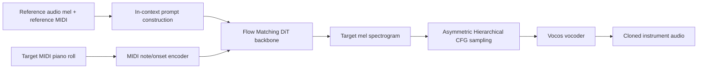
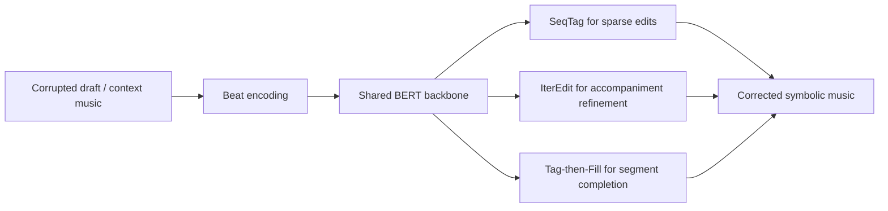
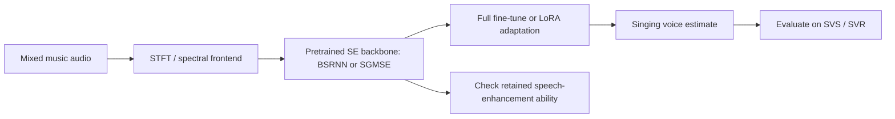
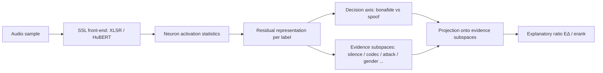
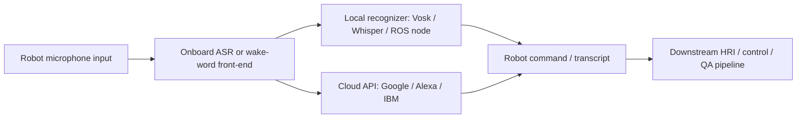

# 语音 / 音频 / 音乐论文速递
## 2026-07-14

> 实际对应 arXiv 更新日：**2026-07-14**  
> 检索范围：`cs.SD + eess.AS`  
> 只放按 ML 顶会审稿口径看，最值得多数读者花时间看的 **5 篇**

## 📋 总览

- 共收录 **5 篇** 相关论文
- 音乐生成 / 音色建模：**2 篇**
- 语音前端 / 分离：**1 篇**
- 语音安全 / 可解释性：**1 篇**
- 机器人语音系统综述：**1 篇**

今天这批里，真正值得优先看的主线有三条。第一条是“别再把条件音频硬压成一个 embedding 了”：`AnySynth` 直接把参考音频当 in-context prompt 喂给 DiT，实验上明确打穿了 CLAP 这类固定长度 timbre embedding 的上限。第二条是“编辑式生成”开始在符号音乐里像回事了：`BeatEdit` 把音乐生成改写成显式 edit 操作，不只是换个说法，而是把 encoding、edit label、backbone、速度和主观听感都闭环做出来了。第三条是“迁移比从头练更值钱”：`Teaching Speech Enhancement Models to Sing` 很务实地证明，大规模语音增强预训练可以直接迁到歌声分离，LoRA 还能把灾难性遗忘压住。

剩下两篇里，`Evidence Subspace Projection` 属于那种不会直接涨 leaderboard，但会让你更清楚 deepfake detector 到底在靠什么偷懒的工具型论文；`Casting Everything to Online API Services?` 则是综述稿，不是方法创新，但它把机器人里本地 ASR、云端 ASR、混合部署的真实工程 trade-off 讲得比很多“系统论文”还直白。

## 精选入选规则

- **新意（0-3）**：是不是提出了新的表示、接口、训练组织方式，或者把旧问题拆得更对
- **影响力（0-3）**：是不是贴近语音大模型、语音前端、音乐生成、音色建模、音频安全这些主线
- **证据强度（0-2）**：有没有像样的 baseline、消融和关键数值
- **受众匹配度（0-2）**：对语音大模型 / 语音前端 / 音乐方向 / 安全评测研究者有没有直接启发

分数校准：

- **6**：可读，但更像整理、补丁或小范围经验总结
- **7**：信息量够，值得过一遍
- **8+**：建议优先精读

## 总览表

| 方向 | 序号 | 论文 | 评分 | 关键词 |
|---|---:|---|---:|---|
| 音乐生成 / 音色建模 | 1 | AnySynth | 8.5/10 | zero-shot instrument cloning, in-context flow matching, DiT, asymmetric CFG |
| 音乐生成 / 显式编辑 | 2 | BeatEdit | 8.5/10 | symbolic music editing, Beat encoding, sequence tagging, iterative refinement |
| 语音前端 / 分离迁移 | 3 | Teaching Speech Enhancement Models to Sing | 8/10 | domain adaptation, singing voice separation, LoRA, SGMSE, BSRNN |
| 语音安全 / 可解释性 | 4 | Evidence Subspace Projection | 7.5/10 | audio deepfake detection, SSL interpretability, neuron analysis, evidence subspace |
| 机器人语音系统 | 5 | Casting Everything to Online API Services? | 6.5/10 | robotic ASR, onboard vs cloud vs hybrid, ROS, Whisper, privacy-latency tradeoff |

## 🎹 音乐生成 / 音色建模

### [1] Anysynth:Zero-Shot Instrument Cloning via In-Context Learning and Asymmetric Hierarchical Guidance

- **评分**：8.5/10
- **作者/机构**：Chong Jing, Junan Zhang, Jing Yang, Yulun Wu, Fan Fan, Zhizheng Wu；Chinese University of Hong Kong，Huawei Central Media Technology Institute
- **论文链接**：https://arxiv.org/abs/2607.11143
- **PDF**：https://arxiv.org/pdf/2607.11143.pdf
- **代码链接**：暂无
- **Demo 链接**：https://anysynth-demo.github.io/

#### 📌 简介
这篇做的是零样本乐器克隆：给一小段对齐的参考音频和参考 MIDI，再给目标 MIDI，让模型用参考乐器的音色去演奏新旋律。核心点不是“又一个 DiT”，而是它明确反对把参考音频压成 CLAP 这类固定长度 embedding，直接把未压缩参考音频当 in-context prompt，让模型靠 attention 自己去取 timbre 细节。

#### ☠️ 毒舌点评
这篇比很多“可控音乐生成”论文实在，因为它真的瞄准了 embedding bottleneck 这个老问题，而不是换个名字继续吃 CLAP。短板也很清楚：任务还集中在键盘、吉他、贝斯三大类，且论文自己写了 `rejected by ISMIR 2026`，说明审稿人显然没被完全说服；但方法和消融确实不是糊弄稿。

#### 🔧 技术方案
- **模型解决的问题**：现有 zero-shot instrument cloning 往往先把参考音频压成一个 timbre vector，再把这个向量和目标 MIDI 一起喂给生成器。这种做法天然丢掉瞬态、演奏细节和录音空间特征，音色上限被 embedding 容量卡死。`AnySynth` 要解决的是“怎么在跟随目标 MIDI 的同时，保住参考乐器的细颗粒声学身份”。
- **模型架构**：
  - **输入**：参考音频 mel spectrogram、与其对齐的参考 MIDI piano roll、目标 MIDI piano roll。
  - **输出**：目标片段 mel spectrogram，再经 vocoder 解码成波形。
  - **主干**：基于 `Flow Matching + Diffusion Transformer (DiT)` 的条件生成器。
  - **关键模块**：
    - `In-Context Conditional Flow Matching`：把参考 mel 直接放到上下文前缀，而不是先做 timbre embedding。
    - `MIDI encoding`：除了 velocity-weighted note channel，再加一个 binary onset channel，用乘法 gating 融合，专门补重复音符和边界。
    - `Asymmetric Hierarchical CFG`：把 MIDI 结构条件和参考 timbre 条件拆成分层 guidance，避免两个条件在 CFG 里互相打架。
    - `Vocos` vocoder：将生成的 mel spectrogram 解码成波形。
- **信号流**：

- **关键设计 / 核心创新**：
  - 用 reference mel 直接作为上下文前缀，绕开 CLAP / MuLan 这种固定向量表示的声学瓶颈。
  - 用 `semantic-then-acoustic` 的分层 CFG，把目标 MIDI 当结构锚点，把参考音色当后续声学细化。
  - 明确验证了 `prompt-length scaling`，说明更长参考音频会持续提升 timbre fidelity，这在 embedding-based 系统里通常做不到。
- **训练 / 推理策略**：
  - 训练数据来自 `NSynth + Slakh`，按 timbre 做 `8:2` train-test split，总训练量约 **4,760 小时**。
  - prompt 长度覆盖 `3-15s`，目标生成长度覆盖 `1.5-30s`。
  - DiT 主干为 `25 layers / hidden 1024 / 16 heads`，总参数约 **481.30M**。
  - 训练使用 `latent dimension 128`、`Adam`、峰值学习率 `1e-4`、`200k steps`、`32k warmup`，8 卡训练。
  - 推理阶段用 Euler ODE solver 做 flow matching 采样，每步并行计算三种 velocity 状态实现层级 CFG。

#### 📊 实验结果
- 数据集：`NSynth`、`Slakh`、真实录音 `MAESTRO` 与 `GuitarSet`。
- baseline：`TokenSynth`、`Control-Transfer-Diffusion (CTD)`、以及把 in-context 条件替换成 `512-d CLAP` 的 `AnySynth (CLAP)`。
- 主结果（表 1，3s/8s/15s prompt 平均）：
  - `NSynth`：`AnySynth` 的 `MERT 0.513 / PANNs 0.820 / Onset F1 0.704 / CE 5.730 / PQ 7.175`，整体优于 `TokenSynth` 的 `0.313 / 0.781 / 0.190 / 4.880 / 6.907` 和 `CTD` 的 `0.399 / 0.779 / 0.503 / 5.783 / 6.897`。
  - `Slakh`：`PANNs 0.882`、`Onset F1 0.853`，都明显高于 `CTD` 的 `0.869 / 0.625`。
  - `MAESTRO`：`Onset F1 0.894`，相比 `CTD 0.491` 优势很大，说明旋律跟随更稳。
  - `GuitarSet`：`Onset F1 0.959`，几乎贴近真实上限 `0.954`。
- prompt-length scaling（表 2）：
  - `AnySynth` 的 `PANNs` 从 `3s prompt` 的 `0.835` 提升到 `8s` 的 `0.856`，`15s` 仍保持 `0.854`；
  - `Onset F1` 从 `0.842` 升到 `0.857/0.858`，而 `CTD` 与 `TokenSynth` 不随 prompt 增长稳定收益。
- 关键消融：
  - 把 in-context prompt 换成 CLAP 后，`PANNs` 跨数据集下降 **5.3% 到 23.3%**，`MERT` 最多下降 **17.4%**。
  - CFG 消融里，作者的 Asymmetric CFG `(αm, αr)=(2.0, 1.0)` 达到 `MERT 0.494 / PANNs 0.848 / Onset F1 0.852`，比对称 CFG `(2.0, 1.0)` 的 `0.465 / 0.779 / 0.655` 明显更稳。

#### 💡 为什么值得看
这篇最值钱的地方，是它把“参考音频到底该不该压成 embedding”这个问题用完整实验钉死了。对做音色克隆、音乐 TTS、歌声 timbre transfer 的人来说，它给的是一条很清晰的路线：别先急着堆更大的 encoder，先想清楚条件信息是不是在表示层就被你压没了。

### [2] BeatEdit: Symbolic Music Generation as Explicit Editing

- **评分**：8.5/10
- **作者/机构**：Haoyu Gu, Lekai Qian, Haowu Zhou, Qi Liu, Shuai Wang；South China University of Technology，Nanjing University
- **论文链接**：https://arxiv.org/abs/2607.11124
- **PDF**：https://arxiv.org/pdf/2607.11124.pdf
- **代码链接**：**代码已开源** https://github.com/Haoyu-Gu/BeatEdit-code
- **Demo 链接**：暂无

#### 📌 简介
这篇核心观点很直接：符号音乐创作本质上不是“从零写完”，而是不断改现有草稿，所以 generation 不该只靠 autoregressive 或 diffusion 从头采样。`BeatEdit` 把 symbolic music generation 重写成显式 edit 问题，覆盖三类任务：错误纠正、伴奏编辑、片段补全，并把 edit method 能不能成立，追溯到 encoding 是否满足“可编辑性”。

#### ☠️ 毒舌点评
这是少数真正把“编辑式生成”做成体系的音乐论文，不是把 NLP 里的 edit token 硬搬过来摆拍。强点在于它连 encoding 都一起重做，还认真比了 AR、diffusion、不同 encoding、主观 MOS 和延迟。短板是目前主实验仍聚焦 piano / symbolic setting，离音频级音乐模型还有距离，但这不是它该背的锅。

#### 🔧 技术方案
- **模型解决的问题**：现有 symbolic music generation 要么左到右生成全序列，要么 diffusion 式全局去噪，都不擅长“只改该改的地方”。`BeatEdit` 要补的是 selective modification：改单音、改伴奏、补一段空缺，而不是把整首乐曲重画一遍。
- **模型架构**：
  - **输入**：基于 `Beat encoding` 的符号音乐 token 序列，可包含带噪草稿、保留上下文、局部缺失片段。
  - **输出**：修正后的目标 token 序列。
  - **主干**：共享一个 `BERT` encoder（8 层、hidden 512、约 **26.6M** 参数）做 MLM 预训练，然后接不同 editing heads。
  - **关键模块**：
    - `Beat encoding`：beat-grid 对齐的音乐表示，满足原子编辑单元、平凡 source-target 对齐、局部编辑约束。
    - `SeqTag`：针对稀疏错误，用 token 级 edit label 做序列标注。
    - `IterEdit`：针对密集伴奏修改，使用 delete-insert-predict 的迭代精修。
    - `TagFill`：针对整段补全，先打标签再在 mask 位置填充。
    - `SHIFT` 操作：处理相对音高编码下的级联偏移问题。
- **信号流**：

- **关键设计 / 核心创新**：
  - 先形式化编辑式生成的三个表示层需求 `R1/R2/R3`，再证明 Beat encoding 比 `REMI`、`CPWord`、`Structured`、`MIDI-Like` 更适合 edit-based generation。
  - 同一 backbone 上同时支持三种 edit density，不是给每个任务各写一套模型。
  - 系统展示了 `encoding × method` 的交互效应，证明 encoding 不是附属品，而是主变量。
- **训练 / 推理策略**：
  - 数据：`192K` piano pieces 做 BERT MLM 预训练。
  - SeqTag 针对错误纠正做单步编辑，利用 detection head 控制过编辑。
  - IterEdit 用多头删除、插入、填充联合训练，最多迭代多轮完成伴奏精修。
  - TagFill 先定位空洞结构，再只在 mask 位置做条件填充。
  - 单次推理速度很快：单步编辑模型普遍在 **100 ms 内**，适合交互式使用。

#### 📊 实验结果
- 对比编码（表 3）：
  - 最优 `Beat (Abs, Sep)` 达到 `note_f1 0.940`、`recovery 48.1%`、`MPE 0.087`。
  - `REMI` 只有 `note_f1 0.893 / recovery 10.0% / MPE 0.183`。
  - `MIDI-Like` 甚至低于 no-edit 基线，BERT MLM 困在 `PPL 8.18`，说明它压根不适合 edit paradigm。
- 主任务结果（表 4）：
  - **错误纠正**：`SeqTag` 达到 `beat exact match 0.726 / note_f1 0.855 / FMD 0.15`；`IterEdit` 也有 `0.719 / 0.849 / 1.03`。最好 generative baseline `AR-Detect` 只有 `0.394 / 0.650 / 1.24`。
  - **伴奏编辑**：`IterEdit` 最强，`beat 0.480 / nf1 0.607 / FMD 1.19`，优于 `SeqTag 0.408 / 0.574 / 2.56` 和 `Diffusion 0.200 / 0.372 / 2.75`。
  - **片段补全**：`TagFill` 最强，`beat 0.436 / nf1 0.557 / FMD 0.27`，明显高于 `Anticipatory` AR baseline 的 `0.069 / 0.027 / 5.69`。
- 速度（表 30）：
  - `SeqTag`：纠错 `65 ms`，编辑 `57 ms`
  - `IterEdit`：纠错 `273 ms`，编辑 `655 ms`，补全 `82 ms`
  - `AR-Prompt`：补全 **23,654 ms**
  - 说明 edit-based 方法的效率优势不是一点点快，而是范式级别差距。
- 主观 MOS（表 6）：
  - 编码对比中，`Beat-C + SeqTag` 的平均 MOS **4.24**，明显高于 `REMI + SeqTag 2.80`、`CPWord + SeqTag 2.69`、`Structured + SeqTag 2.45`。
  - 方法对比里，错误纠正 `SeqTag 4.21`、`IterEdit 4.13`，显著高于 `Diffusion/CMLM 3.25` 和 `AR-Detect 3.05`。

#### 💡 为什么值得看
这篇值得看的不是“它又赢了几个 baseline”，而是它把 edit-based generation 在音乐里从概念讲成了完整技术路线。对做 symbolic music、MIDI 编辑、交互式音乐生成的人来说，这篇会直接改变你对“生成”和“修改”边界的建模方式。

## 🎤 语音前端 / 分离迁移

### [3] Teaching Speech Enhancement Models to Sing: Domain Adaptation from Speech Enhancement to Singing Voice Separation

- **评分**：8/10
- **作者/机构**：Paul A. Bereuter, Mark D. Plumbley, Alois Sontacchi；University of Music and Performing Arts Graz，King’s College London
- **论文链接**：https://arxiv.org/abs/2607.11630
- **PDF**：https://arxiv.org/pdf/2607.11630.pdf
- **代码链接**：**代码已开源** https://github.com/pablebe/se2svs
- **Demo 链接**：https://pablebe.github.io/se2svs-webpage/

#### 📌 简介
这篇不是重新发明歌声分离，而是问了一个更实际的问题：既然语音增强已经有大规模标注数据和成熟模型，能不能把它们迁到 singing voice separation，少走从头训练的弯路？作者拿一个判别式 `BSRNN` 和一个生成式 `SGMSE` 做迁移，比较 full fine-tune 和 LoRA 两条路线。

#### ☠️ 毒舌点评
这类“把 A 迁到 B”论文很容易水，因为很多时候结果只是“多训点就更好”。这篇的价值在于它认真量了 trade-off：SVS 涨了多少，SE 掉了多少，LoRA 多花了多少参数，生成式模型是不是更能泛化。它不花哨，但非常适合现在资源紧、数据少的歌声分离场景。

#### 🔧 技术方案
- **模型解决的问题**：歌声分离标注数据远少于语音增强，`MUSDB18-HQ + MoisesDB` 合起来也就三十多小时，而 SE 预训练语料能到几百小时。作者要解决的是“能否把 SE 里学到的 vocal recovery 表示迁到 SVS，并控制灾难性遗忘”。
- **模型架构**：
  - **输入**：48 kHz 的混合音频，STFT 频谱表示。
  - **输出**：歌声目标信号；训练时主目标是 `SVS`，额外用 `SVR` 做 out-of-domain 泛化分析。
  - **主干**：
    - 判别式：`BSRNN`，band-split recurrent mask estimator。
    - 生成式：`SGMSE`，基于 score-based diffusion / SDE 的复频谱去噪模型。
  - **关键模块**：
    - `Full fine-tuning`：更新全部预训练参数。
    - `LoRA`：只在关键线性层与卷积层上加低秩适配分支。
    - `SVS / SVR / SE` 三任务统一评估，显式衡量迁移收益与遗忘。
- **信号流**：

- **关键设计 / 核心创新**：
  - 把 SVS 明确建模成从 SE 到 SVS 的 domain adaptation，而不是把它当完全独立任务。
  - 同时比较判别式与生成式迁移路线，避免只在一个 backbone 上讲故事。
  - 用 LoRA 的“可关闭适配分支”特性，保住原始 SE 能力。
- **训练 / 推理策略**：
  - 预训练：
    - `BSRNN` 来自 `URGENT`，约 **700 h** SE 数据。
    - `SGMSE` 来自 `EARS-WHAM`，约 **87 h**。
  - 适配数据：`MUSDB18-HQ + MoisesDB`，约 **35 h**，随机 gain 和 random mixing 增广。
  - 统一采样率 `48 kHz`。
  - `BSRNN` 用 `20% L1 waveform + 80% SI-SDR` 复合损失。
  - `SGMSE` 用 conditional denoising score matching，推理用 `45 diffusion steps` 的 predictor-corrector sampler。
  - `LoRA`：
    - BSRNN 试了 `r ∈ {16, 32, 128}`。
    - SGM 固定 `r=16, α=32`。
  - 全部模型训练 `550 epochs`，以 `GenSVS` 上最佳 SDR 选 checkpoint。

#### 📊 实验结果
- 数据与评测：
  - SE：`EARS-WHAM`
  - SVS：`GenSVS`
  - SVR / out-of-domain：`MSRBench`
  - 指标：`SDR`、`MR-Loss`、`MERT-MSE`，以及 SE 的 `SI-SDR / PESQ / DistillMOS`
- 关键结果（表 1）：
  - **SGM full fine-tuning**：
    - `GenSVS SDR 7.62`
    - `MSRBench SDR 9.24`
    - 但 `EARS-WHAM PESQ 2.09`，比 base `2.49` 明显掉。
  - **SGM LoRA-16**：
    - `GenSVS SDR 7.23`
    - `MSRBench SDR 9.05`
    - `EARS-WHAM PESQ 2.49`，几乎保住原始 SE 能力。
  - **BSRNN full fine-tuning**：
    - `GenSVS SDR 9.87`
    - `MSRBench SDR 10.11`
    - 是全表最强的适配结果之一。
  - **BSRNN LoRA-32**：
    - `GenSVS SDR 8.92`
    - `MSRBench SDR 9.56`
    - 只加 **12.12%** 参数，保留超过 **90%** full fine-tune 的 SVS 表现。
- 泛化差值（表 2）：
  - `SGM from scratch` 从 `GenSVS` 到 `MSRBench` 的 `ΔSDR = +1.89`，高于 `BSRNN from scratch` 的 `+1.15`。
  - `SGM LoRA-16` 也有 `ΔSDR = +1.82`，说明生成式迁移在 out-of-domain 上更稳。
- 对比参考：
  - `MelRoFormer (L)` 在 SVS / SVR 上还能更高，但参数量是它们的 **3 倍以上**，且用了额外未披露数据；作者没有回避这个短板。

#### 💡 为什么值得看
这篇最值得看的点，是它把“先做大规模相近任务预训练，再用小数据迁移”的逻辑在歌声分离上量化清楚了。对资源有限的团队来说，这比再堆一个新 backbone 更有现实意义，尤其是 LoRA 路线几乎就是现成可抄的工程方案。

## 🛡️ 语音安全 / 可解释性

### [4] Evidence Subspace Projection: Measuring How Much Evidence Explains Deepfake Detection in Self-Supervised Speech Models

- **评分**：7.5/10
- **作者/机构**：Yixuan Xiao, Cheng-Wei Lin, Xin Wang, Yassine El Kheir, Arnab Das, Tim Polzehl, Sebastian Möller, Ngoc Thang Vu；University of Stuttgart，National Institute of Informatics，DFKI，Technical University of Berlin
- **论文链接**：https://arxiv.org/abs/2607.11538
- **PDF**：https://arxiv.org/pdf/2607.11538.pdf
- **代码链接**：**代码已开源** https://github.com/XIAOYixuan/ESP
- **Demo 链接**：暂无

#### 📌 简介
这篇做的不是新 detector，而是给 SSL-based audio deepfake detection 做可解释性解剖。作者想回答两个问题：冻结的 SSL front-end 里到底已经编码了什么 deepfake 线索；微调和后训练之后，模型的检测决策又更依赖哪些“证据因子”，比如静音结构、codec、性别、攻击类型。

#### ☠️ 毒舌点评
这是典型“不直接涨榜，但能阻止你自欺欺人”的论文。它的实验不会让人热血沸腾，但如果你做 deepfake detection 却从没量过模型是不是在靠 silence shortcut、within-spoof bias 或 dataset artifact，这篇就是补课文。缺点也有：它测的是 explanatory overlap，不是严格因果；所以别把结果当最终真理。

#### 🔧 技术方案
- **模型解决的问题**：很多 deepfake detector 在 in-domain 很强，但一出数据集就垮。问题往往不是 back-end 不够大，而是 SSL front-end 学到的“证据”本身有 shortcut。`Evidence Subspace Projection` 要解决的是“怎样定量衡量某类证据对 spoof / bonafide 决策轴的解释度”。
- **模型架构**：
  - **输入**：音频样本，经 SSL 模型前端抽特征，再通过 HuBERT quantizer 做 frame-level tokenization。
  - **输出**：不是新的分类器输出，而是每类 evidence group 对检测决策轴的 `EΔ / erank` 解释比率。
  - **主干**：对 `XLSR`、`HuBERT` 在 frozen、fine-tuned、post-trained 三种状态下做 neuron activation analysis。
  - **关键模块**：
    - `Neuron Activation Probability`：统计某类 token 下哪些 FFN neuron 被稳定激活。
    - `Residual Representation`：构建 label 的 one-vs-rest contrast vector。
    - `Evidence Subspace Projection`：把 spoof decision axis 投影到 evidence subspace 上，得到解释度分数。
    - evidence groups 包括 `Vocoder`、`Attacks*`、`Attacks`、`Codec`、`Transmission`、`Gender`、`Silence`、`HN`、`Frequency`。
- **信号流**：

- **关键设计 / 核心创新**：
  - 把 detector 可解释性从 sample feature 空间挪到 neuron activation space，避免把 front-end 与 back-end 混在一起解释。
  - 用统一的 `EΔ / erank` 指标跨 evidence group 比较“模型到底靠什么在做决定”。
  - 同时比较 frozen、fine-tuned、post-trained 三种训练状态，能看到 shortcut 是怎么被放大或压制的。
- **训练 / 推理策略**：
  - 模型：`300M` 级 `XLSR` 与 `HuBERT`。
  - 状态：`frozen`、`FT-19`（在 ASV19 微调）、`FT-5`（在 ASV5 微调），以及 `XLSR PT`（大规模 post-training）。
  - 数据：`ASV19`、`ASV21LA`、`ASV21DF`、`ASV5`，外加未见过的 `ASV19-dev` 与 `ITW`。
  - 分类 back-end 刻意做得很轻：一个简单 `MLP`，就是为了把影响尽量留在 SSL front-end。

#### 📊 实验结果
- 对比模型与深假检测 EER（表 1，`XLSR` 对比 `HuBERT`）：
  - 在 `ASV19` 训练下，`XLSR` 在 `ASV19 / ASV21LA / ASV21DF / ASV5` 上分别是 `0.25 / 5.37 / 3.81 / 17.98`，都优于对应 `HuBERT` 的 `0.53 / 7.66 / 5.91 / 22.47`。
  - 在 `ASV5` 训练下，`XLSR` 仍优于 `HuBERT`：例如 `ASV5 5.69 vs 10.05`。
- frozen 模型 shortcut 发现（图 3）：
  - `Silence` 在 `ASV19-test` 上的 `EΔ / erank` 超过 **10%**，但在 `ITW` 低于 **0.5%**，说明 silence 是很强但明显 dataset-specific 的 shortcut。
  - `Gender` 一直接近正交，`EΔ / erank` 多数低于 **1.4%**，说明性别不是主要决策依据。
  - `Codec`、`Transmission` 在 HuBERT 上 consistently 高于 XLSR，说明不同 SSL front-end 对信号级伪迹的敏感方式不同。
- 微调 / 后训练影响（图 2 与结论）：
  - fine-tuning 会降低 `Vocoder / Attacks / Attacks*` 这类 within-spoof alignment，说明模型更少依赖“某一类 spoof 长得更像 bonafide”的偏置。
  - 但在 `ASV19` 这种更同质的数据上，fine-tuning 会放大 `Silence / HN / Frequency` 的依赖。
  - `post-training` 能把多数 signal-level dependency 压回接近 frozen 水平，但 `silence` 仍有残留，比如文中明确写到在 `ASV19` 上还保留 `+8.1%` 的 silence explanatory change。

#### 💡 为什么值得看
这篇最值钱的是方法论：它让你不再只看 EER，而是能具体回答“这个 detector 是不是在靠静音、codec、攻击簇偏置过活”。对做音频 deepfake detection、鲁棒性评估、front-end 选择的人来说，这比再盲目微调一个更大的 backbone 更有用。

## 🤖 机器人语音系统 / 部署综述

### [5] Casting Everything to Online API Services? A Survey of Integrating Localized Speech Recognition Models in Robotic Systems

- **评分**：6.5/10
- **作者/机构**：Sheng Li, Jing Li, Felix Schijve, Jun Hu, Emilia Barakova；Institute of Science Tokyo，Eindhoven University of Technology
- **论文链接**：https://arxiv.org/abs/2607.11792
- **PDF**：https://arxiv.org/pdf/2607.11792.pdf
- **代码链接**：暂无
- **Demo 链接**：暂无

#### 📌 简介
这篇不是方法论文，而是机器人里 ASR 集成的 narrative survey。它想回答一个很工程的问题：机器人语音识别是不是只能一股脑丢给在线 API，还是应该在本地、云端、混合部署之间按场景拆解。

#### ☠️ 毒舌点评
如果你想看新模型，这篇不适合；它没有新架构，也没有新 benchmark。它的价值是把“Whisper、OWSM、MMS、ROS、Vosk、Google Cloud、Alexa、隐私、延迟、网络依赖”这些平时散落在系统文档里的东西，整理成了一个能直接指导机器人语音系统选型的框架。问题是它自己也承认不是 systematic review，所以别拿它当完备证据库。

#### 🔧 技术方案
- **模型解决的问题**：机器人语音系统在真实部署里同时受噪声、算力、网络、隐私、响应时延约束。本文要解决的不是识别准确率本身，而是“如何在机器人系统中组织和集成 ASR 模型与部署策略”。
- **模型架构**：
  - **输入**：机器人麦克风语音流。
  - **输出**：识别文本，以及在某些平台上进一步进入命令理解或语义交互链路。
  - **主干**：这不是单一模型，而是一个系统综述框架：
    - ASR 模型族：`GMM-HMM`、`DNN-HMM`、`CTC`、`Transformer`、`Whisper`、`OWSM`、`MMS`。
    - 部署策略：`Onboard`、`Cloud-based`、`Hybrid`。
    - 运行框架：`ROS / ROS2`、本地 toolkit、云 API。
  - **关键模块**：
    - 本地路径：`PocketSphinx`、`Vosk`、`Whisper` 的 ROS 节点。
    - 云端路径：`Google Speech-to-Text`、`Amazon Alexa Voice Service`、`IBM Watson`。
    - 混合路径：wake word / 简单命令本地处理，复杂 query 上云。
- **信号流**：

- **关键设计 / 核心创新**：
  - 文章的“创新”不在模型，而在把部署问题明确分成 `latency / privacy / connectivity / hardware footprint` 四维 trade-off。
  - 给出了机器人语音场景里最有操作性的三类 deployment pattern，而不是泛泛列工具。
  - 把 speech foundation model 与机器人部署放到同一张系统图里讨论，这对工程选型有现实意义。
- **训练 / 推理策略**：
  - 这是一篇综述，不存在统一训练流水线。
  - 但文中明确点到：
    - `Whisper` 预训练约 **680k 小时** 音频；
    - `LibriSpeech` 约 **1000 h**；
    - `GigaSpeech` **10,000 h** 高质量转录、另有 **33,000+ h** 无监督/半监督数据；
    - `WenetSpeech` **10,000+ h** 普通话语料。
  - 推理层面，文章重点强调响应延迟、网络依赖与隐私保护的权衡，而不是单纯 WER。

#### 📊 实验结果
- 这篇没有方法论文那种统一数值表，而是给了系统部署对比表：
  - `Onboard`：低且可预测的 latency，高隐私，不依赖网络，适合离线、隐私敏感、时间关键命令。
  - `Cloud-based`：latency 取决于网络，隐私较低，需要联网，适合开放域交互和频繁更新的大模型服务。
  - `Hybrid`：常规命令低延迟，本地可做；复杂请求再上云，是 HRI 里最实际的折中。
- 文章还明确指出公开结果难以直接对比，因为不同平台的硬件、噪声条件、任务复杂度差异太大，并建议未来机器人 ASR 报告至少同时给：
  - `WER / CER`
  - end-to-end latency
  - hardware footprint
  - connectivity assumptions
  - privacy constraints
- 这不是传统“实验 SOTA”，但它给的是部署 benchmark 应该怎么写的清单，这点反而比空泛综述更有用。

#### 💡 为什么值得看
如果你正在做机器人语音交互，这篇值得看的不是模型名字，而是它把本地、云端、混合三条路线的优劣讲清楚了。很多团队现在还在默认“直接调云 API 最省事”，这篇会提醒你：一旦涉及隐私、断网、实时控制，这个默认选项经常是错的。

## 最后结论

今天最值得优先看的顺序，我会排成这样：

1. `AnySynth`
   这是今天最像“方法上真往前推了一步”的一篇。它把 in-context 条件建模在音乐音色克隆里做出了硬结果，对做音色控制、音乐生成、歌声 timbre 建模的人都很有启发。
2. `BeatEdit`
   如果你做 symbolic music、交互式创作工具、MIDI 编辑，这篇非常值得细读。它不是单点提分，而是在改 generation 的任务定义。
3. `Teaching Speech Enhancement Models to Sing`
   对歌声分离和前端任务最实用，尤其是数据少、算力一般的团队。LoRA 迁移这条线非常落地。
4. `Evidence Subspace Projection`
   对 deepfake detection / 可解释性有方法论价值，适合做安全和鲁棒性的团队。
5. `Casting Everything to Online API Services?`
   不是 SOTA 论文，但如果你正在搭机器人语音系统，它比很多“新模型速报”更能帮你少踩坑。

整体看，`2026-07-14` 这批论文的共同趋势不是“模型更大”，而是三件更成熟的事：条件信息别瞎压、编辑式生成别再假装不存在、跨任务迁移要把 trade-off 量清楚。这个方向是对的，也比单纯刷榜更值得跟。
