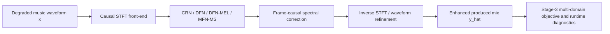
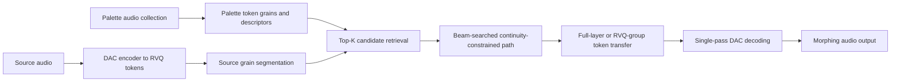
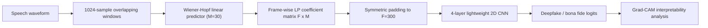
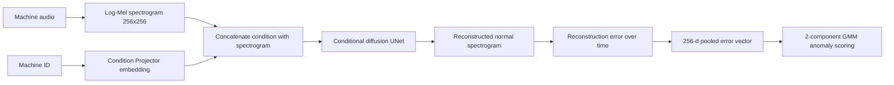
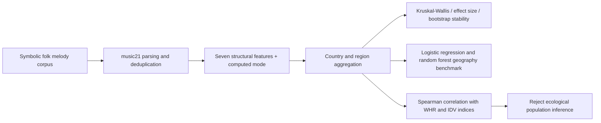

# 语音 / 音频 / 音乐论文速递
## 2026-07-15

> 实际对应 arXiv 更新日：**2026-07-15**  
> 检索范围：`cs.SD + eess.AS`  
> 只放按 ML 顶会审稿口径看，最值得多数读者花时间看的 **5 篇**

## 📋 总览

- 共收录 **5 篇** 相关论文
- 音乐前端 / 实时音频系统：**2 篇**
- 音频安全 / 工业检测：**2 篇**
- 音乐理解 / MIR 负结果研究：**1 篇**

今天这批不属于“谁又堆了个更大模型”的日子，反而更像工程派和方法论派的交接班。最值得先看的主线有三条。第一条是 `Low-Latency Neural Models for Real-Time Music Enhancement`，它没装神弄鬼，直接把“实时音乐增强到底能不能稳定比原输入更好”这件事拆开测，结论很诚实：能跑实时，但别幻想一个 always-on 模型包治百病。第二条是 `Explainable-by-Design Audio Deepfake Detection via Wiener-Hopf Linear Prediction`，这篇用极小模型和物理可解释特征，把 deepfake 检测从黑箱大网络往可辩护的法证路线拉了一步。第三条是 `Neural Morphing`，它证明 neural codec 不只是拿来压缩和做 token 生成，直接做训练外的 token-domain 音频效果器也能跑起来，而且连实时插件约束都认真测了。

剩下两篇里，`UD-ASD` 是比较稳的工业音频检测稿，思路不算新，但把“一台机器一个模型”的老问题收拾得比较干净；`Open-Source Intelligence and Music Information Retrieval for Geographic Attribution of Musical Affect and the Ecological Limits of Population Inference` 则是标准的“负结果比正结果更值钱”论文，它不是语音主线，但对做音乐理解、文化计算和数据解释的人很有提醒价值。

## 精选入选规则

- **新意（0-3）**：是不是提出了新的表示、接口、训练组织方式，或者把旧问题拆得更对
- **影响力（0-3）**：是不是贴近语音前端、音频安全、codec、音乐生成、音乐理解这些主线
- **证据强度（0-2）**：有没有像样的 baseline、消融和关键数值
- **受众匹配度（0-2）**：对语音大模型 / 语音前端 / 音乐方向 / 安全评测研究者有没有直接启发

分数校准：

- **6**：可读，但更像经验整理、分析框架或边缘分支
- **7**：信息量够，值得过一遍
- **8+**：建议优先精读

## 总览表

| 方向 | 序号 | 论文 | 评分 | 关键词 |
|---|---:|---|---:|---|
| 音乐前端 / 实时音频系统 | 1 | Low-Latency Neural Models for Real-Time Music Enhancement | 8.5/10 | causal enhancement, FINALLY-style curriculum, MFN-MS, 44.1kHz real-time |
| 音频安全 / 可解释检测 | 2 | Explainable-by-Design Audio Deepfake Detection via Wiener-Hopf Linear Prediction | 8/10 | Wiener-Hopf, linear prediction, lightweight CNN, Grad-CAM |
| 音频编辑 / neural codec | 3 | Neural Morphing: Sequence-Optimized Token-Level Morphing in Neural Audio Codecs | 8/10 | RVQ-group transfer, beam search, token-domain effect, realtime plugin |
| 工业音频检测 | 4 | UD-ASD: A Unified Diffusion Model for Anomalous Sound Detection | 7.5/10 | conditional diffusion, machine ID conditioning, GMM scoring, DCASE 2022 |
| 音乐理解 / MIR | 5 | Open-Source Intelligence and Music Information Retrieval for Geographic Attribution of Musical Affect and the Ecological Limits of Population Inference | 6.5/10 | symbolic MIR, folk melody geography, ecological fallacy, negative result |

## 🎛️ 音乐前端 / 实时音频系统

### [1] Low-Latency Neural Models for Real-Time Music Enhancement

- **评分**：8.5/10
- **作者/机构**：Emmanouil Karystinaios, Jonathan Greif, David Nadrchal, Paul Primus, Gerhard Widmer；Johannes Kepler University Linz
- **论文链接**：https://arxiv.org/abs/2607.12872
- **PDF**：https://arxiv.org/pdf/2607.12872.pdf
- **代码链接**：**代码已开源** https://github.com/manoskary/audio-enhancement
- **Demo 链接**：暂无

#### 📌 简介
这篇做的不是“我又发明了一个最强音乐增强模型”，而是把实时音乐增强这个长期被语音增强顺手带过的话题，真正按音乐任务重新定义了一遍。作者一边拿 speech enhancement 的轻量 causal 模型做迁移，一边补了一个音乐向的 `MusicFilterNet-MS`，再把训练目标、评测指标、实时性和失败模式一起拉到同一张桌子上比。

#### ☠️ 毒舌点评
这篇最值钱的地方恰恰是不吹。很多增强论文只报一两个顺手指标，然后默认“增强=更好”；这篇直接告诉你，在音乐场景里，模型很可能一边把噪声抹掉，一边把原本想保留的制作感和立体声结构也抹掉。它不是范式革命，但它比一堆“指标涨了所以任务 solved”的稿子靠谱得多。

#### 🔧 技术方案
- **模型解决的问题**：语音增强的 causal 低延迟模型已经很成熟，但音乐信号有更宽频带、更强动态、更密集的重叠源和更敏感的制作风格约束，直接套 speech recipe 往往会把“修复”做成“误伤”。这篇解决的是“在 44.1 kHz、严格因果、真实时约束下，音乐增强到底该怎么定义、怎么训、怎么测”。
- **模型架构**：
  - **输入**：44.1 kHz 退化音乐波形，经 STFT 变成流式时频帧；退化类型包含 EQ、动态压缩、混响、幅度缺陷、立体声问题和噪声。
  - **输出**：尽量恢复到“制作完成后的目标混音”而不是 stem 级分离结果的增强波形。
  - **主干**：四类 causal 模型并行比较，分别是 `CRN`、`DFN`、`DFN-MEL`，以及作者提出的 `MFN-MS`。
  - **关键模块**：
    - `FINALLY-inspired` 三阶段训练日程，但不引入 speech SSL encoder 和人类反馈；
    - `MFN-MS` 中的 mel-domain 处理、绝对频率编码、局部时频编码器、gated deep filtering、平滑 EQ/gain head、轻量 waveform refiner；
    - 显式的 level-preservation、log-mel 和 instantaneous-frequency 约束，避免模型只对某一类客观指标投机。
- **信号流**：

- **关键设计 / 核心创新**：
  - 把目标重新定义为恢复“intended produced mix”，而不是把所有偏离都当噪声。
  - 三阶段训练从 `MR-STFT` 重建，过渡到 adversarial refinement，再到音乐向复合目标，逻辑比直接堆一锅 loss 清楚得多。
  - `MFN-MS` 不是为了刷榜，而是专门用来回答“音乐专用结构到底补了什么、又会在哪些退化上翻车”。
- **训练 / 推理策略**：
  - 训练数据覆盖 `SonicMaster`、`M&N` 以及 GuitarSet、VocalSet、SynthSOD、MAESTRO、FiloBass 等 instrument 数据。
  - 音频统一到 **44.1 kHz**，STFT `window=1024`、`hop=512`，训练时用随机 **2 秒** chunk。
  - 优化器使用 `AdamW`，学习率 `5e-4`，权重衰减 `1e-4`。
  - 三阶段目标分别是多分辨率谱重建、加入 adversarial/feature matching、再加入 `SI / PE-SI / L1-dB / MR-STFT / log-mel / IF / gain` 复合约束。
  - 流式推理使用 batch size 1、1024 sample causal block；算法延迟固定为 **23.2 ms**。

#### 📊 实验结果
- 数据集与评测：
  - `M&N` 更偏加噪与信号保真；
  - `SonicMaster` 更偏真实制作退化和多指标 restoration。
- 主要 baseline：
  - 实时：`CRN Stage 3`、`DFN Stage 3`、`DFN-MEL Stage 3`
  - 音乐专用：`MFN-MS Stage 3`
  - 离线参考：`MusicECAN`、`SonicMaster`
- 关键数值：
  - 在 `M&N` 上，`CRN Stage 3` 的 `MM-SNR 7.048`、`SI-SNR 4.556` 是实时模型里最强，明显高于退化输入的 `5.336 / 3.509`。
  - `MFN-MS Stage 3` 在 `M&N` 上的 `FAD 0.640` 与退化输入持平，但 `ZIM 2.428` 高于输入的 `2.391`，说明它更像“保守修补”，不是一味猛修。
  - 在 `SonicMaster` 上，退化输入的 `MM-SNR` 已有 `8.477`，反而多数模型会把它拉低：
    - `CRN Stage 3` 到 `5.511`
    - `DFN-MEL Stage 3` 到 `2.794`
    - `MFN-MS Stage 3` 到 `4.330`
    但 `MFN-MS` 的 `KL` 从 `0.077` 略降到 `0.074`，说明“某些统计意义的改善”和“整体更像原制作”并不总是同一回事。
  - 实时性方面，四个 causal 模型在 GPU 上每个 **23.2 ms** block 只需 **2.46-2.65 ms**，`RTF 0.106-0.114`，都真能实时跑。
  - 分类诊断里，`MFN-MS` 对 `stereo` 退化的 `MM` 增量是 **-0.0725**，是最明显的负项，直接说明这类模型目前还不够懂立体声。
- 对比结论：
  - `MusicECAN` 在 `M&N` 上 `MM-SNR 8.596 / SI-SNR 5.532` 更强，但它是离线音乐去噪模型，不是严格实时对手。
  - `SonicMaster` 在 `SonicMaster` 数据集上 `FAD 0.072 / KL 0.008` 最好，但它的 `MM-SNR 2.021`、`SI-SNR -3.309` 很一般，说明不同指标家族确实会互相打架。

#### 💡 为什么值得看
这篇最值得看的不是哪个模型名，而是它把“实时音乐增强”从一句模糊需求拆成了可验证的工程问题：延迟、数据分布、退化类型、指标冲突、是否该默认 passthrough，全都摆明了。对做音乐前端、直播修音、边缘设备音频处理的人来说，这比再看一个离线大模型刷 FAD 有用得多。

#### 评分：8.5/10
理由：问题真、实验硬、结论诚实，而且直接指出了 stereo-aware 与 degradation-aware routing 这两个后续突破口。扣分点是它更像高质量 benchmark+analysis，不是那种单篇就把任务推到下一代的范式稿。

### [3] Neural Morphing: Sequence-Optimized Token-Level Morphing in Neural Audio Codecs

- **评分**：8/10
- **作者/机构**：Emmanouil Karystinaios；Johannes Kepler University Linz
- **论文链接**：https://arxiv.org/abs/2607.12725
- **PDF**：https://arxiv.org/pdf/2607.12725.pdf
- **代码链接**：暂无
- **Demo 链接**：暂无

#### 📌 简介
这篇做的是 training-free 的 codec token 音频变形效果器。它不训练新的生成模型，而是把源音频和“调色板”音频都编码成 neural codec token，然后在 token grain 级别做匹配、路径优化和 RVQ 分组替换，最后再解码回波形。目标不是还原某个 ground truth，而是保住源的节奏和宏观组织，同时把调色板的 timbre 细节刷进去。

#### ☠️ 毒舌点评
这是典型的“看起来像 demo paper，其实工程量很扎实”的稿子。它的短板也很明显：主要实验集中在鼓和打击乐，没有严格听感实验，FAD 这类指标本身也不适合被当偏好分数吹得太满。但作者至少没装自己在做通用音频生成，而是老老实实把 deployable plugin 的约束说清楚了，这点比很多 latent editing 论文强。

#### 🔧 技术方案
- **模型解决的问题**：传统音频 morphing 要么在频谱域插值，容易糊；要么做 corpus mosaicing，难以获得现代 neural codec 的细节表达。`Neural Morphing` 解决的是“能不能直接在 pretrained codec 的离散 token 空间里做可控、无需再训练的音色迁移效果器，并且真的能塞进 VST3/AU 工作流里”。
- **模型架构**：
  - **输入**：源音频波形，以及由多段 palette audio 组成的调色板。
  - **输出**：保留源节奏组织、但带有调色板颜色的 morph 后音频。
  - **主干**：基于 pretrained `DAC` 的 token-domain 编辑链路。
  - **关键模块**：
    - `RVQ-group transfer`：把 9 个 codebook 分成 coarse / middle / fine 三组，不做粗暴整层替换。
    - `Continuity-constrained selection`：在候选 grain 上做 beam/Viterbi 风格路径优化，抑制文件切换抖动。
    - `JUCE-based VST3/AU` 插件实现：把 palette rebuild、descriptor cache、wet FIFO 和 backend health checks 真做进了部署链。
- **信号流**：

- **关键设计 / 核心创新**：
  - 不是把 palette 当风格 embedding，而是保留 codec grain 级局部结构，做“局部颜色迁移”。
  - `coarse/middle/fine` 分组替换提供了真正可听的 structure/detail 轴，不是只多了个参数旋钮。
  - continuity term 奖励同文件相邻 grain，惩罚频繁跳文件，让音色切换不再像抽风。
- **训练 / 推理策略**：
  - 这套方法**完全不训练新模型**，只调用已有 DAC 编码器/解码器。
  - DAC 设置为 **44.1 kHz**、**9 个 RVQ codebook**、约 **87 token frames/s**。
  - 调参默认使用 `G=7`、`H=2`、`K=96`、`ρ=0.30`；RVQ 诊断中 `θ=0.55`、`top-k=7`、`τ=0.47`。
  - 插件实时延迟定义为 `max(256, 2Bblk)` samples，且失败时不会直接断音，而是退回 dry / cache / skip update 路径。

#### 📊 实验结果
- 数据与评测：
  - 调色板使用 **247** 个 `Freesound` 片段；
  - 源/参考片段来自 `WaivOps Lo-Fi Drums corpus` 的独立 **8 秒** crop；
  - 主要围绕打击乐场景测 `FAD`、`spectral convergence`、`log-spectral distance`、`jitter`、`envelope correlation`、`RTF`。
- 主要 baseline / 对比：
  - `Beam RVQ`
  - `Beam full`
  - `Greedy full`
  - `Greedy RVQ`
  - 诊断对比里还有 `Greedy`、`Smooth`、`Beam`、`Viterbi`
- 关键数值：
  - 主 ablation 表中，`Beam RVQ` 的 `FAD 1.134`、`SC 1.307`、`LSD 27.04`、`Jit 11.52k`、`EnvC 0.986`、`RTF 0.217`。
  - `Greedy RVQ` 的 `Jit 24.66k`，几乎是 `Beam RVQ` 的两倍，说明 sequence optimization 的价值不是玄学。
  - `Beam full` 与 `Greedy full` 的 `FAD` 都是 **0.172**，`EnvC 0.999` 极高，但这是更保守的“整层替换”，创意空间没 RVQ 模式大。
  - 路径连续性诊断里：
    - `Greedy` 文件切换率 **78.1%**
    - `Beam` 降到 **35.2%**
    - `Viterbi` 可到 **19.4%**，但 sequence runtime 飙到 **12830 ms**，实时基本别想。
  - chunked parity 里，chunk size 从 `8192 -> 32768` 时，`SC 0.355 -> 0.291`、`LSD 10.60 -> 8.68`、`EnvCorr 0.983 -> 0.988`，说明更大块确实更接近离线全上下文，但响应性会差。
  - palette scaling 测试下，`beam + RVQ-group` 在 `32-247` clips 范围的中位 `RTF` 仍维持在 **0.229-0.237**。
- 结论：
  - beam search 明确减少抖动；
  - RVQ-group transfer 明确提供了比 full-layer 更有用的结构/细节控制；
  - 真正的上限还受限于感知验证没做完。

#### 💡 为什么值得看
如果你做 neural codec、音频编辑或者音乐插件，这篇很值得看，因为它展示了一个经常被忽视的方向：token 不只是生成模型的中间语言，也可以直接变成交互式音频效果器的操作对象。它把“可部署”三个字当真了，这比单纯再做一个 latent interpolation demo 有意思得多。

#### 评分：8/10
理由：方法新鲜，工程实现完整，实时诊断做得像样。扣分点是任务范围还比较窄，且没有受控听感实验，所以它现在更像一条非常有潜力的产品化支线，而不是已经闭环的通用研究答案。

## 🛡️ 音频安全 / 工业检测

### [2] Explainable-by-Design Audio Deepfake Detection via Wiener-Hopf Linear Prediction

- **评分**：8/10
- **作者/机构**：Mattia Tamiazzo, Simone Milani, Massimo Iuliani, Marco Fontani；University of Padova，Amped Software
- **论文链接**：https://arxiv.org/abs/2607.12584
- **PDF**：https://arxiv.org/pdf/2607.12584.pdf
- **代码链接**：暂无
- **Demo 链接**：暂无

#### 📌 简介
这篇 deepfake 检测不走“大 SSL backbone + 巨型融合器”路线，而是回到更物理的声学解释：对每个短窗做 Wiener-Hopf 线性预测，把预测系数堆成二维矩阵，再喂一个只有 **422K** 参数的小 2D CNN 分类器。作者的卖点很明确，不只是要测得准，还要说得清模型到底盯上了什么伪造痕迹。

#### ☠️ 毒舌点评
这篇很像法证场景里该有的论文。它不追求在某个单一榜单上狠狠干爆所有大模型，而是把“轻量、可解释、跨数据集还行”三件事尽量同时做到。缺点也有：AUC 当然不是每项都碾压，复杂攻击和更广域生成器分布下还能不能稳住，还得继续看。但相比那些只会报一个平均数、连模型在看什么都说不清的 deepfake 检测稿，这篇靠谱得多。

#### 🔧 技术方案
- **模型解决的问题**：现有 audio deepfake 检测器很多是黑箱大网络，准确率高一点，但在法证和部署场景里很难解释、也很难证明它不是在吃数据集偏差。本文要补的是“能否用物理可解释、计算量低的特征表达 synthetic speech 的异常可预测性和边界不连续性”。
- **模型架构**：
  - **输入**：原始语音按 **1024** sample 窗、**512** sample stride 切成重叠帧。
  - **输出**：真假类别 logits。
  - **主干**：`Wiener-Hopf predictor + 2D CNN classifier`。
  - **关键模块**：
    - 线性预测器阶数 `M=30`，对每个窗求 Toeplitz 自相关矩阵的 Wiener-Hopf 解；
    - 把每帧的 30 维预测系数沿时间堆成 `(F × M)` 矩阵，`F=300`，使用 symmetric padding；
    - 四层卷积 + BN + ReLU + pooling，之后 adaptive max pool 和 FC 分类层；
    - `Grad-CAM` 对卷积层做显著图解释。
- **信号流**：

- **关键设计 / 核心创新**：
  - 把 deepfake 检测建立在 `predictability / reverberation tail / transition inconsistency` 这些可解释线索上，而不是只靠 latent magic。
  - 证明 symmetric padding 明显优于 zero-padding，这不是小工程细节，而是直接影响边界连续性和最终鲁棒性。
  - Grad-CAM 结果和去静音/去语音消融能互相对上，说明它不是“解释图看着像回事，实际啥也没证明”。
- **训练 / 推理策略**：
  - 使用 cross-entropy，`AdamW` 学习率 `3e-4`，权重衰减 `1e-4`。
  - 最多训练 **50 epochs**，early stopping patience **10**，batch size **32**，dropout **0.5**。
  - 训练时验证 loss 连续 3 个 epoch 不提升就把学习率减半。
  - 鲁棒性部分另外做 frozen model 与 full fine-tuning 对比，评估 MP3、加噪和 telephone filtering。

#### 📊 实验结果
- 数据集：
  - `ASVspoof 2019 LA`
  - `FakeOrReal (FoR)`
  - `DiffSSD`
- baseline：
  - `MoE`
  - `Pyramid features with DS`
  - `Rawnet2`
  - `Wav2Vec2`
  - `Rawformer`
  - `LCNN`
- 关键数值：
  - symmetric padding 版本在三套数据上的 `EER / AUC` 为：
    - `ASV19 5.97 / 96.50`
    - `DiffSSD 2.95 / 99.62`
    - `FoR 0.56 / 99.99`
    - 平均 `EER 3.16 / AUC 98.70`
  - 同一结构如果换成 zero-padding，平均 EER 会从 **3.16** 恶化到 **8.05**。
  - 平均 EER 上，它优于 `MoE 4.91`、`Wav2Vec2 4.34`，也比 `Rawnet2 23.43` 稳得多。
  - 消融里去掉 silence 后，平均 EER 从 **3.16** 暴涨到 **17.58**；去掉 voiced frame 只涨到 **6.05**。这说明模型抓的关键线索确实大量落在静音和语音-静音过渡段。
  - 鲁棒性上，`ASV19` 遇到 `64 kbps MP3` 时 frozen model EER 是 **33.43**，fine-tuning 后回到 **11.60**；`DiffSSD` 从 **23.47** 降到 **7.01**。
  - `FoR` 上对 `300-3400 Hz` telephone filtering，fine-tuning 后 EER 还能压到 **1.88**，说明这套线性预测线索在强带宽裁剪下也没完全死掉。
- 解释性发现：
  - Grad-CAM 明确集中在低阶 predictor coefficient，以及 silence / transition 区域；
  - 作者把这解释成 synthetic speech 对自然混响尾音和边界统计结构建模不足，这个解释至少比“模型自己学到的高维表示”更能落地。

#### 💡 为什么值得看
这篇最值得看的地方，是它把“可解释性”从论文口号做成了方法设计本身。对做 deepfake 检测、法证音频、安全评测的人来说，它提供了一个很明确的对照路线：未必要先上更大的 backbone，先看能不能把物理结构和轻量模型的组合打磨到足够稳。

#### 评分：8/10
理由：很扎实的低复杂度路线，跨数据集表现和可解释性都站得住。扣分点是它对更复杂攻击分布和更大规模真实部署的覆盖还不够，但方向非常对。

### [4] UD-ASD: A Unified Diffusion Model for Anomalous Sound Detection

- **评分**：7.5/10
- **作者/机构**：Pengxiang Gao, Yu Qiu, Yanzhi Song；University of Science and Technology of China
- **论文链接**：https://arxiv.org/abs/2607.12576
- **PDF**：https://arxiv.org/pdf/2607.12576.pdf
- **代码链接**：文中称评审后开源，当前暂无公开仓库
- **Demo 链接**：暂无

#### 📌 简介
这篇做工业异常声音检测，核心目标很朴素：别再“一种机器训练一个生成模型”了。作者把 machine ID 条件注入到统一 diffusion 重建模型里，再用重建误差的 GMM 分布做异常分数，希望一套模型就能覆盖多机型，同时借跨机器训练提升“正常性”建模。

#### ☠️ 毒舌点评
这篇不是那种一看就会改变领域叙事的稿子，因为“conditional diffusion + reconstruction-based ASD”并不新鲜。但它把老问题收拾得比很多方法论文干净：统一模型、条件模块、GMM scoring、DCASE 2022 全量比较、效率也交代了。短板是它仍依赖 machine label，而且对新机器 zero-shot 完全没解。

#### 🔧 技术方案
- **模型解决的问题**：现有 generative ASD 常见的痛点是每个 machine type 都要单独训练一个模型，训练成本和存储成本都会炸，而且模型很容易过拟合该机器的局部统计。`UD-ASD` 解决的是“能不能让一个统一的重建模型覆盖多种机器，并且用条件信息把重建目标拉回各自机型”。
- **模型架构**：
  - **输入**：10 秒机器声音频，先转成 `1024 FFT + 256 Mel` 的 log-Mel spectrogram，再缩放到 `256 × 256`。
  - **输出**：重建的正常 log-Mel spectrogram，以及基于重建误差的 anomaly score。
  - **主干**：`Condition Projector + conditional diffusion UNet + GMM scoring`。
  - **关键模块**：
    - `Condition Projector (CP)`：把 machine ID 映射到 dense embedding，并与 spectrogram channel 维拼接；
    - attention-based `UNet-like` diffusion backbone；
    - DDPM 训练、DDIM 加速采样；
    - 时间维 pooled reconstruction error + `2-component full-covariance GMM`。
- **信号流**：

- **关键设计 / 核心创新**：
  - 真正想解决的是 one-model-per-machine 的工程瓶颈，而不是单机型小幅刷榜。
  - CP 把 machine ID 作为显式条件，而不是把不同机型揉成一个没有约束的统一重建器。
  - 异常评分不直接用 `L1/L2`，而是对正常误差分布建 GMM，这一步在结果上不是装饰件。
- **训练 / 推理策略**：
  - 只用正常数据训练；
  - DDPM 训练步数 **1000**，DDIM 推理步数 **100**；
  - 超参数包括 `channels=64`、`channel_mult=(1,1,2,4)`、`heads=4`、`dropout=0`；
  - `AdamW`，学习率 `2e-4`，batch size **32**，random seed **42**；
  - 论文报告模型约 **24.4M** 参数，在 `NVIDIA A40` 上平均每个 clip 推理 **0.32 s**。

#### 📊 实验结果
- 数据集：`DCASE 2022 Challenge Task 2`，覆盖 `ToyCar / ToyTrain / Bearing / Fan / Gearbox / Slider / Valve` 七类机器。
- baseline：
  - `Official-AE`
  - `Official-CLS`
  - `AEGAN-AD`
  - `HMIC-AGC`
  - `DP-MAE`
  - `ASD-Diff`
  - `MFPPG`
  - 以及作者自己的单机版 `UD-ASD-S`
- 关键数值：
  - `UD-ASD-U` 的整体 `Hmean AUC / pAUC` 达到 **77.16 / 62.80**；
  - 对比 `Official-AE 53.01 / 52.80`，是很明显的提升；
  - 对比作者自己的单机版 `UD-ASD-S 73.72 / 60.28`，统一模型也更强，不是为了省模型数硬凑在一起。
  - 在最典型的 `Fan` 机型上，`UD-ASD-U` 的 `AUC / pAUC` 是 **78.11 / 66.07**，明显高于 `Official-AE 41.16 / 50.12`。
  - 在 `Slider` 上它有 **87.45 / 73.97**，也是整张表里最强之一。
  - 异常分数函数对比里，`GMM` 的 `AUC source / AUC target / pAUC` 为 **79.83 / 73.35 / 66.82**，优于 `L1 73.97 / 65.48 / 56.01` 和 `L2 74.41 / 64.18 / 55.64`。
- 局限：
  - 论文自己承认需要准确 machine label；
  - 不支持未见过机型的 zero-shot 检测；
  - diffusion 的推理虽然不慢，但离真流式监控还有距离。

#### 💡 为什么值得看
这篇值得看的点不是“diffusion 又赢了”，而是它把工业场景真正头疼的模型数量问题正面解决了，而且没有把 anomaly score 这一步糊弄过去。对做工业音频监测、统一异常检测框架的人来说，这比再做一个单机专用模型更有工程价值。

#### 评分：7.5/10
理由：方法不花哨，但完整、实用、对 baseline 也交代清楚。扣分点是依赖标签且无 zero-shot，新意主要在统一建模和 scoring 组织，不在核心生成范式。

## 🧭 音乐理解 / MIR 负结果研究

### [5] Open-Source Intelligence and Music Information Retrieval for Geographic Attribution of Musical Affect and the Ecological Limits of Population Inference

- **评分**：6.5/10
- **作者/机构**：Mohammadreza Rashidi；Department of Computer Science, AI and Media Analysis Lab, Berlin, Germany
- **论文链接**：https://arxiv.org/abs/2607.12517
- **PDF**：https://arxiv.org/pdf/2607.12517.pdf
- **代码链接**：文中声称 released pipeline，但正文未给出可直接访问仓库
- **Demo 链接**：暂无

#### 📌 简介
这篇有点异类，它不是生成模型，也不是识别大模型，而是拿开放符号音乐语料和 MIR 特征去检验一个很诱人的民科命题：某地的音乐“听起来忧郁”，能不能反推出那地方的人更忧郁、更不快乐或者更不 individualistic。作者把问题拆成两半：一半是“音乐结构差异能不能被量化”，另一半是“这种音乐差异能不能拿来推断人群心理”。前者成立，后者被明确否掉。

#### ☠️ 毒舌点评
这篇对语音/音频主线读者不是必读，但它是少见的高质量负结果。很多“音乐 x 地理 x 心理”工作都喜欢拿 aggregate correlation 装故事，这篇直接把生态谬误点破，还给了一个能复现的 fail-closed 检查框架。缺点也明显：它更像严谨的 MIR / cultural analytics 论文，而不是新方法论文，对大多数做语音模型的人启发有限。

#### 🔧 技术方案
- **模型解决的问题**：作者不是要做“最准的地理分类器”，而是要回答两个问题：
  1. 民歌旋律结构是否确实随地区变化；
  2. 这种地区性音乐情感特征，是否真能推到现实人群的幸福感或个体主义指标。
- **模型架构**：
  - **输入**：`Essen Folksong Collection` 等开放符号音乐语料中的旋律记谱，不是音频波形。
  - **输出**：国家/区域级的结构特征统计、地理分类结果，以及和外部社会指标的相关性检验。
  - **主干**：`symbolic feature extraction + statistical testing + shallow classifier + correlation analysis`。
  - **关键模块**：
    - `music21` 解析 Humdrum `**kern`；
    - 七个不依赖调式标签的结构特征：mean pitch、pitch range、mean absolute interval、leap ratio、ascending ratio、note density、pitch-class entropy；
    - 用 `Krumhansl-Schmuckler` 算法重新计算 major/minor，而不是信官方字段；
    - `multinomial logistic regression` 与 `random forest` 做地理分类；
    - `Spearman rank correlation` 检查和 `World Happiness Report`、`Hofstede individualism` 的关系。
- **信号流**：

- **关键设计 / 核心创新**：
  - 把“音乐确实有地理差异”和“音乐能代表人群心理”这两件经常被混说的事情硬拆开。
  - 通过去重、每国最多 400 首、fail-closed numeric checker，尽量降低“语料大小差异把结论带偏”。
  - 用负结果本身作为主要结论，而不是为了讲故事硬把无意义相关性包装成发现。
- **训练 / 推理策略**：
  - 这篇没有深度模型训练，主要是统计建模和浅层监督分类。
  - 数据主体来自 `2393` 首去重后的 folk melody，覆盖 **16 个国家、7 个地区**。
  - 每国在去重后随机保留至多 **400** 首，避免德国和中国等大样本国家把分布压歪。
  - 外部指标相关性采用小样本更稳妥的 `Spearman`，并明确只在 tonal-idiom 国家上做 tonal valence 相关检验。

#### 📊 实验结果
- 结构差异是真实存在的：
  - 八个特征全部跨国家显著，全部 `p < 0.001`；
  - 其中 `leap ratio` 的 Kruskal-Wallis `H=474.7, p=5.27e-94`；
  - `pitch-class entropy` 更夸张，`H=745.7, p=7.07e-152`。
- 具体结构例子：
  - 中国子集的 mean absolute interval 是 **2.77 semitones**，高于德国的 **2.17**；
  - 中国的 arousal composite 为 **+1.24**；
  - 伊朗语料只有 **1.10 semitones**，arousal composite **-2.20**，呈现非常不同的旋律运动模式。
- 地理分类 benchmark：
  - `country` 任务里，`random forest` 达到 **0.546 accuracy / 0.292 macro-F1**；
  - 同任务的 `majority baseline` 只有 **0.204 / 0.026**；
  - `region` 任务里，`random forest` 达到 **0.621 / 0.504**；
  - 对应 `majority baseline` 是 **0.325 / 0.082**。
  - 这说明特征里确实有地理信息，但远没到“听一首歌就精确识别国家”的胡扯程度。
- 真正关键的负结果：
  - 与 `World Happiness Report` 和 `Hofstede individualism` 的 **6** 组相关性里，**0 组显著**；
  - 最强一组只是 `arousal vs individualism` 的 `ρ=-0.46, p=0.213`，仍然不显著。
  - region random forest 的 permutation importance 里，`pitch-class entropy 0.335` 最高，其次是 `note density 0.176`、`mean pitch 0.169`。

#### 💡 为什么值得看
这篇值得看，不是因为它给了什么新模型，而是因为它把一个很容易被媒体和跨学科论文写歪的问题，用尽可能克制的 MIR 方法做了 fail-closed 处理。对做音乐理解、跨文化计算、甚至做大模型“社会推断”的人来说，这篇是在提醒你：能分辨风格，不等于能推断人。

#### 评分：6.5/10
理由：负结果清楚、统计方法扎实、写作也很诚实。扣分点是它离语音/音频主线较远，且主要贡献是论证和驳误，不是新模型或新系统。

## 最后结论

如果你今天只打算读 2-3 篇，优先顺序我会给成这样：

1. `Low-Latency Neural Models for Real-Time Music Enhancement`
   这是今天最有工程含金量的一篇。它给了实时音乐增强真正该关心的评测框架，也明确指出了 stereo-aware 和 degradation-aware routing 才是后续增益点。
2. `Explainable-by-Design Audio Deepfake Detection via Wiener-Hopf Linear Prediction`
   如果你关心音频安全，这篇值得精读。小模型、物理可解释特征、Grad-CAM 和鲁棒性微调都说得通，不是只会堆 backbone。
3. `Neural Morphing: Sequence-Optimized Token-Level Morphing in Neural Audio Codecs`
   如果你做 codec 或音频插件，这篇会给你很多具体启发。它证明 token-domain 编辑可以走向可部署系统，而不是停在概念 demo。

第二梯队是 `UD-ASD` 和地理归因那篇。前者适合工业异常音频检测场景，重点在统一建模和 scoring 组织；后者适合想看高质量 MIR 负结果的人。总体看，今天这批论文的共同特点不是“模型更大”，而是“更老实地面对工程边界和解释边界”。这类稿子短期不一定最热，但长期更容易留下真东西。
