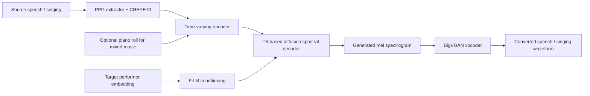
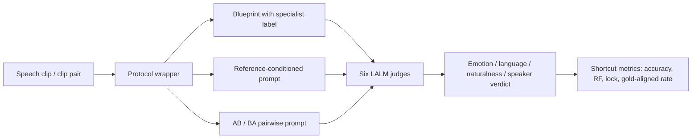
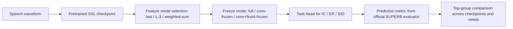
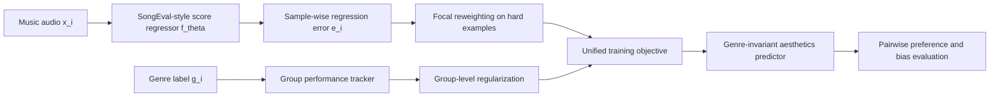
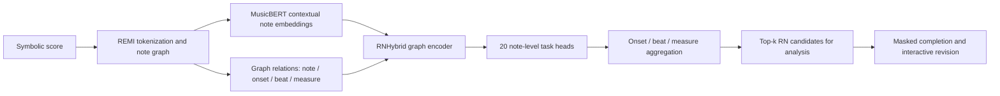

# 语音 / 音频 / 音乐论文速递
## 2026-07-16

> 实际对应 arXiv 更新日：**2026-07-16**  
> 检索范围：`cs.SD + eess.AS`  
> 只放按 ML 顶会审稿口径看，最值得多数读者花时间看的 **5 篇**

## 📋 总览

- 共收录 **5 篇** 相关论文
- 音色转换 / 统一生成：**1 篇**
- 语音评测 / Judge 审计：**1 篇**
- 语音基础模型 / 适配方法论：**1 篇**
- 音乐理解 / 评测分析：**2 篇**

今天这批最值得看的，不是“谁把模型继续做大”，而是三条更扎实的主线。第一条是 `Adapting a Diffusion-Based Music Synthesis Model to Human Voice Conversion`，它把原本给多乐器扩散合成用的条件控制框架，真的迁到了 speech 和 singing voice conversion 上，而且在自然度、歌手相似度、音高控制上都给了硬指标，但也坦白承认 phonetic fidelity 和 mixed-data 训练会掉点。第二条是方法论拆台线：`Auditing Protocol-Level Shortcuts in Large Audio Language Model Judges for Speech Evaluation` 和 `Rethinking Speech Foundation Model Fine-tuning: Better SFT or Better Match?` 都在提醒大家，单看一个 aggregate number 非常容易被误导，前者拆的是 judge protocol shortcut，后者拆的是 single-checkpoint SFT 幻觉。第三条是音乐理解线：一篇告诉你 reward model 可能只是学会了“更像流行乐”，另一篇则把 symbolic RN analysis 从一次性预测推进到 analyst-in-the-loop 的交互式补全和修订，这两篇都不 flashy，但都比“再堆一个榜单分数”更有后劲。

## 精选入选规则

- **新意（0-3）**：是不是提出了新的表示、接口、训练组织方式，或者把旧问题拆得更对
- **影响力（0-3）**：是不是贴近语音生成、语音评测、基础模型、音乐理解这些主线
- **证据强度（0-2）**：有没有像样的 baseline、消融和关键数值
- **受众匹配度（0-2）**：对语音大模型 / 语音前端 / 音乐方向 / 评测研究者有没有直接启发

分数校准：

- **6**：可读，但更像局部经验或问题诊断
- **7**：信息量够，值得过一遍
- **8+**：建议优先精读

## 总览表

| 方向 | 序号 | 论文 | 评分 | 关键词 |
|---|---:|---|---:|---|
| 音色转换 / 统一生成 | 1 | Adapting a Diffusion-Based Music Synthesis Model to Human Voice Conversion | 8.5/10 | diffusion VC, speech+singing, PPG+f0, FiLM performer conditioning |
| 语音评测 / Judge 审计 | 2 | Auditing Protocol-Level Shortcuts in Large Audio Language Model Judges for Speech Evaluation | 8/10 | LALM-as-judge, protocol shortcut, position lock, reference anchor |
| 音乐理解 / 交互分析 | 3 | From Prediction to Collaboration: Interactive Symbolic Music Analysis | 7.5/10 | RN analysis, MusicBERT, graph model, masked completion, analyst-in-the-loop |
| 音乐评测 / 偏差分析 | 4 | Genre Bias or Aesthetic Perception? Identifying and Mitigating Shortcut Learning in Music Evaluation | 7.5/10 | SongEval, genre shortcut, pop bias, group regularization |
| 语音基础模型 / 适配方法论 | 5 | Rethinking Speech Foundation Model Fine-tuning: Better SFT or Better Match? | 7/10 | SUPERB, checkpoint sensitivity, elicitation match, SFT instability |

## 🎤 音色转换 / 统一生成

### [1] Adapting a Diffusion-Based Music Synthesis Model to Human Voice Conversion

- **评分**：8.5/10
- **作者/机构**：Ben Maman, Frank Zalkow, Hans-Ulrich Berendes, Paolo Sani, Christian Dittmar, Meinard Müller；International Audio Laboratories Erlangen，Fraunhofer IIS
- **论文链接**：https://arxiv.org/abs/2607.13278
- **PDF**：https://arxiv.org/pdf/2607.13278.pdf
- **代码链接**：暂无
- **Demo 链接**：https://benadar293.github.io/voice-conversion

#### 📌 简介
这篇做的不是再造一个专用 VC backbone，而是把原来给多乐器 diffusion music synthesis 用的条件控制框架，硬迁到 human voice conversion 上，让一套模型同时覆盖 speech 和 singing。核心价值有两个：一是它证明了 `PPG + f0 + performer FiLM` 这套条件接口在 vocal domain 里真能工作；二是它不装无敌，明确承认加入 instrumental data 之后，统一性上去了，但 vocal quality 和 phonetic fidelity 会掉。

#### ☠️ 毒舌点评
这篇不是“万物皆可统一建模”的空口号稿，它是真拿现成音乐合成系统来撞语音任务边界。优点是结论很实：自然度、歌手相似度、音高控制确实站得住；缺点也很清楚，训练数据是内部 compound dataset，真正的可复现性没有吹得那么满，而且 phonetic fidelity 最强的仍然是 vocal-specialized baseline，不是它。

#### 🔧 技术方案
- **模型解决的问题**：传统 speech VC、singing VC、instrumental synthesis 基本各做各的，条件接口也互不兼容。作者要补的真实缺口是，能不能把音乐合成里已经成熟的“音符 / 乐器 / 演奏者”条件控制，改造成 speech 和 singing 都能吃的统一条件生成框架。
- **模型架构**：
  - **输入**：源语音或歌声音频提取出的 `PPG`、`f0`，以及目标 speaker / singer 的 performer embedding；混合 vocal-instrumental 场景额外加入 piano roll。
  - **输出**：目标说话人或歌手音色下的 mel spectrogram，再经 vocoder 变成波形。
  - **主干**：基于 `T5 Transformer` 的 diffusion acoustic model，包含 condition encoder 和 spectral decoder。
  - **关键模块**：
    - `Time-varying conditioning`：把 `PPG` 与 `f0` 按通道拼接后输入 encoder。
    - `Global conditioning`：把 performer embedding 通过 `FiLM` 注入到各层 hidden state。
    - `Condition dropout`：为 partial conditioning 和 classifier-free guidance 服务。
    - `Pitch range adaptation`：把源 `f0` 均值平移到目标 singer 的 semitone range。
    - `BigVGAN`：负责把生成的 mel 转成最终波形。
- **信号流**：

- **关键设计 / 核心创新**：真正有意思的地方不是“用了 diffusion”，而是把音乐合成里的 note/timbre conditioning 改写成 `PPG / f0 / performer` 三元条件接口，并验证 speech-trained PPG extractor 在 singing 上仍能提供有效控制。它还把 vocal-only 和 vocal+instrumental 两种数据放进同一框架里测，至少把统一建模的代价说清楚了。
- **训练 / 推理策略**：
  - 训练数据分三块：`Dspeech` 约 **33 h**、`Dsing` 约 **31 h**、`Dmix` 约 **90 h**，都是内部 compound dataset。
  - `Dspeech` 来自 **5** 位英语说话人；`Dsing` 由 `SingStyle111` 和 source-separated vocals 组成；`Dmix` 包含 `Schubert Winterreise`、流行/摇滚和器乐古典。
  - PPG 用 wav2vec 2.0 变体提取，`f0` 用 `CREPE`，performer embedding 用 `TRILL`。
  - 推理时通过 classifier-free guidance 结合 pitch range adaptation；同一模型既能做 speech VC，也能做 singing VC，混合场景再拼 piano roll。

#### 📊 实验结果
- 主要 baseline 是 `PAD-Voc`、`MAC-Voc`，对照模型是作者迁移后的 `T5-Voc`，另有混合数据训练版 `T5-All`。
- 自然度听感上，`T5-Voc` 在 singing 明显优于 `MAC-Voc`：
  - `T5-Voc 59.11`
  - `MAC-Voc 55.84`
  - p-value `7.24e-3`
  - 在 speech 上两者几乎打平，`68.63 vs 68.34`。
- 歌手相似度听感上，`T5-Voc` 均值 **3.25**，高于 `MAC-Voc` 的 **2.75**，p-value 低于 `1e-7`，说明 performer conditioning 不是摆设。
- `FAD` 上：
  - speech `test Dspeech`：`T5-Voc 0.162`，`MAC-Voc 0.171`
  - singing `Perf.`：`T5-Voc 0.141`，`MAC-Voc 0.178`
  - `T5-All` 基本全面退化，例如 singing `Perf.` 到 **0.192**，说明混入 instrumental data 会拖 vocal fidelity 后腿。
- 音高控制上，`T5-Voc` 也基本领先：
  - speech `RPA / Ov50 / Ov25 = 83.0 / 81.9 / 71.6`
  - singing `RPA / Ov50 / Ov25 = 94.7 / 92.5 / 83.1`
  - 对比 `MAC-Voc` 的 singing `93.6 / 91.8 / 81.8`，有小幅稳定优势。
- 但 phonetic fidelity 最强的不是它：
  - singing `PPG J-S / Wass.`：`MAC-Voc 0.245 / 2.151`
  - `T5-Voc 0.266 / 2.319`
  - 也就是说，T5 路线在自然度和 performer similarity 更强，但 phonetic preservation 还是输给 vocal 专用 baseline。
- mixed vocal-instrumental 实验里，加入 `f0 + PPG` 比只用 `MIDI` 更好：
  - `test Dmix FAD 0.277 -> 0.236`
  - `train Dmix FAD 0.250 -> 0.213`
  - 说明 vocal feature 对伴奏场景并不是噪声条件。

#### 💡 为什么值得看
如果你在做 unified audio generation，这篇值得看的不是它有没有彻底解决问题，而是它把“统一”真正变成了一组能测的 trade-off：自然度、歌手相似度、音高控制上去了，但 phonetic fidelity 和 mixed-data 训练会出代价。比起很多只喊统一口号的稿子，这种老老实实报副作用的论文更有参考价值。

## 🧑‍⚖️ 语音评测 / Judge 审计

### [2] Auditing Protocol-Level Shortcuts in Large Audio Language Model Judges for Speech Evaluation

- **评分**：8/10
- **作者/机构**：Joonyong Park, David M. Chan, Yuki Saito, Hiroshi Saruwatari；The University of Tokyo，Berkeley AI Research
- **论文链接**：https://arxiv.org/abs/2607.13477
- **PDF**：https://arxiv.org/pdf/2607.13477.pdf
- **代码链接**：暂无
- **Demo 链接**：暂无

#### 📌 简介
这篇不做新 judge，而是拆 LALM judge 为什么会“看起来和人类一致，实际上根本没在听”。作者把常见部署协议拆成三类：`feature-blueprint judging`、`reference-conditioned judging`、`pairwise A/B`，然后为每一类设计 matched shortcut probe，问的不是“总准确率多高”，而是“这个协议是不是自己就给模型开了作弊通道”。

#### ☠️ 毒舌点评
这篇很值钱，因为它打的不是某个模型，而是大家默认接受的评测流程。很多 LALM-as-a-judge 文章报一个相关系数就开香槟，这篇直接告诉你：如果 protocol 本身把 label hint、reference anchor、slot bias 都塞进 prompt 里，那 agreement 再高也可能是假的。缺点是它本身不是新模型论文，更多是 audit framework；但现在这类论文比“又一个 judge”更有必要。

#### 🔧 技术方案
- **模型解决的问题**：现有 LALM judge 研究往往只看 aggregate agreement，却不检查评测协议本身是不是把正确答案的近邻信息偷偷塞给了模型。本文要补的是 protocol-level validity：judge 到底在听音频，还是在抄 side channel。
- **模型架构**：
  - **输入**：音频片段，以及协议附带的 side information，比如 blueprint 文本、reference label、AB 排序。
  - **输出**：emotion、language、naturalness、speaker similarity 等判决结果。
  - **主干**：把 **6** 个黑盒 LALM judge 放到 **3** 种部署协议下做 matched perturbation audit。
  - **关键模块**：
    - `RQ1 blueprint probe`：在 acoustic descriptor 文本里嵌入正确或错误 specialist label。
    - `RQ2 reference-placement probe`：把同一个错误 reference label 放在 before / after / system / rubric 四个位置。
    - `RQ3 pairwise order-swap probe`：AB 和 BA 双顺序测试，区分 judge 选的是音频还是 slot。
    - `Cue-conflict synthesis`：同时给错误 specialist block 和错误 verbal reference，看谁更有毒。
- **信号流**：

- **关键设计 / 核心创新**：真正的创新是把 `judge` 当成“模型-协议对”而不是单独模型来审。作者不是泛泛说 shortcut learning，而是把 shortcut 精确映射到 deployment protocol：blueprint copy、reference anchor、position lock，各有各的 probe。
- **训练 / 推理策略**：
  - 这篇**不训练新 judge**，完全是 black-box audit。
  - Judge 面板包括 `Gemini-3-Flash`、`GPT-Audio`、`Qwen3-Omni-Instruct`、`Qwen3-Omni-Thinking`、`Audio-Flamingo-3`、`Voxtral-Small-24B`。
  - 数据来自 `RAVDESS`、`BVCC`、`FLEURS`、`VoxCeleb1`。
  - specialist block 分别用 `emotion2vec+`、`whisper-LID`、`ECAPA-TDNN` 等专家模型产出。

#### 📊 实验结果
- 这里的**对比对象 / baseline** 不是传统单一分数榜，而是 **6** 个 judge 在 **3** 种 protocol 下的 matched shortcut probe 横向对比：`Gemini-3-Flash`、`GPT-Audio`、`Qwen3-Omni-Instruct`、`Qwen3-Omni-Thinking`、`Audio-Flamingo-3`、`Voxtral-Small-24B`。
- `RQ1` blueprint shortcut 最狠的现象出现在 emotion：
  - 在 `wrong-label + audio` 条件下，五个 judge 的 emotion accuracy 都掉到 **0.10 以下**；
  - 只有 `Audio-Flamingo-3` 稍微撑住，回到 **0.38**。
- 同样的协议放到 language 上，结果完全不是一回事：
  - `Gemini-3-Flash / GPT-Audio / Qwen3-Omni-Instruct / Audio-Flamingo-3` 在 `wrong-label + audio` 下仍是 **0.97-1.00**
  - 说明当 attribute 能直接从音频里听出来时，wrong blueprint 并不总能骗过模型。
- `RQ2` reference anchor 明显存在，而且位置很重要：
  - emotion 上 `GPT-Audio` 的 wrong-reference follow rate 在 rubric slot 高到 **0.99**
  - `Qwen3-Omni-Instruct` 在 rubric 也是 **0.97**
  - `Gemini-3-Flash` 在 system slot 也能到 **0.85**
  - 这已经不是轻微 bias，而是明着被 prompt 拉着走。
- language 上 reference anchor 只在少数 judge 上爆雷：
  - `Audio-Flamingo-3` 在 rubric slot 的 wrong-reference follow rate 高到 **0.89**
  - 其他大多数 judge 基本都在 chance 附近。
- `RQ3` pairwise judging 暴露出严重 slot lock：
  - CONCAT 设定下，`Qwen3-Omni-Thinking` 与 `Audio-Flamingo-3` 在 `BVCC` 和 `Speaker` 上都是 `lock = 1.00, g = 0.50`
  - 也就是完全锁死在固定 slot，只是碰巧一半时候答对。
  - `GPT-Audio` 在 CONCAT 下也很糟，例如 `Cleanness lock 0.97`、`BVCC lock 0.76`、`Speaker lock 0.82`。
- native multi-audio 虽然能缓解 `GPT-Audio` 的部分格式问题，但没把 judge 真正救活：
  - `Cleanness lock 0.97 -> 0.61`
  - `BVCC lock 0.76 -> 0.42`
  - 但 gold-aligned rate 依然接近 **0.5**。
- cue-conflict 结果更残酷：`specialist block` 比 verbal reference 更毒，且对所有 judge 都成立：
  - `Gemini-3-Flash 0.86 vs 0.68`
  - `Audio-Flamingo-3 0.52 vs 0.16`
  - `Qwen3-Omni-Thinking 0.91 vs 0.30`
  - 说明一旦 blueprint 里塞了 specialist label，reference 再怎么写都只是次要污染源。

#### 💡 为什么值得看
如果你现在还在用 LALM judge 给 TTS、speech quality、speaker similarity 打分，这篇几乎是必读。它最重要的贡献不是指出“模型会偷懒”，而是指出**协议本身**就可能在制造假高分。以后再看到 judge paper 只报一个相关系数，不报 matched shortcut probe，基本就该警惕了。

## 🧠 语音基础模型 / 适配方法论

### [3] Rethinking Speech Foundation Model Fine-tuning: Better SFT or Better Match?

- **评分**：7/10
- **作者/机构**：Wangjin Zhou, Yizhou Zhang, Yichi Wang, Tatsuya Kawahara；Kyoto University
- **论文链接**：https://arxiv.org/abs/2607.13864
- **PDF**：https://arxiv.org/pdf/2607.13864.pdf
- **代码链接**：暂无
- **Demo 链接**：暂无

#### 📌 简介
这篇论文的核心论点很简单，但很容易得罪人：很多所谓“某个 SFT recipe 更好”的结论，可能只是它刚好更匹配某一个 pretrained checkpoint，而不是它真的把 performance ceiling 抬高了。作者在 `SUPERB` 的 `IC / ER / SID` 三个分类任务上，把 `8` 种 SFT 配置扔给 `9` 个 SSL checkpoint，再加多 seed 重复，结果发现 top-group recipe 经常跟 checkpoint 绑定，稳定泛化远没有论文里写得那么理直气壮。

#### ☠️ 毒舌点评
这篇不提供新模型，也不提供新榜单，所以注定不会像 flashy finetuning paper 那样受欢迎。但它讲的是很重要的坏消息：很多小幅提升可能只是“随机种子和 checkpoint 情绪稳定”的结果。缺点也有，它聚焦分类任务，没有覆盖 ASR / generation 类大任务；但如果你还在单 checkpoint 上比几个 adapter、冻结层数、加权层融合，然后得出普适结论，这篇就是专门来打脸的。

#### 🔧 技术方案
- **模型解决的问题**：SFT 文献常把单一 checkpoint 上的微小增益，直接解释成“方法更强”。作者要验证的其实是另一个问题：这些增益到底代表普适 ceiling 提升，还是只是某个 recipe 和某个 pretrained instance 之间的 `elicitation match`。
- **模型架构**：
  - **输入**：下游语音分类任务的语音波形。
  - **输出**：`IC / ER / SID` 的类别预测。
  - **主干**：`wav2vec 2.0 / HuBERT / WavLM` 三大家族的 **9** 个 SSL checkpoint，加标准 task head。
  - **关键模块**：
    - `FEATURE MODE` 三种：最后一层、倒数第 4 层、跨层 weighted sum。
    - `FREEZE MODE` 三种：全量微调、只冻结卷积前端、冻结前端加前 4 层 transformer。
    - 共 **8** 个配置：`F1-Z0` 到 `F3-Z1`。
    - 统计显著性用 paired exact `McNemar` test 定义 top group。
- **信号流**：

- **关键设计 / 核心创新**：这篇真正的贡献不是新 recipe，而是把 `elicitation match` 明确提出来，解释为什么一个 recipe 在某个 checkpoint 上看起来更强，但一换 checkpoint 排名就翻车。它强调的是外部效度，而不是再做一个 leaderboard trick。
- **训练 / 推理策略**：
  - 完整矩阵覆盖 **9** 个 checkpoint、**3** 个任务、**8** 个 SFT 配置。
  - 全部使用官方 `SUPERB` pipeline 和 evaluator，不换脚本、不换数据划分。
  - 全矩阵默认 seed **1337**，另外对 `wav2vec2-base-960h`、`hubert-base-ls960`、`wavlm-base` 做 **2048 / 7395** 两个额外 seed。
  - 总计算量约 **10,000 GPU-hours**，单实验跑在一张 `NVIDIA H20` 上。

#### 📊 实验结果
- 这篇的 **baseline / 对比对象** 是同一套 `SUPERB` 任务下的跨 checkpoint、跨 recipe 对比，而不是只拿单一最优数值说故事；核心对比轴是 `wav2vec 2.0 / HuBERT / WavLM` 三大家族和 `F1-Z0` 到 `F3-Z1` 八种配置。
- top-group 不稳定是全篇最核心的结论：
  - `hubert-base-ls960` 在 `SID` 上最强是 `F2-Z1 = 0.8753`
  - 但 `wav2vec2-large-960h` 在同任务上更强的是 `F1-Z2 = 0.8294`
  - `wavlm-large` 又变成 `F1-Z2 = 0.9230` 或 `F3-Z0 = 0.9213` 一带
  - recipe 排名明显不是固定的。
- 最离谱的是 under-activation：
  - `wavlm-base` 在 `SID` 上，`F2-Z0` 用 seed `1337` 时有 **0.7237**
  - 换 seed `2048` 直接掉到 **0.0006*** 
  - 再换 seed `7395` 又回到 **0.7101**
  - 这已经不是“小幅波动”，而是 recipe 能不能被激活的问题。
- `IC` 任务也不是稳定得多：
  - `wav2vec2-base-960h` 的 `F2-Z2` 直接出现 **0.1044*** 的崩溃值
  - `hubert-base-ls960` 的 `F2-Z1` 是 **0.9960**
  - `wavlm-large` 的 `F1-Z1` / `F2-Z0` / `F2-Z1` 都在 **0.9960-0.9974**，top-group 多配置并列。
- `ER` 任务里同样能看到 recipe 和 checkpoint 强绑定：
  - `wav2vec2-base-960h` 最强是 `F2-Z1 = 0.7060`
  - `hubert-base-ls960` 最强是 `F2-Z1 = 0.7032`
  - `wavlm-large` 则是 `F2-Z0 = 0.7770`
- 作者还指出一个极端情况：
  - `hubert-large-ll60k` 在 `ER` 上 **8** 个配置全部统计上 indistinguishable
  - 这直接削弱了“某 recipe 普适更优”的叙事。

#### 💡 为什么值得看
这篇值得看的原因不是它给了你新 recipe，而是它帮你避免写错结论。只要你的工作还涉及 checkpoint 选择、freeze depth、intermediate layer supervision 或 weighted-sum layer fusion，这篇都会提醒你：别在单 checkpoint、单 seed 上看到 0.5% 提升就急着上升到方法论胜利。

## 🎼 音乐理解 / 评测分析

### [4] Genre Bias or Aesthetic Perception? Identifying and Mitigating Shortcut Learning in Music Evaluation

- **评分**：7.5/10
- **作者/机构**：Yizhou Zhang, Wangjin Zhou, Yi Zhao, Wei Tan, Keisuke Imoto, Zhi Gong；Kyoto University，Tencent WXG
- **论文链接**：https://arxiv.org/abs/2607.13903
- **PDF**：https://arxiv.org/pdf/2607.13903.pdf
- **代码链接**：暂无
- **Demo 链接**：暂无

#### 📌 简介
这篇抓的是一个很要命、但平时常被 gloss over 的问题：music reward / aesthetics model 到底是在学“好听”，还是在学“更像流行乐”。作者拿 `SongEval` 做系统诊断，发现数据分布和标签偏差会把 genre 变成 shortcut，于是模型会系统性高估 pop、低估 jazz / classical。后半篇给出的方案也不复杂：sample-wise focal reweighting 加 group-level regularization，目标是让模型少吃 genre bias，多学 genre-invariant 的 musicality。

#### ☠️ 毒舌点评
这篇的价值在于它先承认问题是真的，再给出不花哨但有效的修法。它不是新 backbone，不是新大模型，也不是一篇看起来很“酷”的 music generation 论文；但如果你的 reward model 其实只是在奖励更像主流流行制作的曲子，那整个下游偏好优化都会歪。这篇就是专门来拆这个伪共识的。

#### 🔧 技术方案
- **模型解决的问题**：音乐评测模型常常吃到训练数据里的 genre imbalance 和 genre-specific rating bias，于是把 genre 相关特征当成 aesthetic proxy。作者要补的是，让 reward model 少依赖流派捷径，多依赖真正和音乐质量相关的线索。
- **模型架构**：
  - **输入**：音乐音频样本 `x_i`，以及其 human-annotated aesthetics score `y_i` 和 genre label `g_i`。
  - **输出**：连续的 aesthetics score prediction。
  - **主干**：沿用 `SongEval` 类型的音频评分 regressor `fθ(x)`，论文不以换 backbone 为卖点。
  - **关键模块**：
    - sample-wise `focal` reweighting，强调 hard sample；
    - group-level regularization，约束不同 genre 组的优化进度；
    - 用 `EMA` 监控各 genre 的训练动态；
    - 用 pairwise preference evaluation 检查人类偏好对齐，而不是只看回归误差。
- **信号流**：

- **关键设计 / 核心创新**：它最重要的点不是损失函数有多新，而是把 genre bias 明确诊断成 `shortcut-driven optimization dynamics`。换句话说，模型不是无意中有点偏，而是在训练过程中优先学会了最容易吃的主流风格线索。
- **训练 / 推理策略**：
  - baseline 用标准 `MSE + Adam`，学习率 `3e-5`，训练 **30 epochs**，batch size **1**。
  - 改进版在此基础上加入 `γ = 2` 的 focal 项，以及 `λ_group = 1e6` 的 group regularization。
  - `λ_group` 前 **5 epochs** 线性 warm-up。
  - 评测分三层：训练动态、pairwise preference、和 pop-related direction 的结构性偏差。

#### 📊 实验结果
- 这篇的 **baseline / 对比对象** 同时包含两层：一层是 `SongEval` 原始 reward model 作为 baseline，另一层是跨 genre / 跨 pair 的人类偏好对比结果，用来检查模型到底在学 aesthetic 还是在学流派捷径。
- `SongEval` 训练分布本身就歪：
  - `pop` 样本数 **1131**，平均分 **3.50**
  - `jazz` 只有 **67** 条，平均分 **2.44**
  - `classical` **262** 条，平均分 **2.73**
  - 这不是小偏差，是结构性偏置。
- 在 genre-balanced 的 `MTG-Jamendo` 和 `M6` 子集上，模型依旧显著偏 genre：
  - one-way ANOVA `p < 0.001`
  - `pop` 平均分大约 **3.5**
  - `jazz` 仍低于 **2.5**
  - 说明不是数据集换了就能洗白。
- baseline 的 pairwise 偏好对齐很一般：
  - `CMI-Pref 0.687`
  - `CMI-Pref-Pseudo 0.549`
  - same-genre 只到 `0.669 / 0.563`
  - cross-genre 是 `0.713 / 0.527`
- 改进目标后，整体和分项都涨：
  - overall `0.687 -> 0.715` on `CMI-Pref`
  - overall `0.549 -> 0.566` on `CMI-Pref-Pseudo`
  - same-genre `0.669 -> 0.703`
  - cross-genre `0.713 -> 0.735`
  - 至少说明它不是只在某一类对比上偷偷刷分。
- 偏差最明显的 pair 也确实被拉回来一些：
  - `pop vs jazz` 在 `CMI-Pref-Pseudo` 上，predicted win rate 从 **0.795** 降到 **0.761**，ground truth 还是 **0.249**
  - `jazz vs classical` 从 **0.295** 提到 **0.350**，ground truth 是 **0.829**
  - 当然，离真正对齐还远，但方向没错。
- 与 pop-related direction 的耦合显著下降：
  - `M6` 上 `Spearman 0.88 -> 0.68`
  - `MTG-Jamendo` 上 `0.81 -> 0.62`
  - 这基本就是整篇论文最有说服力的结构性证据。

#### 💡 为什么值得看
如果你在做 music reward model、music preference optimization，或者任何“拿人类打分训练音乐评估器”的工作，这篇值得精读。它提醒你的不是怎么多提 1 个点，而是如果 reward model 本身只是在奖励“更像流行乐”，那后面的 RL、preference optimization、dataset curation 可能从源头就歪了。

### [5] From Prediction to Collaboration: Interactive Symbolic Music Analysis

- **评分**：7.5/10
- **作者/机构**：Emmanouil Karystinaios, Johannes Hentschel, Markus Neuwirth, Gerhard Widmer；Johannes Kepler University Linz，Anton Bruckner University Linz
- **论文链接**：https://arxiv.org/abs/2607.13587
- **PDF**：https://arxiv.org/pdf/2607.13587.pdf
- **代码链接**：**代码已开源** https://github.com/manoskary/analysisgnn
- **Demo 链接**：https://analysisgnn.com

#### 📌 简介
这篇做 Roman numeral analysis，但重点不在“我又把 blind full-score prediction 刷高了多少”，而在把 symbolic music analysis 从一次性预测，扩成 analyst-in-the-loop 的工作流：完整推断、局部修订、部分标签补全，都在一套框架里做。技术上它把 `MusicBERT` 的预训练表示和 `AnalysisGNN` 式图结构推理拼在一起，再单独训练一个 masked edit-conditioned model 去吃人工修改和 partial context。

#### ☠️ 毒舌点评
这篇不是最容易炒作的那类 MIR 论文，因为它没有拿一个 flashy 大模型名字去包装自己。它更像系统论文：性能、交互、受控补全、接口都做了。但也别神化，它的 blind prediction 提升并不夸张，很多 inference-time trick 在 blind regime 下还会掉点；真正的价值在于把“预测问题”改写成“协作分析问题”。

#### 🔧 技术方案
- **模型解决的问题**：现有 RN analysis 模型大多只优化 blind one-shot prediction，可音乐学家真实工作流是不断检查、修正、局部补全。作者要补的是，让模型既能做完整分析，又能接受部分标签作为硬约束，回填剩余分析结果。
- **模型架构**：
  - **输入**：symbolic score，经 REMI 风格 tokenization 和 note graph 表示。
  - **输出**：Roman numeral 相关的 **20** 个 note-level analysis task，包括 local key、degree、inversion、quality、cadence、phrase 等。
  - **主干**：`MusicBERT` sequence branch + `AnalysisGNN` style graph branch 的 `RNHybrid`。
  - **关键模块**：
    - sequence branch 负责长程上下文；
    - graph branch 负责 simultaneity、temporal succession、overlap、rest 等关系；
    - onset / beat / measure aggregation 把 note-level 概率提升到更接近人类分析粒度的候选；
    - `masked edit-conditioned model` 用已知标签作为硬约束做补全与修订。
- **信号流**：

- **关键设计 / 核心创新**：这篇最像样的地方是它没把 interactive revision 当 UI 附件，而是单独做了一个 masked checkpoint，并把 known label preservation、KL distillation、feature anchoring、L2-SP regularization 一起纳入训练，让“用户改一处，模型重算周边”真的可行。
- **训练 / 推理策略**：
  - blind full inference 和 masked completion 分开评估，不混算 leaderboard。
  - blind 主模型默认冻结 cached `MusicBERT` embedding，使用 `PCGrad` 处理多任务冲突。
  - masked 模型训练时混合 random node masking 和 onset-span masking，只在 masked positions 上算主要监督。
  - authors 还测了 `LoRA` continuation、post-hoc voter、iterative refinement、beam search 等 inference-time 模块。

#### 📊 实验结果
- 这篇的 **baseline / 对比对象** 很明确：blind full inference 对比 `AugmentedNet`、`ChordGNN+Post`、`RNBert`、`AnalysisGNN` 等既有方法；masked completion 再和自己的 blind branch 分开评估，避免把不同设定混成一个 leaderboard。
- blind full inference 上，`RNHybrid` 的提升不大但是真实：
  - 在 `AugNet` 上，Roman score **0.576**，略高于 `RNBert 0.574` 和 `AnalysisGNN 0.530`
  - local key **0.846**，高于 `RNBert 0.825`
  - 在 `DLC` 上，Roman **0.578**，明显高于 `AnalysisGNN 0.516` 与 retrain 的 `RNBert-style 0.509`
  - phrase **0.755**，也高于 `AnalysisGNN 0.742`
- masked completion 才是这篇真正的亮点：
  - `AugNet` 上 masked RN accuracy 从 **0.577 ± 0.001**（5% known labels）一路涨到 **0.831 ± 0.008**（95% known labels）
  - `DLC` 上从 **0.573 ± 0.000** 涨到 **0.801 ± 0.002**
  - 超过 **50%** context 后提升尤其明显，说明 partial context 确实能被模型吃进去。
- conflict handling 里，`PCGrad` 是 blind full inference 的最好选择：
  - `AugNet 0.576`
  - `DLC 0.578`
  - 对比 `None 0.551 / 0.540`
  - `GradNorm 0.382 / 0.322` 更是直接崩。
  - `CAGrad` 虽然 cadence F1 到 **0.638**，但 RN accuracy 反而不如 `PCGrad`。
- `LoRA` continuation 没有带来收益：
  - `PCGrad + LoRA` 只有 `0.5575 / 0.5385`
  - 低于 frozen `MusicBERT + PCGrad` 的 `0.576 / 0.578`
  - 这点反而说明作者没乱吹 finetuning。
- inference-time tricks 在 blind regime 下大多没好果子吃：
  - `iterative refinement` 虽然 `ΔRNAugNet +0.0092`
  - 但 `ΔLoss +0.5310`
  - `beam search` 直接 `ΔRNAugNet -0.0343`
  - `component-first beam` 更是 `-0.1146`
  - 也就是说，这些模块更适合 constrained editing，不适合盲推断。

#### 💡 为什么值得看
如果你做 symbolic music analysis、interactive annotation，或者任何 analyst-in-the-loop 的结构化预测任务，这篇很有启发。它最值得学的是：不要把“交互”只当 UI，把 partial context、hard constraint、局部重算真正做进模型和评测协议里，论文才不虚。

## 最后结论

如果今天只看 3 篇，我会按下面顺序排：

1. `Adapting a Diffusion-Based Music Synthesis Model to Human Voice Conversion`
   这是今天最像“能推动统一音频生成往前走一步”的稿子。它的价值不在于完美，而在于把统一建模的收益和代价都测清楚了。
2. `Auditing Protocol-Level Shortcuts in Large Audio Language Model Judges for Speech Evaluation`
   如果你碰 judge，这篇几乎是必读。它会直接改变你以后怎么看 LALM-as-a-judge 的实验设计。
3. `From Prediction to Collaboration: Interactive Symbolic Music Analysis`
   这篇不追榜单神话，但它把 symbolic analysis 从一次性预测推进成协作式工具链，方向很对。

第二梯队是另外两篇方法论论文。`Genre Bias or Aesthetic Perception?` 适合做 music reward model 和 preference optimization 的人，因为它点破了“模型其实只是在奖励更像流行乐”的隐患；`Rethinking Speech Foundation Model Fine-tuning` 则适合所有还在拿单 checkpoint 小幅增益写结论的人，因为它把 checkpoint / seed 依赖性讲得很难再装看不见。

总体看，今天这批稿子的共同特点不是更大，而是更诚实：更诚实地面对统一建模的副作用，更诚实地面对 judge 和 SFT 的评测幻觉，也更诚实地把音乐分析从 benchmark 任务拉回真实工作流。这种稿子短期热度未必最高，但长期更容易留下真方法。
