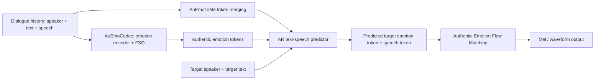
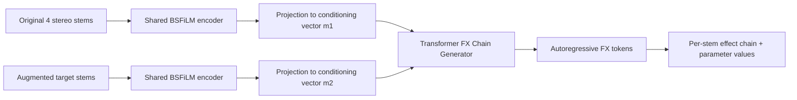
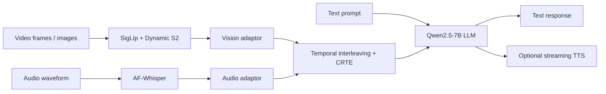
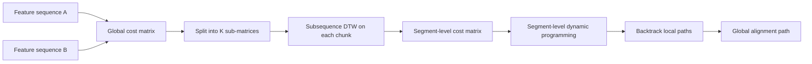
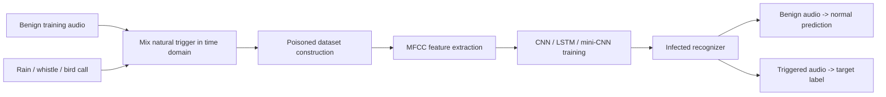

# 语音 / 音频 / 音乐论文速递
## 2026-07-20

> 实际对应 arXiv 更新日：**2026-07-20**  
> 检索范围：`cs.SD + eess.AS`  
> 只放按 ML 顶会审稿口径看，最值得多数读者花时间看的 **5 篇**

## 📋 总览

- 共收录 **5 篇** 相关论文
- 情感语音生成 / 对话式 TTS：**1 篇**
- 音频制作 / 音乐工程：**1 篇**
- 音频大模型 / 多模态推理：**1 篇**
- 音乐信息检索 / 对齐算法：**1 篇**
- 语音安全：**1 篇**

今天真正值得先看的主线有三条。第一条是 `AuEmoChat`：它不是再拿七类情感标签糊弄对话式 TTS，而是把“真实情绪表征”做成离散 token，再配合 token merging 和 flow matching 去生成目标语音，这条线对情感语音合成是实打实的增量。第二条是 `StemFX`：这篇不追大模型热词，直接把混音风格表示学习从“小数据、固定效果链、微分音频图”拽回可扩展的工程范式，做音乐制作建模的人应该认真看。第三条是 `Audio-Visual Flamingo`：它的意义不在“又一个 omni 模型”，而在于终于有一篇把长视频音画联合理解的数据、训练课表、开源链路一起端出来了。

另外两篇需要降温看。`Segmental DTW` 是 **2021 ICASSP** 的旧工作补传 arXiv，`Natural Backdoor Attacks on Speech Recognition Models` 是 **2023 LNCS** 章节作者稿补传。它们不是 2026 年的新前沿，但一个对大规模音频对齐还有算法参考价值，一个对语音安全威胁模型还有提醒作用，所以保留在低分区。

## 精选入选规则

- **新意（0-3）**：是不是提出了新的表示、接口、训练组织方式，或者把旧问题拆得更对
- **影响力（0-3）**：是不是贴近语音大模型、TTS、音频系统、音乐工程、语音安全这些主线
- **证据强度（0-2）**：有没有像样的 baseline、消融和关键数值
- **受众匹配度（0-2）**：对语音大模型 / 语音前端 / 音乐方向 / 安全方向研究者有没有直接启发

分数校准：

- **6**：可读，但更像旧问题整理、边角补丁，或者只是补传 arXiv
- **7**：信息量够，值得过一遍，但还不到必须跟
- **8+**：建议优先精读，至少有一块方法或实验是真能拿回去用的

## 总览表

| 方向 | 序号 | 论文 | 评分 | 关键词 |
|---|---:|---|---:|---|
| 情感语音生成 / 对话式 TTS | 1 | AuEmoChat | 8.8/10 | authentic emotion token, token merging, conversational TTS, flow matching |
| 音频制作 / 音乐工程 | 2 | StemFX | 8.5/10 | FX chain prediction, source-separated stems, BSFiLM, mixing style retrieval |
| 音频大模型 / 多模态推理 | 3 | Audio-Visual Flamingo | 8.2/10 | AV-Skills, TAVIT, long-form AV reasoning, open AV-LLM |
| 音乐信息检索 / 对齐算法 | 4 | Segmental DTW | 6.8/10 | parallel DTW, chunked alignment, WSDTW, music alignment |
| 语音安全 | 5 | Natural Backdoor Attacks | 6.3/10 | natural triggers, backdoor, Speech Commands, clean-label |

## 🗣️ 情感语音生成 / 对话式 TTS

### [1] AuEmoChat: Authentic Emotion Understanding and Rendering for Conversational Speech Synthesis

- **评分**：8.8/10
- **作者/机构**：Zhenqi Jia, Yuan Zhao, Aruukhan, Rui Liu, Haizhou Li；Inner Mongolia University，The Chinese University of Hong Kong, Shenzhen
- **论文链接**：https://arxiv.org/abs/2607.15755
- **PDF**：https://arxiv.org/pdf/2607.15755.pdf
- **代码链接**：文中预告匿名仓库 https://github.com/anonymous-css/AuEmoChat
- **Demo 链接**：文中仅说明 speech demos 将随代码提供，当前未单独给出页面

#### 📌 简介
这篇做的是对话式情感 TTS，但它抓的不是“再多加几个情感标签”这种老问题，而是直接质疑现有 CSS 模型的情绪表示太假、上下文 token 太冗。`AuEmoChat` 的主线很清楚：先用 `AuEmoCodec` 学一个离散的 authentic emotion token 空间，再用 `AuEmoToMe` 压掉多轮对话历史里对情绪判断没用的噪声 token，最后在 flow matching 生成阶段把目标情绪、上下文和声学先验一起喂进去。

#### ☠️ 毒舌点评
这篇不是“情感 TTS 换个名字再发一遍”的水稿。真正有料的地方是它没把 emotion 当成分类标签，而是把 emotion 重新做成了可学习的离散表示，这一步比大多数“情感可控语音”文章都更像在解决根因。短板也有：评测仍然集中在自家对话式情感数据设定里，离大规模真实 agent 语音系统还有一段距离，但这已经是今天最该先看的语音生成论文。

#### 🔧 技术方案
- **模型解决的问题**：
  传统 conversational speech synthesis 往往依赖七类基础情感标签，结果是情绪粗、上下文理解弱、说话像在演预设情绪模板。`AuEmoChat` 要补的缺口是：多轮对话里情绪是连续细粒度变化的，模型既要看懂这种真实情绪，又不能被冗余历史 token 拖垮生成。
- **模型架构**：
  - **输入**：多轮对话历史中的 `speaker / text / speech` 三模态信息，以及目标说话人和目标文本。
  - **输出**：目标句子的 authentic emotion token、speech token，以及最终 mel / waveform 级语音输出。
  - **主干**：`AuEmoCodec + AuEmoToMe + autoregressive text-speech predictor + Authentic Emotion Flow Matching`。
  - **关键模块**：
    - `AuEmoCodec`：用 `Speech Emotion Encoder + FSQ` 学离散 authentic emotion token。
    - `AuEmoToMe`：按照情绪相关性做 multimodal token merging，降低历史上下文冗余。
    - 自回归 TTS 预测器：联合预测目标情绪 token 与 speech token。
    - `Authentic Emotion Flow Matching`：把合并后的上下文、目标情绪和 acoustic priors 一起用于最终语音渲染。

- **关键设计 / 核心创新**：
  `AuEmoChat` 的核心不是把 emotion2vec 换个壳，而是把“真实情绪表征”“上下文压缩”“最终语音渲染”三段真正串起来。第一，`AuEmoCodec` 用 `FSQ` 学的是离散情绪 token，而不是传统有限标签。第二，`AuEmoToMe` 不是纯粹为了省算力，它直接服务于 target utterance 的情绪推断。第三，flow matching 阶段不只接文本或语音 token，而是显式接 merged context 和 authentic emotion condition。
- **训练 / 推理策略**：
  - `AuEmoCodec` 先在大规模 emotional speech 上训练，用七条基础情感轴的 perceived scores 做重建监督。
  - 文中采用 `FSQ`，量化 levels 为 `[8, 5, 5, 5]`，最终选用 **1000** 大小的情绪 codebook，其中约 **750** 个 token 被激活。
  - 情绪监督不是人工类标，而是用 `Gemini-2.5-Flash` 标注的多轴感知分数；这很激进，但确实比七分类更贴任务。
  - 下游 CSS 评测使用 `NCSSD-EmCap`，并把 `BaseCSS / ECSS / GPT-Talker / Chain-Talker` 都换到同一 authentic emotion token 设定下对比。
  - 推理时 token merging ratio 设为 **30%**，文中认为这是 emotion expressiveness 和 speech quality 的最佳平衡。
  - 论文没有报告部署级延迟、RTF 或显存开销，这点要老实承认。

#### 📊 实验结果
- 数据集：`NCSSD-EmCap`，整合 `DailyTalk`、`NCSSD`、`MultiDialog`。
- 对比基线：`BaseCSS`、`ECSS`、`GPT-Talker`、`Chain-Talker`。
- 对比最强 baseline `Chain-Talker`，`AuEmoChat` 的提升不是一点点修边角：
  - `N-DMOS`：**4.171** vs **3.955**
  - `E-DMOS`：**3.979** vs **3.756**
  - `WER`：**9.14** vs **15.07**
  - `MCD`：**6.847** vs **7.686**
  - `SpkSIM`：**78.03** vs **77.56**
  - `EmoACC`：**61.04** vs **57.16**
  - `AuEmoACC`：**28.71** vs **24.12**
- 消融也站得住：
  - 把 `AuEmoTokenizer` 换回有限情感标签时，`AuEmoACC` 直接掉到 **20.38**。
  - `FSQ` 比 `VQ / RVQ / R-FSQ / G-FSQ` 更稳；在 Table 3 里 `FSQ` 的 `Tol@1 / S-EAA / D-EAA` 最好。
  - codebook 从 **200** 扩到 **1000** 时情绪表征性能持续提升，再往上反而掉。
  - token merging 比例从 `0%` 到 `75%` 扫过一遍，**30%** 在 `AuEmoACC / EmoACC / WER / MCD` 上是总体最优。
- 这部分实验最有说服力的地方在于：它不是只拿主观分数压人，而是把 speech quality、speaker similarity、basic-emotion accuracy 和 authentic-emotion accuracy 同时报了。

#### 💡 为什么值得看
如果你做情感 TTS、对话式语音 agent 或情绪可控生成，这篇值得看的不是“效果更好”四个字，而是它把情绪表示本身重新定义了。很多 CSS 论文还停留在 label engineering，`AuEmoChat` 已经在尝试把情绪空间、上下文压缩和生成机制一起重新组织，这对后面的语音大模型式 expressive generation 很有启发。

#### 评分：8.8/10
理由：问题抓得准，方法链路完整，主表和消融都够硬。扣分点是尚未给出更接近真实语音 agent 场景的部署证据。

## 🎚️ 音频制作 / 音乐工程

### [2] StemFX: Learning Mixing Style Representations via Autoregressive FX Chain Prediction on Source-Separated Stems

- **评分**：8.5/10
- **作者/机构**：Yuan-Chiao Cheng, Jui-Te Wu, Brian Chen, Yen-Tung Yeh, Yu-Hua Chen, Yi-Hsuan Yang；Independent Researcher，National Taiwan University
- **论文链接**：https://arxiv.org/abs/2607.15634
- **PDF**：https://arxiv.org/pdf/2607.15634.pdf
- **代码链接**：**代码已开源** https://github.com/barry-mir/stemfx
- **Demo 链接**：https://barry-mir.github.io/stemfx-demo/

#### 📌 简介
这篇做的是混音风格表示学习，但它绕开了现有方法最烦的三个坑：要么只能看 stereo mixture，要么效果链长度固定，要么必须依赖可微音频效果或很小的 multitrack 数据集。`StemFX` 把问题改写成“给定 source-separated stems 的前后状态，自回归预测完整 FX chain token 序列”，于是 mixing style 不再是抽象 embedding，而是可解释、可执行的效果链表示。

#### ☠️ 毒舌点评
这篇不靠“大模型”和“agent”刷存在感，反而更像一篇真正懂工程约束的 MIR 论文。它最值钱的地方不是 Top-1 多高，而是把 paired training data 扩到了 **105K songs**，还把 retrieval、transfer、主观听感和推理时间一起交代了。缺点也清楚：这条线更偏音乐制作系统，对纯语音研究者不是刚需；但做音频效果建模、混音辅助、音乐工程工具的人不看可惜。

#### 🔧 技术方案
- **模型解决的问题**：
  以往 mixing style 方法不是固定 effect inventory，就是需要 differentiable console，或者只能做推理时的慢优化。`StemFX` 解决的是：如何在可扩展数据规模上，学一个既能检索混音风格、又能直接生成可解释 FX chain 的表示。
- **模型架构**：
  - **输入**：四个 source-separated stereo stems 的 `original` 和 `augmented` 版本，采样率 **44.1 kHz**。
  - **输出**：按 stem 拼接后的 FX chain token 序列，既包含 effect name，也包含 parameter value。
  - **主干**：共享 `BSFiLM Encoder` 先编码 mixing style 差异，再由带 cross-attention 的 `Transformer FX Chain Generator` 自回归生成 token。
  - **关键模块**：
    - `BSFiLM Encoder`：band-split multi-band CNN，输出 `512-d` mixing embedding。
    - `FiLM conditioning`：把 **64** 个 hand-crafted mixing features 注入 CNN。
    - FX tokenization：参数量化为 **101** bins，支持 effect name + value token 解码。
    - `Sep-Aug Pipeline`：先用 source separation 造 pseudo-stems，再用 `MultiAFx` 随机采样效果链做 paired augmentation。

- **关键设计 / 核心创新**：
  这篇的关键点是“把 mixing style 变成序列生成问题”，而不是继续做一个只能用 cosine similarity 的 embedding。其次，它不是冻结 encoder 再让 LLM 瞎猜你用了哪些效果，而是 end-to-end 联训 encoder 和 decoder。最后，`Sep-Aug Pipeline + MultiAFx` 解决的是数据天花板问题，这比再堆一个 fancy backbone 更重要。
- **训练 / 推理策略**：
  - 训练数据来自 `FMA + SCNet` 分离出的 pseudo-stems，规模约 **105K songs**，每首歌 4 个 pseudo-stems。
  - `MultiAFx` 统一封装 **7** 个 Python 音频后端的 **85** 种 audio effects，用来随机采样 effect chains。
  - 模型总参数约 **28.0M**，其中 `BSFiLM Encoder 1.79M`，`6-layer Transformer decoder 26.2M`。
  - 训练 **60 epochs**，单张 `RTX 5090` 大约 **56 GPU hours**；目标函数是 teacher forcing 下的 cross-entropy。
  - 推理阶段使用 greedy decoding，自回归生成完整 effect chain；文中给了推理耗时，这是这类论文最该报也最常被回避的指标。

#### 📊 实验结果
- 数据与任务：
  - retrieval 用 `N=500` 候选池比较 mixing style embedding。
  - paired style transfer 在 `MUSDB18` 上做 `Synthetic set` 和 `Real Mix set` 两类评测。
- retrieval 主表非常能打：
  - 在 **8 effects** 难度下，`StemFX` 的 `Top-1` / `MRR` 是 **86.8% / 0.903**。
  - 对比 `AFx-Rep` 的 **68.4% / 0.754**，对比 `Fx-Encoder++` 的 **38.0% / 0.459**。
  - 同架构同数据只换目标函数的 `BSFiLM-CL` 也只有 **77.8% Top-1**，说明“预测 FX chain”确实比单纯 contrastive 更有效。
- paired mixing style transfer 结果也不虚：
  - `Synthetic set` 上 `StemFX` 的 `MRSTFT` 是 **2.35**，单样本推理 **0.24s**。
  - `Real Mix set` 上 `MRSTFT` 最好是 **1.44**，`MUSHRA` 最好是 **60.6**。
  - `ITO + AFx-Rep` 要 **1033s**，`ITO + BSFiLM` 要 **1717s**，而 `StemFX` 还是 **0.24s** 量级，确实是文中说的 **4000x+** 速度优势。
  - 更狠的是，`StemFX` 是唯一一个主观分数超过 low anchor `FX-normalized` 的方法：**60.6** vs **54.9**。
- 消融和规模分析也有信息量：
  - 去掉 `FiLM`，`Top-1` 从 **86.8%** 掉到 **74.4%**。
  - 去掉 source separation，`Top-1` 直接掉到 **48.0%**。
  - 换成 `HTSAT-tiny` encoder，`Top-1` 只有 **60.2%**。
  - 训练集从 **10%** 扩到 **100% of 105K songs**，`Top-1` 从 **58.6%** 涨到 **86.8%**。
- 主要对比基线明确包括 `AFx-Rep`、`Fx-Encoder++`、`CLAP`、`ST-ITO` 及作者自建的 `BSFiLM-CL`。

#### 💡 为什么值得看
这篇最值得看的点，是它把“音频效果链建模”从小数据实验室玩具推进到了可扩展的系统方案。你完全可以把这套思路迁到语音增强插件、自动混音助手、效果链推荐、甚至语音后期工具里。相比很多只会报 embedding 指标的音乐论文，这篇的输出更可执行，也更接近真实产品形态。

#### 评分：8.5/10
理由：问题真、方法清、实验硬、速度也报了。扣分点是它更偏音乐工程赛道，对泛语音受众没有 `AuEmoChat` 那么直接。

## 🤖 音频大模型 / 多模态推理

### [3] Audio-Visual Flamingo: Open Audio-Visual Intelligence for Long and Complex Videos

- **评分**：8.2/10
- **作者/机构**：Sreyan Ghosh, Arushi Goel 等；NVIDIA，University of Maryland
- **论文链接**：https://arxiv.org/abs/2607.16107
- **PDF**：https://arxiv.org/pdf/2607.16107.pdf
- **代码链接**：**代码已开源** https://github.com/NVIDIA/audio-flamingo
- **Demo 链接**：https://huggingface.co/spaces/nvidia/audio-visual-flamingo

#### 📌 简介
这篇是全开源的长视频音画联合理解模型。它的野心不是再做一个“把 Whisper 和视觉 encoder 接到 LLM 前面”的 omni demo，而是系统解决三件事：有没有像样的联合音画数据、怎么让模型在长上下文里按时间对齐推理、以及怎么把这条链公开到别人真能复现。对应地，作者给了 `AV-Skills` 数据集、`TAVIT` 时间对齐式 CoT，以及从 `OmniVinci` 起步的三阶段训练课表。

#### ☠️ 毒舌点评
如果你只做纯语音，这篇不是第一优先级；它更像“音频模态终于在多模态模型里被当成人看”的代表作。优点是开源姿态非常完整，模型、代码、项目页、数据和 demo 都给了；缺点是算力消耗吓人，`512×H100` 这类训练配置决定了大多数团队只能拿它当参考路线，而不是当天就能复现的 recipe。

#### 🔧 技术方案
- **模型解决的问题**：
  开源 omni/AV 模型普遍有两个老问题：一是 joint audio-visual reasoning 弱，尤其一长视频就掉；二是训练数据、训练策略和模型细节常常不公开。`AV-Flamingo` 要补的是“长而复杂的真实音画视频”这个场景下，怎样把开放数据、时序对齐和推理能力一起做成可复现系统。
- **模型架构**：
  - **输入**：图像、视频、音频和文本指令；可选语音交互。
  - **输出**：文本回答，以及可选 streaming TTS 语音回复。
  - **主干**：`SigLip vision encoder + AF-Whisper audio encoder + modality adaptors + temporal interleaving + Qwen2.5-7B LLM + streaming TTS`。
  - **关键模块**：
    - `SigLip` 视觉编码 + Dynamic S2 压缩高分辨率视觉 token。
    - `AF-Whisper` 音频编码器，把音频重采样到 **16 kHz mono**，再切成 **30 秒** chunk 编码。
    - 音画 token 沿时间轴 interleave，并叠加 `Constrained Rotary Time Embedding`。
    - `TAVIT`：显式把 reasoning step 对齐到时间戳。
    - `AV-Skills`：围绕音画联合技能专门构造的训练数据。

- **关键设计 / 核心创新**：
  这篇真正的核心不是 backbone，而是数据和训练组织方式。第一，`AV-Skills` 明确针对 cross-modal reasoning，而不是指望模型从一堆单模态数据里自己悟出来。第二，`TAVIT` 让中间推理步骤带时间戳，这是长视频理解里很少真正做扎实的部分。第三，三阶段训练把短上下文感知、长上下文建模和 CoT 推理拆开做，比一锅炖更像成熟 recipe。
- **训练 / 推理策略**：
  - 基座 LLM 是 `Qwen2.5-7B`，共 **7B** 参数、**36** 层。
  - `AV-Skills-Short` 覆盖 **100K hours** 视频、**3.8M** 训练样本；`AV-Skills-Long` 约 **140K hours** 视频、**3.2M** 样本；合计约 **≈7M** caption / QA 实例，其中 **≈4.8M** 是 QA 对。
  - 训练课表分三段：
    - short-context：`5 min / 16K context`
    - long-context：`15 min / 32K context`
    - CoT post-training：`15 min / 32K context`
  - 文中给出的训练资源是 `512×H100`，并使用 `ZeRO-3 + sequence parallelism`。这证明路线够硬，但也说明复现门槛并不低。
  - 推理上支持 voice output，但论文没有给延迟或 tokens/s 级别的部署指标。

#### 📊 实验结果
- 评测覆盖很广：audio understanding、video understanding、omni understanding、ASR，一共 **15+** 基准。
- 音频理解：
  - `MMAR`：`AVF-Instruct` **60.1**，超过 `OmniVinci` **58.4**。
  - `MMSU`：**61.5**，高于 `Gemini 1.5 Pro` **60.7**。
  - `MMAU-v05.15.25` 平均分：**73.49**，高于 `OmniVinci` **71.60**，也高于 `Audio Flamingo 3` 的平均 **72.42**。
- 视频和 omni：
  - `Video-MME`：无字幕 / 有字幕分别 **70.7 / 71.2**，对比 `OmniVinci` **67.3 / 68.6**。
  - `WorldSense`：**50.3** vs `OmniVinci` **48.2**。
  - `DailyOmni`：**72.4** vs `OmniVinci` **66.5**。
  - `LongVideoBench`：**60.1**，略低于 `OmniVinci 62.0`，但高于 `NVILA 58.7`。这说明它不是所有长视频 benchmark 都横扫，作者没有把这点藏起来。
- ASR 转移能力也不错：
  - `LibriSpeech test-clean / test-other`：**1.64 / 3.5 WER**
  - `SPGISpeech`：**2.8**
  - `VoxPopuli`：**5.8**
  - 在 `LibriSpeech test-clean` 上甚至略好于 `Phi-4-mm 1.67`。
- 额外优点：
  - 不只是模型开源，连 `Model / Project Page / Dataset / Demo` 都挂出来了。
  - 附录还有 `AV-Skills` ablation，显示从 `OmniVinci -> AVF-Stage1 -> AVF-Instruct`，`DailyOmni` 从 **66.5** 涨到 **72.4**，`VideoMME` 从 **67.3** 涨到 **70.7**。

#### 💡 为什么值得看
如果你关心 audio 在多模态时代到底该怎么被认真建模，这篇非常值得看。它没有把音频当“顺手接一下”的附属模态，而是从数据分布、时间对齐、训练课表和 benchmark 覆盖都把音频拉进了主桌。哪怕你短期复现不起，它也能提供一条比“随便接个 audio encoder”更靠谱的开放路线。

#### 评分：8.2/10
理由：开源完整、方法路线清楚、实验覆盖广。扣分点是算力门槛极高，而且它更偏 AV 赛道，对纯 speech 研究者的直接可复用性不如前两篇。

## 🎼 音乐信息检索 / 对齐算法

### [4] Segmental DTW: A Parallelizable Alternative to Dynamic Time Warping

- **评分**：6.8/10
- **作者/机构**：TJ Tsai；Harvey Mudd College
- **论文链接**：https://arxiv.org/abs/2607.15475
- **PDF**：https://arxiv.org/pdf/2607.15475.pdf
- **代码链接**：**代码已开源** https://github.com/tjtsai/SegmentalDTW
- **Demo 链接**：暂无

#### 📌 简介
这篇研究的是怎么把经典 `DTW` 变得更可并行。思路不是去做 band pruning 或线性近似，而是把全局 cost matrix 切成多个子块，对每块先做 subsequence DTW，再在 segment 级别做一次动态规划，拼出全局对齐路径。作者给了两个版本：`WSDTW` 允许弱单调，`SSDTW` 强制严格单调。

#### ☠️ 毒舌点评
这篇要先降温：它其实是 **2021 ICASSP** 工作，现在只是 2026 年补挂 arXiv，不是今天的新主线论文。即便如此，它仍然有一个可取之处，就是把“DTW 天生串行”这件事拆得很干净，给出了一套可以解释、可以 profile 的并行近似路线。做大规模音频 / MIDI / performance alignment 的人可以翻一眼，但别把它当成今年的新突破。

#### 🔧 技术方案
- **模型解决的问题**：
  常规 `DTW` 的主要痛点是 `O(NM)` 级时间和内存成本，而且全局对齐本质上是串行动态规划，长序列上非常难并行。`Segmental DTW` 想解决的是：在保持全局路径近似正确的前提下，把绝大部分计算拆成可并行 job。
- **模型架构**：
  - **输入**：两段需要全局对齐的特征序列；文中实验使用 `L2-normalized constant-Q chromagram`，hop size **23 ms**。
  - **输出**：两段序列之间的全局 alignment path。
  - **主干**：`chunked cost matrix -> subsequence DTW per chunk -> segment-level DP -> frame-level backtracking`。
  - **关键模块**：
    - `WSDTW`：弱单调版本，允许在 chunk 边界处出现有限度跳跃。
    - `SSDTW`：通过额外的 `Tseg` transition matrix 强制严格单调。
    - `Cseg / Dseg / Bseg`：segment 级 cost、cumulative cost 和 backtrace。

- **关键设计 / 核心创新**：
  这篇最有价值的地方在于，它没有直接魔改 DTW transition，而是先把局部 subsequence matching 做完，再让 segment 级 DP 决定怎么拼全局路径。`WSDTW` 和 `SSDTW` 的对比也很有启发：直觉上更“严格”的单调约束未必更好，作者反而发现允许少量 backward jump 的版本更稳。
- **训练 / 推理策略**：
  - 这不是训练型方法，没有学习参数。
  - 主要可调变量是 chunk 数 `K`，也就是并行度。
  - 运行时作者用单线程 optimized Cython 实现做 profile，目的是公平比较总计算量，并单独估算哪些阶段理论上可并行。
  - 文中明确把 `K` 解释为可以并行拆出的 job 数；这对要上多核或集群的人有现实意义。

#### 📊 实验结果
- 数据集：`Chopin Mazurka`，使用 **5** 首 mazurka 的多演奏版本。
- 评测规模：
  - 测试集共 **7630** 个 query（录音对）。
  - 一共 **1,930,922** 个 beat prediction 用于误差统计。
- 对比基线：`regular DTW` 是主基线，另外对比 `WSDTW` 和 `SSDTW` 在不同 `K` 下的误差与运行时。
- 关键发现：
  - 在小 `K` 时，两种 `Segmental DTW` 的误差都和 `DTW` 非常接近。
  - `K` 增大后，两种方法都会掉，但 `WSDTW` 掉得明显比 `SSDTW` 更平缓。
  - 在该数据集上，`K=32` 时有些 subsequence 已经短到 **3 秒以内**，这能解释为什么性能会恶化。
- 运行时主表很有参考价值：
  - 对 **50k × 50k** cost matrix，`DTW` 单线程 **56.8s**。
  - `WSDTW-32` 单线程 **53.2s**，总计算量并没有明显爆炸。
  - `SSDTW-32` 单线程 **86.1s**，因为严格单调要额外维护 `Tseg`，代价基本翻倍。
  - 作者估计在 **5000 × 5000** 及以上矩阵，`WSDTW` 有 **99%+** 的 runtime 是可并行部分。
- 这篇没有去和更现代的 learned alignment baseline 正面对比，所以它的结论更像“算法工程替代 DTW”，不是“绝对最优对齐器”。

#### 💡 为什么值得看
如果你现在做的是大规模 audio-audio alignment、score following、MIR 对齐加速，或者想把老 DTW 系统搬到更强并行硬件上，这篇有实际启发。它不新，但非常清楚地说明了：在某些场景里，算法结构改写比再换一套特征更能解决吞吐问题。

#### 评分：6.8/10
理由：算法思路干净，profile 也老实。但这是 2021 旧工作补传，影响面和新意都不能按 2026 新论文标准打高分。

## 🔐 语音安全

### [5] Natural Backdoor Attacks on Speech Recognition Models

- **评分**：6.3/10
- **作者/机构**：Jinwen Xin, Xixiang Lyu, Jing Ma；Xidian University
- **论文链接**：https://arxiv.org/abs/2607.15724
- **PDF**：https://arxiv.org/pdf/2607.15724.pdf
- **代码链接**：暂无
- **Demo 链接**：暂无

#### 📌 简介
这篇研究自然声音触发的语音后门攻击。核心想法很直白：别再用随机噪声或超声波了，直接用雨声、口哨、鸟叫这类生活中常见的声音做 trigger，把它们混进训练样本里，训练出平时正常、但一听到自然声音就被劫持到目标标签的语音识别模型。作者还额外讨论了 physical scenario 和 clean-label 攻击。

#### ☠️ 毒舌点评
这篇不是 2026 的新安全前沿，它本质上是 **2023 LNCS** 章节作者稿补挂 arXiv，而且实验对象也只是小型语音分类器，不是今天的大模型 ASR。真正值得留下来的地方只有一个：它提醒你“普通环境音本身就是 trigger”这件事很阴险，尤其对语音命令系统仍然成立。想找最新后门方法的人不用深跟，想做 threat modeling 的人可以拿来当反面教材。

#### 🔧 技术方案
- **模型解决的问题**：
  很多语音后门攻击靠随机噪声或超声波做触发器，要么不自然，要么在真实场景里不容易稳定触发。本文要补的是“自然场景下更隐蔽、更容易自动激活”的 trigger 设计。
- **模型架构**：
  - **输入**：原始语音样本 `x`、自然 trigger `t`（雨声、口哨、鸟叫等）、少量被投毒的训练样本。
  - **输出**：一个在 benign sample 上维持正常精度、在触发样本上输出目标标签的感染模型。
  - **主干**：`time-domain trigger mixing + poisoned dataset construction + MFCC feature extraction + CNN/LSTM/mini-CNN classifiers`。
  - **关键模块**：
    - grey-box threat model：攻击者不知道模型细节，但能控制少量训练样本。
    - poisoning-based natural backdoor：把 trigger 混到原始语音里生成 `D_poison`。
    - `BA` 和 `ASR`：分别衡量 benign accuracy 与 attack success rate。
    - clean-label extension：不改标签，只增加 trigger。

- **关键设计 / 核心创新**：
  这篇的想法并不复杂，但攻击面很现实：触发器不再是人造异常噪声，而是能在真实环境里自然出现的普通声音。作者还把 `poison-label` 和 `clean-label` 两种设定都走了一遍，并额外补了 cicada 声音的 physical scenario。
- **训练 / 推理策略**：
  - 数据特征用 `MFCC`，训练 **300 epochs**，学习率 **1e-4**。
  - 数据集包括 `Speech Commands Dataset V2` 和 `Eating Sound Collection`。
  - 初始 trigger duration 设为 **0.2s**；后续又系统扫描 poisoning rate、trigger duration 和 blend ratio。
  - 这套实验全部停留在小型分类器上，没有涉及现代 end-to-end ASR 或语音大模型，这个边界必须说清楚。

#### 📊 实验结果
- 数据与模型：
  - `SCDv2`：过滤后 **22384** 个样本，做 **10-class** 任务，用 `CNN` 和 `LSTM`。
  - `ESC`：**20-class**，用 `mini-CNN`。
- 在 **5% poisoning rate** 的主设定下，自然 trigger 的攻击成功率非常高：
  - `SCDv2 + CNN`：
    - `sound of rain`：`BA 92.24%`，`ASR 99.22%`
    - `whistle`：`BA 93.02%`，`ASR 99.94%`
    - `bird call`：`BA 92.95%`，`ASR 99.38%`
  - `SCDv2 + LSTM`：
    - `sound of rain`：`BA 90.78%`，`ASR 97.74%`
    - `whistle`：`BA 92.42%`，`ASR 99.97%`
    - `bird call`：`BA 91.18%`，`ASR 96.13%`
  - `ESC + mini-CNN` 上自然 trigger 也基本维持高 `ASR`，例如雨声 `ASR 99.79%`。
- 对比基线 trigger：
  - 在 `SCDv2` 上，`ultrasound` 因采样率限制几乎失效，`CNN` 只有 **14.58% ASR**，`LSTM` 更只有 **2.45%**。
  - 这反而说明“自然声音比超声波更危险”并非空话。
- 因素分析：
  - poisoning rate 到 **2%** 时，`ASR` 就能上 **90%+**。
  - 到 **5%** 时，`ASR` 接近 **100%**。
  - trigger duration 到 **0.1s** 时，`ASR` 已超过 **90%**；到 **0.8s** 时接近 **100%**。
  - blend ratio 到 **0.1** 时，`ASR` 超过 **85%**；到 **0.8** 时接近 **100%**。
  - clean-label 设定下，`CNN` 在 **5% poisoning** 时也能把 `ASR` 推到 **90%+**。
- 论文还做了 real physical scenario：用夏天蝉鸣作为自然 trigger，作者报告在真实录音场景里依然能维持高 `ASR`。
- 但要强调：这里的主要对比基线还是随机噪声和超声波 trigger，以及小模型 `CNN / LSTM / mini-CNN`，不是现代大规模 ASR。

#### 💡 为什么值得看
这篇最值得看的不是方法复杂度，而是威胁模型的直观性。很多团队做语音系统安全时只防“奇怪声音”，这篇提醒你普通环境音本身也可能是 trigger。哪怕实验体系过时，它仍然能帮助你在真实部署里把 data poisoning 和 ambient sound trigger 纳入风险清单。

#### 评分：6.3/10
理由：威胁模型有现实意义，但方法与实验体系都偏老，放在 2026 年只能算安全提醒，不算前沿方法。

## 最后结论

今天如果你只能挑 **3 篇** 看，顺序我给得很明确：

1. **AuEmoChat**：这是今天最像“真问题 + 真方法 + 真数值”的语音生成稿，情感 token 化这条线值得跟。
2. **StemFX**：如果你关心音频制作、混音辅助、效果链表示学习，这篇比很多大而空的音频模型论文更有可落地性。
3. **Audio-Visual Flamingo**：做多模态的人应该看，尤其是想认真把音频纳入长视频理解主链路的人。

`Segmental DTW` 和 `Natural Backdoor Attacks` 不建议当成今天的主菜。前者是旧算法补传，但对并行对齐还有方法论价值；后者是旧安全稿补传，但对“自然声音也能当 trigger”这件事依然有提醒作用。换句话说，今天这批真正值得你投入时间的，是 **情感语音表示、音频工程可解释建模、以及开放长视频音画推理** 这三条线。
