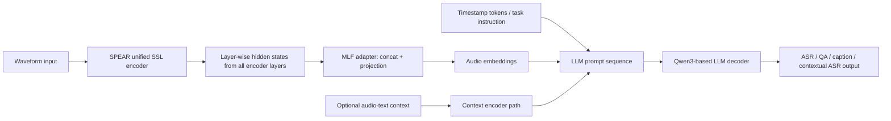
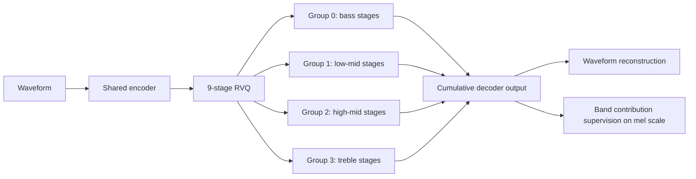
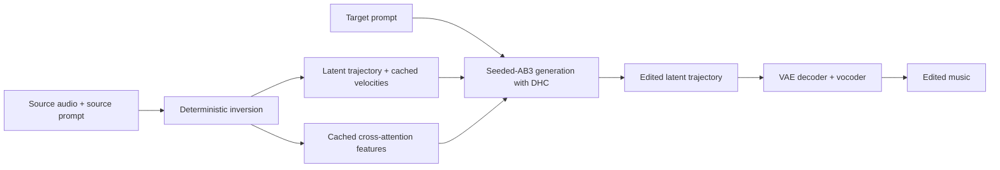
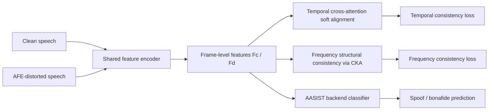
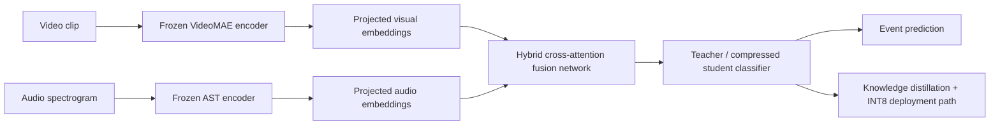

# 语音 / 音频 / 音乐论文速递
## 2026-07-21

> 实际对应 arXiv 更新日：**2026-07-21**  
> 检索范围：`cs.SD + eess.AS`  
> 只放按 ML 顶会审稿口径看，最值得多数读者花时间看的 **5 篇**

## 📋 总览

- 共收录 **5 篇** 相关论文
- 语音大模型 / 通用听觉：**1 篇**
- 音乐生成 / 音频 codec：**2 篇**
- 音频安全 / 鲁棒检测：**1 篇**
- 音视频事件识别 / 边缘部署：**1 篇**

今天这批真正值得优先看的，不是“谁又把模型做大一点”，而是三条更实的主线。`SALMONN-2` 代表的是一个很重要的判断：通用听觉模型未必一定要靠多编码器拼装，单个统一 SSL encoder 加一个像样的层级融合适配器，就已经能把开源 ALLM 的上限往上推。音乐方向的两篇更扎实：`HARP` 把 neural codec 里一直没人正面解决的“RVQ 频谱纠缠”拆开了，`FlowSonic` 则不是又发明一个新音乐模型，而是把 rectified flow 编辑里最容易被忽略的数值积分稳定性打通了。剩下两篇偏安全与部署，`TFCL` 针对真实 RTC 前端链路下的 deepfake detection 崩盘问题，`AVER` 压缩框架则更像一篇部署论文，离语音主线远一些，但对边缘多模态落地有现实参考价值。

## 精选入选规则

- **新意（0-3）**：是不是提出了新的表示、接口、训练组织方式，或者把旧问题拆得更对
- **影响力（0-3）**：是不是贴近语音大模型、音频 codec、音乐生成、检测与部署这些主线
- **证据强度（0-2）**：有没有像样的 baseline、消融和关键数值
- **受众匹配度（0-2）**：对语音大模型 / 音频系统 / 音乐生成 / 安全检测研究者有没有直接启发

分数校准：

- **6**：可读，但更像局部补丁或工程压缩记账
- **7**：信息量够，值得过一遍
- **8+**：建议优先精读

## 总览表

| 方向 | 序号 | 论文 | 评分 | 关键词 |
|---|---:|---|---:|---|
| 语音大模型 / 通用听觉 | 1 | SALMONN-2 | 8.5/10 | unified SSL encoder, MLF adapter, MICL, contextual ASR |
| 音乐 / 音频 codec | 2 | HARP | 8.5/10 | RVQ, harmonic coherence, cumulative decoding, low-bitrate codec |
| 音乐编辑 | 3 | FlowSonic | 8/10 | rectified flow, Seeded-AB3, DHC, zero-shot music editing |
| 音频安全 | 4 | Time-Frequency Consistency Learning | 7.5/10 | speech deepfake detection, AFE robustness, temporal alignment, CKA |
| 多模态部署 | 5 | Efficient Audio-Visual Event Recognition | 6.5/10 | knowledge distillation, INT8 quantization, VideoMAE, AST |

## 🤖 语音大模型 / 通用听觉

### [1] SALMONN-2: Advancing General-Purpose Hearing Abilities with Self-Supervised Representations

- **评分**：8.5/10
- **作者/机构**：Xiaoyu Yang, Xuenan Xu, Wenyi Yu, Siyin Wang, Changli Tang, Terumi Chiba, Siyuan Hou, Ziyang Zhang, Wen Wu, Baoxiang Li, Guangzhi Sun, Chao Zhang, Philip Woodland；University of Cambridge、上海人工智能实验室、清华大学
- **论文链接**：https://arxiv.org/abs/2607.17079
- **PDF**：https://arxiv.org/pdf/2607.17079.pdf
- **代码链接**：**代码已开源** https://github.com/bytedance/SALMONN/tree/salmonn2
- **Demo 链接**：暂无单独 demo 页

#### 📌 简介
这篇不是在喊“再做一个更大的 audio LLM”，而是在认真回答一个基础问题：ALLM 的听觉前端到底要不要靠多编码器拼起来。作者的结论很明确，`SPEAR` 这种统一 SSL encoder 加上一个能把所有层级信息都吃进去的 `MLF adapter`，已经足够把通用语音、通用音频、音乐和副语言任务撑起来，而且在同等开源规模下结果相当硬。

#### ☠️ 毒舌点评
这篇值钱的地方不是模型名，而是它没有继续沿着“多堆几个 encoder、再堆更多指令数据”这条显而易见但越来越笨的路走。它真正提出的增量是统一 SSL 前端、层级融合适配器、以及显式 MICL 训练三件事一起验证。缺点也很清楚：本质上还是一个“音频 encoder + adapter + text LLM”的拼接范式，不是彻底重写 ALLM 架构，所以如果你期待的是范式革命，那没有。

#### 🔧 技术方案
- **模型解决的问题**：现有 ALLM 往往依赖监督式音频 encoder，或者直接上双编码器来覆盖 speech 和 general audio，结果是结构复杂、训练贵、泛化也不一定稳。`SALMONN-2` 想解决的是两个更基本的问题：单个通用 SSL encoder 能不能覆盖广泛听觉任务；以及 audio representation 到 LLM 之间到底该怎么接，才不会把中间层信息全浪费掉。
- **模型架构**：
  - **输入**：音频波形；可选文本上下文、音频-文本 context pair、时间戳 token、contextual ASR biasing 信息。
  - **输出**：自回归文本响应，覆盖 ASR、AAC、音乐描述、QA、上下文 ASR、时间定位类任务。
  - **主干**：`SPEAR unified SSL audio encoder + MLF adapter + Qwen3-family text LLM`。
  - **关键模块**：
    - `SPEAR XLarge`：统一 speech/general-audio SSL encoder，13 层、50 Hz、1280 维 frame-level 表示。
    - `MLF (Multi-Layer Feature Fusion) adapter`：把各层 hidden state 先归一化再拼接，压缩后投影到 LLM embedding space。
    - `Timestamp Injection`：直接用已有文本 token 表示 `<t seconds>`，而不是新增一套 timestamp vocabulary。
    - `MICL`：把文本 biasing entry 和 reference pronunciation 一起作为 multimodal context 做 contextual ASR。
- **信号流**：

- **关键设计 / 核心创新**：
  - 不是直接拿 final-layer audio embedding 喂 LLM，而是显式利用 SSL encoder 的层级结构。
  - 不是默认相信 ICL 会自己涌现，而是明确构造 MICL training，让模型真的学会用 pronunciation context。
  - 不是把 timestamp 当特殊模块，而是把它做成和普通文本 token 同空间的语义提示。
- **训练 / 推理策略**：
  - 训练数据总量约 `18.2k` 小时，覆盖 ASR、AAC、音乐描述、情感、翻译、OSR、SV、SED、spoofing analysis、SQA 等多种任务。
  - 论文强调这套训练量远低于一些依赖百万小时以上 supervised audio-text 数据的开源 ALLM。
  - 9B 和 `30B-A3B` 两个 LLM 规模都做了，说明作者关心的是同一听觉前端在不同文本骨干上的可扩展性。
  - 推理时沿标准 autoregressive decoding；文中重点不在 latency，而在任务覆盖和上下文利用能力。

#### 📊 实验结果
- **Canonical task 表现**：
  - `SALMONN-2 9B` 在 `LibriSpeech` 上做到 `1.7 / 3.0 WER`，`GigaSpeech 9.0 WER`，`AudioCaps 65.0`，`CoVoST2 46.6`，`LibriMix 8.8 cpWER`。
  - `SALMONN-2 30B-A3B` 在 `GigaSpeech` 进一步到 `8.9 WER`，`AudioCaps 65.2`，`IEMOCAP 74.0`，`VoxCeleb1 94.1`。
  - 对比 `SALMONN 7B` 的 `GigaSpeech 10.0 WER`、`AudioCaps 57.6`、`CoVoST2 33.1`，升级不是一点点。
- **General benchmark 表现**：
  - 在 `MMAU-Pro / MMAR / MMSU` 上，`SALMONN-2 9B` 分别是 `58.5 / 64.5 / 69.5`。
  - `30B-A3B` 进一步到 `60.3 / 67.6 / 72.0`。
  - 对比最强相近开源基线 `MOSS-Audio` 的 `57.5 / 64.4 / 66.4`，尤其 `MMSU` 提升明显。
- **MICL contextual ASR**：
  - 训练过 MICL 的 `SALMONN-2` 在 `L=20/50/100` biasing list 下，`MICL` 分别做到 `8.2/6.8/8.3`、`8.4/7.2/8.4`、`8.5/8.0/8.5` 的 `WER/B-WER/U-WER`。
  - 没做 MICL 训练的 `SALMONN-2`，一旦强行喂 MICL context，会崩到 `25.7`、`47.7`、`57.3 WER`。
  - 这组实验很重要，它证明“多模态上下文学习不是自己长出来的”。
- **Extended audio analysis**：
  - `DESED SED`：`70.15`
  - `Spoofing analysis`：`73.65`
  - `QualiSpeech PCC`：`0.661`
  - 其中 `QualiSpeech 0.661` 已经和专门微调的 `QS.-FT-SALMONN 0.660` 持平。
- **关键消融**：
  - `MLF` 比 `Last Layer` 更稳：例如 `LibriSpeech 1.6/3.2 vs 1.7/3.3`，`LibriMix 9.7 vs 10.0`，`VoxCeleb1 94.7 vs 91.9`。
  - `Timestamp Injection` 对 `SED` 有明确帮助：`70.15 vs 68.74`；对 `MMAU-Pro / MMAR / MMSU` 也都有小幅提升。
- **baseline 覆盖**：`SALMONN`、`Qwen2.5-Omni`、`Kimi-Audio`、`MiMo-Audio`、`AF-3`、`AF-Next`、`MOSS-Audio`

#### 💡 为什么值得看
如果你做语音大模型，这篇最值得看的不是某个单项 benchmark，而是它把一个经常被糊弄过去的设计问题拆实了：ALLM 的上限不一定来自更多监督数据和更多前端堆料，也可能来自更好的统一表示和更合理的层级适配。对后续做语音 QA、音频 agent、contextual ASR 和多任务 audio reasoning 都有直接启发。

#### 评分：8.5/10
理由：方向判断对，实验面够广，数据效率也很能打。扣分点在于范式仍是经典 encoder-adapter-LLM 三段式，没有真正把听觉建模和语言建模融合到新的统一训练范式里。

## 🎼 音乐生成 / 音频 codec

### [2] HARP: Harmonic-Aware Residual Partitioning for Neural Audio Codecs

- **评分**：8.5/10
- **作者/机构**：Qiaoyu Yang, Lixing He, Binyue Deng, Weifeng Zhao；Georgia Institute of Technology、The Chinese University of Hong Kong、Tencent Music Entertainment
- **论文链接**：https://arxiv.org/abs/2607.16657
- **PDF**：https://arxiv.org/pdf/2607.16657.pdf
- **代码链接**：**代码已开源** https://github.com/QiaoyuYang/harp-codec
- **Demo 链接**：暂无独立 demo 页，repo 提供训练脚本与样例

#### 📌 简介
这篇解决的是 neural audio codec 里一个被默认很久、但其实很要命的问题：标准 `RVQ` 根本不懂频率结构。每一级 codebook 都在全频段里抢残差，结果一旦截断 stage 做低码率，哪一段频谱先死完全不可控。`HARP` 的核心不是换骨干，而是只改训练目标，让 RVQ stage 自己学出从低频到高频的层级顺序，同时还保住跨频段谐波关系。

#### ☠️ 毒舌点评
这篇是很典型的“看起来不炸裂，实际很有后劲”的论文。它没搞一个新 codec 大模型，也没换量化器，只在训练时把 stage 组织方式和监督目标掰正，结果就把低码率可解释性和谐波一致性一起救了回来。缺点是它更像一个强训练策略而不是新架构，所以如果你追的是“新模型名字”，这篇不够花哨；但如果你真做 codec，这类工作反而更值钱。

#### 🔧 技术方案
- **模型解决的问题**：标准 RVQ 的 stage 会发生严重 `spectral entanglement`，即每一级都在编码差不多的频谱混合物；并行分带方案虽然能做频带专精，但又会把跨频带谐波关系打碎。`HARP` 想解决的是：能不能保留单 encoder-decoder、单 token stream 的统一结构，同时让 stage 有明确频带分工，并且让高频重建时还能“看见”低频基音。
- **模型架构**：
  - **输入**：语音、音乐或一般音频波形。
  - **输出**：标准 neural codec 的量化 latent 与重建波形。
  - **主干**：完全沿用 `DAC` 风格 `encoder + 9-stage RVQ + decoder`。
  - **关键模块**：
    - `Hierarchical stage groups`：9 个 RVQ stage 被分成 `3-2-2-2` 四组。
    - `Cumulative decoding`：第 k 组重建时，decoder 仍能访问所有更低频组的累计 latent。
    - `Subband contribution supervision`：监督的是“这一组额外贡献了什么”，不是整个累计输出。
    - `Soft band weighting`：用可学习 Gaussian mel 权重做软边界，而不是矩形硬切频带。
- **信号流**：

- **关键设计 / 核心创新**：
  - 不再让每个 RVQ stage “谁先把误差吃掉算谁本事”，而是通过频带层级训练强制早期 stage 优先学低频与基音。
  - `Cumulative decoding` 是关键，因为它让高频 group 在补泛音时可以看到更低频基础成分，不会像并行分带那样盲补。
  - `Soft band weighting` 避免了硬分带常见的 band-edge artifact，这点比只说“做 frequency-aware loss”更实。
- **训练 / 推理策略**：
  - 训练数据覆盖音乐、语音和 general audio，音乐包括 `MUSDB18-HQ`、`MTG-Jamendo`，语音用 `LibriTTS`，一般音频用 `FSD50K`。
  - 在 `L=9`、`K=4` 的默认配置上训练，整体码率约 `7.7 kbps`。
  - 引入 `group dropout` 支持 variable-bitrate decoding，让低码率阶段优先保住 bass group。
  - 推理完全不变，仍是标准 RVQ inference，不新增参数、不新增 forward pass。

#### 📊 实验结果
- **7.7 kbps 重建质量**：
  - 音乐：`HARP SI-SDR 9.22 / KAD 0.29`，优于 `DAC 8.97 / 0.35` 和 `BSCodec 7.96 / 0.30`。
  - 语音：`HARP 10.71 / 0.14`，优于 `DAC 9.75 / 0.19` 与 `BSCodec 9.24 / 0.16`。
  - 一般音频：`HARP 7.39 / 0.28`，优于 `DAC 7.06 / 0.33` 与 `BSCodec 6.52 / 0.37`。
- **低码率可扩展性**：
  - `2.6 kbps` 下，音乐 `HARP 4.13 dB`，`DAC 3.70`；语音 `4.41 vs 3.74`；一般音频 `0.59 vs -0.16`。
  - 论文明确说 HARP 在最低码率上对 DAC 的平均优势约 `+0.6 dB`，这才是它真正有价值的地方。
- **频谱专精分析**：
  - HARP 学到的 mel centroid 分组是 `0.08 / 0.08 / 0.65 / 0.81`，说明前两组真被压到了 bass 到 low-mid。
  - DAC 的对应分布是 `0.06 / 0.17 / 0.18 / 0.18`，高频根本没被后期 stage 独立承担，典型频谱纠缠。
- **谐波一致性测试**：
  - 对 `500` 组合成泛音信号，aligned-phase 条件下 HARP 达到 `phase coherence 0.988`、`amplitude RMSE 1.83 dB`，优于 `DAC 0.967 / 1.93 dB`。
  - random-phase 条件下，`BSCodec` 直接塌到 `0.831 ± 0.173 / 8.93 dB`，HARP 仍有 `0.986 / 4.03 dB`，验证了并行分带会破坏跨带推理。
- **语音感知质量**：
  - `LibriTTS` 上 `PESQ 3.254`，高于 `DAC 3.167` 和 `BSCodec 3.08`。
  - `STOI 0.954`，和 DAC 持平，但更稳。
- **MUSHRA**：
  - 论文报告 HARP 在 `4.3 kbps` 下对 DAC 平均 `+9` 分，在 `7.7 kbps` 下平均 `+6` 分。
- **baseline 覆盖**：`DAC`、`BSCodec`、`SoundStream`、`EnCodec` 等

#### 💡 为什么值得看
如果你做 codec，这篇非常值得读，因为它证明了很多人默认接受的事实其实只是训练目标懒得改。它不是靠更大的网络去碾压，而是把“stage 到底该学什么”这个问题重新定义清楚了。对所有做低码率、可变码率和 token-based audio LM 前端的人，这都是很直接的训练策略启发。

#### 评分：8.5/10
理由：问题真，方案克制，实验横跨 music / speech / general audio，而且低码率收益最明显。扣分点是它仍然建立在已有 codec 骨干上，更偏强策略而非新架构。

### [3] FlowSonic: Stable Zero-Shot Music Editing via High-Order Trajectory Integration

- **评分**：8/10
- **作者/机构**：Ali Boudaghi, Hadi Zare；当前 arXiv 公开稿未清晰列出机构，正文仅明确通讯邮箱域名为 `ut.ac.ir`
- **论文链接**：https://arxiv.org/abs/2607.17526
- **PDF**：https://arxiv.org/pdf/2607.17526.pdf
- **代码链接**：**代码已开源** https://github.com/aliramsy/FlowSonic
- **Demo 链接**：暂无单独 demo 页

#### 📌 简介
这篇做的是零样本文字引导音乐编辑，但重点不在“再发明一个编辑模型”，而在于 rectified flow 编辑链路里最容易被忽略的数值稳定性。作者基于预训练 text-to-music rectified-flow transformer，先对真实音乐做 deterministic inversion，再用 `Seeded-AB3 + Dynamic History Caching` 稳定生成阶段的高阶积分，并复用 inversion 过程中的 cross-attention 表征来保留原曲结构。

#### ☠️ 毒舌点评
这篇最大的优点是知道自己在修什么。很多编辑论文把失败都怪到 prompt 或 feature injection 上，这篇先承认数值 ODE solver 本身就是主要误差源，所以先修积分，再谈结构注入。它的不足是主干还是建立在 `FluxMusic` 这种预训练生成器上，semantic alignment 并没有在所有客观指标上全面碾压，比如 genre transfer 的 `CLAP` 最高还是 `AudioLDM2`，所以你不能把它说成无敌。

#### 🔧 技术方案
- **模型解决的问题**：zero-shot music editing 不是单纯“把目标 prompt 喂给生成器”这么简单，因为真实录音需要先反演到 latent，再做目标引导生成。这个链路里 inversion 和 generation 两段都要数值积分，一旦 warm-start 不稳定，后面就会一路把结构弄糊。`FlowSonic` 想解决的就是 inversion-based editing 的轨迹稳定性和结构保真。
- **模型架构**：
  - **输入**：源音频、源 prompt、目标编辑 prompt。
  - **输出**：保留原曲结构但满足目标 prompt 的编辑后音乐。
  - **主干**：`pretrained rectified-flow diffusion transformer (FLUX that Plays Music) + deterministic inversion + Seeded-AB3 solver`。
  - **关键模块**：
    - `Deterministic inversion`：先把真实音乐反演到 latent。
    - `DHC (Dynamic History Caching)`：把 inversion 阶段的 velocity evaluation 缓存下来，给 AB3 求解器直接做冷启动。
    - `Cross-attention feature reuse`：generation 阶段重用 inversion 中缓存的 attention 表征。
    - 三种注入方式：`K Injection`、`V Injection`、`KV Injection`。
- **信号流**：

- **关键设计 / 核心创新**：
  - 不再用传统 multi-step solver 的低阶 warm start，而是直接用 inversion 阶段拿到的历史速度初始化 AB3。
  - 把结构保留问题拆成两层：数值轨迹先稳住，再决定注入哪些 attention feature。
  - `KV` 和 `V` 注入不是装饰项，而是明确比较它们对 timbre / genre edit 的差异。
- **训练 / 推理策略**：
  - 这是零样本编辑框架，不需要 paired editing data、额外 fine-tuning 或 test-time optimization。
  - 在 timbre transfer 和 genre transformation 两个数据设定上评测。
  - 关键超参数包括 CFG、injection block 数与注入步数，但论文强调公平比较时会调 solver 的 CFG 以对齐编辑强度。
  - 推理核心代价集中在 rectified-flow ODE 求解和 feature cache reuse，论文重点是质量改进，不是实时部署。

#### 📊 实验结果
- **数值积分消融：timbre transfer**：
  - `Heun`：`CLAP 0.233`、`Chroma 0.812`、`FAD 4.121`、`CQT-PCC 0.558`
  - `Second-Order Euler`：`0.237 / 0.836 / 4.456 / 0.596`
  - `Unseeded AB3`：`0.236 / 0.842 / 3.869 / 0.612`
  - `Seeded AB3`：`0.238 / 0.860 / 3.938 / 0.638`
  - 说明 DHC 的主要收益不在 FAD 单点，而在 semantic / harmonic / structural 三项一起更均衡。
- **数值积分消融：genre transfer**：
  - `Seeded AB3` 达到 `CLAP 0.538`、`Chroma 0.797`、`FAD 4.693`、`CQT-PCC 0.468`。
  - 相比 `Heun 0.534 / 0.771 / 6.590 / 0.359`，结构稳定性改善非常明显。
- **完整方法：timbre transfer**：
  - `FlowSonic KV Injection`：`CLAP 0.238`、`Chroma 0.860`、`CLAP+Chroma Avg. 0.549`、`CQT-PCC 0.638`、`FAD 3.938`
  - `FlowSonic V Injection`：`0.231 / 0.858 / 0.545 / 0.637 / 3.887`
  - `AudioLDM2` 虽然 `FAD 3.623` 更低，但 `Chroma 0.817`、`CQT-PCC 0.557` 明显更差，说明真实编辑保真不如 FlowSonic。
- **完整方法：genre transfer**：
  - `FlowSonic KV Injection`：`0.538 / 0.797 / 0.667 / 0.468 / 4.693`
  - `FlowSonic V Injection`：`0.534 / 0.800 / 0.667 / 0.471 / 4.691`
  - `AudioLDM2` 的 `CLAP 0.583` 最高，但 `Chroma 0.694`、`CQT-PCC 0.154` 很烂，说明它更像“听指令改头换面”，不是“保结构地编辑”。
- **主观听感**：
  - timbre transfer：`FlowSonic KV` 拿到 `MOS-T 4.00`、`MOS-P 4.20`、`Overall 4.10`，显著高于 `FluxMusic 1.08` 和 `AudioLDM2 3.23`。
  - genre transfer：`FlowSonic V` 拿到 `MOS-T 4.00`、`MOS-P 4.35`、`Overall 4.18`；`KV` 也有 `4.05 Overall`。
  - 这组主观结果比客观指标更能说明它的价值：它不是某个指标小涨，而是真把编辑从“能改”变成“可听”。
- **baseline 覆盖**：`MusicGen`、`AudioLDM2`、`Zeta`、`FluxMusic`

#### 💡 为什么值得看
如果你做音乐编辑、音频编辑或者任何 inversion-based generative audio，这篇很值得看，因为它把一个经常被忽略的事实写明白了：数值积分策略本身就是模型能力的一部分。很多时候你以为是 prompt 不行、feature 不行，其实是 solver 把轨迹先搞坏了。这个洞见对音频、图像、视频的 flow/diffusion 编辑都是通用的。

#### 评分：8/10
理由：问题抓得准，客观和主观实验都扎实。扣分点是底层能力仍被预训练主干上限锁死，semantic alignment 在某些指标上也不是绝对最强。

## 🛡️ 音频安全 / 鲁棒检测

### [4] Time-Frequency Consistency Learning for Robust Speech Deepfake Detection

- **评分**：7.5/10
- **作者/机构**：Jun Xue, Zhuolin Yi, Yanzhen Ren, Yihuan Huang, Jiayu Xiong, Yi Chai, Guanxiang Feng, Jiajun Liu, Tong Zhang；武汉大学、同济大学
- **论文链接**：https://arxiv.org/abs/2607.17761
- **PDF**：https://arxiv.org/pdf/2607.17761.pdf
- **代码链接**：**代码已开源** https://github.com/JunXue-tech/TFCL
- **Demo 链接**：暂无

#### 📌 简介
这篇盯的是一个很现实但常被 benchmark 规避的问题：deepfake speech detection 在真实通信链路里根本不是“只加点噪声”这么简单，真正会毁掉模型的是 `AEC -> NS -> AGC -> VAD` 这种前端级联处理。作者先把这条 AFE pipeline 系统模拟出来，再提出 `TFCL`，同时从时间依赖和频率结构两头约束 clean/distorted 表征的一致性，目标是让 spoof cues 在前端链路前后都尽量稳定。

#### ☠️ 毒舌点评
这篇不是那种追求极限 leaderboard 的 paper，而是少见地往部署真问题上靠了一步。好处是选题很实，实验也直接暴露了现有 SDD 模型在真实 RTC 前端下有多脆。问题是方法本身仍然属于“在现有 backbone 上加 consistency learning”的稳健增强路线，不是新范式；如果你不关心真实通信场景，它的吸引力会小很多。

#### 🔧 技术方案
- **模型解决的问题**：现有 SDD 模型大多只在 clean 或简单噪声条件下好看，但一上真实通信链路，`AEC/NS/AGC/VAD` 会同时引入时间错位、频谱结构扭曲和非线性增益变化，导致 spoof representation 直接漂。`TFCL` 想解决的是 AFE 前后表征不稳定的问题。
- **模型架构**：
  - **输入**：clean speech 与经 AFE pipeline 扭曲后的 distorted speech。
  - **输出**：spoof / bonafide 分类结果。
  - **主干**：共享 feature encoder + `AASIST` backend classifier；训练时额外加 `TFCL` dual-branch consistency module。
  - **关键模块**：
    - `Temporal Dependency Consistency Learning`：用 bidirectional cross-attention 做软对齐。
    - `Frequency Structural Consistency Learning`：把频率方向重排后，用 `CKA` 约束二阶结构稳定。
    - `classification loss + temporal loss + frequency loss` 联合优化。
  - **推理特性**：dual-input 与 TFCL 模块只在训练使用，推理时移除，不增额外开销。
- **信号流**：

- **关键设计 / 核心创新**：
  - 把 AFE 破坏拆成“时间依赖断裂”和“频率结构失真”两类，而不是笼统做 data augmentation。
  - temporal 分支不做死板 frame-wise matching，而是 relation-aware soft alignment。
  - frequency 分支不追求逐点相同，而是保留二阶结构关系，这点比很多 feature consistency 文章更合理。
- **训练 / 推理策略**：
  - 基准数据是 `ASVspoof2019 LA`。
  - 训练 / 开发集合上用 `MUSAN` 噪声，评测集合上用 `DNS` 噪声；同时模拟 WebRTC 风格 `AEC -> NS -> AGC -> VAD` 级联。
  - baseline 选了 `XLSR+AASIST`、`XLSR+MultiConv`、`XLSR+Nes2Net` 等。
  - 最终 loss 是 clean/distorted 两个分类损失加一致性项，论文里超参数 `λ=0.3`。

#### 📊 实验结果
- **先把问题打明白**：
  - `AASIST` 在 clean 条件下 `EER 0.83 / AUC 99.93`，到完整 `VAD` 阶段直接掉到 `47.11 / 54.97`。
  - `XLSR_AASIST` 也从 `0.23 / 99.97` 掉到 `22.20 / 86.59`。
  - 这说明不少 deepfake detection 论文吹的鲁棒性，根本没经过真实前端链路。
- **TFCL 主结果**：
  - 作者方法在 clean 下是 `0.55 / 99.96`，不是最优 clean 模型，但完整 `VAD` 阶段仍有 `9.78 / 96.40`。
  - `echo / aec / noisy / ns / agc` 各阶段分别是 `1.77 / 99.80`、`2.19 / 99.68`、`3.87 / 99.14`、`3.91 / 99.20`、`4.84 / 98.79`。
  - 对比 `XLSR_Nes2Net` 在 `VAD` 阶段的 `24.83 / 82.11`，优势非常大。
- **训练策略对比**：
  - `Clean-only` 到 `VAD` 是 `22.20 EER`。
  - `AFE-only` 到 `VAD` 是 `11.84 EER`。
  - `Mix` 到 `VAD` 仍有 `17.39 EER`。
  - `Ours` 到 `VAD` 是 `9.78 EER`，说明不是简单多喂脏数据就能解决。
- **backbone 泛化**：
  - `XLSR_Nes2Net` 加 TFCL 后，`VAD EER 11.08`，不加是 `15.58`。
  - `XLSR_MultiConv` 加 TFCL 后，`11.76`，不加是 `14.76`。
  - 说明这套 consistency 学习不只绑死在 AASIST 上。
- **关键消融**：
  - 去掉 `TACL`：`VAD EER 10.48`
  - 去掉 `FSCL`：`10.99`
  - 去掉 `Bi-attention`：`11.37`
  - 说明时间和频率两条分支都不是装饰件。
- **baseline 覆盖**：`AASIST`、`XLSR_AASIST`、`XLSR_TCM`、`XLSR_SLS`、`XLSR_Nes2Net`、`XLSR_MultiConv`、`ALLM4ADD`

#### 💡 为什么值得看
如果你做 deepfake detection、安全语音或反欺诈，这篇值得看，因为它把“真实前端链路会不会把检测模型打废”这件事从口头风险变成了有数值的事实。更重要的是，它给了一个相对轻量、推理无额外开销的修补方向，这比单纯再堆一个更大的分类器现实得多。

#### 评分：7.5/10
理由：问题非常真实，结果也很有说服力。扣分点是方法层面更像稳健增强策略而不是新的检测范式，对完全不关心部署链路的人吸引力有限。

## 🧩 音视频事件识别 / 边缘部署

### [5] Efficient Audio-Visual Event Recognition via Knowledge Distillation and Dynamic INT8 Quantization of a Hybrid Cross-Attention Network

- **评分**：6.5/10
- **作者/机构**：Parinaz Binandeh Dehaghani, Danilo Pena, A. Pedro Aguiar；University of Porto、ResoSight
- **论文链接**：https://arxiv.org/abs/2607.16980
- **PDF**：https://arxiv.org/pdf/2607.16980.pdf
- **代码链接**：暂未发现官方开源仓库（已检查论文正文、arXiv 页面和 GitHub 精确标题搜索）
- **Demo 链接**：暂无

#### 📌 简介
这篇不是做新的 AVER 大模型，而是做一件更务实的事：把 `VideoMAE + AST + hybrid cross-attention` 的音视频事件识别网络压到边缘设备还能跑。作者的策略也很传统但有效，先做 architecture-aware student 缩模，再用 knowledge distillation 保性能，最后上 dynamic INT8 post-training quantization 把模型尺寸继续压下去。

#### ☠️ 毒舌点评
这篇的价值很明确，就是部署，不是方法学突破。它没有提出新的音视频融合范式，也没有在识别精度上卷出新高度，所以从研究新意看只能算中规中矩。但如果你恰好在做多模态 edge AI，这种“先冻住大 backbone，只压 trainable fusion head”的思路是很实用的。

#### 🔧 技术方案
- **模型解决的问题**：transformer-based AVER 的性能不错，但 `VideoMAE + AST + cross-attention fusion` 这套东西对边缘设备太重。作者要解决的是“保住 multimodal reasoning 的同时，把真正需要部署的 trainable multimodal head 压小”。
- **模型架构**：
  - **输入**：视频片段与音频对应 log-Mel / visual embedding。
  - **输出**：AVE 事件类别预测。
  - **主干**：`VideoMAE + AST` 提取离线特征，之后接 `Stable Hybrid Cross-Attention` fusion 网络和分类头。
  - **关键模块**：
    - `Teacher`：高容量 hybrid cross-attention multimodal network。
    - `Student`：保持原融合拓扑，但压缩 hidden dim、attention head 数和 FFN 宽度。
    - `Response-based knowledge distillation`：用 teacher soft logits 蒸馏 student。
    - `Dynamic INT8 quantization`：对线性层做 post-training 动态量化。
- **信号流**：

- **关键设计 / 核心创新**：
  - 不是盲目压全模型，而是明确只压可训练的 fusion/classification 部分，保留离线特征提取 backbone。
  - student 与 teacher 保持同拓扑，蒸馏更顺。
  - INT8 用的是 post-training dynamic quantization，不增加再训练开销。
- **训练 / 推理策略**：
  - 数据集是 `AVE`，共 `4,143` 段 YouTube 视频，`28` 类事件。
  - `VideoMAE` 和 `AST` 全程冻结，先离线提特征再训练 fusion head。
  - 训练 teacher 后冻结，再蒸馏 student，最后做 dynamic INT8 量化。
  - 论文特别强调部署目标是 memory-constrained edge device，不是 server-side 多卡推理。

#### 📊 实验结果
- **Teacher -> Student 压缩**：
  - teacher：`84.19% accuracy`，`84.17 weighted F1`
  - student：`82.05% accuracy`
  - 绝对精度只掉了 `2.14` 个点，但 trainable 参数从 `6.86M` 降到 `2.81M`，减了 `59.06%`
- **模型尺寸**：
  - teacher model size：`26.16 MB`
  - student model size：`10.71 MB`
  - checkpoint：`78.53 MB -> 32.19 MB`
  - 压缩比约 `2.44x`
- **INT8 量化**：
  - 量化后模型大小进一步到 `2.04 MB`
  - checkpoint 变成 `4.25 MB`
  - 准确率仍有 `81.20%`
  - 相比 teacher 总共只掉 `2.99` 个点，说明量化没有把模型直接打废
- **论文自己也承认的现实点**：
  - dynamic INT8 后 CPU latency 并没有明显更快，甚至略高，因为模型本来就不大，量化开销反而可见。
  - 所以它真正赚到的是存储空间，而不是一切指标通吃。
- **baseline / 参照对象**：
  - 这篇主要是 teacher-student 内部对照，不是和一串 SOTA AVER 融合网络狠狠干表。
  - 因此它更适合被理解成部署论文，不适合被包装成识别范式突破。

#### 💡 为什么值得看
如果你做音视频多模态部署，这篇的价值在于它示范了一个比较干净的切分方法：把重 backbone 视作固定特征器，真正压缩的是 multimodal reasoning head。这个思路对很多“预训练 backbone 很强，但下游部署太胖”的音频多模态模型都能借鉴。

#### 评分：6.5/10
理由：工程价值明确，但研究新意有限，和今天另外四篇相比学术冲击力明显偏弱。更适合做部署参考，不太适合做主线跟进。

## 最后结论

如果你今天只想挑三篇优先读，我会按这个顺序排：

1. `SALMONN-2`
2. `HARP`
3. `FlowSonic`

原因很简单：

- `SALMONN-2` 对语音大模型读者最有用，因为它讨论的是 ALLM 前端该怎么建，而不是单个 benchmark 怎么刷。
- `HARP` 对做 codec 和 audio tokenization 的人最有现实启发，因为它直接改写了 RVQ stage 的训练逻辑，而且 inference 零成本。
- `FlowSonic` 对做音乐编辑、音频编辑和 flow-based 生成的研究者最值得看，因为它说明 solver 不是细节，而是结果本身。

剩下两篇里，`TFCL` 是偏部署鲁棒性的好工作，尤其适合做语音安全和反欺诈的人；`AVER` 更像部署压缩论文，信息有用，但优先级明显低于前四篇。
