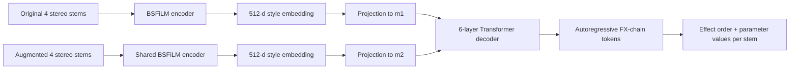
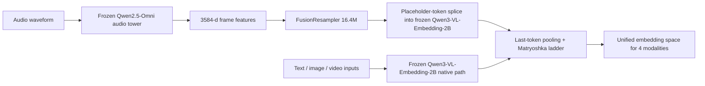
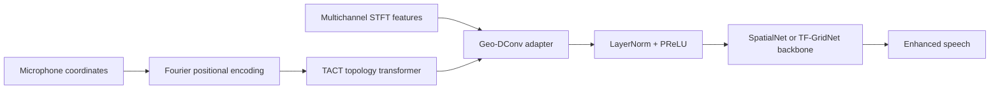
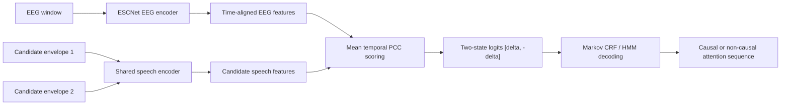
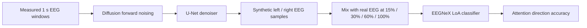

# 语音 / 音频 / 音乐论文速递
## 2026-07-22

> 实际对应 arXiv 更新日：**2026-07-22**  
> 检索范围：`cs.SD + eess.AS`  
> 只放按 ML 顶会审稿口径看，最值得多数读者花时间看的 **5 篇**

## 📋 总览

- 共收录 **5 篇** 相关论文
- 音乐制作 / 音频表示：**1 篇**
- 多模态统一表示：**1 篇**
- 语音前端 / 多通道增强：**1 篇**
- 听觉脑机接口 / AAD：**2 篇**

今天这批稿子里，最值得优先看的不是“又来了个更大的语音模型”，而是三条更实在的线。`StemFX` 把混音风格建模从“听起来像不像”推进到可解释的效果链生成，方法和实验都比常见音乐制作论文硬不少；`Fusion Embedding` 则抓住了一个很多多模态系统论文故意回避的问题: 你要往现有检索底座里加音频，能不能不把原来的 text/image/video 索引全砸了重建；`Geo-DConv` 和两篇 AAD 论文属于另一条很工程的主线，核心都不是堆模型，而是把序列结构、阵列几何或数据稀缺这类老痛点正面拆开。

真正偏弱的是第二篇扩散 EEG 增广论文。它不是没结果，而是结果只比 baseline 高了不到 `1%` 绝对准确率，还只在单数据集上成立。能看，但别把它当成“扩散模型已经解决 AAD 数据问题”的证据。

## 精选入选规则

- **新意（0-3）**：是不是提出了新的表示、接口、训练组织方式，或者把旧问题拆得更对
- **影响力（0-3）**：是不是贴近语音前端、语音大模型、音频检索、音乐制作、听觉脑机接口这些主线
- **证据强度（0-2）**：有没有像样的 baseline、消融和关键数值
- **受众匹配度（0-2）**：对语音 / 音频 / 音乐研究者有没有直接可迁移的启发

分数校准：

- **6**：可读，但更像局部补丁或小范围可行性验证
- **7**：信息量够，值得过一遍
- **8+**：建议优先精读

## 总览表

| 方向 | 序号 | 论文 | 评分 | 关键词 |
|---|---:|---|---:|---|
| 音乐制作 / 音频表示 | 1 | StemFX: Learning Mixing Style Representations via Autoregressive FX Chain Prediction on Source-Separated Stems | 8.5/10 | mixing style, FX chain generation, source separation, FiLM, 105K songs |
| 多模态统一表示 | 2 | Fusion Embedding: A Unified Embedding Space for Text, Image, Video, and Audio | 8/10 | frozen backbone, audio retrieval, unified embedding, invariance, Qwen |
| 语音前端 / 多通道增强 | 3 | Towards Array-Invariant Speech Enhancement via Geometry-Aware Dynamic Convolution | 8/10 | array-invariant SE, geometry prior, dynamic convolution, RealMAN |
| 听觉脑机接口 / AAD | 4 | End-to-End Markov State Sequence Learning for Auditory Attention Decoding | 7.5/10 | CRF, ESCNet, EEG-speech correlation, HMM, sequence training |
| 听觉脑机接口 / 数据增广 | 5 | Addressing Limited Data in Auditory Attention Decoding with Diffusion Generative Models | 6.5/10 | EEG diffusion, LoA classification, synthetic data, low-data AAD |

## 🎚️ 音乐制作 / 音频表示

### [1] StemFX: Learning Mixing Style Representations via Autoregressive FX Chain Prediction on Source-Separated Stems

- **评分**：8.5/10
- **作者/机构**：Yuan-Chiao Cheng, Jui-Te Wu, Brian Chen, Yen-Tung Yeh, Yu-Hua Chen, Yi-Hsuan Yang；Independent Researcher，National Taiwan University
- **论文链接**：https://arxiv.org/abs/2607.15634
- **PDF**：https://arxiv.org/pdf/2607.15634.pdf
- **代码链接**：**代码已开源** https://github.com/barry-mir/stemfx
- **Demo 链接**：https://barry-mir.github.io/stemfx-demo/

#### 📌 简介
这篇做的是混音风格表示，但不是那种泛泛的“从参考音频迁移风格”老路，而是直接预测每个 stem 的 `FX chain`。作者把原始 stem 和增强后 stem 配对输入编码器，再让 Transformer 自回归地生成变长效果链，连效果顺序和参数一起出，目标很明确: 让混音风格从黑箱 embedding 变成可执行、可编辑、可解释的结构化结果。

#### ☠️ 毒舌点评
这篇比很多“AI 混音”论文认真得多。它没有满足于在 stereo mix 上做个 vague style transfer，而是把问题压到了真正决定混音风格的效果链上。短板也明显: 训练数据还是靠 source separation 伪造 pseudo-stem，再随机采样效果链，离真实工程师的习惯还差一截；但在“可解释混音建模”这条线上，它已经比只做对比学习 embedding 的路线更像回事。

#### 🔧 技术方案
- **模型解决的问题**：过去的混音风格方法通常卡在三个地方：要么只对 stereo mixture 做整体建模，要么固定效果链结构，要么依赖可微效果器和小规模配对 multitrack 数据。`StemFX` 解决的是“如何在每个 stem 上预测可变长、可执行的 FX chain，并把数据规模做起来”。
- **模型架构**：
  - **输入**：`4` 个 source-separated stereo stems（vocals、bass、drums、other），采样率 `44.1 kHz`；训练时同时喂入原始 `x_orig` 与增强后的 `x_aug`。
  - **输出**：按 stem 串接的 FX token 序列，包含效果名、参数名和量化后的参数值。
  - **主干**：`BSFiLM Encoder + Transformer FX Chain Generator` 的双塔结构。
  - **关键模块**：
    - `BSFiLM Encoder`：把 `8` 通道输入转成 log-mel，切成重叠频带后走独立 CNN。
    - `FiLM conditioning`：注入 `64` 个 hand-crafted mixing features。
    - `FX tokenization`：总词表 `358` 个 token，包括 `85` 个 effect token、`164` 个参数名 token、`101` 个 value bin。
    - `paired conditioning`：原始 stem 和增强 stem 分别编码，再投影成 `m1 / m2` 两个条件向量给 decoder 做 cross-attention。
- **信号流**：

- **关键设计 / 核心创新**：
  - 用 FX chain 生成替代对比式风格表示学习，输出直接可执行，而不是只给一个“像不像”的 embedding。
  - 把每个 stem 的效果链做成变长序列，允许模型自由选择“用什么效果”和“效果顺序”。
  - `Sep-Aug Pipeline` 通过对约 `105K` 首歌曲做 source separation，再用 `MultiAFx` 从 `7` 个 Python 音频库里统一调用 `85` 个效果器，构造出远大于 MUSDB18 / MedleyDB / MoisesDB 的训练规模。
- **训练 / 推理策略**：
  - 训练目标是标准 teacher-forcing cross entropy。
  - `BSFiLM Encoder` 输出 `512` 维 embedding，Transformer decoder 为 `6` 层、`8` 头、`d_model=512`、`FFN=2048`。
  - 优化器用 `AdamW`，学习率 `3e-4`，weight decay `0.01`，warmup `1000` steps，batch size `64`。
  - 训练 `60` 个 epoch，论文报告总耗时约 `56` GPU 小时，单卡 `RTX 5090`，使用 `10` 秒音频片段。
  - 推理直接一次性生成 FX chain；不像 `ST-ITO` 那类方法要在测试时做上千次迭代搜索。

#### 📊 实验结果
- **Mixing style retrieval**：
  - 在 `1` 个效果时，`StemFX` 的 `Top-1` 为 `16.8%`、`MRR` 为 `0.235`，显著高于 `AFx-Rep` 的 `3.0% / 0.067`。
  - 在 `8` 个效果时，`StemFX` 到了 `86.8% Top-1`、`0.903 MRR`；`AFx-Rep` 是 `68.4% / 0.754`，`Fx-Encoder++` 只有 `38.0% / 0.459`。
  - 同架构同数据下的 `BSFiLM-CL` 只有 `77.8% Top-1`，说明这里起决定作用的不是 encoder 规模，而是 FX chain prediction objective 本身。
- **Paired mixing style transfer**：
  - 在 synthetic set 上，`StemFX` 的 `MRSTFT` 为 `2.35`，推理时间 `0.24s`。
  - `StemFX forced` 为 `3.12 / 1.91s`，`ITO + AFx-Rep` 为 `3.71 / 1033s`，`ITO + BSFiLM` 为 `2.89 / 1717s`。
  - 在真实专业混音 `Real Mix` 上，`StemFX` 取得最佳 `MRSTFT 1.44` 和最高 `MUSHRA 60.6`，甚至超过 `FX-normalized` 低锚点的 `54.9`；`ITO + AFx-Rep` 只有 `30.6`，`ITO + BSFiLM` 只有 `19.9`。
- **消融**：
  - 去掉 `FiLM` 后，`8` 效果场景的 `Top-1` 从 `86.8%` 掉到 `74.4%`。
  - 去掉 source separation、直接从 mixture 学时，`Top-1` 直接掉到 `48.0%`。
  - 把 `BSFiLM` 换成 `HTSAT-tiny`，`Top-1` 也会降到 `60.2%`。
- **数据规模分析**：
  - 论文明确展示了 `10% / 50% / 100%` 的训练规模对检索性能的抬升；`100%` 数据时 `Top-1` 达到 `86.8%`，证明这套 `105K` 级别的伪配对数据确实是主要增益来源。
- **baseline 对比**：`AFx-Rep`、`Fx-Encoder++`、`BSFiLM-CL`、`ST-ITO`

#### 💡 为什么值得看
如果你做音乐制作、音频编辑辅助、可解释音频生成，这篇值得看的不是“效果更好”这四个字，而是它把混音风格真正落成了一个人能读、人能改、机器能执行的效果链表示。很多所谓 style transfer 论文到这一步就开始糊了，它没有。

#### 评分理由
`8.5/10`。问题定义准，方法结构完整，数据和实验也都扎实。主要扣分点是 pseudo-stem 与随机效果链和真实工程场景仍有差距，但这已经是能往工程链路走的一篇音乐 AI 论文。

## 🌐 多模态统一表示

### [2] Fusion Embedding: A Unified Embedding Space for Text, Image, Video, and Audio

- **评分**：8/10
- **作者/机构**：Abdul Basit Tonmoy, Kazi Fardinul Hoque, Md. Shahrier Islam Arham, Arman Luthra；Eximius Labs，Wabash College，Skop Intelligence Co.
- **论文链接**：https://arxiv.org/abs/2607.18666
- **PDF**：https://arxiv.org/pdf/2607.18666.pdf
- **代码链接**：**代码已开源** https://github.com/Eximius-Labs/fusion-embedding
- **Demo 链接**：https://huggingface.co/EximiusLabs/fusion-embedding-2-2b-preview

#### 📌 简介
这篇想做的是一个真正统一的 embedding space：text、image、video 已经有现成的 Qwen3-VL embedding 底座，作者要做的是把 audio 接进去，而且不能破坏已有系统。`fusion-embedding-1` 只训练一个 `16.4M` 的 connector；`fusion-embedding-2` 在此基础上再加 `44.2M` 的 audio-only gated adapters，但对非音频输入保持 bitwise-identical 输出。

#### ☠️ 毒舌点评
这篇最值钱的地方不是“我们也做了音频检索”，而是它把部署侧最怕的事情写成了硬约束：不能改坏原来已经建好的 text/image/video 索引。这个约束比很多多模态论文真实得多。缺点也很直白：音频检索指标仍然打不过真正的 specialist audio-text 模型，所以它更像一篇极强的系统论文，而不是音频检索 SOTA 本身。

#### 🔧 技术方案
- **模型解决的问题**：现有统一 embedding 底座通常没有 audio；而纯音频检索模型只覆盖 audio-text，又不能复用现有多模态索引。`Fusion Embedding` 解决的是“如何在不重训、不重嵌入已有 text/image/video 数据的前提下，把 audio 加进来”。
- **模型架构**：
  - **输入**：音频使用 `16 kHz`、`30 s` window 的 `128-bin log-mel`；text/image/video 走现成 base model 路径。
  - **输出**：统一 `2048 -> 64` Matryoshka embedding ladder 下的音频 / 文本 / 图像 / 视频向量。
  - **主干**：`frozen Qwen3-VL-Embedding-2B base + frozen Qwen2.5-Omni audio tower`。
  - **关键模块**：
    - `FusionResampler`：`16.4M` 参数的 Perceiver-style connector，宽度 `384`，`64` 个 latent queries，`6` 个 block。
    - `modality-gated deep adapters`：在 `28` 层 decoder 每层挂一个 bottleneck adapter，总计 `44.2M` 参数，只在音频编码时打开。
    - `invariance guard`：训练后断言 base 参数和非音频输出完全不变。
- **信号流**：

- **关键设计 / 核心创新**：
  - generation 1 只动 connector，不碰任何 base 参数，先证明“单靠外接音频路径就能站住”。
  - generation 2 的 adapter 通过 gate 硬性限制只在音频分支执行，从计算图上保证 text/image/video 输出与原始 base 一致。
  - 论文把“bitwise invariance”当成 architecture-level guarantee，而不是跑完 benchmark 再口头说“影响不大”。
  - 作者还系统报告了负结果：LLM 改写训练 captions、换更强 audio tower、盲目加宽 connector，这三条直觉路线都可能让检索变差。
- **训练 / 推理策略**：
  - 用对称 `InfoNCE` 在所有 Matryoshka rung 上训练，外加 `CORAL` 协方差正则，`λ=0.05`。
  - 负样本不是小 batch 硬凑，而是用 full-corpus frozen-text negative bank。
  - generation 1 从 `19K -> 131K -> 484K` 逐步扩数据；generation 2 扩到 `518,183` 对训练样本。
  - 训练只更新 connector / adapter；base 和 audio tower 全冻结，单 GPU 数小时即可完成。

#### 📊 实验结果
- **AudioCaps 主结果**：
  - generation 1 经过 in-domain fine-tune 后，`AudioCaps A→T R@10` 从 `0.717` 提到 `0.741`，`R@1` 从 `0.279` 提到 `0.332`。
  - `T→A R@10` 达到 `0.746`。
  - generation 2 发布版 `A→T R@10` 为 `0.743`，`T→A R@10` 为 `0.775`。
- **Clotho zero-shot**：
  - generation 1 在完全 zero-shot 的 `Clotho` 上 `A→T R@10 = 0.433`，`T→A R@10 = 0.460`。
  - 这点很关键，因为作者明确没有把 Clotho 放进训练数据里。
- **训练协议效应**：
  - 在同样 `131K` 数据上，把 bare target format 改成 native protocol target，`AudioCaps A→T R@10` 直接从 `0.370` 跳到 `0.626`，单项收益高达 `+14.5` 点。
  - whitening 在 native 格式下还能再给 `+3.3` R@10。
- **Emergent audio-image retrieval**：
  - 不用任何 paired audio-visual 数据，`VGGSound-696` 上也能出现 `audio→image R@10 0.418` 的 emergent 检索能力，约为 chance 的 `29x`。
  - generation 2 在 `VGGSound A→T R@10` 上到 `0.665`，优于 generation 1 的 `0.625`。
- **负结果同样有价值**：
  - LLM 重写 captions 的同规模版本只有 `AudioCaps R@10 0.649`，低于原始 caption 的同尺度 baseline `0.674`。
  - connector 宽度从 `dr=384` 加到 `dr=512` 后，`R@10` 从 `0.708` 反而掉到 `0.675`。
  - 说明这篇不是靠“调大一点总会更好”的经验主义写出来的。
- **baseline 对比**：
  - 在 frozen-both-towers 这一类系统里，文中点名 `jina-embeddings-v5-omni` 为下一档参考点，`AudioCaps A→T R@10` 约 `0.672`。
  - 但真正的 specialist audio-text 系统如 `LAION-CLAP / WavCaps / Cacophony` 仍能到 `0.906–0.928`，所以作者也没有回避和 specialist 的差距。

#### 💡 为什么值得看
如果你做多模态检索系统，这篇几乎是“怎么给现有索引加音频而不炸生产”的标准教材。它比很多拼 benchmark 的论文更有长期价值，因为它把部署约束、训练协议、负结果和可复用 recipe 一次性讲清了。

#### 评分理由
`8/10`。不是最强音频检索模型，但在 frozen-backbone 扩模态这个问题上讲得非常完整，而且有明确负结果。扣分点是音频端上限仍受限于 specialist 模型。

## 🎙️ 语音前端 / 多通道增强

### [3] Towards Array-Invariant Speech Enhancement via Geometry-Aware Dynamic Convolution

- **评分**：8/10
- **作者/机构**：Zhenglong Liu, Wangyou Zhang, Chenda Li, Yanmin Qian；Shanghai Jiao Tong University，VUI Labs
- **论文链接**：https://arxiv.org/abs/2607.18658
- **PDF**：https://arxiv.org/pdf/2607.18658.pdf
- **代码链接**：暂无公开仓库
- **Demo 链接**：暂无

#### 📌 简介
这篇解决的是 array-agnostic 语音增强里一个一直没被正经处理的问题：大家都想支持任意麦克风数和任意阵列拓扑，但很多方法为了泛化，先把几何信息扔掉了。作者的做法是用 `Geo-DConv` 把麦克风坐标显式编码进动态卷积核，再把传统 fixed-array 模型改造成 array-invariant 模型。

#### ☠️ 毒舌点评
这篇是典型的“工程问题抓得很准”的论文。不是新 backbone，也没有发明什么花哨大模型，但它说清楚了为什么很多 array-agnostic 方法天生吃亏：一开始就把 geometry 当噪声处理。缺点是实验集中在 `RealMAN` 和 `CHiME-4`，结论还没大到能概括所有阵列场景，不过作为多通道前端论文已经够硬。

#### 🔧 技术方案
- **模型解决的问题**：fixed-array 语音增强能在特定设备上学到很强的空间偏置，但一换麦克风数或几何形状就崩；array-agnostic 方法虽然灵活，却往往只能靠 generic time-frequency feature 和隐式相关性。`Geo-DConv` 解决的是“能不能在支持变长输入的同时，把显式阵列几何先验重新塞回卷积建模里”。
- **模型架构**：
  - **输入**：时频域多通道特征 `X ∈ R^{C×F×T}`，以及每个麦克风的相对坐标 `G ∈ R^{C×3}`。
  - **输出**：适配下游 fixed-array 网络所需的固定维度特征，再输出增强语音。
  - **主干**：`Fourier positional encoding + TACT + Geo-DConv + downstream fixed-array SE backbone`。
  - **关键模块**：
    - `Fourier positional encoding`：对坐标做 `L=6` 频带的位置编码。
    - `TACT`：`2` 层、`4` 头 Transformer，hidden size `64`，建模全局阵列拓扑。
    - `Geo-DConv`：用 TACT 输出的变换矩阵去组合 basis kernels，动态生成匹配当前阵列的卷积核。
    - 可无缝插入 `SpatialNet` 或 `TF-GridNet` 这类 fixed-array 模型。
- **信号流**：

- **关键设计 / 核心创新**：
  - 把 variable-channel input 的问题从“先做固定维度预处理”改成“让卷积核自己根据几何动态适配”。
  - TACT 具备 permutation-equivariant 性质，因此随机打乱输入通道顺序时，输出仍保持稳定。
  - 这不是另起炉灶重写一套模型，而是提供一个 universal adapter，把已有 fixed-array 算法直接改成 array-invariant。
- **训练 / 推理策略**：
  - 主要在真实录制的 `RealMAN` 数据集上训练，避免多通道任务常见的 sim-to-real 落差。
  - STFT 用 `256` 点窗长、`128` 点 hop，训练和评测片段长度均为 `4` 秒。
  - Geo-DConv 配置中 basis 维度 `b=8`，输出通道 `O=16`，坐标采用 spherical form。
  - 评价指标覆盖 `SDR`、`SI-SDR`、`PESQ`、`STOI` 和 `DNSMOS`，没有只拿一个好看指标糊弄。

#### 📊 实验结果
- **主表：Geometry-Invariant 设置**：
  - `USES2-comp`：`SI-SDR 4.17`、`PESQ 2.52`、`OVRL 2.56`
  - `SpatialNet-Geo-DConv`：`SI-SDR 4.22`、`PESQ 2.48`、`OVRL 2.68`
  - `TF-GridNet-Geo-DConv`：`SI-SDR 3.90`、`PESQ 2.59`、`OVRL 2.77`
  - 从结果看，Geo-DConv 不是所有单项都绝对最好，但在主观相关的 `OVRL` 上比 array-agnostic baseline 更稳。
- **对 fixed-array 上界的差距**：
  - 固定阵列 `SpatialNet / TF-GridNet` 的 `SI-SDR` 还能到 `5.23 / 5.29`，说明 array-invariant 还有性能差距。
  - 但 random 4-mic 训练时，普通 `SpatialNet / TF-GridNet` 会掉到 `3.77 / 3.78`，Geo-DConv 至少把 fixed-array 模型从“几何一变就退化”拉回来了。
- **不同拓扑泛化**：
  - 在 `2` 麦配置 `{0,1}` 上，`TF-GridNet-Geo-DConv` 达到 `SI-SDR 4.12`、`PESQ 2.62`、`OVRL 2.77`，好于 `USES2-comp` 的 `3.55 / 2.46 / 2.54`。
  - 在 `5` 麦配置 `{0,1,3,5,7}` 上，`SpatialNet-Geo-DConv` 与 `TF-GridNet-Geo-DConv` 都能保持 `OVRL 2.69 / 2.79`。
- **跨数据集**：
  - 在 `CHiME-4` 上，未处理音频 `OVRL` 只有 `1.42`。
  - `USES2-comp` 能到 `2.55`，而 `SpatialNet-Geo-DConv / TF-GridNet-Geo-DConv` 能到 `2.64 / 2.73`。
  - 这个结果说明它学到的不是单一 RealMAN 阵列的死记硬背。
- **baseline 对比**：`BSRNN`、`FaSNet-TAC`、`USES2-comp`、`SpatialNet`、`TF-GridNet`

#### 💡 为什么值得看
做多通道语音增强的人很容易在“支持任意阵列”这件事上走极端，要么完全绑死某个设备，要么完全丢掉几何先验。`Geo-DConv` 值得看的就是它给了第三条路：保留 fixed-array 模型的空间建模能力，同时让几何适配变成显式模块。

#### 评分理由
`8/10`。非常扎实的前端工程论文。扣分点是还没有把结果推到“全面超过 fixed-array 上界”，但作为 array-invariant 方向，它已经把关键短板拆得很清楚。

## 🧠 听觉脑机接口 / AAD

### [4] End-to-End Markov State Sequence Learning for Auditory Attention Decoding

- **评分**：7.5/10
- **作者/机构**：Yushan Yashengjiang, Jie Zhang, Miao Sun, Huadong Liang, Xin Li, Zhen-Hua Ling；University of Science and Technology of China，Guangzhou Maritime University，iFLYTEK
- **论文链接**：https://arxiv.org/abs/2607.18614
- **PDF**：https://arxiv.org/pdf/2607.18614.pdf
- **代码链接**：**代码已开源** https://github.com/YusanX/AAD-CRF
- **Demo 链接**：暂无

#### 📌 简介
这篇的核心观点很简单，但很对：AAD 不该只当独立短窗分类来训，因为注意力本来就是一个持续状态。作者把任何 window-level AAD backbone 的 logits 都接成两状态 CRF 的 emission，再让序列级目标反向塑形 encoder，同时提出一个专门保时序相关性的 `ESCNet` 做主 backbone。

#### ☠️ 毒舌点评
这不是“换了个更深的 EEG 网络”那种无聊文章，它真正补的是训练目标和推理目标之间的结构错位。优点是实验控制做得干净：同一 backbone、同一 HMM 先验，只看 sequence training 到底有没有额外收益。缺点也不难看出来：1 秒窗下虽然准确率上去了，但 switch delay 还是以十几秒到几十秒计，离实用化 hearing aid 还远。

#### 🔧 技术方案
- **模型解决的问题**：传统 AAD 经常把每个 `1s / 2s / 4s` 窗口当独立样本训练，再在推理后面接一个 HMM 做平滑。这样 sequence prior 只能修输出，不能教 encoder 学“持续注意状态该长什么样”。这篇就是要把序列结构直接塞进训练。
- **模型架构**：
  - **输入**：EEG 窗口 `X_n`，以及两个候选说话人的 speech envelope `a_n^(0)`、`a_n^(1)`。
  - **输出**：两状态注意力序列，以及对应的 causal / non-causal AAD 决策。
  - **主干**：`ESCNet emission backbone + 2-state Markov CRF`。
  - **关键模块**：
    - `ESCNet`：EEG 侧先做跨通道 `2D` 空间卷积，再做 `1D` 时间卷积；speech 侧用共享 envelope encoder。
    - `PCC scoring`：计算 EEG 特征与两个候选包络的 mean temporal Pearson correlation。
    - `antisymmetric logits`：用两路相关分数差值构成 `[δ, -δ]` 两个 state logits。
    - `CRF / HMM state model`：在两状态转移矩阵下做序列训练与 causal / non-causal 解码。
- **信号流**：

- **关键设计 / 核心创新**：
  - 不限制 backbone 类型，只要能吐出 two-logit emission，就能套进这个 CRF 训练框架。
  - `ESCNet` 不再像 AADNet 那样把相关向量喂给额外 classifier，而是直接把两路 mean PCC 差值变成 state logits，结构更紧。
  - 论文把“sequence-level emission learning”和“只是调 transition rate”明确拆开做消融，这一点比很多序列建模论文诚实。
- **训练 / 推理策略**：
  - 两阶段训练：先做局部 `CE warm-up`，再联合优化 `L = λ_CRF L_CRf + λ_CE L_CE`。
  - 论文给出的联合权重是 `λ_CRf = 5.0`、`λ_CE = 0.5`。
  - base switching rate 从 `q0 = 10^-3` 初始化；CRF 版本会在训练中继续学这个 rate。
  - AVGC 用 `1s / 2s / 4s` 窗长评估；KUL、USTC 在 `1s` 上测 causal decoding。

#### 📊 实验结果
- **动态 AVGC**：
  - `ESCNet` 在 `1s` 窗长上，`Post-Causal` 为 `77.5%`、`Post-NC` 为 `84.3%`，而 `CRF-Causal / CRF-NC` 提升到 `86.5% / 92.4%`。
  - `2s` 时，`CRF-Causal / CRF-NC = 89.6% / 94.5%`，高于 post-hoc 的 `81.4% / 88.8%`。
  - `4s` 时，`CRF-NC` 最高到 `95.9%`，但 causal switch delay 也涨到 `79.6s`，这就是它的现实代价。
- **静态 KUL / USTC**：
  - `KUL` 上 `ESCNet` 的 `Post-Causal 82.0% -> CRF-Causal 87.7%`，提升 `+5.6%`。
  - `USTC` 上 `80.9% -> 82.9%`，提升 `+2.0%`。
  - `LSTM` 和 `AADNet` 也都受益，说明 sequence training 不只对自家 ESCNet 有效。
- **关键消融**：
  - 纯 `CE` emission 只有 `55.7%`。
  - 给同一 emission 接固定 rate 的 post-hoc HMM 后变成 `77.5% / 84.3%`。
  - 如果 rate 固定不变，只把训练换成 `CE + CRF`，还能进一步到 `86.0% / 92.2%`。
  - 这说明主要收益来自 sequence-aware emission learning，而不是后处理的转移先验本身。
- **统计检验**：
  - 论文对 AVGC、KUL、USTC 的 paired participant-level test 做了 Holm-Bonferroni 校正，主结果不是只靠单折偶然波动撑起来。
- **baseline 对比**：`AADNet`、`LSTM`、`Attn-GRU`、post-hoc `HMM`

#### 💡 为什么值得看
如果你做 EEG-based AAD、神经辅助语音增强或者任何“局部窗口证据很弱、但全局状态很稳定”的任务，这篇会提醒你一个基本事实：别把 sequence prior 只留给后处理。把它提前到训练目标里，收益往往比换一个更大的 backbone 直接。

#### 评分理由
`7.5/10`。问题拆得对，实验也干净。扣分点是响应延迟依然偏大，说明这条路对实用 hearing aid 还只是往前拱了一步，不是已经闭环。

### [5] Addressing Limited Data in Auditory Attention Decoding with Diffusion Generative Models

- **评分**：6.5/10
- **作者/机构**：David Rannaleet, Victor Gunnarsson, Bo Bernhardsson, Martin A. Skoglund, Emina Alickovic；Lund University，Eriksholm Research Centre，Linköping University
- **论文链接**：https://arxiv.org/abs/2607.18345
- **PDF**：https://arxiv.org/pdf/2607.18345.pdf
- **代码链接**：文中提到会提供 GitHub 训练细节，但当前公开稿仅写明 `Link provided upon manuscript decision`
- **Demo 链接**：暂无

#### 📌 简介
这篇论文很聚焦：不是改 AAD classifier，而是想用扩散模型生成 synthetic speech-evoked EEG，缓解 hearing aid 场景里短窗 AAD 的数据稀缺。作者分别试了 `Epsilon loss`、`V-pred` 和 `Spectral loss` 三类扩散训练方式，再把合成 EEG 按比例混进真实训练集，看 LoA classification 能不能变好。

#### ☠️ 毒舌点评
这篇最大的问题不是方向不对，而是提升幅度太保守。最后最好的结果也只是比 baseline 高了 `0.71%` 到 `0.78%` 的绝对准确率，说明它证明的是“扩散 EEG 增广有一点用”，不是“扩散已经解决了低资源 AAD”。不过作者至少把噪声增广 baseline 拉进来正面比了，这一点比很多生成式增广论文诚实。

#### 🔧 技术方案
- **模型解决的问题**：短窗 AAD 尤其是 hearing aid 场景很缺真实 EEG 数据，深度模型容易过拟合。作者要解决的是“能不能先学到 speech-evoked EEG 的分布，再合成可用的训练样本去补数据量”。
- **模型架构**：
  - **输入**：按左 / 右注意方向分开的 `1s` EEG 样本，形状约为 `[1, 64, 256]`。
  - **输出**：对应注意方向的合成 EEG 样本，以及下游 LoA 分类准确率提升。
  - **主干**：`class-conditional diffusion data generator + EEGNeX classifier`。
  - **关键模块**：
    - 扩散模型使用 `U-Net` 主干，encoder 和 decoder 各 `6` 个卷积 block。
    - 卷积核统一为 `3×3`，激活函数是 `SiLU`。
    - 时间步通过 sinusoidal positional embedding 注入。
    - 训练目标分别试了 `Epsilon`、`V-pred`、`Spectral loss`。
- **信号流**：

- **关键设计 / 核心创新**：
  - 把生成目标限定在 `LoA` 这类实际可评估的 AAD 子任务上，而不是先吹“生成 EEG 很逼真”。
  - 用 `Jensen-Shannon Distance` 去量化真实 / 合成 EEG 分布差异，而不只是看几张波形图。
  - 加入一个非常必要的 baseline：直接往真实 EEG 里加高斯噪声，看“普通 data augmentation”能不能同样带来提升。
- **训练 / 推理策略**：
  - 原始数据来自 `34` 名听障助听器用户，切成 `2420` 个 `33s` trial，再滑窗成 `1s` EEG 样本。
  - 数据按 `60% / 20% / 20%` 切分为 train / validation / test。
  - 扩散模型设 `T=1000` diffusion steps，`AdamW` 学习率 `1e-4`，训练 `100` 个 epoch，动态阈值裁剪上限 `s_max=5`。
  - 左右注意标签分别单独训练扩散模型，每个标签各生成 `45,000` 个 `1s` 样本。
  - 下游分类器使用 `EEGNeX`，batch size `64`，学习率 `5e-4`，每个配置重复训练 `20` 次。

#### 📊 实验结果
- **分布相似性**：
  - `Epsilon` 模型的 `JSD` 为 `0.026 / 0.028`（Left / Right）。
  - `V-pred` 更差，`0.064 / 0.072`。
  - `Spectral` 居中，`0.042 / 0.047`。
  - 这说明 Epsilon 和 Spectral 至少没有在分布层面离真实 EEG 太远。
- **LoA 分类准确率**：
  - baseline 准确率是 `73.05%`。
  - `Epsilon + 60% synthetic data` 达到 `73.76%`，绝对提升 `+0.71%`，`95% CI = 0.12 to 1.31`，`p=0.083`。
  - `Spectral + 100% synthetic data` 达到 `73.83%`，提升 `+0.78%`，`95% CI = 0.16 to 1.41`，`p=0.042`。
  - 两个配置都比 baseline 好，但好得并不夸张。
- **噪声增广对照**：
  - 直接加高斯噪声的 `noise addition` baseline 反而显著更差，论文给出 `p < 10^-4`。
  - 这个对照很重要，因为它至少证明“不是任何伪增广都能提点”。
- **局限**：
  - 全部结果只建立在单数据集上。
  - 作者自己承认没检查生成样本是否存在近重复，也没做跨数据集泛化。
  - 所以这篇最多能证明“生成式增广值得继续试”，不能证明“已经适合上线”。
- **baseline 对比**：真实 EEG baseline、noise addition baseline、`Epsilon / Spectral / V-pred` diffusion variants

#### 💡 为什么值得看
如果你正好做 EEG、BCI 或超低资源时序建模，这篇有现实参考价值：生成式增广不一定是骗局，但它带来的改善很可能是 `+0.x%` 级别的小修补，不是范式性逆天改命。这个预期管理本身就值得看。

#### 评分理由
`6.5/10`。有清晰问题、有合格 baseline，也有少量正收益。但实验范围窄、提升幅度小、公开材料不完整，所以更像一篇谨慎的可行性论文，不是必跟强稿。

## 最后结论

今天最值得优先看的 3 篇，我会这样排：

1. `StemFX`
   它把混音风格从抽象 embedding 进一步落成了可执行 FX chain，既有方法价值，也有很强的工具化潜力。
2. `Fusion Embedding`
   如果你关心真实多模态系统，这篇比“又一个跨模态 benchmark”更有复用价值，因为它把不破坏旧索引这件事做成了硬约束。
3. `Towards Array-Invariant Speech Enhancement via Geometry-Aware Dynamic Convolution`
   这是很实用的语音前端论文，直接回答了阵列几何信息到底该怎么被利用，而不是默认丢掉。

两篇 AAD 论文里，`End-to-End Markov State Sequence Learning for Auditory Attention Decoding` 明显更值得先读，因为它给的是训练目标层面的结构改造；扩散 EEG 那篇可以当补充材料看，用来了解低资源 AAD 里生成式增广的真实收益上限。
