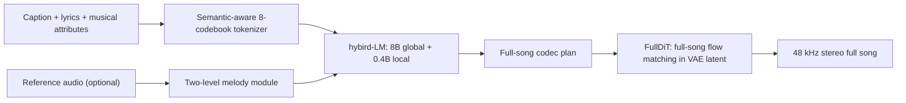
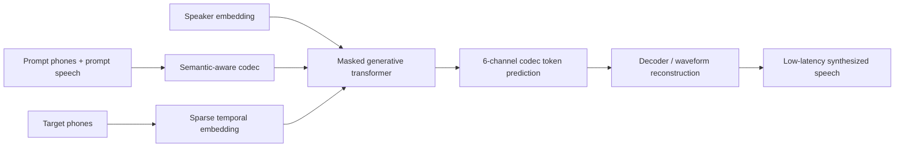

# 语音 / 音频 / 音乐论文速递
## 2026-07-23

> 实际对应 arXiv 更新日：**2026-07-23**  
> 检索范围：`cs.SD + eess.AS`  
> 只放按 ML 顶会审稿口径看，最值得多数读者花时间看的 **5 篇**

## 📋 总览

- 共收录 **5 篇** 相关论文
- 流式语音翻译 / 语音大模型：**1 篇**
- 音乐生成 / 音乐智能体：**2 篇**
- 语音生成 / 工业 TTS：**1 篇**
- 语音安全 / 深伪检测：**1 篇**

今天这批真正有价值的，不是“谁又把模型做大了”，而是三条更实在的路线。第一条是**把长链路任务拆成更合理的规划层和渲染层**：`SimulS2ST-Omni` 用 Thinker-Talker 拆开语言规划和声码输出，`Pushing the Frontier of Full-Song Generation` 则把 full-song 规划、旋律约束和声学渲染拆成 tokenizer、`hybird-LM`、`FullDiT` 三段。第二条是**为工业约束重写生成接口**：`StellarTTS` 不再死守 length regulator，而是用 sparse temporal embedding 在低延迟下补回鲁棒性和韵律。第三条是**把“评测/数据”做成真正能推动系统进步的资产**：`RIME` 把音乐后期制作 agent 变成可量化 benchmark，`Layer-Wise Decision Fusion` 则把 fake audio detection 里最常被糊弄的 cross-domain 泛化问题直接掀开。

如果你做语音大模型或生成系统，今天最值得先看的是 `SimulS2ST-Omni` 和阿里这篇 full-song 论文；一个回答“少量 paired S2ST 数据怎么把长流式翻译做起来”，一个回答“full-song 生成为什么不能只靠一个大解码器硬推”。`StellarTTS` 紧随其后，偏工程落地，但数值和设计都不是水稿。

## 精选入选规则

- **新意（0-3）**：是不是提出了新的表示、训练接口、规划方式，或者把旧问题拆得更对
- **影响力（0-3）**：是不是贴近语音大模型、TTS、S2ST、音乐生成、音频安全这些主线
- **证据强度（0-2）**：有没有像样的 baseline、消融和关键数值
- **受众匹配度（0-2）**：对语音大模型 / 语音前端 / 音乐方向 / 生成系统研究者有没有直接启发

分数校准：

- **6**：能看，但更像局部补丁
- **7**：信息量够，值得过一遍
- **8+**：建议优先精读

## 总览表

| 方向 | 序号 | 论文 | 评分 | 关键词 |
|---|---:|---|---:|---|
| 流式语音翻译 / 语音大模型 | 1 | SimulS2ST-Omni | 8.5/10 | streaming S2ST, Thinker-Talker, joint trajectory, low paired-data |
| 音乐生成 / 全曲生成 | 2 | Hierarchical Autoregressive Planning Meets Flow-Matching Rendering | 8.5/10 | 8-codebook RVQ, hybird-LM, FullDiT, DPO/GRPO/OPD |
| 语音生成 / 工业 TTS | 3 | StellarTTS | 8/10 | sparse temporal embedding, semantic-aware codec, 83M, low latency |
| 音乐智能体 / 音频编辑 | 4 | RIME | 7.5/10 | agentic post-production, POEMS toolkit, edit graph, SFT benchmark |
| 语音安全 / 深伪检测 | 5 | Layer-Wise Decision Fusion for Fake Audio Detection Using XLS-R | 7.5/10 | XLS-R, layer-wise classifier, one-class softmax, cross-dataset EER |

## 🗣️ 流式语音翻译 / 语音大模型

### [1] SimulS2ST-Omni: Data-Efficient Streaming Speech-to-Speech Translation via Explicit Trajectory Supervision

- **评分**：8.5/10
- **作者/机构**：Rongshen He, Xinyu Liang, Dekun Chen, Jiaqi Li, Mingjie Chen, Zhizheng Wu；The Chinese University of Hong Kong, Shenzhen
- **论文链接**：https://arxiv.org/abs/2607.19810
- **PDF**：https://arxiv.org/pdf/2607.19810.pdf
- **代码链接**：暂无
- **Demo 链接**：https://hasaki321.github.io/SimulS2ST-Omni.demo/

#### 📌 简介
这篇要解决的是最麻烦的那类任务：**长时长、低时延、目标端直接出语音** 的流式 S2ST，而且只给你大约 `2k` 小时 paired cross-lingual S2ST 数据。作者没有继续堆“更大的 paired 数据”这条烂熟路线，而是把问题重写成 joint text-code trajectory supervision，再用 `Thinker-Talker` 两路结构把语言规划和稠密声学码预测拆开。

#### ☠️ 毒舌点评
这篇是真的在打硬仗，不是“拿 4 万小时合成 paired audio 再说我也能做流式”。它最值钱的点不是某个 fancy loss，而是把**极少 paired S2ST 数据如何组织成能训练出长流式系统的监督接口**讲清楚了。短板也有：目前只做中英，语音后端还是固定的 chunk-wise Flow Matching，不是彻底端到端流式。

#### 🔧 技术方案
- **模型解决的问题**：已有 streaming S2ST 要么依赖 sentence-bounded supervision，要么吃海量 paired S2ST 音频，实用门槛极高。本文核心要补的是：在 paired S2ST 很少时，如何让模型学会 read/wait/write 策略，同时直接输出目标语音语义码而不是先转文本再拼语音。
- **模型架构**：
  - **输入**：源语音流 `X`。
  - **输出**：目标文本 `Y_text` 与目标语音 semantic code `Y_code`，再经固定语音生成后端 `D` 还原目标语音。
  - **主干**：`Thinker-Talker` 两流 Speech Language Model；对比基线是同规模 `Dec-only` 统一解码器。
  - **关键模块**：
    - `joint text-code commitment path`：把目标文本和目标语音 code 放进统一 trajectory 里一起监督。
    - `trajectory construction`：先做 force alignment 和 `SimAlign` 跨语对齐，再把边界离散成 read/wait/write chunk。
    - `Thinker`：负责语言推理和目标文本规划。
    - `Talker`：负责 dense target-code prediction，避免统一解码器在文本和声学之间打架。
- **信号流**：

- **关键设计 / 核心创新**：真正的新意在于把 trajectory supervision 从 text-only simultanous translation 扩展到 speech output，让文本 token 和 acoustic code 沿同一承诺路径发射，直接省掉单独 speech-side emission controller。这比靠 RL 或 wait-k policy 硬控稳定得多。
- **训练 / 推理策略**：
  - 训练数据不是纯 paired S2ST，而是 `TTS 4,531.3M tokens / 89,595.8h`、`MT 4,011.7M`、`ASR 293.1M / 2,811.9h`、`S2TT 2,597.2M / 24,359.1h`、`S2ST 307.4M / 2,104.8h` 组成的 auxiliary mixture，总音频时长 `118,871.6h`。
  - paired-S2ST 本体只有约 `2,104.8h`，作者靠 trajectory 过滤和多任务锚定把数据利用率拉上去。
  - 训练时对 latency multiplier `m ∈ {1,...,12}` 采样，让一个 checkpoint 覆盖多种延迟档位。
  - 推理时 streaming 版本用 rolling-window KV cache 和 chunked flow-matching speech backend；主结果使用 `num_beams=4`，同时给了 greedy 对照。
  - 推理性能绝对 RTF 文中没直接给统一数字，但所有结果都按 latency tier 和 `LAAL / StreamLAAL` 汇报，重点是质量-时延前沿而不是单一吞吐。

#### 📊 实验结果
- **离线 S2ST（CVSS-T）**：
  - `Ours (Thinker-Talker)` 的 `ASR-BLEU` 达到 `31.12 / 25.18`（En→Zh / Zh→En），优于同规模 `Ours (Dec-only)` 的 `27.12 / 23.41`。
  - `Text-BLEU` 也更高：`33.73 / 26.41`，对比 `Dec-only` 的 `31.59 / 24.90`。
  - 和强开源 `UniSS(Q)` 比，En→Zh 的 `ASR-BLEU 31.12` 还略低于 `32.04`，但 Zh→En `25.18` 已高于 `24.72`。
- **RealSI 长流式 S2ST**：
  - 文档级 En→Zh 在更高延迟档位超越 `LiveInterpret 2.0`：`m4=29.69`、`m5=30.04`、`m6=29.73`，对比 LiveInterpret 的 `29.33`。
  - 文档级 Zh→En 也很接近：`m5=26.53`，而 LiveInterpret 为 `26.80`。
  - 论文明确说从 `m4` 起，Talker 在 Zh→En 也缩小到“高度竞争”的差距。
- **数据效率消融**：
  - paired-S2ST 只保留 `10%`，En→Zh 仍有 `15.50 / 20.00 / 21.49 / 23.47`（m1-m4）。
  - 去掉 auxiliary mixture 后，En→Zh `m1` 直接掉到 `9.47`，说明真正关键不是“paired 数据够不够”，而是多任务锚定有没有把模型站稳。
- **基线对比**：
  - 两流 Talker 全程压住 matched `Dec-only`。
  - 长流式 S2TT 在 ACL60/60-dev 上也显著强于 CMU25、NAIST-25、IWSLT VAD 等公开系统。

#### 💡 为什么值得看
如果你正在做流式语音大模型，这篇很值得精读，因为它给出的不是一句“我们用更强模型所以更好”，而是一套**少量 paired S2ST 数据如何被 trajectory 组织成有效监督**的 recipe。更重要的是，`Thinker-Talker` 这个拆法在语音大模型里很可能不是一次性技巧，而是后面很多 speech reasoning + speech generation 系统的稳定骨架。

#### 评分：8.5/10
理由：问题真、证据硬、paired-data 节省得也有说服力。扣分点主要在语言对还窄，而且语音后端还没有彻底 streaming-native。

## 🎼 音乐生成 / 音乐智能体

### [2] Pushing the Frontier of Full-Song Generation: Hierarchical Autoregressive Planning Meets Flow-Matching Rendering

- **评分**：8.5/10
- **作者/机构**：Junyu Dai, Xinyue Fan, Weiqin Li, Xiangang Li 等；Alibaba Token Foundry
- **论文链接**：https://arxiv.org/abs/2607.20253
- **PDF**：https://arxiv.org/pdf/2607.20253.pdf
- **代码链接**：暂无
- **Demo 链接**：https://hifi-song-generation.github.io/

#### 📌 简介
这篇是典型的大厂重武器：目标不是做一个短片段 music demo，而是**从歌词、文字描述、音乐属性，甚至参考歌，直接生成 full-length song**。真正有意思的点在于它没有把所有事情塞进一个统一大模型，而是用 `semantic-aware tokenizer -> hybird-LM -> FullDiT -> melody module` 分层解决规划、离散表示、旋律保真和高保真渲染。

#### ☠️ 毒舌点评
这是那种你明知道很“工业系统工程”，但还是得读的论文。优点是每一层为什么存在都讲得通，`8-codebook RVQ + 8B global / 0.4B local + 8B FullDiT` 的分工也不瞎。缺点同样明显：它声称同时支持歌词歌、纯伴奏和 cover，但**专门的 instrument / cover 定量评测还没补齐**，而且没开源，复现门槛非常高。

#### 🔧 技术方案
- **模型解决的问题**：full-song generation 同时卡在三个地方：长时程结构难规划、多乐器/人声细节很难靠单码本 token 扛住、以及 chunk-wise diffusion 常常把全曲一致性弄碎。本文要补的是“完整歌曲的规划层、旋律约束层和高保真渲染层如何协同”。
- **模型架构**：
  - **输入**：文本描述、歌词、音乐属性，cover 任务还可加 reference audio。
  - **输出**：完整歌曲的 `8-codebook` codec token 序列，以及最终 `48 kHz stereo waveform`。
  - **主干**：
    - `semantic-aware tokenizer`：24 层 Conformer + 8-codebook RVQ。
    - `hybird-LM`：`8B` global LLM + `0.4B` local LLM 的分层自回归 token 规划器。
    - `FullDiT`：`8B` 条件 DiT，在连续 VAE latent 空间做 full-song flow matching 渲染。
    - `two-level melody module`：cover 场景下注入 coarse / fine melody token。
  - **关键模块**：
    - tokenizer 每个 codebook 大小 `8192`，frame rate `25 Hz`。
    - global LLM 初始化自 `Qwen3-8B`，只负责每帧首码本 `c0` 和长程结构。
    - local LLM 只补 `c1-c7` 残差码本，避免 global LLM 被细节 token 淹死。
    - post-training 里同时用了 `DPO`、`GRPO`、`OPD` 对 `hybird-LM` 做偏好对齐，并对 `FullDiT` 做 flow-based `GRPO`。
- **信号流**：

- **关键设计 / 核心创新**：
  - 不再把多码本 token 平铺成超长一维序列，而是让 global / local 两个语言模型沿不同轴建模。
  - `FullDiT` 用 full-song non-causal self-attention 做整曲渲染，而不是局部 chunk 合成后再拼。
  - cover 不是只抽粗 melody contour，而是两级 melody 表示同时保留 note-level 与 fine-grained pitch variation。
  - 偏好对齐不是只给 `hybird-LM` 做 DPO，而是一路推到 `FullDiT`，试图把“可听性”直接写进渲染器。
- **训练 / 推理策略**：
  - tokenizer 用三阶段训练：`BEST-RQ-style pretraining -> multi-task finetuning -> RVQ token training`。
  - `hybird-LM` 用 `large-scale pre-training -> style-balanced mid-training -> high-quality supervised fine-tuning`；论文写到 `Stage 3` 的高质量 SFT 数据约 `600,000` 首歌。
  - `FullDiT` 的高保真渲染数据从 `43.8 million-song` 预训练池中再筛一遍，只保留带宽、立体声宽度和质量更稳的样本。
  - 推理时先由 `hybird-LM` 产 codec token，再由 `FullDiT` 从噪声条件生成 full-song acoustic latent，最后解码为 waveform。
  - 文中没有给出统一 RTF 或端到端延迟数字，重点报告的是自动评测和外部榜单。

#### 📊 实验结果
- **外部 leaderboard**：
  - 在 `Artificial Analysis Music with Vocals leaderboard` 上，匿名提交 `Lucky Dolphin` 的 `Elo = 1129`，官方 rank range 为 `2-3`。
  - 与第二名 `Mureka V8` 的 point-estimate 只差 `12 Elo`，而且置信区间有重叠，说明已经挤进第一梯队。
- **500 样本自动评测**：
  - `SongBench` 中，本文系统拿到 `Melody 7.2001`、`Arrangement 7.3879`、`Musicality 6.3678`、`Instrumental 7.3517`、`Mixing 7.3047`，大多高于 `Suno V5.5`、`Suno V5`、`Mureka V8`、`Lyria 3 Pro`、`MiniMax Music 2.6`。
  - `SongEval` 五项全第一：`Coherence 4.5094`、`Musicality 4.4098`、`Memorability 4.4663`、`Clarity 4.3838`、`Naturalness 4.2600`。
  - `AudioBox-Aesthetic` 里 `Content Enjoyment 7.7089`、`Production Quality 8.2986` 也领先。
  - `CMI-Reward Quality 2.7611` 为第一，但 `Alignment 2.1786` 低于 `Mureka V8` 的 `2.3089`，说明条件跟随还不是最强。
- **受控 `FullDiT` 消融**：
  - 完整版 `M1` 的 `LM-generated codec` `Audiobox PQ = 8.213`。
  - 去掉 full-song context 的 `M3a` 直接掉到 `6.011`，证明全曲上下文不是装饰项。
  - 去掉 `EDMC` 的 `M2` 在 clean codec 上某些重建指标略好，但 synthetic-corrupted codec 下 `ViSQOL 3.2036 -> 2.4342`、`log-mel L1 1.1842 -> 2.2372`，说明 robustness 明显更差。
- **基线与限制**：
  - Vocal 分数 `7.6234` 与 `Mureka V8` 的 `7.6248` 几乎打平。
  - Structure 只有 `6.9650`，低于 `Mureka V8` 的 `7.0237` 和 `Lyria 3 Pro` 的 `7.0565`，这也是 paper 自己承认还要补的点。

#### 💡 为什么值得看
这篇最值得看的是它把 full-song generation 从“一个大模型统治一切”的粗暴叙事，改成了**规划、旋律控制、声学渲染三层协同**。哪怕你不打算复现整套 8B 系统，也值得抄它的分层思路。真正的保留意见是：没有把 instrumental 和 cover 单独做硬评测，这让“统一系统”这个 claim 还差最后一锤。

#### 评分：8.5/10
理由：系统设计成熟，消融不敷衍，榜单和自动评测都站得住。扣分点是不开源、任务覆盖虽广但并非每条线都用硬数据打穿。

### [4] RIME: Enabling Large-Scale Agentic Post-Production

- **评分**：7.5/10
- **作者/机构**：Noah Schaffer, Nikhil Singh；Dartmouth College
- **论文链接**：https://arxiv.org/abs/2607.19605
- **PDF**：https://arxiv.org/pdf/2607.19605.pdf
- **代码链接**：暂无
- **Demo 链接**：暂无

#### 📌 简介
`RIME` 做的不是传统 music generation，而是更接近真实工作流的 **agentic post-production**。作者把“给鼓做并行压缩”“给 vocal 加带滤波的同步 delay”“去齿音/去工频噪声”这类真实后期操作，编码成 recipes、motifs、constraints 和多层抽象 prompt，再通过 `POEMS` 工具链批量合成 `(input audio, output audio, instruction)` 三元组。

#### ☠️ 毒舌点评
这篇的价值不在模型，而在**终于有人不把音乐 agent 任务偷换成‘文字改音色’这种玩具题**。坏消息是，zero-shot agent 在这个 benchmark 上还是很菜，连 GPT-4o mini 也经不起抽象层级提升；好消息是，至少这回你知道它到底菜在“选错工具”还是“参数不会调”。

#### 🔧 技术方案
- **模型解决的问题**：现有音频编辑数据集更多是加/删/替换/inpainting 这种高层编辑，离真实录音棚里的可执行 post-production 还差很远。本文要解决的是“如何把真实 studio 语言、工具链和 edit graph 变成可大规模生成、可 benchmark、可用于 agent 微调的数据”。
- **模型架构**：
  - **输入**：multitrack mix 或普通混音音频，以及不同抽象层级的编辑指令。
  - **输出**：编辑后的目标音频，以及对应的 edit graph / tool-calling supervision。
  - **主干**：`RIME` 数据生成框架 + `POEMS` 后期制作工具箱 + 下游 multimodal agent。
  - **关键模块**：
    - `recipes / motifs / constraints / parameter priors`：把工程师经验写成可采样规则。
    - `edit graph generation`：统一为 `SEPARATE -> PROCESS -> MIX` 图结构。
    - `POEMS toolkit`：覆盖 pitch、ornamentation、EQ、mixing、separation 等 **20+** 个 operator，并通过 MCP 暴露给 agent。
    - `prompt generation`：同一条 edit graph 生成 `AL0 / AL1 / AL2` 三个抽象层级描述。
- **信号流**：

- **关键设计 / 核心创新**：
  - 不是从现成 edit pair 挖数据，而是用 rule-based studio prior 合成可控 triplet。
  - prompt 抽象层级做得很细，能单独测“模型会不会从 vague studio language 还原参数和工具链”。
  - 评价指标不只看音频相似度，还看 graph 恢复和参数级偏差。
- **训练 / 推理策略**：
  - 训练 / 评测 triplet 来自 `MTG-Jamendo`。论文用两个互不重叠的 `10,000-track` 随机子集起步，经 `Music Flamingo` 打标后，最终保留 `549` 条源轨做训练（约 `37h`）和 `297` 条源轨做评测（约 `20h`）。
  - 合成出约 `3,000` 个训练 triplet 和 `300` 个 artifact-removal triplet benchmark。
  - zero-shot 部分评估 `Gemini 3 Flash`、`GPT-4o Mini`、`Gemma 3n` 的 multi-step tool-calling agent。
  - SFT 部分只微调 `Gemma 3n` 的 reasoning step，用 `LoRA rank=16`、`alpha=16`、`lr=2e-4`，在 `3,000` triplet 上训 `1 epoch`。
  - 推理性能没有统一 latency 数字，主要报告“是否完成编辑”和音频 / graph 指标。

#### 📊 实验结果
- **zero-shot agent 主表**：
  - `GPT-4o Mini` 整体最好：`FAD 0.046`、`FADinf 0.027`、`KAD 0.086`、`Δsima 0.611`、`Graph F1 0.845`。
  - `Gemini 3 Flash` 为 `FAD 0.120`、`Δsima 0.512`、`Graph F1 0.702`。
  - `Gemma 3n` 更差：`FAD 0.227`、`Δsima 0.480`，但 `Graph F1 0.803` 反而高于 Gemini，说明它**会连工具链，但音频调得烂**。
- **对比基线**：本文真正对打的基线不是传统生成模型，而是 `GPT-4o Mini`、`Gemini 3 Flash`、`Gemma 3n` 三个 zero-shot tool-calling agent，以及其后的 `Gemma 3n SFT` 微调版本。
- **任务难度分析**：
  - 对 `GPT-4o Mini`，`AL0 -> AL2` 的 `Δsima` 从 `0.733` 掉到 `0.449`。
  - `Gemma 3n` 从 `0.673` 掉到 `0.325`，抽象 prompt 一上来就明显崩。
  - 作者直接指出：模型在高抽象提示下更多是**参数推理失败**，而不只是 operator 选错。
- **SFT 改进**：
  - `Gemma 3n SFT` 整体 `FAD` 拉到 `0.043`，比原始 `Gemma 3n` 的 `0.227` 好很多。
  - 尤其在 `AL1 / AL2`，SFT 版退化速度更慢，说明合成数据至少对“抽象后期语言 -> 工具链”这条链条是有效的。
- **限制**：
  - 三个 zero-shot agent 里没有一个能“稳定贴近 ground truth target”。
  - 2,922 个有效编辑里，`GPT-4o Mini` 虽然能成功产出 `2,730` 个结果，但很多偏差来自 effect parameterization，而不是完全不会用工具。

#### 💡 为什么值得看
如果你做音乐 agent、tool use 或音频编辑，这篇比一堆“对着描述生成整段音频”的 paper 更接近真实工作流。它最大的价值是把失败拆细了：你终于能知道模型是在**听懂了但手残**，还是**根本没把抽象录音棚语言映射到操作链**。这个 benchmark 和数据构造思路后面很可能会被更多音频 agent 论文复用。

#### 评分：7.5/10
理由：任务定义准，benchmark 有用，SFT 结果也不是零提升。扣分点是它更像“把赛道搭起来”的基础设施论文，而不是一个已经把 post-production agent 做成的强方法。

## 🗣️ 语音生成 / 工业 TTS

### [3] StellarTTS: Sparse Temporal Embedding for Low-Latency and Robust Speech Synthesis

- **评分**：8/10
- **作者/机构**：Kaicheng Luo, Xuefei Gong, Yutao Sun, Jinling He 等；Honor Device Co., Ltd.，Shanghai Jiao Tong University
- **论文链接**：https://arxiv.org/abs/2607.19859
- **PDF**：https://arxiv.org/pdf/2607.19859.pdf
- **代码链接**：暂无
- **Demo 链接**：https://stellartts.github.io/

#### 📌 简介
`StellarTTS` 针对的是工业 TTS 最烦的老矛盾：`AR` 系统稳定但慢，`NAR` 系统快但一到复杂文本就吞字、重读、韵律僵。它的核心动作是把传统 frame-wise length regulator 换成 **sparse temporal embedding**，再配上 semantic-aware codec，把两阶段语义 token + 声学 token 预测压成单阶段 masked generative TTS。

#### ☠️ 毒舌点评
这篇不是范式革命，但很像靠谱工程团队写出来的论文：知道真实痛点是 `WER` 和 `RTF`，不是只盯一两个主观分。它最值钱的是在 `Seed-TTS test-hard` 这种复杂文本上把稳健性打出来了；代价是 speaker similarity 没卷到最顶，而且语义蒸馏带来的 codec trade-off 作者自己也承认了。

#### 🔧 技术方案
- **模型解决的问题**：经典 `NAR TTS` 依赖 duration predictor + length regulator，速度快但韵律容易僵；纯 masked generative 又常常 WER 太高。本文要补的是“能不能在不回到 AR 的情况下，把鲁棒性、时延和 prosody 一起拉回来”。
- **模型架构**：
  - **输入**：target phones、prompt phones、prompt speech、speaker embedding。
  - **输出**：语音 codec token，最后解码成波形。
  - **主干**：`semantic-aware codec + sparse temporal embedding + 83M LLaMA-based masked generative transformer`。
  - **关键模块**：
    - `semantic-aware codec`：`1` 个 semantic channel + `5` 个 acoustic channel，0-th channel 用 `Wav2vec-Bert` 语义蒸馏约束。
    - `sparse temporal embedding`：每个 phone 只在中心位置放真实 phone embedding，其余位置用 padding embedding，让模型自己学过渡韵律。
    - `duration predictor`：推理时预测 phone 时长和中心 token 位置。
    - `speaker embedding`：显式注入说话人条件。
- **信号流**：

- **关键设计 / 核心创新**：
  - 不再做 rigid frame-wise alignment，而是只保留 phone 中心锚点，让 prosody 过渡由模型自己补。
  - codec 把语义和声学联合建模，省掉很多两阶段 pipeline 的级联误差。
  - 模型只有 `83M`，明显是冲着移动端和资源受限设备去的，不是假装 mobile。
- **训练 / 推理策略**：
  - 训练数据用 `Emilia` 多语种 in-the-wild speech。
  - 训练在 `8 x A100 40GB` 上进行，`AdamW` 峰值学习率 `5e-4`，warmup `10k steps`，权重衰减 `0.01`。
  - 损失由 token 交叉熵和 duration `MSE` 组成：`L_total = L_CE + λ L_dur`。
  - 推理使用 RVQ inference steps `[8,4,1,1,1,1]`；step=1 的通道用 greedy，前两层用 top-10% logits + annealed temperature + Gumbel confidence 控制 remasking。
  - 单卡 `A100` 上 `RTF = 0.08`，论文明确把“16 steps、能上移动端”当主卖点。

#### 📊 实验结果
- **客观指标（Seed-TTS）**：
  - `test-zh`：`WER 1.44`、`SIM-o 0.712`、`RTF 0.08`。
  - `test-hard`：`WER 7.47`、`SIM-o 0.697`。
  - 对比 `FireRedTTS`：`1.51 / 0.668` 和 `17.45 / 0.621`，StellarTTS 的鲁棒性明显更强。
  - 对比 `CosyVoice`：`3.63 / 0.723` 和 `11.75 / 0.709`，StellarTTS 的 WER 优势更大，但 SIM-o 略低。
  - 对比 `MaskGCT`：`2.27 / 0.774` 和 `10.27 / 0.748`，StellarTTS 用更低 WER 换掉一部分 similarity。
  - 对比 `F5-TTS`：`1.56 / 0.741` 和 `8.67 / 0.713`，StellarTTS 在 hard set 上更稳，而且速度 `0.08` 远快于 `F5-TTS` 的 `0.31`。
- **主观指标**：
  - `test-zh` 的 `CMOS = 0.06`、`SMOS = 3.96`。
  - `test-hard` 的 `CMOS = 0.05`、`SMOS = 3.78`。
  - 在 CMOS 上优于 `F5-TTS (0.02 / -0.01)`、`MaskGCT (-0.08 / -0.12)`，说明复杂文本场景下整体自然度和可用性更稳。
- **消融**：
  - 去掉 central strategy 后，`WER` 从 `1.44 / 7.47` 变成 `2.34 / 9.15`。
  - 去掉 sparse temporal embedding 后，`WER` 直接炸到 `4.10 / 18.12`。
  - 去掉 speaker embedding 后，`SIM-o` 从 `0.712 / 0.697` 降到 `0.654 / 0.626`。
- **限制**：
  - 论文自己承认 vocoder reconstruction 的 `SIM-o` 不如一些强基线，原因就在 semantic distillation 压缩了 pipeline。

#### 💡 为什么值得看
这篇最值得看的是它没有装作“一个更大的 TTS backbone 就能解决所有问题”，而是抓住了 NAR TTS 最实际的崩点：**对齐过死会伤韵律，不对齐又会伤 WER**。`sparse temporal embedding` 这个折中设计非常适合工业系统借鉴，尤其是你又要低延迟又不能接受 test-hard 大量口误的时候。

#### 评分：8/10
理由：问题准，结果扎实，速度优势很清楚。扣分点是 speaker similarity 不是最强，而且目前更像工业 recipe 的优化，而不是通用 TTS 范式重写。

## 🛡️ 语音安全 / 深伪检测

### [5] Layer-Wise Decision Fusion for Fake Audio Detection Using XLS-R

- **评分**：7.5/10
- **作者/机构**：Yixuan Xiao, Ngoc Thang Vu；Institute for Natural Language Processing, University of Stuttgart
- **论文链接**：https://arxiv.org/abs/2607.20023
- **PDF**：https://arxiv.org/pdf/2607.20023.pdf
- **代码链接**：**代码已开源** https://github.com/XIAOYixuan/tomatoDD/tree/interspeech25-layer-wise
- **Demo 链接**：暂无

#### 📌 简介
这篇 fake audio detection 的出发点很朴素：大模型每层信息不同，为什么大家还喜欢把多层特征先糊成一个向量再做判别？作者提出把 `XLS-R` 的每一层都挂一个 one-class softmax classifier，先逐层判，再做 **layer-wise decision fusion**，专门盯 cross-dataset 泛化。

#### ☠️ 毒舌点评
这不是 flashy paper，但挺实用。很多 deepfake detection 文章喜欢靠更大的 backbone 或更花的 loss 刷 in-domain，这篇反而把“为什么 feature fusion 会 feature collapse”说清楚了。缺点也明显：方法本身不复杂，主要贡献在分析和稳健性设计，不是那种一眼改写赛道的论文。

#### 🔧 技术方案
- **模型解决的问题**：现有 fake audio detector 在一个数据集上很高，在另一个数据集上直接塌，尤其是把多层特征先融合再判别时，容易让模型只依赖极少数层的偏置特征。本文要解决的是“如何利用深层 SSL 各层互补信息，提高跨数据集泛化”。
- **模型架构**：
  - **输入**：4 秒语音片段。
  - **输出**：真实 / 伪造得分。
  - **主干**：冻结的 `XLS-R-300M` 提特征，外接 layer-wise classifiers。
  - **关键模块**：
    - `FF`：feature fusion 基线，先融合层特征再分类。
    - `LW`：每层先单独 time-pooling 和 one-class softmax，再对各层得分融合。
    - `LW BN / LW BNR / LW BNW`：加入 bottleneck、reconstruction loss、weighted score fusion 的变体。
    - attentive time pooling + discrete token analysis：用于解释哪些层、哪些 token 真在帮泛化。
- **信号流**：

- **关键设计 / 核心创新**：
  - 不是把多层表示融合成单个 utterance embedding，而是把“决策”放到融合之后。
  - 用 one-class softmax 学真实音频中心，再把伪造样本推开，更适合 open-set 风格的 deepfake 泛化。
  - 论文额外把“silence 会不会伤 OOD”这个很少有人认真测的问题单独拉出来。
- **训练 / 推理策略**：
  - 训练集是 `ASVspoof19 LA train`，评测集同时看 `ASVspoof19 LA eval` 和 `In-the-Wild (ITW)`。
  - 数据预处理：随机采样 `4s` 片段；训练时以 `1/3` 概率加房间脉冲响应，以 `1/5` 概率加 `RawBoost` 噪声增强；推理时不增强。
  - 作者明确去掉前后静音，并另外比较“带静音训练”和“不带静音训练”。
  - 优化器 `Adam`，batch size `128`，最多 `100 epochs`，early stopping `patience=10`，类别加权 `fake:real = 1:9`。
  - 推理性能速度没有单独报，关注点是 EER 和跨域稳定性。

#### 📊 实验结果
- **主结果**：
  - 最强 cross-dataset 结果来自 `LW BN`：`ASV EER 5.27 ± 0.39`，`ITW EER 6.90 ± 0.30`。
  - `FF` 基线只有 `ITW 10.97 ± 1.30`，说明“先判后融”确实比“先融后判”稳。
  - `LW` 不加 bottleneck 时 `ITW 9.11 ± 1.14`，已经明显好于 `FF`。
- **和外部 baseline 对比**：
  - `NN-ASP (w/o silence)`：`ITW 9.49`
  - `NN-ACP (w/o silence)`：`ITW 10.27`
  - `XLS-R+logres 2B (w silence)`：`ITW 7.20`
  - 也就是说，本文用 `300M` 模型就把 ITW EER 干到 `6.90`，比若干更大或更复杂的系统还强。
- **静音分析**：
  - `LW BN (w silence)` 的 `ASV EER` 低到 `0.33 ± 0.02`，看着像神仙。
  - 但 `ITW EER` 直接炸到 `16.83 ± 0.90`，说明模型学会了 dataset-specific silence / channel artifact，跨域几乎报废。
- **层分析**：
  - `LW BNW` 权重更稳定地落在 `4-8` 层和 `18-21` 层，说明早中层与更深层都在提供判别信息。
  - 重要 token 集合相似度和 OOD 表现只有中等相关，作者给出相关系数约 `-0.45`，说明“找到重要 token”还不足以完全解释泛化。

#### 💡 为什么值得看
如果你做 fake audio detection，这篇不一定会让你惊呼“新范式”，但会逼你重新审视一件事：**你现在的多层融合是不是其实在制造 feature collapse**。它最有价值的地方是把 OOD 泛化、静音干扰、层选择一致性这三件常被混着说的问题拆开量化了，而且还有开源代码可以直接复验。

#### 评分：7.5/10
理由：方法简单但有效，分析比大多数 deepfake 检测论文更有信息量。扣分点是任务仍偏窄，创新更像结构与分析层面的改良，而不是方法学大突破。

## 最后结论

今天最值得优先看的排序是：

1. `SimulS2ST-Omni`
2. `Pushing the Frontier of Full-Song Generation`
3. `StellarTTS`
4. `RIME`
5. `Layer-Wise Decision Fusion for Fake Audio Detection Using XLS-R`

如果你做**语音大模型 / 流式翻译**，先读 `SimulS2ST-Omni`。它给的是一套 low-resource streaming S2ST 的可落地 recipe，而不是单点 trick。  
如果你做**音乐生成**，阿里这篇 full-song 论文必须看，因为它把 tokenizer、长程规划和高保真渲染拆开这件事讲明白了。  
如果你做**工业 TTS**，`StellarTTS` 很值得直接抄思路，尤其是 sparse temporal embedding 对 WER / latency / prosody 三角矛盾的处理。  
如果你做**music agent 或音频编辑工具**，`RIME` 的 benchmark 和数据构造会比很多 generative editing 论文更有现实意义。  
如果你做**深伪检测**，`Layer-Wise Decision Fusion` 的启发不在 backbone，而在别再迷信“把多层特征一锅炖”。
