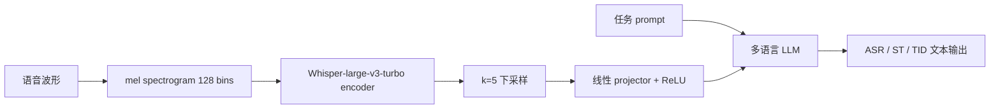
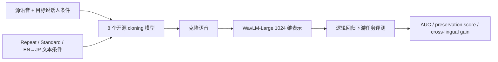
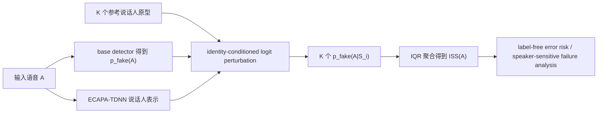
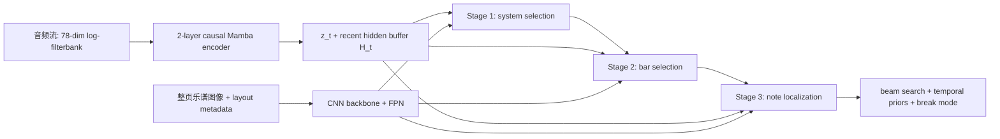

# 语音 / 音频 / 音乐论文速递
## 2026-07-27

> 实际对应 arXiv 更新日：**2026-07-27**  
> 检索范围：`cs.SD + eess.AS`  
> 只放按 ML 顶会审稿口径看，最值得多数读者花时间看的 **5 篇**

## 📋 总览

- 共收录 **5 篇** 相关论文
- 音频智能体 / 语音大模型：**2 篇**
- 语音克隆 / 诊断分析：**2 篇**
- 音乐理解 / 实时跟谱：**1 篇**

今天这批最值得看的，不是“又一个更大的生成模型”，而是三条更成熟也更实用的线。`SoundscapeAgent` 把音频 agent 从口号拉回工程，把场景规划、素材获取、渲染和标注统一成可复用的数据生产管线；`MEUSLI` 没玩花活，就是老老实实把 open-source multilingual SpeechLLM projector 做到 28 种欧洲语言，并且把低资源语言和多任务迁移的坑踩给你看；`Synthetic Speech, Real Signal` 和 `ISS` 则说明音频方向开始认真处理“模型为什么会骗你”这件事，一个追问 voice cloning 到底有没有保住副语言学信号，一个直接量化 deepfake detector 有没有把说话人身份当成捷径。`CODA` 则是今天最像正统强稿的方法论文，问题真、结构清楚、速度和跳转恢复数字都站得住。

## 精选入选规则

- **新意（0-3）**：是不是提出了新的表示、诊断接口、训练组织方式，或者把旧问题拆得更对
- **影响力（0-3）**：是不是贴近语音大模型、音频生成、语音安全、音乐理解这些主线
- **证据强度（0-2）**：有没有像样的 baseline、关键数值、消融或跨场景验证
- **受众匹配度（0-2）**：对语音大模型 / 语音前端 / 音频生成 / 音色克隆 / 音乐理解研究者有没有直接启发

分数校准：

- **6**：可读，但更像局部补丁或分析记录
- **7**：信息量够，值得过一遍
- **8+**：建议优先精读

## 总览表

| 方向 | 序号 | 论文 | 评分 | 关键词 |
|---|---:|---|---:|---|
| 音频智能体 / 数据生成 | 1 | SoundscapeAgent | 8/10 | agentic audio, scene planning, retrieval+generation, structured supervision |
| 语音大模型 / 多语言 ASR | 2 | MEUSLI | 8/10 | Whisper projector, 28 languages, low-resource adaptation, multitask transfer |
| 语音克隆 / 临床增强 | 3 | Synthetic Speech, Real Signal | 8/10 | paralinguistic preservation, clinical speech, cross-lingual augmentation |
| 语音安全 / deepfake 诊断 | 4 | ISS | 7.5/10 | identity sensitivity, label-free diagnostic, ASVspoof, detector shortcuts |
| 音乐理解 / 实时跟谱 | 5 | CODA | 8.5/10 | image-based score following, cascaded selection, jump recovery, real-time |

## 🤖 音频智能体 / 语音大模型

### [1] SoundscapeAgent: Agentic Soundscape Construction for Controllable Synthesis and Scalable Audio-Language Supervision

- **评分**：8/10
- **作者/机构**：Hao Zhang, Yiwen Zhao, Yixuan Zhang, Yiwen Shao, Steve Yves；Wuhan University，Tencent Hunyuan
- **论文链接**：https://arxiv.org/abs/2607.21857
- **PDF**：https://arxiv.org/pdf/2607.21857.pdf
- **代码链接**：暂无明确 GitHub
- **Demo 链接**：https://haozhang6720.github.io/SoundscapeAgentDemoPage/

#### 📌 简介
这篇做的不是“一个更大的 text-to-audio 模型”，而是把声音场景合成拆成一个可执行 agent pipeline。用户只给文本或图像条件，系统先显式规划事件、层次和时间线，再决定去检索现成素材还是调用生成模型补素材，最后做确定性渲染和描述导出。真正有价值的点，是它把这条链路同时用于可控生成和大规模 audio-language supervision 构造，而不是只做 demo。

#### ☠️ 毒舌点评
这篇优点是终于有人不再把“prompt 到波形”当成唯一答案，而是承认复杂音景本来就该先规划再合成。缺点也很明显：Track A 的 CLAP 指标并不漂亮，事件丰富场景的人评还略输给 TangoFlux，所以它不是“质量全面碾压”的生成模型论文。对做音频 agent、可控声音生成、合成数据扩增的人，这篇值得读；对只关心更强 TTA 模型的人，它不是那个方向。

#### 🔧 技术方案
- **模型解决的问题**：单次生成式 text-to-audio 模型通常把场景规划、声源选择、时间排布和混音都塞进一个黑箱，结果是中间决策不可见、可编辑性差，也很难批量产出结构化标注。`SoundscapeAgent` 解决的是“如何把复杂 soundscape 生成变成一条可检查、可修改、可复用来产监督数据的流程”。
- **模型架构**：
  - **输入**：用户条件 `u=(u_text, u_img)`，可选的时长、声道数等控制要求。
  - **输出**：最终混合波形 `y`、结构化场景规格 `E`、渲染元数据 `m`、与音频对齐的文本描述 `d`。
  - **主干**：`LLM-based soundscape agent + hybrid asset acquisition + deterministic renderer + metadata/description exporter`。
  - **关键模块**：
    - `Agent-guided scene planning`：把抽象意图落到具体事件，事件元组包含事件标签、角色、起始时间、时长、选中素材、相对响度和渲染控制。
    - `Role modeling`：把声源分成 `bg / mid / fg` 三层，分别对应持续背景、环境中层和显著前景事件。
    - `Hybrid acquisition`：对宽松背景做 fuzzy retrieval，对语义明确事件做 strict retrieval，检索不出来再调用 EzAudio、TangoFlux 这类 TTA 模型补资产。
    - `Asset filtering`：用 `CLAP` 相似度和 `production complexity` 过滤候选，当前阈值是 `sCLAP > 0.32`、`sPC < 4`。
    - `Offline prior mode`：先离线生成 scene prior，再高吞吐采样音频和描述，用来批量做 audio-language 数据。
- **信号流**：

- **关键设计 / 核心创新**：它不是再做一个单体生成器，而是把声音场景合成重写成显式的“规划-取材-渲染-导出”四段式流程。最关键的两点是：一，角色化场景结构让 controllability 真有抓手；二，离线 prior 模式把 agent 输出变成了可规模化的监督信号，而不是只留在交互 demo。
- **训练 / 推理策略**：
  - Track A 不是端到端训练一个新声学生成器，而是用 agent 组织现有素材库和 TTA backbones，做人评与目标对齐评测。
  - 素材库由 `Lopen ∪ Lpriv ∪ Lgen` 组成，开放部分优先来自强调单事件纯度的 `HIVE`，生成素材使用 `EzAudio`、`TangoFlux` 等模型，覆盖 `524` 个细粒度事件类。
  - Track B 用 offline prior 生成 `50k / 100k / 200k` synthetic examples，和 `573k` real-only 训练集叠加，对比 agent augmentation 是否真的提升 reasoning。
  - 下游模型固定为 `frozen Qwen2.5-Omni audio encoder + 2-layer MLP projector + frozen Qwen2.5-7B-Instruct`，只有约 `38.5M` 参数的 projector 可训练。
  - 训练最多 `300k` iterations，推理时用 `beam size = 4`、最多 `256` 生成 token。论文没有给统一的 RTF、吞吐或显存曲线，所以别把它当成已完成工业部署的低延迟方案。

#### 📊 实验结果
- Track A 的对比基线是 `TangoFlux`、`EzAudio`、`AudioLDM 2`。如果看整体人评对齐分，`SoundscapeAgent` 是 `3.63`，高于 `TangoFlux 3.41`、`EzAudio 2.98`、`AudioLDM 2 2.91`。
- 它最擅长的是复杂场景控制，而不是 CLAP 打分：
  - `Ambience-heavy` 人评对齐 `3.84`，明显高于 `TangoFlux 3.39`、`EzAudio 3.01`、`AudioLDM 2 3.13`
  - `Temporally specified` 人评对齐 `3.41`，高于 `2.31` 和 `2.34`
  - `Affective/abstract` 人评对齐 `3.88`，高于 `3.13 / 2.49 / 3.24`
  - 但 `Event-rich` 场景它只有 `3.46`，略低于 `TangoFlux 3.57`
- CLAP 指标说明它不是简单“所有指标都赢”：
  - Overall CLAP 只有 `0.34`，低于 `TangoFlux 0.39`
  - 论文明确指出 CLAP 很难覆盖时间顺序、层级结构、背景真实感和抽象提示的可解释落地，这个说法从表里的数字看是成立的
- Track B 才是这篇更值得看的部分。MMAU test-mini 上：
  - real-only baseline 整体准确率 `51.05%`
  - `+50k` agent augmentation 后到 `53.30%`
  - `+100k` 最好，达到 `56.50%`
  - `+200k` 反而回落到 `55.40%`
- 细分增益也挺实在：
  - `Sound` 任务最佳提升 `+7.63` 个点
  - `Music` 提升 `+5.09` 个点
  - `Speech` 也有 `+4.80` 个点
  - `Hard` 难度问题提升最大，达到 `+8.90` 个点
- 子任务分析里，增长最明显的是 `Event-Based Sound Reasoning +22.91`、`Eco-Acoustic Knowledge +13.46`、`Sound-Based Event Recognition +10.86`、`Temporal Event Reasoning +10.42`。这和它生成数据时重点强调事件组合、环境上下文和时间结构是对得上的。

#### 💡 为什么值得看
这篇最值得看的，不是它把声音生得多好，而是它把“复杂音景为什么不能只靠单次生成”讲清楚了。如果你在做 audio agent、可控 TTA、synthetic supervision 或 audio-language 数据工厂，这篇给的是一整套可落地的结构化思路，而不是又一个只会放 demo 音频的模型壳子。

#### 评分：8/10
理由：方法方向对，Track B 很有启发，但 Track A 并没有在所有生成指标上统治全场，所以我给高分但不吹满。

### [2] MEUSLI: a Multilingual Projector for LLM-based ASR and Beyond

- **评分**：8/10
- **作者/机构**：Lorenzo Concina, Seraphina Fong, Marco Matassoni, Alessio Brutti；Fondazione Bruno Kessler，University of Trento
- **论文链接**：https://arxiv.org/abs/2607.22100
- **PDF**：https://arxiv.org/pdf/2607.22100.pdf
- **代码链接**：暂无明确 GitHub；**模型集已发布** https://huggingface.co/collections/SpeechTek/meultilingual-speechllm-projectors
- **Demo 链接**：暂无

#### 📌 简介
`MEUSLI` 做的是一个非常务实的问题：如何把 `Whisper` 编码器和开源多语言 LLM 之间的 projector 做成真正可用的 multilingual SpeechLLM，而不是只在英文或几种大语种上跑通。论文主线很清晰，先做 28 种欧洲语言的开放式 ASR projector，再验证低资源语言微调、完全未见语言 bootstrapping，以及在极少标注下向 `speech translation + topic identification` 扩展。

#### ☠️ 毒舌点评
这篇几乎没有“结构创新”的花活，本质上就是线性 projector 加上冻结 encoder/LLM。但它的价值也恰恰在这里：很多多语 SpeechLLM 论文喜欢把工程问题包装成宏大叙事，这篇反而老老实实把开源、语言覆盖、continual fine-tune 和灾难性遗忘这些真问题摆上桌。缺点是低资源语言的绝对 WER 仍然很难看，说明“能跑通”不等于“已经解决”。

#### 🔧 技术方案
- **模型解决的问题**：现有 projector-based SpeechLLM 大多英语中心化，语言覆盖窄、低资源扩展弱，而且经常不开源训练细节。`MEUSLI` 解决的是“如何在完全开源前提下，把轻量 projector 路线扩到 28 种欧洲语言，并让它还能往新语言和新任务上继续长”。
- **模型架构**：
  - **输入**：128-bin mel spectrogram，经 `Whisper-large-v3-turbo` 编码后得到声学特征，再按 `k=5` 下采样以缓解 speech/text 长度不匹配。
  - **输出**：对应任务的 token 序列，ASR 输出转写文本，ST 输出英文翻译，TID 输出主题标签。
  - **主干**：`frozen Whisper encoder + lightweight linear projector + frozen multilingual LLM`。
  - **关键模块**：
    - `Projector`：单隐藏层 + `ReLU` + regression layer，共 `17.31M` 可训练参数。
    - `LLM backends`：`EuroLLM-1.7B-Instruct`、`EuroLLM-9B`、`Apertus-8B`
    - `LoRA`：最佳设置 `r=8`、`α=32`，新增 `1.38M` 可训练参数。
    - `Prompted decoding`：训练和推理时把 speech embeddings 与任务 prompt 拼接，例如 `Transcribe speech to text`。
- **信号流**：

- **关键设计 / 核心创新**：创新不在 block 设计，而在开放多语路线的组织方式。作者把 `28` 语语言覆盖、低资源单语精调、未见语言 bootstrapping、replay 防遗忘和多任务迁移串成了一条完整路线，说明这不是只会做静态 benchmark 的 projector。
- **训练 / 推理策略**：
  - 训练数据来自 `Common Voice 17.0`、`FLEURS`、`VoxPopuli`，覆盖 `28` 种欧洲语言，总计 `7622` 小时。
  - 为了控制语言分布偏斜，每个语言-数据集最多保留 `100K` 样本。
  - 训练用 `Adam`，初始学习率 `1e-4`，warmup `1000` steps，训练 `3` epochs，batch size `8`，loss 是 LLM 输出上的 cross-entropy。
  - 编码器和 LLM 都冻结，只训 projector 和 LoRA。单语低资源微调时用相同配置，通常 `10` epochs、batch size `4`。
  - 多任务扩展沿用 `SLAM-LLM` recipe，推理使用 `beam size = 4`。论文没有给统一推理速度和显存报告，所以这更像 research pipeline 而不是部署结论。

#### 📊 实验结果
- 对比基线：`Whisper-large-v3-turbo`、单语 projector scratch、未适配的多语 MEUSLI、以及从零训练的 multilingual multitask projector。
- 28 语主表里，高资源语言已经有明显收益：
  - `Spanish` 在 `CV` 上，`Whisper 7.60`，`EuroLLM-9B + MEUSLI 3.65`
  - `Italian` 在 `FL` 上，`Whisper 2.89`，`EuroLLM-9B + MEUSLI 2.70`
  - `Galician` 在 `CV` 上，`Whisper 25.07`，`EuroLLM-9B + MEUSLI 9.01`
- 极低资源语言仍然很难，但 MEUSLI 至少让系统开始有样子：
  - `Breton` 在 `Whisper` 上是 `154.33` WER，`Apertus-8B + MEUSLI` 降到 `73.40`
  - `Maltese` 从 `98.39` 降到 `48.68`
  - `Irish` 依旧很惨，`Whisper 216.52`，`EuroLLM-1.7B 82.23`，`Apertus-8B 88.55`，说明这条线还远没打穿
- 低资源精调实验更有说服力：
  - `Breton 2.5h`：从零训练单语 projector 是 `84.3%` WER，直接套多语 MEUSLI 还是 `95.7%`，但 fine-tune 后到 `79.7%`；若换成适配过的 Breton Whisper encoder，则单语是 `27.7%`，`MEUSLI→` 可到 `24.5%`
  - `Maltese 18h`：从零训练 `45.8%`，`MEUSLI→ 39.4%`
- 未见语言 bootstrapping 很能说明问题：
  - `Ukranian 30h`：单语 scratch `20.4%`，未适配多语模型 `107%`，fine-tune 后 `16.3%`
  - `Albanian 46min`：scratch `389%` 几乎没法用，未适配 `166%`，fine-tune 后 `75.6%`
- replay 防遗忘是这篇最该看的实验之一：
  - 朴素在 Ukrainian 上 fine-tune 后，`Spanish 4.09% -> 90.34%`，`Polish 8.68% -> 100.6%`
  - 加每语种 `1000` 样本 replay 后，`Spanish` 回到 `4.82%`，`Polish` 回到 `10.95%`，而 `Ukranian` 仍有 `17.56%`
- 多任务迁移也不是摆拍：
  - `Finnish`：从 scratch multilingual 的 `ASR 53.0% WER / ST 15.9 BLEU / TID 57.5 Acc`，提升到 `MEUSLI multilingual 18.6% / 26.6 / 81.7`
  - `Czech`：`43.1% -> 12.9% WER`，`22.2 -> 39.3 BLEU`，`60.8 -> 86.7 Acc`
  - `Galician`：`34.0% -> 11.1% WER`，`34.3 -> 47.5 BLEU`，`67.0 -> 86.1 Acc`

#### 💡 为什么值得看
如果你在做 multilingual ASR 或 speech-to-text LLM，这篇最有价值的地方不是线性 projector 这个老配方，而是作者把“开源多语、低资源、未见语言、灾难性遗忘、多任务迁移”这些真正会卡住项目落地的问题，用一套统一框架跑清楚了。它不性感，但很有工程价值。

#### 评分：8/10
理由：路线务实、数据和迁移实验够扎实，但核心结构创新不强，而且最差语种的绝对性能依然很弱，所以是强工程研究，不是范式级强稿。

## 🧪 语音克隆 / 诊断分析

### [3] Synthetic Speech, Real Signal: Paralinguistic Preservation and Cross-Lingual Augmentation via Voice Cloning

- **评分**：8/10
- **作者/机构**：Roseline Polle, Owen Parsons, George Fairs, Luis M San Martin Fernandez, Cole Looney, Xiaoliang Wu, Alexandra L Georgescu, Stefano Goria；thymia，The University of Edinburgh，University of Southampton
- **论文链接**：https://arxiv.org/abs/2607.22304
- **PDF**：https://arxiv.org/pdf/2607.22304.pdf
- **代码链接**：暂无
- **Demo 链接**：暂无

#### 📌 简介
这篇不是在卷“谁的 voice cloning 更像”，而是在追问一个更关键的问题：克隆出来的语音，到底有没有保住下游 paralinguistic 任务真正依赖的信号。作者系统评估了 `8` 个开源 voice cloning 模型，在情感、情绪、讽刺、口音、抑郁/焦虑检测五类任务上测试保真度，并进一步看 `EN→JP` 跨语种克隆能不能拿来做临床语音增强。

#### ☠️ 毒舌点评
这篇最大的优点，是终于不再拿 `WER / speaker similarity / MOS` 当万能真理。它问的问题比很多 TTS/VC 论文都更对，也更接近真实使用场景。缺点也很明确：它本质上是评测和分析工作，不是提出一个新 cloning backbone；而且跨语种实验只测了 `English -> Japanese`，临床数据还是 proprietary，外部复现会打折。

#### 🔧 技术方案
- **模型解决的问题**：现有 voice cloning 评价主要盯着可懂度和说话人相似度，但情感、临床状态、口音等副语言学任务依赖的是另外一套信号。作者要解决的是“克隆语音保留了多少 paralinguistic information，以及这种保留能否支撑跨语种数据增强”。
- **模型架构**：
  - **输入**：源语音、目标说话人条件，以及两种文本设置之一。
  - **输出**：克隆语音；后续再提取表示做下游分类或跨语种迁移。
  - **主干**：不是单一新模型，而是 `8` 个开源 cloning backbones 的统一评测流水线。
  - **关键模块**：
    - `Repeat condition`：强制克隆语音复现原始文本，尽量把语言内容干扰降到最低。
    - `Standard condition`：允许生成文本偏离，用来观察内容变化对 preservation 的影响。
    - `Cross-lingual EN→JP`：把英文临床语音翻成日文后克隆，测试跨语种增强。
    - `Downstream probe`：用 `WavLM Large` 的 `1024` 维 embedding，配合逻辑回归测 task AUC。
- **信号流**：

- **关键设计 / 核心创新**：这篇真正的创新不是架构，而是评测定义。作者把 preservation 变成了一个严格的下游可验证问题，并定义 `P=(Ac-0.5)/(Ar-0.5)` 来量化“克隆后保住了多少高于随机的判别信号”。它还顺带证明了 speaker similarity 和真正的下游 preservation 并不总是同一个东西。
- **训练 / 推理策略**：
  - 被评测的模型覆盖 `XTTS v2`、`Zonos`、`E2-TTS`、`F5-TTS`、`OpenAudio S1-mini`、`CosyVoice 2/3`、`MaskGCT`，涵盖自回归、flow-matching、LLM+RLHF、masked codec 等路线。
  - RQ1 用 `IEMOCAP`、`MELD`（emotion/sentiment）、`MUSTARD`、`VCTK` 以及专有英语临床语音数据。
  - 临床集里，英语语料包含段落朗读、mood 相关问题和周末自由问答；日语语料按相同 protocol 采集，作为 RQ2 目标域。
  - RQ2 把英语文本翻成日语，比较 `Real EN -> JP Real` 和 `EN→JP cloned` 几种设置。
  - 论文故意用逻辑回归而不是更强分类器，目的是把差异尽量归因到语音保真而不是下游模型容量。统一推理速度和显存未报告。

#### 📊 实验结果
- 先看 public benchmark 的 repeat condition，前几名都很接近，但确实有稳定排序：
  - `E2-TTS` public-task 平均 `AUC 0.768`
  - `OpenAudio 0.766`
  - `MaskGCT 0.763`
  - `CosyVoice 3 / F5-TTS 0.759`
  - `XTTS v2 0.736`
- 在 repeat 条件下，`VCTK` 口音分类最稳，median preservation `P = 0.95`；情绪和情感任务更容易掉，作者给出的中位数分别是 `emotion 0.87`、`sentiment 0.82`。
- clinical 结果并不虚：
  - 顶级模型在抑郁/焦虑检测上的 preservation 大约 `P = 0.93–0.94`
  - `mood` 任务保留最好，median `P = 0.95`
  - `paragraph / general` 稍差，median `P = 0.89`
- 标准条件一加进来，问题立刻暴露：
  - 总体 median preservation 从 `0.90` 掉到 `0.75`
  - `mood` speech 最大，从 `P = 0.95` 掉到 `0.66`，对应 `-10.4` 个点
  - `paragraph` 几乎不变，仍在 `0.89–0.90` 左右，这说明它更依赖内容无关的声学模式
- 跨语种增强是这篇最重要的应用结论。以 `10,000` 个英语训练说话人为例：
  - raw cross-lingual baseline `Real EN -> JP Real`：`Depression 0.593`，`Anxiety 0.578`
  - `CosyVoice 3 (EN→JP)`：`0.623 / 0.618`
  - `MaskGCT (EN→JP)`：`0.620 / 0.612`
  - `OpenAudio (EN→JP)`：`0.626 / 0.605`
  - `JP Real` 上限仍更高：`0.654 / 0.664`
- 这不是只靠翻译语义吃到的便宜：
  - 固定文本的 `Paragraph` 子集里，`CosyVoice 3` 仍把 depression/anxiety 从 `0.594 / 0.578` 提到 `0.617 / 0.623`
  - 作者据此认为，收益既来自文本迁移，也来自把声学空间适配到目标语言
- RQ3 结果也很实在：
  - speaker similarity 与临床 preservation 的 Pearson 相关在 clean data 上较强，`general r=0.87`、`mood r=0.81`、`paragraph r=0.77`
  - 但对 `MELD`、`MUSTARD` 这类更嘈杂数据集，相关性只有 `0.18 / 0.30`
  - 结论很明确：speaker similarity 是 useful proxy，但远不是可靠真理

#### 💡 为什么值得看
这篇最值钱的地方，是它替很多 VC/TTS 论文把一个经常被故意忽略的问题摆到了台面上：声音像不像、词对不对，不等于下游真正关心的副语言学信号也被保住了。如果你做 clinical speech、emotion、paralinguistic augmentation，或者只是想知道该不该把 voice cloning 用进数据构造，这篇几乎是必读。

#### 评分：8/10
理由：问题问得很准，实验矩阵也完整，虽然不是新模型 paper，但信息价值比很多新模型更高。

### [4] Probing Speaker Identity Sensitivity in Audio Deepfake Detectors

- **评分**：7.5/10
- **作者/机构**：Daniyal Kabir Dar, Arun Ross；Michigan State University
- **论文链接**：https://arxiv.org/abs/2607.21820
- **PDF**：https://arxiv.org/pdf/2607.21820.pdf
- **代码链接**：暂无
- **Demo 链接**：暂无

#### 📌 简介
这篇做的不是更低 EER 的 deepfake detector，而是一个更少见但更有用的东西：`Identity Sensitivity Score (ISS)`。它试图量化 detector 的输出有多少是被说话人身份牵着走的，而不是被真正的合成伪迹牵着走。论文核心主张是，很多 detector 在 benchmark 上高分，不代表它真的抓到了 synthesis artifact，也可能只是学会了说话人身份和真假标签之间的捷径相关性。

#### ☠️ 毒舌点评
这篇不是“安全大一统解决方案”，但它比又一篇小修小补降 EER 的论文诚实得多。作者没有吹“我们解决了 deepfake detection”，而是指出 detector 到底是怎么失败的。缺点也摆在那：只测了 `AASIST` 和 `RawNet2` 两个模型，`α` 调参还要一小块带标签开发集，所以它现在更像强诊断工具，不是端到端训练替代方案。

#### 🔧 技术方案
- **模型解决的问题**：标准 ASVspoof 训练集会把真实语音和合成语音绑定到不同说话人分布上，导致 detector 可能偷懒学到 speaker identity shortcut。单看 `EER / AUC` 只能看到“经常在哪错”，看不到“为什么在这错”。`ISS` 解决的是“如何在不需要部署时真值标签的前提下，量化每条预测对说话人身份有多敏感”。
- **模型架构**：
  - **输入**：音频样本 `A`、base detector 给出的 `p_fake(A)`，以及一组参考说话人的原型表示。
  - **输出**：每个样本的 `ISS(A)`，以及基于 ISS 的 label-free misclassification risk。
  - **主干**：`deepfake detector + ECAPA-TDNN speaker encoder + identity-conditioned logit perturbation + IQR aggregation`。
  - **关键模块**：
    - `Speaker prototypes`：从 enrollment speakers 构造 reference identity contexts。
    - `Identity-conditioned score`：在 logit 空间做 `σ(ℓ(A) + α·cos(A, S_i))` 的扰动。
    - `ISS`：对 `K` 个身份上下文下的得分取 `IQR`，得到对身份敏感度的 spread。
    - `FreeVC validation`：把同一条 bonafide 语音做说话人转换，验证高 ISS 样本是否真的更容易被身份变化拉动。
- **信号流**：

- **关键设计 / 核心创新**：它不是再造一个 detector，而是把“预测靠近边界”和“预测被说话人身份推着走”这两件事拆开。传统 entropy / margin / confidence 都只能回答“离边界有多近”，`ISS` 则回答“这份不稳定里有多少是 identity-driven 的”。
- **训练 / 推理策略**：
  - `ISS` 本身不需要重新训练 detector。论文直接在两个已有模型上做：`AASIST` 官方 checkpoint（`297,866` 参数）和在 `ASVspoof 2019 LA` 上训练 `100` 个 epoch 的 `RawNet2`。
  - 推理超参用 `K=10` 个 alternative speakers，`α=5.0`。`K` 的选择来自稳定性消融，`α` 通过 2019 LA dev set 最大化 correct/incorrect ISS ratio 选出。
  - enrollment prototype 使用 2019 LA 训练集全部 `20` 个说话人。
  - 论文强调 ISS 部署时是 label-free，但 `α` 调参与原型构建依然需要一小块带标签开发集，这是现实限制。
  - Voice conversion 验证使用 `FreeVC`，每个 detector 抽 `500` 条 bonafide 样本，其中 `250` 条高 ISS、`250` 条低 ISS。

#### 📊 实验结果
- 先看 detector 自己的泛化崩盘，这就是 ISS 要解决的动机：
  - `AASIST` 在 `ASVspoof 2019 LA` 上 `EER 0.83%`，到 `2021 LA` 直接变成 `17.39%`，是 `21×` 恶化
  - `RawNet2` 从 `4.11%` 变到 `12.41%`
- ISS 对“正确 vs 错误预测”的分离很强：
  - `2019 LA / AASIST`：`ISScor = 3.65e-3`，`ISSinc = 1.07e-1`，ratio `29×`，error-prediction `AUC = 0.954`
  - `2019 LA / RawNet2`：`1.17e-5` vs `6.12e-4`，ratio `52×`，`AUC = 0.918`
  - `2021 LA / AASIST`：ratio 直接放大到 `690×`，`AUC` 仍有 `0.843`
  - `2021 LA / RawNet2`：ratio `24×`，`AUC = 0.855`
- 和传统 uncertainty baseline 对比也挺干脆：
  - `ISS` 在 `RN2 2019 / RN2 2021 / AASIST 2019 / AASIST 2021` 上分别是 `0.918 / 0.855 / 0.954 / 0.843`
  - `Entropy / Margin / Confidence` 则是 `0.865 / 0.825 / 0.936 / 0.813`
  - 增益分别是 `+5.3 / +3.0 / +1.8 / +3.0` 个点
- Voice conversion 验证说明它不是碰巧相关：
  - `AASIST` 高 ISS 样本在 FreeVC 后的平均 `Δscore = 0.1069`，低 ISS 只有 `0.0056`，相差 `19.2×`
  - `RawNet2` 是 `0.0401` vs `0.0013`，相差 `30.7×`
  - 这说明 ISS 真抓到了 identity-sensitive 行为，而不只是“边界附近都不稳定”
- attack-type 分析尤其有意思：
  - `RawNet2` 对 `2019 LA hybrid` 攻击的 ISS ratio 只有 `0.2×`，`p=1.00`，说明这类错误更像低层声学伪迹问题，不是身份问题
  - 相反，`AASIST` 在 `2021 LA hybrid` 上 ratio 高达 `2334.3×`
  - 也就是说 ISS 不是“一概说错误都来自身份”，而是能把不同 failure mode 区分开
- 稳定性消融也不差：
  - `K ∈ {3,5,10,20}` 时，AASIST 的 ratio 在 `29×-32×` 间基本稳定
  - `α=10` 虽然 ratio 更大，但会把 bonafide/spoof 中位次序反转，所以作者最后用 `α=5`

#### 💡 为什么值得看
如果你做 audio deepfake detection、安全评测或部署风险分析，这篇值得看的不是“ISS 这个名字”，而是它把 shortcut learning 量化成了逐样本、可部署、可解释的诊断接口。它不会直接替你把 detector 练好，但它会告诉你：哪些错误是身份驱动的，哪些错误不是，下一步该往哪修。

#### 评分：7.5/10
理由：非常有洞察力的诊断 paper，实验也够硬，但它还不是 training-time 解决方案，模型覆盖面也偏窄，所以我给高于普通分析文但低于方法强稿。

## 🎼 音乐理解 / 实时跟谱

### [5] CODA: Cascaded Online Discontinuity-Aware Alignment for Real-Time Image-Based Score Following

- **评分**：8.5/10
- **作者/机构**：Yining Yang, Ruogu Chen, Jie Han；Western University，University of Alberta
- **论文链接**：https://arxiv.org/abs/2607.21899
- **PDF**：https://arxiv.org/pdf/2607.21899.pdf
- **代码链接**：**代码已开源** https://github.com/ValleyC/CODA
- **Demo 链接**：暂无

#### 📌 简介
`CODA` 做的是实时 image-based score following，而且不是那种只会平顺跟谱、遇到 repeat 或 D.C. 就挂掉的版本。论文把问题重新表述成“在固定乐谱页面上做 cascaded candidate selection”，先选 system，再选 bar，最后在 bar 内定位 note，同时加了基于 silence 的 break mode 去做跳转恢复。这个 formulation 很朴素，但比把整页乐谱当 YOLO 检测靶子乱打，要合理得多。

#### ☠️ 毒舌点评
这篇不像很多 MIR 论文那样拼装几个模块然后说是 hierarchy，它的 cascaded formulation 真正改了问题定义，而且 jump recovery 不是附送小补丁。实验也给得够清楚，尤其是真实时延和 jump benchmark。短板是数据还几乎全是 `MSMD` 的 solo piano，离真实复杂编制、扫描谱、舞台麦输入还有距离。

#### 🔧 技术方案
- **模型解决的问题**：现有 image-based score following 常见两大问题。第一，多尺度 system/bar/note 预测彼此独立，几何上不一致，搜索空间也过大。第二，遇到 repeats、D.C.、coda 这种 discontinuity 时几乎没有恢复机制。`CODA` 解决的就是“如何在严格实时约束下，同时把结构一致性和跳转恢复做进去”。
- **模型架构**：
  - **输入**：`20 fps` 的 `78` 维 log-filterbank 音频流，以及当前页乐谱图像和其 layout metadata（system / bar bounding boxes）。
  - **输出**：活动 system 索引 `s_t`、活动 bar 索引 `b_t`，以及 bar-local note position `u_t=(c_x,c_y)`。
  - **主干**：`2-layer causal Mamba audio encoder + CNN visual backbone + FPN + cascaded selection/regression + beam search with temporal priors`。
  - **关键模块**：
    - `Cascaded factorization`：按 `p(s_t|h_t) · p(b_t|s_t,h_t) · p(u_t|b_t,s_t,h_t)` 分解，保证 note 一定落在 bar 内、bar 一定落在 system 内。
    - `Audio conditioning`：Mamba 输出 `z_t` 通过 `FiLM` 调制视觉特征。
    - `ROIAlign + cross-attention`：对 system/bar 候选做 ROI 提取，再和最近 `L` 帧音频历史交互。
    - `Beam search + learned temporal priors`：在时间上平滑 system/bar 选择。
    - `Silence-driven break mode`：利用短时静音作为跳转恢复触发器，不需要先知道 repeat 结构。
- **信号流**：

- **关键设计 / 核心创新**：最关键的不是用了 Mamba 或 cross-attention，而是作者不再把这个任务当“每帧重新做目标检测”。因为乐谱页面是静态的，候选 system/bar 本来就已知，真正要做的是 selection over known candidates。这个改写一举把几何一致性、搜索空间和实时性都梳顺了。
- **训练 / 推理策略**：
  - 数据全部基于 `MSMD`，使用 Henkel & Widmer 的预处理版本：`354` 首训练、`19` 首验证、`94` 首测试，音频是 `22,050 Hz` 合成钢琴。
  - 训练分两阶段：
    - Phase 1：`30` epochs，学习率 `5e-4`，bar/note stage 总是走 ground-truth system routing
    - Phase 2：`20` epochs，学习率 `1e-4`，scheduled sampling 把 system 预测参与概率在前 `5` 个 epoch 线性拉到 `p_max=0.7`
  - 优化器 `AdamW`，batch size `16`，cosine decay，gradient clipping `1.0`
  - 数据增强包括 `jump augmentation`、空间平移、tempo scaling、cold-start truncation，以及随机 room impulse response 卷积
  - jump augmentation 的六类采样权重是：`repeat 40%`、`bar correction 15%`、`skip 15%`、`restart 10%`、`page jump 10%`、`random 10%`
  - 模型只有 `2.0M` 可训练参数，在 `RTX A6000` 上推理 `12.8 ms/frame`，即 `78.1 fps`，明显快过 20fps 的实时要求

#### 📊 实验结果
- 对比基线：`MM-Loc`、`RL`、`CUNet`、`CYOLO`、`CYOLO-SB`、`CYOLO-SB+A`。
- 标准跟谱 Setting I（synthetic image + synthetic audio）里，`CODA` 在核心阈值上全面压过 `CYOLO-SB`：
  - `≤0.10 s`：`0.914` vs `0.837`
  - `Bar accuracy`：`0.975` vs `0.890`
  - `System accuracy`：`0.991` vs `0.963`
- Setting II（synthetic image + real piano audio）里，提升仍然稳：
  - `≤0.10 s`：`0.743` vs `0.630`
  - `Bar accuracy`：`0.891` vs `0.829`
  - `System accuracy`：`0.953` vs `0.917`
- jump recovery 才是真正拉开差距的地方：
  - repeat subset 上，`CODA(full)` 的 `Rec@1s=0.78`、`Rec@2s=0.91`、恢复延迟 `0.72s`、post-jump `≤1s=0.82`
  - 同一设置下 `CYOLO-SB` 只有 `0.12 / 0.20 / 4.31s / 0.35`
  - random jumps 更难，但 `CODA(full)` 仍有 `0.64 / 0.80 / 1.24s / 0.71`
  - `CODA w/o break` 明显掉到 `0.29 / 0.44 / 2.63s / 0.54`，说明 break mode 不是装饰件
- 消融也很干净：
  - 去掉 cascade 后，`≤0.10 s` 从 `0.914` 掉到 `0.869`，bar accuracy 从 `0.975` 掉到 `0.931`
  - 去掉 cross-attention 后是 `0.895`
  - 去掉 beam search 后是 `0.888`
  - 去掉 temporal priors 后是 `0.900`
  - scheduled sampling 影响最小，但各阈值都还是稳步下降

#### 💡 为什么值得看
这篇值得花时间，是因为它不是靠大模型词汇包装，而是靠一个更对的问题定义把实时跟谱真正做顺了。你如果做乐谱跟踪、音乐交互系统、audio-score alignment，或者只是想看一篇“问题重写带来实打实收益”的方法论文，`CODA` 是今天最稳的一篇。

#### 评分：8.5/10
理由：问题定义、系统设计、速度和 jump 实验都很硬，唯一明显扣分项是数据域仍偏窄，离更真实的复杂场景还有一步。

## 最后结论

如果今天只能读三篇，我会这样排：

1. `CODA`：最像完整强稿，问题真、方案清、实时性和 jump recovery 数字都硬。
2. `MEUSLI`：做 multilingual SpeechLLM/ASR 的人很难绕开，尤其低资源、bootstrapping 和 replay 那几组实验值得直接拿去参考。
3. `SoundscapeAgent`：如果你在做 audio agent、可控合成或 synthetic supervision，这篇比很多只讲模型不讲流程的 paper 更有落地价值。

剩下两篇不是弱，而是更偏“把方向做扎实”的类型。`Synthetic Speech, Real Signal` 适合所有想把 voice cloning 用到临床、情感、paralinguistic 数据增强的人；`ISS` 适合做语音安全和 deepfake 检测的人，尤其当你已经发现 detector 指标看着好、实际一换人就翻车时，它会给你一个比 EER 更像样的解释工具。今天最清晰的共同趋势其实只有一句话：音频方向开始不再满足于“能生成/能识别就行”，而是更认真地处理结构、可控性、迁移性和失败机制了。
