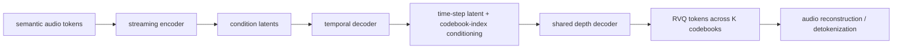
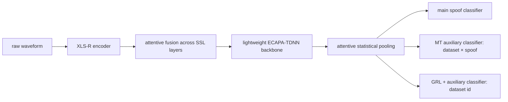
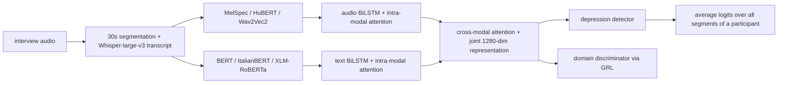
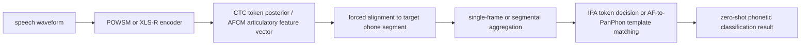

# 语音 / 音频 / 音乐论文速递
## 2026-07-28

> 实际对应 arXiv 更新日：**2026-07-28**  
> 检索范围：`cs.SD + eess.AS`  
> 只放按 ML 顶会审稿口径看，最值得多数读者花时间看的 **5 篇**

## 📋 总览

- 共收录 **5 篇** 相关论文
- 多模态对话语音生成 / 语音系统：**2 篇**
- 鲁棒检测 / 诊断：**2 篇**
- 语音表征 / 音系泛化：**1 篇**

今天这批真正值得优先看的，不是“又有人把语音模型参数做大了”，而是三条更实在的线。`FacialTalker` 把对话式 TTS 里长期被忽略的人脸表情真的接进了生成链路，而且不是停在视觉编码器堆料，而是做了单 token AU 表示、DualDPO 和 1K 小时级数据集；Apple 那篇 `Decoupled Temporal Depth Diffusion Transformers` 则是少见的系统论文，直接把 semantic token 到高保真音频的 on-device detokenizer 拆开讲清楚，给了实时率、内存和生产 MOS，不是 PPT 工程；另一条值得盯的是鲁棒性，`dataset-aware deepfake detection` 和 `domain generalization depression detection` 都在回答“你在一个数据集上刷到高分，换域以后是不是立刻露馅”。

剩下一篇 `Language-Agnostic Articulatory Features` 受众会窄一些，但问题问得很准。它不是做一个更大的 Speech-to-IPA 模型，而是直接指出 G2P 标签这条训练链在 zero-shot 音系识别里先天有毒，然后用连续 articulatory features 把这个坑补上。做语音基础表示、低资源音系建模、跨语言发音诊断的人应该会喜欢。

## 精选入选规则

- **新意（0-3）**：是不是提出了新的表示、接口、训练组织方式，或者把旧问题拆得更对
- **影响力（0-3）**：是不是贴近语音大模型、TTS、语音安全、语音前端、表示学习这些主线
- **证据强度（0-2）**：有没有像样的 baseline、消融和关键数值
- **受众匹配度（0-2）**：对语音大模型 / 语音前端 / 音乐音频系统 / 语音安全研究者有没有直接启发

分数校准：

- **6**：可读，但更像局部补丁或窄任务经验
- **7**：信息量够，值得过一遍
- **8+**：建议优先精读

## 总览表

| 方向 | 序号 | 论文 | 评分 | 关键词 |
|---|---:|---|---:|---|
| 多模态对话语音生成 | 1 | FacialTalker | 8.5/10 | conversational speech synthesis, facial expression, AUTokenizer, DualDPO, VSDD-1K |
| 语音系统 / on-device synthesis | 2 | Decoupled Temporal Depth Diffusion Transformers | 8.5/10 | semantic audio token, RVQ, streaming detokenizer, DiT conditioning, Siri on-device |
| 语音安全 / deepfake detection | 3 | Dataset-Aware Audio Deepfake Detection | 8/10 | multitask, GRL, dataset identity, Speech Deepfake Arena, Average EER |
| 多模态诊断 / 域泛化 | 4 | Multimodal DG for Depression Detection | 7.5/10 | depression detection, audio-text fusion, GRL, ItalianBERT, Androids-Corpus |
| 语音表征 / 音系泛化 | 5 | Language-Agnostic Articulatory Features | 7.5/10 | Speech-to-IPA, articulatory features, zero-shot phonetic classification, XLS-R, AFCM |

## 🤖 多模态对话语音生成

### [1] Let Me Look at You: Advanced Facial Expression Modeling for Conversational Speech Synthesis

- **评分**：8.5/10
- **作者/机构**：Yifan Hu, Shuwei He, Rui Liu, Haizhou Li；Inner Mongolia University，The Chinese University of Hong Kong, Shenzhen
- **论文链接**：https://arxiv.org/abs/2607.24430
- **PDF**：https://arxiv.org/pdf/2607.24430.pdf
- **代码链接**：**代码已开源** https://github.com/walker-hyf/FacialTalker
- **Demo 链接**：暂无

#### 📌 简介
这篇做的是对话式语音合成里最容易被嘴上重视、工程上忽略的那件事: 人脸表情。作者不是简单给模型多喂一路视觉特征，而是把 facial action unit 压成可离散建模的单 token 表示，再让 LLM 同时理解文本、语音、说话人和表情上下文，最后生成更贴合语境的回复语音。

更重要的是，它没有只做一个模型，还补了一套数据和训练组织。`VSDD-1K` 给了约 `1033` 小时视频-语音对话数据，`AUTokenizer` 解决了表情表示过重的问题，`DualDPO` 则把视觉和语音两个模态一起拉进偏好优化。这让它不像那种“加个视觉分支就敢叫 multimodal empathy”的论文。

#### ☠️ 毒舌点评
这篇比很多 conversational TTS 论文硬得多，因为它不满足于在文本上下文上做花活，而是真的把用户表情接进了生成链。短板也很明确：它的 AU 分类本身并没有全面碾压专门做微表情的模型，所以你别把它误读成视觉 SOTA；但作为生成系统论文，它的视觉建模已经够用，而且实验把“表情值不值得接”这件事讲明白了。

如果你做的是语音大模型、情感 TTS、avatar 对话或者多模态 spoken dialogue，这篇值得精读。它最大的价值不只是指标更高，而是给了一条比较像产品链路的实现方式。

#### 🔧 技术方案
- **模型解决的问题**：
  传统 CSS 大多只看文本和历史语音，最多再加说话人条件，但真实对话里用户表情对语气、情感和响应方式影响很大。过去方法没把这一路信息接好，一方面是缺大规模视频-语音对话数据，另一方面是视觉特征太重，不适合直接喂给 LLM 做多轮上下文建模。
- **模型架构**：
  - **输入**：多轮对话中的文本、历史语音、目标用户当前语音、目标用户人脸帧、说话人身份表示。
  - **输出**：目标回复的情绪类别、speech token 序列，以及最终回复语音波形。
  - **主干**：`Qwen2.5-0.5B` 作为多模态上下文建模 backbone，后接 emotion-guided `Conditional Flow Matching` 语音渲染器。
  - **关键模块**：
    - `AUTokenizer`：把每帧 facial expression 压成单个离散 token。
    - `Speaker Encoder`：从原始语音提取连续 speaker representation，而不是死用离散 speaker ID。
    - `DualDPO`：同时对语音 token 和视觉 token 做偏好优化。
    - `Speech Synthesizer`：以 speech token、emotion、agent identity 和 reference mel 为条件，用 causal convolutional Transformer U-Net 预测 mel，再交给 `HiFi-GAN` 出波形。
- **信号流**：

- **关键设计 / 核心创新**：
  - 视觉侧不是直接塞 CLIP feature，而是用 `ConvNeXt-Tiny + learnable multiscale fusion + AU queries + FSQ` 做成单 token AU 表示，这个设计明显更适合 LLM 风格的离散上下文建模。
  - 训练上不是普通 SFT 收尾，而是用 `DualDPO` 同时约束 speech token 和 facial token，让模型少走“只会说得顺，不会回得对味”那条老路。
  - 数据上自己搭 `VSDD-1K` 自动化流水线，从 `1362` 个真实对话视频里清洗出 `61,801` 段对话、`991,439` 条 utterance，并保证 `85%+` 帧里有人脸可用。
- **训练 / 推理策略**：
  - `AUTokenizer` 训练用 `CASME II` 和 `DISFA`，采用 `AsymmetricLoss + SoftMacroF1Loss` 处理 AU 长尾不平衡。
  - LLM 训练分四阶段：Stage-1 从 `CosyVoice2` 初始化；Stage-2 用 dialogue speech synthesis 数据增强语音理解；Stage-3 再用 video-speech dialogue 数据做多模态 SFT；Stage-4 加 `DualDPO` 做后训练。
  - Stage-3 里直接对 facial / speech / emotion 三类 token 做 cross-entropy；Stage-4 则把 Stage-3 生成结果作为 rejected sample，把真实离散 token 作为 chosen sample。
  - 推理时先由 LLM 输出 emotion token 和 speech token，再走 emotion-guided CFM 和 `HiFi-GAN` 出最终语音；论文没有报出统一的 RTF，但给了足够完整的主客观评测。

#### 📊 实验结果
- 数据与评测：
  - 数据集侧，`VSDD-1K` 时长约 `1033h`，视觉-语音总训练集 `Datasets-VS` 合计约 `1612h`。
  - baseline 对比覆盖三类：无视觉 CSS（`GRU-CSS`, `M2 CTTS`, `MSRGCN`, `ECSS`, `GPT-Talker`）、有视觉输入方法（`Empatheia`, `EmpathyEar`, `UniTalker`）、以及 AU 分类模型（`ME-GraphAU`, `VL-FAU`, `AULLM` 等）。
- `AUTokenizer` 本身不是视觉 SOTA，但已经够说明方法成立：
  - 在 `DISFA` 上平均 `F1=0.65`，比 `AUTokenizer-VQ` 的 `0.55` 高 `0.10`。
  - 在 `CASME II` 上平均 `F1=0.75`，比 `AUTokenizer-VQ` 的 `0.70` 高 `0.05`，但仍落后于 `AULLM 0.81` 和 `SSSNet-LED 0.79`。
- `FacialTalker (D)` 的 CSS 结果比较扎实：
  - `MultiDialog`：`SIM 0.92 / PDTW 39.29 / ACC_E 0.79 / MOS_N 4.22 / MOS_E 4.23`
  - 对比 `UniTalker` 的 `0.90 / 42.01 / 0.74 / 4.13 / 4.10`，它在 speaker similarity、prosody distance、情绪准确度和主观 MOS 上都更强。
  - `AvaMERG`：`SIM 0.93 / PDTW 40.12 / ACC_E 0.76 / MOS_N 4.14 / MOS_E 4.13`
  - `VSDD-1K`：`SIM 0.92 / PDTW 40.10 / ACC_E 0.78 / MOS_N 4.17 / MOS_E 4.19`
- 消融结论也站得住：
  - 去掉 `DualDPO` 的 `FT-base` 在 `AvaMERG` 上 `ACC_E 0.72 -> 0.76` 被正式版拉开。
  - 用 `FT-CLIP` 替掉 AU tokenizer 后，在 `VSDD-1K` 上 `PDTW 43.67 -> 40.10`，`MOS_E 4.09 -> 4.19`，说明视觉 token 设计本身确实有贡献。

#### 💡 为什么值得看
这篇最值得看的，不是它又把 multimodal 这个词贴在 TTS 上，而是它给了一条真正可执行的路线：先把表情压成可序列化 token，再让 LLM 负责上下文推理，最后用成熟的生成器做语音渲染。做情感对话语音的人，基本都能从这篇里直接抄到一部分系统设计。

#### 评分：8.5/10
理由：方向对、工程完整、数据和训练组织都成体系，实验也没糊弄。扣分点在于 AU 模块本身不是视觉识别强基线，而且整套系统的部署代价不低，但这不影响它是今天最值得先看的论文之一。

### [2] Memory Efficient Audio Synthesis with Decoupled Temporal Depth Diffusion Transformers

- **评分**：8.5/10
- **作者/机构**：Dongseong Hwang, Prasanth Yadla, Kaan Elgin, Shifas Padinjaru Veettil, Sivanand Achanta, Dipjyoti Paul, Ramya Rasipuram, Tyler Johnson, Emad Soroush, Chung-Cheng Chiu, Zhifeng Chen；Apple
- **论文链接**：https://arxiv.org/abs/2607.23811
- **PDF**：https://arxiv.org/pdf/2607.23811.pdf
- **代码链接**：暂无
- **Demo 链接**：暂无

#### 📌 简介
这篇是 Apple 把 `AFM 3 Core Advanced` 里 on-device expressive voice detokenizer 拆出来讲的系统论文。它处理的不是“怎么从文本直接生成语音”，而是“foundation model 已经吐出了 semantic audio tokens，怎么在手机芯片那点内存里把它实时变成高保真语音”。

核心做法是把 temporal 和 RVQ depth 两个维度彻底拆开，做成 `streaming encoder + temporal decoder + shared depth decoder` 三段式结构，再用 `DiT-style conditioning`、固定窗口 KV cache、temporal lookahead 去卡住生成质量和内存复杂度。这个问题特别工程，但也是现在语音大模型真要上设备时绕不开的硬骨头。

#### ☠️ 毒舌点评
这篇的价值非常系统，不是那种训练一个更大模型就发 paper 的路数。它最硬的地方在于给了真实部署约束下的延迟、内存、生产 MOS 和 scaling behavior。坏消息也很直接：数据是私有的，模型不开源，可复现性基本没法碰，所以它更像“高级工程经验公开课”，不是你周末就能复现的学术 recipe。

如果你关心 on-device TTS、semantic token detokenizer、neural codec decoder 或 mobile inference，这篇值得精读。它讲的是语音系统真正的瓶颈，不是 benchmark 幻觉。

#### 🔧 技术方案
- **模型解决的问题**：
  semantic audio token 到高保真音频的 detokenization 过去通常要么太吃显存，要么生成延迟太高，尤其在长语音和移动端场景里会直接炸。作者要解决的是“如何把 semantic token 稳定映射成 RVQ/audio，同时让 runtime memory 与 utterance length 脱钩”。
- **模型架构**：
  - **输入**：foundation model 输出的 semantic audio tokens。
  - **输出**：逐时间步、逐 RVQ codebook 生成的音频离散表示，以及最终重建语音。
  - **主干**：`streaming encoder + temporal decoder + depth decoder`，两个 decoder 都用 `DiT` 风格结构。
  - **关键模块**：
    - `Streaming Encoder`：把 semantic tokens 变成 condition latents。
    - `Temporal Decoder`：结合 encoder latent 和已生成 RVQ token，负责时间维自回归。
    - `Shared Depth Decoder`：沿 depth 维逐级生成所有 RVQ levels，用同一套参数共享所有 codebook。
    - `Fixed-window KV cache`：让内存复杂度对序列长度近似常数。
    - `Temporal Lookahead`：给 encoder 少量未来 token，提高音质。
- **信号流**：

- **关键设计 / 核心创新**：
  - 跟 `Moshi` 这类路线相比，它把 temporal 和 depth 处理显式拆开，不再让一个 depth transformer 同时扛所有事。
  - `depth decoder` 参数完全共享，只靠 `DiT-style stage conditioning` 区分不同 RVQ level，减少了 per-level decoder 的参数和内存负担。
  - `fixed-window KV cache` 是系统关键点，它让 `20s -> 320s` 的序列长度增长不再线性推高 runtime memory。
- **训练 / 推理策略**：
  - 训练数据来自 Apple 内部大量语音助手语料，论文明确说受治理和保密限制，不公开配方。
  - 优化用 `1e-4` 学习率和 cosine annealing，architecture 里采用 `RMSNorm`、`SwiGLU`、`RoPE`、`grouped query attention` 等现代 LLM 组件。
  - 关键 ablation 包括 `temporal lookahead`、`unified depth decoder`、`DiT conditioning`、`output normalization` 和 `fixed KV cache`。
  - 推理端在 AMX 上实现，约 `10 ms / generation step`，每步生成 `160 ms` 音频，约 `16x real-time`；这是论文最值钱的部分。

#### 📊 实验结果
- 设备侧部署结果：
  - `Latency per generation step ≈ 10 ms`
  - `Throughput = 160 ms audio / step`
  - `Peak runtime memory ≈ 21 MB`
  - `On-device assets = 329 MB`
- 长序列 scaling 很漂亮：
  - `20s` 长度下，本文 `RTF 0.12 / 1.13 GB`，`Transformer Decoder 0.04 / 1.78 GB`，`Autoregressive GAN 0.43 / 1.66 GB`
  - 到 `320s` 时，本文仍是 `RTF 0.12 / 1.13 GB`，而 `Transformer Decoder` 内存涨到 `33.44 GB`、`RTF 2.5`
  - 这说明它不是只在短音频上讨巧，是真把复杂度做平了。
- 音质与 token 质量：
  - `UTMOS 3.97`，高于 `Moshi/Mimi 3.92`、`Transformer Decoder 3.61`、`Autoregressive GAN 3.91`
  - `SI-SNR 9.47`，显著高于 `Moshi/Mimi 7.45`、`Transformer Decoder 3.76`、`Autoregressive GAN 5.50`
  - within-speaker `ABX error = 5.3%`，说明 phonetic distinction 保留得不错。
- 关键 ablation：
  - 完整版 `Eval Loss 3.23`，相对全关组件的 `5.86` 明显更优。
  - `DiT-style conditioning` 与 cross-attention 在质量上统计上接近，但训练速度快 `1.36x`。
  - `lookahead` 最优偏移约 `6 tokens`，`sliding window` 最优约 `128 tokens`，layer ratio 最优是 `4-6-2`。
- 生产级主观评测：
  - `AFM 3 Core Advanced MOS = 4.15`
  - 旧 production baseline `MOS = 3.87`
  - 总体提升 `+0.28`
  - 对话语音提升最大，`4.24 vs 3.82`，增幅 `+0.42`

#### 💡 为什么值得看
这篇最值钱的是，它把“语音大模型最后那段最不性感但最烧资源的音频生成尾巴”讲清楚了。做系统的人会直接盯上它的三件事：shared depth decoder、constant-memory KV cache、真实设备指标。学术 novelty 不是爆炸级，但工程密度很高。

#### 评分：8.5/10
理由：系统问题问得准，部署证据很硬，很多设计都能直接迁移到其他 detokenizer 或 codec decoder。扣分点只有两个：私有数据不可复现、代码不开源；但对真正做语音系统的人，这篇依然很值得读。

## 🛡️ 鲁棒检测 / 诊断

### [3] Leveraging Gradient Reversal Loss and Multitask Learning for Datasets-Aware Audio Deepfake Detection

- **评分**：8/10
- **作者/机构**：Mingrui Liang, Thomas Thebaud, Łukasz Wójciak, Laureano Moro Velazquez, Yishay Carmiel, Jesus Villalba Lopez, Najim Dehak；Johns Hopkins University，Meaning
- **论文链接**：https://arxiv.org/abs/2607.23961
- **PDF**：https://arxiv.org/pdf/2607.23961.pdf
- **代码链接**：暂无
- **Demo 链接**：暂无

#### 📌 简介
这篇不是再造一个更复杂的 anti-spoof backbone，而是盯着一个更现实的问题：你在一个 deepfake 数据集上刷出低 EER，不代表换数据集后还能活。作者直接把 `dataset identity` 当作天然可用的监督信号，分别做了 `multitask learning` 和 `GRL` 两条线，试图让模型既能看懂数据集差异，又不要被数据集偏见绑死。

论文最大的优点是朴素。它不要求语言、codec、spoofing method 这种经常缺失的 metadata，只用几乎总能拿到的 dataset id，就把 heterogeneous mixed-dataset training 这件事做得更稳了。

#### ☠️ 毒舌点评
这是一篇典型的“没有花哨新骨干，但非常有用”的论文。很多 deepfake 检测文章喜欢堆 front-end、堆时频模块、堆专家网络，结果一上 mixed benchmark 就掉链子；这篇反而很克制，用 dataset-aware label 和 GRL 把 generalization 这件事硬掰回来了。

缺点同样明显：它还没有把 `MT` 和 `GRL` 合成一个统一目标，而且 backbone 只测了一种。换句话说，这篇更像一把挺锋利的训练策略扳手，不是最终答案。但只要你做语音安全，它值得看。

#### 🔧 技术方案
- **模型解决的问题**：
  现有 deepfake detector 往往在单一数据集上表现不错，但跨数据集后会被语言、录音通道、合成器分布和语料协议狠狠干碎。过去有人用 language 或 codec label 做域对抗，但这些元数据在混合训练时经常缺失或不一致。
- **模型架构**：
  - **输入**：原始音频波形，裁成 `2s` chunk。
  - **输出**：binary `bona fide / spoof` 判别，以及辅助的 dataset-aware label。
  - **主干**：`XLS-R` front-end + attentive fusion + 改造版 `ECAPA-TDNN` backbone + attentive statistical pooling + FC classifier。
  - **关键模块**：
    - `MT auxiliary head`：预测 `dataset × spoof/bona fide` 的 class-conditional label。
    - `GRL auxiliary head`：通过 gradient reversal 去预测 dataset id，让 backbone 学到域不敏感表示。
    - 单模型轻量化：把 ECAPA-TDNN 从 `3` 个 `SE-Res2Block` 缩到 `1` 个，整模仍只有 `315.4M` 参数。
- **信号流**：

- **关键设计 / 核心创新**：
  - `MT` 分支不是只预测 dataset id，而是预测 `dataset × spoof` 组合标签，让辅助任务更贴近主判别目标。
  - `GRL` 分支只用 dataset label，不把 spoof label 混进去，避免把有效 spoof cue 也一起对抗掉。
  - 相比 MoE 或 ensemble，这个方案依旧是单模型训练和推理，成本小很多。
- **训练 / 推理策略**：
  - 训练语料拼了 `ASVspoof 2015/2019/2024`、`Fake or Real`、`DFADD`、`MLAAD`、`Codecfake`、`SpoofCeleb`、`VoicePrivacy 2024`、`SONAR`、`LibriSeVoc` 等，训练集总计 `4,859,430` utterances、`7,325.65` 小时。
  - 数据增强包括混响和噪声扰动，每条样本最多生成 `6` 个增强版本。
  - 两阶段训练：Stage-1 冻结 SSL encoder，只训 fuser / backbone / classifiers；Stage-2 全量解冻。
  - Stage-1 用 `SGD lr=0.4`，effective batch size `1024`；Stage-2 降到 `5e-3`，effective batch size `512`，主任务损失采用 `AAM-Softmax`，`s=32, m=0.2`。
  - 辅助损失权重统一设 `λ=0.1`，并用 early stopping 控过拟合。

#### 📊 实验结果
- 主 benchmark 是 `2025 Speech Deepfake Arena`，指标看 `Average EER` 和 `Pooled EER`。
- `MT` 主打平均泛化：
  - baseline `Average EER = 9.484%`
  - `MT = 8.238%`
  - 相对下降 `13.14%`
  - dataset 级别上，`14` 个评测子集里赢了 `9` 个。
- `GRL` 主打 pooled robustness：
  - baseline `Pooled EER = 12.596%`
  - `GRL = 11.926%`
  - 相对下降 `5.32%`
  - `In The Wild` 和 `ADD 2023 R2` 上它比 MT 更强。
- 关键单集对比很能说明问题：
  - `ASVspoof 2019`：baseline `5.850`，`MT 1.526`
  - `Fake or Real`：baseline `1.428`，`MT 0.057`
  - `In The Wild`：baseline `5.211`，`GRL 3.062`
- leaderboard 对比也不丢人：
  - `MT (315.4M)` 的 `Average EER 8.238 / Pooled 13.050`
  - `GRL (315.4M)` 的 `Average 9.379 / Pooled 11.926`
  - 论文指出排在它前面的系统用了 `500M` 和 `1B` 参数，说明这个训练策略的性价比确实不差。
- 消融很关键：
  - 对 `MT` 来说，`dataset × spoof` 标签优于单独 dataset label，`Average EER 10.139 -> 8.238`
  - 对 `GRL` 来说，dataset-based adversarial label 优于 language pseudo label，`Average EER 11.192 -> 9.379`，`Pooled EER 12.939 -> 11.926`

#### 💡 为什么值得看
这篇最值得抄的不是 backbone，而是训练视角：在 heterogeneous speech security benchmark 里，dataset identity 本身就是一个强信号，而且比你费劲补 language / codec metadata 实用得多。做 anti-spoof 的人可以直接把这个思路移植到别的 SSL backbone 上试。

#### 评分：8/10
理由：方法朴素但有效，实验覆盖真实 benchmark，也给了足够清楚的 trade-off。扣分点是没有统一 MT+GRL、只验证了一个 backbone，但这不妨碍它成为今天最实用的安全方向论文之一。

### [4] Multimodal Domain Generalization for Depression Detection: An Attention-Based BiLSTM Network with Domain-Adversarial Training

- **评分**：7.5/10
- **作者/机构**：Ali Tabaraei, Federico Simonetta, Stavros Ntalampiras；University of Milan，Gran Sasso Science Institute
- **论文链接**：https://arxiv.org/abs/2607.22794
- **PDF**：https://arxiv.org/pdf/2607.22794.pdf
- **代码链接**：**代码已开源** https://github.com/tabaraei/MultimodalDG-depression-detection
- **Demo 链接**：暂无

#### 📌 简介
这篇做的是抑郁症语音诊断里的一个老大难：模型学到的到底是 depression cue，还是说话人自己的口音、语速、措辞习惯。作者把每个受试者都当成一个 domain，然后用 `audio + transcript` 的多模态表示加 `GRL` 域对抗，把 speaker-specific 信息尽量洗掉。

方法不花，但问题是对的。尤其在医疗/心理健康这类场景里，“subject-independent” 比“在同一批人上分高”重要得多，这篇至少没有装糊涂。

#### ☠️ 毒舌点评
这篇的亮点是它终于认真把 depression detection 里的 domain shift 拿出来正面处理了，而不是继续沉迷在同一数据集上拼 embedding。缺点也很致命：它目前基本只在 `Androids-Corpus` 这一套意大利语数据上验证，数据域还是太窄，所以别把它当成临床可用结论。

对做 domain generalization、health speech、multimodal diagnosis 的人，它值得读；但如果你只关心通用 speech foundation model，这篇的外延没那么大。

#### 🔧 技术方案
- **模型解决的问题**：
  depression detection 里最常见的假进步，是模型记住了受试者自己的说话风格，而不是抑郁相关模式。作者要解决的是“怎样在 patient-independent 设置下，让模型保留 depression cue，同时抑制 inter-speaker variability”。
- **模型架构**：
  - **输入**：受访者 interview 音频，切成固定长度片段；每段再用 `whisper-large-v3` 转成 transcript。
  - **输出**：segment-level depression logit，以及聚合后的 participant-level depression score。
  - **主干**：`BiLSTM + intra-modal attention + cross-modal attention` 的 audio-text multimodal extractor。
  - **关键模块**：
    - 音频侧候选特征：`MelSpec`, `HuBERT`, `Wav2Vec2`
    - 文本侧候选特征：`BERT`, `ItalianBERT`, `XLM-RoBERTa`
    - `Depression detector hϕ`：单 hidden layer `128` 神经元的 FC 网络
    - `Domain discriminator gψ`：带 `m` 类输出的 FC 网络，通过 `GRL` 做 speaker/domain 对抗
- **信号流**：

- **关键设计 / 核心创新**：
  - 把每个 participant 当成一个独立 domain，这个定义对 depression 这种高度个体化任务很合适。
  - 不是只在最终 classifier 上做对抗，而是直接让 joint representation 既服务 depression 判别，又要骗过 domain discriminator。
  - segment-level 建模后再做 participant-level averaging，避免一次性吃整段长访谈带来的长度和显存问题。
- **训练 / 推理策略**：
  - `Androids-Corpus` interview data 共 `116` 名受试者，其中 `64` 名 depressed、`52` 名 control，使用 `5-fold CV`。
  - 片段长度对比 `20s/30s/45s/60s`，最终选 `30s` 作为性能和成本平衡点。
  - 训练用 `AdamW`，学习率和 weight decay 都是 `1e-5`，`ReduceLROnPlateau` 衰减，最多 `100` epoch，通常 `35` epoch 内停。
  - 推理时关掉 `gψ`，只保留 domain-invariant representation 和 depression detector；一个人所有 segment logit 取平均得到最终预测。

#### 📊 实验结果
- baseline 选择过程很清楚：
  - 在所有 `audio-text extractor × segment duration` 组合里，`MelSpec + ItalianBERT @ 30s` 最优
  - 该 baseline 达到 `Accuracy 90.4% / Precision 90.8% / Recall 92.0% / F1 90.8%`
- 加上 domain generalization 后：
  - `Accuracy 93.2%`
  - `Precision 93.2%`
  - `Recall 96.2%`
  - `F1 94.2%`
  - 相对 baseline 提升 `+2.5% accuracy`、`+3.3% F1`
- 对比已有方法也不虚：
  - `Concatenation + Cross-Attention (AlexNet / ItalianBERT)`：`F1 92.1`
  - `MIL (OpenSMILE / LIWC)`：`F1 93.1`
  - `PDEM`：`F1 86.3`
  - 本文 `MultimodalDG`：`F1 94.2`
- 消融能看出不是纯碰运气：
  - `No DG`：`Accuracy 90.7 / F1 90.9`
  - `No IMA`：`87.3 / 88.7`
  - `No CMA`：`89.8 / 90.4`
  - `Audio-only`：`Accuracy 73.4 / F1 76.2`
  - `Text-only`：`Accuracy 85.3 / F1 87.0`
  - full multimodal 的优势比较明确。
- 论文还给了累计混淆矩阵视角：
  - depressed 个体识别率 `95.3%`
  - non-depressed 个体识别率 `90.4%`
  - `FNR = 4.7%`

#### 💡 为什么值得看
如果你做的是跨说话人鲁棒性、医疗语音、domain generalization，这篇有参考价值。它最值得看的不是 network 本身，而是它把“每个病人都是一个 domain”这件事建模得很直接，也用够了 ablation 去证明这个建模不是装饰。

#### 评分：7.5/10
理由：问题抓得准，结果也比不少老 benchmark 工作更可信。扣分主要在外推性上，单数据集、单语言、单任务限制都很重，所以这更像一篇扎实的任务型论文，而不是通用方法大作。

## 🧠 语音表征 / 音系泛化

### [5] Improving Zero-Shot Phonetic Classification through Language-Agnostic Articulatory Features

- **评分**：7.5/10
- **作者/机构**：Ryo Magoshi, Jaeyoung Lee, Shinsuke Sakai, Tatsuya Kawahara；Kyoto University，NTT
- **论文链接**：https://arxiv.org/abs/2607.23606
- **PDF**：https://arxiv.org/pdf/2607.23606.pdf
- **代码链接**：暂无
- **Demo 链接**：暂无

#### 📌 简介
这篇不是“再做一个 Speech-to-IPA foundation model”，而是直接追问一个尴尬事实：现在很多 PFM 号称 zero-shot phonetic recognition，但训练标签本身是 G2P 产物，天生更偏 phonemic 而不是 phonetic。换句话说，你训练时就没学到真正的发音差异，测试时当然认不出没见过的 phone contrast。

作者给的补法很干净：不用只盯离散 IPA token，而是引入连续的 `24-dimensional articulatory features`，在 peak frame 或 segment 上和 `PanPhon` 模板做 L1 匹配。重点不在模型更大，而在表示更对。

#### ☠️ 毒舌点评
这篇的任务非常窄，拿它去吹“通用语音基础模型新方向”会有点夸张。但它的问题意识是对的，而且实验结论挺锋利：multilingual coverage 不等于真正的 zero-shot phonetic generalization，尤其碰到 aspiration 和 allophone 这种细粒度区分时，离散 token 真会露馅。

如果你做零样本发音识别、低资源音系、语言无关表征，这篇值得读。反过来，如果你只盯大模型大 benchmark，它可能看起来不够 flashy。

#### 🔧 技术方案
- **模型解决的问题**：
  现有 Speech-to-IPA 模型大多用 G2P 推导出的离散 IPA 标签训练，这些标签忽略了很多真实声学-发音差异，导致模型遇到训练中没显式见过的音类对比时表现很差。作者想解决的是“如何让模型在 zero-shot phonetic classification 上真正认出 unseen contrast，而不是只会复读训练语种里的 phonemic inventory”。
- **模型架构**：
  - **输入**：语音帧级表示，以及目标 phone 所在的对齐片段。
  - **输出**：目标 phone 类别的 zero-shot 分类结果。
  - **主干**：对比两种 PFM：`POWSM`（AED+CTC hybrid）和 `XLS-R + AFCM`（CTC + articulatory feature classification module）。
  - **关键模块**：
    - `AFCM`：为每一帧预测 `24` 维 articulatory feature 向量。
    - `Decoder-based classification`：基于解码 IPA 序列与 reference 对齐。
    - `CTC-based classification`：看 peak frame 上的离散 token posterior。
    - `AF-based classification`：对 peak frame 或 segmental 平均后的 AF 向量，与 `PanPhon` 模板做 `L1` 最近邻匹配。
- **信号流**：

- **关键设计 / 核心创新**：
  - 论文最值钱的点，不是 AFCM 本身，而是把 zero-shot phonetic classification 从“语言覆盖够多就行”这个错觉里拽出来。
  - AF-based classifier 利用 `PanPhon` 的 `24` 维发音属性模板做 language-agnostic 匹配，比直接在离散 IPA token 上 argmax 更符合 phonetic distinction。
  - 它还明确指出 temporal aggregation 不是越长越好，短暂 cue 和持续 cue 应该分开处理。
- **训练 / 推理策略**：
  - 训练数据来自 `IPAPack++` 中 `Common Voice + FLEURS` 部分，排除了中文和日文后仍覆盖 `78` 种语言、约 `3000` 小时。
  - `POWSM` 用训练集 token 重新训练，规模 `252M`；`XLS-R + AFCM` 规模 `318M`。
  - 优化用 `AdamW`，学习率 `5e-4`，`10k warmup`，batch size 以 `10 minutes` 语音为单位。
  - 评测任务分两类：
    - 中文送气/不送气塞音二分类
    - 日语 moraic nasal 四分类
  - 推理时既比较 single-frame，也比较 segmental aggregation，验证不同音系对时间聚合策略的依赖。

#### 📊 实验结果
- 先看作者真正想打脸的点：
  - `POWSM` 在中文送气任务上 balanced accuracy 只有 `53.1~58.3`
  - 在日语鼻音任务上也只有 `46.7~49.3`
  - 这说明“多语言训练过”不等于真的会 zero-shot 区分未见音类。
- `XLS-R + AFCM` 的离散 CTC 已经把 baseline 拉起来：
  - 中文 aspiration 任务里，`CTC single-frame balanced accuracy = 94.5`
  - 日语 nasal 任务里，`CTC single-frame balanced accuracy = 59.0`
- AF 表示进一步改进，但改进是有条件的：
  - 中文 aspiration：
    - `AF single-frame balanced accuracy = 95.4`
    - 比 `CTC single-frame 94.5` 略好
    - 但 `AF segmental` 直接崩到 `50.8`，因为 aspiration burst 是短时 cue，被平均掉了。
  - 日语 nasal：
    - `AF single-frame = 65.8`
    - `AF segmental = 72.6`
    - 明显高于 `CTC single-frame 59.0`
    - 稀有类别 `[ñ]` 的 recall 做到 `38.5%`，而非 AF 方法都低于 `7%`
    - `[N]` 从 `69.3` 提到 `93.6`
- 数据分布本身也解释了难度：
  - aspirated stop 在训练集中都不到 `10%`
  - `[ñ]` 只占日语鼻音 token 的 `2.6%`
  - 这也是 AF 表示在 rare phone 上更有意义的原因。
- baseline 对比足够直接：
  - 对比的是 `Decoder-based`, `CTC-based`, `AF-based`
  - 不是只拿自己和自己比，所以结论比较干净。

#### 💡 为什么值得看
这篇最值得看的，是它把“zero-shot phonetic recognition 到底在认什么”这个基础问题拆清楚了。很多大模型 paper 喜欢把 multilingual training 包装成 universal phonetic ability，但这篇用很窄、很硬的任务告诉你：标签如果从根上就不够 phonetic，模型再大也可能白搭。

#### 评分：7.5/10
理由：问题尖锐，实验设计干净，结论对表示学习很有启发。扣分点是任务面确实窄，离直接变成通用 ASR/TTS recipe 还远，但它作为诊断型论文是合格而且有价值的。

## 最后结论

今天优先级最高的三篇，我会这样排：

1. **FacialTalker**：因为它不是只给“视觉有帮助”这句废话，而是把视觉 token 设计、数据集、DualDPO 和对话式 TTS 整链路都搭起来了。
2. **Decoupled Temporal Depth Diffusion Transformers**：因为真实 on-device detokenizer 设计太少见，这篇的延迟、内存和 constant-scaling 结论对系统人非常值钱。
3. **Dataset-Aware Audio Deepfake Detection**：因为它给了一个立刻能迁移到别的 anti-spoof backbone 上的训练策略，而不是只在某个网络结构上刷小数点。

剩下两篇不是没价值，而是更偏窄任务和方法诊断：

- `MultimodalDG-depression-detection` 适合关心 patient-independent 泛化的人读，重点在建模思路，不在大模型范式。
- `Language-Agnostic Articulatory Features` 适合做发音表征和 low-resource phonetics 的人读，它的问题意识很强，但别指望它直接变成一个通用语音大模型方案。

如果你今天只有一小时：

- 做 **多模态 TTS / spoken dialogue**，先看 `FacialTalker`
- 做 **on-device 语音系统 / codec / detokenizer**，先看 Apple 这篇
- 做 **语音安全 / deepfake detection**，先看 dataset-aware 那篇
