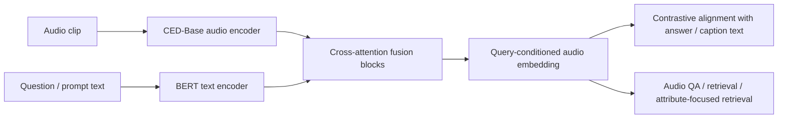
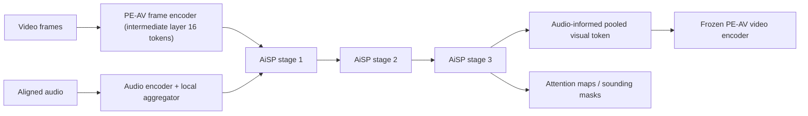
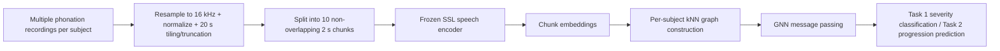
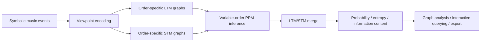

# 语音 / 音频 / 音乐论文速递
## 2026-07-29

> 实际对应 arXiv 更新日：**2026-07-29**  
> 检索范围：`cs.SD + eess.AS`  
> 只放按 ML 顶会审稿口径看，最值得多数读者花时间看的 **5 篇**

## 📋 总览

- 共收录 **5 篇** 相关论文
- 音频表征 / 检索 / 定位：**2 篇**
- 音乐建模 / 音频交互系统：**2 篇**
- 病理语音 / 医疗建模：**1 篇**

今天这批没有那种一眼就能改行业格局的语音大模型大稿，但有两条线很值得认真看。第一条是 `TP-CLAP` 和 `LAIP` 代表的“别急着堆更大模型，先把现有大表征榨干”路线：一个在 CLAP 上做 query-conditioned 音频表示，一个在大规模音视频检索骨干上把局部定位能力硬解锁出来。第二条是“结构化显式建模”的回潮：`GraphIDyOM` 把经典音乐期待模型做成可分析、可部署的 Python 图结构，`ALS` 那篇则把多次发声任务直接拼成 subject-level 图，说明图建模在小样本音频场景里确实还有硬价值。

剩下的 `LLM4OSC` 不是传统 speech paper，但它给音频交互系统提了一个很对的指标：`wrong-send rate`。这东西比“答对率”更接近真生产事故。对做 audio agent、舞台控制、可解释交互的人，这篇比很多泛泛而谈的 tool-use 论文更实在。

## 精选入选规则

- **新意（0-3）**：是不是提出了新的表示、接口、训练组织方式，或者把旧问题拆得更对
- **影响力（0-3）**：是不是贴近语音表征、音频检索、音乐理解、病理语音、音频交互这些主线
- **证据强度（0-2）**：有没有像样的 baseline、消融、速度或关键数值
- **受众匹配度（0-2）**：对语音大模型 / 音频系统 / 音乐技术 / 医疗语音研究者有没有直接启发

分数校准：

- **6**：可读，但更像局部补丁或工具重写
- **7**：信息量够，值得过一遍
- **8+**：建议优先精读

## 总览表

| 方向 | 序号 | 论文 | 评分 | 关键词 |
|---|---:|---|---:|---|
| 音频表征 / 检索 | 1 | Text-Prompted CLAP | 8.5/10 | query-conditioned representation, audio-MCQ, cross-attention, retrieval |
| 音频定位 / 多模态检索 | 2 | LAIP | 8.5/10 | PE-AV, audio-informed pooling, AVSBench, AVATAR, grounding |
| 病理语音 / 医疗建模 | 3 | Multi-Phonation Graph Learning | 8/10 | SSL embedding, GIN, ALS detection, progression prediction |
| 音乐建模 / 可解释建模 | 4 | GraphIDyOM | 7.5/10 | IDyOM, graph-native memory, PPM, symbolic music, reproducibility |
| 音频交互 / 控制系统 | 5 | LLM4OSC | 7.5/10 | wrong-send rate, deterministic validation, OSC, local-first, LoRA |

## 🎧 音频表征 / 检索 / 定位

### [1] Text-Prompted CLAP: Learning Query-Conditioned Audio Representations via Contrastive Learning

- **评分**：8.5/10
- **作者/机构**：Mohan Li，Rama Doddipatla，Philip C. Woodland；University of Cambridge，Toshiba Cambridge Research Laboratory
- **论文链接**：https://arxiv.org/abs/2607.25085
- **PDF**：https://arxiv.org/pdf/2607.25085.pdf
- **代码链接**：暂无
- **Demo 链接**：暂无

#### 📌 简介
这篇解决的不是“再训练一个更大的 audio-LLM”，而是一个更实际的问题：标准 CLAP 把音频和文本各自独立编码，碰到 audio QA、属性检索这类明显依赖 query 的任务时，音频侧根本不会跟着问题变。`TP-CLAP` 的做法是给 CLAP 加一个轻量 cross-attention 融合模块，再用 `audio-MCQ` 监督让音频表示变成“带问题条件的表示”。

论文最值钱的地方在于它没有直接走重型多模态 LLM 路线，而是坚持用 contrastive 表征学习这条轻量路线，把 query-conditioned audio representation 这件事做成了一个小而硬的升级包。对做音频检索、音频问答、音乐属性检索的人，这条思路是能落地的。

#### ☠️ 毒舌点评
这篇不是范式革命，但也绝对不是“把 prompt 写到标题里”那种换皮稿。作者抓住了 CLAP 最大的短板之一：音频 embedding 静态、不会看题。实验也不是只给一个 retrieval 表格糊弄，retrieval、zero-shot classification、audio QA、attribute-focused retrieval 四条都给了。

真正的短板也很明确：它的提升幅度是扎实但不夸张的，说明这更像高质量系统增强，不是直接把 CLAP 变成全能音频 agent。可如果你的目标是用更低成本逼近一部分 audio-LLM 能力，这篇非常值得看。

#### 🔧 技术方案
- **模型解决的问题**：
  标准 CLAP 在训练时只追求音频和文本的全局对齐，导致同一段音频无论你问“是什么乐器”还是“情绪是什么”，它拿出来的都是同一个音频表示。`TP-CLAP` 要补的就是这个缺口：让音频表示随着文本问题变化，而不是永远静态。
- **模型架构**：
  - **输入**：音频片段、文本描述或问题、候选答案文本
  - **输出**：query-conditioned 音频表示，以及用于检索、分类、问答的相似度分数
  - **主干**：`CLAP backbone + cross-attention fusion module`
  - **关键模块**：
    - `CED-Base` 音频编码器
    - `bert-base-uncased` 文本编码器
    - 2 层 cross-attention fusion block
    - `audio-MCQ` 监督框架
    - 属性导向的 audio-to-audio 对比学习目标
- **信号流**：

- **关键设计 / 核心创新**：
  重点不是“再引一个大语言模型”，而是把文本问题真正注入音频 token 层级，而不是事后拿静态 embedding 做相似度。`CLAP+AudioMCQ` 这个对照组也很关键，它证明收益不只是多喂了 AudioMCQ 数据，cross-attention 融合本身也在起作用。
- **训练 / 推理策略**：
  - base CLAP 先在 `AudioCaps-v2`、`Clotho`、`WavCaps`、`MACS`、`LP-MusicCaps` 等共约 **601k** 音频-文本对上训练 20 epoch
  - `TP-CLAP` 再用 sound/music 子集的 `AudioMCQ`，约 **310k** question-choice 对做两阶段训练
  - 第一阶段冻结 CLAP 编码器，只训 fusion module **5 epoch**
  - 第二阶段联合微调全部参数 **1 epoch**
  - 属性检索微调用 `NSynth` 约 **870k** audio-attribute 对，以及 `MagnaTagATune` **24k** 对
  - 推理时 retrieval / classification 仍可走底层 CLAP 编码器，audio QA 则显式使用 query-conditioned 表示

#### 📊 实验结果
- **音频文本检索**：
  - `AudioCaps` 上，`TP-CLAP` 的 `A2T R@1=57.2`，高于 `CLAP(ours)` 的 `55.9`，也高于 `CLAP+AudioMCQ` 的 `56.1`
  - `Clotho` 上，`TP-CLAP` 的 `T2A/A2T R@1=21.3/27.1`，高于 `CLAP(ours)` 的 `21.0/26.6`
  - baseline 包括 `MS-CLAP`、`Laion-CLAP`、`GLAP`
- **zero-shot 音频分类**：
  - 8 个 benchmark 平均分从 `CLAP(ours)` 的 **63.0** 提升到 `TP-CLAP` 的 **64.1**
  - `FSD50K`：`51.2 -> 52.6`
  - `CREMA-D`：`30.0 -> 34.7`
  - `NSynth instrument`：`39.9 -> 42.1`
  - baseline / 对比对象包含 `MS-CLAP`、`Laion-CLAP`、`GLAP`
- **audio question answering**：
  - `MMAU-Sound`：`TP-CLAP 71.47`
  - `MMAU-Music`：`55.99`
  - `MMAR-Sound`：`47.88`
  - `MMAR-Music`：`32.02`
  - 对比 `CLAP(ours)` 的 `58.86 / 46.41 / 43.03 / 26.11` 明显更强
  - 它甚至在部分 sound 子集上接近或超过若干更大的 baseline，如 `SALMONN`、`GAMA-IT`
- **属性导向 audio-to-audio retrieval**：
  - `NSynth instrument` 的 `mAP` 从未提示检索的 **21.9** 提到 **44.2**
  - `NSynth pitch` 的 `mAP` 从 **60.2** 提到 **72.3**
  - `MagnaTagATune tempo` 的 `SmAP` 从 **81.1** 提到 **90.2**
  - 这里的 baseline 不是“别家模型”，而是同一模型的 `Unprompted retrieval`，这恰好说明 query conditioning 确实在工作

#### 💡 为什么值得看
如果你做音频检索、音频问答或者音乐标签检索，这篇最值得看的不是那几个点数提升，而是它给了一条不靠大规模 instruction tuning 也能做 query-conditioned audio representation 的路线。它证明了“更懂问题的 embedding”本身就能吃到不少收益，这比单纯喊 audio-LLM 更有工程价值。

### [2] Unlocking Spatial Grounding in Large Audio-Visual Retrieval models

- **评分**：8.5/10
- **作者/机构**：Hugo Malard，Michel Olvera，Sanjeel Parekh，Gaël Richard，Slim Essid，Stéphane Lathuilière；Télécom Paris / Institut Polytechnique de Paris，Meta Reality Labs Research，NVIDIA France，Inria Grenoble Alpes / CNRS / LJK
- **论文链接**：https://arxiv.org/abs/2607.24786
- **PDF**：https://arxiv.org/pdf/2607.24786.pdf
- **代码链接**：暂无
- **Demo 链接**：暂无

#### 📌 简介
这篇做的是音视频检索骨干里的“空间定位能力解锁”。作者的核心判断很准：大型 audio-visual retrieval 模型不是没学到空间信息，而是被全局 pooling 和上层 token 压缩给抹掉了。于是他们在 `PE-AV` 这种大规模检索骨干上插入一个轻量 `LAIP` 模块，用对齐后的音频 token 去 query 中间层视觉 token，把声音来源位置重新捞出来。

说白了，这不是从零训练一个 localizer，而是从已有 retrieval representation 里“抠”出 spatial grounding。这个角度比再堆一个 localization head 聪明得多，也更符合今天大模型时代该有的利用方式。

#### ☠️ 毒舌点评
这篇的优点是几乎没有空话。它不是说“多模态模型很强所以应该能定位”，而是明确指出：上层全局表示丢了空间细节，中间层 token 还保留着，问题在于怎么把这部分信息变成 sound source localization。`LAIP` 的提升也不是挤牙膏，`AVATAR` 上直接把一堆老 baseline 拉开。

缺点也别神化。它还是建立在一个很重的 `PE-AV` 检索骨干上，推理形态并不轻；而且作者自己承认 localizer 本身不适合直接做 scalable retrieval，因为 query 变了就得重算视频编码。换句话说，这是“把检索骨干拿来做定位”的强论文，不是“一套骨干什么都无代价通吃”。

#### 🔧 技术方案
- **模型解决的问题**：
  弱监督音视频声源定位通常缺像素级标注，传统方法又经常在小规模数据上从头学 localizer。作者要解决的是：既然大规模 audio-visual retrieval 模型已经学到很强的语义对齐，能不能不重学一遍，只把被 global pooling 丢掉的空间信息重新取出来。
- **模型架构**：
  - **输入**：视频帧序列与其对齐音频
  - **输出**：逐帧 sounding region heatmap / segmentation mask，以及与原 retrieval pipeline 兼容的 pooled visual token
  - **主干**：冻结 `PE-AV` 的 audio encoder、frame encoder、video encoder，在 frame 与 video encoder 之间插入 `LAIP`
  - **关键模块**：
    - `Local Aggregator`：把音频时间分辨率对齐到视频帧率
    - `AiSP`：Audio-informed Spatial Pooling
    - 3-stage hierarchical pooling
    - 中间层第 **16** 层视觉 token 读取
    - null-token regularization 与 multi-resolution consistency
- **信号流**：

- **关键设计 / 核心创新**：
  关键不只是“用 attention 做定位”，而是它保持了与原 `PE-AV` video encoder 的接口兼容。作者把这件事解释成一种隐式蒸馏：模型既要抽出局部定位信息，又不能把 token 结构搞到原来的 temporal stack 完全吃不下去。这比单独挂一个 localization head 更克制，也更高效。
- **训练 / 推理策略**：
  - 训练数据跟 `AVATAR` 设定保持可比，只用 `VGGSound` 选出的约 **10k** 高帧率视频训练
  - 多分辨率 `AiSP` pooling 因子设为 `K={2,2,6}`
  - 新增参数约 **35M**，相对 `PE-AV` 的 **1.7B** 是很小的增量
  - 训练 **10 epoch**，学习率 `1e-4`，batch size `10`
  - 主实验中 `μ=0.01`，`λ=100`
  - 推理时 localization 读取最后一层 AiSP attention map；标准 retrieval 仍可走原始 PE-AV forward

#### 📊 实验结果
- **AVATAR**：
  - `Single-sound`：`LAIP 27.63/27.77 (CIoU/AUC)`，对比 `TAVLO 13.42/14.08`
  - `Mixed-sound`：`27.35/27.40`，对比 `TAVLO 14.13/14.52`
  - `Multi-entity`：`23.69/23.85`，对比 `TAVLO 12.08/12.69`
  - 对 `EZ-VSL(full)` 的提升更夸张，例如 single-sound `12.17/13.38 -> 27.63/27.77`
  - 论文里直接说在该 benchmark 上接近把旧结果翻倍，这不是修辞，数值上确实差得远
- **AVSBench**：
  - `S4`：`mask-IoU 39.31`，`F-score 65.18`
  - `MS3`：`mask-IoU 30.77`，`F-score 49.00`
  - 对比 `TACO` 的 `29.68/41.91` 与 `25.88/30.72`，LAIP 在 F-score 上拉开明显差距
- **ADE-SP**：
  - `m-IoU 33.35`，`mAP 53.57`
  - baseline 包括 `DAVENet 17.0/16.8`、`DenseAV 25.5/32.4`、`TACO 27.74/35.75`、`CAV-MAE Sync 22.7/22.6`
- **消融**：
  - 完整 `LAIP` 平均 `26.22/26.34`
  - 去掉 null-token 正则 `μ=0` 降到 `23.01/23.27`
  - 再去掉多尺度一致性 `μ=λ=0` 降到 `19.45/19.53`
  - 用单层 attention pooling 只有 `14.34/14.74`
  - 把中间层改成最后一层 feature，只有 `15.92/16.38`

#### 💡 为什么值得看
这篇最值得看的是它示范了一种很成熟的大模型用法：别什么都重新训练，而是先分析现有 backbone 的信息瓶颈，再做最小但有效的接口手术。对做音频视觉 grounding、声源定位、检索骨干迁移的人，这比再造一个大模型靠谱得多。

## 🩺 病理语音 / 医疗建模

### [3] Multi-Phonation Graph Learning with Self-Supervised Speech Embeddings for ALS Detection and Progression Prediction

- **评分**：8/10
- **作者/机构**：Behrad TaghiBeyglou，Fatemeh Bagheri，Ervin Sejdic；University of Toronto，North York General Hospital
- **论文链接**：https://arxiv.org/abs/2607.25284
- **PDF**：https://arxiv.org/pdf/2607.25284.pdf
- **代码链接**：暂无
- **Demo 链接**：暂无

#### 📌 简介
这篇做 ALS 语音生物标志物，核心招数不是再发明一个花哨前端，而是把同一个受试者的多种发声任务统一成一个 `subject-level graph`。每个 2 秒片段先过冻结的 SSL speech encoder，再按 embedding 相似性建 kNN 图，最后用 GNN 把多次发声任务的信息汇起来，分别做当前 dysarthria severity 分类和未来 ALSFRS-R progression 预测。

这篇的价值在于问题拆得对。临床语音数据小、说话人波动大、每个人又有多个发声任务，单段建模很容易被噪声带偏。把多 phonation 任务融合成图，比单录音分类更像是在认真处理这个数据分布。

#### ☠️ 毒舌点评
这篇不是“模型党狂喜”的那种论文。它没有特别新潮的架构，甚至 SSL front-end 和 GNN backbone 都是现成件。但在低资源临床语音这种地方，这反而是优点：作者把变量控制得很清楚，系统比较了 4 个 SSL encoder 和 5 个 GNN，最后给出的结论是可复用的，不是只晒一个好看的 best case。

要挑毛病也不难。数据是意大利语，SSL 前端主要是大规模英语语音上预训练的；图结构也是固定无监督 kNN，可能把通道或重复切片相似性当成“病理相似性”。但在同一验证集上把 baseline 拉开到这个程度，已经说明它不是纯噪声。

#### 🔧 技术方案
- **模型解决的问题**：
  ALS 语音评估的难点不只是标签少，还在于关键信息分散在多个 sustained vowel 和 DDK syllable 任务里。单条录音做分类会丢掉受试者层面的结构信息。作者要解决的是如何把“一个人多条发声记录”聚成稳定表征，再做 severity 与 progression 建模。
- **模型架构**：
  - **输入**：每个受试者的 8 条录音以内，包含 5 个元音 `/a,e,i,o,u/` 和 3 个 DDK syllable 任务；每条录音切成多个 2 秒 chunk
  - **输出**：Task 1 的 5 类 dysarthria severity，以及 Task 2 的 4 类 ALSFRS-R progression 类别
  - **主干**：`frozen SSL encoder + subject-level kNN graph + GNN classifier`
  - **关键模块**：
    - `wav2vec 2.0 / HuBERT / data2vec-audio / UniSpeech-SAT`
    - `GCN / ResGCN / GAT / GraphSAGE / GIN`
    - 每个受试者单独构图
    - cosine similarity kNN edge construction
- **信号流**：

- **关键设计 / 核心创新**：
  新意不是“又一个 GNN”，而是 subject-level multi-phonation fusion 这个抽象。它允许 `/a/`、`/i/`、`/pa/`、`/ta/` 这类不同任务之间的信息流动，而不是把每类录音分开建模后再硬拼。这点对病理语音很重要，因为病理线索本来就会在不同发声条件下以不同形式出现。
- **训练 / 推理策略**：
  - 数据来自 `SAND` challenge：**339** 名受试者，**205 ALS / 134 control**，总计 **2712** 条录音
  - 原始采样率 8 kHz，先重采样到 16 kHz
  - 每条录音标准化后扩成 20 秒，再切成 **10** 个 2 秒 chunk；一个完整受试者最多可贡献 **80** 个 chunk
  - 先做分层 **10-fold CV** 选超参，再在官方 validation split 上报结果
  - 损失是标准多类分类目标；推理时按受试者图整体输出类别

#### 📊 实验结果
- **Task 1: dysarthria severity classification**：
  - 最优配置是 `HuBERT + GIN`
  - 10-fold CV：`mF1 = 0.67 ± 0.05`
  - 官方 validation：`mF1 = 0.73`，`wF1 = 0.67`，`BACC = 0.72`
  - 次优是 `Wav2Vec 2.0 + GIN`，validation `mF1 = 0.71`
- **Task 2: ALSFRS-R progression prediction**：
  - 最优配置仍是 `HuBERT + GIN`
  - 10-fold CV：`mF1 = 0.67 ± 0.10`
  - 官方 validation：`mF1 = 0.69`，`wF1 = 0.68`，`BACC = 0.65`
  - 次优是 `UniSpeech-SAT + GIN`，validation `mF1 = 0.68`
- **baseline / leaderboard 对比**：
  - `SAND Baseline (ViT / PART)`：Task1 `0.61`，Task2 `0.58`
  - `Ours (HuBERT + GIN)`：Task1 `0.73`，Task2 `0.69`
  - 也对比了 `GCN`、`ResGCN`、`GAT`、`GraphSAGE` 等图 backbone，整体看 `GIN` 最稳
- **结论细节**：
  - Task 1 持续显著好于 Task 2，说明“当前严重度”比“未来进展”更容易从语音里读出来
  - 对多数 GNN backbone，`HuBERT` 在 Task 1 上最稳，作者认为这和 masked prediction 学到的 phoneme-discriminative 表示有关

#### 💡 为什么值得看
如果你做病理语音、医疗语音或任何小样本多任务发声场景，这篇值得看的点在于它把“多次发声融合”这件事做成了一个非常干净的图建模基线，而且确实赢了 challenge baseline。它不是最炫的模型，但很可能是你真要复现时最容易借鉴的一篇。

## 🎼 音乐建模 / 音频交互系统

### [4] GraphIDyOM: A graph-native Python reimplementation of IDyOM for musical expectation modelling

- **评分**：7.5/10
- **作者/机构**：Lluc Bono Rosselló；Institute for Interdisciplinary Studies on Artificial Intelligence (IRIDIA), Université Libre de Bruxelles
- **论文链接**：https://arxiv.org/abs/2607.25787
- **PDF**：https://arxiv.org/pdf/2607.25787.pdf
- **代码链接**：**代码已开源** https://github.com/llucbono/GraphIDyOM
- **Demo 链接**：暂无

#### 📌 简介
这篇本质上是一篇“高质量重实现 + 方法论扩展”论文。作者把经典音乐期待模型 `IDyOM` 用 Python 重新实现成 `GraphIDyOM`，同时把原本藏在 Lisp 实现里的 long-term memory / short-term memory 显式做成图对象。这样做的好处不是“换语言”本身，而是把 prediction memory 真正暴露出来，允许做 network analysis、recency-sensitive retrieval，以及和 DAW / 交互系统对接。

如果你本来就关心 symbolic music prediction、音乐认知建模或 IDyOM 生态，这篇的价值很直白：终于有个可读、可查、可扩展的版本，而不是继续抱着老 Lisp 黑箱。

#### ☠️ 毒舌点评
这篇的创新显然不是新模型，而是把一个老而重要的模型做对、做开、做能用。这样的论文很容易被嫌“不够新”，但老实说，这比很多套壳 transformer 论文更有长期价值。它至少解决了 reproducibility、可接入 Python workflow、可分析内部记忆图这三个真问题。

当然，如果你不做 symbolic music 或音乐期待建模，这篇吸引力会明显下降。它也不是拿一堆新 benchmark 把旧方法狠狠干翻的文章，而是“忠实复现 + 显式结构化 + 新接口能力”的路线。所以它值不值得读，取决于你是不是需要 IDyOM 这套东西在现代 Python 里活过来。

#### 🔧 技术方案
- **模型解决的问题**：
  原始 Lisp IDyOM 难装、难扩展、难和现代 Python 工作流集成，更麻烦的是内部 predictive memory 结构不可直接检查。作者解决的是“如何在保持 IDyOM 变量阶 PPM、多 viewpoint、LTM/STM 逻辑不变的前提下，把内部记忆显式化并开放出来”。
- **模型架构**：
  - **输入**：symbolic music sequence，以及 viewpoint 编码后的事件序列
  - **输出**：逐事件的 probability、entropy、information content，以及可导出的 LTM / STM 记忆图
  - **主干**：`graph-native IDyOM reimplementation`
  - **关键模块**：
    - order-specific `LTM` graphs
    - online-updated `STM` graphs
    - variable-order `PPM`
    - viewpoint projection 与 multi-viewpoint merging
    - recency-sensitive memory retrieval 扩展
- **信号流**：

- **关键设计 / 核心创新**：
  它最关键的贡献不是“图神经网络化”，而是把原来隐含在 n-gram / PPM 里的上下文-后继关系显式表示成图。这样一来，IDyOM 不再只是一个吐概率和 surprise 的黑盒，而是能被直接拿来做 topology analysis、memory manipulation 和交互系统后端。
- **训练 / 推理策略**：
  - 这里没有深度学习式训练，`LTM` 是从训练语料统计构建，`STM` 在目标曲目播放过程中在线更新
  - 验证使用 **185** 条单声部 Bach chorale melody，做 **5-fold cross-validation**
  - 统一配置为 `maximum Markov order = 5`，并比较 direct / projected / multiple-viewpoint 场景
  - 推理时按 variable-order PPM 从最长上下文逐级回退，再做 LTM/STM 融合

#### 📊 实验结果
- **与 Lisp IDyOM 的数值一致性**：
  - `Pitch+octave`：`ΔIC = 0.0011`，`r = 0.9997`
  - `BIOI(length)`：`ΔIC = 0.0010`，`r = 0.9999`
  - `Pitch+length multi-joint`：`ΔIC = 0.0021`，`r = 0.9999`
  - 对比 `IDyOMpy`，例如 `Pitch+octave` 下它的 `ΔIC = 1.4085`，`r = 0.7192`
  - 这说明 `GraphIDyOM` 和 Lisp reference 基本重合，不是“语义差不多”的那种松散复刻
- **计算性能**：
  - `GraphIDyOM` 在 150 个训练文件、order 5 时，平均 prediction latency 约 **0.8 ms/event**
  - order 提高到 15 时约 **1.7 ms/event**
  - `IDyOMpy` 在同 benchmark 下约 **44-77 ms/event**
  - baseline / 对比对象是 `Lisp IDyOM` 和 `IDyOMpy`
- **扩展能力**：
  - 文中演示了 expectation-annotated musical network、recency-sensitive PPM-decay、以及 `IRIDyOM` 交互接口
  - 这些不是单纯示意图，而是建立在同一 validated prediction loop 上的能力扩展

#### 💡 为什么值得看
如果你做 symbolic music、音乐认知或计算音乐学，这篇最值得看的不是“Python 重写”四个字，而是它把经典 listener model 的内部记忆结构真正公开化了。以后你不只能问模型“为什么觉得这里意外”，还能直接看它到底记住了什么、忘掉了什么。

### [5] LLM4OSC: Profile-Bound Natural Language Control with Deterministic Validation for Open Sound Control

- **评分**：7.5/10
- **作者/机构**：Yuan-Yi Fan；个人作者，Los Angeles
- **论文链接**：https://arxiv.org/abs/2607.26024
- **PDF**：https://arxiv.org/pdf/2607.26024.pdf
- **代码链接**：**代码已开源** https://github.com/yyf/LLM4OSC
- **Demo 链接**：暂无

#### 📌 简介
这篇论文把自然语言控制音频设备这件事做得非常工程化。作者的前提判断很对：在专业音频、现场演出、虚拟制作里，LLM 就算“经常答对”也不够，一次把 `/gain` 发成别的地址就可能直接出事故。所以 `LLM4OSC` 把 NL→OSC 拆成 `propose → validate → clamp → encode → send`，并把 `wrong-send rate` 作为核心指标，而不是只看 semantic accuracy。

这篇真正讲的不是“LLM 能不能控制 Max/MSP”，而是“怎么让它别在错误但可发送的情况下偷偷把坏命令发出去”。这比绝大多数 tool-use 论文更像生产系统论文。

#### ☠️ 毒舌点评
它的实验规模很小，这点必须先说：`12 patterns`、`8 literal + 8 paraphrase + 4 refusal`，离真正复杂的舞台 profile 还差得远。你要把 100% 准确率当成通用结论，那就是自欺欺人。

但作者至少没装傻。论文明确承认：`0.5B` few-shot 模型从 `62.5%` 涨到 `100%`，主要靠的是 symbolic refine、slot fill 和 retrieval gate，而不是模型本体突然开窍。这种不把功劳全甩给 LLM 的态度，比很多 agent paper 诚实得多。

#### 🔧 技术方案
- **模型解决的问题**：
  Open Sound Control 是现场实时控制协议，错误地址、错误 type tag 或错误参数都可能直接造成 wrong-send。作者解决的是“如何把自然语言控制约束成 closed-world、可审计、可拒绝的 profile-bound 控制”，而不是让模型自由生成 OSC 字节串。
- **模型架构**：
  - **输入**：device profile、用户自然语言命令、可选 backend 选择
  - **输出**：结构化 intent JSON，或 refusal；最终由确定性代码编码成 OSC bytes
  - **主干**：`profile retrieval + slot fill + optional LLM backend + deterministic Tier 3 validator`
  - **关键模块**：
    - versioned device profile
    - pattern retrieval over tags + description
    - symbolic slot fill
    - NL refine
    - retrieval confidence gate
    - Tier 3 `validate / clamp / encode / send`
- **信号流**：

- **关键设计 / 核心创新**：
  最大的亮点是把 `wrong-send rate` 定义成一等公民：不是“答错了但没发出去”，而是“答错了而且 validation 还放行，真的会发送”。这个指标非常对生产味。其次，作者把 profile version、refusal reason、closed-world safety 全都结构化了，这让系统不靠“提示词善良”活着。
- **训练 / 推理策略**：
  - `B0` 是纯 retrieval + slot fill，论文明确把它设成 production default
  - `B1`：`Qwen2-0.5B` zero-shot + refine + gate
  - `B2`：`B1 + 8-shot` few-shot + refine + gate
  - `B3`：`B1 + LoRA + refine + gate`
  - LoRA 数据约 **270 train / 67 val** synthetic profile-bound 样本，`r=8`，`α=16`，在 Apple MPS 上训练 1 epoch
  - 推理时所有 LLM 路径都必须经过 retrieval gate 和 Tier 3，不能直接发 UDP

#### 📊 实验结果
- **Track C / frozen scorecard**：
  - 设备是 `Max/MSP profile prof_20260610_mvp0`
  - benchmark 套件：**12 patterns**，`8 literal`、`8 paraphrase`、`4 refusal`
  - 发布门禁：`wrong-send = 0%` 且 `semantic accuracy >= 90%`
- **最终后处理后结果**：
  - `B0`：literal `100%`，paraphrase `100%`，`wrong-send 0%`，`p50 latency 0.05 ms`
  - `B1+refine+gate`：`100% / 100%`，`wrong-send 0%`，约 **3.7 s**
  - `B2+refine+gate`：`100% / 100%`，`wrong-send 0%`，约 **4.0 s**
  - `B3+refine+gate`：`100% / 100%`，`wrong-send 0%`，约 **3.6 s**
- **历史对比 / 消融**：
  - 原始 `B2` 在 `2026-06-28` 只有 `62.5% / 62.5%`，而且存在 non-zero wrong-send
  - 仅 LoRA、没有 refine 时，paraphrase 只有 `62.5%`，`wrong-send 37.5%`
  - 作者给出的恢复原因是三步：
    - `profile tags + slot parsers`
    - `NL refine`
    - `retrieval gate`
  - 论文明确说 `62.5% -> 100%` 不是 0.5B 模型本体变成 show-safe，而是后处理策略把系统救活了
- **工程验证**：
  - `111 pytest cases passed`，`2 skipped`
  - baseline / 对比对象是 `B0/B1/B2/B3` 各 backend 与历史 snapshot

#### 💡 为什么值得看
如果你做音频 agent、现场控制、DAW 助手或者任何“生成命令然后真执行”的系统，这篇最值得看的不是它用没用 LoRA，而是它把“错误但会被发出去”单独拎出来度量。很多 agent 系统今天最大的问题不是不会答，而是会把错答案当真命令发出去；这篇刚好把这个坑讲透了。

## 最后结论

如果只看“今天最值得优先精读哪几篇”，我的排序是：

1. `Text-Prompted CLAP`
2. `Unlocking Spatial Grounding in Large Audio-Visual Retrieval models`
3. `Multi-Phonation Graph Learning with Self-Supervised Speech Embeddings for ALS Detection and Progression Prediction`
4. `GraphIDyOM`
5. `LLM4OSC`

前两篇最值得多数语音 / 音频研究者花时间。`TP-CLAP` 给的是轻量但很实用的 query-conditioned audio representation 路线；`LAIP` 给的是如何从大检索骨干里挖出定位能力的漂亮范式。第三篇 `ALS` 则是临床语音里少见的“方法朴素但证据扎实”，尤其适合做病理语音或小样本多任务融合的人。

`GraphIDyOM` 和 `LLM4OSC` 更偏窄众，但都不是水稿。前者是高质量工具化重实现，后者是少见把安全指标讲明白的音频控制系统论文。你要是做符号音乐、音乐认知或 audio agent，这两篇都比很多热闹但不落地的论文更值得留档。
