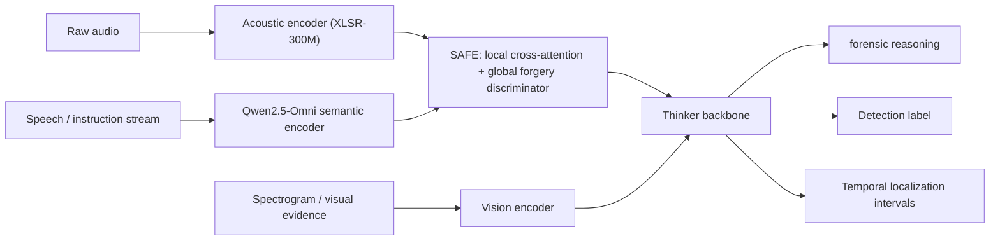
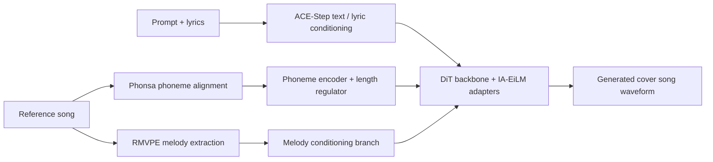
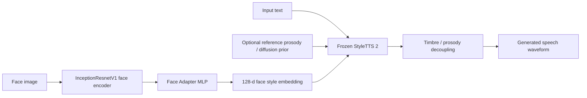
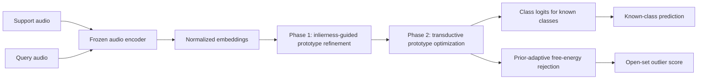
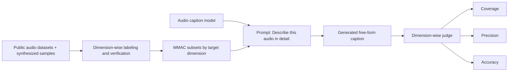

# 语音 / 音频 / 音乐论文速递
## 2026-07-30

> 实际对应 arXiv 更新日：**2026-07-30**  
> 检索范围：`cs.SD + eess.AS`  
> 只放按 ML 顶会审稿口径看，最值得多数读者花时间看的 **5 篇**

## 📋 总览

- 共收录 **5 篇** 相关论文
- 音频安全 / 取证：**1 篇**
- 语音生成 / 歌声生成：**2 篇**
- 评测 / Benchmark：**1 篇**
- 音频分类 / 小样本学习：**1 篇**

今天这批最值得看的是三条很不一样、但都很实在的线。第一条是 `ThinkOmni` 代表的“别再把音频取证全丢给隐式 embedding”路线，它把显式 forensic reasoning、检测和时间定位绑成了一个统一任务，而且跨数据集结果确实拉开了。第二条是生成侧的“把显式控制拿回来”：`MPEcho` 用音素级时间控制修复 cover song generation 的歌词失真，`Face-to-Speech` 则尝试把脸映射进 StyleTTS 2 的 style space，证明这件事不是纯噱头，但也顺手暴露了“脸对音色贡献其实没你想得那么大”。

第三条是评测与推理基础设施。`MMAC` 这篇不产更强模型，但它把 audio captioning 从“谁的 caption 更像参考答案”推进到“模型到底提没提到关键信息、提了有没有说对”。`ROLE` 则是另一种基础设施型论文：它不追求新 backbone，而是把 few-shot open-set audio classification 的 transductive inference 真正理顺，靠 episode-level prototype refinement 和 free-energy rejection 把开放集污染问题压住。

## 精选入选规则

- **新意（0-3）**：是不是提出了新的表示、接口、训练组织方式，或者把旧问题拆得更对
- **影响力（0-3）**：是不是贴近语音安全、语音生成、歌声、评测、音频分类这些主线
- **证据强度（0-2）**：有没有像样的 baseline、消融和关键数值
- **受众匹配度（0-2）**：对语音大模型 / 语音前端 / 音乐技术 / 音频安全研究者有没有直接启发

分数校准：

- **6**：可读，但更像局部补丁
- **7**：信息量够，值得过一遍
- **8+**：建议优先精读

## 总览表

| 方向 | 序号 | 论文 | 评分 | 关键词 |
|---|---:|---|---:|---|
| 音频安全 / 取证 | 1 | ThinkOmni | 8.5/10 | FACoT, forensic reasoning, omni-modal LLM, temporal localization |
| 音乐生成 / 歌声 | 2 | MPEcho | 8.5/10 | cover song generation, phoneme control, length regulator, Phonsa |
| 小样本音频分类 | 3 | ROLE | 8/10 | transductive inference, open-set, prototype refinement, free energy |
| 评测 / Benchmark | 4 | MMAC | 7.5/10 | audio captioning benchmark, coverage, precision, accuracy |
| 语音生成 / 人脸到语音 | 5 | Zero-Shot Face-to-Speech | 7.5/10 | face-to-speech, StyleTTS 2, latent alignment, cross-lingual transfer |

## 🛡️ 音频安全 / 取证

### [1] ThinkOmni: A Reasoning-Driven Omni-Modal LLM Framework for Audio Forgery Detection and Localization

- **评分**：8.5/10
- **作者/机构**：Yuxiong Xu, Kaiqing Lin, Bin Li, Haodong Li, Sheng Li；Shenzhen University，Afirstsoft Technology Group
- **论文链接**：https://arxiv.org/abs/2607.26553
- **PDF**：https://arxiv.org/pdf/2607.26553.pdf
- **代码链接**：**代码已开源** https://github.com/Beyond0814/ThinkOmni
- **Demo 链接**：https://beyond0814.github.io/ThinkOmni/

#### 📌 简介
这篇做的是部分音频伪造检测与时间定位，而且不是老一套“训个 SSL encoder 再挂个 locator”。作者把任务重写成带显式取证推理的 omni-modal LLM：模型不仅要判断真伪，还要说清楚哪一段有问题、依据是什么、时间边界在哪。

真正有料的地方不是套了个大模型壳，而是他们补了 `FACoT` 这个 **10 万条** forensic-aware CoT 数据集，并把 semantic、acoustic、spectral-visual 三路证据用渐进式训练串起来。对做 audio deepfake、音频取证、跨域鲁棒检测的人，这篇明显比“再换个 backbone 刷一遍 ASVspoof”更值得看。

#### ☠️ 毒舌点评
这篇不是“问答化包装”的空活。作者真把 reasoning supervision、boundary localization 和跨数据集泛化绑到了一起，结果也确实比纯 SSL 和通用 ALLM 基线硬。它的强点在于跨域，不在于把某个单一数据集分数挤到极限。

短板也别装看不见。它还是重度站在 `Qwen2.5-Omni` 这条现成大骨干上， reasoning 文本本身的人类主观评分还略输给 `Mixed` 变体，说明“会解释”不自动等于“解释得最好”。但就 audio forensics 这个方向来说，它已经比很多只会喊可解释性的论文实在得多。

#### 🔧 技术方案
- **模型解决的问题**：现有 AFDL 方法要么靠 SSL 特征学隐式伪造痕迹，跨数据集一换分布就塌；要么把任务改成 QA，但没有显式把 forensic evidence 和最终判断绑起来。`ThinkOmni` 要补的是真空地带：让模型在统一框架里同时做推理、检测和时间定位，而且在 unseen manipulation 上别直接失明。
- **模型架构**：
  - **输入**：原始音频、谱图视觉证据、文本指令，文中统一记为 multi-modal 输入 `X=(A,S,I)`。
  - **输出**：显式 forensic reasoning 序列、三分类检测标签 `c∈{fully real, fully fake, partially fake}`，以及时间戳区间序列。
  - **主干**：基于 `Qwen2.5-Omni` 的 omni-modal LLM，保留 semantic encoder、vision encoder 和 Thinker backbone。
  - **关键模块**：
    - `Acoustic Encoder`：补一条专门抓低层伪造痕迹的声学支路，补 semantic encoder 不擅长的 phase / jitter / boundary 信息。
    - `SAFE`：`Semantic-Acoustic Forensic Enhancer`，由 local cross-attention、global forgery discriminator 和 gated fusion 组成。
    - `FMIL`：`SFA -> AFA -> MFR` 三阶段 modality-incremental learning。
    - `FCML`：把 reasoning、检测、定位三任务用 weighted CE 和 localization loss 绑在一起。
- **信号流**：

- **关键设计 / 核心创新**：
  - `FACoT` 不是随便拼的解释文本，而是按低层声学异常、中层时间不连续、高层上下文不一致三个层级组织 reasoning。
  - `FMIL` 的核心不是“多模态一起训”，而是分阶段逐步对齐，避免视觉和声学支路一开始就把 semantic reasoning 搅乱。
  - `SAFE` 不是简单 concat，它一边做 token-level semantic-acoustic 对齐，一边做 sequence-level forgery summarization，再用 gate 融合。
- **训练 / 推理策略**：
  - `FACoT` 训练池包含 **100K** 样本，来自 `ASVspoof 2019 LA`、`HAD`、`PartialSpoof`、`LAV-DF`、`ArEnAV`、`LlamaPartialSpoof`、`SINE`、`AV-Deepfake1M++` 八个公开来源。
  - `SFA` 先学语义取证，`AFA` 再引入 acoustic encoder + SAFE，`MFR` 最后再补 vision encoder 做跨模态核验。
  - LoRA 设置为 `r=8`、`alpha=32`、`dropout=0.05`；每个 `FMIL` stage 训练 **1 epoch**，Thinker 学习率 `1e-4`，ViT / aligner 为 `1e-5`。
  - `FCML` 里 reasoning token 权重压到 `0.2`，检测类权重按 FACoT 类分布设为 `(0.36, 0.24, 0.40)`，定位 token 权重为 `0.6`，同时用 `IoU + SmoothL1` 做边界回归。
  - 推理时可显式输出 CoT，再给最终检测和定位；论文也专门做了 CoT / Mixed / ShuffCoT 的推理对照。

#### 📊 实验结果
- **检测结果**：
  - Intra-dataset 平均 `ACC/F1 = 93.70/93.72`，高于最强 SSL 基线 `W2V2-Conformer` 的 `92.51/92.58`。
  - Cross-dataset 平均 `ACC/F1 = 80.74/85.15`，明显高于最强 ALLM 基线 `Qwen2-Audio` 的 `76.17/77.76`，也远高于 SSL 基线 `W2V2-Conformer` 的 `46.72/50.41`。
  - `SF` 这种多伪造片段、强分布偏移场景上，`ThinkOmni` 的 `ACC/F1 = 82.61/89.35`，对比 `Qwen2.5-Omni-7B` 的 `62.05/72.14`，不是小修小补。
- **定位结果**：
  - Intra-dataset 平均 `mAP = 88.05`，高于 `Qwen2.5-Omni-7B` 的 `83.69` 和 SSL 最强 `BAM` 的 `79.94`。
  - Cross-dataset 平均 `mAP = 74.67`，对比 `Qwen2-Audio` 的 `59.35`、`TDL` 的 `30.94`，优势非常明显。
  - 在最难的 `SF` 上，`ThinkOmni` 仍有 `74.98 mAP`；`Qwen2.5-Omni-3B` 只有 `12.08`，说明纯文本边界 token 生成在复杂多片段伪造上确实不够细。
- **消融**：
  - `Base data -> +CoT -> +CLAP -> ThinkOmni`，cross-dataset `mAP` 从 `55.91 -> 60.27 -> 63.35 -> 74.67`，每一步都不是摆设。
  - `Joint training` 的 cross `mACC/mF1/mAP` 是 `71.22/75.16/70.72`，而完整 `ThinkOmni` 到了 `80.74/85.15/74.67`，说明 `FMIL` 的渐进式对齐比一锅炖稳。
  - 推理文本质量上，`Mixed` 的 human score `4.2833` 略高于 `ThinkOmni` 的 `4.1667`，说明最终系统优先优化了 forensic 任务表现，不是单纯追求“解释写得像人”。

#### 💡 为什么值得看
这篇最值得看的不是又一个 “audio LLM for deepfake” 标题，而是它把显式 forensic reasoning 真的变成了可训练、可验证、可提升跨域定位性能的中间对象。对做音频安全的人，这比再换一个大 encoder 刷榜更接近下一阶段该做的事。

## 🎤 语音生成 / 歌声生成

### [2] MPEcho: A Melody and Phoneme-Aware Generative Framework for Controllable Cover Song Generation

- **评分**：8.5/10
- **作者/机构**：Wei-Jaw Lee, Hsuan-Yu Yeh, Ting-Yi Hu, Chih-Pin Tan, Fang-Duo Tsai, Yi-Hsuan Yang；National Taiwan University，Taiwan AI Labs
- **论文链接**：https://arxiv.org/abs/2607.26698
- **PDF**：https://arxiv.org/pdf/2607.26698.pdf
- **代码链接**：**代码已开源** https://github.com/YatingMusic/MPEcho
- **Demo 链接**：https://lonian6.github.io/MPEcho.github.io/

#### 📌 简介
这篇做的是可控 cover song generation，核心观点很直接：`SongEcho` 只靠 `F0 + V/UV` 去控旋律，歌词层面的约束太粗，所以生成出来经常旋律还行、歌词乱飞。`MPEcho` 的办法是把 SVS 里那套音素级时长控制搬进 full-song generation，用 phoneme encoder 和 length regulator 把歌词时间边界钉死。

更关键的是它不是只在方法图上画了个音素分支，而是顺手补了 `Phonsa` 这个针对歌声的自动音素转写器，把训练和推理阶段需要的音素级边界真正补齐了。对做歌声生成、LTS、cover song 的人，这篇是很实用的控制论文。

#### ☠️ 毒舌点评
这篇不是革命性新模型，底座仍然是 `ACE-Step` / `SongEcho` 这套 diffusion generation 体系。但它抓住了一个真正痛点：很多 cover generation 系统其实不是不会唱，而是不会把歌词唱对。这个问题不解决，其他 prompt、音色、编曲控制都很像往歪楼上贴金。

缺点也很明显。它还是大量依赖内部中文数据，很多指标来自代理评测器和自动转写；而且 melody 与 phoneme 控制之间有真实冲突，说明底座并没有被完全驯服。可即便如此，这篇仍然比“再加一个更大音色模型”更有实际启发。

#### 🔧 技术方案
- **模型解决的问题**：cover song generation 既要保留参考曲的旋律和歌词结构，又要重新合成完整伴奏和歌声。已有 `SongEcho` 只用 `F0` 和 `V/UV` 当条件，歌词时间结构太粗，导致音素错位和歌词错误。`MPEcho` 要补的是音素级精细控制。
- **模型架构**：
  - **输入**：文本 prompt、歌词、参考歌曲中提取的 melody 条件、以及由 `Phonsa` 得到的音素和时长边界。
  - **输出**：带完整伴奏和歌声的 cover song 音频。
  - **主干**：以 `ACE-Step` 的 `DiT` 式 LTS backbone 为底座，继承 `SongEcho` 的 melody conditioning 和 `IA-EiLM` 适配器。
  - **关键模块**：
    - `Phoneme Encoder`：编码音素序列。
    - `Length Regulator`：把音素时长展开成时间对齐条件。
    - `RMVPE`：提取 vocal melody。
    - `Phonsa`：Whisper-based 歌声音素级转写与对齐模块。
    - `Multi-condition Guidance`：把文本、歌词、时变控制拆成独立 guidance scale。
- **信号流**：

- **关键设计 / 核心创新**：
  - 把 `SVS` 那套音素时长控制正式引入 `CSG`，而不是继续用 `V/UV` 这种非常粗的弱提示。
  - `Phonsa` 不只是辅助工具，它是让 phoneme conditioning 能大规模落地的前提，因为公开 full-song 音素时间标注几乎没有。
  - `MC` guidance 把文本、歌词、时变控制拆开调，避免多条件一起拉时互相打架。
- **训练 / 推理策略**：
  - `Phonsa` 训练用公开 Mandarin 歌声数据 `M4Singer`、`Opencpop`，测试用 `GTsinger`；训练 / 验证 / 测试音频总时长分别为 `30.92h / 1.64h / 16.54h`。
  - `MPEcho` 自己用内部中文 lyrics-song 数据，**13,045 tracks / 约 1,427 小时**；训练集 `12,914` 首，测试 `131` 首。
  - `Phonsa` 用单张 `RTX 3090` 训练，采用 `CTC + CE` 多任务目标；chunked self-attention 4 heads、chunk size `500` 帧、50% overlap，训练 `24k steps`。
  - `MPEcho` 在单张 `RTX PRO 6000` 上训练到 `50k steps`，AdamW 学习率 `1e-4`，weight decay `0.01`，batch size 1 累积到 32。
  - 推理时对比了 `N`、`SE`、`MC` 三种 guidance；最终主观最好的是 `MC(15.0, 7.5, 5.0)`。

#### 📊 实验结果
- **Phonsa 对齐效果**：
  - 对比 `MFA`，`Phonsa` 把对齐 `MAE` 从 **233.9 ms** 降到 **32.6 ms**。
  - 无监督 segmentation 指标达到 `FA=0.849`、`BD F1=0.534`。
  - 去掉 boundary token 或退回 RNN backbone 都会掉，说明它不是“换个 Whisper 就结束”。
- **MPEcho 主结果**：
  - `SongEcho` 的 `PER=0.4562`，`MPEcho (M+P)` 把 `PER` 压到 **0.1865**。
  - 同时保持 melody 指标：`RPA/RCA = 0.5764/0.5846`，没有像纯 phoneme-only 条件那样把旋律质量一起拖死。
  - 纯 phoneme 条件虽然把 `PER` 压到 `0.2292`，但 `Audiobox` 四项质量分明显掉，说明“只盯歌词”会毁音乐性。
  - `JAM-style` 音素表示的 `PER=0.7125`，比 `SongEcho` 还糟，作者对“结构清晰的条件比粒度更重要”这个结论给了相当硬的证据。
- **推理策略和主观结果**：
  - `MC(15.0, 7.5, 5.0)` 的 `RPA/RCA = 0.6241/0.6344`，`PER=0.1793`，是几种 guidance 里最平衡的一组。
  - 25 位听众主观评分中，`M+P (MC)` 的 `OA=3.57`，高于 `SongEcho` 的 `2.92` 和 `M+P (SE)` 的 `3.21`。
  - `VN` 从 `SongEcho` 的 `2.80` 提到 `3.59`，说明这不是只改善对齐，不顾听感。

#### 💡 为什么值得看
如果你做歌声、cover song 或者长时音乐生成，这篇最值得看的地方不是“指标涨了多少”，而是它把 `歌词准确性` 这个经常被忽视、却极影响最终观感的问题正面拆开了。很多 full-song generation 论文都在卷更大底座，但这篇提醒你，条件结构本身没设计好，底座再大也会唱歪。

### [3] Zero-Shot Face-to-Speech Synthesis via Latent Space Adaptation of a Style-Diffusion TTS Model

- **评分**：7.5/10
- **作者/机构**：Carlos Muñoz-Romero, Jose A. Gonzalez-Lopez；Universitat Oberta de Catalunya，Monoceros Labs，University of Granada
- **论文链接**：https://arxiv.org/abs/2607.26742
- **PDF**：https://arxiv.org/pdf/2607.26742.pdf
- **代码链接**：暂无。文中写明代码与样例计划在论文接收后提供。
- **Demo 链接**：暂无

#### 📌 简介
这篇做的是 `Face-to-Speech`：当没有参考语音时，只靠一张人脸图像去生成“合理且一致”的声音。作者没有从头训一个 TTS，而是选择更保守、也更聪明的路线：冻结 `StyleTTS 2` 当声学老师，只训练一个人脸到 style latent 的适配器，再对 face encoder 的高层做 soft tuning。

论文最有意思的地方在于它没把问题包装成“完美重建真实声音”，而是明确承认脸和声音只是弱相关，所以目标是生成 plausible、coherent 的 voice identity。这个定位比很多夸张的 face-voice 论文靠谱。

#### ☠️ 毒舌点评
这篇不是纯噱头。它至少知道不要跟脸和声音的弱相关性硬碰硬，所以才选了 frozen teacher + latent alignment 这条风险更低的路。自然度代理分也确实不错，英文上 `UTMOS 3.7-4.0` 已经不差。

但别被“从脸生成声音”这个 headline 冲昏头。论文自己也承认脸对最终 identity 的净贡献是 **modest**，多数绝对 identity 仍来自 `StyleTTS 2` prior。再加上没有 human MOS/AB、Spanish 用私有语料、代码未公开，这篇更像很体面的 proof-of-concept，而不是一条已经成熟的生产路线。

#### 🔧 技术方案
- **模型解决的问题**：传统 zero-shot TTS 仍然需要几秒参考音频，但历史人物、虚拟角色、NPC 之类根本没有现成 voice prompt。`F2S` 要解决的是：只从静态人脸图像推一个合理的 speaker style，然后借助强 TTS teacher 说话。
- **模型架构**：
  - **输入**：单张人脸图像；推理时还可选文本和参考 prosody。
  - **输出**：目标文本对应的语音波形，以及 face-conditioned style embedding。
  - **主干**：`InceptionResnetV1 face encoder + Face Adapter + frozen StyleTTS 2 teacher`。
  - **关键模块**：
    - `Face Encoder`：`InceptionResnetV1`，在人脸识别空间抽 512 维身份特征。
    - `Face Adapter`：`512 -> 1024 -> 1024 -> 128` 的 MLP，把视觉身份投到 `StyleTTS 2` 的 style space。
    - `Style Encoder`：冻结，用真实音频给训练目标 style。
    - `Inference-time decoupling`：把 timbre 和 prosody 分开混合，通过 `α/β` 控制 identity-naturalness 取舍。
- **信号流**：

- **关键设计 / 核心创新**：
  - 不去动 TTS teacher，而是把学习重点压在人脸到 style latent 的对齐上，风险更可控。
  - 用 `InfoNCE + RKD + variance regularization + demographic auxiliary heads` 约束 face-voice latent，尽量减少 mode collapse。
  - `α` 显式控制 face-derived timbre 与 diffusion prior 的混合比例，让系统承认“identity 与 naturalness 有 trade-off”。
- **训练 / 推理策略**：
  - 英文侧用 `LRS3`，经质量过滤后留下 **14,170** 对 face-audio 样本、**2,007** 位说话人。
  - Spanish 侧不训练 face adapter，只把 frozen `StyleTTS 2` backbone 在私有多说话人 Spanish corpus 上微调，包含 **53,336** 句、**48** 位说话人。
  - 训练在 `A100` 上进行，AdamW 学习率 `2e-3`，训练 **200 epochs**；通过 balanced sampler 保证每 batch 每人 `K=4` 个样本。
  - 只 soft-tune face encoder 的上层块，总可训练参数约 **20M**，其中 adapter 约 **1.7M**。
  - 推理时 `α` 越低越保留 face identity，越高越向 diffusion prior 靠拢；论文默认把 `α=0.5` 当平衡点。

#### 📊 实验结果
- **未见身份检索 / 一致性**：
  - 在 **24** 位完全未见 `LRS3` 说话人上，chance `Top-1/Top-5` 仅 `4.17% / 20.8%`。
  - 最佳英文配置的 `Top-1/Top-5 = 9.3% / 39.2%`，说明确实有弱但真实的 biometric signal。
  - `SECSemb` 大约在 `0.40-0.42`，而冻结 face encoder 的 ablation 只有 `0.29`，说明 soft-tuning 高层是有效的。
- **对比基线 / prior work**：
  - 论文明确拿 prior end-to-end F2S 系统作对比：`FVTTS` 报告 `SECSaudio 0.754`，`Face-TTS` 报告 `0.748`。
  - 作者同时强调这不是严格同协议 baseline，因为他们冻结了 `StyleTTS 2` 声学老师，只适配 face 侧，所以这组对比更多说明“当前路线在 identity 上还没追平 fully end-to-end F2S”。
- **自然度与音色代理指标**：
  - 英文配置 `UTMOS` 达到 `3.72-3.98`，`NISQA` 达到 `3.84-4.22`；ground truth 英文音频的 `UTMOS/NISQA = 3.61/3.63`。
  - `SECSaudio` 大约 `0.61-0.62`，说明 identity 有保留，但并没有到强克隆级别。
  - Spanish zero-shot cross-lingual 下 `SECSaudio` 稳在 `0.57`，`UTMOS` 在 `2.67-2.88`，至少表明 face-to-style 映射没有完全绑定英文。
- **trade-off 结果**：
  - `α=0.3` 时 `SECSaudio` 最高到 `0.64`，但 `UTMOS` 只有 `2.66`。
  - `α=0.7` 时 `UTMOS` 升到 `4.17`，`SECSaudio` 则降到 `0.57`。
  - 这组结果很诚实地说明：系统的确能控 identity-naturalness trade-off，但“脸决定声音”的幅度并不大。

#### 💡 为什么值得看
这篇最值得看的是它对问题边界的处理很成熟。它没有假装脸和声音是一一对应，而是把任务降成 latent alignment + strong TTS prior 下的 plausible voice generation。对做虚拟角色配音、无参考音色生成的人，这种“保守但能落地”的思路比花哨的 end-to-end 大模型更有现实意义。

## 🎧 小样本音频分类 / 前端推理

### [4] Few-Shot Open-Set Audio Classification via Transductive Prototype Refinement and Class Logit Enhancement

- **评分**：8/10
- **作者/机构**：Tianyan Deng, Yanxiong Li, Rui Gao, Jiahao Du；South China University of Technology
- **论文链接**：https://arxiv.org/abs/2607.26607
- **PDF**：https://arxiv.org/pdf/2607.26607.pdf
- **代码链接**：**代码已开源** https://github.com/Gostyan/ROLE
- **Demo 链接**：暂无

#### 📌 简介
这篇解决的是很具体但很难绕开的现实问题：few-shot audio classification 到线上后，query 里一定会混入 support set 之外的未知类。传统 transductive few-shot 方法喜欢把整个 query set 都拿来修 prototype，但一旦 unknown sample 混进来，prototype 就会被污染。

`ROLE` 的思路很干脆：先在 episode 内给每个 query 一个 latent inlierness 分数，把可能是 unknown 的样本权重压下去，再用 prior-adaptive free-energy 去做 decoupled rejection。它不搞 episodic meta-training，不改 backbone，只在 episode inference 阶段动 prototype。

#### ☠️ 毒舌点评
这篇标题看着有点长，但方法其实很克制，优点也是克制。它没去发明一个更大的 audio encoder，也没搞复杂的训练 pipeline，而是把 open-set transductive inference 里最关键的两件事做好了：别让 outlier 污染 prototype，别拿同一个 softmax 同时做分类和拒识。

缺点是范式上不算炸裂，更多是“把已有零件接对了”。如果你只追求新 backbone 或大模型叙事，这篇可能显得不够花。但从实用性和 ablation 的干净程度看，这反而是它的强项。

#### 🔧 技术方案
- **模型解决的问题**：few-shot open-set audio classification 同时要完成两件事：给已知类 query 分类，以及把未知类 query 拒掉。transductive 设置下虽然能看完整个 unlabeled query set，但 unknown sample 会污染 prototype；只用单一 softmax 又很难表达“这些都不是”。
- **模型架构**：
  - **输入**：support/query 音频波形，经过 frozen pretrained audio encoder 后的归一化 embedding。
  - **输出**：已知类标签预测，以及每个 query 的 outlier score。
  - **主干**：`frozen audio encoder + episode-specific prototype inference`。
  - **关键模块**：
    - `Phase 1`：latent inlierness-guided prototype refinement。
    - `Phase 2`：prototype optimization with ξ-weighted transductive losses。
    - `Prior-adaptive free-energy score`：把拒识阈值跟 outlier prior 绑定。
    - `Decoupled scoring`：分类与拒识不共用一套 coupled softmax。
- **信号流**：

- **关键设计 / 核心创新**：
  - `ξ-gate` 用 latent inlierness 控制 query 对 prototype 的贡献，这比硬 pseudo-label 更稳。
  - 拒识不是靠“softmax 最大值够不够大”，而是用 decoupled free-energy score，把 unknown detection 从 known-class normalization 里拆出来。
  - outlier prior `b` 直接进推理规则，这在 20% / 50% / 80% contamination 切换时尤其重要。
- **训练 / 推理策略**：
  - 这是 **training-free transductive inference** 路线：只依赖 frozen pre-trained encoder，不做 episodic meta-training，也不 fine-tune backbone。
  - 数据集为 `ESC-50`、`FSD-Kaggle2018`、`UrbanSound8K`。
  - 评测 episode 统一是 `5-way` open-set，分别做 `1-shot` 和 `5-shot`。
  - 每个 inlier 类贡献 4 个 query；outlier 类按 `20% / 50% / 80%` 比例贡献 `1 / 4 / 16` 个 query，query set 大小分别为 `25 / 40 / 100`。
  - 每个配置每个 fold 采样 **300** 个 episodes，总计 **1,500** 个 episodes。

#### 📊 实验结果
- **宏平均结果**：
  - `ROLE` 的 macro `AUROC` 在 `1-shot/5-shot` 下分别是 **85.88 / 92.22**。
  - 对比最强 inductive baseline `MET` 的 `81.15 / 90.26`，分别提升 `4.73` 和 `1.96` 个点。
  - `AUPR` 也达到 `82.29 / 89.50`，高于 `MET` 的 `78.89 / 87.90`。
- **分数据集 / 高污染设置**：
  - 在 `ESC-50`、`80% outlier`、`1-shot` 条件下，`ROLE AUROC = 98.00`，高于 `MET` 的 `94.47`。
  - 在 `FSD-Kaggle2018`、`80% outlier`、`1-shot` 条件下，`ROLE AUROC = 88.88`，高于 `MET` 的 `80.51`。
  - `20% outlier`、`1-shot` 时 `OSLO` 仍在三个数据集上领先，说明 contamination 不高时 prototype refinement 自身就很强，`ROLE` 的 decoupled rejection 优势没完全释放，这个结论比较诚实。
- **消融**：
  - 完整 `ROLE` 在 `ESC-50 + FSD-Kaggle2018` 汇总 ablation 上是 `AUROC 93.82 ± 0.16`。
  - 去掉 `ξ-gate` 直接跌到 **71.77 ± 0.29**，是全篇最大的退化。
  - 去掉 `b-prior` 变成 `89.83 ± 0.15`，说明 prior-adaptive threshold 不是装饰件。
  - 去掉 `Phase 2` 还有 `92.53 ± 0.17`，说明 Phase 1 的 prototype 防污染是最核心的收益来源。

#### 💡 为什么值得看
这篇最值得看的地方是，它把一个很常见但经常被忽略的工程坑讲透了：开放集下 transductive inference 的 query 并不是天然有益，先做“谁可能是已知类”的筛选比盲目全量利用更关键。对做 few-shot audio、边缘设备音频识别、开放集 KWS 的人，这篇很有复用价值。

## 🧪 评测 / Benchmark

### [5] MMAC: A Massive Multi-dimensional Benchmark for Audio Captioning

- **评分**：7.5/10
- **作者/机构**：Weijie Wu, Junbo Li, Lin Li, Jun Fang, Qingyang Hong；Xiamen University，DiDi Global
- **论文链接**：https://arxiv.org/abs/2607.27109
- **PDF**：https://arxiv.org/pdf/2607.27109.pdf
- **代码链接**：暂无。文中写明 benchmark 与 evaluation code 将公开，但当前正文未给出仓库地址。
- **Demo 链接**：暂无

#### 📌 简介
这篇不是再做一个 captioning model，而是问一个更基础的问题：现在大家都说 AudioLLM 能写“更详细”的 caption，可现有评测大多只看生成质量或和参考描述像不像，根本分不清模型是没提到关键信息，还是提了但说错了。`MMAC` 的目标就是把 detailed audio captioning 拆成更细的诊断问题。

它把评测拆成 **6 个 capability categories、15 个 fine-grained dimensions**，并明确区分 `Coverage / Precision / Accuracy`。这套设计不算 flashy，但对于整个 audio captioning 方向来说，是很必要的一次“别再拿单一总分糊弄”的纠偏。

#### ☠️ 毒舌点评
这篇的价值不在模型创新，而在评测口径终于像样了一点。现在很多音频 caption 论文明明只会写一段大而泛的描述，却能靠表面 fluency 拿到不错的印象分。`MMAC` 至少把这层遮羞布掀开了。

不过它也不是没有坑。评测器本身用的是 `Qwen3.6-27B`，人类评估还用了带预标注的流程，作者自己都承认可能有 anchoring bias。换句话说，这篇 benchmark 很有用，但它还没到“可以当绝对裁判”的程度。

#### 🔧 技术方案
- **模型解决的问题**：free-form audio captioning 需要的不只是“句子像不像参考答案”，而是模型有没有覆盖目标信息、描述是否可靠、在不同维度上具体差在哪。`MMAC` 就是为这个诊断缺口设计的 benchmark。
- **模型架构**：
  - **输入**：音频片段，以及模型生成的 free-form caption。
  - **输出**：针对目标维度的 `Coverage`、`Precision`、`Accuracy` 分数。
  - **主干**：不是生成模型，而是一套 benchmark construction + dimension-wise evaluation pipeline。
  - **关键模块**：
    - `6 capability categories`：Content、Background、Persona、Paralinguistic、Dynamic、Implication。
    - `15 fine-grained dimensions`：覆盖 spoken content、acoustic scene、speaker attributes、风格、时间变化、隐含含义等。
    - `Label construction and verification`：原始标签、人审、声学测量、感知标注。
    - `LLM judge`：用统一规则打分 free-form caption。
- **信号流**：

- **关键设计 / 核心创新**：
  - 它不要求每条 caption 覆盖所有维度，而是每个 subset 只查目标维度，避免“越写越长越容易蒙对”。
  - `Coverage` 和 `Precision` 分开报，能把“没说”和“说错”区分开。
  - `Implication` 和 `Dynamic` 维度用了额外的文本生成、语音合成、音频拼接等构造流程，专门覆盖自然资源难采的场景。
- **训练 / 推理策略**：
  - `MMAC` 总计 **5,638** 个 audio clips、**13.04 小时**，来自 **20+** 个公开来源及合成样本。
  - 模型统一使用提示词 `Describe this audio in detail.`，不允许花式 prompt tuning；`Qwen3-Omni-Captioner` 因接口限制除外。
  - 除 API 模型外，本地推理统一在 **8×A100 80GB** 上完成。
  - 评测端用 `Qwen3.6-27B` 做 judge；候选标签由 `Gemini 3.1 Pro`、`Qwen3-Omni` 和人工标注员共同核验与修订。

#### 📊 实验结果
- **数据规模**：
  - `Content 1000` 条、`Background 981` 条、`Persona 1000` 条、`Paralinguistic 1198` 条、`Dynamic 615` 条、`Implication 844` 条。
  - 总规模 **5638 clips / 13.04h**，这在 audio caption benchmark 里已经不算小。
- **主结果表**：
  - 对比模型 / baseline 覆盖了 `Gemini 2.5 Pro`、`Qwen3-Omni-Captioner`、`Qwen3-Omni-Instruct`、`Gemini 2.5 Flash`、`Qwen2.5-Omni-7B`、`AF-Next-Captioner`、`Gemini 3.5 Flash`、`MiDashengLM-7B`。
  - `Gemini 2.5 Pro` 的 `Accuracy / Precision / Coverage = 46.85 / 59.39 / 75.31`，在 Accuracy 和 Precision 上第一。
  - `Qwen3-Omni-Captioner` 的 `45.62 / 52.40 / 84.15`，Coverage 第一，但 Precision 明显掉一截。
  - `Qwen3-Omni-Instruct` 为 `42.96 / 54.22 / 78.90`，说明 captioning-oriented supervised fine-tuning 并不自动提升可靠性。
  - `Qwen2.5-Omni-7B` 只有 `33.60 / 50.92 / 51.22`，比头部模型差得很明显。
- **评测稳定性**：
  - 在按 fine-grained dimension 分层采样的 **10% 子集** 上，四个 LLM judges 与人工评估给出的 ranking 高度一致。
  - 五种 ranking 的 Kendall 一致性系数达到 **W = 0.981**，说明 MMAC 至少在“谁比谁强”这件事上相当稳定。
- **分析结论**：
  - `Qwen3-Omni-Captioner` 比 `Qwen3-Omni-Instruct` 覆盖更广，但 Precision 不稳，说明 supervised fine-tuning 更容易把模型推向“多说”，不一定推向“说准”。
  - 作者还专门控制了 `Gemini 2.5 Pro` 的 caption 长度，发现 **caption 越长 Coverage 越高，但 Precision 反而下降**。这条结论很重要，因为它直接打脸“越详细越好”的朴素直觉。

#### 💡 为什么值得看
如果你做 audio captioning、audio QA 或 audio LLM 评测，这篇最值得看的不是榜单，而是它把“模型说得多”和“模型说得对”拆开了。很多现有工作被更长、更泛、更像人话的描述迷惑了，这篇 benchmark 至少提供了一把能把这些假强项撬开的尺子。

## 最后结论

今天最值得优先看的顺序，我会给成下面这样：

1. `ThinkOmni`：如果你关心 audio deepfake、跨域鲁棒检测、显式 reasoning，这篇是今天信息量最大的。
2. `MPEcho`：如果你做歌声生成、cover generation 或 controllable music generation，这篇对“歌词为什么老出错”给了很硬的修法。
3. `ROLE`：如果你做小样本开放集音频分类，这篇方法不花，但非常干净，属于看完就能迁到自己任务上的那类。
4. `MMAC`：如果你在做 audio captioning 评测，这篇值得读；如果你只关心生成模型结构，可以放后面。
5. `Zero-Shot Face-to-Speech`：点子有意思，实验也不糊弄，但目前更像审慎的 proof-of-concept，别把它看成已经解决了“从脸推音色”。

一句话收束：今天最强的主线不是“更大的 audio model”，而是“把结构化控制和结构化证据重新带回系统里”。生成侧是显式音素和时长控制，安全侧是显式 forensic reasoning，评测侧是显式维度诊断。这个方向比单纯堆参数更值得盯。
