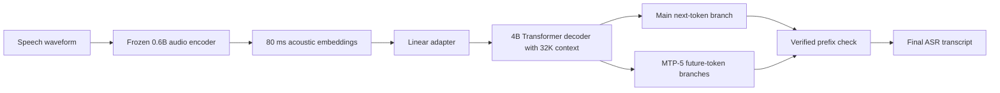
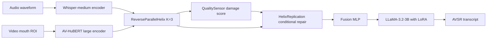
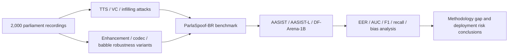
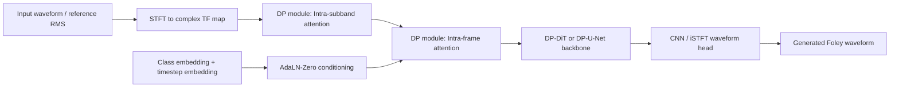
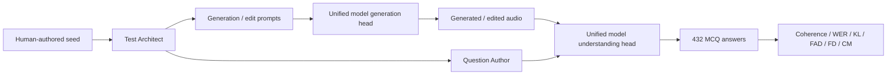

# 语音 / 音频 / 音乐论文速递
## 2026-08-03

> 实际对应 arXiv 更新日：**2026-08-03**  
> 检索范围：`cs.SD + eess.AS`  
> 只放按 ML 顶会审稿口径看，最值得多数读者花时间看的 **5 篇**

## 📋 总览

- 共收录 **5 篇** 相关论文
- 语音识别 / 语音大模型：**2 篇**
- 语音安全 / 深伪检测：**1 篇**
- 音频生成 / 统一音频模型评测：**2 篇**

今天这批真正值得先看的，不是“谁又做了一个统一音频大模型”，而是三条更硬的线。`ParaASR` 把 LLM-ASR 最烦人的延迟问题拆开了：不牺牲 4B decoder 的语言能力，却靠可验证的 multi-token prediction 把 `RTF` 压到 `0.0053`。`DoubleHelix` 说明 AVSR 的提升不一定靠堆更大的 decoder，同一套 `Whisper + AV-HuBERT + LLaMA-3.2-3B` 主干，只要把融合从一次性交互改成迭代式修正，干净集和噪声集都还能再抠出实打实的 `WER`。`ParlaSpoof-BR` 则是很少见的“比模型论文更该看”的 benchmark：它把政治语音深伪、局部篡改、区域口音、压缩链路都放进同一个现实场景里，结果是现成 detector 大面积翻车。

剩下两篇是偏子方向但并不水。`DP-Foley` 不是 foundation model 叙事，而是很老实地回答“轻量 waveform diffusion 能不能既省参数又把时间对齐做好”；`TORUS` 也不是造模型，而是给统一音频模型补了一刀很应该有的体检：你既然说自己又能生成又能理解，那两颗头到底认不认同同一段自己生成的音频？

## 精选入选规则

- **新意（0-3）**：是不是提出了新的表示、接口、训练组织方式，或者把旧问题拆得更对
- **影响力（0-3）**：是不是贴近语音大模型、ASR、深伪检测、音频生成、统一音频模型这些主线
- **证据强度（0-2）**：有没有像样的 baseline、消融和关键数值
- **受众匹配度（0-2）**：对语音大模型 / 语音安全 / 音频生成 / 音频系统研究者有没有直接启发

分数校准：

- **6**：能读，但更像局部工程补丁
- **7**：信息量够，值得过一遍
- **8+**：建议优先精读

## 总览表

| 方向 | 序号 | 论文 | 评分 | 关键词 |
|---|---:|---|---:|---|
| 语音识别 / 语音大模型 | 1 | ParaASR | 8.5/10 | multi-token prediction, long-context ASR, 4B decoder, low latency |
| 语音识别 / 多模态融合 | 2 | DoubleHelix | 8/10 | AVSR, iterative fusion, quality-aware repair, LLaMA |
| 语音安全 / 深伪检测 | 3 | ParlaSpoof-BR | 8/10 | political deepfake, bias audit, partial manipulation, robustness |
| 音频生成 | 4 | DP-Foley | 7.5/10 | waveform diffusion, Foley, dual-path attention, lightweight |
| 统一音频模型评测 | 5 | TORUS | 7.5/10 | unified audio model, self-coherence, benchmark, render-understand gap |

## 🤖 语音识别 / 语音大模型

### [1] ParaASR: Multi-Token Prediction for Fast and Long-Context LLM-Based Speech Recognition

- **评分**：8.5/10
- **作者/机构**：Qingjian Lin 等；StepFun、NTU、PKU、UNSW、SJTU、USTC
- **论文链接**：https://arxiv.org/abs/2607.29279
- **PDF**：https://arxiv.org/pdf/2607.29279.pdf
- **代码链接**：暂无
- **Demo 链接**：暂无

#### 📌 简介
这篇盯住的是 LLM-ASR 最现实的一刀：decoder 越大，识别质量通常越稳，但服务延迟也会被逐 token 解码拖死。`ParaASR` 不去改 encoder，不去发明新 token，而是把 `multi-token prediction` 做成一个对 ASR 安全的“可验证前瞻解码”机制，让 4B decoder 维持质量，同时把长音频和低延迟一起兼顾。

#### ☠️ 毒舌点评
这不是范式级新模型，更像把 speculative decoding 真正掰到 ASR 场景里做实用化。但它比很多“端到端大模型 ASR”论文靠谱，因为作者没有拿 latency 当口号，而是把 `RTF`、长上下文、接受长度、ablation 一起交代清楚。做工业 ASR 的人值得优先看，做纯学术 SOTA 排行的人也别嫌它不花哨，这种东西才更接近能落地的增量。

#### 🔧 技术方案
- **模型解决的问题**：LLM decoder 给 ASR 带来了更强的语言建模，但严格自回归导致推理成本随 decoder 规模线性恶化，长音频更容易爆出分段拼接误差。`ParaASR` 解决的是“4B 级 decoder 能不能既保住识别率，又别把服务延迟搞成灾难”。
- **模型架构**：
  - **输入**：语音波形经冻结的 `0.6B` audio encoder 抽成每 `80 ms` 一个 acoustic embedding。
  - **输出**：文本转写结果。
  - **主干**：标准 `encoder-adapter-decoder`，其中 decoder 是原生 `32K context` 的 `4B dense Transformer`。
  - **关键模块**：
    - `Linear adapter`：把 acoustic embedding 投到 LLM hidden space。
    - `MTP-5`：5 个 future-token 分支，单步最多提出 6 个 transcript token。
    - `Verified prefix admission`：一旦未来 token 和主路径不一致，后续 proposal 立即截断，回到普通自回归。
    - `Long-form data pipeline`：`VAD -> multi-system ASR -> ROVER -> 质量过滤 -> session 级 LLM 修正`。

- **关键设计 / 核心创新**：
  - 把 `MTP` 定义成“加速模块”而不是新的识别目标，未来 token 只用于 proposal，不直接改写最终转写。
  - `5` 个 lookahead 分支共享 embedding 和 output head，保证 proposal 分布和主自回归路径一致。
  - 长音频 supervision 不是直接拿伪标签糊上去，而是用 `ROVER` 做多系统投票，再用 session 级 LLM 修复术语一致性。
- **训练 / 推理策略**：
  - 继承的 audio-language pretraining 覆盖 `1.356T` text/audio tokens，分成 speech-text alignment、audio-token extension、unified multimodal pretraining、cooldown/capability expansion 四阶段。
  - ASR SFT 使用约 `100K` 小时短语音和 `50K` 小时长语音伪标注数据；audio encoder 全程冻结，训练 adapter 和 decoder。
  - MTP 采用两阶段训练：先只训新加的 MTP blocks，再和 adapter + decoder 联合校准。
  - 推理时单步提出 `6` 个 token，只接纳经主路径验证通过的前缀；原生 `32K` context 支持单次处理最长约 `30` 分钟音频。
  - 推理性能在单张 `H800` 上测得 `RTF 0.0053`；文中未给显存占用。

#### 📊 实验结果
- 主要 baseline：`VibeVoice-ASR`、`FunASR-Nano`、`Doubao-ASR-2603`、`Qwen3-ASR-1.7B`
- 中文集：
  - 平均 `CER` 从 `Qwen3-ASR-1.7B` 的 `3.17%` 降到 `2.97%`
  - `AISHELL-1` 做到 `0.71%`，明显好于 `FunASR-Nano 1.88%` 和 `Qwen3-ASR-1.7B 1.49%`
  - `FLEURS zh` 为 `2.63%`
- 英文集：
  - 平均 `WER` 为 `3.68%`，优于 `Qwen3-ASR-1.7B 3.85%`
  - `LibriSpeech clean` 达到 `1.38%`
  - `VoxPopuli cleaned AA` 为 `2.76%`
  - 但 `Common Voice v11 en` 上 `7.57%` 只比 `Qwen3-ASR-1.7B 7.50%` 略差，说明泛化并不是全表碾压
- 长音频：
  - 平均长语音错误率 `3.70%`，优于 `Qwen3-ASR-1.7B 4.20%`
  - `LibriSpeech clean long / other long` 为 `1.27% / 2.90%`
  - `Earnings22 cleaned AA` 为 `6.52%`
- 速度与消融：
  - `RTF 0.0053`，快于 `Qwen3-ASR-1.7B 0.0094`，也远快于 `FunASR-Nano 0.0591`
  - `MTP-5` 的平均接纳长度达到 `5.0 / 6`
  - 加上 `MTP-5` 后，中文/英文/长语音平均误差波动分别只有 `0.00 / +0.04 / +0.06`，说明它基本没把质量换成速度

#### 💡 为什么值得看
如果你在做 LLM-based ASR，这篇最有价值的不是单个榜单数字，而是它把“更大的 decoder”和“更快的服务”从对立项变成了可兼得项。很多人嘴上说要做工业可用的大模型识别，真到延迟和长上下文就开始切 chunk、拼 heuristic，这篇至少给了一个更干净的主线。

### [2] DoubleHelix: Structured Cross-Modal Fusion for Audio-Visual Speech Recognition with LLMs

- **评分**：8/10
- **作者/机构**：Ziwei Cheng, Zhenhua Tan, Zhuomin Zhu；东北大学软件学院
- **论文链接**：https://arxiv.org/abs/2607.29112
- **PDF**：https://arxiv.org/pdf/2607.29112.pdf
- **代码链接**：暂无
- **Demo 链接**：暂无

#### 📌 简介
这篇做的是 LLM-based AVSR，但重点不是再换一套 encoder，而是把音频和视频的融合从“一次性交叉注意力”改成多轮迭代式修正。`DoubleHelix` 用 `ReverseParallelHelix + QualitySensor + HelixReplication` 三件套，让视觉信息不是简单补偿音频，而是在检测到声学退化时有条件地修复 audio representation。

#### ☠️ 毒舌点评
多模态融合这个方向最容易水成“模块拼图比赛”，但这篇有一个比较站得住的点：它和 `MMS-LLaMA` 用的是同一套 `Whisper + AV-HuBERT + LLaMA-3.2-3B` 主干，clean/noisy 都还能再抠一点 `WER`，这就能把功劳比较干净地归到 fusion 设计本身。缺点也有，噪声实验只做了 babble noise，离全噪声鲁棒性还差一截。

#### 🔧 技术方案
- **模型解决的问题**：现有 AVSR 常把多模态融合做成单步操作，噪声一重就只会压低音频权重，等于把坏模态丢掉，而不是想办法修回来。`DoubleHelix` 解决的是“视觉信息能不能不仅做补充，还能在音频退化时参与重建更可用的 audio representation”。
- **模型架构**：
  - **输入**：`Whisper-medium` 提取的音频特征和 `AV-HuBERT large` 提取的口型视频特征。
  - **输出**：文本转写结果。
  - **主干**：`encoder-fusion-LLM`，decoder 是 `LLaMA-3.2-3B`，通过 `LoRA` 微调。
  - **关键模块**：
    - `ReverseParallelHelix`：`K=3` 轮交互，每轮带可学习 rotation matrix。
    - `Cross-Modal Correspondence`：每个 head 学 pairing matrix，把 audio/video 拉到共享对应空间。
    - `QualitySensor`：估计 damage score，决定是否要激活 repair。
    - `HelixReplication`：在检测到退化时，用视觉特征当模板修复音频表示。

- **关键设计 / 核心创新**：
  - 多模态不是拼一次就完，而是 `K=3` 轮迭代式 refinement。
  - `QualitySensor` 不依赖显式质量标签，而是从下游识别收益中学习何时该修。
  - 非对称加权把 audio 的 global path 权重设成 `0.7`、video 的 local path 权重设成 `0.7`，明确承认两种模态的时序结构不一样。
- **训练 / 推理策略**：
  - 训练主数据是 `LRS3` 约 `439` 小时，外加 `VoxCeleb2` 英文子集 `1326` 小时伪标签，合计 `1759` 小时。
  - 预训练 encoders 冻结，只训 fusion module 和 `LoRA` 参数。
  - LLM 以 `4-bit` 加载，优化器为 `AdamW`，峰值学习率 `0.001`，训练 `7` 个 epoch，运行在 `4 x A800 80GB`。
  - 推理性能方面文中没有报告 `RTF` 或吞吐，只给了 `WER`。

#### 📊 实验结果
- 主要 baseline：
  - 非 MLLM：`Unified-Attention`、`LP Conformer`、`DCIM-AVSR`、`DistillAV`、`AVWhisper`
  - MLLM：`AVGER`、`LLaMA-AVSR`、`MMS-LLaMA`
- 干净音频主结果：
  - `DoubleHelix` 在 `LRS3-only / LRS3+VoxCeleb2` 下分别为 `0.83% / 0.68% WER`
  - 对比同 backbone 的 `MMS-LLaMA 0.9% / 0.72%`，相对提升约 `7.8% / 5.6%`
  - 对比 `LLaMA-AVSR 0.95% / 0.77%` 也有稳定优势
- 噪声鲁棒性：
  - 在 babble noise 上平均 `WER 4.3%`，优于 `LLaMA-AVSR 6.1%` 和 `AVGER 4.8%`
  - `-5 dB` 时做到 `11.6%`，明显好于 `LLaMA-AVSR 17.0%`
  - `5 dB` 时为 `1.0%`，比 `LLaMA-AVSR 2.1%` 和 `AVGER 1.7%` 都更好
  - `0 dB` 时 `AVGER 3.7%` 仍略优于它的 `3.8%`，所以并不是所有噪声点都第一
- 消融：
  - 去掉整个 `ReverseParallelHelix`，`WER 11.6% -> 14.2%`
  - 把交互轮数从 `K=3` 降到 `K=1`，退化到 `12.8%`
  - 去掉 `QualitySensor` 并总是增强，`WER` 变成 `12.5%`
  - 完全不增强，`WER 12.4%`
  - 对称权重 `0.5/0.5` 也会退到 `12.0%`

#### 💡 为什么值得看
这篇最值得看的不是“又一个 AVSR SOTA”，而是它比较干净地证明了：同样的 encoder、同样的 LLM decoder，fusion 方式本身就足以吃掉一截错误率。对做多模态 speech model 的人，这是比继续盲堆 backbone 更有启发的一步。

## 🛡️ 语音安全 / 深伪检测

### [3] Cloned Voices, Real Consequences: Evaluating Bias in Political Deepfake Detection for Electoral Integrity in Brazil

- **评分**：8/10
- **作者/机构**：Lucas Rafael Gris 等；Federal University of Goiás、Federal University of Technology – Paraná、Ermis
- **论文链接**：https://arxiv.org/abs/2607.28770
- **PDF**：https://arxiv.org/pdf/2607.28770.pdf
- **代码链接**：暂无
- **Demo 链接**：https://ermisai.github.io/parlaspoof-br-demo

#### 📌 简介
这篇不是再发一个 detector，而是做了一个更现实也更扎心的 benchmark：`ParlaSpoof-BR`。作者把巴西众议院真实录音拿来做 bona fide，再加入多种 TTS、VC、局部 infilling、增强、压缩、babble noise，专门看政治语音深伪在真实语言、真实口音和真实传播链路里到底有多难检。

#### ☠️ 毒舌点评
很多 deepfake 检测论文在 `ASVspoof` 上刷个位数 `EER` 就开始装天下无敌，这篇相当于把这层窗户纸直接撕了。它最大的价值不是提出了新 detector，而是说明“你手里那个看起来很强的 detector，一上现实语料就可能废掉一半”。如果你做语音安全，这种 benchmark 比又一个模型小修小补更该看。

#### 🔧 技术方案
- **模型解决的问题**：现有 audio deepfake benchmark 往往过于干净，缺少真实政治语境、区域口音差异、局部篡改和传播链路扰动，导致检测器在 paper 里很强、落地时很脆。`ParlaSpoof-BR` 解决的是“怎样用现实政治语音场景系统测 detector 的泛化、偏置和脆弱点”。
- **模型架构**：
  - **输入**：巴西议会原始录音，以及由 `5` 个 TTS、`5` 个 VC、OmniVoice infilling 生成的伪造语音。
  - **输出**：spoof / bona fide 检测结果，以及偏置和鲁棒性分析。
  - **主干**：这是一篇 benchmark 论文，不训练新 backbone；实验直接评测现成 detector。
  - **关键模块**：
    - `ParlaSpoof-BR` 数据集构建
    - `Partial manipulation`：`25% / 50% / 75%` 区段重合成
    - `Robustness variants`：增强、MP3/OGG roundtrip、babble noise
    - `Detector suite`：`AASIST`、`AASIST-L`、`DF-Arena-1B`

- **关键设计 / 核心创新**：
  - 把 deepfake 检测从通用英语 benchmark 拉到巴西政治语音这种高风险场景。
  - 不只看 full synthesis，还专门测局部 infilling，这更接近“改几个词就翻盘”的真实攻击。
  - 偏置分析区分 synthesis model、partial manipulation、speaker similarity、UTMOS、SNR、region、gender，不把问题全甩给单一 demographic gap。
- **训练 / 推理策略**：
  - 本文不训练新 detector，而是直接用预训练好的 `AASIST`、轻量版 `AASIST-L` 和 `DF-Arena-1B` 做跨域测试。
  - 核心评测集 `30,000` 条，鲁棒性扩展集 `104,400` 条，总规模 `134,400` 文件。
  - 评测指标是 `EER`、`AUC`、`macro-F1`、accuracy、spoof precision/recall；鲁棒性结果和 headline overall 分开报，避免 babble/codec 条件淹没主结果。
  - 文中未给新模型的训练成本，因为压根没训练新模型。

#### 📊 实验结果
- 数据规模：
  - bona fide 原始录音 `2,000`
  - TTS `10,000`、VC `10,000`、OmniVoice infilling `8,000`
  - babble noise 额外 `60,000`
  - codec 变体 `38,400`
  - 总 benchmark `134,400`
- 合成质量分析：
  - TTS 中 `Chatterbox` 的 `UTMOS 2.983`、`WER 2.6%`、`CER 0.7%` 最强
  - `OmniVoice` 的 speaker similarity `ECAPA 0.852` 最高
  - VC 中 `X-VC` 的 `WER 6.2% / CER 2.4%` 最低，`Seed-VC` 的 `ECAPA 0.839` 最高
- 总体检测结果：
  - `AASIST`：`EER 50.98%`，`AUC 0.481`
  - `AASIST-L`：`EER 53.70%`，`AUC 0.445`
  - `DF-Arena-1B`：`EER 32.30%`，`AUC 0.715`，`precision 0.944`，`recall 0.830`
  - 换句话说，工业级大模型 detector 虽然最好，但离能用还很远
- baseline 对比：本文真正有价值的不是把 `DF-Arena-1B` 包装成强模型，而是拿它和 `AASIST / AASIST-L` 这些常见 anti-spoofing baseline 放在同一现实场景里比，结果是三者全部明显弱于在 `ASVspoof 2019` 上报出的能力上限。
- 按生成方法拆解：
  - `OpenVoice-v2` 最容易检出，`EER 19.6%`，`AUC 0.892`，`recall 99.7%`
  - `Qwen3-TTS` 最难，`EER 58.0%`，`AUC 0.390`，`recall 31.2%`
  - `VoxCPM2` 也很糟，`EER 53.1%`
  - VC 整体比 TTS 更好检：平均 `EER 26.8%` 对 `39.3%`
- 偏置与鲁棒性：
  - 最大影响因子不是 gender，而是 `synthesis model`，差距 `68.5 pp`
  - `partial manipulation` 的影响也高达 `44.3 pp`
  - `region` 只有 `3.7 pp`，`gender` 只有 `0.7 pp`
  - `OGG` roundtrip 会让 `DF-Arena-1B` 对真实音频出现 `94.8%` 的假阳性率，这个部署风险非常难看

#### 💡 为什么值得看
如果你做深伪检测，这篇最值钱的地方是把“真实世界里 detector 会怎么死”讲清楚了。它不是告诉你谁又把某个榜单刷高了，而是告诉你：换个语言、换个口音、只改几个关键词、再过一遍压缩链路，现有系统就可能直接失效。

## 🔊 音频生成 / 统一音频模型评测

### [4] Exploring Efficient Waveform Diffusion Models for Foley Sound Generation

- **评分**：7.5/10
- **作者/机构**：Runwu Shi 等；Institute of Science Tokyo、University of Science and Technology of China、Technical University of Munich
- **论文链接**：https://arxiv.org/abs/2607.29148
- **PDF**：https://arxiv.org/pdf/2607.29148.pdf
- **代码链接**：暂无
- **Demo 链接**：https://samplesdemo.github.io/DP-Foley/

#### 📌 简介
这篇做的是 waveform-level Foley 生成，但不是走“大模型压过去”路线，而是专注于轻量 backbone。作者提出 `Dual-Path (DP)` 模块，在时频域分别建模 `Intra-subband` 和 `Intra-frame` 关系，再基于它做出 `DP-DiT` 和 `DP-U-Net` 两个变体，目标是同时保住时间对齐和感知质量。

#### ☠️ 毒舌点评
这不是会在社交媒体上刷屏的论文，因为它既不叫 world model，也不叫 audio agent。但它胜在问题和结论都比较踏实：小模型、明确对比、既看 `FAD` 也看时间对齐，还补了主观听评。做 Foley 或 waveform diffusion 的人可以读；如果你只想看“统一音频大模型”，这篇不会满足你的虚荣心。

#### 🔧 技术方案
- **模型解决的问题**：纯 waveform diffusion 往往参数大、采样慢，而且时间域或频域 backbone 各有偏科，尤其难同时处理瞬态结构和细粒度时间控制。本文解决的是“怎样用更轻的结构在 waveform 直接生成里把 temporal alignment 和 perceptual fidelity 一起做好”。
- **模型架构**：
  - **输入**：目标声音类别、输入 waveform 提取的 `RMS` 时间条件，以及 diffusion timestep 条件。
  - **输出**：Foley waveform。
  - **主干**：两套 backbone，分别是 `DP-DiT` 和 `DP-U-Net`。
  - **关键模块**：
    - `DP module`：交替执行 `Intra-subband` 和 `Intra-frame` attention。
    - `AdaLN-Zero`：融合 diffusion step embedding 和 class embedding。
    - `RMS temporal conditioning`：对齐目标能量曲线。
    - `DP-U-Net Small`：把同一思路压到超小参数量版本。

- **关键设计 / 核心创新**：
  - 不再只沿时间轴做 attention，而是显式把时频图的两个方向拆开建模。
  - `DP-U-Net` 用 U-Net 的多尺度归纳偏置，显著优于同类 `TF-DiT`。
  - 通过 `RMS` 条件做更细的 temporal control，而不是只靠 class label。
- **训练 / 推理策略**：
  - 数据集包括 `DCASE Task 7` 和 `FSD-Kaggle2018`，音频统一为 `22,050 Hz`、`4` 秒长度。
  - STFT 设置是 window `510`、hop `255`，得到 `352 x 256` 的复数时频图。
  - 所有模型训练 `500` epochs，优化器 `AdamW`，学习率 `1e-4`。
  - denoising 训练 `200` steps，线性 noise schedule `1e-4 -> 2e-2`。
  - 采样采用 `DDPM`，`classifier-free guidance scale = 1.2`，并在训练时随机丢弃 `10%` 条件。
  - 参数量分别为 `DP-DiT 3.27M`、`DP-U-Net 8.57M`、`DP-U-Net Small 3.26M`。

#### 📊 实验结果
- 主要 baseline：`T-Foley`、`Mamba-Foley`、`DiffWave`、`TF-DiT`
- DCASE 结果：
  - `DP-U-Net` 取得 `E-L1 0.009`、`FAD-P 27.48`、`FAD-V 5.34`
  - 对比 `Mamba-Foley` 的 `0.021 / 29.65 / 6.03`
  - 对比 `T-Foley` 的 `0.035 / 34.97 / 10.11`
- FSD-Kaggle2018 结果：
  - `DP-U-Net` 为 `E-L1 0.006`、`FAD-P 62.77`、`FAD-V 11.55`
  - `DP-DiT` 为 `0.007 / 67.09 / 13.53`
  - `TF-DiT` 直接崩到 `0.110 / 130.66 / 32.83`，说明只把 DiT 扔到 TF 域里不够
- 主观评测：
  - `DP-U-Net` 的 `Audio Quality 4.07`、`Time Align 4.47`，两项都是最好
  - `DP-U-Net Small` 也有 `3.79 / 4.30`，仍明显高于 `T-Foley 2.53 / 3.04`
- 复杂度：
  - `DP-U-Net`：`RTF 4.37`、`196.78 GFLOPs`、`1.22 GB`
  - `DP-U-Net Small`：`RTF 3.20`、`78.38 GFLOPs`
  - `T-Foley` 速度更快，`RTF 2.61`，但质量和时间对齐都更差
  - `DP-DiT` 则慢得不划算，`RTF 31.06`

#### 💡 为什么值得看
这篇值不值得读，取决于你是不是在乎“轻量 waveform 生成到底能不能做出像样结果”。如果你正在做 Foley、可控音频生成或者边缘部署，它给出的答案是乐观的：不靠几十 M 到上百 M 参数，也能把时间对齐和感知指标拉到一个够看的水平。

### [5] TORUS: A Test of Rendering-Understanding Self-Coherence for Unified Audio Models

- **评分**：7.5/10
- **作者/机构**：Aryan Vijay Bhosale, Harshit Rajgarhia, Abhishek Mukherji, Dinesh Manocha；Centific Global Solutions、University of Maryland
- **论文链接**：https://arxiv.org/abs/2607.28896
- **PDF**：https://arxiv.org/pdf/2607.28896.pdf
- **代码链接**：暂无
- **Demo 链接**：https://torus-benchmark.github.io/

#### 📌 简介
这篇问了一个非常应该问、但大多数 unified audio paper 都故意绕开的问题：模型一边说自己能生成音频，一边说自己能理解音频，那它能不能理解“自己刚生成的那段音频”？`TORUS` 就是为这个问题造的 benchmark，用 `48` 个 self-coherence tests、`432` 个六选一问题，强行测 unified audio model 的 render head 和 understanding head 有没有真正闭环。

#### ☠️ 毒舌点评
这是 benchmark 论文，不是新模型论文，所以喜欢看新架构的人可能会嫌它“不够炸”。但它的价值恰恰在这里：它用很不客气的方式告诉你，很多 unified audio model 虽然在 generation、understanding、editing 各自榜单都能交作业，组合起来却并不自洽。对整个方向来说，这种论文的杀伤力往往比又一个 fancy model 更大。

#### 🔧 技术方案
- **模型解决的问题**：现在 unified audio model 的 generation、understanding、editing 基准往往是分开测的，因此模型可以三个单项都不差，但并不能保证理解头真的读得懂自己生成的结果。`TORUS` 解决的是“怎样把统一模型的生成头和理解头拉到同一条链路上做闭环体检”。
- **模型架构**：
  - **输入**：人类种子场景、生成/编辑提示词，以及模型在各阶段产生的音频。
  - **输出**：模型在 `Generation / Edit / Counterfactual Edit` 三阶段上的 self-coherence 分数。
  - **主干**：benchmark pipeline，不训练新 unified model。
  - **关键模块**：
    - `Test Architect`
    - `Question Author`
    - `Coupled Gate`：包括静音音频 solver 和 ideal-generation solver，防止问题太水或太玄
    - `Human Verification`
    - `Cascaded Baseline`：由专门生成、编辑、理解模型组成的强基线

- **关键设计 / 核心创新**：
  - 把 unified model 的自一致性定义成一个可量化 benchmark，而不是主观看 demo。
  - 三阶段设计不仅测生成，还测编辑和反事实编辑，逼模型保留该保留的东西、改掉该改的属性。
  - 问题在进入 benchmark 前会被静音 solver 和 ideal-generation solver 双重筛一遍，尽量减少 text prior 泄漏和模糊题。
- **训练 / 推理策略**：
  - 这篇不训练新模型，直接评测 `Audio-Omni`、`Audex-30B`、`Audex-2B`、`UniAudio-2`、`Unified-IO 2`。
  - 对不支持原生音频编辑的模型，作者用 `self-caption edit chain`：先 caption 再据此生成/编辑。
  - 指标分成 `Coherence`、`CM`、`WER`、`KL`、`FAD`、`FD` 六类。
  - benchmark 总计 `48` 个 test、`432` 个问题，六选一的 chance floor 是 `16.7%`。
  - 推理吞吐、显存和成本文中没有做系统报告，重点完全在内容级一致性。

#### 📊 实验结果
- 主要对比对象：
  - unified models：`Audio-Omni`、`Audex-30B`、`Audex-2B`、`UniAudio-2`、`Unified-IO 2`
  - 强基线：`Cascaded Baseline`，内部用 `TangoFlux`、`ACE-Step 1.5`、`Step-Audio-EditX`、`MMEdit`、`gpt-audio`
- 主结果：
  - `Cascaded Baseline` 总 coherence 达到 `63.2%`
  - unified model 里最好的 `Audex-30B` 只有 `50.5%`
  - `Audio-Omni` 为 `42.8%`
  - `Audex-2B / UniAudio-2 / Unified-IO 2` 只有 `35.4% / 23.4% / 21.8%`
- 阶段拆解：
  - `Cascaded Baseline` 的 `S1 / S2 / S3` 为 `73.6 / 50.7 / 65.3`
  - `Audex-30B` 为 `52.8 / 50.7 / 47.9`
  - 多数模型在进入 edit 和 counterfactual edit 阶段后明显掉点，说明闭环并不稳
- 客观指标揭示的尴尬点：
  - `Audio-Omni` 的 `KL / FAD / FD` 很能打，`1.65 / 8.41 / 0.56`
  - 但它 coherence 只有 `42.8%`，说明“生成得像”不等于“自己读得懂自己生成的音频”
  - `Unified-IO 2` 甚至拿到了最低 `WER 0.952`，但 coherence 只有 `21.8%`
  - 正确模态生成率 `CM` 也只有约 `40% - 60%`，说明很多模型连 speech / music / sound 都可能先搞错类别

#### 💡 为什么值得看
如果你正在看 unified audio model，这篇几乎是必读。原因很简单：它提供了一个比 demo 和单项 leaderboard 更难糊弄的问题。谁要是还在吹“一个模型全都能做”，先拿 `TORUS` 过一遍再说，不然很可能只是把三个互不相干的能力硬贴在同一个壳上。

## 最后结论

今天最值得优先看的顺序，我会给成这样：

1. `ParaASR`
2. `DoubleHelix`
3. `ParlaSpoof-BR`
4. `TORUS`
5. `DP-Foley`

前两篇最适合直接跟进实现。`ParaASR` 解决的是 LLM-ASR 工程里最实用的矛盾，`DoubleHelix` 则给了 AVSR 一个比“继续堆 backbone”更清楚的改进方向。`ParlaSpoof-BR` 和 `TORUS` 虽然都不是造新大模型，但这两篇都在做更重要的事：一个把语音安全从实验室 benchmark 拉回现实世界，一个逼 unified audio model 面对“你到底会不会理解自己生成的音频”这个绕不开的问题。`DP-Foley` 放在最后不是因为差，而是因为受众更窄；如果你正做 Foley 或 waveform diffusion，它反而会比很多大词论文更有用。
