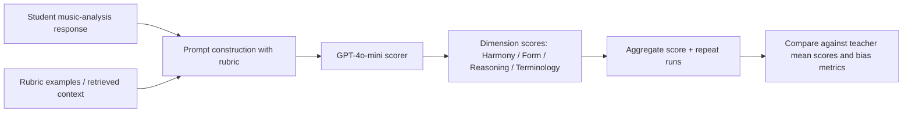
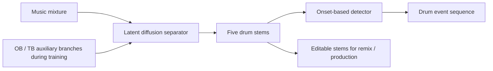
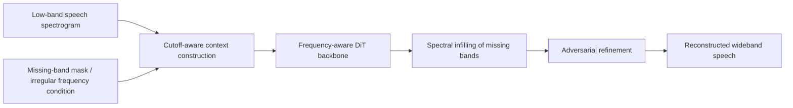
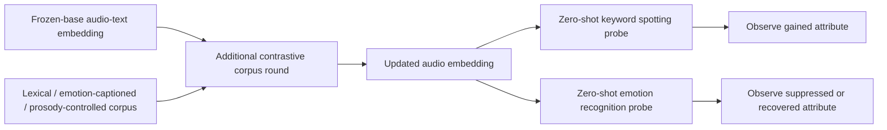
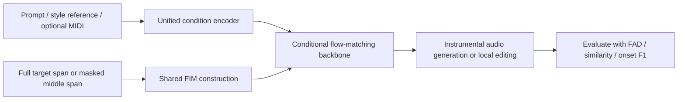

# 语音 / 音频 / 音乐论文速递
## 2026-08-04

> 实际对应 arXiv 更新日：**2026-08-04**  
> 检索范围：`cs.SD + eess.AS`  
> 只放按 ML 审稿口径看，最值得语音 / 音频 / 音乐研究者花时间看的 **5 篇**

## 📋 总览

- 共收录 **5 篇** 相关论文
- 音乐生成 / 音乐编辑 / 鼓转写：**2 篇**
- 语音前端 / 带宽扩展：**1 篇**
- 音频表征 / 对比学习分析：**1 篇**
- 音乐教育评测 / LLM 自动评分：**1 篇**

今天这批论文有个很明确的特征：不是“谁又把模型堆大了”，而是谁在把一个长期被糊弄过去的具体问题做扎实。`AnyBand` 解决的是现实里最烦的多带宽带宽扩展，不再让模型只对固定 `2 kHz` 或固定规则带限条件有效；`P-MUSE` 真正碰的是“只给 prompt / 只给 style / 给 MIDI 混合条件”这些音乐生成系统每天都在碰的接口统一问题；`Separate-and-Detect` 则干脆把鼓 stem 分离和 transcription 绑成一个模型，不再默认“先把事件识别出来，音频细节死活不管”。

另外两篇虽然不一定是最大众化的主线，但都值得认真看。`Discriminative Axis, Not Data Volume` 用一组很干的对比实验把“数据量更大就会学到更多属性”这个偷懒想法狠狠干碎了；`Comparative Validation of GPT-4o-mini...` 则不是在吹模型会打分，而是在拆自动音乐分析评分里最危险的误差来源：偏差、重复运行不稳、不同 rubric 维度表现不均。

## 精选入选规则

- **新意（0-3）**：是不是提出了新的表示、训练组织方式、统一接口或者把老问题拆得更对
- **影响力（0-3）**：是不是贴近语音前端、音乐生成、音频表征、评测自动化这些主线
- **证据强度（0-2）**：有没有像样的对照方法、关键数值、消融和局限说明
- **受众匹配度（0-2）**：对语音大模型 / 语音前端 / 音乐方向研究者有没有直接启发

分数校准：

- **6**：能读，但更像局部修补或窄领域分析
- **7**：信息量足，适合相关方向的人认真过一遍
- **8+**：建议优先精读，里面有能直接借走的方法或判断框架

## 总览表

| 方向 | 序号 | 论文 | 评分 | 关键词 |
|---|---:|---|---:|---|
| 音乐教育评测 | 1 | Comparative Validation of GPT-4o-mini and Teacher Mean Scores... | 8/10 | LLM scoring, prompt bias, repeatability, rubric-level analysis |
| 鼓转写 / stem 生成 | 2 | Separate-and-Detect | 8/10 | latent diffusion, drum stems, onset detection, unified protocol |
| 语音前端 / BWE | 3 | AnyBand | 8.5/10 | in-context spectral infilling, frequency-aware DiT, irregular cutoff |
| 音频表征分析 | 4 | Discriminative Axis, Not Data Volume | 8/10 | contrastive embedding, corpus design, keyword spotting, emotion |
| 音乐生成 / 编辑 | 5 | P-MUSE | 8.5/10 | prompt-MIDI-optional, FIM editing, curriculum learning, phase-aware CFG |

## 🎼 音乐教育评测 / LLM 自动评分

### [1] Comparative Validation of GPT-4o-mini and Teacher Mean Scores for Automated Scoring of Music Analysis Responses: Single-Pass Deployment, Repeatability, and Strategy-Specific Bias

- **评分**：8/10
- **作者/机构**：Baicheng Lin, Lingxi Jin, Kyung-Seok Min；Sejong University，Ewha Womans University
- **论文链接**：https://arxiv.org/abs/2608.01783
- **PDF**：https://arxiv.org/pdf/2608.01783.pdf
- **代码链接**：暂无
- **Demo 链接**：暂无

#### 📌 简介
这篇做的不是“让 LLM 去点评音乐作品”那种泛泛展示，而是一个很具体也很容易出事故的任务：自动给音乐分析答卷打分。作者拿 `300` 份 post-tonal music analysis 学生答卷，对照教师平均分，验证 `GPT-4o-mini` 在四个 rubric 维度上的单次部署表现、重复运行稳定性，以及不同 prompting strategy 的系统性偏差。这个问题并不 flashy，但如果你真想把 LLM 放进教育评分或开放问答评测链路，这篇比大多数“LLM judge 很强”论文实用得多。

#### ☠️ 毒舌点评
这篇最值钱的地方，是它没把“相关系数还行”当成任务结束。很多自动评分文章只给一个整体相关性就开始庆祝，这篇反而把真正该怕的东西摆在台面上：同一题目多跑几次稳不稳、是不是会系统性高估或低估、不同 rubric 维度是不是一半能看一半瞎。短板也很明显：方法上没有新模型，核心是同一 `GPT-4o-mini` 的 prompting 比较，所以它更像一篇把坑挖明白的 evaluation paper，而不是建模论文。

#### 🔧 技术方案
- **模型解决的问题**：开放式音乐分析答卷评分既要求读懂文本，又要求识别和声、曲式、术语使用与推理质量。人工评分慢且一致性有限，而纯 LLM 自动评分则可能在不同 rubric 维度出现明显偏差。作者要解决的是，在实际单次部署场景下，`GPT-4o-mini` 到底能不能作为稳定可审计的辅助评分器。
- **模型架构**：
  - **输入**：学生音乐分析答卷文本、评分 rubric、少样本示例，以及不同 prompting strategy 的上下文
  - **输出**：四个 rubric 维度分数与总分估计，并与教师平均分做一致性比较
  - **主干**：`GPT-4o-mini` 作为统一评分器
  - **关键模块**：
    - `Fs+CoT`：few-shot + chain-of-thought
    - `RAG`：从评分标准或参考材料中检索支持文本
    - `SC`：self-consistency 式多路径比较
    - rubric-level bias analysis 与 run-to-run repeatability analysis
- **信号流**：

- **关键设计 / 核心创新**：
  - 把自动评分拆成 `Harmony / Form / Reasoning / Terminology` 四个维度，而不是只看一个总分。
  - 同时看 `Pearson r`、`ICC`、`QWK`、`RMSE` 和方向性 bias，避免“相关性高但系统性偏低估”这种伪成功。
  - 对照的不是不同大模型，而是同一 `GPT-4o-mini` 的三种 strategy，这让结论更聚焦于部署选择，而不是模型口碑。
- **训练 / 推理策略**：
  - 这不是重新训练评分模型，而是固定 `GPT-4o-mini`，比较不同 prompting strategy 的部署行为。
  - 数据规模为 `300` 份学生答卷，适合做教育评分一致性研究，但还不构成跨课程、跨语言的大规模泛化证明。
  - 作者特别关心 single-pass deployment，所以不把复杂多轮审议链路当默认条件。
  - 评测中额外记录多次运行的一致性，专门看“今天能打，明天还打不打得一样”。

#### 📊 实验结果
- 数据与维度：
  - `300` 份音乐分析答卷
  - rubric 维度：`Harmony`、`Form`、`Reasoning`、`Terminology`
- 主要对照：
  - 这里没有多模型 baseline，核心对照是同一 `GPT-4o-mini` 的 `Fs+CoT`、`RAG`、`SC` 三种 strategy
  - 参考目标是教师平均分，而不是某个自动评分器的历史输出
- 整体最强策略：
  - `Fs+CoT` 在 Run 1 达到 `r=0.795`、`ICC=0.657`、`QWK=0.656`、`RMSE=2.461`
  - 这说明 few-shot + reasoning prompt 的确比简单投喂题目更稳
- 对照策略差异：
  - `SC` 的 `ICC=0.537`，明显低于 `Fs+CoT 0.657`
  - `RAG` 并没有天然更好，反而在 bias 上更危险
- 偏差分析最有价值：
  - `Fs+CoT` bias 为 `-1.730`，倾向于低估
  - `RAG` bias 为 `+1.787`，倾向于高估
  - `SC` bias 为 `-0.083`，方向偏差最小，但一致性不如 `Fs+CoT`
  - 这组数非常关键，因为它说明“误差小”与“偏差小”并不是一回事
- rubric 维度观察：
  - `Reasoning` 与 `Form` 更容易被模型稳定捕捉
  - `Terminology` 最难，说明模型更能抓解释逻辑，不代表它真的掌握学科术语的精细判别
- 论文真正想说的不是“LLM 可以替代老师”，而是：
  - 若要部署自动评分，你至少要同时报告相关性、偏差、维度差异和重复运行稳定性
  - 只给一个总分相关系数基本等于在藏问题

#### 💡 为什么值得看
如果你做 LLM-as-a-judge、教育评分、开放问答自动评测，这篇非常值得读。它的贡献不在于算法多花哨，而在于它把“该怎么审计自动评分系统”这件事拆得很清楚：要看相关性，也要看 bias；要看总体，也要看 rubric 维度；要看单次成绩，也要看多次运行是否飘。很多人现在还在用一个 `r` 值吹 judge 很强，这篇正好给你一把锤子。

#### 评分：8/10
理由：问题选得准，实验口径老实，特别适合作为“别再随便吹 LLM 评分”的证据。扣分点是方法本身不新，更偏实证评测而不是建模创新。

## 🥁 鼓转写 / stem 生成

### [2] Separate-and-Detect: Unified Drum Transcription and Stem Generation via Latent Diffusion

- **评分**：8/10
- **作者/机构**：Wei-Han Hsu, Chih-Cheng Chang, Bo-Yu Chen, Li Su, Yi-Hsuan Yang；台湾研究团队联合
- **论文链接**：https://arxiv.org/abs/2608.01093
- **PDF**：https://arxiv.org/pdf/2608.01093.pdf
- **代码链接**：https://github.com/ddman1101/Separate-and-detect
- **Demo 链接**：https://ddman1101.github.io/Separate-and-Detect-demo/

#### 📌 简介
这篇想解决的是 Automatic Drum Transcription 一条老毛病：传统 ADT 只输出符号事件，混音里真正可编辑、可重混的鼓 stem 被整条链路直接扔掉。作者把任务改写成“先统一分离、再统一检测”的形式，用 latent diffusion separator 同时生成 `5` 个鼓 stem，再接一个固定的 onset-based detector 输出鼓事件。这样得到的不是单纯的 drum notes，而是一套既能做 transcription、又能回到制作流程里做编辑的中间表示。

#### ☠️ 毒舌点评
这篇不是“把 diffusion 贴到标题里”的换皮稿，因为它确实把一个长期被默认分开的目标统一起来了：你既要可解释的符号事件，又要真实可用的鼓 stem。缺点也很实际：转写部分真正的提升主要来自 separator 质量和辅助分支设计，后端 detector 本身不算新东西，所以如果你期待一个 end-to-end 全新事件建模器，这篇不会满足你。

#### 🔧 技术方案
- **模型解决的问题**：传统 ADT 直接从 mixture 预测事件标签，音频细节在训练目标里是一次性消耗品。结果是事件有了，声学 stem 没了。作者要解决的是，能否在统一框架里同时得到可听的鼓 stem 与可评测的 drum onset transcription。
- **模型架构**：
  - **输入**：完整音乐 mixture
  - **输出**：`5` 路鼓 stem，以及对应的鼓 onset / event transcription
  - **主干**：`multi-track latent diffusion separator + onset-based transcription head`
  - **关键模块**：
    - latent diffusion drum separator
    - 训练时使用的 `OB` 与 `TB` 辅助分支
    - 固定的 onset detector，把分离结果转成符号事件
    - 统一 transcription protocol，保证不同数据集评测口径一致
- **信号流**：

- **关键设计 / 核心创新**：
  - 不再把 ADT 只定义成 mixture-to-events，而是先恢复鼓 stem，再做检测。
  - `OB` 与 `TB` 辅助分支只在训练阶段存在，推理时可以移除，说明作者想要的是“训练时更容易学，推理时不加负担”。
  - 统一 protocol 让 `MDB Drums` 与 `ENST-Drums` 的比较口径更干净，这点比单纯多报一个指标更重要。
- **训练 / 推理策略**：
  - 训练数据主力来自 `StemGMD`，总时长超过 `1200 小时`
  - 额外使用 `IDMT-SMT-Drums` 的 `2.1 小时` 鼓数据做补充
  - 测试集使用 `MDB Drums` 与 `ENST-Drums`
  - 推理时只保留 separator 与 detector，本身部署逻辑并不复杂

#### 📊 实验结果
- baseline 对照：
  - 转写侧重点对照 `ADTOF`
  - 分离与统一框架侧还对照了 `LarsNet` 等现有做法
- 关键结论不是“哪个鼓类都绝杀”，而是统一框架能在 overall F1 上站住：
  - 带 `+OB` 的版本在 Table 4 取得 `mean overall F1 = 0.674`
  - 这是文中最强的总体结果
- 在 `MDB Drums` 上的局部对照：
  - `kick`：`0.931`，对比 `ADTOF 0.851`
  - `snare`：`0.760`，对比 `ADTOF 0.752`
  - 这说明提升不是完全靠冷门类别刷出来，主类也吃到了收益
- 在 `ENST-Drums` 的 overall 行，文中可见：
  - `0.645 / 0.714 / 0.588 ...`
  - 关键信息是 `+OB` 版本仍然是最强 overall 方案
- 论文价值还在于：
  - 它给出了“可听 stem + 可测 transcription”一套统一产物
  - 对鼓制作、采样编辑、数据清洗的人，比单纯一个 MIDI 事件表更有用
- 局限：
  - detector 不是整篇的创新主体，性能上限仍较受 separator 质量影响
  - 当前重点放在鼓，尚不能直接外推到更泛化的 multi-instrument transcription

#### 💡 为什么值得看
如果你做鼓转写、source separation、音乐制作工具，这篇很值得看。它真正有用的地方，是把“可编辑的声学产物”和“可评测的符号输出”统一起来了。很多论文默认 stem 与 transcription 只能二选一，这篇告诉你未必。哪怕你不照抄 latent diffusion，这个任务拆法也值得借。

#### 评分：8/10
理由：统一问题定义这一点很有价值，实验也给了硬数字。扣分点是 detector 新意有限，更像“好任务拆法 + 合理工程拼接”的强论文，而不是范式级突破。

## 🗣️ 语音前端 / 带宽扩展

### [3] AnyBand: Unified Multi-Bandwidth Speech Extension via Frequency-Aware In-Context Spectral Infilling

- **评分**：8.5/10
- **作者/机构**：Junchuan Zhao, Minh Duc Vu, Bowen Zhang, Ye Wang；National University of Singapore
- **论文链接**：https://arxiv.org/abs/2608.00572
- **PDF**：https://arxiv.org/pdf/2608.00572.pdf
- **代码链接**：暂无
- **Demo 链接**：https://danny-nus.github.io/AnyBand-DemoPage/

#### 📌 简介
带宽扩展这条线一个老问题是：大家总爱把任务定死在某个 cutoff 上，例如固定 `2 kHz`、固定规则带限，然后做出一套只对那种退化好使的模型。`AnyBand` 的目标更实际，它想把不同 cutoff、不同规则甚至不规则频带缺失都统一到同一个 in-context spectral infilling 框架里。核心主干是 frequency-aware `DiT`，再配 `Easy-to-Balanced` cutoff curriculum 与 adversarial refinement，让模型既能补常见窄带，也能补 irregular missing bands。

#### ☠️ 毒舌点评
这篇值钱的地方在于它终于不再拿“只测固定电话带宽”冒充通用 BWE。实验里连 irregular `3 kHz` cutoff 都拉进来了，这才像真的在解决部署问题。它的风险也同样明显：模型设计比传统 BWE 更重，而且靠 `DiT + adversarial refinement` 这一套把问题统一起来，部署成本未必像最轻量的专用窄带模型那么友好。

#### 🔧 技术方案
- **模型解决的问题**：传统 bandwidth extension 往往按单一 cutoff 分模型，结果是 `2 kHz` 一个模型、`4 kHz` 一个模型、不规则频带再一个模型，维护和泛化都很差。作者要解决的是，用一套模型同时处理多种 cutoff 与 irregular bandwidth speech extension。
- **模型架构**：
  - **输入**：低带宽语音的频谱表示、缺失频带位置条件，以及 in-context 可见频带信息
  - **输出**：补全后的宽带频谱，再还原为全带宽语音
  - **主干**：`frequency-aware DiT` 做 spectral infilling
  - **关键模块**：
    - in-context spectral infilling task formulation
    - frequency encoder / decoder
    - `Easy-to-Balanced` cutoff curriculum
    - adversarial refinement，用于补细节与主观质量
- **信号流**：

- **关键设计 / 核心创新**：
  - 把 BWE 重新表述成“有条件的频谱补洞”，而不是固定上采样问题。
  - `Easy-to-Balanced` curriculum 不按 cutoff 平均采样，而是控制训练时各 cutoff 的学习难度与覆盖比例，避免模型永远偏向简单带限条件。
  - 用 frequency-aware 结构显式编码频率位置信息，解决不规则缺带下普通时域模型定位不准的问题。
- **训练 / 推理策略**：
  - 数据集包括 `VCTK` 与 `EARS`
  - 对照方法覆盖 `NU-Wave 2`、`AudioSR`、`FLowHigh`、`Fre-Painter`
  - 同时评测规则 cutoff 与 irregular cutoff，避免模型只在最舒服的协议里赢
  - 指标既看客观失真，也看主观代理质量：`LSD`、`HF-LSD`、`NISQA`、`COL`、`STOI`

#### 📊 实验结果
- 在 `VCTK`、`2 kHz` 输入条件下：
  - `AnyBand`：`LSD 1.248`，`HF-LSD 1.269`，`NISQA 3.125`，`COL 3.419`，`STOI 0.8214`
  - 对照 `Fre-Painter`：`LSD 1.323`，`HF-LSD 1.331`
  - 这个对比说明它不是只在主观代理分数上讨巧，频谱失真本身也更低
- 在 `EARS`、`2 kHz` 条件下：
  - `AnyBand`：`LSD 1.546`，`HF-LSD 1.584`，`NISQA 3.109`，`COL 2.973`，`STOI 0.8067`
  - 说明模型不只在一个干净朗读数据集上有效
- 更关键的是 irregular 场景：
  - `3 kHz` irregular cutoff 上，`AnyBand` 达到 `LSD 1.228`，`HF-LSD 1.261`，`NISQA 3.671`，`COL 3.702`，`STOI 0.8523`
  - 这组结果很重要，因为它直接证明统一模型不是纸上谈兵
- 对照方法范围：
  - `NU-Wave 2` 与 `AudioSR` 代表更传统或更常见的语音超分路线
  - `FLowHigh`、`Fre-Painter` 更接近生成式与频谱补全思路
  - `AnyBand` 能在这些方法上同时拿到较低 `LSD / HF-LSD`，说明 unified formulation 是站得住的
- 论文里最有参考价值的不是单个数字，而是：
  - 它把“单一带宽上赢”升级成了“多带宽、甚至不规则带宽上都能赢”
  - 这比只在 `VCTK 2 kHz` 上刷一个更小的 `LSD` 更接近真实需求

#### 💡 为什么值得看
如果你做语音前端、带宽扩展、上采样、codec 后处理，这篇基本是今天最值得优先精读的一篇。它真正解决的是任务定义层面的问题：BWE 不应该再按每个 cutoff 单独养一个模型。即便你最后不用 `DiT`，它把任务改写成 frequency-aware in-context infilling 的思路，也很容易迁到别的声学补全任务上。

#### 评分：8.5/10
理由：任务定义抓得很准，实验覆盖也够像真实部署，属于能直接影响后续研究路线的稿子。扣分点是模型相对偏重，轻量化与实时性还需要后续工作证明。

## 🎧 音频表征 / 对比学习分析

### [4] Discriminative Axis, Not Data Volume: What a Contrastive Corpus Teaches an Audio Embedding

- **评分**：8/10
- **作者/机构**：Abdul Basit Tonmoy；Eximius Labs，Wabash College
- **论文链接**：https://arxiv.org/abs/2608.01560
- **PDF**：https://arxiv.org/pdf/2608.01560.pdf
- **代码链接**：暂无
- **Demo 链接**：暂无

#### 📌 简介
这篇的核心结论一句话就够狠：给对比式音频 embedding 增加某种能力，关键不一定是更多数据，而是训练语料里的 discriminative axis 是否真的逼着模型去学那个属性。作者用 frozen-base multimodal audio embedding 做多轮对比训练，发现 lexical speech round 能把关键词识别能力暴力拉起来，但同时会压掉情感相关能力；而一个数据量很小、却把 prosody 变成唯一可分辨线索的 corpus，反而能把情感能力拉回来。

#### ☠️ 毒舌点评
这篇不是那种会被很多人第一眼收藏的“大模型大结果”论文，但它打中的是假设层面的软肋。很多人做表征学习时一碰到属性缺失就想“再抓更多数据”，这篇直接给出反例，而且数字很难反驳。问题在于，它更像一篇强 insight paper，不是现成拿来替换 backbone 的 recipe；如果你只想找一个即插即用的 audio encoder，这篇不会直接给你交钥匙。

#### 🔧 技术方案
- **模型解决的问题**：当一个对比式音频 embedding 缺少某种属性，比如 keyword、emotion 或 prosody，你到底该靠“更大的数据集”补，还是该重新设计训练对里的区分轴？作者要解决的是，把这个问题从经验之谈变成可测的实验命题。
- **模型架构**：
  - **输入**：音频样本与文本描述构成的对比学习样本对
  - **输出**：可用于 zero-shot downstream probing 的音频 embedding
  - **主干**：`frozen-base multimodal contrastive embedding model`
  - **关键模块**：
    - lexical speech round
    - emotion-captioned mined corpus round
    - prosody-controlled `CREMA-D` round
    - 下游 zero-shot probing：keyword spotting 与 emotion recognition
- **信号流**：

- **关键设计 / 核心创新**：
  - 把“多加数据是否有用”拆成语料 discriminative axis 的问题，而不是单纯数据规模问题。
  - 明确比较三类额外训练轮次：
    - lexical speech：让词汇内容成为主要区分轴
    - emotion-captioned mined corpus：标签里写了 emotion，但样本仍可被其他线索分开
    - `CREMA-D`：控制到 prosody 成为关键可分辨因素
  - 论文价值在于揭示 shortcut learning 与 feature suppression，不在于设计了多复杂的新损失。
- **训练 / 推理策略**：
  - 基座模型冻结，只做额外 contrastive round
  - 通过 zero-shot downstream probing 看能力迁移，而不是重新微调下游分类器把差异盖住
  - 重点观察两个任务：
    - `SpeechCommands` keyword spotting
    - `RAVDESS` / `CREMA-D` emotion-related probing

#### 📊 实验结果
- 最核心的一组数字：
  - lexical speech round 把 `SpeechCommands` keyword spotting 从 `0.133` 拉到 `0.894`
  - 绝对提升 `+0.761`
  - 这已经不是“略有帮助”，是说明词汇区分轴被强行学进去了
- 但代价同样直接：
  - `RAVDESS` emotion 从 `0.348` 掉到 `0.211`
  - 绝对下降 `-0.137`
  - 也就是关键词能力大涨的同时，情感属性被压掉了
- 论文最锋利的反例：
  - 一个含 `29,428` 条样本的 emotion-captioned mined corpus，几乎没有把 emotion 学回来
  - 文中强调该路线对 emotion 的改进接近 `-0.0007`
  - 这说明“caption 里写了 emotion”不等于训练对真的逼模型去依赖 emotion
- 为什么 `CREMA-D` 有用：
  - `CREMA-D` 这种 prosody-controlled corpus 可以把 emotion 属性恢复到 pre-speech round 之上
  - 原因不是它更大，而是它把 prosody 变成 negatives 无法绕开的区分轴
- 这篇给出的真正判断框架是：
  - 想让 embedding 学到属性 `X`
  - 就要让训练中的负样本不依赖 `X` 就分不开
  - 否则模型会继续走捷径，根本不会把 `X` 收进表示

#### 💡 为什么值得看
如果你做音频表征学习、audio-text embedding、跨任务迁移，这篇很值得精读。它不是给你一个新 SOTA backbone，而是给你一个很狠的训练集设计判据：不要再问“数据够不够多”，先问“负样本是不是必须依赖你想学的属性”。这对后续做 corpus construction、hard negative、对比学习 curriculum 都非常有启发。

#### 评分：8/10
理由：insight 非常硬，数字也很有说服力，适合拿来纠偏很多表征学习里的坏直觉。扣分点是更偏分析论文，短期内不一定直接转化成一个统一可复用的工程方案。

## 🎹 音乐生成 / 编辑

### [5] P-MUSE: Prompt-MIDI-Optional Model for Unified Instrumental Music Synthesis and Editing

- **评分**：8.5/10
- **作者/机构**：Chong Jing, Junan Zhang, Jing Yang, Yulun Wu, Fan Fan, Zhizheng Wu；音乐生成研究团队联合
- **论文链接**：https://arxiv.org/abs/2608.01920
- **PDF**：https://arxiv.org/pdf/2608.01920.pdf
- **代码链接**：暂无正式训练仓库；评测仓库 https://github.com/FEAfeatherTHER/P-MUSE-eval
- **Demo 链接**：https://p-muse.github.io/

#### 📌 简介
`P-MUSE` 做的是一个很符合真实产品接口的统一音乐模型：有时候用户给你的是 paired prompt，有时候是 style prompt，有时候有 `MIDI`，有时候没有；有时候要从头生成，有时候只想改局部。这篇的核心不是再做一个单一条件下很好看的 instrumental model，而是做一个 prompt-MIDI-optional 的统一框架，再用共享 `FIM` 机制把 generation 与 local editing 放进同一套建模里。

#### ☠️ 毒舌点评
这篇最容易被低估的地方，是它没有走“我只做 text-to-music / 我只做 MIDI-to-music”这种单点最优路线，而是先把接口统一了。真正做产品的人知道，这反而更难。缺点也在这里：统一接口意味着系统设计、训练组织、benchmark 都更复杂，所以你不能只看一个主观 demo 就信，必须看它在 mixed prompt、editing 和 MOS 上是不是真的都稳。好在这篇给了足够多的数字，不算糊弄。

#### 🔧 技术方案
- **模型解决的问题**：传统 instrumental music synthesis 往往按条件类型拆模型，paired prompt 一套、style prompt 一套、MIDI-conditioned 再一套；editing 往往又是完全不同的局部替换链路。作者要解决的是，用一个统一模型同时支持 generation 与 local editing，并兼容 prompt / MIDI 可选输入。
- **模型架构**：
  - **输入**：paired prompt、style prompt、可选 `MIDI`、以及局部 editing 时的上下文片段
  - **输出**：完整或局部编辑后的器乐音频
  - **主干**：基于条件流匹配的统一 generative backbone
  - **关键模块**：
    - shared `FIM`（fill-in-the-middle）机制，同时覆盖 generation 与 editing
    - multi-stage curriculum learning
    - `Tail-Drop` 策略
    - phase-aware `CFG`
- **信号流**：

- **关键设计 / 核心创新**：
  - 用 prompt-MIDI-optional 统一不同输入接口，不再要求某一类条件永远存在。
  - shared `FIM` 把“整段生成”和“局部编辑”拉进同一建模语言，减少单独做 editing head 的割裂感。
  - multi-stage curriculum 先学 paired prompt，再适配 style prompt，再通过 mixed prompt 统一调平。
  - `Tail-Drop` 与 phase-aware `CFG` 主要服务于长时器乐内容的结构完整性与 onset 对齐。
- **训练 / 推理策略**：
  - 训练数据规模非常大：
    - `3.44M` audio-MIDI clips
    - `10,441` 小时
    - `216` 种 timbre
  - 数据来源覆盖 `Slakh`、`SynthTab`、`e-gmd`、`Guitarset`、`MAESTRO`、`NSynth` 以及 Lakh 衍生单轨数据
  - benchmark 设计也不含糊：
    - `4` 类乐器
    - 每类 `100` 组 target
    - 每组 `1` 次 generation + `5` 次 editing
    - 每个 benchmark variant 一共 `2400` 个样本

#### 📊 实验结果
- 对比设置：
  - 外部对比方法包括 `MIDI-VALLE`、`CTD`、`TokenSynth`
  - 内部对比包括 `Mixed prompt`、`Paired-only`、`Style-only` 三种条件组织方式
- 统一条件设置的主结果在 Table 4 最有说服力：
  - `Mixed prompt`：`FAD 0.592`，`Similarity 93.6 ± 0.2`，`Onset F1 75.5 ± 1.1`
  - `Paired-only`：`0.679 / 92.0 / 73.2`
  - `Style-only`：`0.641 / 92.9 / 73.6`
  - 也就是说 mixed prompt 不是折中，反而是最强设定
- 作者自己给出的相对改进：
  - 相比 `Paired-only`，`FAD` 下降 `12.8%`
  - 相比 `Style-only`，`FAD` 下降 `7.6%`
  - `Onset F1` 分别提升 `3.1%` 与 `2.6%`
- MOS 结果同样不弱：
  - 在 `Paired Prompt` 下，相比 `MIDI-VALLE`
    - `Audio Quality 4.175 vs 3.155`
    - `MIDI Following 4.375 vs 3.540`
    - `Timbre Similarity 4.225 vs 3.216`
  - 在 `Style Prompt` 下，作者报告 `P-MUSE` 也优于 `CTD` 与 `TokenSynth`
- 这篇最强的不是单个指标，而是 benchmark 设计：
  - 它没有只测 generation
  - 也没有只测 editing
  - 而是把两者都放进同一条评测链路
- 局限：
  - 训练成本显然不低，`10,441` 小时级别数据对大多数团队不是轻量方案
  - 目前公开的是 benchmark 仓库而非完整训练代码，所以完全复现门槛仍然偏高

#### 💡 为什么值得看
如果你做音乐生成系统，这篇非常值得优先精读。它的价值不只是指标更好，而是接口设计更像真实世界：条件缺失、条件混合、局部编辑、从头生成，全都得一套模型扛住。很多论文只会在自己最舒服的输入协议里拿高分，`P-MUSE` 至少是在往统一产品接口这个方向认真走。

#### 评分：8.5/10
理由：统一问题定义、训练组织和 benchmark 设计都很扎实，数字也能撑住。扣分点是训练成本高、正式开源程度还不够完整，但方向本身很对。

## 最后结论

- **今天最值得优先精读的两篇**：`AnyBand`、`P-MUSE`
  - 前者决定的是语音前端要不要继续忍受“一个 cutoff 一个模型”的旧范式
  - 后者决定的是音乐生成系统能不能把 generation / editing / prompt / MIDI 真正统一起来
- **最值得借走的方法判断框架**：`Discriminative Axis, Not Data Volume`
  - 它不是给你模型，而是给你一条很硬的 corpus design 原则
- **最值得借走的任务拆法**：`Separate-and-Detect`
  - 把 stem 与 transcription 统一，不再默认只能二选一
- **最值得拿来审计现有系统的论文**：`Comparative Validation of GPT-4o-mini...`
  - 如果你现在还在用一个相关系数吹自动评分系统稳，这篇足够把你打醒

整体看，`2026-08-04` 这批论文不靠“模型更大”取胜，而是靠把具体问题定义得更接近真实使用场景。对语音 / 音频 / 音乐研究来说，这反而比又一个空泛的大模型口号更有价值。
