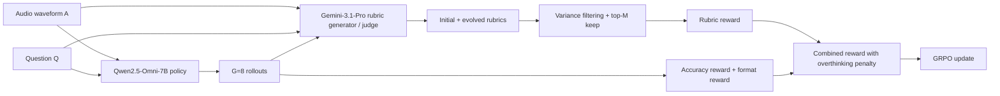
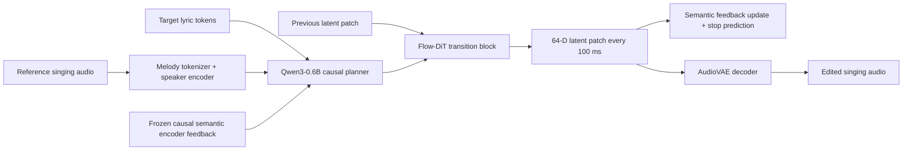
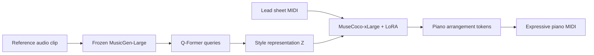
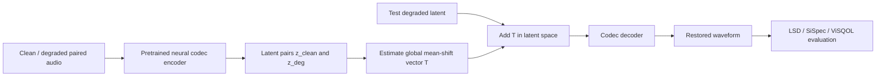

# 语音 / 音频 / 音乐论文速递
## 2026-08-05

> 实际对应 arXiv 更新日：**2026-08-05**  
> 检索范围：`cs.SD + eess.AS`  
> 只放按 ML 顶会审稿口径看，最值得多数读者花时间看的 **5 篇**

## 📋 总览

- 共收录 **5 篇** 相关论文
- 音频推理 / 音频大模型后训练：**1 篇**
- 歌声编辑 / 可控生成：**1 篇**
- 音乐生成 / 跨模态风格控制：**1 篇**
- 音频恢复 / codec latent 分析：**1 篇**
- 行业综述 / 声效生成：**1 篇**

今天这批里最值得优先看的，不是“又一个大一统多模态模型”，而是三条更硬的路线。`AudioRubrics` 把音频推理 RL 从“只奖最终答案”推进到“按样本、按 rollout 动态长出 rubric”，这是后训练设计层面的真增量；`CLASVS` 把歌词编辑里最难的“目标歌词要改、原唱旋律要留、历史 patch 还会把错词一路传下去”拆成了一个很清楚的因果路由；`Learning Music Style for Piano Arrangement Through Cross-Modal Bootstrapping` 则抓住了音乐风格控制里最麻烦的点: 风格不是标签，而是隐变量，作者用 Q-Former 把音频风格抽成可迁移表示，方向是对的。

剩下两篇价值不同。`On the Geometry of Music Bandwidth Extension in Latent Spaces of Audio Codecs` 不是一个 flashy 新模型，而是一篇很有杀伤力的 sanity-check 论文：你花几亿参数做 restoration 之前，最好先问一句 latent 里是不是已经有一根“均值平移向量”就能干掉你大半工作。`AI-Based Sound Effect Generation: A Narrative Review...` 则是标准综述稿，方法创新几乎没有，但如果你在搭 Foley / 游戏声效 / V2A 工具链，它把过去 5 年的路线图梳得还算有用。

## 精选入选规则

- **新意（0-3）**：是不是提出了新的表示、接口、训练组织方式，或者把旧问题拆得更对
- **影响力（0-3）**：是不是贴近语音大模型、歌声生成、音频恢复、音乐生成这些主线
- **证据强度（0-2）**：有没有像样的 baseline、消融和关键数值
- **受众匹配度（0-2）**：对语音大模型 / 语音前端 / 音乐方向 / 歌声方向研究者有没有直接启发

分数校准：

- **6**：可读，但更像资料整理或局部补丁
- **7**：信息量够，值得过一遍
- **8+**：建议优先精读

## 总览表

| 方向 | 序号 | 论文 | 评分 | 关键词 |
|---|---:|---|---:|---|
| 音频推理 / 后训练 | 1 | AudioRubrics | 8.7/10 | RLVR, evolving rubrics, audio-grounded judge, Qwen2.5-Omni |
| 歌声编辑 / 步进式控制 | 2 | CLASVS | 8.5/10 | singing lyric editing, continuous AR, SCT routing, PSCG |
| 音乐生成 / 风格控制 | 3 | Cross-Modal Bootstrapping for Piano Arrangement | 8.1/10 | Q-Former, MusicGen, MuseCoco, style transfer |
| 音频恢复 / codec latent | 4 | Geometry of Music Bandwidth Extension | 7.8/10 | mean shift, neural codec, bandwidth extension, latent geometry |
| 声效生成综述 | 5 | AI-Based Sound Effect Generation Review | 6.8/10 | TTA, V2A, Foley, multimodal, evaluation gaps |

## 🤖 音频推理 / 音频大模型后训练

### [1] Reinforcement Learning with Evolving Rubrics as Rewards for Audio Reasoning

- **评分**：8.7/10
- **作者/机构**：Fangxu Yu, Tao Feng, Dehai Min, Zinan Lin, Weijia Xu, Michael Xu, Philip S. Yu, Ge Liu, Tianyi Zhou；University of Maryland, College Park / UIUC / UIC / Microsoft Research / MBZUAI
- **论文链接**：https://arxiv.org/abs/2608.02831
- **PDF**：https://arxiv.org/pdf/2608.02831.pdf
- **代码链接**：**代码已开源** https://github.com/tianyi-lab/AudioRubrics.git
- **Demo 链接**：https://audiorubrics.github.io

#### 📌 简介
这篇做的是音频推理的后训练奖励设计。作者的判断很准：只奖最终答案的 RLVR 太粗，会让模型“蒙对也算赢”；固定 rubric 的 process reward 又太死，既不按题变，也不按模型能力升级。`AudioRubrics` 的核心就是把 rubric 变成按样本生成、按 rollout 演化、按当前策略重新加权的动态奖励。

#### ☠️ 毒舌点评
这是少数把“reward 设计本身就是方法主体”这件事做明白的音频论文。它不是把文字侧那套 rubric reward 生搬到音频上，而是明确补了 `audio grounding + question-specific + policy-evolving` 三个缺口。短板也很明显：整个系统高度依赖一个足够强的 judge / generator，大半成绩其实是用 `Gemini-3.1-Pro` 撑起来的，落地成本不低。

#### 🔧 技术方案
- **模型解决的问题**：现有音频推理 RL 常见两种失败方式。一种是 outcome-only reward，只看最终答案，模型完全可能不听音频也能靠语言先验赌对；另一种是 fixed rubric，能盯推理过程，但标准粗、不会随题和模型能力变化。`AudioRubrics` 解决的是“如何给音频推理模型一个细粒度、音频落地、还能持续升级的过程奖励”。
- **模型架构**：
  - **输入**：音频 `A`、文本问题 `Q`、标准答案 `y*`，以及当前策略在该样本上的一组 rollout。
  - **输出**：每个 rollout 的总 reward，用于 GRPO 优化；推理时输出 `<think>...</think><answer>...</answer>` 结构化答案。
  - **主干**：`Qwen2.5-Omni-7B` 作为被训练的音频语言模型，外接 `Gemini-3.1-Pro` 充当 rubric 生成器与 judge。
  - **关键模块**：
    - `Outcome Reward`：准确率 + 格式奖励，保证答案可验。
    - `Audio-Grounded Rubric Initialization`：从原始 waveform 为每题生成一组初始 rubric。
    - `Evolving Rubrics`：在每个 GRPO step 里，基于当前 rollout 生成新 rubric、淘汰无区分度 rubric、重分配权重。
    - `Overthinking Penalty`：线性惩罚推理长度，防止模型靠刷废话骗 rubric 分。
- **信号流怎么走**：

- **关键设计 / 核心创新**：
  `AudioRubrics` 真正有价值的地方不只是“加了 rubric”，而是把 rubric 做成了策略相关的动态对象。作者先生成每题初始 rubric，再在训练中根据 rollout 分歧生成更难的新 rubric，用方差筛掉“所有 rollout 都满足”或“全都不满足”的失效条件，保留最有区分度的前 `M=5` 条。这个设计比静态 rubric 更像 curriculum，但又不是手搓课程表。
- **训练 / 推理策略**：
  - 训练数据来自 `AVQA`，作者按 `video -> audio` 改写后得到 **40,176** 条 audio-text 训练样本。
  - 基座模型是 `Qwen2.5-Omni-7B`，训练使用 **4 张 H100**，每次对同一输入采样 **G=8** 个 rollout。
  - judge / rubric 生成器固定为 `Gemini-3.1-Pro`。
  - 关键权重设为 `α=0.9`、`β=0.1`、`γ=0.5`、`δ=0.15`，参考长度 `L=256` token。
  - GRPO 训练 **400 steps**，推理评测统一用 `temperature=0` greedy decoding。
  - 论文明确指出，换成更弱的 `GPT-audio-1.5` 作为 judge / generator，训练收益会明显掉，说明这条路线不是白嫖来的。

#### 📊 实验结果
- 数据集与任务：
  - `MMAU Test-mini`：1000 道多选题，覆盖 speech / sound / music 27 个任务。
  - `MMAR`：1000 个来自真实视频的音频推理 QA。
  - `MMSU`：5000 个 spoken-language understanding triplets，考细粒度韵律、情感、说话人属性等。
- 关键结果：
  - `MMAU Avg`：`AudioRubrics 78.00`，高于 `CESAR 77.10`、`Audio-Thinker 73.70`、`Qwen2.5-Omni-7B 65.20`。
  - `MMAR Overall`：`AudioRubrics 65.80`，略高于 `Audio-Thinker 65.30`、明显高于 `CESAR 62.70`、`Ke-Omni-R 60.90`。
  - `MMSU Overall`：`AudioRubrics 65.86`，高于 `CESAR 64.24` 和原始 `Qwen2.5-Omni-7B 60.57`。
  - `MMSU Perception Avg`：`52.75`，对比 `CESAR 48.45`，相对提升很实在，说明它不是只把 reasoning 文案写漂亮，确实把听感信息利用得更好了。
- 奖励设计分析：
  - rubric 权重 `γ=0.5` 时效果最好：`MMAU 78.00`、`MMAR 65.80`、`MMSU 65.86`。
  - 只用 GRPO baseline 时分别是 `75.20 / 62.20 / 63.14`，说明 process reward 不是装饰项。
  - overthinking penalty 设为 `δ=0.15` 最稳；太小会鼓励无上限长链路，太大又会把推理压扁。
- 消融与对比：
  - 去掉 evolving rubrics 后，`MMAU 76.20`、`MMAR 63.60`、`MMSU 65.44`。
  - 只做 RL 不加 rubric 时，退回 `75.20 / 62.20 / 63.14`。
  - judge 换成 `GPT-audio-1.5` 后，作者报告曲线甚至可能掉到 `GRPO` baseline 以下，说明 rubric 质量直接决定 reward 质量。

#### 💡 为什么值得看
如果你做 audio reasoning、audio judge、或者音频大模型后训练，这篇值得读的不是一个更高的分，而是一个可迁移的 reward 设计模板：先用 outcome reward 保底，再用随策略演化的 audio-grounded rubrics 把“听到了什么、推理得对不对、是不是在胡扯”拆开奖惩。它的问题也很清楚，就是对强 judge 的依赖很重，但这不影响它成为今天最值得先读的一篇。

#### 评分：8.7/10
理由：问题拆得准，reward 设计有方法味，实验也确实站得住。扣分主要扣在成本和依赖上，这条线离“低成本可复制”还有距离。

## 🎤 歌声编辑 / 可控生成

### [2] CLASVS: Continuous-Latent Autoregression for Melody-Preserving Lyric Editing in Singing Voice Synthesis

- **评分**：8.5/10
- **作者/机构**：Yizhong Geng, Tian-Hao Zhang, Chunfeng Wang, Wenxin Fu, Yingming Gao, Ruimin Wang, Zhou Pan, Kun Zhan, Liang Li, Ya Li；北京邮电大学 / 理想汽车 / 清华大学
- **论文链接**：https://arxiv.org/abs/2608.03253
- **PDF**：https://arxiv.org/pdf/2608.03253.pdf
- **代码链接**：暂无
- **Demo 链接**：https://piedpiperg.github.io/Liyric-SVS/

#### 📌 简介
这篇做的是“保旋律改歌词”的歌声编辑。它不走离散 codec token，而是走 continuous latent AR，每 `100 ms` 生成一个 `64-D` AudioVAE latent patch，同时把“目标歌词”“参考旋律”“已经生成到哪儿了”“上一段 latent 是什么”分开路由。作者的核心观点是：歌词编辑的真正难点不是重建，而是训练时看不到 counterfactual edit，测试时却要强迫模型一边保留原唱表演，一边拒绝原歌词。

#### ☠️ 毒舌点评
这篇比很多 singing editing 论文强的一点，是它没把问题伪装成“再加点 control token 就行”。`SCT` 路由和 `PSCG` 训练过程都在认真处理 source lyric 泄漏进 AR 历史的问题。缺点也要说清楚：它目前还是 Mandarin、2 到 6 音节编辑、单 recognizer 评测，跨语种和长跨度编辑能不能扛住，论文没证明。

#### 🔧 技术方案
- **模型解决的问题**：参考歌声里的旋律、节奏、音色都想保留，但原歌词又必须被新歌词覆盖。这会形成一个训练-测试错位：训练只见过“同一录音重建”，测试却要处理“同一旋律下换词”的冲突。如果历史 patch 跟着原歌词跑偏，AR 模型会一路把错词越滚越大。
- **模型架构**：
  - **输入**：参考歌声音频 `r`、目标歌词 token `x`、从参考音频抽出的 melody token `m`、说话人 / 歌手向量 `e`。
  - **输出**：编辑后的连续 `AudioVAE latent patches`，最终经 AudioVAE decoder 解码为歌声音频。
  - **主干**：
    - `Qwen3-0.6B` 因果 planner，负责全局歌词规划。
    - `Flow-DiT` 8-block transition generator，负责每个局部 latent patch。
    - 冻结的 `Whisper-style causal semantic encoder`，提供已生成内容的语义反馈。
    - 冻结 `Ming-UniAudio AudioVAE`，把 16kHz 音频映射到 `64-D` latent。
  - **关键模块**：
    - `SCT (State-Control-Transition) Routing`
    - `PSCG (Progressive State-Control Grounding)`
    - `continue/stop head`
    - `classifier-free guidance`
- **信号流怎么走**：

- **关键设计 / 核心创新**：
  `SCT` 的精髓在于把三种信息的生命周期拆开：
  - `Control`：目标歌词和参考旋律始终保留在 planner cache 里。
  - `State`：语义反馈只告诉系统“已经唱到哪儿了”，而不是把完整声学历史再灌回去。
  - `Transition`：上一段 latent patch 只服务下一步局部连续性，不许污染全局歌词规划。
  这比把所有信息糊成一个统一上下文要干净得多，也更像在解决真正的因果冲突。
- **训练 / 推理策略**：
  - 训练不是 paired edit，而是 `paired-edit-free` 的内容一致重建：同一录音提供参考、转写和声学目标。
  - 数据规模约 **8,000 小时** 权限合规 Mandarin singing + **2,000 小时** Mandarin Emilia speech + **300 小时** curated open-source singing。
  - `PSCG` 三阶段训练：
    - Stage A：`72K` broad-singing updates
    - Stage B：`24K` speech-assisted updates
    - Stage C：`24K` curated-singing updates
  - 三个 seed 都训 **120K updates**，`BF16 + ZeRO-2 + AdamW + global batch 128`。
  - 推理每个 patch 用 **24** 个 Euler steps，`CFG=2.0`，并用 stop head 决定何时结束。
  - 完整模型为 `0.765B` trainable / `2.115B` total。

#### 📊 实验结果
- 数据与设置：
  - 自建 `CLA-LyricEdit-320`：**320** 个 Mandarin edits，覆盖 PSub / FSub / Del / Ins 四种操作。
  - 公共 `LyricEditBench` 的 Mandarin-only 子集也做了复现实验。
- 和主要 baseline 的结果：
  - 对比离散 AR 的 `Vevo2`，`CLASVS` 在 320 edits 上把 `macro-PER` 从 **0.0699** 降到 **0.0376**，相对下降 **46.2%**。
  - 对比连续 NAR 的 `YingMusic-Singer-Plus`，`CLASVS` 的 `macro-PER` 也更低：**0.0376 vs 0.0411**。
  - 删除 / 插入编辑最明显：
    - `Del`: **0.0260** vs `YingMusic+ 0.0847`
    - `Ins`: **0.0298** vs `YingMusic+ 0.0382`
  - 但在 substitution 上它并不全面碾压：
    - `PSub`: **0.0505**，落后于 `YingMusic+ 0.0171`
    - `FSub`: **0.0442**，落后于 `YingMusic+ 0.0245`
- 保真与感知指标：
  - `FPC`：**0.9410**，高于 `Vevo2 0.7440`、略高于 `YingMusic+ 0.9340`
  - `SIM`：**0.914**，高于 `Vevo2 0.892`、`YingMusic+ 0.906`
  - `N-MOS`：**4.13**，相比 `YingMusic+ 3.65` 提升 **+0.48**
  - `L-MOS`：**4.42**，相比 `YingMusic+ 4.10` 提升 **+0.32**
  - `M-MOS`：**4.28 vs 4.27**，几乎打平，说明它主要赢在清晰度和歌词可懂度，不是旋律绝对优势。
- 路由与训练消融：
  - 去掉 semantic-feedback route，`PER` 升到 **0.0564**，`SrcRev` 升到 **0.154**。
  - 去掉 latent-patch route，`FPC` 掉到 **0.8896**，说明局部连续性真是靠这条路守住的。
  - `State Grounding` 拿掉后，`PER/FPC` 变成 **0.0511 / 0.9168**。
- 代价与部署：
  - `RTF` 明显慢于 `YingMusic+`：`CLASVS 5.858/5.380`（cold-start/steady-tail），`YingMusic+ 0.594/0.226`。
  - 它更像离线高质量编辑器，而不是实时产品路径。

#### 💡 为什么值得看
如果你做 singing editing、VC、speech editing 或任何“既要改内容又要保表演”的任务，这篇值得看的不是单个指标，而是它把信息路由讲清楚了：哪些东西该长期记、哪些东西只该影响下一步、哪些反馈只能表示进度不能回灌全部声学历史。这个拆法比堆更多 control token 更接近根因。

#### 评分：8.5/10
理由：问题抓得准，方法有清晰结构，数值也够硬。扣分在于评测范围仍偏窄，实时性也不行，但作为歌声编辑论文已经是今天很能打的一篇。

## 🎹 音乐生成 / 跨模态风格控制

### [3] Learning Music Style for Piano Arrangement Through Cross-Modal Bootstrapping

- **评分**：8.1/10
- **作者/机构**：Jingwei Zhao, Gus Xia, Ziyu Wang, Ye Wang；Songscription / MBZUAI / New York University / National University of Singapore
- **论文链接**：https://arxiv.org/abs/2608.03050
- **PDF**：https://arxiv.org/pdf/2608.03050.pdf
- **代码链接**：暂无
- **Demo 链接**：https://zhaojw1998.github.io/bossa/

#### 📌 简介
这篇做的是音频到符号钢琴编配里的“隐式风格控制”。作者不把风格压成 `jazz / swing / emotional` 这种离散标签，而是直接从参考音频里抽一个风格表示，再跟 lead sheet 的内容条件一起驱动符号音乐 LM 生成钢琴编配。核心桥梁是 `Q-Former`，但重点不在抄 BLIP-2，而在它怎么把 style 从 audio LM 的 hidden states 里抠出来。

#### ☠️ 毒舌点评
这篇不是那种一眼惊艳的新架构，而是很聪明的“拿成熟大模型当骨架，只学一个跨模态 style bridge”。它的短板也挺清楚：内容 preservation 上并没有全面压过强 baseline `PiCoGen2`，而且大量效果依赖上游 `Sheetsage` 提的 lead sheet 是否准。好在作者没回避这个问题，反而用 out-of-distribution 结果证明自己更像“风格控制模型”而不是“流行钢琴捷径模型”。

#### 🔧 技术方案
- **模型解决的问题**：现有音乐 LM 很擅长显式内容控制，比如 melody、chord、text prompt；但“风格”这种不能完整写成标签的隐变量，一直很难控。作者解决的是“如何从原始音频里学习一个可迁移、可条件化到符号编配的 style representation”。
- **模型架构**：
  - **输入**：参考音频（提供 style）、lead sheet MIDI（提供 melody + chord 内容）。
  - **输出**：钢琴 arrangement token，最终还原为 expressive piano MIDI。
  - **主干**：
    - 冻结的 `MusicGen-Large` 作为 audio LM。
    - `Q-Former` 作为跨模态 style bridge。
    - 冻结的 `MuseCoco-xLarge` 作为 symbolic music LM。
  - **关键模块**：
    - `K=32` 个 learnable query，跨注意力读取 audio hidden states。
    - 双流 Q-Former：左流接 audio，右流接 symbolic piano arrangement token。
    - `LoRA` 适配器插到 MuseCoco 自注意力层，用来容纳新输入格式。
    - data pairing：`10s` audio clip 对齐 `4-bar` MIDI segment，并加入 `±1s` 随机偏移与 `12` 个调性转调，防止死记 note-to-note 映射。
- **信号流怎么走**：

- **关键设计 / 核心创新**：
  这篇真正的创新不是“又用 Q-Former 了”，而是它明确把 Q-Former 当成 style bottleneck。作者用三个目标去挤压表示：
  - `Audio-Symbolic Contrastive Learning`
  - `Audio-Symbolic Matching`
  - `Audio-Grounded Symbolic Generation`
  这样做的目的不是把音频转录成 MIDI，而是逼它抽出那些既存在于音频、又能在符号钢琴里表达出来的风格属性，比如 groove、velocity contour、tempo feel。
- **训练 / 推理策略**：
  - Stage I：只训 Q-Former，做跨模态表示学习。
  - Stage II：用 `Q-Former` 输出的 `Z` 作为 style 条件，驱动冻结的 `MuseCoco` 生成 piano arrangement。
  - `Q-Former` 初始化自 `MusicBERT-Base`，带上交叉注意力后总参数约 **186M**。
  - `MusicGen-Large` 取第 **25** 层 hidden state；`MuseCoco-xLarge` 冻结，外加 `LoRA rank=16`。
  - Stage I 用 **4 张 A40 48GB**，`batch size 128`，训 **10 epochs / 130K iterations**。
  - Stage II 再训 **5 epochs**，`batch size 32`。
  - 推理用 `top-k=15`，长序列靠窗口式生成，每次前进 `2` bars，带 `2` bars 历史条件。

#### 📊 实验结果
- 数据集：
  - 训练：`POP909` + `PIAST`
  - OOD 测试：`Ballroom` + `GTZAN`
- 与主要 baseline 的对比：
  - baseline 1：`PiCoGen2 (PCG2)`，基于 `Sheetsage/Jukebox` 的音频到钢琴编配。
  - baseline 2：`Audio-to-MIDI (A2M)`，显式拆 beat / tempo / chord / texture 的自编码框架。
  - ablation：`w/o PT`，不做 Stage-I 预训练，直接训 Stage-II。
- In-distribution (`POP909`)：
  - `Ours` 在 style coherence 上明显更强：
    - `GPC 79.2`
    - `VCC 76.6`
    - `TA 83.6`
  - `PCG2` 在内容 preservation 上仍更强：
    - `MCA 39.3 vs Ours 32.0`
    - `CA 40.0 vs Ours 33.3`
  - 这基本说明 `PCG2` 更像内容保真优先，而作者的方法更像风格保真优先。
- Out-of-distribution (`Ballroom/GTZAN`)：
  - `Ours` 反而更稳：
    - `MCA 17.8 vs PCG2 17.2`
    - `CA 16.3 vs PCG2 15.5`
    - `TA 79.4 vs PCG2 57.6`
  - 这说明它没被 POP909 的流行钢琴分布绑死，风格表示确实更可迁移。
- Audio-to-symbolic retrieval：
  - `Ours` 的 `Acc@1 / Acc@5 / Rank` 为 **71.4 / 95.1 / 2.1**。
  - 对比 `CLaMP3` 的 **3.4 / 15.0 / 42.5**，差距不是一点半点。
  - MIDI 随机转调后，`Ours` 仍有 **70.2 / 94.8 / 2.1**，几乎不掉，说明它学的不是绝对 key，而是更像 style coherence。
- Style transfer ablation：
  - `Ours` 相比 `w/o PT` 在 style transfer 上更稳：
    - `MCA 28.9 vs 25.1`
    - `CA 40.0 vs 33.2`
    - `TA 73.8 vs 69.2`
  - 表明两阶段训练确实在帮 Q-Former 学跨模态 style 对齐。
- 主观结论：
  - 论文报告中，`Ours` 在 `Coherence` 和 `Musicality` 上优于 baseline，`Naturalness` 与 `PCG2` 接近。

#### 💡 为什么值得看
如果你做 music generation、style transfer 或 audio-to-symbolic，这篇最值得看的点是它把“风格不是标签，而是要靠音频示例蒸出来的隐变量”这件事落成了工程结构。它不完美，尤其内容指标还没完全压过强 baseline，但它给了一条比“手写 style tag”更有前途的路。

#### 评分：8.1/10
理由：思路对，结构清楚，OOD 和 retrieval 结果很有说服力。扣分在于内容保真还不是最强，而且对上游 lead sheet 质量有明显依赖。

## 🎚️ 音频恢复 / codec latent 几何

### [4] On the Geometry of Music Bandwidth Extension in Latent Spaces of Audio Codecs

- **评分**：7.8/10
- **作者/机构**：Hendrik Vincent Koops, Hao Hao Tan, Elio Quinton；Music & Audio Machine Learning Lab, Universal Music Group, London
- **论文链接**：https://arxiv.org/abs/2608.03721
- **PDF**：https://arxiv.org/pdf/2608.03721.pdf
- **代码链接**：暂无
- **Demo 链接**：https://ismir26latentgeo.github.io

#### 📌 简介
这篇不是在做一个更大的 BWE 生成模型，而是在反过来问一个更致命的问题：音乐 bandwidth extension 这件事，在某些 codec latent 里是不是已经接近线性操作了？作者发现，对多个预训练音频 codec 来说，只要用训练集估一个 clean/degraded latent 的全局均值平移向量，再加回测试样本，就能在不少指标上逼近甚至咬住大扩散模型。

#### ☠️ 毒舌点评
这类论文最容易被误判成“只是做个小 baseline”。但这篇的杀伤力恰恰在 baseline。它直接逼你承认：很多大 restoration 模型可能一直在重新学习一个 latent 里早就存在的简单几何方向。缺点也一样明显：它主要适用于 BWE，对 denoising、declipping、dereverb 并没有同样神奇，而且它也不是能直接替代大模型的最终系统。

#### 🔧 技术方案
- **模型解决的问题**：当前音乐 restoration，尤其 BWE，常用大 diffusion、Schrödinger bridge、flow matching 模型在 latent 空间里补高频。作者想验证的是：这些 latent space 本身是否已经把“带宽损失”编码成一个显著方向，以至于复杂模型只是在做精修。
- **模型架构**：
  - **输入**：带限 degraded audio，经预训练 codec 编码后的 latent；以及一小批 paired clean/degraded 样本用于估计 transport。
  - **输出**：加上 transport 后的 restored latent，再解码回波形。
  - **主干**：无可训练 restoration 网络；核心是 `mean-shift transport`。
  - **关键模块**：
    - 4 个预训练 codec：`Stable Audio Open VAE`、`CodiCodec`、`DAC`、`Encodec`
    - 全局平均位移向量 `T`
    - 几何分析：`cos(theta)`、identity-preserving margin、不同降质任务的对比
- **信号流怎么走**：

- **关键设计 / 核心创新**：
  创新点不在模型，而在 probe。作者不是训练一个更小的网络，而是用一个 **0 参数** 的线性探针去问 latent space 是否已经包含 restoration-relevant structure。这个 probe 非常值钱，因为它可以先告诉你：某类 degradation 到底是“表示问题”还是“建模问题”。
- **训练 / 推理策略**：
  - 不训练 generative restorer。
  - 在训练 split 中随机抽最多 **8192** 个长度 **1.5s** 的 paired 样本。
  - 计算 `T = mean(z_clean - z_deg)`，测试时对每个 degraded latent 直接做 `z_hat = z_deg + T`。
  - 数据集用 `MTD`、`CCMIXTER`、`MAESTRO`，带宽 cutoffs 设为 `4 / 8 / 12 kHz`。
  - 额外还测了 `denoising`、`declipping`、`dereverberation`，验证这种线性几何是否只对 BWE 成立。

#### 📊 实验结果
- 主要 baseline：
  - `AudioSR`（约 **280M**）
  - `CQTDiff`（约 **15M**）
  - `IBAR`（约 **1B**）
  - `A2SB`（约 **565M**）
- `MTD` 上的结果最能说明问题：
  - 在 `4 kHz` cutoff，`VAE mean shift` 达到 `LSD 1.29 / ViSQOL 3.45`。
  - 作为对比，`AudioSR` 是 `1.75 / 3.39`，`A2SB no partitioning` 是 `1.33 / 2.55`。
  - 也就是说，**0 参数均值平移** 在某些指标上已经能咬住甚至赢过大模型。
- `CCMIXTER`：
  - `VAE` 和 `DAC` 的 mean shift 在多个 cutoff 上都优于 `IBAR` 的 `SiSpec / ViSQOL`。
  - 例如 `VAE` 在 `12 kHz` cutoff 上有 `LSD 1.31 / ViSQOL 3.63`。
- `MAESTRO`：
  - `Encodec mean shift` 在 `4 kHz` cutoff 上达到 `LSD 0.901 / SiSpec 19.50`。
  - 这比 degraded roundtrip 的 `1.154 / 31.49` 在 LSD 上好很多，但在强指标上依然不如最优 `A2SB 4-partitioning` 的 `LSD 0.773`。
  - 结论不是“大模型没用”，而是“大模型的增益没想象中大”。
- 几何分析：
  - 跨数据集但同 cutoff 的 transport 方向余弦相似度可高到 **0.98**，说明主导方向更受 degradation 本身驱动，而不是受数据集类型驱动。
  - 只用 **8** 个样本估计 transport，`SiSpec` 和 `LSD` 就已接近全量结果，说明方向非常显著。
- 非 BWE 任务不成立：
  - `BWE` 在 `VAE` 上 `cos(theta)=0.985`，`ΔLSD=-2.086`。
  - `Denoising` 降到 `0.627 / -0.516`。
  - `Declipping` 只剩 `0.337 / -0.002`。
  - `Dereverberation` 更弱，说明“latent 里有简单线性方向”这件事高度任务相关，不是通用真理。

#### 💡 为什么值得看
如果你做 audio restoration，这篇是很该先看的“刹车论文”。它的价值不在最后 system，而在逼你先做 representation probe：如果一个 0 参数 mean shift 已经很强，那你后面该优化的就不是“再堆 500M 参数”，而是 residual 细节、codec artifact、sample-specific high frequency，而不是重复学一遍平均方向。

#### 评分：7.8/10
理由：方法极简但信息量很大，是很好的研究基线和方向校准器。扣分在于它更像分析论文，不是能直接落地替代大模型的完整方案。

## 🧭 声效生成综述 / 路线图

### [5] AI-Based Sound Effect Generation: A Narrative Review of Generative Models Across Input Modalities

- **评分**：6.8/10
- **作者/机构**：Sandy Abdo, Bill Kapralos, Priyamvada Tripathi, KC Collins, Adam Dubrowski；Ontario Tech University / Durham College / Carleton University
- **论文链接**：https://arxiv.org/abs/2608.03742
- **PDF**：https://arxiv.org/pdf/2608.03742.pdf
- **代码链接**：暂无
- **Demo 链接**：暂无

#### 📌 简介
这是一篇 AI 声效生成综述，不是新模型论文。作者按输入模态把近 5 年的工作分成 `text-to-audio`、`visual-to-audio`、`audio-to-audio`、`multimodal` 四大块，重点看不同模态输入如何影响声效生成的质量、可控性和上下文相关性。对做工具链梳理的人，这篇的价值比对做单篇算法复现的人更大。

#### ☠️ 毒舌点评
从研究新意看，这篇几乎没有方法贡献，本质上是文献整理稿，分数不可能高。但如果你现在正准备做 Foley、游戏声效、V2A 或多模态声效系统，它提供了一张还算像样的地图：哪些路线是 LDM 主导、哪些地方已经开始转多模态、哪些指标最常用、哪些痛点反复没解决。

#### 🔧 技术方案
- **模型解决的问题**：不是提出新模型，而是试图回答“声效生成过去 5 年到底形成了哪些主流技术路线，这些路线在不同输入模态下分别强在哪、短在哪”。
- **模型架构**：
  - **输入**：Google Scholar、IEEE Xplore、ACM Digital Library 中与 AI 声效生成相关的论文条目，以及作者定义的检索条件。
  - **输出**：按输入模态组织的文献综述、模型分类表、评价指标表和挑战总结。
  - **主干**：narrative review pipeline，而不是训练或推理系统。
  - **关键模块**：
    - 文献检索与筛选流程
    - 四大任务分桶：`TTA / V2A / A2A / multimodal`
    - 指标归纳：`FAD / IS / KL / CLAP / MOS / alignment`
    - 横向比较与挑战提炼
- **信号流怎么走**：

- **关键设计 / 核心创新**：
  它的“设计”不是算法，而是综述组织方式。作者明确排除了 speech / music 主任务，专盯 `sound effect synthesis`，所以不会被 TTS 和 TTM 大量工作淹没。这个取向对做游戏 / 影视 / 交互音频的人更实用。
- **训练 / 推理策略**：
  - 不涉及模型训练或推理。
  - 检索时间覆盖 **过去 5 年**，搜索执行于 `2024-02-06` 到 `2025-03-04`。
  - inclusion 条件是英文、peer-reviewed、原始研究、确实生成 sound effect 的模型。
  - exclusion 条件明确排除了 speech/music generation 主线、纯综述、非 peer-reviewed 文本等。

#### 📊 实验结果
- 这不是统一 benchmark 上的新系统实验，不能假装它有一个单一 SOTA 表。它给的是跨论文横向证据。
- 量化筛选结果：
  - 初始检索到 **204** 篇文章。
  - 去重并剔除非 peer-reviewed 后，筛 **60** 篇摘要。
  - **43** 篇进入全文审查。
  - 最终保留 **30** 篇论文。
- 类别分布：
  - `Text-to-Audio`：**11** 篇
  - `Visual-to-Audio`：**13** 篇
  - `Audio-to-Audio`：**2** 篇
  - `Multimodal`：**4** 篇
  - 其中 dominant architecture 仍明显被 `latent diffusion` 和其变体占据。
- 文中点名的代表性对比：
  - `AudioLDM` 被总结为在 text-to-audio 上优于 `DiffSound` 和 `AudioGen`。
  - `Tango` 被总结为在 `AudioCaps` 上超过 `AudioLDM`，尤其在小数据训练条件下更稳。
  - `Stable Audio Open` 在 `AudioCaps` 上拿到最好的 `FDopenl3 score`。
  - `FoleyGen` 对比 `SpecVQGAN`、`IM2WAV` 等旧法在 `FAD / KLD / ImageBind score` 上更强。
  - `Smooth-Foley` 被总结为在 `VGG / VGG-C` 上同时改善语义和时间对齐。
- 作者给出的核心结论：
  - 强模型在 `FAD / IS / KL` 这类客观指标上已经很能打。
  - 但主观评测仍反复暴露“指标好看，人耳并不完全买账”的问题。
  - 多事件场景下的 temporal synchronization 依旧是硬伤。
  - controllability 和 diversity 之间的 trade-off 没有被彻底解决。

#### 💡 为什么值得看
如果你想找“今天最值得复现的单个模型”，这篇不是答案；但如果你正准备搭建声效生成路线图，这篇能帮你快速建立全景视角，尤其是看清 `TTA -> V2A -> multimodal` 的迁移趋势，以及为什么大家最后都在回到“对齐、时序、主观评价”这三个老坑上。

#### 评分：6.8/10
理由：作为综述，它的信息组织有价值；作为 research contribution，它不够硬。更适合作为入门导航或产品路线图参考，不适合作为单篇方法论文深追。

## 最后结论

今天最值得优先看的排序如下：

1. **AudioRubrics**  
如果你做音频推理、LALM 后训练、judge 设计，这篇最值得先读。它不是简单调参，而是在 reward 层面给了一套能迁移的设计范式。

2. **CLASVS**  
如果你做歌声编辑、VC、speech editing 或 controllable generation，这篇的 `SCT + PSCG` 拆法很值得借。它把“什么该长期记忆、什么只能局部影响”讲清楚了。

3. **Learning Music Style for Piano Arrangement Through Cross-Modal Bootstrapping**  
如果你做 music generation / symbolic control，这篇在“用音频示例表达隐式风格”上方向很正，尤其 retrieval 和 OOD 结果说明它不是纯 pop 特化。

4. **On the Geometry of Music Bandwidth Extension in Latent Spaces of Audio Codecs**  
这篇更像研究刹车片。做 restoration 的人最好先用这种 probe 量一量 latent 几何，再决定是不是值得上大模型。

5. **AI-Based Sound Effect Generation Review**  
方法新意一般，但做产品调研、综述入门、路线盘点时有用。别把它当 SOTA paper，看成 toolchain map 更合适。

一句话收尾：今天不是“大模型更大更强”的一天，而是“奖励怎么设计、控制怎么路由、风格怎么抽象、表示几何能替你省掉多少无谓参数”的一天。对真正做系统的人，这批论文比又一个 demo-only 模型更有长期价值。
