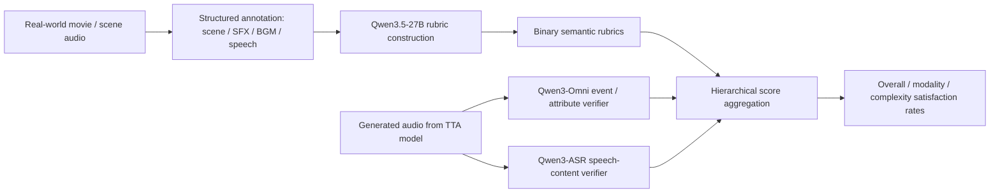
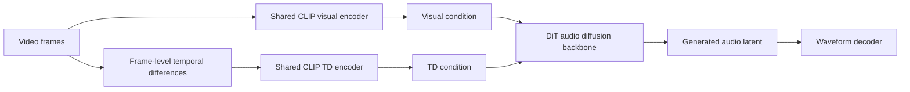
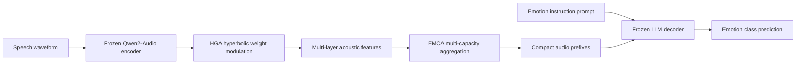
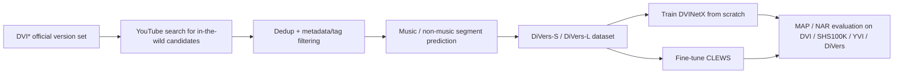
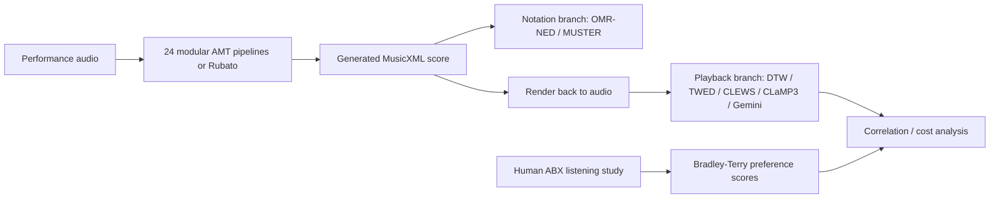

# 语音 / 音频 / 音乐论文速递
## 2026-08-06

> 实际对应 arXiv 更新日：**2026-08-06**  
> 检索范围：`cs.SD + eess.AS`  
> 只放按 ML 顶会审稿口径看，最值得多数读者花时间看的 **5 篇**

## 📋 总览

- 共收录 **5 篇** 相关论文
- 音频生成 / 评测：**2 篇**
- 语音情感 / 音频语言模型适配：**1 篇**
- 音乐检索 / 版本识别：**1 篇**
- 音乐转写 / 评测方法：**1 篇**

今天这批真正值得看的，不是“谁又把模型做得更大”，而是两条更硬的主线。第一条是**评测补课**：`AudioScape-TTA` 和 `A Dual Evaluation for Music Transcription` 都在提醒大家，全局相似度好看不等于任务真的做对，评测如果不拆到事件级、属性级和可回放层面，最后很容易被漂亮分数骗了。第二条是**表示补课**：`TD-V2A` 用 temporal differences 去补视频到音频里最容易被忽略的时间变化，`HyPASE` 则把超曲率几何搬进 LALM 情感适配，试图把细粒度情绪层级从“平面微调”拉回“有结构的表示空间”。`DiVers` 看上去没有那么 flashy，但它把 version identification 从干净的官方录音集拉回真实 YouTube 世界，这种数据层补课往往比再堆一个模型更有长期价值。

## 精选入选规则

- **新意（0-3）**：是不是提出了新的表示、评测接口、训练组织方式，或者把旧问题拆得更对
- **影响力（0-3）**：是不是贴近语音大模型、音频生成、评测、音乐检索这些主线
- **证据强度（0-2）**：有没有像样的 baseline、消融、相关性验证和关键数值
- **受众匹配度（0-2）**：对语音大模型 / 音频生成 / 音乐方向 / 评测方向研究者有没有直接启发

分数校准：

- **6**：可读，但更像局部补丁或资料整理
- **7**：信息量够，值得过一遍
- **8+**：建议优先精读

## 总览表

| 方向 | 序号 | 论文 | 评分 | 关键词 |
|---|---:|---|---:|---|
| 音频评测 / TTA benchmark | 1 | AudioScape-TTA | 8.8/10 | structured soundscape, rubric-based evaluation, Qwen3-Omni, speech-content |
| 视频到音频生成 | 2 | TD-V2A | 8.5/10 | temporal differences, HCL, ATDG, CLIP conditioning, diffusion |
| 语音情感 / LALM PEFT | 3 | HyPASE | 8.2/10 | hyperbolic geometry, Qwen2-Audio, SER, HGA, EMCA |
| 音乐检索 / 数据集 | 4 | DiVers | 7.9/10 | version identification, in-the-wild, CLEWS, DVINetX, YouTube |
| 音乐转写 / 评测方法 | 5 | A Dual Evaluation for Music Transcription | 7.7/10 | OMR-NED, playback similarity, CLEWS, Rubato, human ABX |

## 🧪 音频评测 / TTA Benchmark

### [1] AudioScape-TTA: A Structured Soundscape Benchmark for Fine-Grained Text-to-Audio Evaluation

- **评分**：8.8/10
- **作者/机构**：Jinting Wang, Yuguang Yang, Shengyu Li, Yan Rong, Shan Yang, Xiaoda Yang, Li Liu；香港科技大学（广州） / 腾讯 / 浙江大学
- **论文链接**：https://arxiv.org/abs/2608.04479
- **PDF**：https://arxiv.org/pdf/2608.04479.pdf
- **代码链接**：暂无明确官方开源
- **Demo 链接**：暂无

#### 📌 简介
这篇不是再造一个 TTA 生成器，而是补评测地基。作者的判断很准：现在很多 text-to-audio 模型的全局相似度分数看着不错，但一拆到“事件有没有真的生成”“属性有没有对”“说的话是不是对的”就开始露馅。`AudioScape-TTA` 的核心贡献，是把复杂 soundscape 明确拆成 scene / SFX / BGM / speech 四类组件，再把评测改造成细粒度 rubric 验证。

#### ☠️ 毒舌点评
这篇最值钱的地方，是它不再迷信一个 CLAP 或 FAD 就能代表“懂没懂 prompt”。很多 TTA 论文过去其实都在拿全局 embedding 分数自我感动，这篇把这种偷懒方式直接掀了桌。缺点也很清楚：它仍然依赖大模型 verifier，评测链条不是零成本，但这至少比装作“一个相似度分数就够了”诚实得多。

#### 🔧 技术方案
- **模型解决的问题**：现有 TTA benchmark 大多只评整体 text-audio 对齐，缺少针对复杂 soundscape 的可解释诊断，所以模型可能漏掉关键事件、说错台词、属性不对，却依然拿到还行的总分。`AudioScape-TTA` 解决的是“如何把复杂音景生成的语义遵循度拆成可核验、可分解、可比较的 benchmark”。
- **模型架构**：
  - **输入**：真实音景音频片段及其对应文本描述，描述中显式包含 scene、sound effects、background music、speech 等成分。
  - **输出**：固定结构化 benchmark 样本、逐条 semantic rubrics，以及模型生成音频的层级化 satisfaction rate。
  - **主干**：这里不是单一生成模型，而是一个 `benchmark construction + rubric generation + audio-grounded verification` 评测流水线。
  - **关键模块**：
    - `Structured Soundscape Schema`：把一个 clip 拆成场景上下文、音效、BGM、语音四层。
    - `Complexity Modeling`：用 `event density` 和 `structural complexity` 两个轴度量样本难度。
    - `Structured Rubric Construction`：用 `Qwen3.5-27B` 把层级标注转成固定二值检查项。
    - `Audio-grounded Verification`：用 `Qwen3-Omni-Instruct` 验证事件存在与属性，用 `Qwen3-ASR` 验证 speech content。
- **信号流怎么走**：

- **关键设计 / 核心创新**：它的创新不是“用了大模型 judge”，而是把 benchmark 本身做成了**结构化、复杂度可控、speech 明确可评**。以前很多 benchmark 把语音当一个普通声音事件混过去，这篇明确把 speech content 单独拉出来，终于能真正检查“说没说对”。
- **训练 / 推理策略**：
  - 基准集来自真实音景片段，最终形成 **2,258** 个 audio-text 样本和 **25,707** 条二值 semantic rubrics。
  - 每个样本按 `Sample -> Modality -> Event -> Attribute` 层级构造 rubric。
  - 评测时，事件存在和属性项用 `Qwen3-Omni-Instruct`，speech-content 用 `Qwen3-ASR`。
  - 最终主指标不是“一个总相似度”，而是 `Satisfaction Rate (SR)`，speech 另外用 `SCCA@0.60` 二值化处理。
  - 文中不是在报训练吞吐，而是在强调评测可解释性和与人类判断的一致性。

#### 📊 实验结果
- benchmark 规模：
  - **2,258** 个样本
  - **25,707** 条 semantic rubrics
  - 平均音频时长 **9.95s**
  - 平均文本长度 **32.45 words**
  - 平均每条样本约 **4** 个事件
  - 带 speech 标注的 clip 有 **358** 条，其中 target utterance clip **83** 条
- 评测对象：**13** 个开源 TTA 模型，包括 `AudioLDM 2`、`Make-An-Audio 2`、`AudioGen`、`Tango 2`、`TangoFlux`、`EzAudio`、`MAGNeT`、`Stable Audio Open`、`MMAudio`、`Foley-Omni`、`Omni2Sound`、`AudioStory`、`Dasheng AudioGen`
- 关键结果：
  - `Foley-Omni` 总体最好：`Overall SR 79.62%`，`Event Presence 81.74%`，`Event Attribute 78.34%`，`Speech Content SCCA@0.60 57.06`
  - `Dasheng AudioGen` 是 speech-content 最强：`SCCA@0.60 = 77.30`
  - `MMAudio` 虽然 `CLAPMS = 0.5169` 全表最高，但总体语义满足率只有 `64.73%`，这正好说明“全局 embedding 分高”并不等于任务做对
  - 大多数模型的 speech-content 直接是 **0.00**，说明“能发出像人声的东西”和“真的把指定话说对”根本不是一回事
- 人类一致性：
  - rubric-based `Overall SR` 与人类 semantic judgment 的 Spearman 相关是 **0.879**
  - `Attribute SR` 与人类属性满意度相关是 **0.825**
  - `CLAPMS` 与人类 semantic judgment 只有 **0.312**，还不显著
- baseline / 对比结论：
  - 对比 `CLAPMS`、FAD、KL、ISC 这类传统指标，作者的方法能更稳定地区分“漏事件、属性错、speech 错”三种失败模式
  - 在复杂度分析里，模型从 easy 到 hard 子集普遍掉点，`Foley-Omni` 的 hard-set 稳定性最好

#### 💡 为什么值得看
如果你做 TTA、omni-audio、视频到音频，甚至只是做一个 audio judge，这篇都值得读。它最重要的价值不是一个更大的 benchmark，而是把“复杂 prompt 到底哪里没做对”拆成了能落地排查的结构化信号。很多生成模型工作现在真正缺的不是再长 0.3 分，而是这种能把失败原因说清楚的评测框架。

#### 评分：8.8/10
理由：问题抓得非常准，benchmark 结构也不是拍脑袋，最关键的是它用人类相关性证明了“rubric-based 细粒度评测”确实比 CLAP 这类全局分数更靠谱。

### [2] Visual Representation Matters: Exploiting Temporal Differences in Video-to-Audio Generation

- **评分**：8.5/10
- **作者/机构**：Zehua Chen, Junyou Wang, Yuxuan Jiang, Zhenying Fang, Yusheng Dai, Jianfei Chen, Ziwei Liu, Jun Zhu；清华大学 / 合肥工业大学 / Monash University / 南洋理工大学
- **论文链接**：https://arxiv.org/abs/2608.04902
- **PDF**：https://arxiv.org/pdf/2608.04902.pdf
- **代码链接**：暂无明确官方开源
- **Demo 链接**：暂无

#### 📌 简介
这篇做的是 video-to-audio generation，但切口不是再加一个更重的多模态模型，而是抓住了一个更本质的问题：**V2A 和 I2A 真正的差别，在于连续帧之间的 temporal differences**。作者提出 `TD-V2A`，把时序差分直接作为补充视觉条件，尽量不引入额外监督和复杂外部网络，再配上 `HCL` 和 `ATDG` 去把这个差分信息训进去、用起来。

#### ☠️ 毒舌点评
这篇最舒服的地方，是它没有再走“我有更强的大模型推理器 / 更复杂的音画预训练器”那条重工程路线，而是回到问题本身去问：V2A 到底缺什么。它不是范式级革命，但它给出的答案很干净，也确实做出了指标。短板是显而易见的：它本质上仍然是条件扩散路线上的增强版，不是从头重写 V2A 任务定义。

#### 🔧 技术方案
- **模型解决的问题**：现有 V2A 模型为了补时序信息，常常要么靠额外 audio-visual 监督，要么靠单独训练的表示模型，要么借大多模态模型做推理，代价高且 inductive bias 很重。`TD-V2A` 解决的是“能不能直接从输入视频自身挖出时序变化信号，而不是外挂额外网络去替模型理解时间”。
- **模型架构**：
  - **输入**：连续视频帧，以及由相邻帧计算得到的 temporal differences。
  - **输出**：与视频语义和时间对齐的音频波形。
  - **主干**：`VAE + Diffusion Transformer (DiT)` 的条件音频生成框架。
  - **关键模块**：
    - `Frame-level Temporal Differences (FTD)`：直接对原始帧做差分。
    - `Feature-level TD / CLIP-level TD`：在编码后的视觉特征空间做差分，对比哪种层级更有效。
    - `HCL (Hierarchically Continual Learning)`：分阶段从文本语义、视觉内容再到 TD 条件逐步引入。
    - `ATDG (Annealed Temporal Differences Guidance)`：采样早期加强 TD guidance，后期再慢慢退到视觉语义主导。
- **信号流怎么走**：

- **关键设计 / 核心创新**：最关键的结论是**frame-level TD 比 feature-level TD 更有用**。也就是说，先在原始视觉层面保住变化信号，再让预训练视觉编码器去吃它，比先做语义压缩再看特征差分更稳。这个结论挺有启发性，因为它在提醒大家：有些时序细节一旦先被大 encoder 压缩，后面就再也捞不回来了。
- **训练 / 推理策略**：
  - T2A 预训练数据用 `AudioCaps`、`AudioSet`、`VGGSound`、`FreeSound`、`MSD`
  - 视频条件和 TD 微调用 `AudioSet + VGGSound`
  - 全部音频切成 **10s** clip，重采样到 **16 kHz**
  - T2A 预训练 **2M iterations**，总 batch size **64**
  - V2A / TD fine-tuning 各训 **0.3M iterations**，在 **8 GPUs** 上跑，`AdamW` 学习率 `5e-5`
  - 推理时 `ATDG` 用 **67** 个采样步，纯 CFG 用 **100** 步，保持相同 NFE 级别
  - guidance 默认 `wf = 2.0`，`wTD` 在 `0.5` 到 `1.5` 之间按 denoising 进程 anneal

#### 📊 实验结果
- 评测数据：`VGGSound` 测试集，约 **15K** 个 **10s** 音频片段
- 主要 baseline：`IM2WAV`、`Diff-Foley`、`FoleyGen`、`VTA-LDM`、`FoleyCrafter`、`Frieren`、`V2A-Mapper`、`VAB-Encodec`、`VATT`、`MMAudio`、`AudioX`
- 主表结果：
  - `TD-V2A`：`FAD 0.53`，`KL 2.16`，`IS 16.9`，`FD 3.79`，`IBS 33.8`，`AA 89.1`
  - 对比 `MMAudio`：`FAD 0.81`，`IS 11.9`，`FD 5.65`，`IBS 28.0`
  - 对比 `V2A-Mapper`：`FAD 0.90`，`IS 12.5`，`FD 8.35`，`IBS 22.4`，`AA 78.3`
  - 对比 `Diff-Foley`：`AA 89.9` 稍高，但 `FAD 5.79`、`FD 21.90` 明显差很多
- 主观结果：
  - `TD-V2A` 在 `OVL / S-REL / T-REL` 上分别是 **3.68 / 3.85 / 3.62**
  - `FoleyCrafter` 是 **3.17 / 3.23 / 3.04**
  - `Diff-Foley` 只有 **2.46 / 2.59 / 2.21**
- 消融：
  - `T2A + CLIP` 基线：`FAD 0.64`，`IBS 31.8`，`AA 87.2`
  - `T2A + CLIP+FTD`：`FAD 0.55`，`IBS 33.4`，`AA 88.8`
  - `HCL + CLIP+FTD`：进一步到 `FAD 0.53`，`IBS 33.8`，`AA 89.1`
  - `ATDG` 也优于固定 `wTD`，说明 TD guidance 真不是随便设个常数就能解决
- baseline / 对比结论：
  - 在不依赖额外 text reasoning 或专门音画对齐网络的前提下，`TD-V2A` 已经在主要质量指标上压过现有 baseline
  - 最重要的收益来自**把时间差分显式作为条件**，而不是继续在原有视觉 embedding 上硬挤信息

#### 💡 为什么值得看
如果你做 video-to-audio、omni-audio，甚至只是做“多帧视觉条件怎么喂给生成模型”，这篇都值得看。它最大的价值不是“又比谁高了几点”，而是把 V2A 最核心的增量信息定义得很清楚：不是多几帧，而是**帧与帧之间的变化**。这个抽法很可能会迁移到别的时序条件生成任务里。

#### 评分：8.5/10
理由：问题拆得准，改动克制但有效，指标和主观结果都站得住。扣分主要扣在它还是扩散条件增强路线，离真正统一的时序多模态生成范式还有距离。

## 🗣️ 语音理解 / 情感建模

### [3] HyPASE: Hyperbolic Geometry for Parameter-Efficient Speech Emotion Fine-Tuning Framework for Large Audio-Language Models

- **评分**：8.2/10
- **作者/机构**：Tian Jin, Ruikang Zhang, Zefeng Zhao, Ding Luo, Jin Zeng；同济大学 / 香港中文大学（深圳） / 北京大学
- **论文链接**：https://arxiv.org/abs/2608.04351
- **PDF**：https://arxiv.org/pdf/2608.04351.pdf
- **代码链接**：**代码已开源** https://github.com/LilSicko/HyPase
- **Demo 链接**：暂无

#### 📌 简介
这篇做的是 SER，但不是普通的小模型情感识别，而是把 `Qwen2-Audio` 这类 LALM 怎么高效适配到情绪识别上。作者的核心观点是：情绪线索本来就是层级化的，从低层韵律到高层语义并不是一个平面结构，所以传统 Euclidean PEFT 把它们全压到同一几何里，本身就有表示偏差。`HyPASE` 用超曲率空间做 PEFT，试图让这种多粒度情绪层级在适配时保留下来。

#### ☠️ 毒舌点评
这篇不是那种“换个 manifold 名字就想加分”的空活。它至少把几何假设和实际任务痛点对齐了，而且给出了 MELD、IEMOCAP 以及跨数据集迁移结果。问题在于它仍然没有把 WA 和 UA 的 tradeoff 全部解决，尤其 IEMOCAP 上它更像“偏向少数类”的定向修复，而不是全指标碾压。

#### 🔧 技术方案
- **模型解决的问题**：LALM 在通用听觉理解上已经很强，但迁到 SER 这种细粒度任务时，常见 LoRA / Adapter 都还是在 Euclidean 空间里做统一微调，难以显式表达浅层声学线索和深层语义线索的层级关系。`HyPASE` 解决的是“能不能用超曲率几何把这种层级深度直接写进 PEFT 里”。
- **模型架构**：
  - **输入**：语音波形，经 `Qwen2-Audio-7B-Instruct` 的音频编码器得到多层声学表示，再配情感类别指令 prompt。
  - **输出**：情感类别预测，以及送给冻结 LLM 的 compact audio prefix。
  - **主干**：冻结 `Qwen2-Audio` 主体，在音频编码器上插 `HGA`，在 utterance 级别加 `EMCA`。
  - **关键模块**：
    - `HGA (Hyperbolic Geometric Adapter)`：在 Poincare ball 上对 Q/V 权重做层自适应 radius modulation。
    - `EMCA (Emotion-aware Multi-capacity Cross-modal Aggregator)`：把多尺度 frame 表示压成多分支情感前缀。
    - `Lhyp + Lradius`：用几何监督把超曲率结构真的训出来，而不是只换坐标名词。
- **信号流怎么走**：

- **关键设计 / 核心创新**：真正有意思的地方有两个。第一，作者不是只在 feature fusion 末端上个 hyperbolic layer，而是直接把**权重调制**搬进超曲率空间，意思是“模型怎么改参数”本身也要有层级感。第二，`EMCA` 不是简单 pooling，而是做多容量分支聚合，配合 `Lradius` 去强制不同分支落在不同 radial shell 上，这点比普通 attention pooling 更像真几何建模。
- **训练 / 推理策略**：
  - backbone 是 `Qwen2-Audio-7B-Instruct`
  - `HGA` 单独只占约 **0.013%** 全模型参数；加上 `EMCA` 后总 trainable 参数约 **6.78M**，约 **0.12%**
  - 训练数据用 `MELD (7-class)` 和 `IEMOCAP (4-class)`
  - 训练目标包含分类 `LCE`，再叠加 `Lhyp` 和 `Lradius`
  - 文中默认使用统一情感分类 prompt，按数据集列出候选情绪标签
  - 推理时不做目标域微调的零样本迁移测试，直接从 `MELD` 模型转到 `RAVDESS / SAVEE / IEMOCAP`

#### 📊 实验结果
- 主 baseline：
  - `HuBERT large`
  - `WavLM large`
  - `Whisper large V3`
  - `Qwen2-Audio` 直接推理 / CoT 推理
  - `Adapter`
  - `LoRA`
  - 全参参考 `SFT + IR`
- MELD 结果：
  - `HyPASE`：`UA 50.59`，`WA 68.97`，`F1 53.32`
  - `LoRA`：`UA 46.88`，`WA 65.43`，`F1 47.84`
  - `Adapter`：`WA 62.09`
  - 对 LoRA 提升：`WA +3.54`，`F1 +5.48`
- IEMOCAP 结果：
  - `HyPASE`：`UA 82.13`，`WA 79.08`，`F1 78.38`
  - `LoRA`：`UA 78.90`，`WA 80.60`，`F1 79.28`
  - 也就是说它在 `UA` 上赢 **+3.23**，但 `WA` 略输 **-1.52**，明显是更偏向少数类
- 几何消融：
  - 只用 `Hyperbolic HGA`：`WA 66.16`
  - 换成 `Euclidean HGA`：`WA 64.07`
  - 全量 `HyPASE`：`WA 68.97`
  - 说明性能增益不是结构复杂度白送的，超曲率几何本身确实在贡献
- 零样本跨数据集：
  - `Qwen2-Audio zero-shot`：`RAVDESS 50.42`，`SAVEE 30.83`，`IEMOCAP 51.52`
  - `HyPASE`：`56.33 / 66.67 / 76.14`
  - 尤其 `SAVEE` 提升 **+35.8 pp**，很夸张
- per-class 分析：
  - `neutral` F1 从 **6.60** 拉到 **82.50**
  - `joy` 从 **22.10** 拉到 **65.18**
  - `surprise` 则从 **77.20** 掉到 **57.90**
  - 这不是纯退化，更像把原来过度预测 surprise 的偏差拉回来了

#### 💡 为什么值得看
如果你做 LALM 微调、SER、情绪理解，这篇值得看的不是“hyperbolic”这个名词，而是它把**层级情绪线索**和**参数高效适配**对到了一个几何框架里。它没有把所有指标都碾平，但它至少给出了一条比“LoRA 一把梭”更像认真建模的方法路线。

#### 评分：8.2/10
理由：方法假设和任务结构是对齐的，参数效率也漂亮，跨数据集结果有说服力。扣分主要来自 IEMOCAP 上 WA 仍有 tradeoff，离全指标无脑替代 LoRA 还有一步。

## 🎼 音乐检索 / 转写评测

### [4] Towards Robust Version Identification in the Wild: A Dataset, Benchmark, and Fine-Tuning Study

- **评分**：7.9/10
- **作者/机构**：Simon Hachmeier, R. Oguz Araz, Dmitry Bogdanov, Robert Jäschke, Xavier Serra；洪堡大学柏林 / Universitat Pompeu Fabra
- **论文链接**：https://arxiv.org/abs/2608.04543
- **PDF**：https://arxiv.org/pdf/2608.04543.pdf
- **代码链接**：**代码已开源** 数据集构建：https://github.com/progsi/divers_dataset；基准与训练：https://github.com/progsi/divers_benchmark
- **Demo 链接**：暂无

#### 📌 简介
这篇做的是音乐 version identification，但重点不是又造一个 embedding 模型，而是把数据分布从“官方、干净、编目完整”的录音集，拉回真实世界 YouTube。作者提出 `DiVers`，在 `DVI` 的基础上增补大量非官方、用户生成、带噪声和非纯音乐段落的版本，并系统分析在这种 in-the-wild 条件下训练 / 微调 version retrieval 系统到底会发生什么。

#### ☠️ 毒舌点评
这不是那种能在标题里喊“新 SOTA”的花活，但这是非常实在的数据层工作。做 MIR 的人都知道，很多系统一离开 Discogs / SHS 这种干净世界就开始塌，这篇就是在补这个现实鸿沟。短板是方法创新不算大，主要价值更偏 dataset + benchmark + 训练诊断，而不是新模型本体。

#### 🔧 技术方案
- **模型解决的问题**：现有 version identification 数据集多来自 `SecondHandSongs`、`Discogs` 这类人工整理元数据源，官方录音占主导，和 YouTube 上的大量 amateur cover、live、tutorial、reaction、低质录音并不匹配。`DiVers` 解决的是“如何构造更接近真实平台分布的 VI 数据，并测试现有系统在这种分布下到底有没有鲁棒性”。
- **模型架构**：
  - **输入**：来自 `DVI*` 的已知作品集合，以及 YouTube 检索出的候选版本音频 / 元数据 / tag / 音乐片段预测。
  - **输出**：`DiVers-S / DiVers-L` 数据集，外加在其上训练或微调后的 `DVINetX / CLEWS` 检索系统结果。
  - **主干**：本体是 `dataset construction + tag enrichment + music/non-music prediction + retrieval training/fine-tuning` 的基准流水线。
  - **关键模块**：
    - `YVI-L` 候选挖掘：从 YouTube top-500 搜索中找非官方版本
    - `Chromaprint / soundalike` 去重
    - `PANN` 音乐 / 非音乐段落预测
    - `Tag Matching`：自动赋予 instrumental、live、tutorial 等语义标签
    - `DVINetX` 从头训练
    - `CLEWS` 在 `DiVers-S` 上微调
- **信号流怎么走**：

- **关键设计 / 核心创新**：新意不在模型结构，而在于作者把数据建设做得足够系统，且没有只停在“我做了个更大集合”。它还给了 segment-level 音乐预测、tag strata 分析、embedding space shift 分析，所以这篇不是简单扩容，而是在研究“为什么系统在真实世界会变差，以及什么操作能救回来”。
- **训练 / 推理策略**：
  - `DiVers-L` 最终规模 **1,102,317** 个版本
  - 其中新发现的 `YVI-L` 版本有 **629,536** 个
  - 对随机 **320** 对样本做人审，作品归属正确率 **96.25%**
  - `DVINetX` 用 2.5 分钟随机片段训练，输入是 7-octave `CQT`
  - 使用 `SpecAugment`、pitch-roll、time-stretch
  - `DVINetX` 用 triplet loss + hard mining，单卡 `H100 NVL` 在 `DiVers-L` 上训练约 **7.5 天**
  - `CLEWS` 在 `DiVers-S` 上 fine-tune，两张 `H100 NVL` 约 **4 天**

#### 📊 实验结果
- 数据统计：
  - `DiVers-L` 总规模 **1,102,317** versions
  - YVI 新增版本 **629,536**
  - 手工核查正确率 **96.25%**
- 主要 baseline：`ByteCover2`、`CLEWS`、`CLEWSL2`、`CQTNet`、`DVINet+`
- 全局结果（Table 3）：
  - `CLEWSFT+L2` 在 `SHS100K*` 上最好：`MAP 0.857`，`NAR 1.33`
  - 在 `YVI-S` 上：`MAP 0.845`，`NAR 1.31`
  - 在 `YVI-L` 上：`MAP 0.842`，`NAR 1.53`
  - 在 `DiVers-L` 上：`MAP 0.799`，`NAR 2.34`
  - 相比 `CLEWSL2` 的 `DiVers-L MAP 0.793 / NAR 2.54`，有稳定提升
- `DVINetX` 从头训练结果：
  - 训在 `DVI*`：`DiVers-L MAP 0.693 / NAR 3.13`
  - 训在 `DiVers-S`：`0.687 / 2.98`
  - 训在 `DiVers-L`：`0.701 / 2.82`
  - 说明数据规模和分布多样性两者都在起作用
- 分层分析：
  - `tutorial` 标签上的提升最明显，`ΔMAP = +0.056`（DVI* query）
  - `tutorial & guitar` 更高，`ΔMAP = +0.080`
  - 说明 fine-tuning 的收益主要来自更脏、更复杂、更像真实用户上传的内容
- 非音乐比例分析：
  - `CLEWSFT+L2` 在不同 non-music ratio 和 full-track / segment retrieval 上都稳定优于 `CLEWSL2`
  - gain 在高 non-music ratio 区间更明显
- embedding space 分析：
  - fine-tuning 后，YVI 上的类间 / 类内距离比从 **3.87** 升到 **4.00**
  - 但 DVI* 上反而从 **3.43** 降到 **3.21**
  - 这和 `DVI* MAP` 不升反降是对上的：你在脏域更强了，但在净域会有一点代价

#### 💡 为什么值得看
如果你做 cover song retrieval、music search、YouTube 音乐去重，这篇非常值得看。它最大的价值不是一个新 embedding，而是把“数据分布错了，系统上线就会翻车”这件事用一整套 benchmark 和分层分析讲明白了。很多 MIR 系统真正缺的，恰恰就是这种从干净 benchmark 走向真实世界的中间桥梁。

#### 评分：7.9/10
理由：方法创新不算重，但数据和分析都很实，实验也足够说明问题。对真想把 MIR 系统跑到现实平台的人，这种工作往往比再多 0.01 的指标更有价值。

### [5] A Dual Evaluation for Music Transcription

- **评分**：7.7/10
- **作者/机构**：Ping Wang, Guang Yang, Nazif Can Tamer, Victoria Ebert, Noah A. Smith；University of Washington / Allen Institute for Artificial Intelligence
- **论文链接**：https://arxiv.org/abs/2608.04511
- **PDF**：https://arxiv.org/pdf/2608.04511.pdf
- **代码链接**：**代码已开源** https://github.com/pingw220/AMT-Dual-Eval
- **Demo 链接**：暂无

#### 📌 简介
这篇做的不是新 AMT 模型，而是对 AMT 评测方法本身开刀。作者指出一个被长期糊过去的问题：自动音乐转写的输出既是**要给人读的乐谱**，也是**可以被回放的符号结果**，这两个目标并不等价，所以评测也不该只看单一指标。于是他们提出双轨评测：一条看 notation similarity，一条看 playback similarity。

#### ☠️ 毒舌点评
这篇没有 flashy 新网络，但它非常像该领域需要的 sanity check。很多 AMT 工作把音频转成 MIDI 再转乐谱，最后拿某个统一分数讲故事，却不愿承认“好读”和“好听回放”会偏向完全不同的系统。缺点也很明确：这更像评测方法论文，不是直接能让你指标飞升的模型工作；如果你只追模型 novelty，它看起来会没那么刺激。

#### 🔧 技术方案
- **模型解决的问题**：传统 AMT 评测经常把整个 audio-to-score 流程压成一个目标，但实际系统既要输出接近参考记谱的 `MusicXML`，又要在回放时尽量保留原表演的音乐内容与时间结构。`Dual Evaluation` 解决的是“如何把这两个目标分开评，并找出哪些系统在哪一侧更强”。
- **模型架构**：
  - **输入**：原始钢琴演奏音频、参考乐谱，以及 24 套 `audio-to-MIDI + MIDI-to-score` 管线输出，外加一个 end-to-end `Rubato` case study。
  - **输出**：notation-side 指标、playback-side 指标、人类偏好分以及 evaluator 成本对比。
  - **主干**：这不是单一模型，而是 `complete AMT pipeline evaluation framework`。
  - **关键模块**：
    - `OMR-NED`：主 notation 指标，直接比对生成乐谱和参考乐谱
    - `Playback Similarity`：渲染回音频后，用 `DTW / TWED / CLaMP 3 / CLEWS / Gemini 3.1 Pro` 等评估
    - `Human ABX`：106 位参与者、3,180 个判断，提供人类参考
    - `Rubato` case study：额外评估端到端系统
- **信号流怎么走**：

- **关键设计 / 核心创新**：最重要的点是它把 AMT 评测从“单个 symbolic metric”变成了**notation fidelity 和 playback fidelity 两条正交维度**。这个拆法很重要，因为一个系统可能在乐谱排版上更像参考，但渲染回放并不更像原演奏；反过来也一样。
- **训练 / 推理策略**：
  - 评测集来自 `ATEPP`，最终是 **230** 条钢琴录音
  - 覆盖 **23** 部作品、**30** 位演奏者、**6** 位作曲家
  - 一共比较 **24** 套模块化 pipeline：`8` 个 audio-to-MIDI 模型 × `3` 个 MIDI-to-score converter
  - 人类实验有 **106** 位参与者、**3,180** 个有效强制选择判断
  - playback 自动评测里，作者系统比较 `DTW`、`TWED`、`CLaMP 3`、`CLEWS`、`Gemini 3.1 Pro`

#### 📊 实验结果
- 双轨冲突的最直观例子（Figure 1）：
  - Candidate A：`OMR-NED = 49.3`，`TWED = 1.260`
  - Candidate B：`OMR-NED = 98.1`，`TWED = 0.322`
  - 也就是说，一个更像参考乐谱，另一个更像原始回放，单指标根本说不清谁更好
- Human / automatic playback metric 对齐：
  - `CLEWS` segment-mean 与人类 Bradley-Terry 分的相关最高：`Spearman ρ = 0.971`，`Kendall τ = 0.891`
  - `Gemini 3.1 Pro` 非常接近：`ρ = 0.970`
  - `TWED-MFCC`：`ρ = 0.924`
  - `DTW-Chroma CENS`：`ρ = 0.891`
  - `CLaMP 3 audio`：`ρ = 0.884`
- 成本分析：
  - `CLEWS` 总成本约 **$2.06**，归一化 **$0.370 / 1,000 units**
  - `Gemini 3.1 Pro` 约 **$18.36**，归一化 **$5.100 / 1,000 units**
  - 人工 ABX 成本 **$1,060**
  - 结论很实用：`CLEWS` 不只是最贴近人类，还是这批 playback evaluator 里性价比最好的
- Rubato case study：
  - `Rubato` 的 `OMR-NED = 72.30`，是所有系统里 notation 最强
  - 但 playback 上只是 `CLEWS = 0.749`、自动指标大约排 **第 6**
  - 这说明端到端转写确实能把记谱做得更像参考，但并不自动等于最好的回放保真
- baseline / 对比结论：
  - `M2ST` 家族整体更偏 notation-side 强
  - `MuseScore (MS)` 家族整体更偏 playback-side 强
  - 这很像作者想表达的核心：不同 converter family 会系统性偏向不同目标

#### 💡 为什么值得看
如果你做 AMT、MIDI transcription、audio-to-score，或者只是负责定义评测指标，这篇非常值得看。它最大的价值在于逼大家承认：一个转写系统的“好”至少有两种含义，而这两种含义很可能给出不同的 winner。很多所谓 SOTA，如果放到双轨评测里，排名会立刻改写。

#### 评分：7.7/10
理由：不是新模型论文，但方法论价值很高，尤其对评测口径混乱的 AMT 社区是一次必要纠偏。扣分只是因为它更像框架和基准，不是直接带来模型性能飞升的技术路线。

## 最后结论

今天最值得优先看的排序是：

1. `AudioScape-TTA`
2. `Visual Representation Matters: Exploiting Temporal Differences in Video-to-Audio Generation`
3. `HyPASE`
4. `Towards Robust Version Identification in the Wild`
5. `A Dual Evaluation for Music Transcription`

如果你做 **text-to-audio / omni-audio 生成**，先读 `AudioScape-TTA`，因为它几乎是在替整个方向补评测地基；再读 `TD-V2A`，看时间差分这种朴素信号怎么被用成真正有效的条件。  
如果你做 **语音情感 / LALM PEFT**，`HyPASE` 值得精读，它至少拿出了一个不像套模板的几何适配思路。  
如果你做 **MIR / 检索 / 转写评测**，`DiVers` 和 `Dual Evaluation` 都很有用：前者是在补真实数据分布，后者是在补评价标准。前者更偏“系统怎么不在真实世界里翻车”，后者更偏“你到底该怎么判断系统好不好”。
