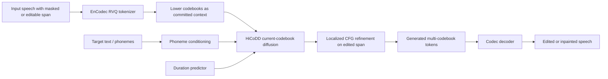
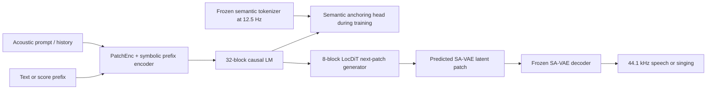
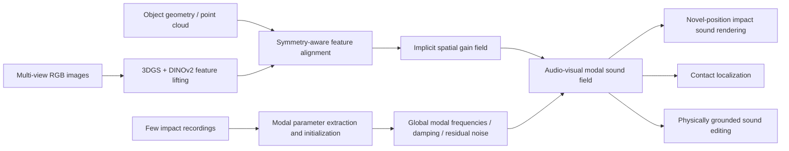
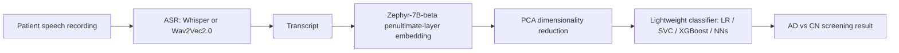
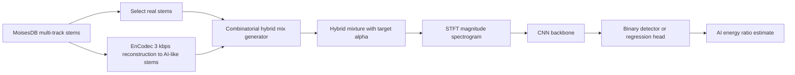

# 语音 / 音频 / 音乐论文速递
## 2026-08-10

> 实际对应 arXiv 更新日：**2026-08-10**  
> 检索范围：`cs.SD + eess.AS`  
> 只放按 ML 顶会审稿口径看，最值得多数读者花时间看的 **5 篇**

## 📋 总览

- 共收录 **5 篇** 相关论文
- 语音生成 / 语音编辑：**2 篇**
- 物理音频建模：**1 篇**
- 医疗语音 / 语言建模：**1 篇**
- 音乐生成治理 / 检测：**1 篇**

今天这批最值得优先看的，是两条很实的语音生成主线和一条很少见但完成度不错的物理音频建模线。`SIEDD` 不是把 diffusion 生搬硬套到语音编辑，而是认真处理了 `RVQ` 多码本层级，真正把 coarse-to-fine codec 结构纳入生成顺序；`SemBridge` 则代表连续 latent 自回归语音生成的一次关键补洞，它不是换更大 backbone，而是把 semantic token anchoring 做成只在训练期生效的状态监督，直接打在内容稳定性最薄弱的地方；`AV-MSF` 虽然不在主流 TTS/LLM 赛道，但它把对象级模态声场、接触定位和 sound editing 串成一个统一表示，物理建模味道很正。

剩下两篇的价值更偏“边界提醒”。`LSEAD` 的 best result 很高，但本质是 transcript embedding + PCA + 轻量分类器，它更像一篇临床部署导向的语言建模应用文，而不是传统意义上“把语音信号吃透”的 speech paper。`How Much AI Is in This Track?` 则把 AI 音乐检测从二分类推进到了连续比例回归，虽然实验对象还只是 `EnCodec 3 kbps` 重建 stem，不是真实 Suno/Udio 生产流，但它至少把“混合制作场景下的可追责检测”这个现实问题立起来了。

## 精选入选规则

- **新意（0-3）**：是不是提出了新的表示、接口、训练组织方式，或者把旧问题拆得更对
- **影响力（0-3）**：是不是贴近语音大模型、TTS、语音编辑、物理音频、音乐治理这些主线
- **证据强度（0-2）**：有没有像样的 baseline、消融和关键数值
- **受众匹配度（0-2）**：对语音大模型 / 语音前端 / 音乐方向 / 音频系统研究者有没有直接启发

分数校准：

- **6**：可读，但更像局部补丁或场景型应用
- **7**：信息量够，值得过一遍
- **8+**：建议优先精读

## 总览表

| 方向 | 序号 | 论文 | 评分 | 关键词 |
|---|---:|---|---:|---|
| 语音编辑 / 语音修复 | 1 | SIEDD | 9/10 | speech editing, speech inpainting, hierarchical RVQ, discrete diffusion |
| 语音生成 / 连续 latent AR | 2 | SemBridge | 8.5/10 | semantic anchoring, continuous latent, zero-shot TTS, SVS |
| 物理音频建模 | 3 | AV-MSF | 8/10 | modal sound field, 3DGS, contact localization, sound editing |
| 医疗语音 / 语言建模 | 4 | LSEAD | 7/10 | AD screening, transcript embedding, Zephyr-7B-beta, privacy-preserving |
| 音乐治理 / AI 检测 | 5 | AI Stem Ratio Regression | 7.5/10 | AI-generated stems, regression detection, fakeprint, MoisesDB |

## 🗣️ 语音生成 / 语音编辑

### [1] Multi Codec Discrete Diffusion Model for Text Guided Speech Inpainting and Editing

- **评分**：9/10
- **作者/机构**：Iftach Shoham, Tali Dror, Oren Gal, Haim Permuter, Gilad Katz, Eliya Nachmani；Ben-Gurion University of the Negev，University of Haifa
- **论文链接**：https://arxiv.org/abs/2608.06424
- **PDF**：https://arxiv.org/pdf/2608.06424.pdf
- **代码链接**：**代码已开源** https://github.com/iftachShoham/SIEDD

#### 📌 简介
这篇解决的是语音局部修复与文本编辑里最棘手的一类问题：你不能把整句重合成，只能改一小段，但改完以后还得保住原说话人、原录音环境、原 prosody 和前后文拼接的一致性。作者提出 `SIEDD`，核心是把 discrete diffusion 真正做进多码本神经 codec 的层级结构里，而不是假设所有 token 平铺后都能同权去噪。论文主张很明确：语音 editing / inpainting 里，`RVQ` 的 coarse-to-fine 依赖不是细节，而是生成顺序本身的一部分。

#### ☠️ 毒舌点评
这篇是真强，不是“diffusion 万能论”的语音版换皮。很多 speech editing 论文的问题在于：一边喊着要保上下文，一边还是用自回归 token infill 去赌前面几步别错；一旦多 gap 或长 gap，误差就会串着爆。`SIEDD` 至少给了一个比 AR 更像正解的方向。不过它也不是没代价，512 denoising steps 的采样开销摆在那里，所以它更像“质量上限路线”，不是今天就能轻松塞进实时产品链路的东西。

#### 🔧 技术方案
- **模型解决的问题**：传统 speech editing / inpainting 要在局部改字、补空白、修坏段时，同时满足目标文本正确、说话人不漂、边界不裂、时长合适。问题的根源在于 neural codec 的 token 不是独立平面序列，而是带强层级关系的多码本 `RVQ` 表示；如果忽略这一点，fine codebook 可能会在 coarse codebook 还没稳定前被错误提交。
- **模型架构**：
  - **输入**：待编辑或待补全语音、目标文本、需要修改的时间或文本 span、前后文 codec token。
  - **输出**：被编辑区域的多码本 codec token，解码后得到局部替换或补全后的语音。
  - **主干**：`SIEDD` 框架下的 `HiCoDD`，即 hierarchy-aware multi-codebook discrete diffusion。
  - **关键模块**：
    - `Hierarchical Multi-Codebook Diffusion`：把 lower codebooks 当作 clean committed context，只对当前 codebook 做 diffusion。
    - `Phoneme-level conditioning`：把目标文本映射到音素级条件，直接约束改字区域的内容。
    - `Localized CFG`：只在编辑 span 内随机化负条件，避免把上下文边界一起抹掉。
    - `Duration Predictor`：先决定编辑区域需要多少 codec frames，再做生成，避免长度靠运气。
- **信号流**：

- **关键设计 / 核心创新**：
  - 把 `RVQ` 生成顺序显式写进 diffusion 过程，而不是把 `K x T` token grid 扁平化。
  - 用 clean committed lower-CB context 避免 joint denoising 时 coarse/fine 信息泄漏。
  - `Localized CFG` 不是泛化版口号，而是直接针对编辑区域做 contrast，只拉目标 phoneme，不毁边界。
- **训练 / 推理策略**：
  - 与 `VoiceCraft`、`SSR-Speech` 保持同一 tokenizer 和训练数据设置，统一使用 16 kHz EnCodec 与 `GigaSpeech XL`，减少不公平成分。
  - `SIEDD` 在 `2 x RTX A6000` 上训练 `550,000` steps，约一周，优化器 `AdamW`，学习率 `1e-4`。
  - `Duration Predictor` 单独在 `LibriTTS train-clean` 上训练。
  - 评测协议沿用 `RealEdit`，并对 inpainting 额外构造不同 gap 长度与多 gap 配置。

#### 📊 实验结果
- 数据集与协议：
  - speech editing / inpainting 统一在 `RealEdit` 上做。
  - 客观指标包括 `WER`、`SIM`、`MCD`、`F0 Dist`、`Energy Dist`、`UTMOS`。
- 主要 baseline：
  - `VoiceCraft`
  - `SSR-Speech`
  - `MMS`（直接重合成的 zero-shot TTS baseline）
- `RealEdit` speech editing 主表：
  - `SIEDD`：`WER 0.121`，`SIM 0.98`，`MCD 270.0`，`F0 Dist 8.57`，`Energy Dist 0.005`，`UTMOS 3.44`
  - `VoiceCraft`：`WER 0.124`，`SIM 0.97`，`MCD 392.25`，`UTMOS 3.47`
  - `SSR-Speech`：`WER 0.146`，`SIM 0.97`，`MCD 308.3`，`UTMOS 3.45`
  - 结论很清楚：`SIEDD` 在内容准确率、speaker 保持和频谱一致性上综合最好，`UTMOS` 虽然略低于 `VoiceCraft 3.47`，但差距极小，而且接近原始未编辑语音 `3.56`。
- inpainting 表现：
  - 单一 `250 ms` gap 时，`SIEDD` 把 `MCD` 打到 `21.1`。
  - 对比 `SSR-Speech 91.3`、`VoiceCraft 191.5`，这不是小幅提升，是直接把短 gap 修复从“听着像拼接”拉回了“接近本地连续恢复”。
  - 多 gap 条件下，作者明确指出 AR baseline 的 `WER` 会明显飙升，而 diffusion 版本更稳。
- 消融：
  - single-codebook -> multi-codebook：`WER 0.186 -> 0.139`，`SIM 0.95 -> 0.97`
  - joint multi-CB -> hierarchical multi-CB：`WER 0.152 -> 0.121`
  - 去掉 `Duration Predictor`：`WER 0.121 -> 0.136`
  - 去掉 `Localized CFG`：`WER 0.121 -> 0.139`
  - 这几组 ablation 很有说服力，因为每一项都在解决不同 failure mode，而不是重复堆料。
- 是否开源：**是**

#### 💡 为什么值得看
如果你做语音编辑、语音修复或局部替换，这篇几乎是当天必读。它真正有价值的地方，不只是“diffusion 比 AR 好一点”，而是把 codec 层级结构、文本对齐、长度控制和编辑区域 guidance 全都做成了同一个设计闭环。后续不管你用不用 discrete diffusion，这篇对“局部语音修改到底该怎么建模”的启发都很强。

#### 评分：9/10
理由：问题打得准，架构设计和 error source 高度对应，baseline 公平，消融也硬。唯一扣分是采样成本仍高，实时部署难度不低。

### [2] SemBridge: Semantic Token Anchoring for Continuous-Latent Autoregressive Speech Generation

- **评分**：8.5/10
- **作者/机构**：Hanke Xie, Haopeng Lin, Jiale Qian, Dake Guo, Yuepeng Jiang, Zhichao Wang, Wenxiao Cao, Jingbin Hu；Northwestern Polytechnical University `ASLP@NPU`，Soul AI Lab
- **论文链接**：https://arxiv.org/abs/2608.07462
- **PDF**：https://arxiv.org/pdf/2608.07462.pdf
- **代码链接**：**代码已开源** https://github.com/ASLP-lab/SemBridge
- **Demo 链接**：https://tiamojames.github.io/SemBridge_Demo/

#### 📌 简介
这篇解决的是连续 latent 自回归语音生成的一块老伤口：离散 token AR 模型语义强、内容稳，但声学上限受限；连续 latent AR 模型细节更自然，但内容一致性经常漂，尤其是长文本、跨语言和 hard subset。`SemBridge` 的答案不是把连续模型做得更大，而是在训练阶段引入 semantic token anchoring，让 LM 中间层状态被一个冻结的语义 tokenizer 监督，逼它在生成连续 latent 时别把语义信息越走越稀。

#### ☠️ 毒舌点评
这篇比“continuous latent 终于追上 discrete token”那类宣传词更值得看，因为它没有试图靠嘴硬掩盖连续 latent 的内容不稳，而是老老实实补监督信号。真正聪明的是：semantic anchoring 只在训练时存在，推理时被拿掉，不增加部署负担。短板也很明确，它依然建立在 `0.8B` 主干和 `100K-120K h` 大数据之上，所以不是小团队能轻松复刻的精巧小模型。

#### 🔧 技术方案
- **模型解决的问题**：连续 latent 生成能避免离散 token 的量化瓶颈，但 autoregressive hidden state 缺乏明确语义锚点，容易在内容控制、跨语种稳定性和长序列生成上出现 drift。`SemBridge` 解决的是“如何让 continuous-latent AR 在不牺牲自然度的前提下，拿回接近 discrete-token 路线的内容稳定性”。
- **模型架构**：
  - **输入**：文本；在 `SVS` 扩展里还额外输入歌词、音高、起音和时值前缀。
  - **输出**：`SA-VAE` 连续 latent patch，进一步解码成 44.1 kHz 语音或歌声。
  - **主干**：`PatchEnc -> 32-block causal LM -> 8-block LocDiT` 的 continuous-latent autoregressive 生成器。
  - **关键模块**：
    - `SA-VAE`：把 `44.1 kHz` 波形编码成 `64` 维连续 latent，帧率 `25 Hz`。
    - `Frozen semantic tokenizer`：`12.5 Hz`，词表大小 `16,384`。
    - `Alignment projection`：Stage I 对齐 SA-VAE acoustic patch 与 semantic embedding。
    - `Semantic anchoring head`：Stage II 在指定 Transformer block 后挂监督头，记为 `Anchor@k`。
    - `LocDiT`：在最终 LM 状态条件下做 next-patch flow matching。
- **信号流**：

- **关键设计 / 核心创新**：
  - semantic token 不进入推理链路，而是只在训练时约束中间状态，这点非常关键，因为它把“语义更稳”和“部署不更重”两件事同时做到了。
  - `Anchor@24` 与 `Anchor@32` 的对比说明 anchor 位置本身是一个可控设计变量，而不是越靠后越好。
  - 通过 `SA-VAE` 的连续 latent 与语义 token 的双时间尺度对齐，建立 content control 和 acoustic richness 之间的桥。
- **训练 / 推理策略**：
  - `SA-VAE` 单独训练 `300K` updates，`3 s` 片段，batch `48`，`8 x NVIDIA H20`。
  - `SemBridge` 主模型再训练 `300K` updates，`16 x NVIDIA H20`，global batch `4096` acoustic-patch frames。
  - 优化器 `AdamW`，`bf16`，前 `5K` updates warmup 到 `1e-4`，随后 cosine decay。
  - 语义锚定损失权重 `lambda_sem = 0.1`。
  - 推理使用 `NFE=10`、`CFG=2.0`、temperature `1.0`。

#### 📊 实验结果
- 数据规模：
  - `SA-VAE` 训练：`25K h`，其中 `20K h` speech + `5K h` singing。
  - 受控组件分析：`100K h` bilingual `VoxBox`。
  - 系统级 TTS + SVS：`120K h`，即 `VoxBox + 20K h` 内部 singing。
- 模型规模：
  - 连续生成 backbone `800.15M` trainable params。
  - `SA-VAE` `86.48M`。
  - alignment projection `2.43M`，semantic anchoring head `16.79M`，且都只在训练期存在。
- 零样本 TTS 主结果：
  - `Seed-TTS-Eval`：中文 `CER 0.95 / SIM 0.758`，英文 `WER 1.81 / SIM 0.699`，中文 hard `CER 9.79 / SIM 0.717`
  - `CV3-EVAL`：中文 `CER 3.34 / SIM 0.757`，英文 `WER 4.22 / SIM 0.658`，中文 hard `CER 10.58 / SIM 0.717`，英文 hard `WER 6.35 / SIM 0.619`
  - 论文把 `F5-TTS`、`MaskGCT`、`CosyVoice2`、`CosyVoice3-1.5B`、`Spark-TTS`、`VibeVoice`、`MELA-TTS` 等都拉进来比，`SemBridge` 在内容误差上非常能打，尤其是中英混合难集。
- semantic anchoring 消融：
  - 无 alignment / 无 anchoring：`1.58 / 2.43 / 16.87`
  - 仅 alignment：`1.51 / 2.30 / 15.94`
  - 仅 anchoring：`1.21 / 2.18 / 13.97`
  - alignment + anchoring：`1.01 / 1.87 / 11.87`
  - 这组结果几乎把文章主张写死了：单有 continuous latent 不够，必须给 hidden state 一个稳定 semantic anchor。
- anchor 位置分析：
  - `Anchor@24`：`1.04 / 1.93 / 12.01`，同时 `SIM 0.747 / 0.693 / 0.704`，`ZH-hard UTMOS 2.683`
  - `Anchor@32`：`1.01 / 1.87 / 11.87`
  - 解读很有意思：更早的 anchor 在 speaker similarity 与主观质量上更稳，最后一层 anchor 在内容误差上最好。
- 超参数分析：
  - 把 `lambda_sem` 从 `0.1` 拉到 `0.5`，英文 `WER 1.87 -> 3.64`，`SIM 0.687 -> 0.623`
  - 这说明 semantic supervision 不是越猛越好，过强会压坏声学自由度。
- SA-VAE 重建与 SVS 迁移：
  - `SA-VAE` reconstruction：`PESQ 2.99`，`STOI 0.96`，`UTMOS 3.92`
  - 去掉 anchoring 时，`SVS` 的 Mandarin `CER 9.18`、English `WER 16.29`
  - 加上 anchoring 后分别降到 `8.32` 和 `14.77`
- 是否开源：**是**

#### 💡 为什么值得看
如果你关心 continuous latent speech generation，这篇基本绕不过去。它的价值不在“模型更大”或“榜单多赢一点”，而在于把 continuous latent 路线最核心的 content drift 问题拆成了可以被训练期 state supervision 修复的具体机制。对后续做连续声学 token、连续 latent LLM、TTS/SVS 统一生成的人，这篇很可能会变成标准参考。

#### 评分：8.5/10
理由：问题抓得准，设计克制且有效，结果和消融都很有说服力。扣分点是数据和算力门槛高，工程复现成本不低。

## 🔊 物理音频建模

### [3] Objects as Audio-Visual Modal Sound Fields

- **评分**：8/10
- **作者/机构**：Zisen Shao, Zihao Wei, Derong Jin, Ruohan Gao；University of Maryland, College Park
- **论文链接**：https://arxiv.org/abs/2608.05145
- **PDF**：https://arxiv.org/pdf/2608.05145.pdf
- **代码链接**：暂无明确开源
- **Demo 链接**：https://zisenshao.github.io/AV-MSF/

#### 📌 简介
这篇做的是对象级 impact sound 建模，但不是传统“给一张图预测一个声音”的花架子版本。作者提出 `AV-MSF`，目标是从多视角视觉信息和少量真实敲击录音里重建对象的 `audio-visual modal sound field`：既建全局模态参数，也建任意表面接触点上的空间 gain field，进而支持 novel-position sound rendering、contact localization 和 object sound editing。直白说，它要建的不是“一段声音”，而是“这个物体被敲在哪里会响成什么样”的完整对象级声学表示。

#### ☠️ 毒舌点评
这篇好就好在它不像很多多模态音频论文那样拿生成器炫技，而是回到物理对象本身。它有很强的“研究者在认真建模一个可解释对象”的味道。问题也明显：这个方向再漂亮，也不太会是主流 speech 赛道的爆款，因为采集门槛、对象假设和应用场景都比较专。你要是不做物理交互音频，可能不会把它放到第一优先级。

#### 🔧 技术方案
- **模型解决的问题**：要从有限的真实敲击样本中恢复对象的模态频率、阻尼、残余噪声和空间相关的激励响应，并让模型能泛化到没敲过的接触位置。作者的关键判断是：模态频率 `f_i`、阻尼 `d_i` 是对象全局属性，而接触位置相关的是 modal gain。
- **模型架构**：
  - **输入**：多视角 RGB 图像、3D 几何 / 3DGS 表示、少量真实 impact recordings。
  - **输出**：对象的 modal sound field，包括全局模态参数、噪声残差，以及任意表面位置的 gain field。
  - **主干**：`visual feature extraction + modal parameter estimation + implicit spatial gain field reconstruction`。
  - **关键模块**：
    - `3D Gaussian Splatting` 对象表示与多视角 lifting。
    - `DINOv2` dense visual feature，用于局部外观与纹理语义。
    - `symmetry-aware feature alignment`，处理旋转或镜像对称对象上的语义错位。
    - `modal parameter warm-up`，先把模态参数拉到物理可解释区域，再做全局联合优化。
    - `residual component`，专门兜住低频环境噪声和非模态成分。
- **信号流**：

- **关键设计 / 核心创新**：
  - 不是直接预测波形，而是先恢复可解释的 modal representation，这让 downstream task 不再是黑盒副产品。
  - 强调视觉语义和几何一致性，如果没有 symmetry-aware alignment，左右对称区域会被错误赋予不同语义特征。
  - residual component 的存在很关键，因为真实敲击声并不只有理想模态响应。
- **训练 / 推理策略**：
  - 主重建任务用多尺度 STFT 损失优化 rendered impact sound。
  - `ObjectFolder Real` 默认每个对象只拿 `20%` impact recordings 训练，其余用于评测。
  - `RealImpact` 因每个对象只有 `5` 个 impact positions，采用 leave-one-out cross-validation。
  - 单张 `A5000` 上训练和推理时延都有报告，说明作者考虑了实际可用性。

#### 📊 实验结果
- 数据集：
  - `ObjectFolder Real`：`100` 个真实对象，`7` 种材料，每个对象 `30-50` 次真实敲击。
  - `RealImpact`：`50` 个对象，`150,000` 次录音；每个对象 `5` 个敲击位置，每个位置有多麦采样，实验取最近麦并做 leave-one-out。
- 主结论：
  - 作者明确写到，在 `20% training-data` 设置下，相比物理和数据驱动 baseline 都取得约 `2x` improvement。
  - 这点很关键，因为它说明模型不是靠大规模监督碾压，而是在极稀疏敲击观测下仍然更稳。
- novel-position sound rendering 量化结果：
  - 文中展示的对比里，`KNN` 为 `L1 0.0135`、`L1-log 0.9724`、`ENV 0.0138`、`CDPAM 2.15e-4`
  - `Ours` 为 `L1 0.0110`、`L1-log 0.9259`、`ENV 0.0131`、`CDPAM 1.53e-4`
  - 即便这里只是表内局部摘录，也已经能看出它在重建误差和感知距离上都更优。
- downstream 应用：
  - contact localization：`DiffSound` 的 `RMED 41.78%`，`Ours 34.61%`
  - sound editing：`Generation 3.077`，`Audio-SDS 4.234`，`Ours 2.753`（`UMAP` 距离，越低越好）
  - 这说明对象级表示不是只对主任务有用，迁移到定位和编辑同样吃香。
- 消融：
  - 去掉 residual component，会把 contact localization error 从 `38.4%` 拉高到 `43.8%`
  - 去掉 DINO appearance、modal warm-up 或 feature alignment，四类指标都会退化，作者对每块设计的归因比较清楚。
- 速度与成本：
  - 单 `A5000` 上，`Ours` 训练 `0.27 h` / object，推理 `43.8 ms`
  - `SonicGauss`：`0.59 h / 3.2 s`
  - `DiffSound`：`3.16 h / 6.9 ms`
  - 这个 tradeoff 很实在：它不是最快推理，但训练和整体迭代成本远优于更重的 baseline。
- baseline 覆盖：`White Noise`、`Random Impact`、`KNN`、`DiffSound`、`SonicGauss`
- 是否开源：**暂未明确**

#### 💡 为什么值得看
如果你做物理音频、交互音效、机器人触觉听觉或 XR 对象声学，这篇非常值得读。它提供的不是一个 task-specific predictor，而是一种对象级声学表示思路：先把对象的模态结构和空间响应建起来，再把生成、定位、编辑都当成下游接口。这种建模方式的寿命通常比单个 benchmark 上的分数更长。

#### 评分：8/10
理由：问题稀缺、方法成体系、应用外延强。扣分点主要是赛道较窄，且暂无明确代码开放信息。

## 🧠 医疗语音 / 语言建模

### [4] LSEAD: A Privacy-Preserving LLM-Based Speech Analysis Framework for Early Alzheimer's Disease Screening

- **评分**：7/10
- **作者/机构**：Xin Wang, Yingchao Huang, Yuhan Su, Shanshan Yao, Wei Peng；Saskatchewan Polytechnic，Hebei University，University of Alberta，University of Regina
- **论文链接**：https://arxiv.org/abs/2608.07378
- **PDF**：https://arxiv.org/pdf/2608.07378.pdf
- **代码链接**：**代码已开源** https://github.com/kelci2017/AD_Text_LLMs

#### 📌 简介
这篇做的是早期阿尔茨海默病筛查，但技术核心并不在声学前端，而在“如何把 speech screening 变成一个轻量、隐私友好的文本表征问题”。`LSEAD` 的流程是：语音先转写，随后用 `Zephyr-7B-beta` 倒数第二层抽文本 embedding，再用 `PCA` 降维，最后交给 `Logistic Regression / SVC / XGBoost / NNs` 做 AD 与 CN 分类。作者想强调的是：在临床数据少、部署限制强、隐私约束高的场景里，不一定要堆复杂 acoustic model，语言内容本身已经足够有诊断信号。

#### ☠️ 毒舌点评
这篇的 best number 很漂亮，但“speech paper” 味道其实不重。它更像一篇临床 NLP 应用：语音只是为了拿 transcript，真正做判别的是文本 embedding + PCA + LR。好处是部署简单、可解释、对隐私友好；坏处是如果你想从中学到“语音里哪些声学退化最能提示 AD”，这篇基本帮不上忙。它值得读，但别把它误当成强语音建模论文。

#### 🔧 技术方案
- **模型解决的问题**：传统 AD speech screening 方案常常依赖人工设计的 acoustic / linguistic feature，数据少时容易不稳，且临床部署复杂。作者想解决的是“能不能用一个更轻、更统一、对隐私更友好的文本表征流程，稳定做早期认知筛查”。
- **模型架构**：
  - **输入**：患者语音录音。
  - **输出**：`AD` 或 `CN` 的分类结果。
  - **主干**：`ASR -> transcript -> LLM embedding -> PCA -> lightweight classifier`。
  - **关键模块**：
    - `ASR`：比较 `Wav2Vec2.0` 与 `Whisper` 两条转写链。
    - `Zephyr-7B-beta`：抽取倒数第二层文本表示作为主干表征。
    - `PCA`：根据方差保留阈值做降维，减少过拟合。
    - 轻量分类器：`NNs`、`SVC`、`XGBoost`、`LR` 四类。
- **信号流**：

- **关键设计 / 核心创新**：
  - 明确把 linguistic content 置于 acoustic cue 之前，这是一种很鲜明的路线选择。
  - 用倒数第二层 embedding 而不是生成答案或 prompt-based diagnosis，避免 LLM classifier 的不稳定性。
  - 分类头刻意保持轻量，强调真实临床可部署性，而不是离线榜单最大化。
- **训练 / 推理策略**：
  - 数据集使用 `ADReSS20` 和 `ADReSSo2021`。
  - embedding 固定后，主要搜索的是 `PCA` 保留比例和不同轻量分类器。
  - ROC/AUC 分析采用 `5-fold` 交叉验证。
  - 还额外做跨数据集验证，检查 pipeline 是否只记住单一 corpus。

#### 📊 实验结果
- 数据集规模：
  - `ADReSS20`：train `54 AD + 54 CN`，test `24 AD + 24 CN`
  - `ADReSSo2021`：train `87 AD + 79 CN`，test `35 AD + 36 CN`
- 分类器比较：
  - `NNs`：`Accuracy 78.2%`，`F1 76.4%`
  - `SVC`：`Accuracy 82.4%`，`F1 81.1%`
  - `XGBoost`：`Accuracy 82.4%`，`F1 81.4%`
  - `LR`：`Accuracy 90.0%`，`Precision 91.2%`，`Recall 88.1%`，`F1 89.7%`
  - 这说明最复杂的分类头并没赢，线性模型反而最稳。
- 与已有方法对比（Table 3）：
  - `Mortensen`：`84.9%`
  - `Bang`：`83.1%`
  - `Agbavor`：`80.3%`
  - `Luz`：`78.9%`
  - `LSEAD`：`90.0% / 91.2% / 88.1% / 89.7%`
  - 至少在这个 benchmark 上，它把已有 speech-based AD screening baseline 压过去了。
- LLM backbone 对比：
  - `Llama2-7B + LR`：`Accuracy 83.2%`，`F1 81.8%`
  - `Qwen3-30B + LR`：`Accuracy 87.4%`，`F1 87.0%`
  - `Zephyr-7B-beta` 主线：`Accuracy 90.0%`，`F1 89.7%`
  - ROC 上，`Zephyr` 的 `AUC 0.95 ± 0.034`，优于 `Qwen3` 的 `0.92 ± 0.035`
- ASR 对比：
  - `Wav2Vec2.0 + LR`：`Accuracy 88.2%`，`F1 87.7%`
  - `Whisper + LR`：`Accuracy 90.0%`，`F1 89.7%`
  - 这也说明这个 pipeline 对 transcript 质量相当敏感。
- 跨数据集泛化：
  - `train ADReSS20 -> test ADReSSo2021`：`LR 87.4% / F1 86.7%`
  - `train ADReSSo2021 -> test ADReSS20`：`LR 87.3% / F1 86.6%`
  - 对这类小样本医疗任务来说，这个 cross-dataset 结果已经算不错。
- baseline 讨论：
  - 这里真正的 baseline 不是更复杂 speech model，而是不同 `LLM embedding + classifier + ASR` 组合。
  - 换句话说，这篇赢的关键不是声学建模突破，而是“哪个文本表征更有临床辨别力”。
- 是否开源：**是**

#### 💡 为什么值得看
如果你做医疗语音筛查、认知退化分析或小样本临床部署，这篇很值得看，因为它证明了一个常被忽略的现实：在数据极少、流程要可部署的条件下，`transcript embedding + lightweight classifier` 可能比你费劲做一套复杂 acoustic pipeline 更稳。但如果你的兴趣点是语音本体建模，这篇更适合作为边界案例，而不是主线技术路线。

#### 评分：7/10
理由：临床部署取向很明确，结果也不虚。扣分点是语音信息被极大压缩成文本，method novelty 更偏应用整合而非 speech modeling 本身。

## 🎼 音乐生成治理 / 检测

### [5] How Much AI Is in This Track? Quantifying the Proportion of AI-Generated Stems in Hybrid Music Mixtures

- **评分**：7.5/10
- **作者/机构**：Fernando Garcia de la Cruz, David López-Ayala, Pablo Zinemanas, Emilio Molina, Martín Rocamora；Universitat Pompeu Fabra，BMAT Licensing
- **论文链接**：https://arxiv.org/abs/2608.07285
- **PDF**：https://arxiv.org/pdf/2608.07285.pdf
- **代码链接**：**代码已开源** https://github.com/fergarciadlc/aria

#### 📌 简介
这篇做的是 AI 音乐检测，但把问题从“整首歌是不是 AI”改成了“这首混音里有多少比例的 stem 是 AI 重建出来的”。作者认为真实制作场景越来越像 hybrid workflow：鼓是 AI，贝斯是真人，和声是 AI stem，主唱又是真录。传统二分类 detector 对这种场景不够用，于是他们把检测目标改写成连续比例回归 `alpha in [0,1]`，并用多轨数据构造了可控的 hybrid mixture 训练集。

#### ☠️ 毒舌点评
这篇选题很现实，也比“又做一个 99% 准确率的 AI detector”高级得多。它的亮点在于承认 production workflow 已经不是纯人类 / 纯 AI 二元世界。问题也不能回避：实验里所谓 AI stem 其实是 human stem 经过 `EnCodec 3 kbps` 重建后的 proxy，不是真正 Suno/Udio 输出 stem。所以它更像一个治理研究的起跑线，而不是现在就能落地审计全球音乐平台的终局方案。

#### 🔧 技术方案
- **模型解决的问题**：现有 detector 多在完整歌曲级别做 binary classification，但现实制作里是多 stem 混用，且不同 stem 的能量占比不同。作者要解决的是“在混合音轨里估计 AI 生成内容的连续占比，而不是只输出一个是/否标签”。
- **模型架构**：
  - **输入**：由多轨 stem 混合得到的音频窗口。
  - **输出**：连续的 AI energy ratio `alpha`。
  - **主干**：与既有 detector 相同骨干的 `CNN spectrogram model`，分别训练分类版和回归版。
  - **关键模块**：
    - `AI reconstruction pipeline`：用 neural audio codec 将真实 stem 重建为 AI-like proxy stem。
    - `combinatorial mix generation`：对每首歌的 `n` 个 stem 枚举 `2^n` 组 real/AI 组合。
    - `binary detector`：复现已有二分类方案，观察其输出能否隐式跟踪 `alpha`。
    - `regression detector`：直接监督 `alpha` 回归。
- **信号流**：

- **关键设计 / 核心创新**：
  - 把二分类改成比例回归，这个问题定义本身就比大多数 detector 论文成熟。
  - 不只看整体 track，还专门分析 `vocals / drums / bass / guitar` 四类 stem 的 detectability 差异。
  - 引入 `fakeprint` 分析，把检测结果和具体频段伪迹联系起来，而不是只报一个 accuracy。
- **训练 / 推理策略**：
  - 基础 detector 使用 `6-block CNN`，对 magnitude spectrogram 建模。
  - binary head 用 `sigmoid + BCE`，regression head 用同 backbone 直接拟合 `alpha`。
  - 评测同时比较 `1 s` 与 `5 s` 窗口长度，分析 detector 对时间粒度的依赖。
  - 通过 `ARIA` 库从本地 `MoisesDB` 自动构造混合样本，保证可复现实验。

#### 📊 实验结果
- 数据与实验设置：
  - 数据源是 `MoisesDB` 的 `240` 首专业制作多轨歌曲。
  - 常用 `4` 类 stem：`vocals`、`drums`、`bass`、`guitar`。
  - AI proxy stem 由 `EnCodec 3 kbps` 重建得到。
- binary detector 复现实验：
  - 在 held-out `FMA` 上，二分类 detector 仍然能做到 `99.97% accuracy`、`99.98% F1`
  - 但这不代表它能处理 hybrid mixture，因为纯端点分类强，不等于中间比例估计准。
- regression vs binary：
  - `5 s` 窗口下，regression 模型：`MAE 0.076`，`RMSE 0.102`，`R² 0.85`，`Pearson 0.93`
  - 同条件下 binary detector 的隐式估计：`MAE 0.289`，`R² -0.85`
  - 论文直接指出，`R² < 0`` 意味着它比始终预测均值还差。
  - `1 s` 窗口下，regression 模型仍有 `MAE 0.104`、`R² 0.78`，而 binary detector 只有 `R² -0.19`
  - 这几组数基本坐实了：binary score 不能拿来冒充连续比例估计。
- stem 级 detectability：
  - `drums` 和 `guitar` 最容易检，AI/real 分布分离明显。
  - `vocals` 只部分可分。
  - `bass` 几乎检不出来。
  - 这说明“AI 多少”不仅和比例有关，还和具体替换了哪类 stem 高度相关。
- fakeprint 分析：
  - `drums` 在约 `2500 Hz` 以上，AI 曲线显著高于 real。
  - `guitar` 在 `500-1500 Hz` 区间 AI 低于 real，而在 `2500 Hz` 以上又明显高于 real。
  - `bass` 几乎看不到可靠分离，和 detector 的差表现一致。
- 局限：
  - 只验证了 `EnCodec 3 kbps`，没有测试 `DAC`、`Suno`、`Udio` 等真实生成器。
  - 没覆盖真实制作后处理，如 `EQ`、`compression`、`leveling`。
  - 论文自己也承认，目前结论的外推边界仍然有限。
- baseline 覆盖：
  - 相关工作包括 `Afchar et al.` 的 binary CNN detector 与 `SpecTTTra` 等 AI-music detector
  - 但本文真正核心对比，是同一 `CNN backbone` 下的 `binary vs regression` 目标差异
- 是否开源：**是**

#### 💡 为什么值得看
如果你关心 AI 音乐治理、内容归属、平台审核或者未来的版权审计工具，这篇很值得看。它最重要的贡献不是把指标刷高，而是把问题从“真假检测”推进到“比例估计”。这个改写会直接影响后面怎么设计审计接口、申诉流程和平台透明度机制。哪怕它现在还只是 `EnCodec proxy` 世界里的第一步，这个问题定义本身就已经比很多 detector 论文更像未来会用到的东西。

#### 评分：7.5/10
理由：问题定义好，分析维度细，开源也到位。扣分点是实验对象还偏 proxy，离真实生成音乐生态仍有一段距离。

## 最后结论

如果只看“今天必须先读哪两篇”，我会优先给 `SIEDD` 和 `SemBridge`。前者代表语音编辑里一个很像正确方向的质量上限路线，后者则是在连续 latent 语音生成里把 semantic stability 这根短板补得最像回事的一篇。它们共同的特点是：都不是堆概念，而是围绕已有主流路线里最痛的 failure mode 精准动刀。

第三优先级我会给 `AV-MSF`。它不一定是最热的赛道，但方法完成度高，而且对象级可解释表示很稀缺。`LSEAD` 和 AI stem ratio 这两篇更像“边界拓展型论文”：一个提醒大家 speech 应用里别忽视 transcript-only 路线，一个提醒大家音乐平台上的 AI 审计不能永远停在二分类。整体看，2026-08-10 这批的亮点不在大而全，而在每篇都比较明确地补了一个老问题的结构性短板。
