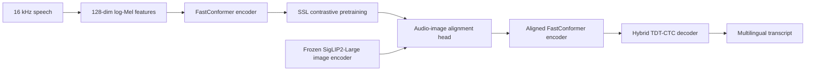
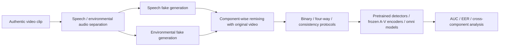
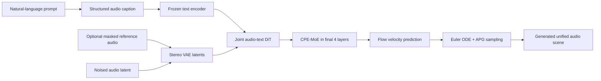
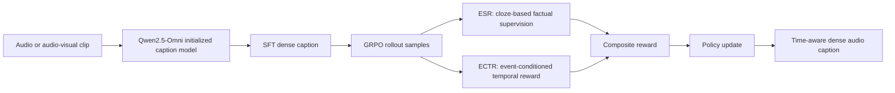
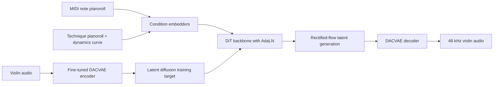

# 语音 / 音频 / 音乐论文速递
## 2026-08-11

> 实际对应 arXiv 更新日：**2026-08-11**  
> 检索范围：`cs.SD + eess.AS`  
> 只放按 ML 顶会审稿口径看，最值得多数读者花时间看的 **5 篇**

## 📋 总览

- 共收录 **5 篇** 相关论文
- 语音识别 / 多语种 ASR：**1 篇**
- 音频安全 / deepfake 检测：**1 篇**
- 统一音频生成 / 复杂场景生成：**1 篇**
- 音频理解 / dense captioning：**1 篇**
- 音乐生成 / 演奏合成：**1 篇**

今天这批最值得先看的，不是“谁参数更大”，而是三条更硬的路线。`SraVaani 1.0` 真正在做长尾语言覆盖，不是只在印地语和英语上继续内卷；`SonicWeave` 则把 unified audio generation 里最难的局部冲突问题拆成了可验证的 chunk routing，而不是一句“MoE 更强”就糊弄过去；`AudioMap` 的价值在于它终于把 RL captioning 从“一个大模型打一个总分”的玄学，改成了可定位错误的 cloze-and-choice reward。`MADBench` 虽然是 benchmark paper，但它问对了问题：真实攻击里 speech fake 和环境音 fake 根本不是一回事。`VIOLET` 的覆盖面最窄，却是今天最像“把可控音乐生成问题说清楚”的一篇。

## 精选入选规则

- **新意（0-3）**：是不是提出了新的表示、接口、训练组织方式，或者把旧问题拆得更对
- **影响力（0-3）**：是不是贴近语音大模型、ASR、音频安全、统一生成、音乐生成这些主线
- **证据强度（0-2）**：有没有像样的 baseline、消融和关键数值
- **受众匹配度（0-2）**：对语音大模型 / 语音前端 / 音频生成 / 音乐方向研究者有没有直接启发

分数校准：

- **6**：可读，但更像局部补丁或评测材料
- **7**：信息量够，值得过一遍
- **8+**：建议优先精读

## 总览表

| 方向 | 序号 | 论文 | 评分 | 关键词 |
|---|---:|---|---:|---|
| 多语种 ASR / 包容性语音识别 | 1 | SraVaani 1.0 | 9/10 | FastConformer, audio-image alignment, long-tail languages, Indic ASR |
| 音频安全 / deepfake 检测 | 2 | MADBench | 8/10 | component-aware detection, speech vs ambience, AUC, audio-visual forensics |
| 统一音频生成 / 复杂场景 | 3 | SonicWeave | 8.5/10 | chunk-routed MoE, structured caption, flow matching, complex scene |
| 音频理解 / dense captioning | 4 | AudioMap | 8.5/10 | TDAC, ESR, ECTR, GRPO, AudioMapCap-44K |
| 音乐生成 / 演奏合成 | 5 | VIOLET | 8/10 | violin synthesis, technique control, dynamics control, latent diffusion |

## 🧠 语音识别 / 多语种 ASR

### [1] SraVaani 1.0: Scaling Inclusive Speech Recognition for Indic Languages

- **评分**：9/10
- **作者/机构**：Sujith Pulikodan, Agneedh Basu, Pavan Kumar J, Pranav D Bhat, Suryansh Shukla, Nihar Desai, Prasanta Kumar Ghosh；SPIRE Lab, Indian Institute of Science (IISc), Bangalore；ARTPARK@IISc
- **论文链接**：https://arxiv.org/abs/2608.08235
- **PDF**：https://arxiv.org/pdf/2608.08235.pdf
- **模型链接**：https://huggingface.co/ARTPARK-IISc/SraVaani-1.0
- **代码链接**：暂无公开训练仓库

#### 📌 简介
这篇最重要的点不是“又训了一个 Indic ASR”，而是它把“包容性”做成了真正有证据的工程目标。作者不是只在 22 个主流语种上刷 WER，而是直接把长尾 tribal language、regional dialect 和 code-switched benchmark 一起拉进来，做一个覆盖 `65` 个标注语种 / 方言、并额外触达 `44` 个无公开对照系统语言的多语种 ASR。更关键的是，它不是单阶段监督训练，而是用了三阶段流水线：大规模无标注语音 SSL、转录无关的 audio-image alignment、最后再上 multilingual ASR fine-tuning。

#### ☠️ 毒舌点评
这篇是真有野心，而且不是 PPT 式野心。很多所谓“多语种公平性”论文，最后只是把高资源语种再练强一点，顺手带几个低资源语种陪跑；这篇至少真的把 long-tail coverage 当主任务来做。缺点也不是没有：论文在 `VAANI` 预训练数据口径上有轻微不一致，摘要写 `31,255` 小时，正文第 3.1 节过滤后统计是 `29,912` 小时，说明数据记账还不够完全工整。但这不是方向性硬伤，更多是大规模数据工程的文档瑕疵。

#### 🔧 技术方案

- **模型解决的问题**：
  现有 Indic ASR 系统大多覆盖 `22` 个左右的主流语种，对更长尾的方言和 tribal language 几乎没公共能力；而这些语种又往往缺标注、缺公开 benchmark、缺转写资源。SraVaani-1.0 解决的是“如何在缺标注但有海量自发语音和图片提示数据的前提下，把一个多语 ASR 真正拉到长尾语言覆盖层面”。

- **模型架构**：
  - **输入**：`16 kHz` 语音，提取为 `128` 维 log-Mel filterbank，`25 ms` Hann window，`10 ms` frame shift，`512` 点 FFT。
  - **输出**：多语种转写文本，用统一 decoder 处理多语言语音输入。
  - **主干**：`FastConformer encoder + audio-image alignment head + Hybrid TDT-CTC decoder` 的三阶段训练体系。
  - **关键模块**：
    - `FastConformer` 编码器：`17` 层、模型维度 `1024`、`8` 个 attention heads、卷积核大小 `9`、前端 `8x` depthwise-strided subsampling。
    - `wav2vec 2.0` 风格 contrastive SSL：连续 target，不开 vector quantizer，每个 masked position 对抗 `50` 个 batch 内负样本。
    - `SigLIP2-Large patch16-384` 视觉编码器：冻结使用，通过 attention pooling 把音频压成 `16` 个 tokens，再和视觉 patch embeddings 做 `MaxSim + sigmoid contrastive` 对齐。
    - `EncDecHybridRNNTCTCBPEModel`：TDT 与 CTC 联合训练，`λ_CTC = 0.3`。
    - 全流程实现基于 `NVIDIA NeMo`。

- **信号流**：

- **关键设计 / 核心创新**：
  - 不是只靠 SSL 预训练后直接 fine-tune，而是在中间插入一个 **完全 transcription-free 的 audio-image alignment 阶段**，用图片提示给语音编码器注入更多语义先验。
  - 目标不是多语种平均分更好看，而是把 **公开系统没有覆盖的 44 个语言 / 方言** 一起评出来。
  - 训练和评测都明确承认长尾分布：既报告与强基线共享语言上的主战场成绩，也单独把 unique language coverage 拿出来讲。

- **训练 / 推理策略**：
  - 论文摘要口径：第一阶段在 `31,255` 小时无标注 VAANI 语音上做 SSL 预训练。
  - 正文第 3.1 节过滤后口径：VAANI 可用语音为 `29,912` 小时，包含 `21,087,852` 条 utterances，覆盖 `105` 个语言和方言。
  - 第二阶段 audio-image alignment 使用 `11.85M` 配对 audio-image samples、`287K` 唯一图片、总计 `16,580.36` 小时音频。
  - 第三阶段监督 fine-tune 用 `31,263` 小时标注语音，来自 `24` 个公开数据集，覆盖 `65` 个语言和方言。
  - 推理阶段使用 batched greedy `TDT` decoding；SSL 对比损失在监督阶段关闭。

#### 📊 实验结果

- 评测基准共 `8` 套：`Common Voice`、`FLEURS`、`IndicTTS`、`Kathbath`、`RESPIN`、`GramVaani`、`MUCS`、`VAANI`。
- 主要对比基线：`IndicConformer-600M-Multilingual`、`Sarvam Saaras v3`、`Gemini 3 Flash`。
- 在有可比对手的 `17` 个 Indic 语言上：
  - `SraVaani-1.0` 平均 `WER = 28.4`，是三套系统里最低。
  - 在 `10 / 17` 个语言上拿到最优。
  - 按 language-dataset pair 统计，在 `68` 个可比 pair 里拿到 `28` 个最优。
- 在独有语言覆盖上：
  - `44` 个语言 / 方言没有其他公开 baseline。
  - 其中论文单列 `32` 个测试时长至少 `0.1h` 的语言，`WER` 中位数 `50.65`，均值 `50.2`。
  - 代表性最好结果包括 `Garo 9.5`、`Mizo 25.3`、`Khariboli 27.0`。
- 对基线覆盖范围的现实判断：
  - `IndicConformer-600M-Multilingual` 与 `Sarvam Saaras v3` 本质上都主要覆盖 `22` 个计划语言。
  - SraVaani 的真正优势不是把公开大语种再拉低 `0.3` 个点，而是把公开系统几乎不碰的长尾语言也纳入统一管线。
- 论文自己的结论很克制：高资源共享语种上，专用系统依然能在部分 split 上很强；但一旦看 coverage 和平均 WER，SraVaani 的整体价值更大。

#### 💡 为什么值得看
如果你做多语种 ASR、低资源语音建模、或任何“想把系统从大语种扩到长尾语种”的工作，这篇都值得看。它的核心价值不是一个更花哨的 encoder，而是把 **无标注语音、图片提示和多源公开语料** 组织成了一条真能打长尾语言覆盖的流水线。哪怕你不做印度语言，这种“中间插一层 transcription-free semantic alignment 再做 supervised ASR”的思路，对很多缺标注语种都很有借鉴意义。

## 🛡️ 音频安全 / Deepfake 检测

### [2] MADBench: A Benchmark for Modality-Aware Audio Deepfake Detection

- **评分**：8/10
- **作者/机构**：Yanqiu Li, Yang Xiao, Jisheng Bai, Bin Chen, Hong Jia, Ting Dang；The University of Melbourne；Xi’an University of Posts and Telecommunications；The University of Auckland
- **论文链接**：https://arxiv.org/abs/2608.09593
- **PDF**：https://arxiv.org/pdf/2608.09593.pdf
- **代码链接**：正文未给出正式仓库

#### 📌 简介
这篇不是做一个新的 detector，而是先把 deepfake 音频安全里一个被长期忽略的问题钉死：**speech fake** 和 **environmental audio fake** 根本不是同一种伪造。现实攻击者完全可以保持视频画面不变，只改说话内容，再把背景音一并伪造到看上去合理。现有 benchmark 和 detector 往往把整条 audio stream 当成一个二元 real/fake 标签来做，结果就是谁也说不清 detector 到底是在抓 speech artifact，还是在抓背景音的不自然。MADBench 的作用，就是把这个问题拆开、标注开、系统评出来。

#### ☠️ 毒舌点评
这是很典型的“benchmark 比很多模型论文更重要”的文章。它没有装作自己发明了更强 detector，而是先问清楚社区到底在测什么。最大的优点是问题设定对真实攻击场景更像人话：视频真、音频分组件假。缺点也有，它本身不提供新 detector，想立刻拿更高分的人看完会有点失望。但如果 benchmark 问题都设错了，你后面刷出来的 SOTA 其实就是错题高分。

#### 🔧 技术方案

- **模型解决的问题**：
  现有音频或音视频 deepfake benchmark 大多把“音频被改了”压成一个总标签，无法回答三件关键事：假 speech 好不好检、假环境音好不好检、以及假环境音会不会反过来妨碍 speech deepfake detection。MADBench 解决的就是这个 component-aware evaluation 缺口。

- **模型架构**：
  - **输入**：真实视频、分离后的 speech 与 environmental audio，以及基于不同生成方式合成出来的 speech fake / environmental fake。
  - **输出**：component-level deepfake 标签、binary / four-way 分类分数、scene consistency 相关检测结果。
  - **主干**：一个 component-aware benchmark pipeline，而不是单个新模型。
  - **关键模块**：
    - 组件拆分：把 speech 与背景音分开操控，视觉流保持不变。
    - scene consistency 轴：分 `scene-matched` 和 `scene-mismatched` 两种设置，测模型是靠低层 artifact 还是靠高层跨模态一致性。
    - 环境音三种生成路线：`Text-to-Audio`、`Video-to-Audio`、`Audio-to-Audio`。
    - 统一评测对象：task-specific pretrained detectors、frozen audio-visual encoders、omni multimodal models。
    - cross-component analysis：显式量化“假环境音是否会遮蔽 speech-specific cue”。

- **信号流**：

- **关键设计 / 核心创新**：
  - 把 **speech manipulation** 和 **environmental manipulation** 变成独立变量，而不是一个合并标签。
  - 再加一条正交的 **scene-consistency axis**，分清模型到底是在抓“伪造痕迹”还是在抓“声音和画面不匹配”。
  - 真实样本也用同一套分离再重混流程构造，避免标签泄漏成“假样本加工更多”这种伪难度。

- **训练 / 推理策略**：
  - 这篇论文本身不训练新 detector，重点是统一 protocol。
  - speech 与环境音分别通过多种生成路线构造，环境音分支明确覆盖 `AudioLDM2-TTA`、`AudioGen`、`MMAudio`、`FoleyCrafter`、`AudioX`、`AudioLDM2-ATA` 等路线。
  - 评测对象覆盖：
    - task-specific pretrained detectors；
    - frozen A-V encoders，如 `ImageBind A-V`；
    - omni models，如 `Qwen2.5-Omni-7B`、`MiniCPM-o 4.5`、`Gemma-4-E4B-it`。
  - 作者还专门跑了 audio-only 设置，测试“视频到底有没有实质帮助”。

#### 📊 实验结果

- 数据构造规模：
  - source-level 质量控制后保留 `1,892` 个 generation-eligible source clips。
  - 最终得到 `16,536` 条音视频样本，覆盖 `3` 类协议。
- 对现成 detector 的打击非常直接：
  - 三个 pretrained detectors 在 binary direct transfer 上几乎接近随机，平均 `AUC` 只有 `0.518–0.534`。
  - 论文甚至给这些 frozen features 又挂了 benchmark-specific binary head，仍然只多出 `0.012 AUC` 左右，说明问题不是 head 太弱，而是表示本身就没学到有用 cue。
- frozen A-V encoders 反而最稳：
  - binary classification 平均 `AUC` 都在 `0.91+`。
  - 例如 `ImageBind A-V` 四路 binary 结果约 `0.912 / 0.912 / 0.918 / 0.914`。
  - 这很打脸“专用 deepfake detector 一定更强”的默认叙事。
- omni 模型并不神：
  - `MiniCPM-o 4.5` 是最好的 omni baseline，但平均也只有 `AUC 0.618`。
  - 这离真正可用 forensic system 还差得很远。
- component-aware 结论最重要：
  - 环境音伪造整体上 **比 speech 伪造更容易检测**。
  - `ImageBind` 的 paired vs shuffled scene consistency `AUC` 从 `0.744` 掉到 `0.705`，说明模型确实能利用 scene consistency，但不是全部靠它。
  - 作者进一步分析发现：**fake environmental audio 会显著干扰 speech deepfake detection**，反过来影响却不明显。这正是旧 benchmark 完全测不出来的结论。
- baseline 覆盖足够广：
  - `ImageBind A-V`
  - `Qwen2.5-Omni-7B`
  - `MiniCPM-o 4.5`
  - 多个 pretrained A-V detectors

#### 💡 为什么值得看
如果你做 audio deepfake detection、AV forensics，或者准备在产品里吹“可以识别 AI 伪造音频”，这篇几乎是必读。它提醒你：把整条音轨压成一个 fake label，本质上是在糊弄。MADBench 的价值不在分数，而在于它把检测目标拆成了更符合真实攻击面的组件级问题，这会直接影响后续数据集怎么建、模型到底该看什么 cue、以及系统到底能不能抗组合式伪造。

## 🎛️ 统一音频生成 / 多场景生成

### [3] SonicWeave: Chunk-Routed Mixture-of-Experts for Unified Audio Scene Generation

- **评分**：8.5/10
- **作者/机构**：Yunrui Cai, Xu Li, Yucheng Zhou, Jinchao Li, Dingdong Wang, Dongchao Yang, Xixin Wu, Chen Zhang, Zhiyong Wu, Pengfei Wan, Helen Meng；Kling Team, Kuaishou Technology；The Chinese University of Hong Kong；Shenzhen International Graduate School, Tsinghua University
- **论文链接**：https://arxiv.org/abs/2608.09571
- **PDF**：https://arxiv.org/pdf/2608.09571.pdf
- **项目主页**：https://caiyunrui.github.io/SonicWeave
- **代码链接**：正文未给正式仓库

#### 📌 简介
这篇是少数真正把 unified audio generation 当成“复杂场景组合问题”来做的论文。它不满足于 speech 一套模型、music 一套模型、sfx 一套模型，而是想用一套权重同时生成 speech、music、sound effects、singing，以及这些成分彼此重叠、相互遮蔽、前后景关系明确的复杂音频场景。核心方法叫 `CPE-MoE`，重点不是单纯稀疏激活，而是 **chunk-level routing + prior/evidence conflict gate**：全局文本意图决定大方向，局部声学状态决定哪里该偏离大方向。

#### ☠️ 毒舌点评
这篇比很多“统一生成”论文硬的地方，是它没有只拿几个开放 benchmark 做表演，而是给了 `Dense (1B)` 和 `Base-MoE (2B)` 两个受控对照。也就是说，它不是在拿一堆不同模型、不同数据、不同参数量互相比空气，而是尽量把变量压到 routing 设计本身。短板同样明显：训练数据是内部 `20,000+` 小时大语料，这种资源门槛天然削弱了复现友好度。所以这更像“强工业研究”，不是人人都能周末复刻的学术玩具。

#### 🔧 技术方案

- **模型解决的问题**：
  统一音频生成最难的不是“一个模型能不能同时学 speech 和 music”，而是 **同一条 clip 内局部区域的计算需求互相冲突**。说话段需要语言精度，背景雨声需要纹理连续性，瞬态音效又需要局部强适应。Dense DiT 对所有帧一视同仁，token-wise MoE 又太碎，容易破坏音频局部连续性。SonicWeave 解决的就是这个局部条件计算问题。

- **模型架构**：
  - **输入**：自然语言 prompt，经结构化后变成统一的 audio caption；可选 masked reference latent 用于 continuation / inpainting。
  - **输出**：speech、music、sfx、ambience、singing 可混合的音频场景。
  - **主干**：`stereo VAE + joint audio-text DiT + CPE-MoE in final layers + flow matching sampler`。
  - **关键模块**：
    - `structured audio caption interface`：把自由文本转成 `summary / type / lang / speech / lyrics / speaker / music / sfx / ambience / texture` 等字段。
    - `joint audio-text DiT`：音频 latent 和文本 token 联合建模。
    - `modality-decoupled RoPE`：文本位置和音频位置分开编码，避免 caption 长度影响音频坐标。
    - `phase-aware AdaLN`：全局条件不仅看文本，还看 diffusion phase。
    - `CPE-MoE`：最后 `4` 层 FFN 改成 chunk-routed MoE，`4` 个 experts、每个 valid chunk 选 top-`2`、chunk size `C=4` latent frames。
    - `conflict gate`：在 text-derived global prior 和 evolving acoustic evidence 之间自适应加权。

- **信号流**：

- **关键设计 / 核心创新**：
  - **chunk routing 而不是 token routing**：每个 chunk 共享一条 expert 路径，保住短程声学连续性。
  - **prior/evidence 双路路由**：文本与扩散阶段给全局意图，当前局部声学状态给实时证据，再用 learned gate 融合。
  - **结构化 prompt 是规范化接口，不是平白编信息**：字段里没有的事件不允许凭空生成，这一点对复杂场景控制很关键。
  - **`C=4` 明确优于 `C=8`**：作者不是随便拍脑袋选 chunk size，而是真的做了 chunk-size ablation。

- **训练 / 推理策略**：
  - 训练使用内部语料，规模超过 `20,000` 小时，采样为约 `5M` 条 `10–15s` clip。
  - 数据分布明确写出：`20% speech`、`5% singing`、`10% music`、`10% sound effects`、`55% mixed recordings`。
  - 受控对照 `Dense`、`Base-MoE` 与 SonicWeave **使用同样数据分布、DiT backbone、text encoder 和训练 budget**，只换 FFN / routing。
  - 推理使用固定步数 Euler ODE solver 和 `APG` guidance。
  - appendix 还专门分析了 fixed gate、`C=8`、routing 可视化和 phase-conditioned dispatch。

#### 📊 实验结果

- 公开 benchmark 覆盖：
  - TTS：`SeedTTS-eval`、`LibriSpeech-PC`
  - TTA：`AudioCaps`
  - TTM：`MusicCaps`、`Song Describer`
  - 复杂场景：`100` 个 prompts 的 Complex-Scene suite
- TTS 结果很硬：
  - `SeedTTS-en WER 1.0%`
  - `SeedTTS-zh CER 0.8%`
  - `LibriSpeech WER 2.4%`
  - 相对 `Dense` 分别提升 `1.4 / 1.0 / 2.5` 个点。
  - 相对 `Base-MoE` 也有 `0.4 / 0.3 / 0.8` 个点提升。
- TTA `AudioCaps`：
  - `FAD 2.75`
  - `KL 1.26`
  - `CLAP 0.475`
  - 论文明确说它不是每项都绝对第一，但三项整体最均衡，优于两个受控基线。
- TTM：
  - `MusicCaps`：`CLAP 0.312`、`KL 1.06`
  - `Song Describer`：`CLAP 0.36`、`KL 0.44`
- Complex-Scene 是最有说服力的部分：
  - `SonicWeave MOS-R 4.49 ± 0.38`
  - `Base-MoE MOS-R 4.31 ± 0.31`
  - `Dense MOS-R 4.15 ± 0.37`
  - 外部强基线 `Higgs Audio V2 MOS-R 2.42 ± 0.64`
  - 论文直接总结：相对 `Base-MoE` 提升 `0.18`，相对最强外部基线提升超过 `1.2` 分。
  - 同时它在 Complex-Scene reference-free judge 上拿到 `AI-Tech 4.79`、`AI-Sem 4.72`。
- 路由消融也说人话：
  - `Fixed gate (g_j = 0.5, C=4)` 会把 TTS、AudioCaps、Song Describer 和 Complex Scene 全线拖垮。
  - `C=8` 虽然 global coherent content 还过得去，但对短事件、speaker turn 和 foreground-background 关系反应明显更迟钝。

#### 💡 为什么值得看
如果你做 unified audio generation，这篇很值得精读，因为它真正把“统一”理解成 **复杂场景里的局部异构计算问题**，而不是一句“共享 backbone 更省事”。它最有价值的不是某个开放 benchmark 第一，而是那套受控实验：Dense、token-routed MoE、fixed gate、`C=8` 都比过了，说明作者知道自己到底在改什么。就算你复现不了它的内部数据规模，`chunk routing + structured caption + prior/evidence gate` 这套设计思路也很容易迁移到别的统一生成系统里。

## 🧾 音频理解 / Dense Captioning

### [4] AudioMap: Cloze-and-Choice Reinforcement Learning for Time-Aware Dense Audio Captioning

- **评分**：8.5/10
- **作者/机构**：Yan Rong, Fengji Ma, Xu Li, Jinting Wang, Chen Zhang, Li Liu；The Hong Kong University of Science and Technology (Guangzhou)；Kling Team, Kuaishou Technology
- **论文链接**：https://arxiv.org/abs/2608.09559
- **PDF**：https://arxiv.org/pdf/2608.09559.pdf
- **代码链接**：https://github.com/ryysayhi/AudioMap

#### 📌 简介
这篇做的是 `time-aware dense audio captioning`，也就是不仅要描述 clip 里发生了什么，还要把多个事件、属性和时间边界一并说对。作者的判断很准：这种任务最大的问题不是 backbone 不够大，而是训练目标太糙。用普通 SFT 学 caption，模型会写得像样，但不一定细、不一定准、也不一定真的把时间和事件绑定对。AudioMap 的核心改动，是把 RL 奖励从“整段 caption 打一个总分”改成了 **localized cloze-and-choice supervision**，让模型在哪个事件漏了、哪个属性编了、哪个时间对错都能被局部追责。

#### ☠️ 毒舌点评
这篇最难得的是它真的知道 RL captioning 的老毛病在哪。太多工作嘴上说 RL 很强，最后其实只是找个 judge 模型打一个整体分数，模型学到的是讨好 judge，不是补事实。AudioMap 至少认真把奖励拆细了，而且实验也证明这种拆法不只是理论好听。缺点是成本很高：你得有大 examiner、得有精细数据、还得能承受 GRPO rollout，这条路线并不便宜。

#### 🔧 技术方案

- **模型解决的问题**：
  传统 audio captioning 常把整条音频压成一句摘要；而 TDAC 需要同时处理多事件、多属性、多关系、带时间边界的长描述。现有 SFT 与粗粒度奖励都很难同时约束“事实是否充分”和“时间是否对齐”。AudioMap 解决的是 **free-form dense audio caption 怎么做可验证、可优化的 RL**。

- **模型架构**：
  - **输入**：audio-only 或 audio-visual clip。
  - **输出**：包含事件、属性、关系和时间边界的 dense caption。
  - **主干**：`Qwen2.5-Omni` 初始化的 caption model，加上 `SFT + GRPO` 后训练。
  - **关键模块**：
    - `ESR (Evidence Sufficiency Reward)`：把 caption 事实拆成多维 multiple-choice cloze 问题，局部检查证据是否充分。
    - `ECTR (Event-Conditioned Temporal Reward)`：不再只比字符串时间戳，而是对指定事件抽取时间区间，用 `tIoU` 评分。
    - `AudioMapCap-44K`：首个 time-aware fine-grained audio captioning 数据集。
    - `two-stage GRPO curriculum`：先学语义覆盖，再加时间约束。
    - `Qwen3.6-27B examiner`：冻结作为 ESR / ECTR 的 judge。

- **信号流**：

- **关键设计 / 核心创新**：
  - `ESR` 的价值在于：它不再把“少说一个细节”和“胡编一个错误细节”当成同一种错。
  - `ECTR` 的价值在于：时间对齐不是孤立字符串，而是 **事件语义 + 时间边界** 的联合约束。
  - 奖励设计本质上把 caption task 从“大语言模型写作文”变成“可定位事实与时间错误的结构化推理任务”。
  - 论文还把 reward robustness 单独拎出来做了 judge family ablation，不是只挑一个 judge 就开始吹。

- **训练 / 推理策略**：
  - 初始化模型：`Qwen2.5-Omni`。
  - `AudioMapCap-44K` 最终包含 `43,870` 对 caption，合计 `769.70` 小时。
  - `SFT` 用全量 `43,870` 数据，输入分布为 `80%` audio-only、`20%` audio-visual。
  - `GRPO` 用 `12,500` 条 audio-only 样本，分两阶段：
    - Stage 1：`6,000` 个 `<45s` clip，优化 `ESR + length regularization`。
    - Stage 2：`6,500` 个 clip，联合优化 `ESR + ECTR + length regularization`。
  - 训练资源：`8` 张 `A800-SXM4 80GB`。
  - examiner：`Qwen3.6-27B`，每条输入 `8` 次 rollout，`temperature 0.8`，`top-p 0.95`，`top-k 50`，`KL coefficient 0.06`。

#### 📊 实验结果

- 公开 benchmark 主结果：
  - `Omni-Cloze 64.6`
  - `MMSU 70.2`
  - `MMAR 63.3`
  - `MMAU 72.4`
  - `TACOS 57.4`
- AV 扩展结果：
  - audio-visual `Omni-Cloze 64.9`
  - 说明它不是只能做 audio-only，也确实支持视觉作为辅助输入。
- 与开源 / 专有模型对比：
  - 在 `TACOS` 上，AudioMap-7B 比 `TimeChat-Captioner` 高 `10.2` 分。
  - 比 `Gemini-3.1-Pro` 高 `7.8` 分。
  - 比 `Gemini-2.5-Pro` 高 `6.0` 分。
  - 比 `Qwen3-Omni-Captioner` 高 `15.9` 分。
- reward ablation 很关键：
  - 纯 `SFT`：`59.7 / 60.6 / 70.6 / 54.6`
  - `ESR only`：`62.7 / 61.9 / 71.7 / 54.6`
  - `ESR + ECTR`：`64.6 / 62.2 / 72.5 / 57.3`
  - `ESR + ECTR + len`：`64.6 / 63.3 / 72.4 / 57.4`
  - 这里四个数分别对应语义与时间核心指标，结论很明确：`ESR` 主要补语义覆盖，`ECTR` 主要补时间 grounding。
- user study 也不虚：
  - `23` 名参与者
  - 事件覆盖 `4.56`
  - 细粒度细节 `4.75`
  - 正确性 `4.38`
  - 时间对齐 `4.41`
- baseline 名字够硬：
  - `Qwen2-Audio-7B`
  - `Qwen2.5-Omni 3B / 7B`
  - `Kimi-Audio-7B`
  - `MiDashengLM-7B`
  - `Step-Audio-2-mini-8B`
  - `Audio Flamingo 3-7B`
  - `Qwen3-Omni-Instruct-30B-A3B`
  - `Gemini-2.5-Pro / Gemini-3.1-Pro`

#### 💡 为什么值得看
如果你做 audio understanding、audio LLM 或多事件 captioning，这篇值得看，因为它不只是“把模型做大”，而是把 **奖励设计** 当成第一公民。AudioMap 提供的启发很明确：对复杂开放式输出，最有效的强化信号通常不是一个总分，而是能定位到“哪类事实缺了、哪类关系错了、哪个时间边界飘了”的细粒度监督。这一点对视频 caption、音频 QA、甚至多模态 agent 输出校验都很有借鉴价值。

## 🎻 音乐生成 / 演奏合成

### [5] VIOLET: High-Fidelity Violin Synthesis with Techniques and Dynamics

- **评分**：8/10
- **作者/机构**：Baotong Tian, Cynthia Lu, Vincent K. M. Cheung, Ting-Kang Wang, Jonathan Churchill, Zhiyao Duan；University of Rochester；Sony Computer Science Laboratories；National Taiwan University；Embertone
- **论文链接**：https://arxiv.org/abs/2608.07944
- **PDF**：https://arxiv.org/pdf/2608.07944.pdf
- **代码链接**：https://github.com/User-tian/VIOLET

#### 📌 简介
这篇抓得很准：乐器神经合成现在大多围着钢琴转，violin 这种连续拉弦、强 technique control、强 dynamics control 的乐器反而没人认真啃。VIOLET 做的事情很直接，就是把 violin synthesis 从“只要 MIDI pitch/timing 对”推进到“还能显式控制 playing technique 和 continuous dynamics”。模型本身不是天外飞仙，而是挺工整的两阶段系统：先把 DACVAE 调成适合 violin 的 latent 表示，再用 `DiT + rectified flow` 在 latent 空间里根据 MIDI、technique、dynamics 生成音频。

#### ☠️ 毒舌点评
这篇的优点是没逃避 violin 真正的难点。很多乐器生成论文到最后其实是在做“钢琴或固定 attack 乐器的延伸版”，violin 不一样，它在 note 内部的频谱和能量都在动，technique 还直接改变音色。VIOLET 至少把这事当成主问题来建模了。缺点同样清楚：训练数据里合成数据占比很大，`CSV-TD` 又是用商业 VI 渲出来的，所以它今天更像一个 **可控神经演奏合成原型**，还不是完全摆脱 sample library 的终局方案。

#### 🔧 技术方案

- **模型解决的问题**：
  现有 violin neural synthesis 往往缺显式 technique control、缺连续 dynamics control，或只能在低保真条件下跟 MIDI。VIOLET 解决的是“如何在高保真前提下，让模型既跟住 MIDI 的 pitch / timing，又显式响应 note-level technique 和连续动态曲线”。

- **模型架构**：
  - **输入**：MIDI notes、`12` 类 note-level technique 标签、连续 dynamics 曲线（来自 MIDI `CC1`）。
  - **输出**：`48 kHz` mono violin audio。
  - **主干**：`fine-tuned DACVAE + DiT latent diffusion model with rectified flow`。
  - **关键模块**：
    - `DACVAE`：先把 violin audio 编进适合 diffusion 的紧凑 latent 空间。
    - `MIDI embedder`：对 violin playable range 的 pianoroll 做因果卷积降采样。
    - `technique embedder`：对 `12 x T` 的 technique pianoroll 做时间对齐映射。
    - `dynamics embedder`：对归一化后的 `CC1` 曲线做线性投影。
    - `DiT backbone + AdaLN`：三路控制信号在每个 latent frame 上调制生成过程。

- **信号流**：

- **关键设计 / 核心创新**：
  - 显式把控制信号做成 **时间对齐的 local conditioning**，而不是一个全局 style token。
  - `MIDI / technique / dynamics` 三路并行输入，避免“音色控制压掉 timing”或“dynamics 控制被平均化”。
  - 先调 codec 再训 diffusion，这对 violin 的高频重建和 vibrato 细节很关键。
  - 训练上用 synthetic-to-real curriculum，而不是一上来让模型吃一锅噪声很大的真实录音。

- **训练 / 推理策略**：
  - 论文摘要写 `CSV-TD` 为约 `39h`；正文拆分后更具体：
    - `CSV-TD train`：`6,108` 对，约 `35.4h`
    - `CSV-TD test`：`686` 对，约 `3.7h`
  - 额外训练语料：
    - `MOSA 18.9h`
    - `MUSC 31h`
    - `MOSA_VPT 75.6h`
  - `DiT` 主干配置：`12` blocks、`12` attention heads、hidden size `768`。
  - 训练 schedule：
    - 第一阶段采样比 `CSV-TD : MOSA_VPT : MOSA : MUSC = 60 : 20 : 10 : 10`
    - 第二阶段改成 `40 : 10 : 25 : 25`
  - 训练 `100,000` steps，`2` 张 `A100`，约 `4` 天。
  - 推理用 rectified-flow Euler sampler `30` 步；单张 `A100` 上生成 `10s` 音频要 `2.3s`，`RTF = 0.23`。

#### 📊 实验结果

- 主要 baseline：
  - `ViolinDiff`
  - `Joshua Bell Violin`（商业 VI 参考）
  - `VIOLET (w/o Cond)`
  - `VIOLET (Synth)`
- 客观结果（表 2）：
  - `ViolinDiff`：`FAD 0.668`，`onset-pitch F1 0.793 / 0.833`，`onset deviation 17.8 / 20.1`，`dynamics correlation 0.036`
  - `VIOLET (Full)`：`FAD 0.513`，`onset-pitch F1 0.821 / 0.879`，`onset deviation 14.9 / 18.6`，`dynamics correlation 0.631`
  - `VIOLET (Synth)` 也很强：`0.510 / 0.797 / 0.849 / 14.9 / 18.0 / 0.620`
  - 结论很清楚：VIOLET 在 **音质分布匹配、MIDI 对齐、动态控制** 三个维度同时优于 ViolinDiff。
- 单技巧识别率（表 3）：
  - `VIOLET (Full)` 在 `slur legato / harmonic / trill` 上都是 `100%`
  - `pizzicato 92.9`
  - `spiccato 80.0`
  - `staccato 95.7`
  - 对比商业 VI，在 `pizzicato` 和 `staccato` 上甚至更高。
- 主观显著性：
  - 单技巧设定下，VIOLET 与 VI 在 technique clarity 上 `p = 0.051`，在 naturalness 上 `p = 1.000`，基本打平。
  - 但在 audio quality 与 dynamics matching 上仍落后 VI，分别 `p < 0.05`、`p < 0.01`。
  - 多技巧设定下，相比 `ViolinDiff`，VIOLET 的 technique clarity 和 audio quality 都是 `p < 0.001`。
  - 相比 VI，VIOLET 的 multi-technique audio quality 差异 `p = 0.053`，已经逼近不可区分区间。
- 论文自己的解释也老实：
  - synthetic data 已经能提供很强 controllable supervision；
  - 但真实录音规模还小、测试集又是 synthetic，当前结果更能证明 **基本 rendering correctness**，而不是完全自然泛化。

#### 💡 为什么值得看
如果你做音乐生成、演奏合成或者 controllable instrument rendering，这篇很值得读，因为它没有把“高保真”和“可控”拆成两个系统，而是试图在一个 latent diffusion 框架里同时拿下。它最值钱的地方不是 violin 本身，而是 **显式 local conditioning + codec fine-tune + curriculum** 这套组合拳。很多别的乐器、甚至歌声演奏控制任务，都可以直接借这套范式。

## 最后结论

今天这批如果只读三篇，我会按这个顺序排：

1. `SraVaani 1.0`
   这篇代表的是“真正把长尾语言覆盖当主任务”的 ASR 路线，不是大语种继续刷榜。

2. `SonicWeave`
   这是今天方法设计最完整的一篇。它把 unified audio generation 的局部冲突问题拆得很清楚，而且受控对比做得不像在玩花活。

3. `AudioMap`
   如果你关心 audio LLM 的训练目标，这篇比很多只会换 backbone 的工作更有启发。奖励设计终于从总分玄学走到了可定位监督。

`MADBench` 虽然不是新 detector，但它对 audio deepfake detection 社区非常重要，因为它说明旧 benchmark 其实把题都出错了。`VIOLET` 则更偏垂直方向，但在“连续控制的乐器生成”这件事上，它是今天最像样的一篇，至少没有继续把 violin 当弱化版钢琴看。
