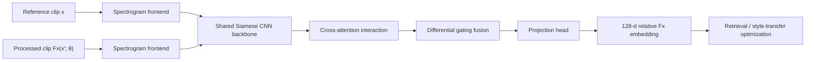
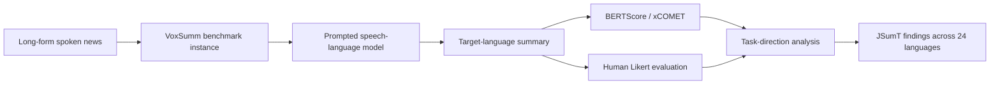
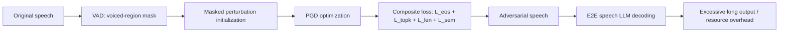
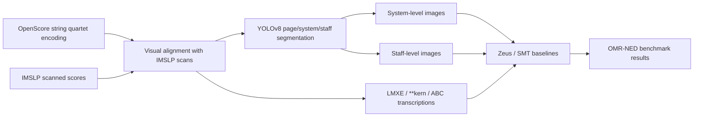
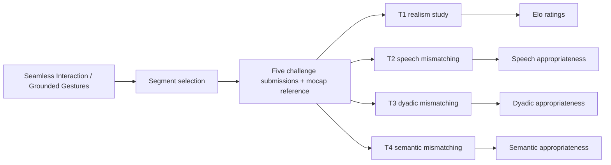

# 语音 / 音频 / 音乐论文速递
## 2026-08-12

> 实际对应 arXiv 更新日：**2026-08-12**  
> 检索范围：`cs.SD + eess.AS`  
> 只放按 ML 顶会审稿口径看，最值得多数读者花时间看的 **5 篇**

## 📋 总览

- 共收录 **5 篇** 相关论文
- 语音理解 / 跨语种摘要：**1 篇**
- 音频表示 / 音效建模：**1 篇**
- 语音大模型安全：**1 篇**
- 音乐理解 / OMR 基准：**1 篇**
- 手势生成 / 多模态评测：**1 篇**

今天这批最值得先看的不是“谁又把模型做大”，而是三条更实在的线。`RelFx` 把音效表示学习从“必须有 dry reference”这套不接地气假设里拽了出来，属于音乐制作方向少见的真问题真解法；`VoxSumm` 则把长语音跨语种摘要这件事正式立成 benchmark，而且把“先翻译再摘要”为什么会翻车讲得很明白；`Never Stop Speaking` 不一定是最优雅的安全论文，但它至少把 end-to-end speech LLM 的 DoS 风险从空泛担忧变成了可量化攻击。剩下两篇更偏资源和评测：`OSSQ-OMR` 给多声部 OMR 补上了长期缺失的数据和 protocol，`GENEA Challenge 2026` 则直接告诉你，当前主流手势生成系统离“会听、会看、会对话”还差得远。

## 精选入选规则

- **新意（0-3）**：是不是提出了新的表示、接口、训练组织方式，或者把旧问题拆得更对
- **影响力（0-3）**：是不是贴近语音大模型、语音理解、音频表示、音乐理解、数字人这些主线
- **证据强度（0-2）**：有没有像样的 baseline、消融和关键数值
- **受众匹配度（0-2）**：对语音大模型 / 语音前端 / 音乐方向 / 多模态研究者有没有直接启发

分数校准：

- **6**：可读，但更像补洞或阶段性资源
- **7**：信息量够，值得过一遍
- **8+**：建议优先精读

## 总览表

| 方向 | 序号 | 论文 | 评分 | 关键词 |
|---|---:|---|---:|---|
| 音频表示 / 音效建模 | 1 | Beyond Dry References | 8.5/10 | relative Fx representation, dry-reference-free, siamese encoder, differential gating |
| 语音理解 / 跨语种摘要 | 2 | VoxSumm | 8/10 | JSumT, multilingual spoken summarization, 24 languages, Gemini3.1-Pro |
| 语音大模型安全 | 3 | Never Stop Speaking | 8/10 | DoS attack, EOS suppression, VAD perturbation, E2E speech LLM |
| 音乐理解 / OMR 基准 | 4 | OSSQ-OMR | 7.5/10 | string quartet OMR, LMXE, Zeus, SMT, OMR-NED |
| 手势生成 / 多模态评测 | 5 | GENEA Challenge 2026 | 7.5/10 | gesture generation, disentangled evaluation, Seamless Interaction, human study |

## 🎚️ 音频表示 / 音效建模

### [1] Beyond Dry References: Learning Relative Audio Effects Representations via Contrastive Distance Learning

- **评分**：8.5/10
- **作者/机构**：Xinlu Liu, Huibin Lin, Weixing Wei, Zhenhai Yan；Galaxy Audio Effect Team, Tencent Music Entertainment；Independent Researcher
- **论文链接**：https://arxiv.org/abs/2608.10573
- **PDF**：https://arxiv.org/pdf/2608.10573.pdf
- **代码链接**：**代码已开源** https://relative-fx.github.io
- **Demo 链接**：https://relative-fx.github.io

#### 📌 简介
这篇抓得很准：现实音乐制作里，真正的“干声”几乎从来不存在，但一大堆音效表示学习方法都假装自己拿得到 dry reference。`RelFx` 不再学“绝对音效状态”，而是学两个相关音频之间的**相对效果变换**，因此训练时不需要干净参考，不需要把世界强行变成 multitrack 实验室。论文的核心是一个 dual-input Siamese 编码器，再配上 cross-attention 和 differential gating，把“从当前声音走到目标声音”这件事直接编码成关系表示。

#### ☠️ 毒舌点评
这篇不是换皮。它最值钱的不是又堆了一个 audio encoder，而是把问题定义改对了。很多 Fx representation 文章表面上在比 embedding，实质上是在比谁更依赖不真实的数据前提；`RelFx` 至少把这个前提掀了。短板也有：它还是围绕 Fx style transfer protocol 展示价值，离真正“统一音乐制作控制接口”还有距离，但在当前子方向里已经算很硬。

#### 🔧 技术方案

- **模型解决的问题**：现有 Fx representation 方法大都学习单输入的绝对状态编码 `E(x)`，默认能拿到 dry 或 nearly-dry 输入。问题是现实录音天然带房间、麦克风和前级链路，所谓干净基线本来就站不住脚。`RelFx` 解决的是“在没有 dry reference 的前提下，能不能直接学相对音效变换表示，并让这个表示真正服务风格迁移和检索”。

- **模型架构 / 评测框架**：  
  **输入**：同一首歌、相近语义内容的两段 `10s stereo clip`，其中一支经过已知效果链 `Fx(x'; θ)` 处理；采样率 `44.1 kHz`。  
  **输出**：一个 `128` 维相对音效 embedding，可供 effects retrieval 和 gradient-based style transfer 使用。  
  **主干**：`spectrogram frontend + dual-branch Siamese CNN backbone + cross-attention interaction + differential gating fusion + projection head`。  
  **关键模块**：`cross-attention` 负责让两支音频互相对齐内容；`differential gating fusion` 强制模型更关注“差异”而不是“内容相似”；额外的 antisymmetric 版本在交换输入顺序时能近似输出符号翻转的关系向量。

- **信号流怎么走**：两段内容相关的音频先转成时频表示，再分别送入共享 CNN 分支抽特征。随后 cross-attention 让 reference clip 和 processed clip 交互，differential gate 从交互特征里抠出“效果差异”而不是“旋律相似”。最后 projection head 把这种差异压进可比较的关系向量，既能做检索，也能反向传梯度去优化 DSP 效果链参数。

- **关键设计 / 核心创新**：  
  第一，关系建模替代绝对建模，这是方向级改动，不是调个损失函数。  
  第二，训练时不需要 dry normalization，因而可以吃带效果的真实音频，而不只局限在 `MUSDB18 / MoisesDB` 这种有限 multitrack 数据。  
  第三，antisymmetric 变体让 `(A,B)` 与 `(B,A)` 的表示近似互为相反数，这给“效果添加”和“效果移除”共用一个表示空间打开了路。

- **训练 / 推理策略**：  
  训练数据来自两部分：`6,447` 条内部混音轨道（`2,681` 首歌，`185.9 h`）和 `MoisesDB` 的 `2,585` stems（`240` 首歌，`156.4 h`）。训练时对 `10s stereo clip` 做 content-density filtering，并用 `8` 种顺序随机打乱的效果链：equalizer、distortion、multiband compressor、gain、stereo imager、limiter、delay、reverb，一共 `72` 个连续参数加 `8` 个开关。优化用 `AdamW`，在 `4 × NVIDIA L20` 上训 `200` 个 epoch，单卡 batch `48`、累积 `4` 次，等效 batch `768`。推理到 style transfer 时，会用 `7` 次 random restarts 和 `200` 次 Adam 迭代，从 embedding loss 反向优化 DSP 参数。

#### 📊 实验结果
最关键的实验是标准 `Fx-Encoder++` 风格迁移 protocol。  

- **主任务 baseline**：`CLAP`、`VGGish`、`AFx-Rep`、`Fx-Encoder++`。  
- **核心结果**：  
  `RelFx (Standard)` 的平均多分辨率 STFT loss `L_d = 1.388`，优于 `RelFx (Self-ref) 1.399`，也优于 `AFx-Rep 1.517`、`Fx-Encoder++ 1.601`、`CLAP 1.644`、`VGGish 1.784`。  
  `RelFx (Oracle)` 作为上界是 `1.316`，说明 Standard 配置已经离 oracle 不远。  
- **只用 MoisesDB 的公平比较**：  
  `RelFx (MoisesDB) = 1.449`，而 `Fx-Encoder++ = 1.601`，相对改善约 `9.5%`。这很关键，因为它说明提升不只是来自“内部数据更多”，而是关系建模本身就有效。  
- **论文直接给的相对提升**：相对 `Fx-Encoder++`，在 `drums / bass / vocals / other` 上最高能带来 `16.7% / 16.2% / 12.5% / 7.9%` 的增益，平均改善 `13.3%`。  
- **消融**：  
  完整模型 retrieval 指标是 `R@1 67.3 / R@5 79.2 / R@10 83.7`，`L_d 1.399`。  
  去掉 `cross-seg sampling` 之后，`L_d` 直接恶化到 `1.876`，说明“同歌同段不同片段”这个采样设计不是装饰。  
  去掉 `dynamic Fx probability` 之后，`L_d 1.465`；去掉参数回归后，`L_d 1.437`，都能看出它不是单模块偶然起效。  
- **双向关系性质**：  
  antisymmetric 版本的 `cos(E(A,B), E(B,A)) = -0.998`，而 base model 只有 `+0.277`。这说明它确实学成了“方向敏感”的关系表示，而不只是普通相似性向量。

#### 💡 为什么值得看
如果你做音乐生成、自动混音、音效风格迁移，这篇非常值得看，因为它不是单纯在刷一个 style transfer 指标，而是在修正这个子方向长期错误的训练前提。`relative transformation` 这件事一旦成立，后面无论是效果推荐、交互式调音、还是更复杂的 production assistant，都能建立在更真实的数据条件上。它的启发比单篇 benchmark 分数大得多。

## 🗣️ 语音理解 / 跨语种摘要

### [2] VoxSumm: A Multilingual Corpus of Long-Form Spoken News for Joint Summarization and Translation

- **评分**：8/10
- **作者/机构**：Yejin Jeon, Marie Maltais, Virginia Ceccatelli, Min Ma, David Ifeoluwa Adelani；Mila - Quebec AI Institute；McGill University；Google DeepMind；CIFAR AI Chair
- **论文链接**：https://arxiv.org/abs/2608.10359
- **PDF**：https://arxiv.org/pdf/2608.10359.pdf
- **代码链接**：暂无
- **数据/项目说明**：论文声明将公开 `VoxSumm` benchmark

#### 📌 简介
这篇的价值不在于提出了一个新模型，而在于把一个一直没人正式定义清楚的任务钉住了：**joint speech summarization and translation (JSumT)**。过去多语语音研究大多做翻译，默认目标是尽量保留全部信息；而长语音摘要研究又几乎全在文本域内转。`VoxSumm` 直接问的是：能不能从源语言长语音里，直接产出目标语言的**简洁摘要**，而不是先全文转写再自己拼 pipeline。作者顺手放出了第一个大规模跨语种 benchmark：`10,045` 个 BBC article-summary 对，覆盖 `24` 种语言、约 `703` 小时语音。

#### ☠️ 毒舌点评
这类 benchmark 文章最容易犯的毛病是“数据不少，结论很空”。`VoxSumm` 好一点，因为它至少把几个关键问题跑清楚了：哪类模型更稳、few-shot 有没有用、先翻译再摘要是不是坑、以及生成英语摘要是不是天然更容易。短板也有：它评的是现成 speech-language model 的 prompting 行为，不是给出一个新的强解法；如果你只想找能直接复现的 SOTA model，这篇没有那种爽感。但如果任务定义本身都不清楚，先补 benchmark 反而比再堆一个模型更有价值。

#### 🔧 技术方案

- **模型解决的问题**：传统 speech translation 追求保真传递，而 long-form summarization 追求压缩关键信息，两者目标本来就不同。`VoxSumm` 解决的是“如何把长语音跨语种摘要”作为一个独立任务定义下来，并验证现有 speech-language model 在这个任务上到底哪里强、哪里弱。

- **模型架构 / 评测框架**：  
  **输入**：源语言长语音新闻、对应源文本、目标语言摘要参考。  
  **输出**：目标语言的简洁摘要，而不是逐句翻译全文。  
  **主干**：以现成 speech-language model 为被评测对象，在 `Few-shot`、`Zero-shot`、`CoT Zero-shot` 三种 prompting 设置下完成 `Summarization→Translation` 与 `Translation→Summarization` 两条任务链。  
  **关键模块**：`VoxSumm dataset` 构造；`BERTScore-F1` 与 `xCOMET-XL` 自动评测；`10` 语言双向人工打分；额外的 task direction、language direction、text-only modality ablation。

- **信号流怎么走**：先用 BBC 长语音和人工摘要构造跨语种对齐数据，再把 source-language spoken article 喂给 `Gemini3.1-Pro`、`Qwen3-Omni`、`Gemma4-12B` 等模型。模型在不同 prompting 方式下直接生成目标语言摘要，然后用 `BERTScore / xCOMET / human Likert` 统一评估，最后再拆开看 few-shot 是否更稳、英语输出是否更容易、以及先翻译再摘要为什么会出 instruction-following failure。

- **关键设计 / 核心创新**：  
  第一，它把 `JSumT` 从模糊概念做成了有 benchmark、有双向语言设置、有人工评测的正式任务。  
  第二，它不只看总分，还显式分析 `Summarization→Translation` 和 `Translation→Summarization` 的顺序差异。  
  第三，它把 language direction 单独拉出来，说明“生成英语摘要”和“生成非英语摘要”在今天的模型上不是一个难度级别。

- **训练 / 推理策略**：  
  这篇没有训练新模型，重点在统一评测。被评测模型是 `Gemini3.1-Pro`、`Qwen3-Omni (30B)`、`Gemma4-12B`。Few-shot、zero-shot 和 CoT 提示全部公开在附录。自动指标之外，作者在 `10` 种语言上做了双向人工评测，每个语言三位双语标注者，评价标准是 `1-5 Likert` 的 summary quality。

#### 📊 实验结果
- **数据规模**：`10,045` 对 article-summary、`24` 种语言、`703` 小时语音。  
- **主 baseline**：`Gemini3.1-Pro`、`Qwen3-Omni`、`Gemma4-12B`。  
- **总体自动指标**：  
  在 `Summarization→Translation` 主设定下，`Gemini3.1-Pro` 平均 `BERTScore 0.703`，`Qwen3-Omni 0.657`，`Gemma4-12B 0.617`。  
  `Gemini3.1-Pro` 的 `Few-shot` 平均 `0.727`，比它自己的 ZS / CoT 高约 `0.036`。  
- **和人工评价的一致性**：  
  `BERTScore` 与 human quality 的 Pearson 相关是 `0.77`，`xCOMET` 是 `0.66`，说明这次自动指标排序基本靠谱，不是纯自嗨。  
- **任务顺序效应**：  
  把任务改成先翻译全文再摘要后，平均性能下降在 `Eng→XX` 上更重，整体相对差值是 `-0.081`，而 `XX→Eng` 只有 `-0.012`。  
  `Qwen3-Omni` 在 `ZS` 条件下尤其惨，论文明确点出会出现 summary 缺失或尾部幻觉。  
- **语言方向效应**：  
  从非英语语音生成英语摘要，通常比从英语语音生成非英语摘要更稳。这个差异对 `Gemma4-12B` 和 `Qwen3-Omni` 更明显。  
- **模态消融**：  
  对 `Qwen3-Omni` 做 text-only few-shot 后，平均 `BERTScore` 从 `0.666` 升到 `0.682`，增量 `+0.017`。这说明当前模型不一定真把音频用好了，音频输入有时反而拖后腿。  
- **作者结论很直接**：`Gemini3.1-Pro` 最稳，`Qwen3-Omni` 第二，`Gemma4-12B` 第三；Few-shot 普遍有帮助；先翻译再摘要在长语音场景里容易把 instruction following 搞崩。

#### 💡 为什么值得看
如果你做语音大模型、speech summarization、跨语种信息压缩，这篇值得看，因为它不是简单把“翻译”和“摘要”拼起来，而是把两者目标冲突暴露出来了。尤其是“先翻译全文再摘要”这条路线为什么在英语到非英语方向上更容易出事，这个结论对后面设计 pipeline 和 prompt 都很有参考价值。它不会直接给你一个终极模型，但会帮你少走很多伪 pipeline 弯路。

## 🛡️ 语音大模型安全

### [3] Never Stop Speaking: a Denial-of-Service Attack on End-to-End Speech Language Models

- **评分**：8/10
- **作者/机构**：Shuozhe Cheng, Kunlan Xiang, Mingxuan Li, Ji Zhang, Dongxiao Liu, Wenbo Jiang；论文首页未完整列出机构，通讯邮箱显示 `wenbo_jiang@uestc.edu.cn`
- **论文链接**：https://arxiv.org/abs/2608.10405
- **PDF**：https://arxiv.org/pdf/2608.10405.pdf
- **代码链接**：暂无
- **说明**：机构字段在论文首页没有完整展开，上述仅保留可直接核验的邮箱域名信息

#### 📌 简介
这篇干的事很直白：它不是去骗 ASR 出错字，也不是做 TTS 对抗噪声，而是专门针对 end-to-end speech LLM 的**拒绝服务攻击**。目标不是把回答改错，而是让模型在几乎不改输入长度、几乎听不出扰动的情况下，不断生成冗长无意义输出，持续吃推理资源。作者的具体做法是对波形直接加微小扰动，并用一个 composite loss 同时压制 EOS、鼓励长输出、维持语义一致，还用 VAD 限制只在 voiced region 注噪，尽量别把攻击做得太显眼。

#### ☠️ 毒舌点评
这篇不花哨，但问题很实在。以前很多 DoS 攻击论文默认输入是文本，到了 end-to-end speech LLM 这里，离散 token 攻击办法基本都废了。作者至少没假装老方法还能无缝转过来，而是真的把 waveform-space 的攻击目标重新设计了一遍。缺点也很明显：白盒假设偏强，而且“语义保持”是拿 LLM-as-a-judge 打分，不是最硬的 task success 指标。但就揭示风险这件事，它已经足够有杀伤力。

#### 🔧 技术方案

- **模型解决的问题**：文本 LLM 的 DoS 常用 adversarial suffix 或复杂 prompt 诱导超长推理，但 end-to-end speech LLM 吃的是连续语音波形，离散 prompt 技巧没法直接搬。`Never Stop Speaking` 解决的是“如何在连续语音空间里，用几乎不可感知的扰动稳定诱发过长解码，并尽量不破坏原始语义”。

- **模型架构 / 攻击框架**：  
  **输入**：原始语音波形，配合 `VAD` 切出的 voiced segments。  
  **输出**：带对抗扰动的语音，以及被攻击模型生成的超长响应。  
  **主干**：`VAD-masked perturbation + PGD optimization + multi-loss EOS suppression objective`。  
  **关键模块**：`L_eos` 压制终止；`L_topk` 间接抬高非 EOS token 概率；`L_len` 逼近期望最大长度；`L_sem` 约束语义不崩；`VAD mask` 保证只在发声段加噪。

- **信号流怎么走**：输入语音先经 VAD 找出 voiced region，只在这些片段上叠加可学习扰动。扰动更新时，作者不是只盯 EOS logit，而是同时优化 EOS 压制、top-k 分布、期望长度和语义保持。最后把对抗语音送进 end-to-end audio LLM，看它是否被诱导到接近 `max_new_tokens` 的超长输出。

- **关键设计 / 核心创新**：  
  第一，它不是 naive EOS suppression，而是明确把长度、分布稳定性和语义保持绑在一起。  
  第二，`VAD` 让攻击更隐蔽，因为静音段最容易暴露异常。  
  第三，它验证了这种攻击对多种 open-source E2E speech LLM 都成立，不是单模型巧合。

- **训练 / 推理策略**：  
  攻击优化用 `PGD` 做 `200` 次迭代，扰动约束是 `l∞` 范数 `ϵ = 10^-4`。超参数里 `w_high = 4`，`κ = 4`，`top-k = 3`，`N_max = 1024`。论文评估 `Liquid Audio (1.5B)`、`FunAudioChat (8B)` 和 `Qwen2-Audio-7B-Instruct` 三个模型；默认解码是 top-k sampling，也额外验证了 greedy decoding。响应质量则用 LLM-as-a-Judge 给 `1-5` 分。

#### 📊 实验结果
- **主 baseline**：`clean audio`、`random noise`、`Simple Loss`、`Crabs`、`ExtendAttack`。  
- **Liquid Audio (1.5B)**：  
  clean input 的平均输出长度是 `198.34` token、显存占用 `8.89 GB`；  
  作者方法把 `ASR` 拉到 `0.87`，平均输出长度拉到 `941.88`，显存占用升到 `10.78 GB`。  
  对比 `Crabs` 只有 `ASR 0.34 / 545.72 tokens`，`ExtendAttack` 只有 `0.29 / 496.37 tokens`。  
- **FunAudioChat (8B)**：  
  作者方法 `ASR 0.84`，平均输出长度 `920.24`，显存 `21.93 GB`；  
  clean input 只有 `213.57` token，`Crabs` 是 `594.38`，`ExtendAttack` 是 `607.54`。  
- **Qwen2-Audio**：  
  额外评测里作者方法能做到 `ASR 0.83`、`913.07` token、`19.94 GB`，明显强过 `Simple Loss 0.80 / 846.53` 和 `Crabs 0.42 / 665.19`。  
- **greedy decoding**：  
  在 deterministic decoding 下仍然能打，`Liquid Audio` 上作者方法是 `ASR 0.86`、`927.69` token，说明这不是 sampling 随机性偶然触发。  
- **消融非常关键**：  
  完整版本（含 VAD）是 `ASR 0.84`、`950.24` token、response quality `4.75`。  
  去掉 `L_eos` 之后直接崩到 `ASR 0.12`、`289.43` token，说明 EOS suppression 是第一支点。  
  去掉 `L_sem` 后，长度甚至还能略升，但 quality 从 `4.75` 掉到 `3.92`，证明语义保持不是摆设。  
- **迁移性**：  
  black-box transfer 仍有 `7%–13%` 的非零 ASR，虽然不高，但足够说明它不是完全绑死白盒源模型。

#### 💡 为什么值得看
如果你做 speech LLM、语音助手安全、或者任何需要按 token 计费的语音服务，这篇应该优先看。它说明一个很现实的问题：系统可能不是被 prompt injection 搞死，而是被看起来几乎正常的音频输入拖进长时间无意义解码。即使你觉得白盒攻击离生产还远，这篇关于 `EOS + length + semantics + VAD` 的攻击分解，也会直接影响你以后怎么设计防护和监控指标。

## 🎼 音乐理解 / OMR 基准

### [4] A Dataset and Benchmark for Optical Music Recognition of String Quartet Scores

- **评分**：7.5/10
- **作者/机构**：Dongmin Kim, Brian Liu, Jose J. Valero-Mas, Dasaem Jeong；Music & Arts Learning Lab, Sogang University；Independent Researcher；University of Alicante
- **论文链接**：https://arxiv.org/abs/2608.10978
- **PDF**：https://arxiv.org/pdf/2608.10978.pdf
- **代码链接**：**代码已开源** https://github.com/MALerLab/string-quartet-omr-benchmark
- **Demo / 数据链接**：https://github.com/MALerLab/string-quartet-omr-benchmark

#### 📌 简介
这篇是多声部 OMR 方向很缺的一块基础设施。过去 OMR 数据集大多偏 monophonic 或 piano-form，到了 string quartet 这种四个独立声部同时存在的谱面，数据和 benchmark 几乎断档。作者做的 `OSSQ-OMR` 把 OpenScore String Quartet 扩成了真正可做 OMR 的基准：每份数字谱都和 IMSLP 扫描版对齐，系统级和 staff 级图像都给，转写格式也不是只留一种，而是 `LMXE / **kern / ABC` 三套一起放出来。

#### ☠️ 毒舌点评
这是典型的“不是 flashy 模型，但对社区更有用”的论文。它不靠一个新 Transformer 吓人，而是把数据对齐、格式转换、tokenization 和评测 protocol 都做扎实了。缺点同样明显：它还是 benchmark paper，不会直接给你一个端到端全场景 OMR 新范式；而且数据规模和题材目前仍局限在 string quartet，离更复杂的大编制还有距离。但作为补基建，这篇是有含金量的。

#### 🔧 技术方案

- **模型解决的问题**：多声部 OMR 难点不只在识别 token，更在于多个声部并行、频繁换谱号、宽音域和版式复杂度同时上来，而现有数据集基本没有足够合适的多声部目标。`OSSQ-OMR` 解决的是“如何为 multi-part OMR 提供可审计、可对齐、可复现实验的正式 benchmark”。

- **模型架构 / 评测框架**：  
  **输入**：来自 IMSLP 的 full-score 扫描件与 OpenScore 的对应 MuseScore 编码，经过 page → system → staff 的分割流程。  
  **输出**：系统级和 staff 级图像，以及对应的 `LMXE / **kern / ABC` 符号转写。  
  **主干**：`YOLOv8` 分割管线 + 多格式符号转换 + 两个基线模型 `Zeus` 与 `Sheet Music Transformer (SMT)`。  
  **关键模块**：`visual alignment` 人工校对；`LMXE` 多声部线性化编码；`Zeus` LSTM seq2seq；`SMT` ConvNeXt + Transformer decoder；统一 `OMR-NED` 指标。

- **信号流怎么走**：先从 OpenScore String Quartet 和 IMSLP 扫描版构建一一对应的谱面，再通过 `YOLOv8` 检出 system 和 staff，生成 synthetic/scanned 两类图像。随后统一转换成 `LMXE / **kern / ABC` 三种文本表示，最后用 `Zeus` 和 `SMT` 在 system-level 与 part-level 两种输入上分别训练与评测，统一报 `OMR-NED`。

- **关键设计 / 核心创新**：  
  第一，这是第一个专门面向 multi-part OMR 的 string quartet benchmark。  
  第二，它不只发图像，还把 alignment 和 conversion audit trail 一起做了，甚至把 MuseScore 修订记录做成了可追踪的 Git 历史。  
  第三，论文用三种编码格式和九种 tokenization scheme 正式证明：表示设计本身比“你是 LSTM 还是 Transformer”更重要。

- **训练 / 推理策略**：  
  数据最终包含 `24,544` system images 和 `98,172` staff images，来自 `116` 首 string quartet；其中 system-level 分成 `13,240` synthetic 和 `11,304` scanned，part-level 分成 `52,960` synthetic 和 `45,212` scanned。作者对 `93` 份 full-score 扫描件做了超过 `100` 小时人工对齐。训练上，`Zeus` 和 `SMT` 在四个随机 score-level split 上评测；tokenization 则覆盖 `LMXE / LMXE-P / EKERN / BEKERN / CABC / ABC-BPE` 多个版本。

#### 📊 实验结果
- **主 baseline**：`Zeus`、`Sheet Music Transformer (SMT)`，外部补充基线 `Legato`。  
- **核心结果**：  
  最好配置是 `Zeus + LMXE + part-level`，在 synthetic 上做到 `3.6% OMR-NED`，在 scanned 上做到 `5.9%`。  
  论文明确说这是全表最佳 scanned 配置。  
- **表示格式差异非常明显**：  
  `LMXE` 在 system 与 part 两层级上都整体优于 `**kern` 和 `ABC`。  
  例如 `SMT + CABC` 的 system-wise 是 `6.0 / 18.5`（synthetic / scanned），已经比 `Legato` 的 `36.1 / 66.3` 强很多，但仍明显不如最优 `LMXE`。  
- **架构 vs 表示**：  
  同一模型换 tokenization，差距能大到离谱。比如 `Zeus` 在 `LMXE` part-level 是 `3.6 / 5.9`，到了 `ABC-BPE-4096` part-level 直接变成 `18.1 / 23.3`。  
  这基本等于告诉你：别再默认“Transformer 换大点就能解一切”。  
- **domain shift**：  
  synthetic → scanned 会让所有配置都变差，但 `Zeus` 平均只恶化 `39%（3.6 pp）`，`SMT` 则恶化 `100%（6.7 pp）`，说明当前 LSTM baseline 反而更耐扫描域偏移。  
- **part-level 优势**：  
  论文结论非常明确：part-level 输入在所有配置里都优于 system-level。  
- **外部基线对比**：  
  `Legato` 在 OSSQ-OMR 上 system-wise 是 `36.1 ± 3.2 / 66.3 ± 2.7`，part-wise 是 `51.2 ± 2.5 / 74.5 ± 3.1`。  
  对比 `SMT-CABC 6.0 / 18.5`，可以看出“拿现成 ABC-OCR 模型过来”并不能解决 multi-part string quartet。

#### 💡 为什么值得看
如果你做 OMR、符号音乐理解，或者想把视觉谱面和符号生成真正对齐，这篇值得看。它最重要的启发不是某个模型分数，而是：**表示和数据对齐质量** 对多声部 OMR 的影响，比很多人想象得大得多。哪怕你不做 string quartet，这种“从扫描、对齐、分割、编码到评测一整套规范化”的做法，也很值得后续 orchestra / full-page OMR 继续抄。

## 🤖 手势生成 / 多模态评测

### [5] The GENEA Challenge 2026: A Large-Scale Disentangled Evaluation of Speech-Driven Gesture Generation on the Seamless Interaction Dataset

- **评分**：7.5/10
- **作者/机构**：Rajmund Nagy, Silvia Arellano García, Hendric Voss, Mihail Tsakov, Taras Kucherenko, Youngwoo Yoon, Gustav Eje Henter；KTH Royal Institute of Technology；Bielefeld University；Independent Researcher；National Library of Sweden；Electronics and Telecommunications Research Institute (ETRI)；Motorica AB
- **论文链接**：https://arxiv.org/abs/2608.10839
- **PDF**：https://arxiv.org/pdf/2608.10839.pdf
- **代码链接**：暂无统一代码仓库
- **项目链接**：https://genea-workshop.github.io/2026/challenge/

#### 📌 简介
这篇本质上是一个 challenge report，但信息量不低。作者不是单纯宣布谁拿了第一，而是把 speech-driven gesture generation 拆成四个互相解耦的评测维度：`motion realism`、`alignment with speech`、`alignment with interlocutor`、`semantic alignment`。底层数据是 `Seamless Interaction`，比老的 `BEAT2` 更大、更偏 dyadic interaction，也更强调语义手势和对话互动。论文的意义不在模型，而在它用 `23,000+` 票的大规模 human study 正式告诉你：现在这批系统在“看起来像人”之外，离“会听会对话会表达语义”还差得很远。

#### ☠️ 毒舌点评
Challenge paper 最容易沦为赛事公报，但这篇没有太水。它最有价值的地方，是不用单一总分糊弄，而是把不同能力拆开测。结果也挺扎心：视觉自然度还能排出梯队，真到 speech alignment、dyadic responsiveness、semantic expressivity，就大面积掉回 chance 附近。缺点是显而易见的，作者评的是参赛系统，不是统一可复现训练 recipe；如果你只想找一个能直接拿来训练的 SOTA 手势模型，这篇不会替你省事。

#### 🔧 技术方案

- **模型解决的问题**：以前 gesture generation 评测经常把“动作自然”“和语音同步”“对话响应”“语义表达”混在一起，导致模型分高了也不知道到底强在哪。`GENEA Challenge 2026` 解决的是“怎么把 gesture generation 的核心能力拆开，避免一个总分掩盖系统真实短板”。

- **模型架构 / 评测框架**：  
  **输入**：Seamless Interaction 的 dyadic speech、transcript、motion，以及 Grounded Gestures 的语义片段。  
  **输出**：五个参赛系统生成的 gesture motion，以及四类 user-study 的偏好投票与 appropriateness score。  
  **主干**：一个 `disentangled human evaluation` 框架，而不是单一新模型。  
  **关键模块**：`pairwise realism study`、`speech mismatching`、`dyadic mismatching`、`semantic mismatching`、`Bradley-Terry Elo`、`JUICE` 主观理由收集。

- **信号流怎么走**：先从 `Seamless Interaction` 里切出单人讲话、双人对话、语义突出片段，再分别生成 matched / mismatched 刺激对。然后让测试者做四类 pairwise 判断：看谁更自然、谁和语音更配、谁更会回应 interlocutor、谁更能表达关键词语义。最后把投票转换成 `Elo` 和 `appropriateness score`，分别看 realism、speech alignment、dyadic alignment 与 semantic alignment。

- **关键设计 / 核心创新**：  
  第一，它把 `dyadic alignment` 和 `semantic alignment` 当成独立能力来测，而不是默认只看 beat matching。  
  第二，mismatching protocol 给了理论上的 chance baseline，这比简单 A/B 投票更能说明系统到底有没有真正用到条件输入。  
  第三，作者用 `JUICE` 收集主观理由，不只是看谁赢，还看测试者为什么觉得它赢。

- **训练 / 推理策略**：  
  这篇没有训练统一模型，而是评五个参赛系统：`GestFlow`、`UNICAMP` flow-matching submission、`UM-FERI`、`DyaSync`、`DyaSync-sem`。数据方面，`Seamless Interaction` 包含 `3400 h` dyadic conversations，`Grounded Gestures` 子集有 `380 h`。总计四个 user study，所有评测都通过 pairwise comparison 进行。

#### 📊 实验结果
- **user study 规模**：  
  共 `23,000+` votes，`869` 位 test-takers。  
  `E1 realism`：`170` stimuli、`154` 人、`3,789` 票。  
  `E2 speech mismatching`：`170` stimuli、`350` 人、`8,488` 票。  
  `E3 dyadic mismatching`：`46` stimuli、`159` 人、`3,895` 票。  
  `E4 semantic mismatching`：`257` stimuli、`177` 人、`7,038` 票。  
- **motion realism**：  
  mocap 片段相对所有 challenge submission 的 pairwise winrate 在 `68%–95%` 之间。  
  头部两名系统彼此接近，论文点名是 `54% vs 46%` 的 head-to-head winrate。  
- **speech alignment**：  
  mocap 的概念上限是 `62%` speech-motion alignment score。  
  最好的 submission 只有 `32%`，其余四个只比 `0%` 的 input-independent 下限略高一点。  
  讨论部分特别提到 `UNICAMP` 的 speech alignment 已经超过旧 leaderboard 上原先六个系统，但离 mocap 仍差很远。  
- **dyadic alignment**：  
  只保留有真实 dyadic adaptation 的 mocap 片段时，天花板约 `65%`；所有参赛系统都没有明显高于 chance。  
- **semantic alignment**：  
  在真实 mocap 上，测试者能以 `79%` 的准确率选出匹配语句，说明数据本身确实含有可辨识语义手势。  
  但最好的参赛系统 semantic appropriateness 也只有 `8%`。  
- **challenge systems 名次解读**：  
  视觉自然度还能排梯队；一到 dyadic 或 semantic 任务，系统间差异缩小，且整体都偏弱。  
  这说明今天的手势生成大多还是“动作像”，远没到“互动对、语义对”。

#### 💡 为什么值得看
如果你做数字人、gesture generation、audio-driven avatar，这篇值得看，因为它用很硬的人工评测告诉你：当前问题已经不是“能不能生成一段看起来像手势的动作”，而是**条件控制到底有没有真正进模型**。只要你的系统还在把 realism 分数当终点，这篇都会泼你一盆冷水。它对后续 benchmark 设计和损失函数选择都很有启发。

## 最后结论

今天最值得优先看的 3 篇，我会这样排：

1. **RelFx**  
   这是今天最像“把错误问题定义纠正回来”的论文。做音乐制作、音效控制、混音表示的人应该优先读。

2. **VoxSumm**  
   如果你关心语音大模型、长语音理解和跨语种信息压缩，这篇 benchmark 会直接影响你后面怎么设计任务和 pipeline。

3. **Never Stop Speaking**  
   做 speech LLM 服务的人别把它当噱头安全文。它把 waveform-space DoS 的攻击面定量化了，工程上很有现实意义。

剩下两篇里，`OSSQ-OMR` 更适合 OMR / MIR 研究者当资源论文精读；`GENEA Challenge 2026` 则适合做数字人和语音驱动动作的人当“残酷现状报告”来看。前者是补基建，后者是泼冷水，但两篇都不是灌水。
