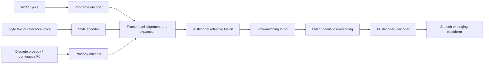
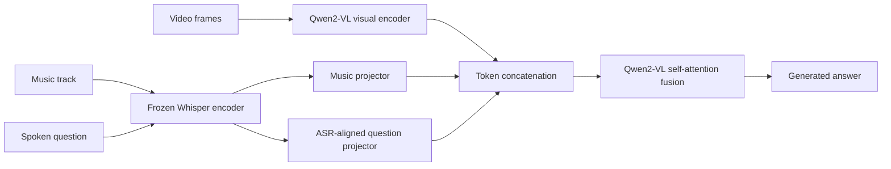
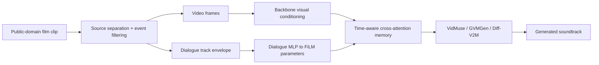
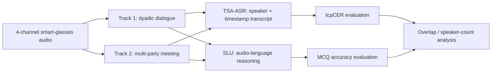
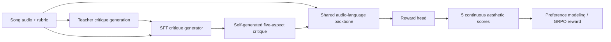

# 语音 / 音频 / 音乐论文速递
## 2026-08-13

> 实际对应 arXiv 更新日：**2026-08-13**  
> 检索范围：`cs.SD + eess.AS`  
> 只放按 ML 顶会审稿口径看，最值得多数读者花时间看的 **5 篇**

## 📋 总览

- 共收录 **5 篇** 相关论文
- 统一语音生成 / 细粒度可控：**1 篇**
- 视频到音乐 / 音乐多模态理解：**2 篇**
- 语音基准 / 穿戴式音频语言模型：**1 篇**
- 音乐奖励建模 / 生成对齐：**1 篇**

今天这批里，真正值得先看的不是“谁又把 backbone 做大”，而是三条更实在的线。`CookVoice` 把语音、歌声、风格和韵律控制统一到一个 frame-level 条件框架里，属于那种不靠堆参数、而是把问题拆法做对的论文；`Qwen-MusicAVQA-7B` 证明音乐 AVQA 未必需要又厚又重的 omni 模型，保留局部时序细节的 Whisper 序列加一个小 projector 就能把 `80.9%` 的 Omni 基线甩到 `97.3%`；`MuseCritic` 则把“音乐奖励模型为什么总打不准”这件事说透了，核心不是再加一个分数头，而是先让模型写出五维审美 critique 再打分。

剩下两篇各有用处。`Dialogue-Aware Video-to-Music` 不是范式级突破，但它把视频到音乐这条线最脆弱的可复现性和 dialogue conditioning 一起补上了；`SmartGlasses Challenge` 更像 benchmark 论文，不靠花哨模型吸睛，但它把穿戴式多说话人识别和理解的真实难度摆在桌面上了，尤其是 overlap 和 acoustic-question 这两个痛点。

## 精选入选规则

- **新意（0-3）**：是不是提出了新的表示、接口、训练组织方式，或者把旧问题拆得更对
- **影响力（0-3）**：是不是贴近语音大模型、TTS、音频理解、音乐生成、评测这些主线
- **证据强度（0-2）**：有没有像样的 baseline、消融和关键数值
- **受众匹配度（0-2）**：对语音大模型 / 语音前端 / 音乐方向 / 多模态研究者有没有直接启发

分数校准：

- **6**：可读，但更像局部补洞
- **7**：信息量够，值得过一遍
- **8+**：建议优先精读

## 总览表

| 方向 | 序号 | 论文 | 评分 | 关键词 |
|---|---:|---|---:|---|
| 统一语音生成 / 细粒度控制 | 1 | CookVoice | 8.5/10 | unified voice generation, frame-level alignment, flow matching, TTS+TTSV |
| 音乐理解 / 多模态问答 | 2 | Qwen-MusicAVQA-7B | 8.5/10 | Whisper local frames, Qwen2-VL, projector-only alignment, Music AVQA |
| 音乐奖励建模 / 生成对齐 | 3 | MuseCritic | 8/10 | critique-conditioned reward, SongEval, Music Arena, GRPO |
| 视频到音乐 / 数据与条件建模 | 4 | Dialogue-Aware Video-to-Music | 7.5/10 | OSSL-v2, dialogue FiLM, video-to-music, reproducible benchmark |
| 语音基准 / 穿戴式音频语言模型 | 5 | SLT 2026 SmartGlasses Challenge | 7.5/10 | egocentric speech, speaker overlap, TSA-ASR, SLU |

## 🎤 统一语音生成 / 细粒度控制

### [1] CookVoice: Unified Framework for Style Controllable Multi-Modal Human Voice Generation

- **评分**：8.5/10
- **作者/机构**：Haowei Lou, Hye-Young Paik, Jia Dai, Kai Li, Lina Yao；UNSW Sydney；Dolby Laboratories
- **论文链接**：https://arxiv.org/abs/2608.11590
- **PDF**：https://arxiv.org/pdf/2608.11590.pdf
- **代码链接**：暂无
- **Demo 链接**：https://haoweilou.github.io/CookVoice/

#### 📌 简介
这篇做的不是单一 TTS，也不是单一歌声模型，而是想把 speech、singing、voice cloning、voice conversion、voice editing 这些人声生成任务塞进同一个 controllable 框架里。核心思路是把人声拆成 `content / prosody / style` 三个因子，然后把文本、参考音频、离散韵律、连续 F0 全都对齐到 acoustic frame 级别，再交给一个 flow-matching DiT 去生成 latent acoustic embedding。

#### ☠️ 毒舌点评
这篇不是“统一框架”四个字写得大，内容却只有一个 TTS 小修补。它至少真的把最麻烦的地方做了：统一 speech 和 singing 的时序控制，统一文本风格和参考音频风格，统一离散 prosody 和连续 prosody。缺点也明显，它目前还是 `43.51M` 的 DiT-S 小模型，训练数据也只有 `168` 小时，离真正的大规模通用人声基础模型还远；但作为方法论文，它比很多只会换 decoder 的所谓 unified voice paper 硬得多。

#### 🔧 技术方案

- **模型解决的问题**：传统 TTS、歌声生成、风格模仿和编辑模型通常各做各的，控制信号也互不兼容。AR 路线虽然灵活，但 duration 和 prosody 多靠隐式建模，到了 singing 或 prosody mimicry 这种需要精确时序控制的任务就很吃力。`CookVoice` 要解决的是“能不能用一个 NAR 框架，把 content、style、prosody 的多模态条件统一到 frame-level，既支持 TTS，也支持 TTSV 和多种控制任务”。

- **模型架构**：
  - **输入**：文本或歌词对应的 phoneme 序列，文本风格描述或参考音频，离散 prosody token（tone、stress、MIDI note）或连续 F0 contour。
  - **输出**：latent acoustic embedding，再经 HiFi-GAN 风格 AE decoder 重建为最终 waveform。
  - **主干**：`style encoder + phoneme/content encoder + prosody encoder + flow-matching Diffusion Transformer`。
  - **关键模块**：`flexible duration alignment`、`frame-level expansion`、`multimodal adaptive fusion`、`flow-matching DiT-S`、`continuous relative F0 control`。
  - **信号流怎么走**：先用 AE 把目标音频编码成 latent embedding，content、style、prosody 三路条件分别编码，再按 acoustic frame 展开并拼到同一时间轴上。之后条件序列喂给 flow-matching DiT 预测 latent trajectory，最后通过固定 AE decoder 还原成音频。

- **关键设计 / 核心创新**：  
第一，alignment 不是 token-level 的糊涂账，而是明确做到 frame-level，这对 singing 和 prosody mimicry 很关键。  
第二，它把 style source 统一成两种入口：文本风格描述 `ST` 和参考音频 `SV`。  
第三，连续 F0 先做 relative pitch normalization，把 timbre 和绝对音高解耦，避免 style 和 melody 互相打架。  
第四，它同时支持 `TTS + TTSV + voice mimicry + voice conversion + voice editing`，这比“只把 TTS 和 clone 合一起”的统一说法更完整。

- **训练 / 推理策略**：  
数据来自 Baker、LJSpeech、ESD、CREMA-D、CommonPhone、Genshin Voice Dataset、GTSinger 等，合计约 `123k` 样本、`168` 小时、`6,361` 说话人。实际训练用 `110k` 样本，speech:singing 比例约 `9:1`，单张 `RTX 5090`、batch size `32` 训练 `800k` steps。推理时通过 empirical probability flow ODE 解 latent，论文重点分析了 `4 / 8 / 16` 等 ODE 步数的质量效率折中，并明确建议 `4-8` 步作为最佳工作区间。

#### 📊 实验结果
- **对比基线**：TTS 侧是 `CosyVoice`、`F5-TTS`、`ParaStyleTTS`、`IndexTTS`、`Vevo2`；TTSV 侧是 `DiffSinger`、`StyleSinger`、`TCSinger`、`Vevo1.5`、`Vevo2`。
- **可控性最亮眼**：  
  TTS 最强配置 `SV + Pcont` 做到 `S-SIM 91.65%`、`F0-CORR 0.7102`；对比 `Vevo2` 的 `75.11%` 和 `0.1242`，style similarity 与 prosody fidelity 都是明显提升。  
  TTSV 最强配置 `SV + Pcont` 做到 `S-SIM 95.00%`、`F0-CORR 0.8425`；对比 `Vevo2` 的 `88.09%` 和 `0.6242`，这不是小修小补。
- **音质和可懂度**：  
  TTS 最佳 `MOS 3.98`，接近 ground truth `4.05`，但仍低于 `IndexTTS 4.42` 和 `F5-TTS 4.35`，说明它不是纯音质 SOTA。  
  TTSV 最佳 `MOS 3.40`、`MC-MOS 0.28`，高于多数 singing 基线，并接近 `Vevo2` 的 `3.42 / 0.11`。  
  TTSV 在 `SV + Pcont` 下的 `WER-CH 10.01`、`WER-EN 24.37`，说明英文歌声 intelligibility 仍是短板。
- **效率非常能打**：  
  `CookVoice` 只有 `43.51M` 参数、`1.37G` CUDA memory footprint、`RTF 0.04`；  
  `Vevo2` 是 `872M` 参数、`6.84G`、`RTF 14.85`。  
  音质不是最强，但“功能覆盖 + 可控性 + 速度”这个组合它确实很能打。
- **步数分析**：  
  论文明确指出 style similarity 与 F0 指标大多在 `4-8` ODE steps 就收敛，MOS 到 `16` 步还能略涨，但 WER、PhoER、ProER 反而会在步数过多时恶化。这一点很实在，没有把“更多步数一定更好”这种假话继续讲下去。

#### 💡 为什么值得看
如果你关心的是“下一代可控语音 / 歌声模型到底应该怎么统一接口”，这篇比很多单任务 SOTA 更值得读。它不靠超大参数炫技，而是把 control signal、frame alignment、speech/singing 一体化这些真正卡脖子的接口层问题梳顺了。后面不管你想做统一 voice agent，还是做更强的 controllable singing，这篇都能提供一个靠谱底座。

## 🎬 视频到音乐 / 音乐理解

### [2] Qwen-MusicAVQA-7B: A Multimodal Model for Music Audio-Visual QA

- **评分**：8.5/10
- **作者/机构**：Maryam Dehdashti；Inference Matter Labs
- **论文链接**：https://arxiv.org/abs/2608.11329
- **PDF**：https://arxiv.org/pdf/2608.11329.pdf
- **代码链接**：**代码已开源** https://github.com/MKDehdashti/Qwen2-vl-audio
- **Demo 链接**：https://github.com/MKDehdashti/Qwen2-vl-audio

#### 📌 简介
这篇论文想回答一个很具体的问题：音乐 AVQA 到底需不需要专门搞一套重型 omni 模型，还是在现有 VLM 上外挂一个像样的音频路径就够了？作者的答案很明确：把 `Whisper-large-v3-turbo` 冻住，用两个线性 projector 分别接 music 和 spoken question，再把它们和 `Qwen2-VL-7B-Instruct` 的视觉 token 一起喂给 pretrained self-attention，就已经能把 `MUSIC-AVQA` 做到 `97.3%`。

#### ☠️ 毒舌点评
这篇最有价值的点，不是“又把 Qwen 接了个音频 encoder”，而是它把**局部时序细节**这件事量化清楚了。很多多模态论文一上来先堆 fusion module、Q-Former、跨模态对齐器，最后却讲不明白到底是 representation 起作用，还是结构变复杂起作用。这里作者直接拿 `Whisper-30s`、`Whisper-60s-chunked`、`Whisper-60s-compressed` 和 `PANNs-32` 对打，结论非常硬：把局部 frame 序列保住，比搞一个更大的 pooled vector 重要得多。缺点是它现在只在 `MUSIC-AVQA` 这个 benchmark 上论证，外推到一般 audio reasoning 还要再看。

#### 🔧 技术方案

- **模型解决的问题**：Music AVQA 需要同时看视频、听音乐、理解问题，还得做相对比较和时序判断。现有方法大多靠显式 cross-modal fusion；而通用 omni 模型虽然模态全，但不一定真能抓住音乐里的局部时序细节。`Qwen-MusicAVQA-7B` 解决的是“能不能用一个冻结的 Whisper 音频序列 + 最简单的 projector，把音乐问答做到足够高，而且把关键因素说清楚”。

- **模型架构**：
  - **输入**：8 帧均匀采样的视频帧，视频 music track，TTS 合成的 spoken question。
  - **输出**：`42` 类封闭答案词表中的文本答案。
  - **主干**：`Qwen2-VL-7B-Instruct` 作为语言-视觉主干，外挂共享的 `Whisper-large-v3-turbo` 音频编码器。
  - **关键模块**：`shared Whisper encoder`、`question projector`、`music projector`、`ASR pretraining for question path`、`Stage-1 projector-only alignment`、`Stage-2 LoRA adaptation`。
  - **信号流怎么走**：spoken question 先走 Whisper，再经 ASR 对齐过的 question projector 进入 LLM；music 轨道离线切成 `30s` chunk，经 Whisper 抽 `1500` 帧后 stride-pool 到每块 `32` token；视觉帧、music token、question token 与固定 prompt 一起拼成一个序列，由 Qwen2-VL 的 pretrained self-attention 自己做融合，全程没有额外 task-specific fusion network。

- **关键设计 / 核心创新**：  
第一，共享一个 frozen Whisper 同时处理 music 和 spoken question，省掉了再造音频 backbone。  
第二，作者把音频表示当主要变量来做受控实验，而不是把一堆模块一起改了再说自己赢了。  
第三，projector-only 就能逼近最终精度，说明这里最大的瓶颈不是 fusion 结构不够复杂，而是输入音频表示到底保没保住 local temporal detail。

- **训练 / 推理策略**：  
`MUSIC-AVQA` 因视频失效只能用 available-video 子集：训练 `8,000` 对，测试 `7,402` 对。训练分三步：先做 question path 的 ASR initialization；再在 AVQA Stage 1 只训 music projector；最后在 Stage 2 给 Qwen2-VL attention 层加 LoRA。默认配置下，Whisper、视觉 encoder 和 base Qwen2-VL 权重都冻结。所有实验用单张 `A100 80GB`，完整两阶段 AVQA 训练约 `5` A100-hours，其中 Stage 1 只训 `4.6M` 参数 music projector，约 `2.5` A100-hours。

#### 📊 实验结果
- **主 baseline**：原始 `MUSIC-AVQA / AVST`、`DG-SCT`、`LAVisH`、`Sparsify`、`Amuse`，以及作者自己在同一 `7,402` 子集上重训的 `Qwen2.5-Omni-7B`。
- **主结果非常硬**：  
  `Whisper-60s-chunked` 达到 `97.3%` overall，`97.4% Audio`、`97.3% AV`、`97.3% Visual`。  
  同条件 fine-tuned `Qwen2.5-Omni-7B` 只有 `80.9%`，其中 `Audio 85.1`、`AV 77.8`、`Visual 84.9`。  
  只用前 `30s` 音频的 `Whisper-30s` 也有 `95.9%`，已经比 Omni 高 `15.0` 个点。
- **时序细节对结果的影响比模型花活更大**：  
  在相同 `32 token` 预算下，`PANNs-32` 只有 `69.9%`，而 `Whisper-30s` 是 `95.9%`，直接差了 `26` 个点。  
  把 `60s` 音频硬压成 `32` token 的 `Whisper-60s-compressed` 也只剩 `70.5%`。这说明问题不在“是不是序列”这么肤浅，而在有没有保住足够细的 local frame information。
- **projector-only 已经很强**：  
  `Whisper-60s-chunked` 在 Stage 1、LLM 完全冻结时就有 `96.0%`；  
  Stage 2 再加 LoRA 后是 `95.5%` 或 `97.3%`，增益很小。  
  这直接支持作者的核心观点：这里不一定需要更重的 task-specific fusion。
- **细分问题类型**：  
  对比 fine-tuned Omni，`Audio / Comparative` 从 `69.6` 提到 `88.7`，`AV / Comparative` 从 `69.2` 提到 `96.1`，`AV / Location` 从 `76.1` 提到 `93.7`。  
  这说明收益主要出现在相对比较和跨模态定位，不只是简单 counting。
- **鲁棒性**：  
  在 `MUSIC-AVQA-R` 重写问题测试上，head phrasing `96.5%`，tail phrasing `95.6%`，只掉 `0.9` 个点，说明它不太像纯模板投机。

#### 💡 为什么值得看
如果你在做 audio-augmented LLM，这篇很值。它给出的不是“再堆一个大系统”的空建议，而是一个更不体面但更真实的结论：先把输入表示做对，尤其是保住局部时序，再谈 fancy fusion。对做音乐理解、视频音频联合问答、或者一般音频大模型外挂的人来说，这篇的经验比又一个 30B omni 模型结果更可迁移。

### [3] Dialogue-Aware Video-to-Music Generation Using Public Domain Film Collections

- **评分**：7.5/10
- **作者/机构**：Haven Kim, Zachary Novack, Juian McAuley, Hao-Wen Dong；University of California San Diego；University of Michigan
- **论文链接**：https://arxiv.org/abs/2608.11576
- **PDF**：https://arxiv.org/pdf/2608.11576.pdf
- **代码链接**：暂无
- **Demo 链接**：https://huggingface.co/datasets/McAuley-Lab/OSSL-v2

#### 📌 简介
视频到音乐这条线有两个老毛病：第一，数据集一堆 YouTube URL，过两年就死一片；第二，大家老在“视频语义”上做文章，却不太认真处理电影里真正强耦合的 dialogue 线索。这篇论文把两个问题一起补了：先做一个 self-hosted 的 `OSSL-v2`，再把 dialogue envelope 当成 time-aligned conditioning signal，插进现有 video-to-music backbone 里。

#### ☠️ 毒舌点评
这篇不是基础模型大突破，更多是“把方向里最不体面的缺口补上”。`OSSL-v2` 比那些靠失效 URL 撑起来的 benchmark 实在得多，dialogue adapter 也确实在 paired fidelity 上有改善。问题是它没有把整个领域一下子推飞，distributional fidelity 甚至没稳定变好，说明这个 dialogue 信号目前更像有用 regularizer，而不是解决视频到音乐的终极钥匙。值不值得读？如果你做 film-scoring 或视频到音乐，很值得；如果你只关心通用音乐生成，这篇优先级没那么高。

#### 🔧 技术方案

- **模型解决的问题**：现有 video-to-music 研究普遍缺可复现大数据，也经常忽略电影中与配乐强耦合的 spoken dialogue。`Dialogue-Aware Video-to-Music` 解决的是“如何在 self-hosted film 数据上，给现有 video-to-music 模型补上 frame-aligned dialogue 条件，并验证这种条件到底有没有用”。

- **模型架构**：
  - **输入**：电影视频帧、源分离后的音乐轨、对应 dialogue track 的 acoustic envelope。
  - **输出**：与视频同步的背景音乐音频。
  - **主干**：在现有 `VidMuse`、`GVMGen`、`Diff-V2M` backbone 上外挂统一 dialogue adapter。
  - **关键模块**：`OSSL-v2` 数据构建、`source separation`、`event detection`、`time-axis cross-attention memory`、`FiLM-style dialogue modulation`。
  - **信号流怎么走**：先从 public-domain films 里做 source separation 和 music event filtering，得到 paired video-music clip；视频 backbone 抽 frame-level visual features，dialogue track 提供 time-aligned loudness/envelope 信号，经两层 MLP 转成 `FiLM (γ, β)` 参数，逐帧调制 video-conditioning memory，再送进各自的 music generation backbone。

- **关键设计 / 核心创新**：  
第一，`OSSL-v2` 是 self-hosted 而不是“给你一串会过期的链接”，这对领域复现价值很大。  
第二，dialogue condition 不是全局标签，而是 frame-by-frame 调制。  
第三，它不是自己发明一个新 backbone，而是把同一 adapter 插到 `VidMuse`、`GVMGen`、`Diff-V2M` 三个现有模型上，因而更像 controlled study。

- **训练 / 推理策略**：  
`OSSL-v2` 来自 `1,886` 部 public-domain films，筛出 `34,343` 个 clip、总计 `246.4` 小时，平均每段 `28.6s`。训练测试按 `9:1` 切分，额外在商业电影集 `OES-Com` 上看 OOD 泛化。评测用三类指标：distributional fidelity 看 `FAD / Precision / Recall`，paired fidelity 看 `CLAP similarity` 与 `PaSST-based KL divergence`。

#### 📊 实验结果
- **数据侧增量先说清楚**：  
  旧版 `OSSL` 只有 `36.5` 小时；`OSSL-v2` 提到 `246.4` 小时。  
  对比表里它是少数既 `self-hosted` 又足够大到能训练 model 的数据集。
- **对比基线**：`VidMuse`、`GVMGen`、`Diff-V2M` 及其 `+Dialogue` 版本。
- **dialogue adapter 的最稳定收益在 paired fidelity**：  
  `VidMuse` 在 `OES-Com` 上 KL 从 `1.47 -> 0.85`，CLAP 从 `0.19 -> 0.23`；  
  在 `OSSL-v2` 上 KL 从 `0.94 -> 0.82`，CLAP 从 `0.35 -> 0.36`。  
  这个增益不夸张，但方向很稳。
- **`GVMGen` 仍是最强 backbone**：  
  在 `OSSL-v2` 全集上，原始 `GVMGen` 做到 `Sim 0.43 / KL 0.72 / Precision 0.56 / FAD 49.05 / Recall 0.22`，整体最好。  
  加 dialogue 后，在 OOD `OES-Com` 上 KL 从 `0.97 -> 0.87` 有改善，但在 in-domain `OSSL-v2` 上 CLAP `0.43 -> 0.39`、KL `0.72 -> 0.73` 反而略退。
- **`Diff-V2M` 说明 dialogue 不是万能药**：  
  `OES-Com` 上 CLAP `0.23 -> 0.25`，`OSSL-v2` 上 KL `0.75 -> 0.68`，有进步；  
  但 Precision 始终 `0.00`，FAD 也高到 `118-130`，说明它 distributional fidelity 还是很差。
- **关键结论**：  
  论文自己也承认 dialogue adapter 对 `FAD / Precision` 没有一致改善，主要收益集中在 paired fidelity，而且在 OOD 集上的提升更明显，更像 regularizer，而不是一锤定音的新范式。

#### 💡 为什么值得看
如果你做 video-to-music，这篇该看，因为它至少把“可复现数据集”和“dialogue 是否真有帮助”这两个基础问题往前推了一步。尤其 `OSSL-v2` 这种 self-hosted benchmark，长期价值可能比它这版 adapter 本身还大。后面不管你是做更强 film scoring，还是做跨模态音乐条件建模，这个数据和这个对照结论都绕不过去。

## 🧪 语音基准 / 穿戴式音频语言模型

### [4] The SLT 2026 SmartGlasses Challenge: Benchmarking Egocentric Multi-Talker Speech Recognition and Understanding with Audio-Language Models

- **评分**：7.5/10
- **作者/机构**：Dehui Gao, Zhixian Zhao, Zhennan Lin, Yujie Liao, Yuhang Dai, Yike Zhu, Longshuai Xiao, Hui Bu 等；Northwestern Polytechnical University；Huawei；AIShell Inc；Shanghai Jiao Tong University；Nanjing University；USTC；Nanyang Technological University；Rokid
- **论文链接**：https://arxiv.org/abs/2608.12034
- **PDF**：https://arxiv.org/pdf/2608.12034.pdf
- **代码链接**：https://github.com/ASLP-lab/Smart-Glass-Challenge
- **Demo 链接**：https://aslp-lab.github.io/SmartGlasses

#### 📌 简介
这篇不是新模型 paper，而是 challenge / benchmark paper。它关心的是 smart glasses 这种第一视角设备上，`speaker-attributed ASR + spoken language understanding` 能不能一起测，而且测得足够难。作者给了一个 `4` 通道 wearable 录音数据集，共 `106.98` 小时、`714` 段 session，分成 dyadic dialogue 和 multi-party meeting 两个 track，同时评估 `tcpCER` 和 `Accuracy`。

#### ☠️ 毒舌点评
这类 challenge 论文最容易沦为“办了个比赛，顺手写篇总结”。这篇稍微好一点，因为数据和任务设计至少对着真实痛点来：穿戴式、第一视角、多人重叠、长上下文。它的创新不是算法，而是把困难场景定义清楚。缺点也一样明显：如果你只想学一个新模型，这篇没那种爽感；但如果你做语音助手、耳机/眼镜端 ASR、audio-language model，忽略这种 benchmark 反而容易在自己小闭环里自嗨。

#### 🔧 技术方案

- **模型解决的问题**：固定阵列会议数据集已经很多，但 wearable、egocentric、多说话人、长时间上下文这几个条件叠一起之后，现有 benchmark 基本断档。`SmartGlasses Challenge` 要解决的是“怎样在真实 smart-glasses 录音条件下，同时评价时间戳说话人归属识别和音频语言理解”。

- **模型架构**：
  - **输入**：四通道 smart-glasses 音频，涵盖日常 dyadic dialogue 与 3-8 人 meeting。
  - **输出**：TSA-ASR 任务输出带 speaker attribution 与 timestamp 的转写；SLU 任务输出四选一 MCQ 答案。
  - **主干**：`dual-track benchmark + official baseline analysis`，最佳系统以端到端大模型为主。
  - **关键模块**：`4-channel MEMS array`、`Track 1 dyadic dialogue`、`Track 2 multi-party meeting`、`tcpCER` 评测、`SLU MCQ taxonomy`、官方 top system `MOSS Transcribe Diarize / MOSS-Audio-8B-Thinking`。
  - **信号流怎么走**：眼镜端四通道音频先进入 TSA-ASR 分支，输出 speaker-attributed transcript；同一音频再进入 SLU 分支，直接由 audio-language model 对原始音频或音频加文本做多项选择推理。最终分别用 `tcpCER` 和 `Accuracy` 计分，并按 overlap、participant count、question type 细分分析。

- **关键设计 / 核心创新**：  
第一，benchmark 同时测 `TSA-ASR + SLU`，而不是只看 transcript。  
第二，Track 1 和 Track 2 共用评测框架，但难度差异非常明确，便于观察模型在场景复杂度升级时怎么塌。  
第三，SLU 问题还专门拆成 `Acoustic / Semantic / Acoustic-Semantic Joint` 三类，不再让模型靠 transcript-only 取巧。

- **训练 / 推理策略**：  
这篇本身不训练统一新模型，而是组织 challenge。论文明确要求 TSA-ASR 走 end-to-end large-model paradigm，SLU 则由 Audio-Language Model 直接消费音频或音频+文本输入。最佳系统 `hfchen` 的 ASR 侧使用 `MOSS Transcribe Diarize`，把 `Whisper-large-v3` acoustic encoder 接到 `Qwen3-8B` decoder；SLU 侧则使用 `MOSS-Audio-8B-Thinking`。其他队伍常用 `Qwen3-Omni`、`SoulX-Transcriber`、`VibeVoice-ASR`，并配合多通道前端、cropping、voting 等策略。

#### 📊 实验结果
- **数据规模先看清**：  
  总共 `714` 个 session、`106.98` 小时、`88` 位说话人。  
  Track 1 是 `518` 段 dyadic dialogue、`44.95` 小时、`1,560` 条 SLU QA；  
  Track 2 是 `196` 段 meeting、`62.03` 小时、`1,949` 条 SLU QA。  
  平均 overlap ratio 分别是 `7.5%` 和 `13.6%`，极端 session 可到约 `35%` 和 `45%`。
- **TSA-ASR 榜单**：  
  Track 1 前三名 `tcpCER` 分别是 `5.23 / 6.22 / 6.57`；  
  Track 2 只有 `hfchen` 能压到 `27.95`，第二名已经到 `48.92`。  
  这说明穿戴式多说话人 meeting 的 speaker attribution 还远没做明白。
- **SLU 榜单**：  
  `hfchen` 在 Track 1 / 2 的 accuracy 分别是 `0.888 / 0.930`；  
  `voxmindlabs` 是 `0.838 / 0.882`；  
  官方 `Qwen3-Omni-30B-A3B` baseline 只有 `0.699 / 0.659`。  
  说明强 audio-language model 经过任务适配后确实能起来，但裸 baseline 还差得远。
- **难点拆分很有价值**：  
  论文明确指出，很多系统在 Semantic question 上能超过 `90%`，但在 Acoustic question 上掉到 `65%` 以下。  
  这比总 accuracy 更说明问题：模型并不是“真听懂了”，而是语义理解比原始声学证据利用强得多。
- **参与人数和 overlap 的影响**：  
  Track 2 里，meeting participant 从 `3` 增到 `8` 时，平均 overlap 从 `3.9%` 升到 `28.1%`；  
  session-level tcpCER 随 overlap 明显上升，这和 challenge 结论一致：重叠与长上下文仍是主杀伤项。

#### 💡 为什么值得看
如果你做穿戴式语音助手、会议记录、audio-language model，这篇的价值不在新架构，而在它把现实难点拆得够狠。它告诉你一件很重要的事：高转写分不等于高理解，尤其在第一视角、多说话人和强 overlap 场景里，真正难的是 acoustic grounding 和长上下文归因。这类 benchmark 不看，后面很容易在干净数据上把自己骗得太轻松。

## 🎼 音乐奖励建模 / 生成对齐

### [5] MuseCritic: Learning Multi-Aspect Song Rewards through Natural-Language Aesthetic Critiques

- **评分**：8/10
- **作者/机构**：Jiabao Zhuang, Changhao Jiang, Hanchen Wang, Jiahao Chen, Zhixiong Yang, Zhenghao Xiang, Yifei Cao, Jiajun Sun, Hui Li, Ming Zhang, Tao Ji, Tao Gui, Qi Zhang, Xuanjing Huang；Fudan NLP Group, Fudan University
- **论文链接**：https://arxiv.org/abs/2608.11755
- **PDF**：https://arxiv.org/pdf/2608.11755.pdf
- **代码链接**：**代码已开源** https://github.com/WuqnEl/MuseCritic
- **Demo 链接**：暂无

#### 📌 简介
长歌曲生成已经开始像样了，接下来的瓶颈自然会落到 reward model 上。问题是现有音乐评测器大多要么只回归一个分数，要么只能测 text-music 对齐，几乎不给可读解释。`MuseCritic` 的做法是先让音频语言模型生成一段五维审美 critique，再把这段 critique 当中间表示去预测连续 reward。它不是单纯“边解释边打分”的 UI 包装，而是明确把 critique 变成 reward learning 的组成部分。

#### ☠️ 毒舌点评
这篇方向判断是对的：音乐 reward model 如果只会吐标量，后面做 RL 很容易学歪。`MuseCritic` 最有价值的地方，是把“critique 先行”从文本 reward model 搬到完整歌曲审美评估上，而且实验不只是 in-domain score regression，还做了 `Music Arena` 偏好比较和 `Muse-0.6B + GRPO` 下游验证。缺点也别装没看到：它依赖 `Gemini-3-Pro` 生成 teacher critique，本质上还是站在强外部 teacher 肩膀上；另外训练主要围绕 `SongEval` 的中英文 vocal song，泛化到更广音乐域还没证明。

#### 🔧 技术方案

- **模型解决的问题**：现有 song evaluator 通常把长歌曲直接映射成分数，导致理由不可读、尺度校准差、绝对分值容易塌到高分区间。`MuseCritic` 解决的是“能不能先生成基于可听证据的五维自然语言 critique，再在 critique 条件下预测 reward，让评分更贴近专家尺度，并真正能拿去做 RL”。

- **模型架构**：
  - **输入**：完整歌曲音频、五维审美 rubric、以及模型自己生成的 critique。
  - **输出**：`Coherence / Memorability / Naturalness / Structural Clarity / Musicality` 五个 `1-5` 连续分数。
  - **主干**：共享 backbone 的 `language-model head + reward-model head`，base model 是 `MOSS-Audio-8B-Instruct`。
  - **关键模块**：`offline critique generation with Gemini-3-Pro`、`SFT critique generator`、`self-generated critique dataset Don`、`LoRA-updated reward model head`。
  - **信号流怎么走**：Stage I 先用 `Gemini-3-Pro` 根据歌曲、rubric 和专家均分生成五段 critique，拿这个数据去 SFT 一个 critique generator；Stage II 再让同一家族模型自生成 critique，作为 reward head 的条件输入，用 MSE 回归五维专家分。推理时先出 critique，再出 reward。

- **关键设计 / 核心创新**：  
第一，critique 不是解释层附加文本，而是 reward prediction 的显式中间变量。  
第二，训练时把 external-teacher critique 换成 target-model self-generated critique，专门缓解 train-inference distribution shift。  
第三，它不只做 in-domain 绝对打分，还验证了 out-of-domain preference 和下游 RL 价值。

- **训练 / 推理策略**：  
`SongEval` 共 `2,399` 首歌、超过 `140` 小时，中英文 vocal song 为主。作者固定 `2,199/200` 划分，teacher critique 由 `Gemini-3-Pro` 结合专家均分生成，再由 `8` 名音乐专家做一致性审核。Stage I critique SFT 用全量 backbone 微调一个有效 epoch；Stage II reward learning 在 `4 × H200` 上训练 `10` 个 epoch，backbone 用 `LoRA rank 8`，reward head 全参更新。下游 RL 用 `Muse-0.6B + GRPO`，取 `500` 条训练样本、`100` 条多轮测试 prompt。

#### 📊 实验结果
- **主 baseline**：in-domain 是 `Gemini-3.1-Pro` 和重训的 `SongEval (UTMOS)`；out-of-domain 是官方 `SongEval`、`Audiobox Aesthetics`、`Qwen3-Omni-30B-A3B-Instruct`。
- **SongEval 五维打分**：  
  `MuseCritic` 宏平均 `MSE` 从 `SongEval (UTMOS)` 的 `0.2875` 降到 `0.2316`；  
  宏平均 `LCC / SRCC / KTAU` 提到 `0.9068 / 0.8838 / 0.7178`。  
  在单维上也基本全赢，例如 `Coherence` 的 `MSE 0.2511` 对 `UTMOS 0.2605`，`Structural clarity` 的 `MSE 0.2202` 对 `0.2730`。
- **对 LLM-as-a-Judge 的胜利很明显**：  
  `Gemini-3.1-Pro` 宏平均 `MSE 1.3061`，远高于 `MuseCritic 0.2316`。  
  这说明通用强模型会写评论，不等于它会在固定 rubric 上稳定校准音乐分数。
- **Music Arena preference**：  
  `MuseCritic 71.35%`，高于 `SongEval 70.80%`、`Audiobox Aesthetics 68.49%`、`Qwen3-Omni 53.75%`。  
  赢幅不是碾压，但在 out-of-domain preference 上至少证明它没被训练集绑死。
- **下游 GRPO 真有用**：  
  用 `MuseCritic` 做 reward 后，`Muse-0.6B` 变成 `Muse-GRPO`，九个指标全涨。  
  例如 `Audiobox` 的 `CE 7.33 -> 7.45`、`PC 6.37 -> 6.52`；  
  `SongEval` 的 `CO 4.01 -> 4.07`、`ME 3.94 -> 4.00`、`NA 3.83 -> 3.89`。  
  不是惊天大飞跃，但至少说明 reward 真能推得动生成模型。
- **消融很关键**：  
  去掉 critique 后，宏平均 `MSE 0.2316 -> 0.5005`；  
  只用 offline teacher critique 而不用 self-generated critique，宏平均 `MSE 0.5481`；  
  不做 SFT 初始化直接自生成 critique，更惨，`MSE 0.7541`。  
  这三条一起说明：有 critique、用 self-generated critique、先做 SFT，这三件事都不是装饰。

#### 💡 为什么值得看
如果你做音乐生成对齐、奖励建模、或者想把 RL 真正接到 song generation 上，这篇很值得看。它最有启发的地方不是分数高了多少，而是把“语言化审美证据”从旁白变成了 reward 建模的一部分。后面无论你想做更强的 song judge，还是想把 reward model 迁到 speech/music 更广的审美任务，这篇都是一个靠谱起点。

## 最后结论

今天最值得优先看的顺序，我给这个版本：

1. **CookVoice**：统一 speech / singing / style / prosody 控制这件事，它是真在解接口问题，不是只换了个 decoder。
2. **Qwen-MusicAVQA-7B**：如果你做 audio-augmented LLM，这篇关于“局部时序细节比花哨 fusion 更重要”的结论非常值钱。
3. **MuseCritic**：对音乐 reward modeling 和 RL 对齐的人来说，这篇提供了一个比纯标量回归更靠谱的路线。
4. **Dialogue-Aware Video-to-Music**：做 film-scoring 或视频到音乐的人该看，主要价值在 `OSSL-v2` 和 dialogue conditioning 的受控验证。
5. **SmartGlasses Challenge**：更偏 benchmark，但对穿戴式语音、多说话人理解、audio-language model 落地的人非常重要。

一句话收束：这一天最强的信号不是“更大”，而是“更像真实任务”。统一人声控制、保住局部音频时序、让奖励模型先学会写出审美理由，这三条都比单纯堆参数更值得跟。
