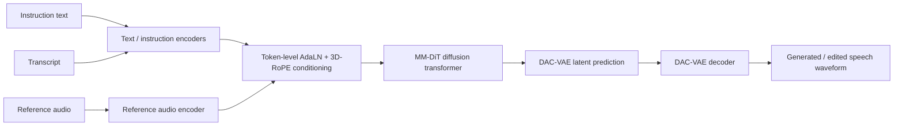
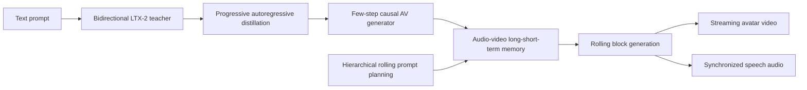
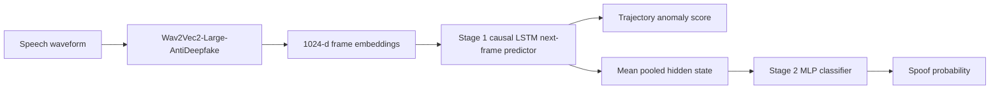
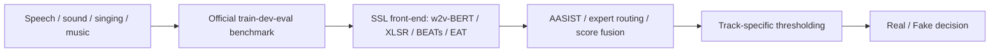
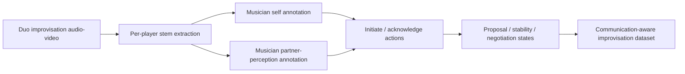

# 语音 / 音频 / 音乐论文速递
## 2026-08-17

> 实际对应 arXiv 更新日：**2026-08-17**  
> 检索范围：`cs.SD + eess.AS`  
> 只放按 ML 顶会审稿口径看，最值得多数读者花时间看的 **5 篇**

## 📋 总览

- 共收录 **5 篇** 相关论文
- 语音生成 / 音色编辑：**1 篇**
- 多模态 Avatar / 长时生成：**1 篇**
- 音频伪造检测 / 安全基准：**2 篇**
- 音乐交互 / 数据集：**1 篇**

今天这批最值得优先看的，不是“谁又把 backbone 做大”，而是三条更实在的线。`VoiceDesigner` 把文本到声音生成、voice cloning 和 voice editing 真正统一到一个扩散框架里，而且把虚构角色音色和编辑数据构造这两个最难凑的数据口也补了；`Trajectory Dynamics in SSL Latent Space` 则给了一个很干净的判断：在 hardest cross-corpus deepfake 检测上，建模“正常人类发声轨迹”比继续堆静态 pooled embedding 更有用；`Omni-LiveAvatar` 虽然偏 `cs.MM`，但它把 joint audio-video avatar 真做到了 minute-level 实时流式生成，这件事对数字人、口播 Avatar 和长时音画对齐都不是小补丁。

剩下两篇里，`AT-ADD` 更像 benchmark/比赛总结，但它把 all-type audio deepfake detection 的现实难度讲透了；`H2H Music Improv` 不是生成模型 paper，却是少见把“即兴交流”正式建模并做成双侧意图标注数据集的工作。做 co-creative music 或互动音乐系统的人，这篇的启发可能比又一篇 MIDI 生成论文更直接。

## 精选入选规则

- **新意（0-3）**：是不是提出了新的表示、接口、训练组织方式，或者把旧问题拆得更对
- **影响力（0-3）**：是不是贴近语音大模型、TTS、音频安全、音乐交互、多模态生成这些主线
- **证据强度（0-2）**：有没有像样的 baseline、消融和关键数值
- **受众匹配度（0-2）**：对语音大模型 / 语音前端 / 音乐方向 / 多模态研究者有没有直接启发

分数校准：

- **6**：可读，但更像局部补洞
- **7**：信息量够，值得过一遍
- **8+**：建议优先精读

## 总览表

| 方向 | 序号 | 论文 | 评分 | 关键词 |
|---|---:|---|---:|---|
| 语音生成 / 音色编辑 | 1 | VoiceDesigner | 8.5/10 | text-to-voice, unified editing, MM-DiT, character voices, data simulation |
| 多模态 Avatar / 长时生成 | 2 | Omni-LiveAvatar | 8.5/10 | streaming avatar, autoregressive distillation, long-short-term memory, prompt planning |
| 音频伪造检测 / 安全 | 3 | Trajectory Dynamics in SSL Latent Space for Audio Deepfake Detection | 8/10 | one-class detection, SSL trajectory, LSTM predictor, cross-corpus generalization |
| 音频伪造检测 / 安全基准 | 4 | AT-ADD Challenge Summary | 7.5/10 | all-type audio deepfake detection, benchmark, routing ensemble, Macro-F1 |
| 音乐交互 / 数据集 | 5 | H2H Music Improv | 7.5/10 | music improvisation, communication model, intention-perception, audio-visual dataset |

## 🗣️ 语音生成 / 音色编辑

### [1] VoiceDesigner: Text-to-Voice Generation and Editing via Unified Diffusion Modeling and Data Augmentation

- **评分**：8.5/10
- **作者/机构**：Jiarui Hai, Karan Thakkar, Ke Chen, Yunyun Wang, Jiaqi Su, Rithesh Kumar, Mounya Elhilali, Zeyu Jin；Johns Hopkins University；Adobe Research
- **论文链接**：https://arxiv.org/abs/2608.13613
- **PDF**：https://arxiv.org/pdf/2608.13613.pdf
- **代码链接**：暂无
- **Demo 链接**：https://voicedesigner-demo.github.io/

#### 📌 简介
这篇做的不是单一 TTS，也不是单一 voice conversion，而是把 text-to-voice generation、voice cloning、instruction-based voice editing 放进同一个框架。它最有价值的点不是“统一”两个字，而是确实把非人类角色音色、细粒度风格编辑、以及 editing pair 稀缺这几个老问题一起处理了。

#### ☠️ 毒舌点评
这篇不像很多“统一语音生成”论文那样只是在标题里统一，正文还是一个 TTS 模型加几个变体实验。它的数据构造、模型结构和任务覆盖都算完整，尤其是 character voice 和 editing 这块是真做了脏活。缺点也很明确：音质还没追上商业系统，很多优势来自数据模拟和任务定义，而不是范式级架构突破。所以它更像一篇很强的系统论文，而不是“下一个语音基础模型”。

#### 🔧 技术方案

- **模型解决的问题**：已有 text-to-voice 系统大多只会生成常规真人声线，碰到虚构角色、极端情绪、语气修改和风格编辑时就开始掉链子；而 voice editing 方法又经常把生成和编辑拆成两套系统。`VoiceDesigner` 解决的是“如何在一个框架里同时支持多样 voice design、zero-shot cloning 和 instruction-based editing，并且把人类与非人类角色都覆盖进去”。

- **模型架构**：
  - **输入**：文本指令、转写文本、可选参考音频，以及编辑任务下的风格修改指令。
  - **输出**：48 kHz 的目标语音波形。
  - **主干**：`DAC-VAE + duration predictor + 1.0B MM-DiT diffusion transformer`。
  - **关键模块**：
    - `token-level AdaLN`：让不同条件 token 在扩散状态里被显式区分，不再混成一锅。
    - `3D-RoPE`：把指令、文本和音频目标 token 的位置编码解耦，减少异质 token 干扰。
    - `hybrid data pipeline`：一条 DSP 模拟非人类角色音色，一条生成式模拟负责扩 style、扩 editing pair。
    - `duration predictor`：保证文本到语音的时长与内容对齐。
  - **信号流怎么走**：先用 `DAC-VAE` 把目标语音压成 25 Hz latent；文本和指令分别编码，参考音频通过编码器抽 speaker/style 条件；然后把这些条件送进 `MM-DiT`，在 flow matching 过程里预测目标 latent，最后再由 VAE decoder 还原波形。

- **关键设计 / 核心创新**：
  - 第一，它不是只在真人语音上补点情绪标签，而是专门用 DSP 管线去造 monster、ghost、robot 这类人类本身发不出的音色。
  - 第二，生成和编辑共用一套 `MM-DiT`，不是 generation 一个模型、editing 再补一个外挂。
  - 第三，架构改动集中在条件建模而不是盲目堆参数，说明作者知道真正难点在多条件协同，而不是“再大一点”。

- **训练 / 推理策略**：
  - `DAC-VAE` 在 `Emilia`、`Common Voice`、`VCTK`、`EARS`、`AudioSet` 上训练，统一到 `48 kHz`，latent frame rate 为 `25 Hz`。
  - 主模型分三阶段训练：
    - `Stage 1 Pretraining`：`400k steps`，`64×A100`，最大音频时长 `20s`。
    - `Stage 2 Task Adaptation`：`100k steps`，`64×A100`，最大时长 `30s`。
    - `Stage 3 Quality Refinement`：`10k steps`，`16×A100`，只保留高质量真实录音和少量高质量 DSP 数据。
  - 还训练了单独的 duration predictor，并在 editing 数据上构造 pitch/formant 变换对。
  - 推理性能明确给出：在单张 `RTX 4090` 上，voice generation `RTF 0.36`，voice editing `RTF 0.42`。

#### 📊 实验结果
- **对比基线**：`CapSpeech-NAR`、`Qwen3TTS-VoiceDesign`、`ElevenLabs-TTV API`、`E2-TTS`、`F5-TTS`、`CosyVoice-3`、`IndexTTS-2`、`Step-Audio-EditX`。
- **文本到声音生成**：
  - objective 指标上，`VoiceDesigner` 做到 `WER 1.22`、`Style-ACC 0.66`；
  - 对比 `Qwen3TTS-VoiceDesign` 的 `1.39 / 0.50`，和 `CapSpeech-NAR` 的 `2.12 / 0.57`，内容准确度和 prompt-style 对齐都更强。
- **主观听感**：
  - 在 `TTV-Traits` 上，`MOS-C 3.93`，高于 `CapSpeech-NAR 3.26` 和 `Qwen3TTS-VoiceDesign 3.10`；
  - 在 `TTV-Character` 上，`MOS-C 3.71`，也高于 `Qwen3TTS-VoiceDesign 3.59`；
  - 但纯音质上它仍落后于商业系统，`MOS-Q 3.96`，不如 `ElevenLabs 3.97` 的稳定感，更低于 `Qwen3TTS 4.20` 的干净程度。
- **zero-shot cloning**：
  - `Seed-TTS test-en` 上，`VoiceDesigner` 的 `WER 1.70`、`SIM-o 0.757`；
  - 对比 `E2-TTS 2.19 / 0.710`、`F5-TTS 1.83 / 0.670`、`IndexTTS-2 2.23 / 0.706`，说明它在 intelligibility 和 speaker preservation 上都站得住。
- **挑战性角色音色克隆**：
  - 主观 `MOS-T 3.93`、`MOS-S 4.00`；
  - 对比 `CosyVoice-3-0.5B` 的 `2.48 / 2.63` 和 `IndexTTS-2` 的 `3.85 / 3.94`，角色音色这块确实不是陪跑。
- **voice editing**：
  - `MOS-E 4.129`、`SIM-t 0.884`；
  - 对比 `Step-Audio-EditX 3.333 / 0.734` 和 `IndexTTS-2 3.494 / 0.856`，编辑指令执行和音色保持都更强。

#### 💡 为什么值得看
这篇值得看的，不是“又一个语音扩散模型”，而是它把 voice design 里最难脏活的两块补齐了：一块是角色/非人类声音的数据稀缺，一块是 generation 与 editing 的接口割裂。如果你做可控 TTS、角色语音、或者 voice agent 里的音色编辑，这篇的工程做法比很多口号更值钱。

#### 评分：8.5/10
理由：方法设计完整，实验覆盖 generation、cloning、editing 三条线，数据构造也不是假装不存在。扣分点是闭源代码、生成音质仍未追平强商业系统，而且很多收益来自系统级设计而不是新范式本身。

## 🎬 多模态 Avatar / 长时生成

### [2] Omni-LiveAvatar: Minute-Level Real-Time Streaming Joint Audio-Visual Avatar Generation

- **评分**：8.5/10
- **作者/机构**：Lunjie Zhu, Xingtong Ge, Fangyu Lin, Yi Zhang, Zhening Liu, Mengfei Li, Yumeng Zhang, Guanglu Song, Yu Liu, Jun Zhang；Hong Kong University of Science and Technology；Vivix Group Limited
- **论文链接**：https://arxiv.org/abs/2608.13602
- **PDF**：https://arxiv.org/pdf/2608.13602.pdf
- **代码链接**：**代码已开源** https://github.com/Aoko955/Omni-LiveAvatar
- **Demo 链接**：暂无

#### 📌 简介
这篇想解决的是 joint audio-video avatar generation 里最烦的一件事：现有模型大多只能做短片段、延迟又高，根本不适合实时数字人。作者给出的方案是把一个大双向 joint audio-video diffusion teacher 蒸馏成 few-step causal generator，再用同步音视频 long-short-term memory 和 rolling prompt planning，把生成长度直接拉到分钟级。

#### ☠️ 毒舌点评
这篇很工程，但不是“调几个 trick 然后硬吹”的那种工程。它把实时、长时一致性、音画同步这三个本来会互相打架的目标一起顶上去了，而且表格很难看错。短板也很明显：它站在 `19B` 级 teacher 和 internal `35K prompts` 数据上，复现成本不低；另外它更像 Avatar foundation system，而不是一般意义上的 speech/audio 模型。不过只要你在做口播数字人、长时 lip-sync 或 joint AV generation，这篇是当天最值得看的一篇跨模态论文。

#### 🔧 技术方案

- **模型解决的问题**：双向注意力 + 多步去噪的 joint audio-video 模型质量高，但推理太慢、显存太重、长度太短。要做实时互动数字人，就得同时解决因果化、长时 drift、prompt 长程调度三个问题。`Omni-LiveAvatar` 的目标就是把 joint AV generation 拉到 minute-level streaming，且保持音画同步和身份稳定。

- **模型架构**：
  - **输入**：文本 prompt，描述 avatar 身份、场景和发声内容。
  - **输出**：同步的视频序列与对应音频。
  - **主干**：基于 `19B LTX-2` teacher 的 few-step causal joint audio-video generator。
  - **关键模块**：
    - `progressive autoregressive distillation`：把 bidirectional diffusion teacher 转成 causal generator。
    - `synchronized audio-video long-short-term memory`：保留长时身份与短时上下文。
    - `hierarchical rolling prompt planning`：把全局人物/场景语义和局部说话语义分层调度。
    - `joint rolling forcing` 与 `trajectory-aligned causal initialization`。
  - **信号流怎么走**：先由双向 teacher 产生 distillation 轨迹，再逐阶段蒸馏成因果 few-step 生成器；推理时每个 rolling block 用长短期记忆缓存人物和最近语境，再结合层级 prompt 规划生成同步音视频块。

- **关键设计 / 核心创新**：
  - 不是简单把 video distillation 老套路平移到音视频，而是重新处理了 joint audio-video causalization 的稳定性问题。
  - 长时一致性没有只靠 KV cache 硬顶，而是显式做 periodic re-anchor 的长短期记忆。
  - prompt 调度不是每 5 秒暴力切 prompt，而是 global prompt + block-level local prompt 组合，防止语义切换把音画同步打崩。

- **训练 / 推理策略**：
  - 建立在 `19B LTX-2` 之上，所有训练用 `8×H200`、`bf16`、`AdamW`、global batch size `8`。
  - 使用 internal `35K text prompts` 构造蒸馏数据。
  - 三阶段训练：
    - `Stage I`：`4,000 steps`，lr `2e-5`
    - `Stage II`：`3,000 steps`，lr `1e-4`
    - `Stage III`：`3,000 steps`，lr `2e-5`
  - 推理时每个 block 只需 `4` 次 denoising step，分辨率 `512×768`。
  - 单张 `H200` 上，5 秒和 60 秒场景都支持实时 streaming。

#### 📊 实验结果
- **对比基线**：bidirectional `LTX-2`、`Ovi`，以及 real-time autoregressive `OmniForcing`、`Hallo-Live`。
- **5 秒生成**：
  - `Omni-LiveAvatar` 达到 `19.57 FPS`，而 `OmniForcing` 是 `16.11 FPS`，`Hallo-Live` 是 `16.50 FPS`；
  - overall `QS 81.72`，高于 `OmniForcing 80.05` 和 `Hallo-Live 74.21`；
  - `VA 9.08` 也高于 `8.11` 与 `8.04`；
  - 音画同步 `Sync-C 6.16`，对比 `1.60` 和 `4.50`，不是小赢。
- **60 秒生成**：
  - `21.99 FPS`，比第二快 baseline `16.18 FPS` 还高出 `1.36×`；
  - human identity `HI 98.61`，而 `OmniForcing` 只有 `50.19`，`Hallo-Live` 是 `67.60`；
  - `Sync-C 6.76` 对比 `0.28 / 0.72`，说明长时口型没有后半程直接散架；
  - `VA 9.82`，对比 `6.68 / 5.46`，文本语义跟随也更稳。
- **teacher 对比**：
  - 单张 `H200` 上，相比双向 teacher `LTX-2` 的 `0.60 FPS`，它达到约 `33×` 加速。
- **消融结果也硬**：
  - 去掉 rolling forcing 后，`UT 3.19 -> 1.93`，`Sync-C 6.16 -> 4.58`；
  - 去掉长时记忆后，长视频 `AQ 61.98 -> 58.61`，`Sync-C 6.76 -> 5.79`；
  - 去掉 rolling prompt，`UT 2.80 -> 1.60`，`Sync-C 6.76 -> 4.47`。

#### 💡 为什么值得看
如果你关心的是真实可部署的 joint audio-video avatar，这篇是当天最有含金量的系统论文。它最重要的价值不只是“快”，而是把快、长时稳定和音画同步同时做到了，并且给出了足够多的 ablation 去证明每个模块不是摆设。

#### 评分：8.5/10
理由：结果非常硬，问题也真，minute-level streaming 不是 PPT 指标。扣分点在于重度依赖大 teacher 和内部数据，外部团队完全复刻的门槛不低。

## 🛡️ 音频伪造检测 / 安全基准

### [3] Trajectory Dynamics in Self-Supervised Learning Latent Space for Audio Deepfake Detection

- **评分**：8/10
- **作者/机构**：Tomás Andrade Weber；Barcelona Supercomputing Center
- **论文链接**：https://arxiv.org/abs/2608.13817
- **PDF**：https://arxiv.org/pdf/2608.13817.pdf
- **代码链接**：Zenodo 代码与配置 https://doi.org/10.5281/zenodo.21879214
- **Demo 链接**：暂无

#### 📌 简介
这篇的核心假设很直白：真实人类发声受生理约束，所以在 SSL latent space 里会形成有规律的时序轨迹；合成语音再像，也未必能把这条轨迹学对。作者据此做了一个很克制的两阶段系统：Stage 1 用 bonafide-only 的 causal LSTM 预测下一帧 latent；Stage 2 再把 LSTM 隐状态交给小 MLP 做监督分类。

#### ☠️ 毒舌点评
这篇没有任何花活，甚至看起来有点朴素，但恰恰因此更可信。它不是靠新 backbone、新损失、新花名词堆出来的，而是围绕一个明确假设做 controlled comparison。短板在于模型本身不复杂，近域 benchmark 上还不如强监督模型亮眼；可一到真正恶心的 cross-corpus deepfake 数据上，这条“轨迹动态”线就开始显出价值。做音频安全的人应该认真看。

#### 🔧 技术方案

- **模型解决的问题**：很多 SSL-based deepfake detector 只会把 frame embedding 做 global average pooling，再交分类头。这在 matched benchmark 上够用，但一碰到跨语料、跨生成器、跨 codec 的真实场景，静态 pooled 表示就很容易失真。`Trajectory Dynamics` 解决的是“能不能把 bonafide 语音的时序生理轨迹显式建模出来，用 one-class 方式抓住合成语音的动态违和感”。

- **模型架构**：
  - **输入**：`Wav2Vec2-Large-AntiDeepfake` 提取的 `1024` 维 frame-level SSL 表示，`50 fps`。
  - **输出**：Stage 1 输出 trajectory anomaly score，Stage 2 输出 spoof probability。
  - **主干**：`2-layer causal LSTM` 加一个小 `3-layer MLP`。
  - **关键模块**：
    - `static baseline`：同一 backbone 上的 GAP+centroid/L2 距离基线。
    - `Stage 1 causal next-frame predictor`：只用 bonafide 语音训练。
    - `Stage 2 supervised MLP`：读取 frozen LSTM hidden state。
    - `trajectory score`：用下一帧预测误差作为异常度。
  - **信号流怎么走**：先把语音映射到 AntiDeepfake SSL latent，再让 LSTM 逐帧预测下一时刻 latent；若整段 utterance 的预测误差高，就说明这条轨迹不像真人发声。之后再把 LSTM hidden state mean-pool 给 MLP，让监督信号去补足对已知 spoof 类型的判别。

- **关键设计 / 核心创新**：
  - 重点不在更强前端，而在于把“bonafide trajectory 是否物理可解释”这个信号单独拎出来。
  - 用同一个 AntiDeepfake backbone 做 static baseline 和 dynamic model，尽量隔离“到底是时序建模有用，还是换 backbone 有用”。
  - Stage 1 和 Stage 2 的结果反差本身也很有信息量：近域强监督更吃香，远域 one-class 动态建模反而更稳。

- **训练 / 推理策略**：
  - `Stage 1` 只用 `ASVspoof 2019 LA train` 的 `2,580` 条 bonafide 语音训练，`500 epochs`，`AdamW`，初始 lr `1e-3`，dropout `0.1`。
  - `Stage 2` 用 `25,380` 条 utterances（`2,580` bonafide + `22,800` spoof），MLP 维度 `512→256→128→1`，dropout `0.3`，训练 `100 epochs`。
  - 为了消除 padding 作弊，作者先移除超过 `500 ms` 的长静音，再统一替成 `200 ms` 自然停顿。
  - 方差估计做得很老实：`5` 个 Stage 1 seed，每个 seed 再训 `5` 个 Stage 2 MLP，一共 `25` 次 run。

#### 📊 实验结果
- **对比基线**：`Static GAP baseline`、`BreathNet`、`QAMO`、`SLIM`、`NII-GAP`。
- **近域 benchmark**：
  - `ASVspoof 2019`：Stage 2 `EER 1.11%`，优于 static `1.51%`，但不如 `BreathNet 0.23%`；
  - `ASVspoof 2021`：Stage 2 `0.75%`，优于 static `0.98%`、`BreathNet 1.87%`、`QAMO 1.54%`、`SLIM 3.60%`；
  - `Codecfake`：Stage 2 `2.43%`，优于 static `3.21%`。
- **难的 cross-corpus benchmark**：
  - `MLAAD-EN`：Stage 1 `5.71%`，大幅优于 static `22.86%`，也优于 Stage 2 `10.02%` 和 `SLIM 10.7%`；
  - `DE2024`：Stage 1 `30.35%`，优于 static `52.52%`，也优于 Stage 2 `35.41%`，甚至超过同 backbone 的监督基线 `NII-GAP 33.36%`。
- **论文真正有价值的结论**：
  - 近域数据上，spoof 类型和训练集分布接近时，Stage 2 监督学习更占便宜；
  - 一到 `MLAAD-EN` 和 `DE2024` 这种生成器/分布都更乱的场景，`Stage 1 bonafide-only` 反而最好。
- **附带分析**：
  - 作者用 UMAP 明确展示了从 `ASVspoof -> In-the-Wild -> MLAAD -> DE2024` 的 bonafide/spoof 混叠程度逐步加重，这能解释为何 static pooled baseline 在 `DE2024` 上直接崩到 `52.52% EER`。

#### 💡 为什么值得看
这篇最值得看的，是它把“deepfake detection 到底该学 fake，还是先学真”这个老问题给出了很清楚的实验答案。不是所有场景都该继续堆更强监督分类器；在最脏的 out-of-domain 场景里，先把正常人类发声轨迹建好，反而更有用。

#### 评分：8/10
理由：假设明确、对照干净、结果对实际安全场景有价值。扣分点是方法本体不算新潮，近域 benchmark 上也不是全面碾压。

### [4] AT-ADD: All-Type Audio Deepfake Detection Challenge Summary

- **评分**：7.5/10
- **作者/机构**：Yuankun Xie, Haonan Cheng, Jiayi Zhou, Xiaoxuan Guo, Tao Wang, Changhao Zhang, Jian Liu, Weiqiang Wang, Ruibo Fu, Xiaopeng Wang, Hengyan Huang, Xiaoying Huang, Long Ye, Guangtao Zhai；Communication University of China；Ant Group；Chinese Academy of Sciences；Beijing Institute of Technology；Shanghai Jiao Tong University
- **论文链接**：https://arxiv.org/abs/2608.14249
- **PDF**：https://arxiv.org/pdf/2608.14249.pdf
- **代码链接**：暂无
- **Demo 链接**：https://at-add.com/

#### 📌 简介
这篇不是新检测模型，而是 `ACM MM 2026` 的音频 deepfake 挑战总结。它的价值在于把问题从“speech spoof”扩展到真正的 all-type audio：speech、environmental sound、singing voice、music 全都进来，而且还把设备、环境、重采样、速度变化、pitch shift 这些现实扰动一起算上。

#### ☠️ 毒舌点评
挑战总结论文最容易写成流水账，但这篇至少给出了足够具体的数据构成和冠军系统模式。它当然不是算法创新 paper，不能拿来吹“我发明了新 detector”；可如果你做音频安全，这种 benchmark 反而比又一个只在 ASVspoof 上刷小数点的模型更重要。坏消息是，从冠军系统的配方看，行业现在还是很依赖 SSL front-end、数据增强、路由和集成，说明问题并没有被谁真正解决。

#### 🔧 技术方案

- **模型解决的问题**：真实部署里的 audio deepfake 不只是一条 TTS 语音。可能是 replay、被压缩过的 speech、合成的 singing、伪造 music，甚至音频类型本身在测试时都未知。`AT-ADD` 解决的是“如何构造更接近真实应用场景的 all-type audio deepfake benchmark，并总结当前最有效的系统设计模式”。

- **模型架构**：
  - **输入**：未知类型的音频片段，可能是 speech、sound、singing 或 music。
  - **输出**：二分类 real / fake 判定。
  - **主干**：论文本身不是单一模型，而是 `benchmark + winning-system pattern summary`。
  - **关键模块**：
    - `Track 1`：robust speech deepfake detection。
    - `Track 2`：all-type audio deepfake detection。
    - 常见 backbone：`w2v-BERT 2.0`、`wav2vec2-XLSR`、`BEATs`、`EAT-large`。
    - 常见后端：`AASIST`、`AASIST3`、multi-expert routing、score-level fusion。
  - **信号流怎么走**：官方先构建 train/dev/progress/eval 四种 split，再按 track 提供 speech-only 或 all-type 数据；参赛系统通常先用 SSL front-end 编码，再走 type routing 或 ensemble fusion，最后输出 real/fake 决策。

- **关键设计 / 核心创新**：
  - 不是只做 TTS/VC，Track 2 直接把 singing、sound、music 也纳入 deepfake 检测。
  - `closed setting` 很重要：不让大家随便拿外部 deepfake 数据灌进去，至少 benchmark 可比性更强。
  - 现实扰动设计做得实在，设备、环境、speed、pitch、resample、codec、replay 都算，这比只比干净录音更像部署条件。

- **训练 / 推理策略**：
  - 论文总结的 winning recipe 很一致：大 SSL front-end + 强数据增强 + multi-crop inference + type-aware routing / score fusion。
  - `WaveShield`、`Fosafer`、`starfire`、`orange9` 这些高分系统几乎都用了 noise、reverb、codec、perturbation、segment-level augmentation。
  - Track 2 的冠军 `starfire` 甚至先用冻结的 `BEATs` 做音频类型路由，再分配到不同专家 detector，而不是强行一个单模型打四种音频。

#### 📊 实验结果
- **数据规模本身就很猛**：
  - `Track 1`：train `49,575`，dev `49,734`，eval `146,346`；
  - `Track 2`：train 总量 `146,781`，eval 总量 `229,373`；
  - 其中 Track 2 eval 细分为 speech `144,078`、sound `28,593`、singing `24,332`、music `32,370`。
- **挑战覆盖面**：
  - `Track 1` 覆盖 `40+` speech deepfake generators；
  - `Track 2` 覆盖 `70+` audio deepfake generators。
- **最终 leaderboard**：
  - `Track 1` 冠军 `WaveShield`：`Macro-F1 90.71`，高于 `Fosafer 86.67` 和 `sonomsl 86.63`；
  - `Track 2` 冠军 `starfire`：`Macro-F1 96.10`，高于 `orange9 95.58` 和 `ThreeTO 93.95`。
- **系统模式对比**：
  - `Track 1` 更吃重鲁棒性和 domain mismatch 控制，顶级系统多是 `w2v-BERT/XLSR + AASIST + 重增强 + 多模型融合`；
  - `Track 2` 则明显偏向 `audio-type aware`，冠军系统不是一个大一统分类器，而是 hard routing 到 type-specific detector。
- **这篇论文能证明什么**：
  - 当前 all-type audio deepfake detection 已经能在受控 benchmark 上做出 `96.10` 级别的 Macro-F1。
- **它不能证明什么**：
  - 不能证明问题已经解决。因为论文自己就承认，真正困难还在 unseen generators、真实通道扰动，以及不同 audio type 之间的性能均衡。

#### 💡 为什么值得看
这篇值得看的不是“冠军又刷了多少分”，而是它把行业现状说透了：现在最好用的方案依然是大 SSL 表示、增强、集成和路由，而不是谁突然发明了万能 detector。做音频安全的人读这篇，能更快判断自己该补 benchmark、补数据、还是补 type-aware 结构。

#### 评分：7.5/10
理由：benchmark 价值高，数据和 leaderboard 细节足，适合作为路线判断依据。扣分点是它本质上是 challenge summary，不是单一算法论文。

## 🎼 音乐交互 / 数据集

### [5] H2H Music Improv: A Communication Model and Audio-Visual Dataset for Music Improvisation

- **评分**：7.5/10
- **作者/机构**：Aleksandra Teng Ma, Anthony Cammarota, Jiayi Wang, Alexandria Smith, Cheng-Zhi Anna Huang, Jeffrey Albert, Alexander Lerch；Massachusetts Institute of Technology；Georgia Institute of Technology
- **论文链接**：https://arxiv.org/abs/2608.13957
- **PDF**：https://arxiv.org/pdf/2608.13957.pdf
- **代码链接**：暂无
- **Demo 链接**：https://h2himprov.github.io/

#### 📌 简介
这篇不是音乐生成模型，而是给实时 AI 即兴系统补最缺的那块地基：通信建模。作者先和 expert improvisers 做长达数月的 co-design，把 free improvisation 里“谁在提议、谁在接球、什么时候进入稳定共享空间” formalize 成 machine-readable 状态模型，然后做出一个带双侧意图标注的音视频数据集。

#### ☠️ 毒舌点评
这类论文最容易被嫌“没有大模型、没有炫指标”，但如果你真的做 co-creative music，这篇比又一个 token-level MIDI generator 更接近根问题。它的局限也非常诚实：数据只有 `6` 小时多，参与者偏少且不够多样，离通用人机即兴理论还早。可它至少把“AI improviser 为什么不会交流”这件事从吐槽变成了可标注、可分析、可建模的问题。

#### 🔧 技术方案

- **模型解决的问题**：现有实时 AI 即兴系统大多是在生成器外面再套 interaction mode，比如 call-and-response、trading、按钮控制等，根本没把 communication 当作算法设计的第一公民。`H2H Music Improv` 解决的是“如何把 free improvisation 中的交流过程 formalize 成状态与动作，并做成能用于后续学习的双侧标注数据”。

- **模型架构**：
  - **输入**：双人 free improvisation 的音频、视频、每位演奏者自己的意图标注，以及对搭档意图的感知标注。
  - **输出**：按时间排列的 `initiate / acknowledge` 动作流，以及 `negotiation / proposal / stability` 三种状态序列。
  - **主干**：不是神经网络，而是一个 communication state model 加一套 annotation protocol。
  - **关键模块**：
    - `point-in-time actions`：`initiate` 与 `acknowledge`
    - `states`：`proposal`、`stability`、`negotiation`
    - `two-sided annotation`：同时记录 produced intention 和 perceived intention
    - `audio-visual dataset with clean per-player stems`
  - **信号流怎么走**：先进行 duo free improvisation 录制，再让每位演奏者回看整段音视频，独立标注自己何时发起新想法、何时认可对方想法，以及对方看起来在做什么；随后把这些动作拼成状态时间线，用来分析人与人之间交流的对齐与偏差。

- **关键设计 / 核心创新**：
  - 重点不是造一个 improvisation 模型，而是先定义“交流”这件事该怎么被机器读懂。
  - 双侧标注尤其关键，因为作者发现同一时刻一方觉得自己在提案，另一方可能根本没接收到，这正是人机即兴系统最容易忽略的 asymmetry。
  - 数据不只给音频，还给视频和 per-player stems，为后续多模态研究留了接口。

- **训练 / 推理策略**：
  - 这篇没有传统意义上的模型训练或推理流程，主线是数据构建与分析。
  - 但它的“构建协议”本身很重要：团队进行了 `6` 个月、双月一次的 co-design 迭代，再录制正式会话、回看、独立标注、汇总状态。
  - 论文后半段用整体对齐率和状态级 IoU 来分析意图/感知差距，而不是伪装成“训练一个分类器就解决了”。

#### 📊 实验结果
- **对比对象**：
  - 这篇没有统一 benchmark baseline 去刷分，真正的对比对象是现有 post-hoc 交互系统和以往缺乏双侧意图标注的数据资源。
  - 文中点名的系统脉络包括 `Somax2`、`Spire Muse`、`jam_bot`、`Voyager` 等，这些系统大多有交互策略，但没有 machine-readable communication model。
- **数据规模**：
  - 数据集共 `37` 段 duo improvisation，合计 `6 小时 8 分钟`；
  - 来自 `6` 个演奏者组合、`5` 位专家演奏者；
  - 一共包含 `1,368` 条已标注动作。
- **配对与时长**：
  - 每组时长大致在 `54 分钟` 到 `1 小时 6 分钟`；
  - `2` 组演奏者此前合作过，`4` 组是首次合作。
- **最关键的分析结论**：
  - `stability` 状态的中位对齐率达到 `81.3%`，说明双方一旦进入共享空间，感知通常一致；
  - `proposal` 的中位对齐率只有 `23.6%`；
  - `negotiation` 更夸张，中位对齐率是 `0%`，`37` 个 clip 里有 `27` 个完全没有 negotiation overlap。
- **这组数字意味着什么**：
  - 即兴交流里最难的不是“大家稳定一起玩”的阶段，而是“我以为我在提议，你到底有没有接收到”的那一刻。
  - 这也解释了为什么很多 AI improviser 看起来会跟着演，但始终不像在真正交流。

#### 💡 为什么值得看
如果你做的是人机共创音乐，这篇值得看的点非常明确：它给了一个能落到算法接口上的 communication vocabulary。你不一定立刻拿它训练模型，但至少以后不会再用“互动性”这种虚词糊弄自己，而是能问：系统到底会不会 initiate，会不会 acknowledge，会不会进入 shared stability。

#### 评分：7.5/10
理由：概念和数据资源都很有价值，尤其适合 co-creative music 方向。扣分点是数据规模仍小、参与者不够多样，也没有直接展示基于该标注训练出的强模型。

## 最后结论

今天最值得优先看的顺序，我会这么排：

1. **VoiceDesigner**：如果你做可控 TTS、角色音色、voice editing，这是最值得先精读的一篇，任务设计和实验都够硬。
2. **Trajectory Dynamics in SSL Latent Space**：如果你做音频安全或 deepfake detection，这篇的 one-class 动态建模思路很值得认真消化，尤其是跨域 benchmark 上的结论。
3. **Omni-LiveAvatar**：做数字人、音视频 joint generation、长时 lip-sync 的人应该立刻看，工程强度和结果都很硬。
4. **AT-ADD**：适合拿来定 benchmark 和系统路线，不是新模型，但对判断行业现状很有用。
5. **H2H Music Improv**：受众最窄，但对 co-creative music 和互动音乐系统的长期价值可能被低估。

一句话收尾：今天这批论文里，最值得跟的不是“再大一点的模型”，而是**接口和结构到底有没有被做对**。`VoiceDesigner` 解决的是控制接口，`Trajectory Dynamics` 解决的是判别信号，`Omni-LiveAvatar` 解决的是长时生成结构。真正会留在后续系统里的，多半是这些东西，而不是表格里多抠出来的那零点几个点。
