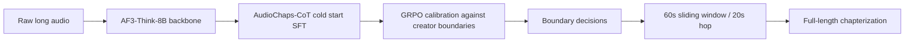
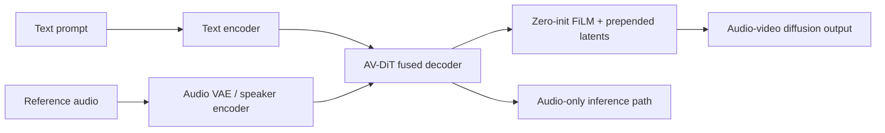
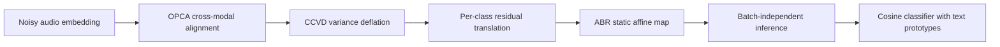
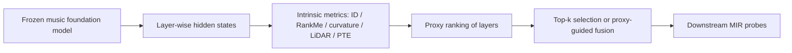
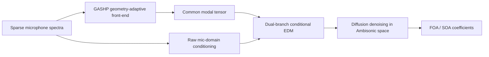

# 语音 / 音频 / 音乐论文速递
## 2026-08-18

> 实际对应 arXiv 更新日：**2026-08-18**  
> 检索范围：`cs.SD + eess.AS`  
> 只放按 ML 顶会审稿口径看，最值得多数读者花时间看的 **5 篇**

## 📋 总览

- 共收录 **5 篇** 相关论文
- 语音大模型 / 长音频章节化：**1 篇**
- 语音 / 歌声生成：**1 篇**
- 音频鲁棒适配 / 安全：**1 篇**
- 音乐基础模型分析：**1 篇**
- 空间音频 / 多通道编码：**1 篇**

今天这批最值得优先看的，不是“谁又把 backbone 做大”，而是三条更实在的线。`AudioChaps` 把长音频章节化从“静态打分”推进到“RL 对齐编辑判断”，而且是拿 GRPO 和 CoT 冷启动真做；`Adding Voice Cloning...` 说明 T2AV 体系不是只能产出默认嗓音，靠一层零初始化 FiLM 就能补上 reference-conditioned voice cloning；`PRISM` 则把严重声学偏移下的音频分类做成了一个闭式、无梯度、批次独立的几何校正问题，速度和可解释性都很硬。

剩下两篇也不是凑数。`What Makes a Good Layer?` 不是新模型，而是把 music foundation model 的 layer selection 讲成了可复现的层级分析，直接告诉你哪些层、哪些 metric 真能替代盲目扫层；`DiffM2A` 则是很扎实的空间音频论文，先用几何自适应前端把稀疏麦克风阵列拉到同一 modal 空间，再用 conditional diffusion 处理欠定 Ambisonic 反演，结果和失败边界都给得比较清楚。

## 精选入选规则

- **新意（0-3）**：是不是提出了新的表示、接口、训练组织方式，或者把旧问题拆得更对
- **影响力（0-3）**：是不是贴近语音大模型、TTS、音频安全、音乐表示、空间音频这些主线
- **证据强度（0-2）**：有没有像样的 baseline、消融和关键数值
- **受众匹配度（0-2）**：对语音大模型 / 语音前端 / 音乐方向 / 音频系统研究者有没有直接启发

分数校准：

- **6**：可读，但更像局部补丁或分析框架
- **7**：信息量够，值得过一遍
- **8+**：建议优先精读

## 总览表

| 方向 | 序号 | 论文 | 评分 | 关键词 |
|---|---:|---|---:|---|
| 语音大模型 / 长音频章节化 | 1 | Listen, Reason, and Segment | 8.5/10 | GRPO, CoT cold start, audio chapterization, creator judgment, sliding-window inference |
| 语音 / 歌声生成 | 2 | Adding Voice Cloning to Text-to-Audio-Video Models with a Single Zero-Initialised Layer | 8/10 | voice cloning, T2AV, zero-init FiLM, reference latents, audio-only inference |
| 音频鲁棒适配 / 安全 | 3 | Prototype-Rectified Iterative Self-supervised Manifold Denoising under Severe Acoustic Shift | 8.5/10 | closed-form TTA, CLAP, affine noise, OPCA, CCVD, CAR |
| 音乐基础模型分析 | 4 | What Makes a Good Layer? | 8/10 | layer-wise probing, MERT, MusicGen, PTE, proxy-guided fusion |
| 空间音频 / 多通道编码 | 5 | Geometry-adaptive Ambisonic encoding ... | 8/10 | GASHP, conditional diffusion, FOA/SOA, LOCATA, sparse arrays |

## 🤖 语音大模型 / 长音频章节化

### [1] Listen, Reason, and Segment: Aligning LALMs with Editorial Judgment for Media Chapterization

- **评分**：8.5/10
- **作者/机构**：Tony Alex, Wish Suharitdamrong, Sara Atito, Armin Mustafa, Muhammad Awais, Philip J. B. Jackson（University of Surrey）；Jiankang Deng, Ismail Elezi（Huawei Noah’s Ark Lab, London）
- **论文链接**：https://arxiv.org/abs/2608.16539
- **PDF**：https://arxiv.org/pdf/2608.16539.pdf
- **代码链接**：**代码已开源** https://github.com/ta012/AudioChaps
- **Demo 链接**：https://github.com/ta012/AudioChaps

#### 📌 简介
这篇做的是 audio chapterization，也就是把连续长音频切成主题连贯的章节。核心不是“再做一个 boundary detector”，而是把章节边界视为编辑判断，用 `AF3-Think-8B` 做 SFT 冷启动，再用 GRPO 把最终边界决策对齐到 creator-authored annotations。

#### ☠️ 毒舌点评
这篇不像标题党，确实把 RL、CoT、长音频评测和数据构造四件事串起来了。它的真正价值不在“听懂音频”，而在“学会编辑怎么切”，这比很多只会对着短 clip 打分的 LALM 实在得多；短板也直白，还是强依赖监督数据和比较规整的 chapter 标注，离通用长音频理解还差一截。

#### 🔧 技术方案
- **模型解决的问题**：长音频的章节切分并不由单一声学事件决定，而是编辑层面的主题转折和结构判断。传统 cascade 依赖 ASR 文本，遇到音乐、游戏、混合内容就容易塌；这篇要解决的是“能不能直接让 LALM 学会 creator-style boundary judgment”。
- **模型架构**：
  - **输入**：raw audio clip，加上 subtype / video metadata / chapterization query。
  - **输出**：是否存在章节边界，以及最终 boundary 位置。
  - **主干**：`Audio-Flamingo-3-Think-8B` 作为 backbone，先 SFT，再 GRPO。
  - **关键模块**：
    - `AudioChaps-CoT`：先生成边界相关 pseudo-CoT，再清洗成 acoustic perception log。
    - `SFT cold start`：把输出格式和 reasoning trace 先稳定下来。
    - `GRPO calibration`：对齐 creator-authored chapter annotations。
    - `sliding 60s window + 20s hop`：做 full-length inference。
- **信号流**：

- **关键设计 / 核心创新**：
  - 不是直接硬上 RL，而是先把模型改成能稳定吐 `<think>...</think><answer>...</answer>` 的结构化输出。
  - `AudioChaps-CoT` 不是简单伪标注，而是用 Step-Audio-R1 先抽 acoustic log，再让 Gemini 2.5 Pro 生成最终结构化 CoT，减少直接泄漏标签。
  - GRPO 的 reward 很干净，只看格式和 boundary correctness，不靠学一个花里胡哨 reward model。
- **训练 / 推理策略**：
  - `AudioChaps-Alignment` 约 `30k` labeled clips，`AudioChaps-CoT` 约 `22k` clips，`AudioChaps-Eval` 约 `16k` clips，来自 `749` 个 source videos。
  - `AudioChaps-R1-Zero` 先直接对 AF3-Think-8B 做 GRPO，验证纯 RL 能涨多少。
  - `AudioChaps-SFT` 先做 cold start，再上 GRPO，说明结构化先验对 chapterization 是必要的。
  - full-length 评测使用 `60s` window、`20s` hop，boundary 匹配容忍 `±10s`。

#### 📊 实验结果
- **主要 baseline**：`AF3-Think-8B`、`Step-Audio-R1-32B`、`Whisper-Large-V3 + Qwen3-235B-A22B-Instruct-2507-FP8` cascade、以及更大的 `Qwen3-Omni-30B-A3B-7B` / `MOSS-Think` 参照。
- **clip-level AudioChaps-Eval**：
  - `AF3-Think-8B`：`Avg F1 28.6`
  - `Step-Audio-R1-32B`：`Avg F1 59.3`
  - `AudioChaps-R1-8B`：`Avg F1 77.8`
  - 其中 `Music` 子类从 `F1 6.0` 拉到 `84.6`，`Structured Speech` 从 `27.0` 拉到 `77.8`。
- **full-length chapterization**：
  - `AF3-Think-8B`：`F1 6.5`
  - fixed interval baseline：`F1 9.5`
  - `AudioChaps-R1-8B`：`F1 37.6`
  - `dev-R2E` 从 `38.0s` 降到 `10.0s`
- **ablation**：
  - `AudioChaps-R1-Zero-8B`：`Avg F1 62.9`
  - `AudioChaps-SFT-8B`：`Avg F1 77.9`
  - `AudioChaps-R1-8B`：`Avg F1 77.8`
  - 说明 SFT 先把格式和 recall 拉起来，GRPO 再把 precision/recall 拉平。
- **cascade 对比**：
  - `Whisper-Large-V3 + Qwen3-235B-A22B-Instruct-2507-FP8` 在 Structured Speech 上只有 `F1 48.0`，明显低于 `AudioChaps-R1` 的 `77.8`
- **这篇能证明什么**：直接把 LALM 对齐成 creator-style chapterizer 是可行的，而且比纯 zero-shot 或 ASR-LLM cascade 强很多。
- **它不能证明什么**：它还不能说明这套方法对所有长音频结构任务都通用，尤其是没有那么清晰 editorial boundary 的场景。

#### 💡 为什么值得看
如果你做长音频索引、播客切章、媒体归档或者内容检索，这篇比一般 LALM benchmark 更接近可落地系统。它最有价值的地方，是把“章节边界”从主观编辑判断变成了可训练、可对齐、可评估的任务。

## 🗣️ 语音 / 歌声生成

### [2] Adding Voice Cloning to Text-to-Audio-Video Models with a Single Zero-Initialised Layer

- **评分**：8/10
- **作者/机构**：Ivan Mikheev, Viacheslav Vasilev, Anna Dmitrienko, Alexey Letunovskiy, Ivan Kirillov, Kirill Chernyshev, Denis Dimitrov；Kandinsky Lab, Moscow, Russia
- **论文链接**：https://arxiv.org/abs/2608.15690
- **PDF**：https://arxiv.org/pdf/2608.15690.pdf
- **代码链接**：暂无
- **Demo 链接**：暂无

#### 📌 简介
这篇做的是给预训练 T2AV 模型补 voice cloning 能力。方法很克制：不重训整个模型，只在 audio backbone 上加一个零初始化线性层，把 reference latents prepend 到音频流，再用全局 speaker embedding 做 FiLM，就能把基础 T2AV 变成 reference-conditioned voice cloning 模型。

#### ☠️ 毒舌点评
这篇的优点是够简洁，知道真正难点不在“再堆一个 speaker branch”，而在于怎么不毁掉原有音画 prior。缺点也明显：它本质上还是系统补丁，不是新范式；而且最强的地方是工程巧思，不是架构革命。要是你只想看“跨语种 voice cloning 怎么更稳”，这篇值；要期待范式翻盘，就别想太多。

#### 🔧 技术方案
- **模型解决的问题**：T2AV 模型原本能生成视频和音频，但默认说话人身份由训练分布决定，没法控制“谁在说话”。这篇要解决的是“如何在不重写 backbone 的前提下，把 reference voice cloning 插进现成 T2AV”。
- **模型架构**：
  - **输入**：文本 prompt、reference audio、speaker embedding。
  - **输出**：带目标说话人 timbre 的 audio / video 生成结果。
  - **主干**：异构 `AV-DiT`，音频和视频各自有 fused decoder blocks。
  - **关键模块**：
    - `zero-initialised linear layer Wfilm`：把 speaker embedding 变成 FiLM 参数。
    - `prepended reference latents`：把参考音频 latent 拼到音频流前面。
    - `split CFG`：把 text fidelity 和 reference voice strength 拆开调。
    - `audio-only inference`：直接短路 video 分支，保留音频路径。
- **信号流**：

- **关键设计 / 核心创新**：
  - `zero-init` 保证一开始模型行为和原始 T2AV 一样，不会把已学到的 audio-visual prior 一脚踹坏。
  - `reference latents + global speaker embedding` 是双通道约束，前者管局部 timbre，后者管全局 speaker identity。
  - 不是把 voice cloning 当独立 TTS，而是直接嵌进 T2AV 体系，保留视频生成能力。
- **训练 / 推理策略**：
  - 5B checkpoint `K6 A 5B` 和 3B 的 `K6 AV LITE` 都做了 voice-aware fine-tuning。
  - 训练时 `text-conditioning drop=0.1`、`reference drop=0.1`，并且有 `audio-only` / `video-only` 的 modality-clean schedule。
  - 推理默认 `50` diffusion steps，`wt=5`、`wr=4`。
  - 参考长度、语言匹配、去噪预处理都有额外因素分析，说明作者不是只跑一组 seed。

#### 📊 实验结果
- **主要 baseline**：`Qwen3-TTS 0.6B / 1.7B`、`IndexTTS2`、`XTTS-v2`、`NAVA`。
- **VCTK 674-sample benchmark**：
  - `K6 A 5B` 在三套 verifier 上 `SECS vs reference` 达到 `0.766 / 0.944 / 0.866`
  - `SECS vs centroid` 达到 `0.770 / 0.951 / 0.878`
  - `WER 5.76`、`CER 5.21`、`WER0 86.6`
  - 对比 `Qwen3-TTS 0.6B` 的 `0.678 / 0.936 / 0.840`，speaker fidelity 更强，但文本准确率不如专用 TTS。
- **K6 AV LITE**：
  - `SECS` 只比大模型掉约 `0.09`
  - 但能把音频路径推到约 `0.58B` effective pass，带来约 `30x` speed-up
- **no-regression check**：
  - `WER -46.0%`
  - `CER -47.0%`
  - `WER0 +113%`
  - `CLAP +29.4%`
  - `UTMOS +0.6%`
- **human SBS**：
  - fine-tuned 版本在 prompt follow / technical quality / speech-aesthetic quality 上都略占优，胜率约 `52-57%`
- **这篇能证明什么**：在不重训整个 T2AV 的情况下，可以用极小架构改动把 voice cloning 补进来，而且不会明显毁掉原模型。
- **它不能证明什么**：它不是一个纯 TTS SOTA 冲顶方案；文本准确率和商业级音质还不是它的强项。

#### 💡 为什么值得看
如果你在做可控 TTS、avatar 语音、或者 T2AV 体系内的 voice customization，这篇最值钱的不是分数，而是它展示了“最小侵入式补丁”怎么做。它能给你一个很现实的工程答案：有时候一层零初始化 FiLM，比重构整条链路更靠谱。

## 🛡️ 音频鲁棒适配 / 安全

### [3] Prototype-Rectified Iterative Self-supervised Manifold Denoising under Severe Acoustic Shift

- **评分**：8.5/10
- **作者/机构**：Ashish Anand Shukla, Rini Smita Thakur, Aryan Das, Vinod K. Kurmi；Indian Institute of Science Education and Research, Bhopal；Vellore Institute of Technology, Bhopal
- **论文链接**：https://arxiv.org/abs/2608.15037
- **PDF**：https://arxiv.org/pdf/2608.15037.pdf
- **代码链接**：**代码已开源** https://github.com/Ashish-1108/PRISM
- **Demo 链接**：暂无

#### 📌 简介
这篇把 severe acoustic shift 下的 audio-text classification 做成了一个几何校正问题。核心假设很简单：噪声会让 CLAP latent 沿低秩仿射方向漂移；于是作者用 frozen text prototypes 当锚点，做 OPCA、CCVD、PCT 三步闭式修正，再把所有东西压成一个静态投影矩阵。

#### ☠️ 毒舌点评
这篇不是靠花活撑起来的。它的厉害之处是把“严重噪声下的错判”拆成了可解释的几何偏移，而且不需要梯度、不需要源数据、不需要 batch 级统计。它的短板也诚实：假设一旦不成立，硬投影会翻车，所以它不是万能药，而是条件很清楚的强工具。

#### 🔧 技术方案
- **模型解决的问题**：通用 audio-text foundation model 在极端噪声下会把语义拉向 noise cluster，传统 TTA 又容易用梯度把噪声越调越稳。`PRISM` 解决的是“能不能不用训练，直接把噪声在 embedding space 里几何化并消掉”。
- **模型架构**：
  - **输入**：`LAION-CLAP` 的 noisy audio embeddings 和 frozen text prototypes。
  - **输出**：校正后的 embedding，以及最终 class prediction。
  - **主干**：不是神经网络，而是一套 `OPCA + CCVD + PCT + ABR` 的闭式几何流程。
  - **关键模块**：
    - `OPCA`：对齐 audio manifold 和 text prototype manifold。
    - `CCVD`：按类做 variance deflation，删掉 noise-dominant directions。
    - `PCT`：每类做 residual translation，修正剩余位移。
    - `ABR`：把多轮校正编译成静态 affine map。
- **信号流**：

- **关键设计 / 核心创新**：
  - 把 adaptation 变成闭式线性代数，直接避开梯度 TTA 的不稳定和高延迟。
  - `Affine Noise Hypothesis` 很关键：作者不是说“噪声会变差”，而是说它在 latent space 里有可分离的低秩结构。
  - `CAR` 不是附属技巧，而是专门修正 polyphonic trap 的安全阀。
- **训练 / 推理策略**：
  - 这是 transductive calibration，不是传统训练。
  - 默认 `R=3` rounds，`K=60`，`p=0.8`，`q=0.7`，`alpha=0.3`，`lambda=0.01`。
  - 先在无标签测试批上校正，再把结果编译成单个 `W_aug`，后续样本只做一次矩阵乘法。
  - `311 ms` 的预计算后，单样本推理只要 `0.0009 ms`，并且 batch-independent。

#### 📊 实验结果
- **主要 baseline**：`LAION-CLAP` zero-shot、`SubTTA`、`PCA++`、`TDA`、`ContextDA`。
- **US8K**：
  - `Zero-Shot`：`Acc 58.77`、`F1 60.48`
  - `PCA++`：`Acc 67.88`、`F1 68.57`
  - `TDA`：`Acc 62.75`、`F1 64.35`
  - `PRISM`：`Acc 71.71`、`F1 72.36`
  - 相比 zero-shot 提升 `+12.94 pp`
  - 相比 oracle-assisted `ContextDA` 还高 `+9.41 pp`
- **ESC-50**：
  - `LAION-CLAP`：`88.82`
  - `PCA++`：`77.57`
  - `TDA`：`91.10`
  - `PRISM`：`93.39`
- **DCASE / assumption violation**：
  - `PRISM` 基础版 `15.63`
  - `PRISM + CAR` `17.70`
  - `Zero-Shot` `17.36`
  - 说明当 device mismatch 破坏 affine noise 假设时，硬投影会失效，但 CAR 能把结果拉回。
- **ablation**：
  - `Zero-Shot 58.77`
  - `+OPCA 68.35`
  - `+CCVD 71.44`
  - `PRISM 71.71`
  - `PRISM + CAR 71.23`
- **这篇能证明什么**：在严重噪声下，闭式几何校正比梯度 TTA 更稳，也更快。
- **它不能证明什么**：它不是对所有 domain shift 都成立；一旦偏移不是 affine / low-rank 结构，效果会掉。

#### 💡 为什么值得看
如果你在做 audio-text 分类、robust audio retrieval、或者任何 CLAP 类 TTA，这篇很值得存档。它把“噪声适配”从经验调参变成了几何问题，而且还给了很清楚的失效边界，这点比多数只报一个大分数的论文靠谱。

## 🎼 音乐基础模型分析

### [4] What Makes a Good Layer? Assessing the Layer-Wise Intrinsic Properties of Music Foundation Models

- **评分**：8/10
- **作者/机构**：Angelos-Nikolaos Kanatas, Yuexuan Kong, Pablo Alonso-Jiménez, Xavier Serra, Dmitry Bogdanov；Music Technology Group, Universitat Pompeu Fabra；Deezer Research；Nantes Université / École Centrale Nantes / CNRS / LS2N
- **论文链接**：https://arxiv.org/abs/2608.14819
- **PDF**：https://arxiv.org/pdf/2608.14819.pdf
- **代码链接**：暂无
- **Demo 链接**：https://angeloskanatas.github.io/music-fms-layer-eval/

#### 📌 简介
这篇不是新生成模型，而是把 music foundation model 的 layer selection 讲成了一套系统分析。作者扫描了 12 个模型、5 类任务、15 个 downstream task，回答的问题很朴素：冻结编码器时，到底该取哪一层，靠什么指标选才不靠玄学。

#### ☠️ 毒舌点评
这篇的价值不是“我们又发明了一个指标”，而是它把很多看起来很酷的 representation metric 放到同一套 probing 协议里对打，直接告诉你哪些是有效 proxy，哪些只是看上去很科学。它很像一篇会被系统论文反复引用的底座文章，没那么 flashy，但很实用。

#### 🔧 技术方案
- **模型解决的问题**：音乐 foundation model 常被当 frozen feature extractor 用，但 layer selection 一直靠经验。这个问题在 MIR 任务里尤其烦，因为 tonal、rhythm、semantic、similarity 对深浅层的偏好完全不一样。
- **模型架构**：
  - **输入**：从 10,000 个 15s MTG-Jamendo clips 抽取的逐层 hidden states。
  - **输出**：intrinsic metric 分数、layer ranking、以及 proxy-guided selection / fusion 结果。
  - **主干**：不是单模型，而是对 `MERT`、`MusicFM`、`MuQ`、`OMAR-RQ`、`MusicGen-S/M/L`、`YuE-0.5B/7B`、`LAION-CLAP`、`Myna` 等 12 个模型做统一分析。
  - **关键模块**：
    - `TwoNN ID`、`RankMe`、`anisotropy`、`curvature`
    - `LiDAR`、`InfoNCE`
    - `PTE (Pitch-Transposition Equivariance)`
    - `proxy-guided layer selection / fusion`
- **信号流**：

- **关键设计 / 核心创新**：
  - 把“好 layer”定义成固定 probe 协议下的 task-specific transfer utility，而不是空泛的 universal representation quality。
  - `PTE` 这项很关键，因为常规几何 metric 在 tonal task 上几乎失灵，key/chord/pitch 必须看 transposition-equivariant structure。
  - 作者不是只报相关系数，还把 proxy selection 和 fusion 的 oracle gap 一起报了，比较像真正的分析论文。
- **训练 / 推理策略**：
  - 这篇没有新训练流程，重点是 probing 和 layer analysis。
  - 用 `N=10,000` 的 clip-level 抽样，对每层做冻结表示抽取，再跑 shallow MLP probe。
  - 增强包括 pitch shift、time stretch、noise、gain、shift、low-pass，但会避开破坏任务定义的 augmentation。
  - `PTE` 用 10,000 clips、`11` 个 nonzero shifts 训练一个辅助 probe 来测 transpose equivariance。

#### 📊 实验结果
- **任务族**：tonal、rhythm、timbre、semantic、similarity，覆盖 `15` 个 downstream tasks。
- **模型家族**：`12` 个 music foundation models，跨 masked / autoregressive / contrastive 三种预训练范式。
- **主要结论**：
  - `ID` 是最稳的非 tonal proxy，平均相关 `ρ̄=0.76`
  - `PTE` 是唯一在 tonal tasks 上保持一致信号的 metric，`ρc` 在 `pitch/key/chord` 上分别可达 `1.00 / 0.75 / 0.80`
  - `top-3 proxy-guided selection` 的 mean gap 只有 `0.4 pp`，并且能匹配 oracle 的 `58%`
  - `top-1 proxy selection` 也只差 `1.0 pp`
  - `proxy-guided avg (top-3)` 的 gap `0.3 pp`，比全层平均和训练式 fusion 更稳
- **baseline 对比**：
  - `All-layer avg.`：`2.0 pp`
  - `All-layer concat.`：`3.6 pp`
  - `Weighted sum`：`1.8 pp`
  - `HConv`：`2.9 pp`
  - `Attentive fusion`：`2.7 pp`
- **具体任务差异**：
  - 在 `beat / chord recognition` 上，训练式 fusion 还能赢一点，`HConv` 可比最佳单层高 `2.7-4.4 pp`
  - 但在多数 semantic / similarity 任务上，proxy-guided single layer 或 top-3 fusion 已经够强
- **这篇能证明什么**：选 layer 不是玄学，很多情况下靠少量 proxy 就能接近 oracle。
- **它不能证明什么**：它主要是相关性分析，不证明这些 metric 被直接优化后一定会让 downstream 变好。

#### 💡 为什么值得看
如果你做 music foundation model 的 frozen feature pipeline，这篇几乎就是工具箱论文。它最有用的地方，是把“取哪层”从经验问题变成了可以用几何 / 信息量 proxy 去近似优化的问题。

## 🌊 空间音频 / 多通道编码

### [5] Geometry-adaptive Ambisonic encoding for sparse microphone arrays of variable topology using physics-informed diffusion

- **评分**：8/10
- **作者/机构**：Xiang Zhou, Zhengqiao Zhao, Zhengding Luo, Wen Zhang；Northwestern Polytechnical University；Nanyang Technological University
- **论文链接**：https://arxiv.org/abs/2608.16240
- **PDF**：https://arxiv.org/pdf/2608.16240.pdf
- **代码链接**：暂无
- **Demo 链接**：暂无

#### 📌 简介
这篇做的是 sparse microphone array 到 Ambisonic coefficient 的编码。作者先用 geometry-adaptive 的 `GASHP` 前端把不同阵列拓扑投到统一 modal 表示，再用 dual-branch conditional diffusion 去估计 FOA / SOA 系数，重点解决“阵列稀疏、边界条件不同、反演病态”这几个现实问题。

#### ☠️ 毒舌点评
这篇属于很标准、也很扎实的空间音频论文：问题真，公式密，实验也不飘。它的缺点也很现实，diffusion 编码不是快路径，想上边缘端会有成本；但如果你关心的是真正的 geometry shift 和 variable topology，这篇比很多只在理想阵列上跑分的工作靠谱得多。

#### 🔧 技术方案
- **模型解决的问题**：稀疏麦克风阵列下的 HOA 编码是病态逆问题，直接 pseudo-inverse 容易放大噪声，deterministic encoder 又容易过拟合某种阵列几何。`DiffM2A` 要解决的是“如何在几何变化和边界 mismatch 下稳定恢复 Ambisonic coefficients”。
- **模型架构**：
  - **输入**：稀疏多通道 microphone spectra，外加阵列几何 `Ω`。
  - **输出**：FOA / SOA Ambisonic coefficients。
  - **主干**：`Geometry-Adaptive Spherical Harmonic Projection (GASHP)` + `dual-branch EDM` conditional diffusion denoiser。
  - **关键模块**：
    - `GASHP`：boundary-aware SH steering + energy-normalized matched-filter projection。
    - `dual-branch conditioning`：mic-domain cue + GASHP feature cue。
    - `IV loss`：低阶 active pseudo-intensity consistency。
    - `rotational consistency loss`：高阶 SH subspace 的旋转一致性。
- **信号流**：

- **关键设计 / 核心创新**：
  - `GASHP` 不是直接逆求解，而是把阵列观测先投到统一 modal 空间，减少几何偏差。
  - 只靠 deterministic regression 不够，所以作者用 diffusion 处理欠定反演的多解性。
  - 空间约束不是泛泛加 loss，而是明确分成 `IV` 和 `rotation` 两层，分别照顾低阶能量流和高阶变换结构。
- **训练 / 推理策略**：
  - 在模拟 rooms 和 `LOCATA` 上训练 / 评估。
  - `DPM-Solver` 做反向迭代去噪。
  - `LOCATA` 上训练 `30 epochs`，`lr=1e-5`，并使用 `EMA 0.999`。
  - `FOA/SOA` 都做了同一套评测，说明不是只在一个 order 上挑结果。

#### 📊 实验结果
- **主要 baseline**：`Parametric`、`AmbiSpatial`、`Gen-A`、`Attention-based`。
- **模拟 dual-source SOA**：
  - `Parametric`：`SI-SDR 4.24`、`Coh 0.630`、`Mag.Err 8.85`、`ILD.Err 4.50`
  - `Attention-based`：`7.46 / 0.254 / 12.66 / 5.92`
  - `DiffM2A`：`9.74 / 0.405 / 9.27 / 5.02`
- **LOCATA dual-source SOA**：
  - `Parametric`：`-2.15 / 0.41 / 8.32 / 5.42`
  - `Attention-based`：`2.11 / 0.48 / 5.42 / 3.98`
  - `DiffM2A`：`5.62 / 0.71 / 3.35 / 2.48`
- **sensor-domain reprojection**：
  - `Ground Truth`：`SI-SDR 6.86`
  - `DiffM2A`：`8.05`
  - `Mag.Err`：`3.14`
- **ablation**：
  - `EDM`：`6.75`
  - `EDM + IV`：`7.32`
  - `EDM + rot`：`8.54`
  - `Full DiffM2A`：`9.74`
  - `GASHP + U-Net`：`7.21`
- **unseen arrays**：
  - `w/o GASHP` 平均 `7.47`
  - `DiffM2A` 平均 `9.78`
- **效率**：
  - `DiffM2A` 每 `4s` sample 推理约 `2.66s`
  - `Parametric` 只有 `0.35s`
  - 说明它不是低成本实时方案
- **这篇能证明什么**：几何自适应前端 + diffusion 的组合，确实能在稀疏阵列和 domain shift 下稳住 Ambisonic 编码。
- **它不能证明什么**：它不适合被理解成轻量实时 codec；从时间开销看，它更像高质量离线编码器。

#### 💡 为什么值得看
如果你做空间音频、ambisonic、麦克风阵列或者 immersion / wearable audio，这篇很值得读。它没有把问题包装成“大模型神迹”，而是老老实实把阵列几何、边界条件和欠定反演这些硬问题拆开做，实验结论也比较可信。

## 最后结论

今天最值得优先看的顺序，我会这么排：

1. **Listen, Reason, and Segment**：长音频章节化这条线很实在，RL + CoT 的组合也做得最完整。
2. **Prototype-Rectified Iterative Self-supervised Manifold Denoising**：如果你做音频鲁棒分类或 audio-text TTA，这篇的闭式几何校正很有启发。
3. **Adding Voice Cloning...**：T2AV 体系里最小侵入式补 voice cloning 的方案，工程价值高。
4. **What Makes a Good Layer?**：做 music foundation model 冻结表示的人，应该先看这篇。
5. **Geometry-adaptive Ambisonic encoding...**：空间音频 / 阵列编码方向很扎实，但更偏专项。

一句话收尾：今天最值得跟的，不是“再大一点的模型”，而是**接口、几何和对齐方式有没有做对**。`AudioChaps` 解决的是编辑判断，`Voice Cloning` 解决的是条件注入，`PRISM` 解决的是鲁棒几何校正，`PTE` 解决的是 layer 选择，`DiffM2A` 解决的是阵列几何。真正会留下来的，通常是这些结构性改动。
