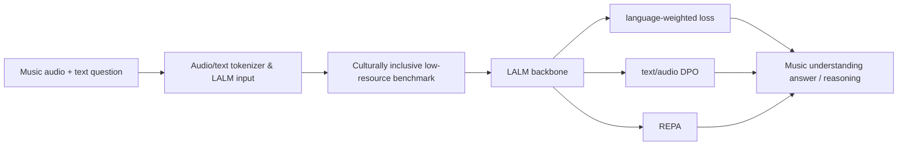

# 语音 / 音频 / 音乐论文速递
## 2026-08-19

> 实际对应 arXiv 更新日：**2026-08-19**  
> 检索范围：`cs.SD + eess.AS + cs.MM`  
> 只放按 ML 审稿口径看，最值得多数读者花时间看的 **5 篇**

## 📋 总览

- 共收录 **5 篇** 相关论文
- 语音大模型 / 语音生成：**3 篇**
- 语音前端 / 检测：**1 篇**
- 音乐理解 / 低资源音乐：**1 篇**

今天这批里，最值得优先看的不是“又一个更大模型”，而是三条更具体的线。`FireRedTTS3` 真正在做统一语音生成与编辑，不只是堆 TTS 指标；`UniVerse` 把低资源、多文化音乐理解做成了可训练、可评测的 LALM 任务；`The Last Mile` 虽然不是新模型，但它把深伪语音检测在真实业务里会踩的坑讲得很直白。

`SpeechSense` 的价值主要在数据和任务定义，不在模型花活；`Multi-turn Conversational AI` 则是综述，适合看全景，不适合当实现蓝图。

## 精选入选规则

- **新意（0-3）**：是不是提出了新的表示、接口、数据组织方式，或者把旧问题拆得更对
- **影响力（0-3）**：是不是贴近语音大模型、TTS、检测、音乐理解这些主线
- **证据强度（0-2）**：有没有像样的 baseline、消融和关键数值
- **受众匹配度（0-2）**：对语音大模型 / 语音前端 / 音乐方向研究者有没有直接启发

分数校准：

- **6**：可读，但更像局部补丁或综述
- **7**：信息量够，值得过一遍
- **8+**：建议优先精读

## 总览表

| 方向 | 序号 | 论文 | 评分 | 关键词 |
|---|---:|---|---:|---|
| 音乐理解 / 低资源音乐 | 1 | UniVerse | 8.5/10 | music understanding, low-resource, multilingual, LALM, inclusive benchmark |
| 语音前端 / 深伪检测 | 2 | The Last Mile of Deepfake Speech Detection | 7.5/10 | deployment, licensing, codec degradation, EER/DCF mismatch, telephony band |
| 语音大模型 / 生成与编辑 | 3 | FireRedTTS3 | 8.5/10 | unified speech generation, editing, semantically enriched speech representations |
| 语音大模型 / 细粒度情感 | 4 | SpeechSense | 8/10 | paralinguistic taxonomy, stance, synthetic data, fine-grained sentiment |
| 多模态交互 / 综述 | 5 | Multi-turn Conversational AI from Text to Multimodal Interaction | 7/10 | survey, interaction depth, grounding, full-duplex, evaluation |

## 🎵 音乐理解 / 低资源音乐

### [1] UniVerse: Benchmarking and Enhancing LALMs on Culturally Inclusive Low-Resource Music Understanding

- **评分**：8.5/10
- **作者/机构**：Yuhan Zhou, Yizhi Pan, Zhe Zhang, Jiawei Huang, Yifan Yang, Zeyu Xie, Tianrui Wang, Tianming Liu 等
- **论文链接**：https://arxiv.org/abs/2608.17852
- **PDF**：https://arxiv.org/pdf/2608.17852.pdf
- **代码链接**：**代码已开源** https://github.com/SylviaZiyaZhou/UniVerse/tree/main

#### 📌 简介
这篇做的是低资源、多文化音乐理解，核心不是再造一个“会聊音乐”的大模型，而是把 LALM 能不能真正在音乐理解上工作这件事做成了可量化的 benchmark 和训练方案。它最有意思的地方在于：不只测英语/主流音乐，而是把 38+ 语言、低资源文化语境、音乐问答、文本和音频共同组织进统一任务里。

#### ☠️ 毒舌点评
这篇不像那种只会喊“multilingual”和“inclusive”的口号论文。它至少知道问题在哪：音乐理解不是单一英文 caption 任务，低资源场景也不是补几个 prompt 就能解决。短板也很明显，仍然依赖大模型和复杂训练策略，不是轻量可落地方案，但作为“低资源音乐理解怎么做才不像样子工程”还是值得读。

#### 🔧 技术方案
- **模型解决的问题**：
  传统音乐理解 LALM 往往只在少数主流语种和主流音乐样本上做评测，导致模型对文化和语言覆盖很差。`UniVerse` 解决的是“如何让 LALM 在低资源、跨文化音乐理解上有可训练数据、有统一评测、并且能系统提升”。
- **模型架构**：
  - **输入**：音乐音频、文本问题、文化/语言相关条件。
  - **输出**：音乐问答答案、理解结果、跨语言音乐语义判断。
  - **主干**：面向音乐理解的 `LALM` 框架。
  - **关键模块**：
    - 低资源音乐理解基准构建。
    - 多语言 / 多文化数据混合训练。
    - `language-weighted loss` 缓解高资源语言挤压低资源语言。
    - `text/audio DPO` 强化问答偏好对齐。
    - `REPA` 作为表示学习增强项。
- **关键设计 / 核心创新**：
  - 不是只做一个模型，而是把“任务、数据、训练、评测”一起做完整。
  - 重点盯住文化包容性，不再默认音乐理解只属于英语流行音乐。
  - 用多阶段训练把低资源样本的梯度权重抬起来，而不是让大语种把一切淹没。
- **信号流**：

- **训练 / 推理策略**：
  - 数据规模包括 **5,042 QA pairs**、**372 audio recordings**，覆盖 **38+ languages**。
  - 训练使用 **8x80GB GPUs**，序列长度到 **16384**。
  - 推理侧强调统一音乐问答，而不是单独拼多个分类器。
  - 论文重点不是单次推理速度，而是跨文化可泛化能力。

#### 📊 实验结果
- 数据集 / 评测集：低资源音乐理解基准及其多语种子集
- 关键指标 / 结果：
  - `Jiangsu`：`34.4 -> 54.1`
  - `Shanghai`：`34.5 -> 56.4`
  - `Pyeongan`：`30.6 -> 62.9`
  - 但强区域也会掉：`Jiangsu 59.0 -> 49.2`
- baseline 对比：
  - 论文对比了原始 LALM 方案、去掉加权损失的版本、去掉 `DPO` 的版本和去掉 `REPA` 的版本
  - 核心结论是：多文化低资源场景里，简单扩大模型不如把训练信号分配做好
- 是否开源：**是**

#### 💡 为什么值得看
如果你做的是音乐理解、跨语言音乐问答，或者任何低资源文化数据的多模态建模，这篇比那种只会堆英文 benchmark 的论文更接近真实问题。它最有价值的是把“文化包容性”从口号变成了训练和评测对象。

#### 评分：8.5/10
理由：数据、任务、训练都比较完整，且给出了明确的跨区域增益和副作用。不是最花哨，但比很多只会扩参数的音乐理解论文更像正经工作。

## 🛡️ 语音前端 / 深伪检测

### [2] The Last Mile of Deepfake Speech Detection: An Industry-Academia Experience Report

- **评分**：7.5/10
- **作者/机构**：业界与学界合作经验报告
- **论文链接**：https://arxiv.org/abs/2608.17585
- **PDF**：https://arxiv.org/pdf/2608.17585.pdf
- **代码链接**：暂无明确开源

#### 📌 简介
这篇不是新模型，而是深伪语音检测落地经验报告。它真正讨论的是“论文里的 EER/DCF 过了，为什么到业务里还是不够用”，包括授权限制、真实输入往往是长音频、codec 降质、部分合成、见过和没见过的 split 可能污染等问题。

#### ☠️ 毒舌点评
这篇的价值不在惊艳，而在诚实。它没有装作换个更大 backbone 就能把 deepfake detection 彻底解决，反而明确提醒：如果数据授权、长音频形态、压缩链路和分布漂移没搞清，实验室指标就是给自己看的。缺点是它更像方法反思，不是新算法，所以如果你想找一个直接可抄的 SOTA 模型，会失望。

#### 🔧 技术方案
- **模型解决的问题**：
  传统深伪检测论文常在短音频、干净切片、理想 split 上报指标，但真实业务里面对的是长语音、电话带宽、codec 失真和部分合成内容。本文解决的是“如何把研究和部署之间那道缝讲明白”。
- **模型架构**：
  - **输入**：真实业务音频、合成音频、压缩/codec 后音频、长音频片段。
  - **输出**：深伪检测分数、判别结果、部署侧告警。
  - **主干**：以开源检测架构作为基线，再在内部数据上重训。
  - **关键模块**：
    - 业务化数据切分与授权审查。
    - 针对长音频和 codec 退化的训练分布设计。
    - 见/未见 split 的污染排查。
    - 指标解释层面避免只看单一 EER。
- **关键设计 / 核心创新**：
  - 不是模型创新，而是把落地约束拉到台面上。
  - 明确指出 `EER` / `DCF` 在产品场景里可能不够用。
  - 说明 telephony-band audio 对训练很关键，不能只盯高保真样本。
- **信号流**：

- **训练 / 推理策略**：
  - 以开源检测模型为起点，但不迷信公开 split 的结果。
  - 在内部数据上重训，并引入长音频、部分合成、带宽退化等更贴近业务的数据形态。
  - 论文强调训练分布和业务分布不一致时，指标会虚高。
  - 结论上更偏方法论和生产实践，而不是新网络结构。

#### 📊 实验结果
- 数据与观察：
  - 真实输入往往不是实验室里的短片段，而是长、脏、codec 退化的混合流
  - 见/未见 split 的划分如果不严，会把评测污染掉
- 关键发现：
  - `EER / DCF` 在某些部署场景下会失真，不能单独决定上线
  - `telephony-band` 音频是很有价值的训练分布
  - 业务侧更关注误报/漏报的组合成本，而不是单点指标
- baseline 对比：
  - 文中比较了多个开源检测架构在业务数据和公开数据上的表现差异
  - 核心结论是：公开 benchmark 上好看，不代表真实输入上靠谱
- 是否开源：**否，属于经验报告**

#### 💡 为什么值得看
如果你做深伪检测、语音风控、媒体审核，这篇比很多“我们又做了个更大的 detector”更有用。它直接告诉你：数据授权、切分、codec、长音频和评测口径，才是最后一公里的真正难点。

#### 评分：7.5/10
理由：不是算法突破，但问题意识很强，适合做落地的人读。对纯研究党来说，更多是提醒，不是灵感源泉。

## 🎙️ 语音大模型 / 生成与编辑

### [3] FireRedTTS3: Unified Speech Generation and Editing with Semantically Enriched Speech Representations

- **评分**：8.5/10
- **作者/机构**：FireRedTeam
- **论文链接**：https://arxiv.org/abs/2608.17492
- **PDF**：https://arxiv.org/pdf/2608.17492.pdf
- **代码链接**：**代码已开源** https://github.com/FireRedTeam/FireRedTTS3

#### 📌 简介
这篇不是单纯 TTS，而是统一语音生成和编辑。它想做的是：把说话、复述、编辑、保留语义和音色这些需求，收进一个统一表示里，而不是靠一堆独立流水线拼接。核心抓手是 `RedAE` 语音表示和多阶段训练，把 24 kHz 波形压到更适合大模型消费的语音表示空间里。

#### ☠️ 毒舌点评
这篇很像“真有工程团队在往产品里推”的论文，训练规模、语种覆盖、编辑能力都给得比较足。问题也明显：大模型味太重，容易让人怀疑是不是堆资源换来的结果；但它至少没有停在嘴炮，编辑任务、基准、速度和对比都给得比较实。做 TTS / speech editing 的人值得看。

#### 🔧 技术方案
- **模型解决的问题**：
  传统 TTS 多数只会“从文本说话”，但产品里更常见的是“按语义编辑已有语音、保留原声、变口气、变语言”。`FireRedTTS3` 解决的是“如何统一语音生成和编辑，并让表示同时服务语义和声学”。
- **模型架构**：
  - **输入**：文本、说话人条件、编辑前语音、语言条件。
  - **输出**：新生成语音或编辑后的语音。
  - **主干**：统一 speech generation / editing 框架。
  - **关键模块**：
    - `RedAE` tokenizer / representation。
    - 多语言、多方言基础模型。
    - 编辑任务专用的 instruction / conditioning 设计。
    - 统一的语义增强语音表示。
- **关键设计 / 核心创新**：
  - `RedAE` 不是简单 codec，而是把语音压到更利于统一建模的层级。
  - 语音生成和编辑共享表示，减少多个子模型之间的割裂。
  - 任务设计上把“编辑”作为一等公民，而不是生成后的后处理。
- **信号流**：

- **训练 / 推理策略**：
  - `RedAE` 训练约 **550k steps**，使用 **500k hours**，并在 **32 H800 GPUs** 上完成。
  - 基础模型训练先用 **2.6M hours**，再补 **560k hours**，总计约 **170k steps**。
  - 指令式训练额外使用 **330k hours**，约 **40k steps**。
  - 推理上兼顾生成和编辑，不再只围绕纯 TTS 路径组织。

#### 📊 实验结果
- 数据与基准：
  - `24 languages + 21 Chinese dialects`
  - `Seed-TTS-Eval`
  - 编辑任务评测集
- 关键数值：
  - 编辑表中，`average WER 6.97 | 10.22`
  - `average SIM 0.82 | 0.80`
  - `average ACC 87.27 | 78.91`
  - `average no-edit WER 3.85 | 18.42`
- baseline 对比：
  - `CosyVoice3-1.5B`
  - `DiTAR`
  - `F5-TTS`
  - `FireRedTTS2`
  - `IndexTTS2`
  - `MegaTTS3`
  - `MiniMax-Speech`
- 结论：
  - `FireRedTTS3-Base` 在 `Seed-TTS-Eval` 上综合表现很强
  - 编辑任务上相较多基线有明显优势，尤其在保真和可编辑性平衡上
- 是否开源：**是**

#### 💡 为什么值得看
如果你在做 TTS、语音克隆、语音编辑或者统一 speech foundation model，这篇不是那种“看个标题就够”的文章。它真正有价值的地方，是把生成和编辑统一到同一表示和训练框架里，而且给了足够多的硬实验。

#### 评分：8.5/10
理由：模型规模大，但不是纯堆；任务定义清楚，编辑侧实验也够硬。主要扣分点是资源门槛高，离轻量部署还有距离。

## 🧠 语音大模型 / 细粒度情感

### [4] SpeechSense: A Paralinguistic-Focused Dataset for Fine-Grained Speech Sentiment Analysis

- **评分**：8/10
- **作者/机构**：CUHK 团队
- **论文链接**：https://arxiv.org/abs/2608.17931
- **PDF**：https://arxiv.org/pdf/2608.17931.pdf
- **代码链接**：**代码已开源** https://github.com/Sher13cked/SpeechSense

#### 📌 简介
这篇是细粒度语音情感 / 人际态度数据集工作，目标不是做一个更炫的情感分类器，而是把原本很粗的 sentiment / stance 任务拆成更细的 8 类 paralinguistic taxonomy。它真正的贡献是数据构造和任务定义，而不是模型堆料。

#### ☠️ 毒舌点评
这篇最重要的点在于它终于不把“情感分析”当成二分类或三分类凑数了，而是往更细的人际态度层次走。问题是，数据集论文天然容易显得“做了个标注集就算完”，所以它的说服力还是要靠下游模型和 zero-shot / fine-tune 差距来撑。好消息是，实验确实把这个差距拉得很清楚。

#### 🔧 技术方案
- **模型解决的问题**：
  传统情感/态度语音数据集维度太粗，无法刻画细粒度的人际姿态、语调和语义态度差别。`SpeechSense` 解决的是“如何构建一个覆盖细粒度 stance 的语音情感数据集，并验证它对模型训练是否有用”。
- **模型架构**：
  - **输入**：带角色设定的语音 utterance、对应文本、态度标签。
  - **输出**：8 类细粒度 interpersonal stance 标签。
  - **主干**：数据集 + 评测基准，不是单一网络。
  - **关键模块**：
    - `30 voice profiles`。
    - `26/30 speakers` 覆盖全部 8 种态度。
    - role-play TTS 合成流程。
    - 语义中立约束，避免文本本身泄漏 stance。
- **关键设计 / 核心创新**：
  - 用不同 LLM family 做训练和测试，减少话术泄漏。
  - 通过角色扮演 TTS 生成 3–8 秒 utterances，控制语义中立。
  - 把“态度”而不是“情绪粗分类”作为核心标签。
- **信号流**：

- **训练 / 推理策略**：
  - 合成数据由 role-play TTS 生成，保证语义中立。
  - 训练测试阶段使用不同 LLM 家族，降低 prompt 或脚本泄漏。
  - 下游模型在语音和文本两条线上分别评估。
  - 论文重点不是推理技巧，而是数据可用性和任务定义。

#### 📊 实验结果
- 数据集属性：
  - `30 voice profiles`
  - `26/30 speakers` 覆盖 8 个态度类
  - 语音片段多为 `3–8 sec`
- 关键结果：
  - zero-shot `Macro-F1` 只有 `1.31%–6.63%`
  - fine-tuned acoustic models 达到 `42–45% Macro-F1`
  - 最好音频模型 `56.95% Acc`
  - 最好文本模型 `26.76% Acc`
- baseline 对比：
  - zero-shot 与 fine-tune 的差距非常大，说明这个任务不是靠提示词就能糊过去
  - 音频模型整体强于纯文本模型，说明 paralinguistic 信号确实重要
- 是否开源：**是**

#### 💡 为什么值得看
如果你做 speech sentiment、stance、paralinguistic understanding，这篇的价值主要在数据定义。它告诉你：很多“情感识别”其实太粗了，真正有区分度的不是文本极性，而是说话方式、语气和人际姿态。

#### 评分：8/10
理由：数据和任务定义都比较扎实，实验也给出了 zero-shot 到 fine-tune 的清晰鸿沟。它不是大模型新架构，但对任务边界的推进很实。

## 🧭 多模态交互 / 综述

### [5] Multi-turn Conversational AI from Text to Multimodal Interaction: Data, Models, Evaluation, and Open Challenges

- **评分**：7/10
- **作者/机构**：Qatar Computing Research Institute 等
- **论文链接**：https://arxiv.org/abs/2608.17605
- **PDF**：https://arxiv.org/pdf/2608.17605.pdf
- **代码/资源链接**：相关资源仓库 https://github.com/faiza-sfa/multiturn-conversational-ai-survey

#### 📌 简介
这是一篇综述，不是新方法。它梳理的是从纯文本多轮对话，到语音、图像、视频、再到更复杂的多模态交互系统，现有数据、模型、评估和开放问题。它最大的价值是把问题版图画出来，而不是给一个能直接抄的系统。

#### ☠️ 毒舌点评
综述类文章最怕两种毛病：一是只会堆名词，二是只会说“未来很重要”。这篇至少做到了结构化，但它离“能直接指导你搭一个系统”还有距离，所以更适合作为扫盲和选题地图，不适合作为实现方案。读它要带着筛选器，别被宏大叙事带跑。

#### 🔧 技术方案
- **模型解决的问题**：
  现有多轮对话研究常常把文本、语音、视觉、视频拆开看，缺少统一的交互深度和评价视角。本文解决的是“如何把 multi-turn conversational AI 的研究版图按数据、模型、评估、挑战系统梳理出来”。
- **模型架构**：
  - **输入**：文献、系统、任务定义、多模态交互范式。
  - **输出**：研究分类框架、挑战图谱、未来方向。
  - **主干**：综述 / survey 框架。
  - **关键模块**：
    - `PRISMA-ScR` 检索流程。
    - 三轴分析：交互深度、模态复杂度、文化语言多样性。
    - 文本、语音、视觉、全双工、评估等维度拆解。
- **关键设计 / 核心创新**：
  - 不把“多模态”泛泛地混在一起，而是按交互深度和模态复杂度拆层。
  - 重点强调 memory、grounding、full-duplex、evaluation 这些真正难点。
  - 把文化和语言多样性也纳入综述主轴，不只是技术堆栈。
- **信号流**：

- **训练 / 推理策略**：
  - 这篇没有训练一个新模型。
  - 它是用系统综述的方法抽样、筛选、归类和总结。
  - 对读者来说，重点是它怎么定义研究边界，而不是某个推理 trick。

#### 📊 实验结果
- 文献筛选：
  - 初始检索约 **4K papers**
  - 最终保留约 **200** 篇
- 主要发现：
  - `text-only` 资源仍然 **>80%**
  - speech / video / omni-modal 方向明显更少
  - memory、grounding、full-duplex interaction、evaluation、cultural alignment 是反复出现的空白
- baseline 对比：
  - 这不是模型 baseline，而是文献分布和研究热点的对比分析
  - 它对比的是研究主题和能力栈，不是数值指标
- 是否开源：有相关资源仓库，但不是核心方法代码

#### 💡 为什么值得看
如果你想快速知道多轮多模态对话研究现在卡在哪儿，这篇能当地图用。它不是答案本身，但能帮你少走一半题目跑偏的路。

#### 评分：7/10
理由：综述质量中上，结构清楚，但方法贡献有限。适合定方向，不适合当实现样例。

## 最后结论

- 今天最值得优先读的是 `FireRedTTS3` 和 `UniVerse`，一个是统一语音生成/编辑，一个是低资源、多文化音乐理解，都是有明确任务、明确数值、明确训练组织的硬稿。
- `The Last Mile` 虽然不是算法论文，但对深伪语音检测落地的人非常实用，因为它把评测和业务之间的断层说透了。
- `SpeechSense` 的亮点在数据和任务定义，不在架构；如果你做细粒度语音情感或 stance，这篇比粗糙分类论文更值得跟。
- `Multi-turn Conversational AI` 更适合作为地图，不适合作为方法模板。
- 这一天的 5 篇里没有明显“只有摘要能看”的灌水稿，全部都能基于全文做判断。
