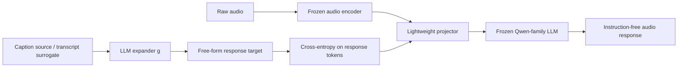
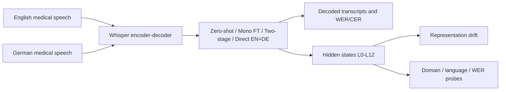
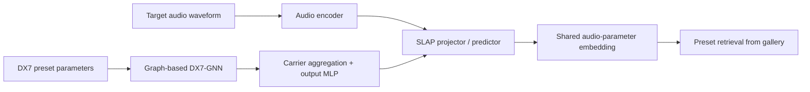
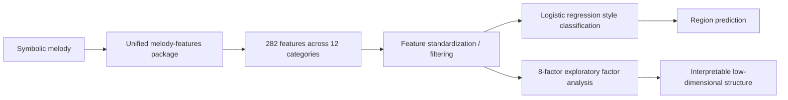
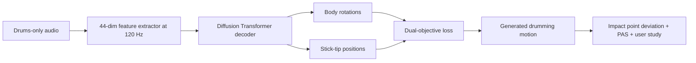

# 语音 / 音频 / 音乐论文速递
## 2026-08-20

> 实际对应 arXiv 更新日：**2026-08-20**  
> 检索范围：`cs.SD + eess.AS`  
> 只放按 ML 顶会审稿口径看，最值得多数读者花时间看的 **5 篇**

## 📋 总览

- 共收录 **5 篇** 相关论文
- 音频大模型 / 语音适配：**2 篇**
- 音乐计算 / 声音设计：**2 篇**
- 音乐驱动生成：**1 篇**

今天这批里，最值得优先看的不是“又一个把参数堆大的模型”，而是三条更扎实的线。`Alignment Is All You Need` 直接挑战了音频大模型默认要走 `alignment -> SFT -> preference optimization` 这条老路，给出一个几乎只训 projector 的 LALM 配方，而且不是只在一张表上偷分；`Understanding Multilingual Medical ASR Adaptation Through Layer-Wise Analysis` 则把 Whisper 医疗适配里经常被糊成黑箱的部分拆开看，告诉你哪种 fine-tune 真有用，哪种只是把 encoder 搅得更乱。音乐侧也不空。`FM Synthesizer Audio-Parameter Shared Embeddings` 是少见的“结构偏置真的有实证回报”的声音设计论文；`Computational Features for Symbolic Melody Analysis` 虽然不是 flashy 模型，但它把旋律特征工具链做成了能复用的包和比较完整的 taxonomy，实用价值比很多花哨生成论文高。`Generalized Audio-Driven Synthesis of Precise Drummer Motion` 则是今天证据最硬的生成稿之一，厘米级落点、PAS 和 user study 都给了，不是只靠 demo 气氛组。

## 精选入选规则

- **新意（0-3）**：是不是提出了新的表示、结构偏置、训练组织方式，或者把老问题拆得更对
- **影响力（0-3）**：是不是贴近语音大模型、ASR、音乐计算、声音设计、动作生成这些主线
- **证据强度（0-2）**：有没有像样的 baseline、关键数值、消融或失败边界
- **受众匹配度（0-2）**：对语音大模型 / 语音前端 / 音乐方向研究者有没有直接启发

分数校准：

- **6**：可读，但更像局部补丁、分析框架或资源整理
- **7**：信息量够，值得过一遍
- **8+**：建议优先精读

## 总览表

| 方向 | 序号 | 论文 | 评分 | 关键词 |
|---|---:|---|---:|---|
| 音频大模型 / 对齐训练 | 1 | Alignment Is All You Need | 8.5/10 | instruction-free, frozen encoder, frozen LLM, projector-only, MMAU |
| 语音适配 / 医疗 ASR | 2 | Understanding Multilingual Medical ASR Adaptation Through Layer-Wise Analysis | 7.5/10 | Whisper, MedASR, EN+DE, layer drift, probing |
| 声音设计 / 合成器检索 | 3 | FM Synthesizer Audio-Parameter Shared Embeddings | 8/10 | DX7, graph encoder, SLAP, topology generalization, preset retrieval |
| 音乐计算 / 符号旋律分析 | 4 | Computational Features for Symbolic Melody Analysis | 7.5/10 | melody-features, 282 features, taxonomy, interpretability, style classification |
| 音乐驱动生成 / 动作 | 5 | Generalized Audio-Driven Synthesis of Precise Drummer Motion | 8/10 | drumming motion, diffusion, dual-objective, PAS, in-the-wild |

## 🤖 音频大模型 / 语音适配

### [1] Alignment Is All You Need: Instruction-Free Training for General Audio-Language Models

- **评分**：8.5/10
- **作者/机构**：Xuanru Zhou, Yiwen Shao, Jiahong Li, Dong Yu；Zhejiang University，Tencent Hunyuan
- **论文链接**：https://arxiv.org/abs/2608.18132
- **PDF**：https://arxiv.org/pdf/2608.18132.pdf
- **代码链接**：**代码已开源** https://github.com/rorizzz/IFAO-lalm
- **Demo 链接**：https://huggingface.co/collections/eureka1500/ifao-lalm

#### 📌 简介
这篇做的不是“更大的 audio LLM”，而是更狠的问题设定：如果 LLM 本来就会推理、会跟指令，音频侧是不是根本不需要后面那一大串 SFT 和 preference optimization？作者的答案是，至少在一批主流 benchmark 上，真的可以只保留 alignment，而且把 audio encoder 和 LLM 都冻住，只训一个轻量 projector。

#### ☠️ 毒舌点评
这篇最值钱的地方不是嘴上说“alignment is enough”，而是它真去拿 `MMAU / MMAR / MMSU / MMAU-Pro` 跟一票重后训练系统对了。短板也很明显：speech 仍然是它的弱轴，说明“只靠 caption surrogate”对复杂语言学现象并不够；但这恰恰比那种只报平均分的稿子诚实得多。

#### 🔧 技术方案
- **模型解决的问题**：标准 LALM 流水线默认要 `cross-modal alignment -> SFT -> preference optimization`，代价高，还容易把 LLM 训得越来越像任务模板机。本文要解决的是：能不能只做音频到 LLM latent space 的对齐，不去重写 LLM 的 instruction-following 能力。
- **模型架构**：
  - **输入**：原始音频，以及由 caption source 提供的音频描述文本。
  - **输出**：对音频的自然语言回答，不显式输入任务指令。
  - **主干**：`frozen audio encoder + lightweight projector + frozen autoregressive LLM`。
  - **关键模块**：
    - `Self-Generated Data Construction`：先拿 caption 当 audio 的语义代理。
    - `LLM expander g`：把 caption 扩成 free-form response，而不是固定 QA 模板。
    - `instruction-free alignment`：训练时用户侧只给 audio token，不给系统 prompt 和任务指令。
    - `two-layer MLP projector`：负责把音频表征映射到 LLM embedding space。
- **信号流**：

- **关键设计 / 核心创新**：
  - 不再把人工任务模板当监督源，而是让 caption 通过同一个 LLM 扩写成 response，再拿这个 response 对齐音频前缀。
  - 把“训练哪个模块”这件事压到极致：encoder 和 LLM 都冻结，只让 projector 承担 modality gap。
  - 作者还给了 `Information-Capability Bound` 视角，明确说性能上限同时受 encoder 信息量和 LLM 能力约束，不是数据量一拉满就无脑涨。
- **训练 / 推理策略**：
  - 默认 backbone 是 `Qwen2.5-7B-Instruct`，也做了 `Qwen3-8B` 迁移实验。
  - 评测最强的 `Whisper-large-v2 + Qwen2.5-7B` 配方只训练约 `31.2M` 个 projector 参数。
  - 主要训练数据是 `CaptionStew 400K + 10% speech`，总计 `576.8K samples / 1.6K hours`。
  - response generation 由 `Qwen2.5-7B-Instruct` 或 `Qwen3-8B` 完成，采用 `temperature 0.6 / top-p 0.9 / top-k 20 / max_new_tokens 512`。
  - 训练与 caption expansion 都跑在 `4 x A100 40GB` 上；论文重点不是低延迟部署，文中没有给最终在线推理延迟。

#### 📊 实验结果
- **主要 baseline**：`Qwen2-Audio-Instruct`、`Qwen2.5-Omni`、`Audio-Flamingo 2/3`、`Kimi-Audio`、`ALARM`，以及 `GPT-4o-Audio`、`Gemini 2.5 Flash` 这类 proprietary 参照。
- **主结果**：
  - `Ours (AudioSet-Zipformer)` 在 `MMAU test-mini/test Avg.` 上达到 `68.2 / 66.3`。
  - 同配置在 `MMAR` 达到 `54.3`，`MMSU` 达到 `47.0`，`MMAU-Pro Avg.` 达到 `52.8`。
  - 其 `MMAU-Pro IF` 为 `62.9`，高于表内 open-source 的 `Qwen2.5-Omni 61.3` 和 `Audio-Flamingo 3 33.3`。
- **跟强开源模型比**：
  - 对 `MMAU test Avg.`，`Audio-Flamingo 3` 是 `72.4`，`Qwen2.5-Omni` 是 `71.0`，本文的 `66.3` 不是全面碾压。
  - 但它用的是 `576.8K / 1.6K hours` 训练规模，而 `Audio-Flamingo 3` 是 `26.7M / 54.4K hours`，数据成本差一个量级以上。
- **encoder ablation**：
  - `AudioSet-Zipformer` 在 `MMAU Avg. / MMAR / MMAU-Pro Avg.` 上分别是 `68.20 / 54.30 / 52.82`。
  - `Whisper-large-v2` 是 `66.30 / 52.30 / 48.40`，但在 speech 相关指标更强，`MMSU 50.61`。
  - 说明这套方法不是“谁都能一键套”，而是会明显继承 encoder 的预训练偏置。
- **matched-generator ablation**：
  - 同样用 `Qwen3-8B` 做 alignment，但若 response 仍由 `Qwen2.5-7B-Instruct` 生成，`MMAU Avg.` 会从 `60.6` 掉到 `54.7`，`MMAU-Pro Avg.` 从 `48.3` 掉到 `40.5`。
  - 这点很关键：它证明 response generator 和 alignment LLM 的配套关系不是装饰品。
- **speech targeted SFT**：
  - 对 `Whisper-large-v2 + Qwen2.5-7B`，额外做 speech-QA SFT 后，`MMAU Speech` 从 `60.36` 升到 `65.47`。
  - 但 `Sound` 和 `Music` 分别掉 `4.8` 和 `4.2`，说明后训练会把 projector 往 QA 分布拉偏。

#### 💡 为什么值得看
如果你在做 audio LLM，这篇真正值得看的不是“又一个 benchmark 表格”，而是它把“后训练到底是不是必须的”这个默认前提狠狠干了一刀。它没证明 alignment-only 是终极答案，但它至少证明了：很多时候你真正该优化的，可能不是更复杂的 post-training，而是更干净的音频表征和更对味的 supervision 组织。

### [2] Understanding Multilingual Medical ASR Adaptation Through Layer-Wise Analysis

- **评分**：7.5/10
- **作者/机构**：Souranil Kahali, Rituparna Bose, Abner Hernandez, Tomas Arias-Vergara, Andreas Maier, Ning Ma, Paula A. Perez-Toro；FAU Erlangen-Nürnberg，University of Sheffield，TUM
- **论文链接**：https://arxiv.org/abs/2608.18825
- **PDF**：https://arxiv.org/pdf/2608.18825.pdf
- **代码链接**：暂无明确开源；论文说明会发布 English split manifest、preprocessing scripts、evaluation code 和 configs
- **Demo 链接**：暂无

#### 📌 简介
这篇不是新 ASR 架构，而是 Whisper 医疗适配分析。作者关心的不是“再刷低一点 WER”，而是英语医疗 fine-tune、德语诊断性 fine-tune、`EN->EN+DE` 两阶段继续训练、以及直接 `EN+DE` 多语训练，分别把 encoder 内部表征改成了什么样。

#### ☠️ 毒舌点评
这篇的优点是有自知之明。它知道德语只有 `86` 条训练样本，没把 within-corpus 结果吹成通用跨说话人胜利；它也没把 layer-wise probing 包装成神秘解释学，而是老老实实告诉你：域信息和语言信息一直都很容易被线性读出来，但 error-predictive signal 反而会随 fine-tuning 变弱。缺点同样明显，数据规模偏小，结论更像“谨慎的诊断”而不是大而稳的定律。

#### 🔧 技术方案
- **模型解决的问题**：医疗 ASR 常见做法是直接 fine-tune Whisper，然后只看 WER。问题在于，模型到底是学到了医疗领域表征，还是只是记住了训练分布，WER 并不能解释。本文要解决的是：不同 multilingual medical adaptation 路线对 Whisper encoder 内部层表示的影响是什么。
- **模型架构**：
  - **输入**：英语医疗语音、德语医疗语音，以及通用 English 对照音频。
  - **输出**：ASR 文本，以及 layer-wise hidden states 的 drift / probe 结果。
  - **主干**：`Whisper Base / Small / Medium / Large-v3` encoder-decoder ASR。
  - **关键模块**：
    - `English-only medical FT`
    - `German-only diagnostic FT`
    - `Two-stage EN→EN+DE continuation`
    - `Direct EN+DE multilingual FT`
    - `representation drift + domain probe + language probe + WER probe`
- **信号流**：

- **关键设计 / 核心创新**：
  - 把 adaptation 路线拆成四种，而不是只报一个“best checkpoint”。
  - 除了 WER，还用 hidden-state drift 和 probing 去看 encoder 发生了什么。
  - 特别有用的一点是，它区分了 `two-stage EN→EN+DE` 和 `direct EN+DE`，这在实际 multilingual MedASR 管线里经常被混着讲。
- **训练 / 推理策略**：
  - 全部实验基于 `Hugging Face Transformers + PyTorch`，跑在 **单张 NVIDIA A100** 上。
  - 使用 `Seq2SeqTrainer`、cross-entropy、greedy decoding，最大生成长度 `225`，有效 batch size `32`，mixed precision，gradient checkpointing，patience `5` 的 early stopping。
  - English 医疗集为 `997 train / 136 val / 104 test`，23 位训练说话人；German `PoCaP` 为 `86 train / 37 val / 38 test`，且德语训练集是单说话人、单流程。
  - multilingual 合并后为 `1083 train / 173 val / 142 test`，推理时使用 language-specific forced decoder identifiers。

#### 📊 实验结果
- **主要 baseline**：Whisper 各尺寸 zero-shot、英语单语 FT、德语诊断 FT、两阶段 `EN→EN+DE`、直接 `EN+DE`；另外还拿 `Wav2Vec2` CTC 系统作参考。
- **zero-shot**：
  - `Whisper-Large-v3` 是最强 zero-shot，English `16.50%`，German `56.51%`，combined `35.52%`。
  - 作者还指出 `Wav2Vec2` out-of-domain 转移很差，English WER 甚至高于 `92%`，German `XLSR-53` 到 `76.00%`。
- **英语单语 FT**：
  - `Whisper-Medium` 最好，English WER 降到 `7.72%`。
  - `Whisper-Small` 是 `11.98%`，作为后续 layer-wise 主分析 checkpoint。
- **德语诊断 FT**：
  - `Whisper-Large-v3` 到 `44.96%`，`Whisper-Medium` 到 `45.94%`。
  - 但作者明确说这只是 within-corpus diagnostic，不等于稳健的 German generalization。
- **multilingual**：
  - 两阶段 `EN→EN+DE` 下，`Whisper-Small` combined 最好，为 `31.33%`，对应 English `10.91%`、German `53.87%`。
  - 直接 `EN+DE` 下，`Whisper-Medium` 给出全局最优 combined WER `26.30%`，对应 English `7.81%`、German `46.72%`。
  - 这说明“先学英语再补德语”并不自动优于直接多语联合训练。
- **layer-wise 结果**：
  - `Pretrained -> EN-FT` 的 cosine drift 范围是 `0.906–1.000`，而 `EN-FT -> ML-FT` 是 `0.989–1.000`。
  - 这说明真正把 encoder 搅动最大的，是英语医疗 fine-tune；后续 multilingual continuation 反而比较保守。
  - domain probe 和 language probe 几乎层层接近天花板：`Domain F1 >= 0.984`，`Language F1 >= 0.993`。
- **WER probe**：
  - 预训练模型最佳层 `WER F1 = 0.721 ± 0.028 (L2)`，对应同 100 条英语样本上的 decoder WER `19.87`。
  - EN-FT 后降到 `0.619 ± 0.039 (L6)`，decoder WER `13.61`。
  - ML-FT 后继续降到 `0.556 ± 0.033 (L11)`，decoder WER `12.48`。
  - 这个现象很有意思：WER 更好了，但“可线性读出的错误信号”反而更弱了。

#### 💡 为什么值得看
如果你在做医疗 ASR、多语 ASR，或者任何“先单语再多语”微调路线，这篇的价值不在于某个绝对最小 WER，而在于它给了你一套更像工程诊断而不是纯 leaderboard 的观察方式。你能直接拿它的结论去问自己：我这次 fine-tune，到底是在补领域知识，还是只是在重排 encoder 表示空间。

## 🎛️ 音乐计算 / 声音设计

### [3] FM Synthesizer Audio-Parameter Shared Embeddings

- **评分**：8/10
- **作者/机构**：David Braun, Adam Finkelstein；Princeton University
- **论文链接**：https://arxiv.org/abs/2608.18226
- **PDF**：https://arxiv.org/pdf/2608.18226.pdf
- **代码链接**：**代码已开源** https://github.com/DBraun/SynAPSE
- **Demo 链接**：论文说明提供 interactive retrieval website，但正文未给单独独立 URL

#### 📌 简介
这篇要解决的是“给你一段目标声音，怎么从合成器 preset 库里找出最像的那个参数配置”。很多方法把合成器参数当平铺向量，完全无视 FM routing topology。作者这里反过来，直接把 DX7 的信号流当图结构来建 encoder，再和音频 embedding 一起用 `SLAP` 目标学共享表征。

#### ☠️ 毒舌点评
这篇最讨喜的地方是没有装神弄鬼。它很明确：如果训练时所有 topology 都见过，大家都差不多；真正能拉开差距的是 held-out algorithms，也就是结构泛化。DX7-GNN 在这点上确实狠狠干赢了 Transformer 和 Highway baseline，这比“在 seen split 上打成平手”有价值得多。

#### 🔧 技术方案
- **模型解决的问题**：现有 synthesizer programming / preset retrieval 方法大多把参数当 flat vector，最多再塞一个 algorithm ID，导致一旦碰到没见过的 routing，就很难泛化。本文要解决的是：如何把 FM synthesis 的 topology 结构直接编码进参数表示，并与音频建立共享 embedding。
- **模型架构**：
  - **输入**：目标音频波形 `xA` 和 DX7 preset `xP`。
  - **输出**：共享 embedding space 中的 audio/query 向量与 preset 向量，用于 audio-to-parameter retrieval。
  - **主干**：`audio encoder + DX7-GNN parameter encoder + SLAP projector/predictor heads`。
  - **关键模块**：
    - `DX7-GNN`：把 6 个 operator 当节点，把 modulation / feedback 当边。
    - `FM-inspired message passing`：消息代表 modulation signal。
    - `FiLM-conditioned update`：用聚合后的 modulation 去调制 operator base features。
    - `carrier aggregation`：仿照 DX7 把 carrier operator 求和形成输出。
    - `SLAP objective`：同时做 intermodal 和 intramodal cosine alignment。
- **信号流**：

- **关键设计 / 核心创新**：
  - 不是把 DX7 algorithm 当一个 ID embedding，而是真正把 routing 结构变成图。
  - output level 和 feedback 不只是普通输入特征，而是通过 gating 和 feedback edge 进入消息传递。
  - 所有层共享 message passing 权重，使它能处理训练没见过的 topology。
- **训练 / 推理策略**：
  - 数据来自 `DX7AllTheWeb`，去重并过滤后保留 `31,443` 个 presets。
  - held-out topology 设定下，训练使用 `16` 个奇数 algorithm 共 `15,370` 个 preset，验证 `9,233`，测试 `6,840`，并固定 `4,096` gallery。
  - 训练时用 on-the-fly audio rendering、operator swapping 和 parameter noise 增强。
  - `DX7-GNN` 约 `3.38M` 参数，明显小于 Transformer baseline 的 `57.2M`。
  - 在 `4 x Nvidia L40` 上用 `AdamW` 训练 `80K` steps，不到 `5` 小时。

#### 📊 实验结果
- **主要 baseline**：`Transformer` parameter encoder、`Highway` encoder、`MFCC`、`LAION-CLAP`，以及 seen-topology 随机 split 的对比。
- **seen topologies（80/10/10 random split）**：
  - `DX7-GNN`：`R@1 86.1%`，`R@10 99.5%`，`MRR 0.917`
  - `Transformer`：也是 `R@1 86.1%`，`R@10 99.5%`
  - `Highway`：`R@1 81.2%`
  - 说明只看 seen split，结构偏置的价值并不明显。
- **held-out algorithms**：
  - `DX7-GNN`：`R@1 52.2%`，`R@10 88.5%`，`MRR 0.652`
  - `Transformer`：`R@1 34.6%`，`R@10 70.6%`
  - `Highway`：`R@1 24.8%`，`R@10 59.1%`
  - 这才是本文最硬的结果：它不是小优，而是结构性领先。
- **ablation**：
  - 去掉 `operator swapping` 后，`R@1` 从 `52.2%` 暴跌到 `13.5%`。
  - 去掉 parameter noise，`R@1` 只小掉到 `50.5%`。
  - 去掉 feedback，`R@1 49.5%`；把图全连接，`R@1 30.9%`。
  - 结论很清楚：真正重要的是结构增强，不是泛泛的数据抖动。
- **timbremetrics**：
  - `DX7-GNN` 的 `zA / qA` triplet agreement 为 `69.3% / 69.3%`。
  - `Transformer` 达到 `71.3% / 71.1%`，`LAION-CLAP` 是 `71.8% / 70.8%`。
  - 这说明虽然它主任务是 preset retrieval，但 audio embedding 的 timbre 质量并没有烂掉。

#### 💡 为什么值得看
如果你做声音设计、可控音色检索、可解释合成器建模，这篇很值得看，因为它不是在 generic audio encoder 上硬贴参数头，而是真把 FM synthesis 的信号流逻辑转成了结构偏置。很多“structure-aware”论文只会讲概念，这篇至少在 held-out topology 上真给出了分差。

### [4] Computational Features for Symbolic Melody Analysis

- **评分**：7.5/10
- **作者/机构**：David M. Whyatt, Peter M. C. Harrison；Centre for Music and Science, Faculty of Music, University of Cambridge
- **论文链接**：https://arxiv.org/abs/2608.19061
- **PDF**：https://arxiv.org/pdf/2608.19061.pdf
- **代码链接**：**代码已开源** https://github.com/dmwhyatt/melody-features
- **Demo 链接**：https://dmwhyatt.github.io/melody-features/feature_catalogue/

#### 📌 简介
这篇不是生成模型，而是旋律分析工具链。作者把各类 symbolic melody 特征从文献和现有工具箱里重新整理成统一 taxonomy，再做成 Python 包 `melody-features`，并用 Essen Folksong Collection 的风格分类实验来证明这套特征不是只会堆文档。

#### ☠️ 毒舌点评
这类“工具箱 / 数据工程”论文最容易水成大型附录，但这篇至少有两点过关：一是它不是随便拼个 wrapper，而是真做了 feature 去重、taxonomy 和新实现；二是它用 feature-source 对比告诉你这套包为什么比 `jSymbolic`、`FANTASTIC` 这些老牌工具更完整。它不是 SOTA 模型稿，但对做 MIR、符号音乐分析的人很实用。

#### 🔧 技术方案
- **模型解决的问题**：旋律特征分散在不同工具箱和论文里，定义不统一、复现门槛高，还存在大量重复和风格不一致。本文要解决的是：如何把符号旋律分析常用特征整理成统一 taxonomy，并给出可直接复用的 Python 实现。
- **模型架构**：
  - **输入**：单声部 symbolic melody，包含 pitch、onset、duration 等信息。
  - **输出**：结构化旋律特征向量，以及下游 style classification / factor analysis 结果。
  - **主干**：`feature extraction package + taxonomy + downstream analysis`。
  - **关键模块**：
    - 融合 `FANTASTIC`、`SIMILE / melsim`、`IDyOM`、`jSymbolic`、`MIDI Toolbox`、`MUST`、`Partitura` 等来源。
    - 从长列表中清洗成 `282` 个特征、`12` 个概念类别。
    - 交互式 feature catalogue 文档。
    - 下游 `logistic regression + EFA` 验证。
- **信号流**：

- **关键设计 / 核心创新**：
  - 真正做的是 consolidation，而不是再造一个只覆盖几十个特征的小包。
  - 不只报“我们收集了很多特征”，还明确给出 12 类 taxonomy 和 feature provenance。
  - 用 EFA 而不是 PCA 去做可解释降维，这点比很多只会扔主成分的 MIR 论文更讲究。
- **训练 / 推理策略**：
  - 这个包本身没有 foundation-model 式训练，核心是 deterministic feature extraction。
  - 下游验证用 `5-fold stratified` logistic regression。
  - 在 Essen Folksong Collection 上，先从 `8,472` 条 melody 中构造 `4,365` 条中欧二分类子集，最终用 `235` 个数值特征做分类。
  - 另一路用 `8-factor` EFA 生成低维 factor scores，再训练更可解释的 classifier。
  - 文中没有推理延迟报告，这篇重点是分析质量和可复用性。

#### 📊 实验结果
- **主要 baseline**：按特征来源比较 `melody-features`、`jSymbolic`、`FANTASTIC`、`MUST`、`MIDI Toolbox`、`Partitura`、`IDyOM`、`SIMILE`。
- **特征规模**：
  - 总计 `282` 个特征，分成 `12` 个概念类别。
  - 真正进入分类实验的数值特征是 `235` 个。
- **full feature set 分类**：
  - `5-fold CV accuracy = 0.9874 ± 0.0029`
  - held-out test accuracy = `0.9920`
  - 只错分 `7` 首 melody。
- **source-wise 对比**：
  - `melody-features`：test `0.9920`
  - `jSymbolic`：test `0.9908`
  - `FANTASTIC`：test `0.9794`
  - `MUST`：test `0.9668`
  - `SIMILE`：test `0.7973`
  - 说明它不是只靠 feature 数量堆出来，但“全家桶”确实最强。
- **factor analysis**：
  - 选出 `8` 个 factor，累计解释 `46.27%` 方差。
  - 因子名包括 `Long Rhythms`、`Irregular Rhythms`、`Pitch-Class Variety`、`Overall Complexity`、`Wide Intervals` 等。
  - 用 8 个因子再做分类，`5-fold CV 0.9433 ± 0.0038`，test `0.9256`。
  - 这比 full feature set 掉约 `7%` 左右准确率，但换来了更可解释的低维结构。
- **特征重要性**：
  - 顶层分组里，Pitch 特征的平均重要性 `0.4345`，Rhythm 为 `0.05762`，Pitch & Rhythm 为 `0.002405`。
  - 也就是说，这个二分类任务主要还是被音高、轮廓和 tonal 概念驱动。

#### 💡 为什么值得看
如果你做 MIR、符号音乐分析、旋律可解释特征工程，这篇的价值非常直接。它不是告诉你“某个大模型又会听歌了”，而是给你一套能稳定复用、还能被解释的旋律分析底座。很多时候，真正决定实验效率的不是换更大的 backbone，而是先把这类基础工具做好。

## 🥁 音乐驱动生成

### [5] Generalized Audio-Driven Synthesis of Precise Drummer Motion

- **评分**：8/10
- **作者/机构**：Álvaro G. Iñesta, Mattia Ryffel, Amit H. Bermano, Robert W. Sumner, Martin Guay；DisneyResearch|Studios，Tel-Aviv University，ETH Zürich
- **论文链接**：https://arxiv.org/abs/2608.19055
- **PDF**：https://arxiv.org/pdf/2608.19055.pdf
- **代码链接**：暂无明确开源
- **Demo 链接**：https://studios.disneyresearch.com/2026/08/18/generalized-audio-driven-synthesis-of-precise-drummer-motion/

#### 📌 简介
这篇做的是从鼓轨音频直接生成精确 drummer motion。关键不是“有节奏地摆动”，而是鼓棒必须真能打到对的位置、对的时间。作者给出的方案是 diffusion-based Transformer decoder，再加一个把身体旋转和 stick-tip precision 拆开的 dual-objective loss。

#### ☠️ 毒舌点评
这篇最强的地方是它没把“看起来像在打鼓”当成胜利标准，而是认真定义了空间精度和时间对齐指标。很多音乐驱动动作生成论文靠用户主观投票混过去，这篇至少拿出了 `impact point deviation`、`PAS` 和 `2AFC` 三件套。短板也有：输入要求 drums-only track，真要上多乐器场景仍然得先做 source separation。

#### 🔧 技术方案
- **模型解决的问题**：鼓手动作跟普通舞蹈不一样，真正难的是高加速度下的 stick-tip precision 和音画同步。传统 motion matching 或 MIDI-based 方法对真实音频泛化差，也缺标准评价。本文要解决的是：如何直接从音频生成既自然又能精确击打的鼓手动作。
- **模型架构**：
  - **输入**：drums-only 音频轨，按 `120 Hz` 同步提取的 `44` 维特征。
  - **输出**：全身动作序列与鼓棒尖端轨迹。
  - **主干**：改造自 `EDGE` 的 diffusion probabilistic model，reverse process 用 Transformer-based 网络做 noise prediction。
  - **关键模块**：
    - `44-dim handcrafted percussive features`：onset、beat、amplitude envelope、spectral centroid、`40-dim MFCC`。
    - `dual-objective loss`：身体旋转和鼓棒位置分开监督。
    - `Impact Point Deviation`：测空间精度。
    - `Percussive Alignment Score (PAS)`：测时间对齐。
- **信号流**：

- **关键设计 / 核心创新**：
  - 不再只用 rotation-space 损失，而是直接把鼓棒尖端位置单独拉出来优化。
  - 用自建高质量 motion capture 数据，而不是沿用几十分钟规模、噪声很多的旧数据集。
  - 给鼓手动作专门定义了 PAS，这比拿泛用 motion metric 硬套靠谱得多。
- **训练 / 推理策略**：
  - 自建数据集总时长 `3 h 30 min 53 s`，包含 fundamentals、grooves 和 improvisation 三类内容。
  - 切成 `25,000+` motion sequences，并对每段做 `50` 个音频变体增强。
  - 训练窗口是 `120` 帧，也就是 `1` 秒；batch size `128`，学习率 `3e-4`，训练 `6000 epochs`。
  - 硬件是单张 `NVIDIA GeForce RTX 3090`，总训练约 `48 h`。
  - 推理时从 `1000` 个 diffusion steps 用 `DDIM` 跳步到约 `5` 步，并用 50% overlap 的 sliding window stitching 做长序列生成。

#### 📊 实验结果
- **主要 baseline**：`rotations-only` 模型、ground truth，以及 in-the-wild 的有/无数据增强对比。
- **空间精度**：
  - drum components 的平均 impact deviation 从 rotations-only 的 `8.5 cm` 降到 `2.0 cm`。
  - cymbals 平均从 `8.3 cm` 降到 `1.8 cm`。
  - 例如 `snare 14.5 cm -> 0.5 cm`，`ride cymbal 12.7 cm -> 0.8 cm`。
- **时间对齐**：
  - GT 的 PAS 平均约 `0.91`。
  - 本文方法 PAS 平均 `0.82`。
  - rotations-only baseline 是 `0.68`。
  - 作者还用加噪的 GT 做 sanity check：`σ = 25 ms` 时 PAS 掉到 `0.80`，`σ = 50 ms` 时掉到 `0.59`，说明 PAS 确实对时序错位敏感。
- **用户偏好**：
  - GT 相比 rotations-only 被偏好 `92.9%`。
  - 本文方法相比 rotations-only 被偏好 `92.8%`，`p < 0.001`。
  - 本文方法和 GT 直接比时，GT 只被偏好 `58.7%`，差异不显著，`p = 0.08`。
  - 这基本说明用户已经不太稳定分得清 generated motion 和 mocap。
- **泛化到外部数据**：
  - 在 `Groove` 数据集上，用增强训练的模型，PAS 平均从未增强版的 `0.70` 提升到 `0.84`。
  - 这部分很关键，因为它证明模型不是只会背自己的 capture room。
- **局限**：
  - 论文明确说目前输入必须是 `drums-only`；对 polyphonic music 需要先用 `Demucs` 或 `Spleeter` 之类做鼓轨分离。
  - 作者还承认当前没有对已有方法做严格 apples-to-apples 定量比较，因为公开代码和标准 precision metrics 都不齐。

#### 💡 为什么值得看
如果你做 music-to-motion、avatar drummer、游戏或虚拟演出，这篇是今天最像“能落地”的动作生成论文之一。它不是只把动作做得顺，而是把击打精度、音画同步和真实感三个硬指标绑在一起评估，这比单纯看 demo 漂不漂亮要靠谱得多。

## 最后结论

1. **最值得优先读的是 `Alignment Is All You Need`。**  
   这篇不是简单地换个数据集刷分，而是在动 LALM 的默认训练范式。即便你最后不接受 alignment-only，它也会逼你重新审视哪些后训练步骤是真的必要。

2. **第二优先是 `FM Synthesizer Audio-Parameter Shared Embeddings`。**  
   它把“结构偏置有没有用”这件事放到 held-out topology 上真测出来了，结果相当干净。做可控音色建模的人很值得看。

3. **`Generalized Audio-Driven Synthesis of Precise Drummer Motion` 是今天证据最硬的生成稿。**  
   有厘米级空间误差、有 PAS、有 2AFC，而且 GT 对打都没被显著拉开。不是那种只会靠视觉冲击力糊过去的论文。

4. **`Understanding Multilingual Medical ASR Adaptation Through Layer-Wise Analysis` 更像诊断工具，不是新架构。**  
   但如果你在做医疗 ASR 或多语 Whisper 适配，它的实验组织和 probing 结论很有实操价值。

5. **`Computational Features for Symbolic Melody Analysis` 不炫，但很实用。**  
   真做 MIR / 符号音乐的人，很多时候更缺这种靠谱的基础工具，而不是再多一个大模型标题。
