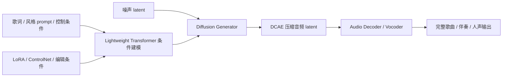
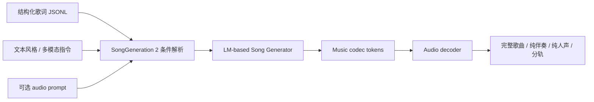
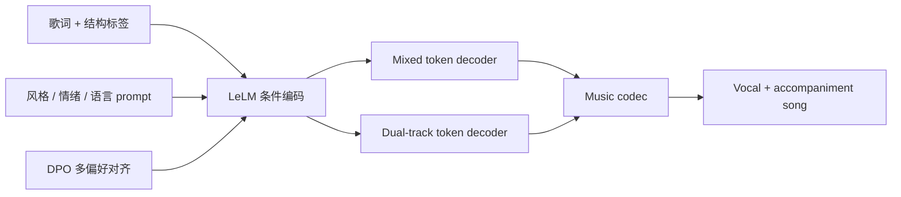
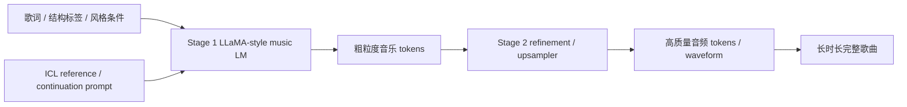
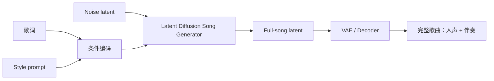
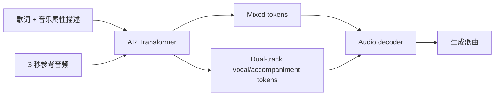
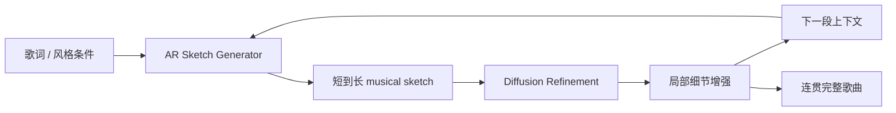
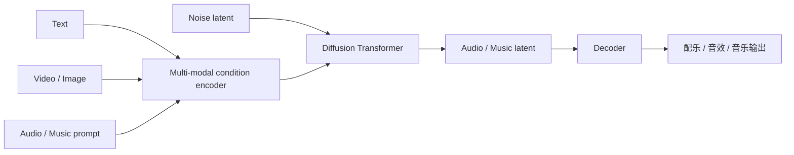
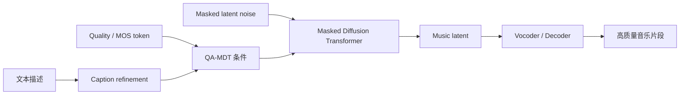

# Music Generation 2025-2026 SOTA Research

生成日期：2026-05-12

检索范围：2025-01-01 到 2026-05-12；覆盖 text-to-music、lyrics-to-song、full-song generation、long-form music generation、multimodal music/audio generation。优先选择 2025/2026 年论文、技术报告、项目页、GitHub、Hugging Face、ModelScope 中证据完整的条目。

用户关心的 baseline：Suno / ACE-Step。Suno 是商业闭源强基线；ACE-Step 是开源 music generation foundation model，本报告同时把 ACE-Step 作为指定 baseline 和候选系统纳入排序。

## 核验范围

- 论文来源：arXiv、Hugging Face Papers、IJCAI、NeurIPS、ICML、ICLR、项目主页。
- 开源来源：GitHub、Hugging Face model / paper / Space、ModelScope、项目 demo 页面。
- 每个候选单独核验 GitHub / Hugging Face / ModelScope 三类开源状态。
- 对 Suno 的判断只作为商业闭源强基线参考；没有公开论文/权重/代码可复现。
- 对 ACE-Step 的判断以官方 GitHub、Hugging Face、ModelScope、项目页和技术报告为主。

## 排序规则

1. 任务直接相关性：full song / lyrics-to-song / text-to-music 高于泛音频生成。
2. 开源完整度：官方代码 + 官方模型 + 可运行 demo / Space 优先。
3. 与 Suno / ACE-Step 的关系：明确对比商业系统、使用 ACE-Step 作为 baseline、或能在可复现性上替代闭源系统者优先。
4. 生成能力：歌词对齐、完整歌曲结构、伴奏与人声协调、长时长、可控性、推理速度。
5. 工程落地：许可证、推理显存、训练/推理脚本、模型下载路径、社区活跃度。
6. 论文价值：架构创新、数据/评测完整性、消融、主观评测和公开 benchmark。

## 总览表

| 排名 | 名称 | 年份 | 任务相关性 | GitHub | Hugging Face | ModelScope | 是否超过指定 baseline / 强基线 | 结论 |
|---:|---|---:|---|---|---|---|---|---|
| 1 | ACE-Step / ACE-Step 1.5 | 2025/2026 | 直接 music/song generation foundation model | ✅ 官方代码 | ✅ 官方模型/Space | ✅ 官方模型/Space | ACE-Step 是指定 baseline；官方材料称兼顾速度、结构、可控性，ACE-Step 1.5 面向本地高质量生成继续增强 | 当前开源落地首选 |
| 2 | SongGeneration 2 / LeVo 2 | 2026 | 直接 song generation | ✅ 官方代码 | ✅ 官方模型 | 未找到 | 项目页称商业级质量，并给出相对 Suno v5 的歌词 PER 对比；技术报告待正式发布 | 若看效果上限，优先跟进 |
| 3 | LeVo / SongGeneration | 2025 | 直接 lyrics-to-song / full song | ✅ 官方代码 | ✅ 官方模型/Space | 未找到 | 论文称超过现有方法；公开材料后续扩展到 4m30s full song | 代码模型完整，工程优先级高 |
| 4 | YuE | 2025 | 直接 long-form lyrics-to-song | ✅ 官方代码入口 | ✅ 官方模型/Space | 未找到 | 未找到与 Suno / ACE-Step 的严格同表对比；开源 full-song foundation model 影响力强 | 长歌生成和多语种优先看 |
| 5 | DiffRhythm | 2025 | 直接 full-length song generation | ✅ 官方代码 | ✅ 官方模型/Space | 未找到 | 与 ACE-Step 属不同路线；ACE-Step 官方材料把 DiffRhythm 作为扩散类代表对比 | 速度快，适合 full-song 快速生成 |
| 6 | SongGen | 2025 | 直接 text-to-song | ✅ 官方代码 | ✅ 官方模型 | 未找到 | 未找到超过 Suno / ACE-Step 的严格结论；ICML 2025，单阶段 AR 结构有价值 | 研究 lyric alignment 和 dual-track 结构必看 |
| 7 | SongBloom | 2025 | 直接 coherent full-song generation | ✅ 官方代码 | ✅ 官方模型 | 未找到 | 论文称接近 SOTA commercial music generation platforms；未找到可复核 Suno 同协议评测 | 论文效果强，工程可试 |
| 8 | InspireMusic / FunMusic | 2025 | 直接 text-to-music / long-form music | ✅ 官方代码 | ✅ 官方模型 | ✅ 官方模型 | 未找到与 Suno / ACE-Step 的严格同表对比；ModelScope 下载链路完整 | 国内部署和长纯音乐优先 |
| 9 | AudioX | 2025/2026 | 相邻任务/降权参考：anything-to-audio + music | ✅ 官方代码 | ✅ 官方模型/数据/Space | 未找到 | ICLR 2026；不是纯 music-only 系统，但支持 music generation 和多模态控制 | 多模态配乐/视频配乐值得看 |
| 10 | OpenMusic / QA-MDT | 2025 | 直接 text-to-music | ✅ 官方代码 | ✅ 官方模型 | 未找到 | IJCAI 2025；不直接对比 Suno / ACE-Step，强在质量感知训练和开源复现 | 纯 TTM 质量控制路线参考 |

## Top 方法深度解析

### [1] ACE-Step / ACE-Step 1.5

- 论文 / 技术报告：ACE-Step: A Step Towards Music Generation Foundation Model，arXiv:2506.00045，https://huggingface.co/papers/2506.00045
- 项目页：https://ace-step.github.io/
- GitHub：https://github.com/ace-step/ACE-Step；ACE-Step 1.5 仓库在 `ace-step/ACE-Step-1.5`
- Hugging Face：https://huggingface.co/ACE-Step/ACE-Step-v1-3.5B
- ModelScope：https://www.modelscope.cn/models/ACE-Step/ACE-Step-v1-3.5B；Space：https://modelscope.cn/studios/ACE-Step/ACE-Step
- 开源结论：代码+模型已开源
- baseline / 强基线判断：这是用户指定 baseline。官方材料明确把 YuE / SongGen 作为 LLM 路线、DiffRhythm 作为 diffusion 路线来讨论各自短板，并强调 ACE-Step 通过 diffusion + DCAE + lightweight transformer 平衡速度、结构和可控性。ACE-Step 1.5 官方仓库进一步主打本地高质量生成。
- 技术方案：以深压缩音频自编码器降低生成空间复杂度，用 diffusion 生成音乐 latent，再用轻量 transformer 做条件建模和长程结构控制，支持歌词、风格、控制条件和下游编辑。
- 训练 / 推理策略：推理时输入歌词、风格 prompt、结构/控制条件，生成压缩 latent 后解码成音乐音频；工程上支持 UI、Space、LoRA / ControlNet 等扩展。
- 实验结果：官方技术报告和项目页强调 SOTA 开源表现、快速生成和高可控性；ModelScope 社区材料说明其 3.5B 参数、多语言歌曲生成和可拓展编辑能力。
- 毒舌点评：ACE-Step 当前最像 music generation 领域的“可落地底座”，不是只有 demo。真正的问题是质量是否稳定超过商业闭源系统，仍要用自有歌单、中文/英文歌词、真实业务 prompt 重测。
- 为什么值得看：如果要在本地部署一个能跑、能改、能扩展的 music generation baseline，ACE-Step 是第一选择。

#### 信号流

### [2] SongGeneration 2 / LeVo 2

- 论文 / 技术报告：官方 GitHub 写明 upcoming technical report；当前以项目页和开源仓库为主。
- GitHub：https://github.com/tencent-ailab/SongGeneration
- Hugging Face：`lglg666/SongGeneration-v2-large`、`lglg666/SongGeneration-Runtime` 等模型下载路径由官方仓库给出
- ModelScope：未找到可信官方 ModelScope 镜像
- 开源结论：代码+模型已开源
- baseline / 强基线判断：官方仓库的 SongGeneration 2 页面称通过 20 名行业专家、6 个核心维度、100 首歌曲/模型的评估，整体质量接近商业系统，并给出 PER：SongGeneration-v2-large 8.55%，Suno v5 12.4%，Mureka v8 9.96%。这属于项目公开评测，不是已发表论文同表评测。
- 技术方案：延续 SongGeneration / LeVo 的 LM + music codec 框架，加入更大规模 checkpoint、多语种歌词、更强指令控制和 audio prompt 控制。
- 训练 / 推理策略：输入结构化歌词 JSONL、文本描述和可选音频 prompt；推理脚本支持生成完整歌曲、纯伴奏、纯人声、分轨输出。
- 实验结果：公开材料强调商业级 musicality、歌词准确度和可控性。由于技术报告尚未正式发布，论文细节和消融还不完整。
- 毒舌点评：如果只看官方声明，LeVo 2 是开源阵营里最有野心的 Suno 对手；但现在最缺的是正式技术报告和可复核评测协议。
- 为什么值得看：它是 2026 年最值得跟踪的开源 full-song 系统之一，尤其适合业务侧先做黑盒听评和歌词 PER 复测。

#### 信号流

### [3] LeVo / SongGeneration

- 论文：LeVo: High-Quality Song Generation with Multi-Preference Alignment，arXiv:2506.07520，https://huggingface.co/papers/2506.07520
- GitHub：https://github.com/tencent-ailab/SongGeneration
- Hugging Face：https://huggingface.co/tencent/SongGeneration；https://huggingface.co/waytan22/SongGeneration-LeVo
- ModelScope：未找到可信官方 ModelScope 镜像
- 开源结论：代码+模型已开源
- baseline / 强基线判断：论文称在 objective 和 subjective metrics 上持续超过 existing methods；没有找到严格对 Suno / ACE-Step 的同表公开论文结论。后续官方仓库延伸到 SongGeneration 2。
- 技术方案：LeLM + music codec 框架，同时建模 mixed tokens 和 dual-track tokens。mixed tokens 保持人声伴奏融合，dual-track tokens 提升人声/伴奏分离控制；再用 DPO 做多偏好对齐。
- 训练 / 推理策略：结构化歌词 + 风格 prompt 输入，模型生成 token，再由 codec 解码；DPO 阶段用半自动偏好数据增强 musicality、instruction following 和人声伴奏和谐度。
- 实验结果：论文页称 LeVo 在客观和主观指标上超过现有方法；官方仓库提供 base、full、large 等 checkpoint，最长公开版本支持 4m30s。
- 毒舌点评：LeVo 的优点是路线完整、代码权重齐、输出形态贴近产品；缺点是训练和推理链路仍偏重，评测需要自己补 Suno / ACE-Step 同 prompt 听评。
- 为什么值得看：这是 2025 年最值得复现的 lyrics-to-song 论文之一。

#### 信号流

### [4] YuE

- 论文：YuE: Scaling Open Foundation Models for Long-Form Music Generation，arXiv:2503.08638，https://huggingface.co/papers/2503.08638
- GitHub：官方入口见项目与 Hugging Face collection；常用实现/推理入口围绕 `m-a-p/YuE` 生态
- Hugging Face：https://huggingface.co/collections/m-a-p/yue
- ModelScope：未找到可信官方 ModelScope 镜像
- 开源结论：代码+模型已开源
- baseline / 强基线判断：未找到与 Suno / ACE-Step 的严格同协议对比。YuE 在开源生态里的价值是长歌、歌词对齐、多语种、多风格和 Apache-2.0 授权。
- 技术方案：基于 LLaMA2 架构做音乐 token 的 next-token prediction，使用 track-decoupled prediction 处理混合信号，用 structural progressive conditioning 保持长上下文歌词对齐，并通过多任务多阶段预训练增强泛化。
- 训练 / 推理策略：两阶段模型常见组合是 stage1 生成粗粒度音乐 token，stage2 / upsampler 提升音频质量；支持 ICL、continuation、style transfer 等用法。
- 实验结果：论文页称可生成最长约 5 分钟音乐，保持歌词对齐、结构一致和伴奏合理；Hugging Face collection 有多语言 checkpoint 和 upsampler。
- 毒舌点评：YuE 的开源影响力很强，但 AR 长歌生成容易慢，且结构稳定性要看具体 prompt 和采样策略。它适合研究和二次开发，不一定是最快上线方案。
- 为什么值得看：长歌生成、Apache-2.0、模型生态完整，是 ACE-Step 之外必须比较的开源底座。

#### 信号流

### [5] DiffRhythm

- 论文：DiffRhythm: Blazingly Fast and Embarrassingly Simple End-to-End Full-Length Song Generation with Latent Diffusion，arXiv:2503.01183，https://huggingface.co/papers/2503.01183
- GitHub：论文页和项目页提供官方 GitHub 入口
- Hugging Face：https://huggingface.co/ASLP-lab/DiffRhythm-full；https://huggingface.co/ASLP-lab/DiffRhythm-base；https://huggingface.co/ASLP-lab/DiffRhythm-vae
- ModelScope：未找到可信官方 ModelScope 镜像
- 开源结论：代码+模型已开源
- baseline / 强基线判断：ACE-Step 官方材料把 DiffRhythm 作为 diffusion 路线代表，指出扩散路线速度快但长程结构 coherence 是挑战。DiffRhythm 本身主打 10 秒生成最长 4m45s 完整歌曲。
- 技术方案：latent diffusion 直接做 full-length song generation，用歌词和 style prompt 生成同时包含人声与伴奏的完整歌曲，避免复杂多阶段流水线。
- 训练 / 推理策略：输入 lyrics + style prompt，非自回归 latent diffusion 生成完整 song latent，再由 VAE / decoder 输出音频。
- 实验结果：论文页称能够在约 10 秒内生成最长 4m45s 的完整歌曲，并开源训练代码与预训练模型。
- 毒舌点评：DiffRhythm 的速度卖点很强，但 full song 的全局结构和歌词细节仍需要和 ACE-Step / LeVo / YuE 做同 prompt 听评。
- 为什么值得看：如果业务目标是快速生成完整歌曲 demo，它的工程价值很高。

#### 信号流

### [6] SongGen

- 论文：SongGen: A Single Stage Auto-regressive Transformer for Text-to-Song Generation，arXiv:2502.13128，ICML 2025，https://huggingface.co/papers/2502.13128
- GitHub：https://github.com/LiuZH-19/SongGen
- Hugging Face：https://huggingface.co/LiuZH-19/SongGen_mixed_pro；https://huggingface.co/LiuZH-19/SongGen_interleaving_A_V
- ModelScope：未找到可信官方 ModelScope 镜像
- 开源结论：代码+模型已开源
- baseline / 强基线判断：未找到超过 Suno / ACE-Step 的严格结论。SongGen 的价值在单阶段 AR、双输出模式、可选 3 秒参考音频做 voice cloning。
- 技术方案：一个 auto-regressive transformer 同时支持 mixed mode 和 dual-track mode；控制条件包括歌词、乐器、genre、mood、timbre 和可选 reference clip。
- 训练 / 推理策略：自动数据预处理和质量控制后训练 AR token 模型；推理时一次性生成混合或分轨 token，再解码为歌曲。
- 实验结果：论文页说明会释放 model weights、training code、annotated data 和 preprocessing pipeline；GitHub 已释放训练代码和 HF 模型。
- 毒舌点评：SongGen 是学术上很干净的一条路线，但 AR 推理速度和长程结构稳定性要和 ACE-Step / DiffRhythm 重新比。
- 为什么值得看：适合研究歌词对齐、分轨生成和单阶段 song generation。

#### 信号流

### [7] SongBloom

- 论文：SongBloom: Coherent Song Generation via Interleaved Autoregressive Sketching and Diffusion Refinement，arXiv:2506.07634，NeurIPS 2025，https://huggingface.co/papers/2506.07634
- GitHub：https://github.com/Cypress-Yang/SongBloom
- Hugging Face：https://huggingface.co/CypressYang/SongBloom；https://huggingface.co/rsxdalv/SongBloom
- ModelScope：未找到可信官方 ModelScope 镜像
- 开源结论：代码+模型已开源
- baseline / 强基线判断：论文页称效果接近 SOTA commercial music generation platforms；未找到与 Suno / ACE-Step 的可复核同协议公开表格。
- 技术方案：interleaved autoregressive sketching + diffusion refinement。先用 AR 扩展全局音乐 sketch，保持结构连贯；再用 diffusion 做局部细节增强。
- 训练 / 推理策略：从短到长逐步生成 sketch，并在每个阶段引入 diffusion refinement，从粗到细生成完整歌曲。
- 实验结果：论文页称在主观和客观指标上超过现有方法，且接近商业平台效果；Microsoft Research 页面明确代码和权重已发布。
- 毒舌点评：SongBloom 的结构想法比单纯 AR 或单纯 diffusion 更均衡；落地要看开源 checkpoint 的显存、速度和稳定性。
- 为什么值得看：它直接冲着“长歌结构一致 + 局部音质”这个核心痛点去。

#### 信号流

### [8] InspireMusic / FunMusic

- 论文：InspireMusic: Integrating Super Resolution and Large Language Model for High-Fidelity Long-Form Music Generation，arXiv:2503.00084
- GitHub：https://github.com/FunAudioLLM/FunMusic
- Hugging Face：https://huggingface.co/FunAudioLLM/InspireMusic-Base 等
- ModelScope：https://www.modelscope.cn/iic/InspireMusic-1.5B-Long 等官方模型下载路径
- 开源结论：代码+模型已开源
- baseline / 强基线判断：未找到与 Suno / ACE-Step 的严格同表对比。优势是国内开源链路和 ModelScope 权重完整，适合纯音乐/长音乐生成。
- 技术方案：音频 tokenizer 把 waveform 转离散 tokens，Qwen2.5 backbone 的 AR transformer 做 text/audio token next-token prediction，再用 super-resolution flow-matching 模型补高分辨率细节，最后 vocoder 输出 waveform。
- 训练 / 推理策略：支持 text-to-music、music continuation、music reconstruction、super resolution；推理可选择 fast mode 或 flow matching mode。
- 实验结果：官方仓库和 HF/PyPI 文档说明支持 24kHz/48kHz、1.5B、long-form 多分钟音乐生成，提供训练和推理脚本。
- 毒舌点评：InspireMusic 不一定是听感最强的 song generator，但它是国内环境里最容易走通 ModelScope 下载、训练、推理的一类项目。
- 为什么值得看：如果要在国内服务器部署和二次训练，优先级很高。

#### 信号流

### [9] AudioX

- 论文：AudioX: Diffusion Transformer for Anything-to-Audio Generation，arXiv:2503.10522，ICLR 2026，https://huggingface.co/papers/2503.10522
- GitHub：https://github.com/ZeyueT/AudioX
- Hugging Face：https://huggingface.co/HKUSTAudio/AudioX；https://huggingface.co/HKUSTAudio/AudioX-MAF-MMDiT
- ModelScope：未找到可信官方 ModelScope 镜像
- 开源结论：代码+模型已开源
- baseline / 强基线判断：不是纯 music-only 系统，作为相邻任务降权参考。它支持 text/video/image/audio/music 到 audio/music，适合视频配乐和多模态音乐生成，不适合作为 Suno 式 full-song 主基线。
- 技术方案：统一 diffusion transformer，通过 multi-modal masked training 学习跨模态条件，结合 MAF / MMDiT 融合文本、视频、图像、音频和音乐条件。
- 训练 / 推理策略：输入 text/video/image/audio/music 任一或多种条件，生成高质量 audio/music；HF 模型页给出 stable_audio_tools 推理示例。
- 实验结果：论文页称在多项 specialized models 上匹配或超过现有方法；项目页显示 ICLR 2026 接收，并发布模型、数据和 demo。
- 毒舌点评：AudioX 的优势是“配乐/泛音频统一生成”，不是做完整流行歌曲。把它和 Suno 直接比歌会不公平，但拿它做视频到音乐很合适。
- 为什么值得看：适合视频配乐、多模态声音设计和泛音频生成产品。

#### 信号流

### [10] OpenMusic / QA-MDT

- 论文：QA-MDT: Quality-aware Masked Diffusion Transformer for Enhanced Music Generation，IJCAI 2025，https://www.ijcai.org/proceedings/2025/1126
- GitHub：https://github.com/ivcylc/OpenMusic
- Hugging Face：https://huggingface.co/lichang0928/QA-MDT
- ModelScope：未找到可信官方 ModelScope 镜像
- 开源结论：代码+模型已开源
- baseline / 强基线判断：未找到与 Suno / ACE-Step 的严格对比。它是 text-to-music 质量感知训练路线，偏纯音乐/短音乐生成，不是 full-song 歌曲系统。
- 技术方案：质量感知训练 + Masked Diffusion Transformer，把 MOS / quality token 注入训练，缓解公开数据质量不均；同时做 caption refinement 提升文本-音乐一致性。
- 训练 / 推理策略：在 latent space 训练 MDT，推理时用文本 prompt 和 quality level 控制生成质量；官方仓库提供训练和推理脚本。
- 实验结果：IJCAI 2025 页面称在 MusicCaps 和 Song-Describer Dataset 上达到 SOTA objective / subjective 结果，并开源代码和预训练 checkpoint。
- 毒舌点评：OpenMusic 不是 Suno 替代品，但质量感知训练很实用，可以吸收到更大的 music foundation model 里。
- 为什么值得看：如果关注 text-to-music 的质量控制和数据清洗，这篇值得细读。

#### 信号流

## 复现/落地优先级

| 优先级 | 方法 | 原因 | 建议动作 |
|---:|---|---|---|
| 1 | ACE-Step / ACE-Step 1.5 | GitHub + HF + ModelScope + Space 完整，指定 baseline，可本地部署 | 先跑官方 3.5B / 1.5，再做中文/英文歌词和 Suno 同 prompt 听评 |
| 2 | LeVo / SongGeneration / SongGeneration 2 | 代码、权重、推理脚本完整，full song 能力贴近产品 | 重点复测歌词 PER、结构完整度、4 分钟歌曲稳定性 |
| 3 | YuE | Apache-2.0，长歌和多语种生态强 | 用作长歌和 ICL/style transfer 对照 baseline |
| 4 | DiffRhythm | full-length diffusion，速度优势明显 | 做快速 demo 和批量生成评估 |
| 5 | InspireMusic | ModelScope 链路完整，适合国内部署和长纯音乐 | 优先验证 1.5B-Long 的 text-to-music / continuation |
| 6 | SongGen / SongBloom | 论文结构价值高，代码模型可用 | 用于研究 lyric alignment、dual-track、AR+diffusion 混合生成 |
| 7 | AudioX | 多模态配乐能力强 | 用于 video-to-music / image-to-audio，不作为主歌曲生成 baseline |
| 8 | OpenMusic / QA-MDT | 质量感知 TTM 路线清晰 | 用于纯音乐质量控制和数据训练策略参考 |

## 论文效果/技术价值优先级

| 优先级 | 方法 | 技术价值判断 |
|---:|---|---|
| 1 | ACE-Step | 开源 foundation model 形态最完整，兼顾速度、质量、控制和扩展 |
| 2 | LeVo / SongGeneration | mixed + dual-track tokens 和 DPO 多偏好对齐直接针对歌曲生成痛点 |
| 3 | SongBloom | AR sketch + diffusion refinement 是解决长程结构与局部音质冲突的强思路 |
| 4 | YuE | open long-form foundation model，长歌、多语种、ICL 价值高 |
| 5 | DiffRhythm | latent diffusion full-song 快速生成路线非常实用 |
| 6 | SongGen | 单阶段 AR + mixed/dual-track output 的研究价值高 |
| 7 | AudioX | 统一多模态 audio/music generation，适合配乐和泛音频产品 |
| 8 | InspireMusic | AR + flow matching + super-resolution 工程链路完整 |
| 9 | OpenMusic / QA-MDT | 质量感知训练和 caption refinement 对 TTM 数据问题有启发 |
| 10 | SongGeneration 2 | 公开效果强，但正式技术报告未发布，先按工程系统跟进 |

## 最终建议

1. 如果目标是“本地开源替代 Suno / ACE-Step 风格的产品原型”，先跑 ACE-Step / ACE-Step 1.5，再跑 LeVo / SongGeneration 2，二者做同 prompt 听评。
2. 如果目标是“长歌和多语种歌词生成”，YuE、LeVo、SongGeneration 2 放在第一梯队，重点测歌词 PER、段落结构、重复和结尾质量。
3. 如果目标是“快速生成完整歌曲 demo”，DiffRhythm 值得优先试；如果目标是“商业质量上限”，SongGeneration 2 和 LeVo 后续技术报告必须持续跟进。
4. 如果目标是“国内部署 / ModelScope / 二次训练”，ACE-Step 和 InspireMusic 最方便。
5. 如果目标是“视频配乐 / 多模态音乐”，AudioX 比纯 song generator 更对口。

## 主要来源

- ACE-Step GitHub：https://github.com/ace-step/ACE-Step
- ACE-Step 项目页：https://ace-step.github.io/
- ACE-Step Hugging Face Paper：https://huggingface.co/papers/2506.00045
- ACE-Step Hugging Face Model：https://huggingface.co/ACE-Step/ACE-Step-v1-3.5B
- ACE-Step ModelScope 社区介绍：https://community.modelscope.cn/681d7833c89bb164988ebcfa.html
- LeVo Hugging Face Paper：https://huggingface.co/papers/2506.07520
- SongGeneration GitHub：https://github.com/tencent-ailab/SongGeneration
- SongGeneration Hugging Face：https://huggingface.co/tencent/SongGeneration
- YuE Hugging Face Paper：https://huggingface.co/papers/2503.08638
- YuE Hugging Face Collection：https://huggingface.co/collections/m-a-p/yue
- DiffRhythm Hugging Face Paper：https://huggingface.co/papers/2503.01183
- DiffRhythm Hugging Face Model：https://huggingface.co/ASLP-lab/DiffRhythm-full
- SongGen Hugging Face Paper：https://huggingface.co/papers/2502.13128
- SongGen GitHub：https://github.com/LiuZH-19/SongGen
- SongBloom Hugging Face Paper：https://huggingface.co/papers/2506.07634
- SongBloom Microsoft Research：https://www.microsoft.com/en-us/research/publication/songbloom-coherent-song-generation-via-interleaved-autoregressive-sketching-and-diffusion-refinement/
- InspireMusic GitHub：https://github.com/FunAudioLLM/FunMusic
- InspireMusic Hugging Face：https://huggingface.co/FunAudioLLM/InspireMusic-Base
- AudioX Hugging Face Paper：https://huggingface.co/papers/2503.10522
- AudioX 项目页：https://zeyuet.github.io/AudioX/
- AudioX Hugging Face Model：https://huggingface.co/HKUSTAudio/AudioX
- OpenMusic GitHub：https://github.com/ivcylc/OpenMusic
- QA-MDT IJCAI 2025：https://www.ijcai.org/proceedings/2025/1126
