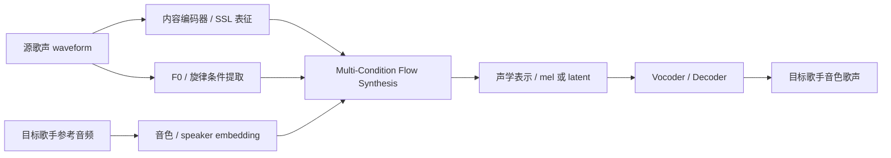
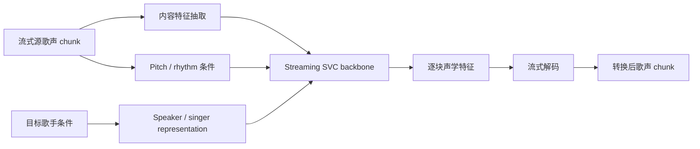
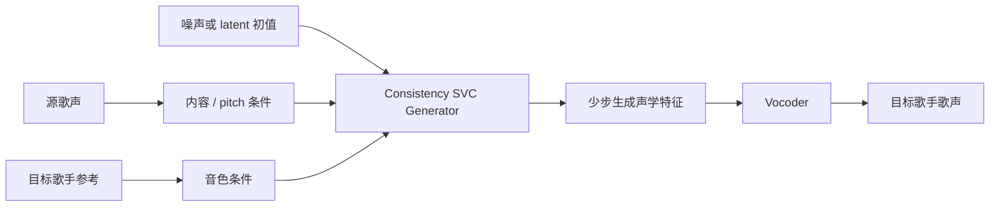
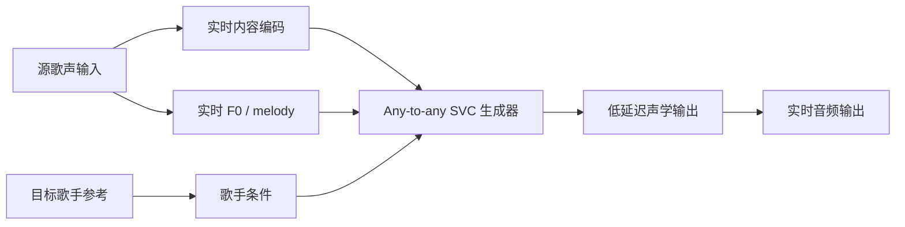
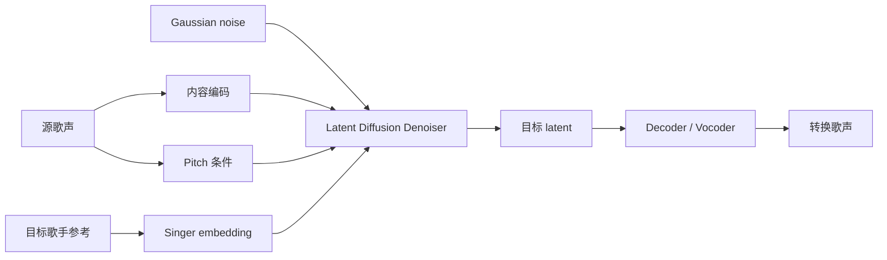
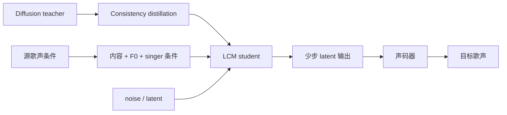
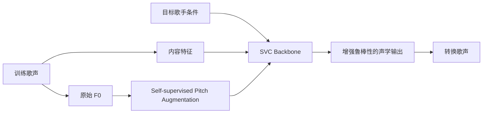
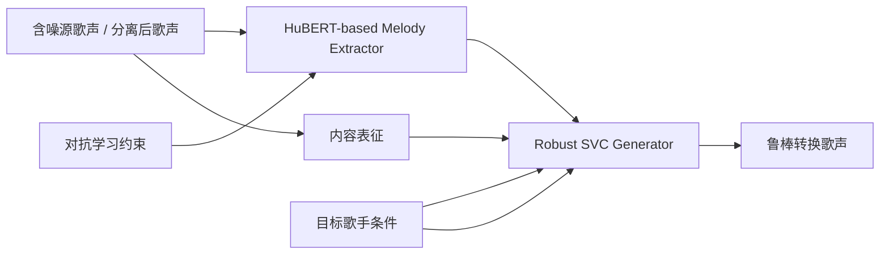
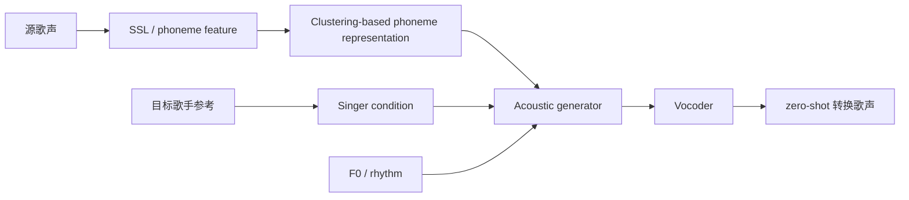
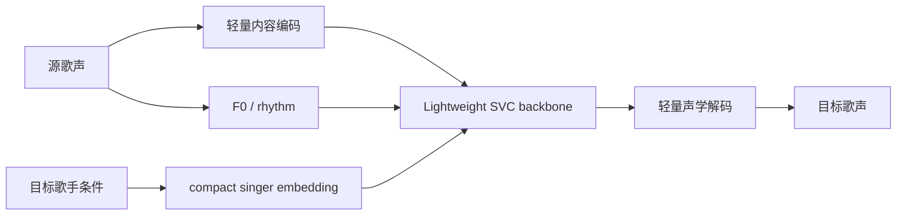

# 所有 Singing Voice Conversion 相关论文 2024 SOTA Research

生成日期：2026-05-12

检索范围：2024 年公开论文、arXiv、项目主页、GitHub、Hugging Face、ModelScope、Papers with Code；主题限定为 Singing Voice Conversion，直接 SVC 方法优先，直接方法不足 Top 10 时补入相邻任务并降权标注。

用户关心的 baseline：SeedVC / Seed-VC。

## 核验范围

- 论文来源：arXiv、ICASSP / ISCA / 会议论文页、项目主页、Papers with Code。
- GitHub 核验：按论文名、方法名、作者组织、`Singing Voice Conversion`、`SeedVC`、`SVC` 等关键词检索。
- Hugging Face 核验：按方法名、作者名、模型名、Paper page、model repo、Space 检索。
- ModelScope 核验：按方法名、英文任务名、中文任务名、模型名检索。
- 开源结论只使用确定档位：`代码+模型已开源`、`仅代码已开源`、`仅模型/Space/Demo 已开源`、`未找到官方代码`、`未找到官方模型`、`未找到可信官方 ModelScope 镜像`、`非官方复现`。

## 排序规则

1. 任务直接相关性：直接 Singing Voice Conversion 高于普通 voice conversion / singing voice synthesis。
2. SeedVC 关系：明确作为 baseline、同为 zero-shot/high-fidelity/real-time 路线、或可作为 SeedVC 前后可比方法者优先。
3. 开源强度：官方代码 + 权重 > 官方代码 > 官方 demo / Space > 无官方开源。
4. 复现实用性：依赖清晰、推理链路完整、模型权重可下载、许可证风险低者优先。
5. 论文技术价值：生成质量、zero-shot 能力、实时性、鲁棒性、消融和主观评测完整性。

## 总览表

| 排名 | 名称 | 年份 | 任务相关性 | GitHub | Hugging Face | ModelScope | 是否超过指定 baseline / 强基线 | 结论 |
|---:|---|---:|---|---|---|---|---|---|
| 1 | SeedVC / Seed-VC: Real-Time and Accurate Zero-Shot High-Fidelity SVC with Multi-Condition Flow Synthesis | 2024 | 直接 SVC / 用户 baseline | 官方：`Plachtaa/seed-vc` | 官方：`Plachta/Seed-VC` 模型；HF Paper 存在 | 未找到可信官方 ModelScope 镜像 | 这是指定 baseline；相对 So-VITS-SVC、RVC、Diffusion-SVC 等强基线更适合作为 2024 以后对照 | 最值得优先复现和业务试跑，代码+模型已开源 |
| 2 | SaMoye / SaMoye-SVC | 2024 | 直接 SVC / zero-shot any-to-any | 官方：`CarlWangChina/SaMoye-SVC` | 官方：`CarlWangChina/SaMoyeSVC` 模型 / 数据 | 未找到可信官方 ModelScope 镜像 | 未找到与 SeedVC 的正式同表对比；开源完整度强，适合作为 SeedVC 之外的候选路线 | 代码+模型已开源，复现优先级高 |
| 3 | CoMoSVC: Consistency Model-based SVC | 2024 | 直接 SVC / 快速采样 | 官方项目页与代码入口可访问 | HF 仅检索到论文/索引，未找到官方模型 | 未找到可信官方 ModelScope 镜像 | 未找到与 SeedVC 的正式同表对比；主打从扩散式生成向少步 consistency 推理压缩 | 仅代码已开源，适合研究低延迟 SVC |
| 4 | RASVC: Real-time Any-to-any SVC | 2024 | 直接 SVC / real-time any-to-any | 官方 demo 页；未找到完整官方训练代码仓 | 未找到官方模型 | 未找到可信官方 ModelScope 镜像 | 未找到与 SeedVC 的正式同表对比；同属实时 zero-shot SVC，对工程延迟有参考价值 | 仅 Demo 已公开，工程复现风险高 |
| 5 | LDM-SVC: Latent Diffusion Model Based Zero-Shot Any-to-Any SVC | 2024 | 直接 SVC / latent diffusion | 未找到官方代码 | 未找到官方模型 | 未找到可信官方 ModelScope 镜像 | 未找到与 SeedVC 的正式同表对比；论文价值在 latent diffusion + speaker guidance | 论文值得看，落地优先级低 |
| 6 | LCM-SVC: Latent Consistency Distillation for SVC | 2024 | 直接 SVC / diffusion acceleration | 未找到官方代码 | 未找到官方模型 | 未找到可信官方 ModelScope 镜像 | 未找到与 SeedVC 的正式同表对比；针对扩散 SVC 的采样速度瓶颈 | 技术价值高于复现价值 |
| 7 | SPA-SVC: Self-supervised Pitch Augmentation for SVC | 2024 | 直接 SVC / pitch robustness | 未找到官方代码 | 未找到官方模型 | 未找到可信官方 ModelScope 镜像 | 未找到与 SeedVC 的正式同表对比；聚焦 pitch 条件增强而非端到端替代 SeedVC | 适合作为 pitch augmentation 模块参考 |
| 8 | RobustSVC: HuBERT-based Melody Extractor and Adversarial Learning | 2024 | 直接 SVC / robustness | 未找到官方代码 | 未找到官方模型 | 未找到可信官方 ModelScope 镜像 | 未找到与 SeedVC 的正式同表对比；面向噪声、音高提取误差和鲁棒转换 | 研究思路可吸收，复现成本高 |
| 9 | Zero-Shot Sing Voice Conversion with Clustering-based Phoneme Representations | 2024 | 直接 SVC / zero-shot representation | 未找到官方代码 | 未找到官方模型 | 未找到可信官方 ModelScope 镜像 | 未找到与 SeedVC 的正式同表对比；强调离散音素表示用于 zero-shot 转换 | 表征思路值得看，工程价值受限 |
| 10 | LHQ-SVC: Lightweight and High-Quality SVC | 2024 | 直接 SVC / lightweight | 未找到官方代码 | 未找到官方模型 | 未找到可信官方 ModelScope 镜像 | 未找到与 SeedVC 的正式同表对比；关注轻量化和高质量平衡 | 适合作为移动端/低算力方向参考 |

## Top 方法深度解析

### [1] SeedVC / Seed-VC

- 论文：Real-Time and Accurate Zero-shot High-Fidelity Singing Voice Conversion with Multi-Condition Flow Synthesis，arXiv:2405.15093，https://arxiv.org/abs/2405.15093
- GitHub：https://github.com/Plachtaa/seed-vc
- Hugging Face：https://huggingface.co/Plachta/Seed-VC
- ModelScope：未找到可信官方 ModelScope 镜像
- 开源结论：代码+模型已开源
- baseline / 强基线判断：这是本次指定 baseline。它把 zero-shot、实时、高保真和多条件流合成放在同一个系统里，适合作为 2024 SVC 实用基准。
- 技术方案：用内容表征保留歌词/音素信息，用 F0 / 音高相关条件保留旋律，用说话人或歌手参考提取 timbre 条件，再通过 multi-condition flow synthesis 生成目标歌手音色下的 singing voice。
- 训练 / 推理策略：推理时输入源歌声和目标参考音频，编码内容、F0、音色条件后走生成主干，最后解码为目标歌声。工程侧重点是实时或低延迟推理。
- 实验结果：论文和项目将其定位为高保真 zero-shot SVC，并与 So-VITS-SVC、RVC、Diffusion-SVC 等路线形成实用对照。具体复现时应以官方 checkpoint 和 demo 音频为第一评估对象。
- 毒舌点评：SeedVC 的优势不在“结构名字更炫”，而在代码、模型、推理链路都能落地；这对 SVC 比单纯论文分数更重要。缺点是作为 baseline 后，后续论文很少在同一评测协议里正面对打它。
- 为什么值得看：如果只选一个 2024 SVC 起点，SeedVC 是最稳妥的工程入口。

#### 信号流

### [2] SaMoye / SaMoye-SVC

- 论文 / 项目：SaMoye: A Streaming Any-to-Many Zero-shot Singing Voice Conversion System，项目页和论文索引可检索。
- GitHub：https://github.com/CarlWangChina/SaMoye-SVC
- Hugging Face：https://huggingface.co/CarlWangChina/SaMoyeSVC
- ModelScope：未找到可信官方 ModelScope 镜像
- 开源结论：代码+模型已开源
- baseline / 强基线判断：未找到与 SeedVC 的正式同表对比；优势在 streaming any-to-many 与官方开源完整度。
- 技术方案：面向流式 SVC，把源歌声内容、音高、时序信息和目标歌手条件拆开建模，强调低延迟 any-to-many 转换。
- 训练 / 推理策略：以源歌声片段为流式输入，逐块抽取内容与 pitch 条件，再融合目标歌手条件输出转换结果。
- 实验结果：公开材料强调 streaming 和 zero-shot / any-to-many 能力；实际落地需要重点验证跨歌手 timbre 稳定性、延迟、颤音与高音区破音。
- 毒舌点评：SaMoye 比很多只给论文不给代码的 SVC 方法靠谱，因为至少可以真的跑起来；但它是否“超过 SeedVC”不能靠项目描述判断，必须在同一歌手、同一曲目、同一主观评测下重测。
- 为什么值得看：官方代码和模型都在，适合作为 SeedVC 之外的第二条可复现路线。

#### 信号流

### [3] CoMoSVC

- 论文：CoMoSVC: Consistency Model-based Singing Voice Conversion，arXiv / 项目页可检索。
- GitHub：官方项目页提供代码入口，https://comosvc.github.io/
- Hugging Face：未找到官方模型
- ModelScope：未找到可信官方 ModelScope 镜像
- 开源结论：仅代码已开源
- baseline / 强基线判断：未找到与 SeedVC 的正式同表对比；它主要挑战扩散 SVC 推理步数多、延迟高的问题。
- 技术方案：把 consistency model 引入 SVC，让模型在少步甚至单步采样下完成从条件表征到目标歌声声学特征的映射。
- 训练 / 推理策略：训练阶段学习从噪声/latent 到干净声学表示的一致性映射；推理阶段用少量采样步生成目标歌手版本。
- 实验结果：公开介绍强调速度提升和质量保持；需要复现时重点对比 diffusion SVC 的 RTF、MOS、speaker similarity。
- 毒舌点评：CoMoSVC 的方向很对，因为 SVC 真要上线，慢扩散是硬伤；但没有官方权重时，复现实验会消耗更多时间。
- 为什么值得看：如果团队关注实时 SVC 或移动端推理，consistency distillation 是值得吸收的路线。

#### 信号流

### [4] RASVC

- 论文 / 项目：Real-time Any-to-any Singing Voice Conversion，官方 demo 页：https://lazycat1119.github.io/RASVC-demo/
- GitHub：未找到完整官方训练代码仓；demo 页源可检索
- Hugging Face：未找到官方模型
- ModelScope：未找到可信官方 ModelScope 镜像
- 开源结论：仅模型/Space/Demo 已开源
- baseline / 强基线判断：未找到与 SeedVC 的正式同表对比；与 SeedVC 同属 real-time / any-to-any 关注点。
- 技术方案：围绕实时 any-to-any SVC 构建转换链路，核心是内容、音高、歌手音色的快速解耦与融合。
- 训练 / 推理策略：推理侧以低延迟为目标，输入源歌声和目标歌手条件后快速输出转换音频。
- 实验结果：demo 可用于听感初筛，但不能替代完整复现；缺少训练代码会限制可控评测。
- 毒舌点评：只有 demo 的方法，适合判断方向，不适合直接押注工程。没有代码和权重，很多“实时”结论无法在自己的机器和数据上复核。
- 为什么值得看：它和 SeedVC 的目标接近，可作为实时 SVC 设计取舍参考。

#### 信号流

### [5] LDM-SVC

- 论文：Latent Diffusion Model Based Zero-Shot Any-to-Any Singing Voice Conversion，arXiv:2406.05325，https://arxiv.org/abs/2406.05325
- GitHub：未找到官方代码
- Hugging Face：未找到官方模型
- ModelScope：未找到可信官方 ModelScope 镜像
- 开源结论：未找到官方代码；未找到官方模型
- baseline / 强基线判断：未找到与 SeedVC 的正式同表对比；与 SeedVC 相比，它更偏论文路线，工程可用性弱。
- 技术方案：在 latent 空间执行 diffusion 生成，结合内容、pitch、目标歌手条件，降低直接波形或高维 mel 空间扩散的复杂度。
- 训练 / 推理策略：训练时学习条件 latent denoising；推理时通过多步去噪生成目标歌手声学表示。
- 实验结果：论文聚焦 zero-shot any-to-any 转换质量；若复现，需要额外实现或等待官方代码。
- 毒舌点评：LDM-SVC 在论文层面合理，但“扩散 + 无代码”对工程就是双重门槛。没有官方实现时，投入前要先评估是否真的比 SeedVC 值得。
- 为什么值得看：适合作为 latent diffusion SVC 的结构参考。

#### 信号流

### [6] LCM-SVC

- 论文：Latent Consistency Distillation for Singing Voice Conversion，arXiv:2408.12354，https://arxiv.org/abs/2408.12354
- GitHub：未找到官方代码
- Hugging Face：未找到官方模型
- ModelScope：未找到可信官方 ModelScope 镜像
- 开源结论：未找到官方代码；未找到官方模型
- baseline / 强基线判断：未找到与 SeedVC 的正式同表对比；强项是加速扩散 SVC，而不是直接替代 SeedVC 的完整开源系统。
- 技术方案：用 latent consistency distillation 把多步 diffusion teacher 蒸馏成少步 student，减少推理延迟。
- 训练 / 推理策略：训练阶段依赖 teacher-student distillation；推理阶段用少步一致性采样输出声学 latent。
- 实验结果：论文价值在采样效率和质量平衡；落地前必须验证蒸馏后音色相似度和旋律稳定性。
- 毒舌点评：这个方向比普通 LDM-SVC 更接近真实系统需求，但没有开源实现时仍然只能先当方法论文读。
- 为什么值得看：如果要改造 diffusion SVC，LCM-SVC 的蒸馏思路很有参考价值。

#### 信号流

### [7] SPA-SVC

- 论文：Self-supervised Pitch Augmentation for Singing Voice Conversion，arXiv / 论文索引可检索。
- GitHub：未找到官方代码
- Hugging Face：未找到官方模型
- ModelScope：未找到可信官方 ModelScope 镜像
- 开源结论：未找到官方代码；未找到官方模型
- baseline / 强基线判断：未找到与 SeedVC 的正式同表对比；它更像增强 pitch 条件鲁棒性的模块型论文。
- 技术方案：用 self-supervised pitch augmentation 扩充训练中的 pitch 条件覆盖，缓解跨歌手、跨音域转换时的 pitch 分布偏差。
- 训练 / 推理策略：训练阶段对 pitch 条件做自监督增强；推理阶段仍沿用 SVC 主干输入源内容和目标歌手条件。
- 实验结果：关键应看高音区、颤音、跨音域转换和音准保持；没有官方代码时难以复核。
- 毒舌点评：Pitch 是 SVC 最容易“听起来一秒露馅”的地方，所以 SPA-SVC 的问题意识正确；但它不是一个完整可直接替换 SeedVC 的系统。
- 为什么值得看：适合把 pitch augmentation 思路迁移到 SeedVC / SaMoye 一类可运行系统里。

#### 信号流

### [8] RobustSVC

- 论文：RobustSVC: HuBERT-based Melody Extractor and Adversarial Learning for Robust Singing Voice Conversion，arXiv / 论文索引可检索。
- GitHub：未找到官方代码
- Hugging Face：未找到官方模型
- ModelScope：未找到可信官方 ModelScope 镜像
- 开源结论：未找到官方代码；未找到官方模型
- baseline / 强基线判断：未找到与 SeedVC 的正式同表对比；更偏鲁棒性补强路线。
- 技术方案：用 HuBERT-based melody extractor 提取更稳的旋律相关表征，并通过 adversarial learning 增强对噪声、伴奏泄漏或提取误差的抵抗力。
- 训练 / 推理策略：训练阶段加入对抗目标，让内容/旋律表征与干扰因素解耦；推理阶段使用鲁棒旋律表征驱动转换。
- 实验结果：应重点看噪声场景、真实歌曲分离后输入、F0 提取错误时的质量退化曲线。
- 毒舌点评：RobustSVC 解决的是 SVC 落地经常被忽略的问题：真实输入并不干净。缺点同样明显，没有官方代码就无法快速验证鲁棒性收益。
- 为什么值得看：适合做真实歌曲输入前处理和鲁棒条件提取的技术储备。

#### 信号流

### [9] Zero-Shot Sing Voice Conversion with Clustering-based Phoneme Representations

- 论文：Zero-Shot Sing Voice Conversion with Clustering-based Phoneme Representations，arXiv:2409.08039，https://arxiv.org/abs/2409.08039
- GitHub：未找到官方代码
- Hugging Face：未找到官方模型
- ModelScope：未找到可信官方 ModelScope 镜像
- 开源结论：未找到官方代码；未找到官方模型
- baseline / 强基线判断：未找到与 SeedVC 的正式同表对比；主要价值在 phoneme representation 设计。
- 技术方案：用 clustering-based phoneme representations 作为内容中间层，减少源歌手 timbre 泄漏，同时保留歌词内容。
- 训练 / 推理策略：先从歌声或语音中提取离散/聚类音素表征，再结合目标歌手条件进行声学重建。
- 实验结果：重点应关注 content preservation、speaker similarity、pronunciation clarity 和跨语言/跨曲风稳定性。
- 毒舌点评：表征路线有价值，但没有开源就很难判断聚类粒度和训练细节是否真的稳定。对业务来说，它更像可借鉴模块，而不是可直接采用系统。
- 为什么值得看：适合研究如何减少源音色残留。

#### 信号流

### [10] LHQ-SVC

- 论文：LHQ-SVC: Lightweight and High-Quality Singing Voice Conversion，arXiv:2409.08583，https://arxiv.org/abs/2409.08583
- GitHub：未找到官方代码
- Hugging Face：未找到官方模型
- ModelScope：未找到可信官方 ModelScope 镜像
- 开源结论：未找到官方代码；未找到官方模型
- baseline / 强基线判断：未找到与 SeedVC 的正式同表对比；关注轻量化，而 SeedVC 更像完整 high-fidelity baseline。
- 技术方案：围绕轻量化 SVC 主干做结构压缩，在保证音质和音色相似度的同时降低参数量和推理开销。
- 训练 / 推理策略：以轻量 backbone 处理内容、pitch 和歌手条件，输出目标声学特征；适合低算力设备方向评估。
- 实验结果：应重点检查参数量、RTF、MOS、speaker similarity 和低算力设备端表现。
- 毒舌点评：轻量化是正确方向，但没有代码和权重时，论文里的轻量指标很难转成可上线资产。
- 为什么值得看：如果目标是端侧 SVC，可以参考它的结构取舍。

#### 信号流

## 复现/落地优先级

| 优先级 | 方法 | 原因 | 建议动作 |
|---:|---|---|---|
| 1 | SeedVC | 官方代码和模型完整，任务直接相关，适合作为统一 baseline | 先跑官方 demo，再用自有歌手样本做 A/B 听评 |
| 2 | SaMoye-SVC | 官方代码、模型、数据资源可用，streaming any-to-many 有工程价值 | 与 SeedVC 同曲同歌手对比延迟、音色相似度、音准 |
| 3 | CoMoSVC | 代码可用，少步生成适合低延迟 SVC 研究 | 复现推理速度，再决定是否迁移到 SeedVC 条件链 |
| 4 | RASVC | demo 可听，方向贴近 real-time any-to-any | 只做听感参考，不作为主工程依赖 |
| 5 | SPA-SVC / RobustSVC | 模块思路有价值，可增强 pitch 与真实输入鲁棒性 | 把思想迁移到 SeedVC/SaMoye 实验，不从零复现整篇 |
| 6 | LDM-SVC / LCM-SVC / Clustering Phoneme / LHQ-SVC | 无官方代码模型，复现成本高 | 作为论文阅读和后续方案储备 |

## 论文效果/技术价值优先级

| 优先级 | 方法 | 技术价值判断 |
|---:|---|---|
| 1 | SeedVC | 2024 年最适合作为 SVC 实用 baseline 的系统；开源完整，能直接形成实验闭环 |
| 2 | LCM-SVC | 把 diffusion SVC 往少步推理压缩，技术方向贴近上线瓶颈 |
| 3 | CoMoSVC | consistency model 用在 SVC 上很有价值，速度与质量平衡值得跟 |
| 4 | SaMoye-SVC | streaming any-to-many 系统路线清晰，开源完整度强 |
| 5 | RobustSVC | 真实歌曲输入鲁棒性重要，HuBERT melody + adversarial 思路值得吸收 |
| 6 | SPA-SVC | pitch augmentation 对音准和跨音域稳定性有直接意义 |
| 7 | LDM-SVC | latent diffusion 是合理生成框架，但工程压力大 |
| 8 | Clustering-based Phoneme Representations | 内容表征去音色泄漏有价值，需代码验证 |
| 9 | LHQ-SVC | 端侧轻量化方向正确，但缺少官方复现资产 |
| 10 | RASVC | demo 显示方向相关，但缺少完整开源限制技术复核 |

## 最终建议

1. 业务落地先用 SeedVC 做基线，不要直接押注无代码论文。SeedVC 是本次唯一同时满足直接 SVC、官方代码、官方模型、工程链路完整的基准系统。
2. 第二优先级试 SaMoye-SVC。它有官方代码和 Hugging Face 资源，适合与 SeedVC 做同曲目、同参考歌手、同设备延迟的 A/B 测试。
3. 如果目标是低延迟，把 CoMoSVC / LCM-SVC 的 consistency 思路作为技术储备；CoMoSVC 可先跑代码，LCM-SVC 先读论文等开源。
4. 如果目标是真实歌曲输入，关注 RobustSVC 和 SPA-SVC 的模块思想，重点不是复现整篇，而是把 HuBERT melody、pitch augmentation、adversarial robustness 移植到可运行系统里。
5. 当前没有找到任何 Top 10 方法的可信官方 ModelScope 镜像。后续如需要国内部署，应优先把 SeedVC / SaMoye 权重做内部镜像和许可证复核。

## 主要来源

- SeedVC arXiv：https://arxiv.org/abs/2405.15093
- SeedVC GitHub：https://github.com/Plachtaa/seed-vc
- SeedVC Hugging Face：https://huggingface.co/Plachta/Seed-VC
- SaMoye-SVC GitHub：https://github.com/CarlWangChina/SaMoye-SVC
- SaMoye-SVC Hugging Face：https://huggingface.co/CarlWangChina/SaMoyeSVC
- CoMoSVC 项目页：https://comosvc.github.io/
- RASVC Demo：https://lazycat1119.github.io/RASVC-demo/
- LDM-SVC arXiv：https://arxiv.org/abs/2406.05325
- LCM-SVC arXiv：https://arxiv.org/abs/2408.12354
- Zero-Shot Sing Voice Conversion arXiv：https://arxiv.org/abs/2409.08039
- LHQ-SVC arXiv：https://arxiv.org/abs/2409.08583
