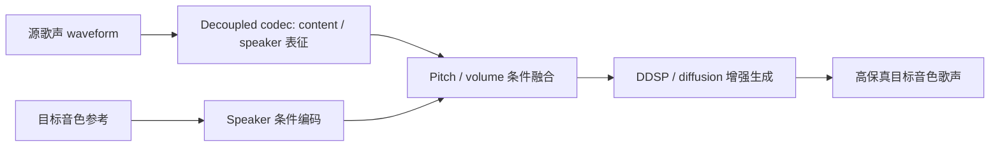
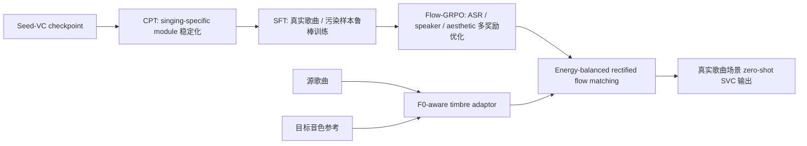
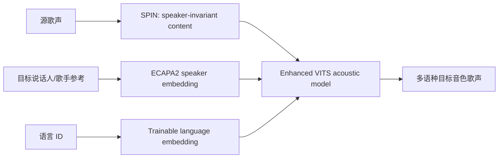
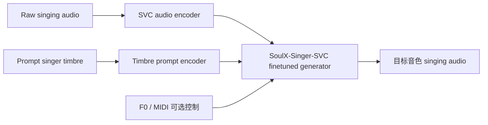
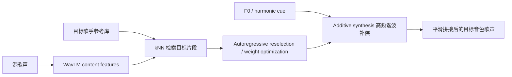
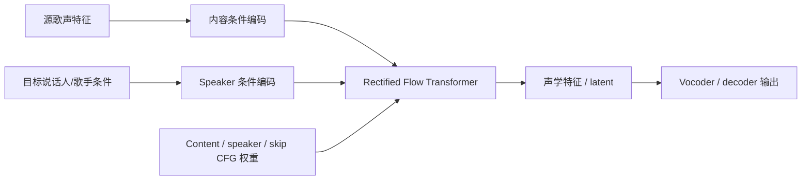
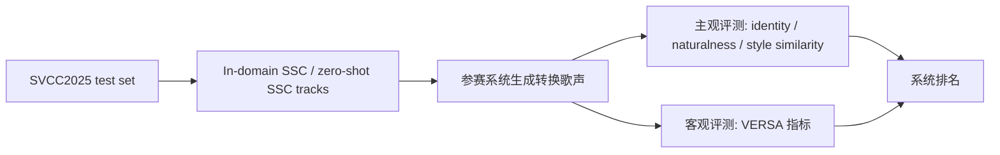
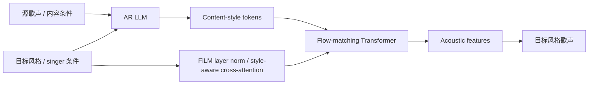
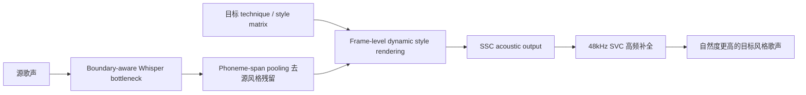
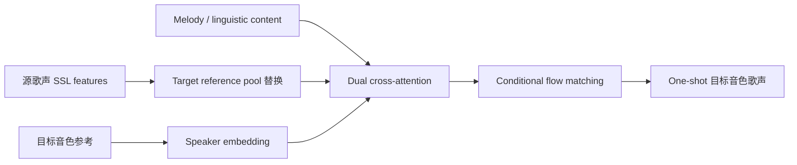

# 2025-2026 Singing Voice Conversion / Singing Style Conversion 开源核验 Top 20

生成日期：2026-05-12  
任务：按 `speech-audio-music-paper-daily` 的论文精读口径，重新强制检查 2025-2026 年 SVC / SSC 相关论文和项目的开源情况。  

## 核验范围

- 论文范围：2025-01-01 到 2026-05-12。
- 主题范围：Singing Voice Conversion、Singing Style Conversion、zero-shot SVC、one-shot SVC、SVS 但明确支持 SVC / timbre transfer 的系统。
- 开源搜索路径：
  - GitHub：项目名、论文名、作者组织、`singing-voice-conversion` topic。
  - Hugging Face：paper page、model repo、dataset repo、Space。
  - ModelScope：项目名、SVC、歌声转换、singing voice conversion 关键词。
- ModelScope 结论：截至本次核验，没有找到这些核心论文对应的可信官方 ModelScope 镜像；因此表中 ModelScope 默认记为“未找到官方镜像”。

## 排序规则

优先级从高到低：

1. 直接 SVC / SSC，而不是泛 SVS。
2. 官方代码 + 官方权重 / 模型可用。
3. 明确在论文、挑战或官方页面中超过 SeedVC、Vevo/Serenade、RVC/So-VITS-SVC、kNN-VC 等强基线。
4. 工程可复现性：能否直接跑推理、是否有 demo、是否有数据集/benchmark。
5. 只提供 demo、没代码没模型的论文会降权；即使论文效果强，也不排在可复现系统前面。

## 总览表

| 排名 | 名称 | 年份 | 相关性 | GitHub | Hugging Face | ModelScope | 是否超过 SeedVC / 强基线 | 结论 |
|---:|---|---:|---|---|---|---|---|---|
| 1 | HQ-SVC | 2025/2026 | 直接 zero-shot SVC | ✅ 官方代码 | ✅ 官方模型 | 未找到 | 论文称超过 SOTA zero-shot SVC；低资源+高质量 | 最优先复现 |
| 2 | YingMusic-SVC | 2025 | 直接 zero-shot SVC | ✅ 论文写官方 GitHub | ✅ 官方模型+benchmark | 未找到 | 基于 Seed-VC 架构继续做 CPT/SFT/Flow-GRPO，论文称强于开源基线 | 最优先跟进 |
| 3 | FreeSVC | 2025 | 直接 multilingual zero-shot SVC | ✅ 官方代码 | ✅ 官方模型 | 未找到 | 不直接宣称超过 SeedVC；但开源完整、多语种 | 最稳复现 |
| 4 | SoulX-Singer-SVC | 2026 | SVS + 官方 SVC 模式 | ✅ 官方代码 | ✅ 官方模型/Space | 未找到 | 非 SeedVC 正面对比；工程规模和开源完整度强 | 工程优先 |
| 5 | kNN-SVC | 2025 | 直接 zero-shot SVC | ✅ 官方代码 | 未找到官方模型 | 未找到 | 论文称相对 kNN-VC 改善鲁棒性；不是 SeedVC 正面对比 | 轻量可复现 |
| 6 | RIFT-SVC | 2025 更新 | 直接 SVC 工程 | ✅ 代码+ckpt/模块 | ✅ 模块/finetuned repo | 未找到 | 无论文级 SeedVC 对比；但工程可跑 | 工程候选 |
| 7 | SVCC2025 Challenge | 2025 | SSC benchmark | ✅ 基线/样例入口 | ✅ 官方数据集 | 未找到 | 26 系统横评，可定位 SeedVC/Vevo/Serenade 类系统 | 必读基准 |
| 8 | S²Voice | 2026 | SSC | 未找到官方代码 | 未找到官方模型 | 未找到 | SVCC2025 两个 track 第一 | 效果强但不开源 |
| 9 | Boundary-Aware IB / S4 | 2026 | SSC | 未找到官方代码 | 未找到官方模型 | 未找到 | SVCC2025 自然度最佳之一 | 效果强但不开源 |
| 10 | DAFMSVC | 2025 | One-shot SVC | 未找到官方代码 | 未找到官方模型 | 未找到 | Interspeech 2025；论文称超过 SOTA | 论文强，复现弱 |
| 11 | SYKI-SVC | 2025 | 直接 SVC + testset | 未找到完整官方 SVC 代码 | 未找到模型 | 未找到 | 高自然度，且后续 S4 基于它 | 基准/后处理思路重要 |
| 12 | Everyone-Can-Sing | 2025 | SVS + SVC | 未找到官方代码 | 未找到模型 | 未找到 | 论文称 timbre similarity / musicality 优于 baselines | 有价值但不开源 |
| 13 | Vevo2 | 2025 | 统一 SVS/VC/SVC | Amphion 路径相关 | ✅ HF 模型 | 未找到 | SVCC2025 baseline；S²Voice 基于 Vevo 强化 | 强基线 |
| 14 | FCPE | 2025 | SVC F0 模块 | ✅ 官方代码 | ✅ HF paper/model关联 | 未找到 | 非 SVC 系统，但 F0 鲁棒性直接影响 SVC | 工程必备模块 |
| 15 | VibE-SVC | 2025 | controllable SVC | 未找到官方代码 | 未找到模型 | 未找到 | 控制 vibrato，补 SeedVC 类系统风格控制短板 | 方向值得看 |
| 16 | SSANSVC / speech-prompted SVC | 2025 | SVC | 未找到官方代码 | 未找到模型 | 未找到 | speech prompt 到 singing timbre，跨域有价值 | 跟踪 |
| 17 | InvoxSVC | 2025 | any-to-any zero-shot SVC | 未找到官方代码 | 未找到模型 | 未找到 | latent flow matching + in-context learning；未见强开源证据 | 跟踪 |
| 18 | R2-SVC | 2025 | real-world robust SVC | 未找到官方代码 | 未找到模型 | 未找到 | 与真实歌曲鲁棒性相关；公开证据弱 | 候选 |
| 19 | CartoonSing | 2025 | timbre/SVS adjacent | 未找到官方代码 | 未找到模型 | 未找到 | 非标准 SVC，偏非人类/角色音色 | 降权 |
| 20 | TCSinger 2 | 2025 | zero-shot SVS/style transfer | 未找到官方 SVC 代码 | 未找到明确模型 | 未找到 | 非 SVC，但 style/timbre prompt 对 SSC 有参考 | 降权参考 |

## 前 10 深度解析

### [1] HQ-SVC: Towards High-Quality Zero-Shot Singing Voice Conversion in Low-Resource Scenarios

- **年份**：arXiv 2025-11，AAAI 2026。
- **论文**：https://huggingface.co/papers/2511.08496
- **GitHub**：https://github.com/ShawnPi233/HQ-SVC
- **Hugging Face 模型**：https://huggingface.co/shawnpi/HQ-SVC
- **ModelScope**：未找到可信官方镜像。
- **开源结论**：代码 + 推理模型均已开源。HF 模型页写明 Apache-2.0，并标注 2025-12-24 已发布 inference codes and pre-trained models。
- **SeedVC / 强基线判断**：论文页面称显著超过 state-of-the-art zero-shot SVC；不只是 demo。它的定位是低资源、高质量 zero-shot SVC，还兼 voice super-resolution。
- **技术方案**：用 decoupled codec 同时建模 content/speaker，避免传统内容与音色完全拆开导致的信息损失；再叠加 pitch / volume 建模、DDSP/扩散式逐步增强，目标是把歌声里最容易丢的高频谐波、音量动态和音色相似度补回来。
- **信号流**：

- **毒舌点评**：这篇是当前最值得先跑的。它不是只在论文里讲故事，代码和模型都放了；如果实际 demo 能稳定，优先级高于大多数“SVCC 名次好但不开源”的系统。

### [2] YingMusic-SVC: Real-World Robust Zero-Shot SVC with Flow-GRPO

- **年份**：2025-12。
- **论文**：https://huggingface.co/papers/2512.04793
- **GitHub**：论文全文和 HF 页写 `https://github.com/GiantAILab/YingMusic-SVC`。
- **Hugging Face 模型**：https://huggingface.co/GiantAILab/YingMusic-SVC
- **Hugging Face 数据集**：https://huggingface.co/datasets/GiantAILab/YingMusic-SVC_Difficulty-Graded_Benchmark
- **ModelScope**：未找到可信官方镜像。
- **开源结论**：HF 上有官方模型页和 difficulty-graded benchmark；论文写 code and models available。实际 GitHub 页面需后续下载/clone 验证文件完整性。
- **SeedVC / 强基线判断**：这篇明说采用 Seed-VC 架构作为基础：从 Seed-VC checkpoint 出发，做 continuous pre-training、SFT、Flow-GRPO。不是简单“超过 SeedVC”，而是直接把 SeedVC 当底座改成工业歌曲场景鲁棒版。
- **技术方案**：核心是三段式训练：CPT 稳定 singing-specific module，SFT 用真实歌曲/污染数据增强鲁棒性，Flow-GRPO 用 ASR、speaker similarity、aesthetic 等多奖励做后训练。还引入 singing-trained RVC timbre shifter、F0-aware timbre adaptor、energy-balanced rectified flow matching。
- **信号流**：

- **毒舌点评**：比很多纯净人声 benchmark 的 SVC 更接近真实业务。短板是许可证偏非商用，且 GitHub 实体需要实际拉代码确认；但从方法目标看，它正面打 SeedVC 的真实歌曲弱点。

### [3] FreeSVC: Towards Zero-shot Multilingual Singing Voice Conversion

- **年份**：2025，ICASSP 2025。
- **论文**：https://huggingface.co/papers/2501.05586
- **GitHub**：https://github.com/freds0/free-svc
- **Hugging Face 模型**：https://huggingface.co/alefiury/free-svc
- **ModelScope**：未找到可信官方镜像。
- **开源结论**：代码 + HF 模型开源；HF 模型页写明支持 10 languages，license 为 CC-BY-NC-SA-4.0。
- **SeedVC / 强基线判断**：没有看到它直接宣称超过 SeedVC。它的优势不是绝对音质榜一，而是多语种 zero-shot、开源完整、能复现。
- **技术方案**：增强 VITS，使用 SPIN 做 speaker-invariant content representation，用 ECAPA2 speaker encoder 提取 speaker embedding，并加入 trainable language embeddings 做多语种控制。
- **信号流**：

- **毒舌点评**：如果目标是立刻跑一个多语种 SVC baseline，FreeSVC 比很多论文更实用。但它不是 SeedVC killer，更多是“可复现、多语种、结构清楚”的稳健基线。

### [4] SoulX-Singer / SoulX-Singer-SVC

- **年份**：2026。
- **论文**：https://huggingface.co/papers/2602.07803
- **项目页**：https://soul-ailab.github.io/soulx-singer/
- **GitHub**：https://github.com/Soul-AILab/SoulX-Singer
- **Hugging Face**：https://huggingface.co/papers/2602.07803 页面关联 `Soul-AILab/SoulX-Singer` 模型和多个 Space。
- **ModelScope**：未找到可信官方镜像。
- **开源结论**：官方 GitHub 有 `webui_svc.py`、`infer_svc.sh`，README 明确写 SoulX-Singer-SVC 已发布；HF 有模型和 Space。
- **SeedVC / 强基线判断**：不是以 SeedVC 为主要对比对象；主论文是 zero-shot SVS，但官方 SVC 模式支持 audio-to-audio singing voice conversion。
- **技术方案**：42,000+ 小时对齐 vocals / lyrics / notes，多语种，支持 MIDI/F0 控制。SVC 分支从 SoulX-Singer finetune，直接输入 raw singing audio，转为 prompt timbre，不要求 lyrics/MIDI transcription。
- **信号流**：

- **毒舌点评**：严格论文分类它不是纯 SVC；但工程上它比很多纯 SVC 论文更值得试。适合做产品验证，不适合拿来当“学术 SVC 排名第一”的证据。

### [5] kNN-SVC

- **年份**：2025，ICASSP 2025。
- **论文**：https://paperswithcode.com/paper/knn-svc-robust-zero-shot-singing-voice
- **GitHub**：https://github.com/SmoothKen/knn-svc
- **Demo**：http://knnsvc.com
- **Hugging Face**：未找到官方模型。
- **ModelScope**：未找到可信官方镜像。
- **开源结论**：官方代码开源；没有确认官方预训练模型。
- **SeedVC / 强基线判断**：不正面对 SeedVC。它主要是在 kNN-VC 上补 singing 需要的 harmonic 和 concatenation smoothness。
- **技术方案**：WavLM kNN concatenative synthesis 容易高频空、ringing、拼接不顺；kNN-SVC 加 additive synthesis 给谐波，再加 autoregressive reselection / weight optimization 做平滑。
- **信号流**：

- **毒舌点评**：这不是大模型路线，但很适合做可解释 baseline。缺点也明显：没有权重就需要自己准备数据训练 vocoder，落地成本高于 HQ-SVC/FreeSVC。

### [6] RIFT-SVC

- **年份**：2024 发布，2025 持续更新，V3.0 在 2025-03-06。
- **GitHub**：https://github.com/Pur1zumu/RIFT-SVC
- **Hugging Face modules**：https://huggingface.co/Pur1zumu/RIFT-SVC-modules
- **Hugging Face finetuned**：https://huggingface.co/Pur1zumu/RIFT-SVC-finetuned
- **ModelScope**：未找到可信官方镜像。
- **开源结论**：代码、模块、finetuned repo 均可见；偏工程项目，不是正式论文。
- **SeedVC / 强基线判断**：没有论文级对比；不能说超过 SeedVC。
- **技术方案**：Rectified Flow Transformer 做 SVC，V3 去掉 Whisper encoder，加入多条件 classifier-free guidance；支持调节 content / speaker / skip guidance，训练显存表和推理命令完整。
- **信号流**：

- **毒舌点评**：适合工程试错和训练私有 singer，不适合拿来写“论文效果超过 SeedVC”。它的价值是可训练、可调参、文档细。

### [7] SVCC2025 Challenge

- **年份**：2025。
- **论文**：https://huggingface.co/papers/2509.15629
- **Hugging Face 数据集**：https://huggingface.co/datasets/lestervioleta/svcc2025
- **ModelScope**：未找到可信官方镜像。
- **开源结论**：数据集、baseline 引用、系统样例入口公开；不是单一 SVC 模型。
- **SeedVC / 强基线判断**：这是判断“谁真的强”的关键基准。2025 版从 singer identity conversion 扩展到 singing style conversion，评测 26 个系统。
- **技术方案**：两个任务：in-domain SSC 和 zero-shot SSC；风格包括 breathy、falsetto、mixed、pharyngeal、glissando、vibrato、control。主观评测覆盖 singer identity、naturalness、style similarity，并用 VERSA 做客观指标。
- **信号流**：

- **毒舌点评**：想判断 S²Voice、S4、Vevo/Serenade 系统到底强不强，必须看这个，不要只听作者 demo。它比单篇论文自报 MOS 更可靠。

### [8] S²Voice

- **年份**：2026，ICASSP 2026。
- **论文/项目页**：https://honee-w.github.io/SVC-Challenge-Demo/
- **arXiv**：2601.13629
- **GitHub**：未找到官方代码。
- **Hugging Face**：未找到官方模型。
- **ModelScope**：未找到可信官方镜像。
- **开源结论**：只有 demo/论文，未找到代码和模型。
- **SeedVC / 强基线判断**：SVCC2025 in-domain 和 zero-shot singing style conversion 双 track 第一；基于 Vevo baseline 做强化，不是直接开源可跑系统。
- **技术方案**：两阶段：AR LLM 生成 content-style tokens，flow-matching transformer 还原 acoustic features；核心增强是 FiLM-style layer norm、style-aware cross-attention、global speaker embedding，以及 SFT + DPO。
- **信号流**：

- **毒舌点评**：效果证据强，但不开源会严重影响业务可用性。论文值得读，不能当可复现方案。

### [9] Boundary-Aware Information Bottleneck / S4

- **年份**：2026。
- **论文**：https://papers.cool/arxiv/2604.05526
- **GitHub**：未找到官方代码。
- **Hugging Face**：未找到官方模型。
- **ModelScope**：未找到可信官方镜像。
- **开源结论**：只有论文 / demo 线索，未找到代码和模型。
- **SeedVC / 强基线判断**：SVCC2025 官方主观评测中自然度表现最强之一；但没有开源可验证。
- **技术方案**：boundary-aware Whisper bottleneck 用 phoneme-span pooling 压掉 residual source style；frame-level technique matrix 做动态 style rendering；48kHz SVC 辅助高频补全解决数据少导致的高频缺失。
- **信号流**：

- **毒舌点评**：这篇更像“挑战赛最会调系统的方案”。思想很实用，尤其高频补全和 technique matrix；但不开源，实际复现要自己重建大半套。

### [10] DAFMSVC

- **年份**：2025，Interspeech 2025。
- **论文**：https://www.isca-archive.org/interspeech_2025/chen25d_interspeech.html
- **arXiv**：2508.05978
- **GitHub**：未找到官方代码。
- **Hugging Face**：未找到官方模型。
- **ModelScope**：未找到可信官方镜像。
- **开源结论**：未开源。
- **SeedVC / 强基线判断**：论文称主客观指标超过 SOTA，但未见 SeedVC 专门对比和可复现仓库。
- **技术方案**：用 target reference pool 替换 source SSL features，降低 source timbre leakage；再用 dual cross-attention 融合 speaker embedding、melody、linguistic content，最后用 conditional flow matching 生成高质量音频。
- **信号流**：

- **毒舌点评**：论文思路硬，尤其 feature replacement + dual attention；但没有代码模型，工程优先级低于 HQ-SVC / FreeSVC / SoulX。

## 最终排序建议

### 立刻复现优先级

1. HQ-SVC
2. FreeSVC
3. SoulX-Singer-SVC
4. kNN-SVC
5. RIFT-SVC

### 论文效果优先级

1. S²Voice
2. HQ-SVC
3. YingMusic-SVC
4. Boundary-Aware IB / S4
5. DAFMSVC

### SeedVC 后续替代路线

- **真实歌曲鲁棒性**：YingMusic-SVC。
- **低资源 zero-shot SVC**：HQ-SVC。
- **多语种可复现 baseline**：FreeSVC。
- **工业级开源 SVS/SVC 统一系统**：SoulX-Singer-SVC。
- **挑战赛 SSC 天花板**：S²Voice / S4，但当前不开源。

## 不再推荐写成“开源”的项目

以下项目上一版容易被写成含糊开源状态，这次统一降级：

- S²Voice：只有论文和 demo，未找到官方代码/模型。
- Boundary-Aware IB / S4：只有论文和 demo 线索，未找到官方代码/模型。
- DAFMSVC：论文强，但未找到官方代码/模型。
- Everyone-Can-Sing：有 demo 和论文，未找到官方代码/模型。
- VibE-SVC：论文可读，未找到官方代码/模型。
- SYKI-SVC：题目强调 open-source professional testset，但未找到完整官方 SVC 代码/模型。
