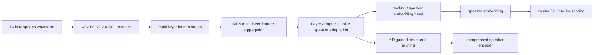
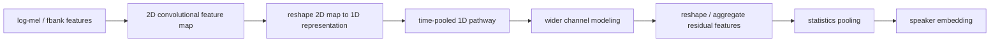
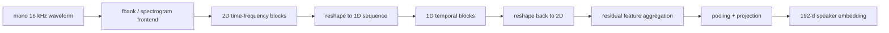
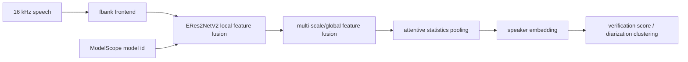
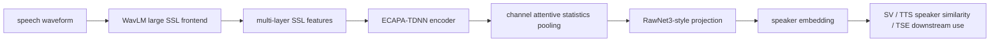

# Speaker Embedding 提取 SOTA Research

生成日期：2026-05-14  
检索范围：2024-2026 年 speaker embedding extraction / speaker verification / speaker recognition 方向的论文、官方代码、Hugging Face、ModelScope 与项目页。  
用户关心的 baseline：w2v-BERT 2.0、TDNN ECAPA / ECAPA-TDNN。

## 核验范围

本次重点核验了 2024-2026 年直接用于说话人嵌入提取的模型或工具链，不把普通 ASR encoder、TTS speaker encoder 或 diarization pipeline 中未单独报告 speaker verification 指标的模块列为 Top 方法。核验入口包括：

- 论文：arXiv、Interspeech / Apple ML Research 页面、论文摘要与公开 benchmark 页面。
- GitHub：官方项目仓库、README、模型加载方式、权重说明。
- Hugging Face：paper page、model repo、权重下载入口。
- ModelScope：官方模型页、3D-Speaker toolkit 中声明的模型 ID。
- baseline：检查是否直接对比 ECAPA-TDNN / ECAPA2 / ReDimNet / ERes2NetV2，以及是否直接涉及 w2v-BERT 2.0。

结论先说清楚：在 2024-2026 年范围内，w2v-BERT 2.0 + MFA/Adapter/LoRA/KD pruning 是当前公开数值最强的 speaker verification embedding 方案之一，但它本身也是用户指定 baseline；Fbank/CNN 类模型里，ReDimNet2 论文数值最强，ReDimNet 和 ERes2NetV2 的落地开源状态更稳。

## 排序规则

排序同时考虑五件事：

1. 是否直接做 speaker embedding extraction / speaker verification。
2. VoxCeleb1-O / Vox1-E / Vox1-H / CNCeleb 等公开指标强度。
3. 是否有官方代码。
4. 是否有官方权重或可直接加载的模型入口。
5. 是否适合在 Linux + CUDA 12.4 + Python 3.10.18 + torch 2.4.0 这类工程环境中落地。

因此，下面的总览表是“综合排名”，不是纯论文 EER 排名；后文会单独给出“复现/落地优先级”和“论文效果/技术价值优先级”。

## 总览表

| 排名 | 名称 | 年份 | 任务相关性 | GitHub | Hugging Face | ModelScope | 是否超过指定 baseline / 强基线 | 结论 |
|---:|---|---:|---|---|---|---|---|---|
| 1 | w2v-BERT 2.0 + MFA + Adapter/LoRA + KD Structured Pruning | 2025/2026 | 直接相关 | ✅ 官方代码 | ✅ 官方模型 | 未找到 | 明确超过 ECAPA-TDNN、CAM++、ReDimNet-B6、ERes2NetV2；它本身就是用户指定 w2v-BERT 2.0 baseline 的最强实现 | 论文效果第一，显存/算力成本高 |
| 2 | ReDimNet2 | 2026 | 直接相关 | 未找到官方代码 | 未找到官方模型 | 未找到 | 论文报告超过 ReDimNet；未超过 w2v-BERT 2.0 | Fbank 轻量 CNN 路线的强论文，但落地证据不足 |
| 3 | ReDimNet | 2024 | 直接相关 | ✅ 官方代码 | ✅ 官方 Paper | 未找到 | 明确超过传统 ECAPA-TDNN；未超过 w2v-BERT 2.0 | 当前最值得工程试用的轻量高性能 embedding 模型之一 |
| 4 | ERes2NetV2 / 3D-Speaker | 2024 | 直接相关 | ✅ 官方代码 | 未找到官方模型 | ✅ 官方模型 | 明确超过 3D-Speaker 内 ECAPA-TDNN；未超过 w2v-BERT 2.0 | ModelScope 落地最方便，中文/多域业务优先 |
| 5 | ESPnet-SPK WavLM-ECAPA joint | 2024 | 直接相关 | ✅ 官方代码入口 | ✅ 官方模型 | 未找到 | 明确强于常规 ECAPA 复现；未超过 w2v-BERT 2.0 | 适合研究复现、下游 TTS/声音相似度评估 |

## Top 方法深度解析

### [1] w2v-BERT 2.0 + MFA + Adapter/LoRA + KD Structured Pruning

- 论文：[Enhancing Speaker Verification with w2v-BERT 2.0 and Knowledge Distillation guided Structured Pruning](https://arxiv.org/abs/2510.04213)
- GitHub：[ZXHY-82/w2v-BERT-2.0_SV](https://github.com/ZXHY-82/w2v-BERT-2.0_SV)
- Hugging Face：GitHub README 中给出 `facebook/w2v-bert-2.0` 预训练权重与多组训练后模型下载链接；论文页可从 arXiv 进入。
- ModelScope：未找到可信官方 ModelScope 镜像。
- 开源结论：代码+模型已开源。
- baseline / 强基线判断：论文摘要报告 Vox1-O / Vox1-H 分别达到 0.12% / 0.55% EER，并说明代码和模型已发布；GitHub README 的模型表给出 VoxCeleb2 + VoxBlink2 训练配置下 0.14% Vox1-O EER。对比表覆盖 ECAPA-TDNN、CAM++、ReDimNet-B6、ERes2NetV2、ResNet293、HuBERT/WavLM/UniSpeech-SAT 等强基线。它不是“超过 w2v-BERT 2.0 baseline”，而是把 w2v-BERT 2.0 作为 speaker embedding backbone 的最强公开路线。
- 技术方案：用约 600M 参数的 w2v-BERT 2.0 提取多层 SSL 表征；用 MFA 聚合多层特征；用 Layer Adapter 和 LoRA 做参数高效适配；最后用知识蒸馏指导结构化剪枝，把超大 SSL speaker encoder 压到更适合部署的尺寸。
- 信号流：

- 实验结果：arXiv 摘要写明 Vox1-O 0.12% EER、Vox1-H 0.55% EER，并报告 80% model size reduction 后仅 0.04% EER degradation。GitHub README 的公开权重表给出多个训练阶段和 LMFT 配置，其中 VoxCeleb2 + VoxBlink2 的 LoRA_Adapter_MFA LMFT 配置报告 Vox1-O 0.14%、Vox1-E 0.31%、Vox1-H 0.73%。
- 毒舌点评：效果很强，但这不是一个轻巧的 speaker embedding extractor。它把“大 SSL 模型 + 参数高效微调 + 剪枝”都堆上了，工程复杂度、训练资源、依赖版本和上线成本都高于 Fbank CNN 系列。若只是业务上抽 embedding 做相似度，先上它容易被算力和依赖链反噬。
- 为什么值得看：这是 2025/2026 年最直接把 w2v-BERT 2.0 打到 speaker verification SOTA 的路线；如果你的目标是极限效果或做大模型 speaker representation 研究，它是第一优先级。

### [2] ReDimNet2

- 论文：[ReDimNet2: Scaling Speaker Verification via Time-Pooled Dimension Reshaping](https://arxiv.org/abs/2603.11841)
- GitHub：未找到官方代码。
- Hugging Face：找到 [Hugging Face paper page](https://huggingface.co/papers?q=VoxCeleb1-O) 收录论文信息；未找到官方模型 repo。
- ModelScope：未找到可信官方 ModelScope 镜像。
- 开源结论：未找到官方代码；未找到官方模型。
- baseline / 强基线判断：论文摘要报告 ReDimNet2-B6 在 Vox1-O 达到 0.287% EER，较 ReDimNet 提升，并且以 12.3M 参数、13 GMACS 改善成本-效果 Pareto frontier。公开 benchmark 页面显示它未超过 w2v-BERT 2.0，但明显强于多数 Fbank-only 中小模型。
- 技术方案：继承 ReDimNet 的 1D/2D 维度重塑思想，在 1D pathway 中引入 time-pooled dimension reshaping，让 1D 特征在降低时间分辨率后仍保持由 2D 特征重塑而来的性质，从而能更激进地扩宽 channel 而不线性增加计算量。
- 信号流：

- 实验结果：arXiv 摘要给出七档模型 B0-B6，参数量 1.1M 到 12.3M，计算量 0.33 到 13 GMACS；B6 报告 Vox1-O 0.287% EER。公开 benchmark 中 W2V-BERT 2.0 仍以更低 EER 领先，但 ReDimNet2 的参数和算力规模明显更工程友好。
- 毒舌点评：论文数值很漂亮，但开源证据弱。没有官方代码/权重时，落地价值只能排在 ReDimNet、3D-Speaker 后面。它更适合作为下一代自研结构参考，而不是立即投产。
- 为什么值得看：它回答了一个关键工程问题：不用 600M SSL 模型，Fbank CNN 路线还能不能继续逼近 SOTA。答案是能，但需要等开源落地。

### [3] ReDimNet

- 论文：[Reshape Dimensions Network for Speaker Recognition](https://arxiv.org/abs/2407.18223)
- GitHub：[IDRnD/redimnet](https://github.com/IDRnD/redimnet)
- Hugging Face：[paper page](https://huggingface.co/papers/2407.18223)；未找到官方 HF model repo，官方权重通过 GitHub release / torch.hub 提供。
- ModelScope：未找到可信官方 ModelScope 镜像。
- 开源结论：代码+模型已开源。
- baseline / 强基线判断：官方 README 明确是 Interspeech 2024 论文官方 PyTorch 实现，并提供 `torch.hub.load` 加载预训练模型；论文摘要说明在 speaker recognition 上达到 SOTA，同时降低参数量和计算量。公开榜单中 ReDimNet-B6_SF2 在 VoxCeleb1-O cleaned original 上报告 0.37% EER。它明显强于传统 ECAPA-TDNN，但不超过 w2v-BERT 2.0。
- 技术方案：在 2D spectrogram feature map 与 1D signal representation 之间反复 reshape，把 2D 局部时频建模与 1D 时序建模放进同一套残差聚合框架中，并保持 channel-time-frequency 体积一致，便于跨块残差聚合和多尺度扩展。
- 信号流：

- 实验结果：官方仓库说明模型规模从 1M 到 15M 参数、0.5 到 20 GMACs，并提供 b0、b1、b2、b3、b5、b6 等权重；README 的示例输出 embedding shape 为 `[N, 192]`。论文与榜单均显示它在 CNN/Fbank 路线里处于强档。
- 毒舌点评：这是当前最务实的一类方案。缺点是对中文业务、多设备场景的官方模型覆盖不如 3D-Speaker；如果没有自有验证集，只看 VoxCeleb 指标会高估线上稳健性。
- 为什么值得看：如果你要在生产里抽 speaker embedding，又不想背一个 w2v-BERT 2.0 级别的大模型，ReDimNet 是 Top 级候选。

### [4] ERes2NetV2 / 3D-Speaker

- 论文：[ERes2NetV2: Boosting Short-Duration Speaker Verification Performance with Computational Efficiency](https://arxiv.org/abs/2406.02167)
- GitHub：[modelscope/3D-Speaker](https://github.com/modelscope/3D-Speaker)
- Hugging Face：未找到官方 HF model repo；有非官方空间/镜像引用 3D-Speaker 代码，未作为官方模型证据。
- ModelScope：[iic/speech_eres2netv2_sv_zh-cn_16k-common](https://modelscope.cn/models/iic/speech_eres2netv2_sv_zh-cn_16k-common)
- 开源结论：代码+模型已开源。
- baseline / 强基线判断：3D-Speaker 官方 README 的 benchmark 表显示 ECAPA-TDNN 在 VoxCeleb1-O 为 0.86% EER，ERes2NetV2 为 0.61% EER，ERes2Net-large 为 0.52% EER；ERes2NetV2 论文摘要也报告 VoxCeleb1-O full-duration 0.61%、3s 0.98%、2s 1.48% EER。未超过 w2v-BERT 2.0。
- 技术方案：在 ERes2Net 的 local/global feature fusion 基础上增强短语音表征能力，同时剪除冗余结构降低参数和计算；3D-Speaker 把它封装为 speaker verification / diarization 可用的预训练模型。
- 信号流：

- 实验结果：官方 3D-Speaker 页面列出 Res2Net、ResNet34、ECAPA-TDNN、ERes2Net-base、CAM++、ERes2NetV2、ERes2Net-large 的 VoxCeleb/CNCeleb/3D-Speaker benchmark；ERes2NetV2 在 CNCeleb 与 3D-Speaker 上也强于 ECAPA-TDNN，适合中文和多场景验证。
- 毒舌点评：纯 VoxCeleb 指标不是第一，但它的工程闭环最好之一：代码、训练 recipes、ModelScope 模型和中文场景 benchmark 都齐。对于国内业务，它比很多论文 SOTA 更像能马上用的东西。
- 为什么值得看：如果目标是“今天就要抽 embedding、跑中文业务验证、部署到 ModelScope/自建服务”，3D-Speaker 是最稳的落地入口。

### [5] ESPnet-SPK WavLM-ECAPA joint

- 论文：[ESPnet-SPK: Full Pipeline Speaker Verification Toolkit with Multiple Reproducible Recipes, Self-Supervised Front-Ends, and Off-the-Shelf Models](https://machinelearning.apple.com/research/espnet-spk)
- GitHub：[espnet/espnet](https://github.com/espnet/espnet)
- Hugging Face：[espnet/voxcelebs12_ecapa_wavlm_joint](https://huggingface.co/espnet/voxcelebs12_ecapa_wavlm_joint)
- ModelScope：未找到可信官方 ModelScope 镜像。
- 开源结论：代码+模型已开源。
- baseline / 强基线判断：Apple ML Research 页面说明 ESPnet-SPK 支持 speaker embedding extractors、self-supervised front-ends 和 off-the-shelf models，并报告 WavLM-ECAPA 在 Vox1-O 上 EER 0.39%。HF 模型卡给出 `espnet/voxcelebs12_ecapa_wavlm_joint`，结果表为 EER 0.394、minDCF 0.03797。未超过 w2v-BERT 2.0，但对普通 ECAPA-TDNN 是强升级。
- 技术方案：用 WavLM large 作为 SSL frontend，抽多层特征；后端使用 ECAPA-TDNN encoder、channel attentive statistics pooling 和 projection，把 SSL 表征转成 speaker embedding。ESPnet-SPK 同时提供训练、评估、下载模型和下游任务 recipes。
- 信号流：

- 实验结果：Apple 页面写明 ESPnet-SPK 有 30+ recipes、7 个 speaker verification recipes，并报告 WavLM-ECAPA Vox1-O 0.39% EER；HF 模型卡给出完整 ESPnet2 加载示例、训练配置和结果表。
- 毒舌点评：它更像一个研究和复现实验平台，不是单一最强模型。优点是 recipes 全、HF 模型规范；缺点是 ESPnet 依赖重，若只要一个轻量 embedding 服务，ReDimNet 或 3D-Speaker 更直接。
- 为什么值得看：对做 TTS speaker similarity、target speaker extraction、说话人相似度评测的人很有价值，因为 ESPnet-SPK 明确把 speaker embedding 从 ASV 扩展到多个下游任务。

## 复现/落地优先级

1. ERes2NetV2 / 3D-Speaker：代码、ModelScope 模型、中文/多域 benchmark 和推理脚本最完整，适合快速上线评测。
2. ReDimNet：官方代码和 torch.hub 权重清晰，模型轻，适合构建自有 embedding 服务。
3. ESPnet-SPK WavLM-ECAPA joint：HF 模型和 recipes 完整，适合研究复现和下游任务评测。
4. w2v-BERT 2.0 SV：效果强，但依赖、显存、训练和压缩复杂度高；适合高算力研究或极限指标路线。
5. ReDimNet2：论文价值高，但未找到官方代码/模型，不建议作为当前生产首选。

## 论文效果/技术价值优先级

1. w2v-BERT 2.0 + MFA + Adapter/LoRA + KD Structured Pruning：公开指标最强，代表 SSL foundation model speaker embedding 路线。
2. ReDimNet2：Fbank-only 轻量路线的最新强结果，展示了 CNN speaker encoder 仍有扩展空间。
3. ReDimNet：2024 年高性价比结构创新，1D/2D reshape 思路清楚且已有开源。
4. ERes2NetV2：短语音和中文多场景落地价值强，和 3D-Speaker 工具链结合紧。
5. ESPnet-SPK WavLM-ECAPA joint：工具链价值大于单模型创新，适合作为研究复现底座。

## 最终建议

如果目标是“speaker embedding 提取工具落地”，先做三组 AB：

1. 3D-Speaker ERes2NetV2：中文、多设备、多距离和 ModelScope 业务环境优先。
2. ReDimNet-B5/B6：英文/通用 speaker verification 与轻量服务优先。
3. ESPnet-SPK WavLM-ECAPA：需要 SSL frontend、TTS speaker similarity 或下游语音任务评估时优先。

如果目标是“追论文效果上限”，优先读 w2v-BERT 2.0 SV 和 ReDimNet2。w2v-BERT 2.0 SV 目前是最强效果路线，但它不适合作为低成本默认 embedding extractor；ReDimNet2 值得跟进开源状态，一旦官方权重发布，应立即补做复现。

对用户给定 baseline 的明确判断：

- 相比 TDNN ECAPA / ECAPA-TDNN：上述 Top 5 中除“ReDimNet2 开源不足”外，论文或官方页面均给出强于传统 ECAPA-TDNN 的证据。
- 相比 w2v-BERT 2.0：没有证据显示 ReDimNet2、ReDimNet、ERes2NetV2、ESPnet-SPK 超过 w2v-BERT 2.0 SV；w2v-BERT 2.0 SV 本身是当前效果上限参考，但工程成本最高。
