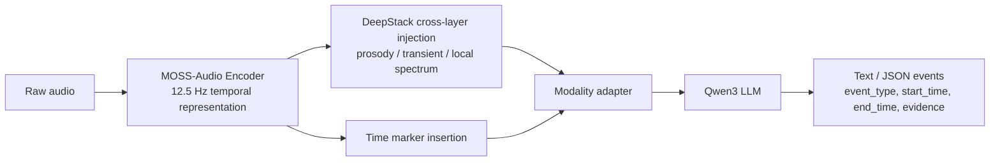
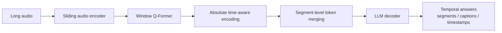
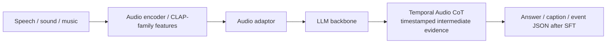
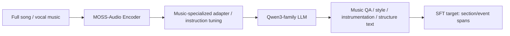
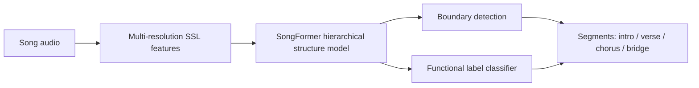
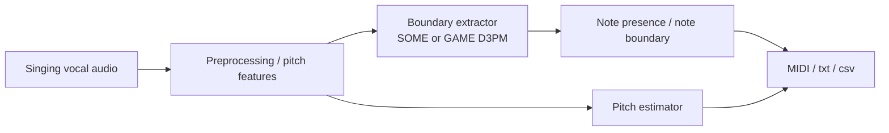
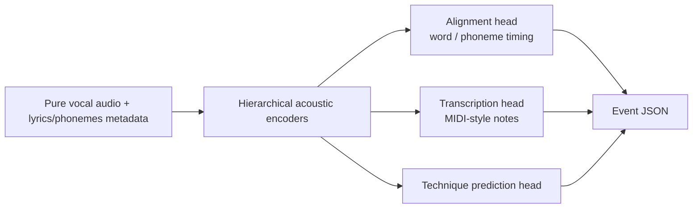
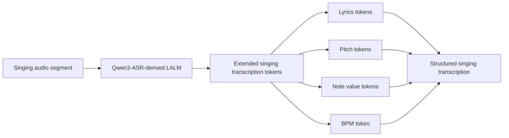
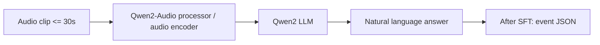
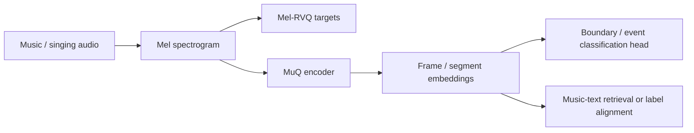

# Audio Event Detection and Segmentation SOTA Research

生成日期：2026-05-25

检索范围：2024-2026 年开源 audio / music / singing voice 大模型与专用模型，重点核验 GitHub、Hugging Face、ModelScope、项目页和论文页。任务目标是构建 audio 垂类大模型，用统一事件格式输出事件类别、起始时间、结束时间，并覆盖 music structure analysis、Singing-Oriented MIDI extraction、气口、重音、颤音等歌声/音乐事件。

用户关心的 baseline：ASLP-lab/SongFormer、openvpi/SOME。

结论先说：当前没有一个开源大模型能直接一次性稳定覆盖这五类业务。最合理的落地路线是“时间感知 Audio LLM 作为统一事件接口 + 音乐/歌声专用模型作为强监督教师或任务头”。其中 MOSS-Audio、TimeAudio、Audio Flamingo Next 更适合做统一底座或 SFT 起点；SongFormer、GAME/SOME、STARS、VocalParse 更适合承担结构分段、MIDI/音符、歌唱技巧事件的专用标注与蒸馏。

## 核验范围

已核验的核心来源：

- MOSS-Audio GitHub：https://github.com/OpenMOSS/MOSS-Audio
- MOSS-Audio 项目页：https://openmoss.github.io/MOSS-Audio/
- TimeAudio Hugging Face：https://huggingface.co/lysanderism/TimeAudio
- TimeAudio 论文页：https://arxiv.org/abs/2511.11039
- Audio Flamingo / AF2 / AF-Next GitHub：https://github.com/NVIDIA/audio-flamingo
- Audio Flamingo 2 论文页：https://huggingface.co/papers/2503.03983
- Audio Flamingo Next 论文页：https://arxiv.org/abs/2604.10905
- MOSS-Music ModelScope：https://modelscope.cn/models/openmoss/MOSS-Music-8B-Instruct
- SongFormer Hugging Face：https://huggingface.co/ASLP-lab/SongFormer
- SongFormer 论文页：https://arxiv.org/abs/2510.02797
- GAME GitHub：https://github.com/openvpi/GAME
- SOME GitHub：https://github.com/openvpi/SOME
- STARS GitHub：https://github.com/gwx314/STARS
- STARS 论文页：https://arxiv.org/abs/2507.06670
- VocalParse Hugging Face：https://huggingface.co/pymaster/VocalParse
- VocalParse 论文页：https://arxiv.org/abs/2605.04613
- Qwen2-Audio GitHub：https://github.com/QwenLM/Qwen2-Audio
- Qwen2-Audio Hugging Face：https://huggingface.co/Qwen/Qwen2-Audio-7B
- Kimi-Audio GitHub：https://github.com/MoonshotAI/Kimi-Audio
- Kimi-Audio 论文页：https://arxiv.org/abs/2504.18425
- MuQ GitHub：https://github.com/tencent-ailab/MuQ
- MuQ 论文页：https://huggingface.co/papers/2501.01108

## 排序规则

排序优先级如下：

1. 是否能直接输出或学习 `event_type / start_time / end_time`。
2. 是否已经具备时间定位、timestamp ASR、temporal grounding、long audio reasoning 设计。
3. 是否覆盖音乐/歌声，而不是只覆盖语音或环境声。
4. 是否官方开源代码、模型权重和训练/微调脚本。
5. 是否适合 SFT / LoRA / 全参微调。
6. 是否能在工业链路中部署、蒸馏或作为离线标注器。
7. 对 SongFormer、SOME/GAME 两个指定 baseline 的功能贴近程度。

## 总览表

| 排名 | 名称 | 年份 | 任务相关性 | GitHub | Hugging Face | ModelScope | 是否超过指定 baseline / 强基线 | 结论 |
|---:|---|---:|---|---|---|---|---|---|
| 1 | MOSS-Audio | 2026 | 高：统一音频理解、time-aware QA、event localization、timestamp ASR | ✅ 官方代码 | ✅ 官方模型 | ✅ 官方模型 | 不是 SongFormer/GAME 专项，但时间定位与 SFT 适配度强 | 最推荐做统一底座 |
| 2 | TimeAudio | 2025/2026 | 高：专门解决 LALM 时间定位与长音频理解 | ✅ 官方代码入口 | ✅ 官方模型/数据 | 未找到 | 时间定位任务强于通用 LALM，非音乐专项 | 最推荐做时间标记/数据格式参考 |
| 3 | Audio Flamingo Next / AF3 / AF2 | 2024-2026 | 中高：长音频、多任务 audio reasoning、Temporal Audio CoT | ✅ 官方代码 | ✅ 官方模型 | 未找到 | 长音频与 reasoning 强，边界检测需 SFT | 强通用底座，许可需重点复查 |
| 4 | MOSS-Music | 2026 | 中高：音乐理解专用 LALM | ✅ 官方代码入口 | ✅ 官方模型 | ✅ 官方模型 | 音乐 QA 强于通用音频模型，结构分段仍需专门 SFT | 推荐做音乐理解分支底座 |
| 5 | SongFormer | 2025 | 高：music structure analysis 直接命中 | ✅ 官方代码入口 | ✅ 官方模型/数据 | 未找到 | 这是本任务 MSA 子任务最强参考基线 | 结构分段教师模型 |
| 6 | GAME / SOME | 2024-2026 | 高：歌声转 MIDI、音符边界、pitch、duration | ✅ 官方代码 | 未找到官方模型 | 未找到 | GAME 是 SOME 后继，直接覆盖 MIDI 子任务 | MIDI 子任务首选专用模型 |
| 7 | STARS | 2025 | 中高：歌唱转写、音符时间定位、vocal technique prediction | ✅ 官方代码 | ✅ 官方模型 | 未找到 | 对气口/重音/颤音类技巧标签比通用 LLM 更接近 | 歌唱技巧事件教师模型 |
| 8 | VocalParse | 2026 | 中高：LALM 式歌声转写，输出歌词、pitch、note、BPM | ✅ 官方代码入口 | ✅ 官方模型 | 未找到 | 对 MIDI/歌声 token 化有价值，但不输出物理 note duration | 可作为 LALM-SVT 参考 |
| 9 | Qwen2-Audio | 2024 | 中：通用 audio chat / audio analysis，生态成熟 | ✅ 官方代码 | ✅ 官方模型 | ✅ 官方模型/Space | 不直接做边界，但 SFT 生态和 ModelScope 可用性强 | 工程保底底座 |
| 10 | MuQ / MuQ-MuLan | 2025 | 中：音乐表征与 music-text embedding，适合做帧级/片段级特征 | ✅ 官方代码 | ✅ 官方模型 | 未找到 | 不是 LALM，不能直接替代 SongFormer/GAME | 推荐做专用头特征编码器 |

## Top 方法深度解析

### [1] MOSS-Audio

- 论文：MOSS-Audio Technical Report，GitHub 技术报告形式，2026。
- GitHub：https://github.com/OpenMOSS/MOSS-Audio
- Hugging Face：OpenMOSS-Team/MOSS-Audio-4B/8B Instruct/Thinking 系列。
- ModelScope：官方表格列出 4B/8B Instruct/Thinking 的 ModelScope 入口。
- 开源结论：代码+模型已开源；官方 README 明确提供 LoRA 和全参微调入口。
- baseline / 强基线判断：不是 SongFormer 或 GAME 的专项替代品，但它是当前最贴近“统一事件检测 + 时间定位 + 可 SFT”的开源底座。官方描述覆盖 word/sentence timestamp ASR、key acoustic events、environmental sound、music understanding、time-aware QA。
- 技术方案：专用 audio encoder 将原始音频编码为 12.5 Hz 连续时间表示，adapter 投影到 Qwen3 LLM embedding 空间，LLM 自回归输出文本。DeepStack 跨层注入保留低层 prosody、transient、time-frequency 细节；time-marker token 在预训练阶段显式注入时间位置。
- 信号流：

- 实验结果：官方 README 给出 8B-Thinking 在 general audio benchmark 平均 71.08，并在 MMAU、MMAU-Pro、MMAR、MMSU 中超过多种开源模型；timestamp ASR 表格中 8B-Instruct 在 AISHELL-1 和 LibriSpeech 的 AAS 显著优于 Qwen3-Omni 与 Gemini-3.1-Pro。
- SFT 判断：强推荐。官方 `finetune/finetune.py` 支持 LoRA 和全参训练，数据格式是 audio-text conversations，可直接适配统一 JSON 事件输出。
- 毒舌点评：这是目前最像你要的“音频事件大模型底座”的开源项目。短板也清楚：官方没有证明它能直接做 SongFormer 级结构边界、GAME 级 note boundary 或颤音/气口边界，必须喂领域数据 SFT。
- 为什么值得看：如果只选一个底座开干，MOSS-Audio 是首选；它至少把“时间意识 + 开源权重 + 微调脚本 + 工程部署”这四件事同时放在桌面上。

### [2] TimeAudio

- 论文：https://arxiv.org/abs/2511.11039；AAAI 2026 版本题名为 Listening Between the Frames。
- GitHub：https://github.com/lysanderism/TimeAudio
- Hugging Face：https://huggingface.co/lysanderism/TimeAudio
- ModelScope：未找到可信官方 ModelScope 镜像。
- 开源结论：代码+模型已开源；FTAR 数据集也在 Hugging Face 发布。
- baseline / 强基线判断：TimeAudio 专门解决通用 LALM 时间戳理解差的问题，直接对齐本任务的“事件起止时间”核心痛点；但它不是音乐结构或 MIDI 专项模型。
- 技术方案：基于 SALMONN 架构，加入 temporal markers、absolute time-aware encoding、segment-level token merging。目标是把音频语义和绝对时间绑定起来，支持 temporal grounding、dense captioning、timeline summarization。
- 信号流：

- 实验结果：论文与 HF 页面强调在 dense captioning、temporal grounding、timeline speech summarization 上取得强结果，并构建 FTAR 数据集。公开页面未把所有关键数值直接列出，复现实验需读 PDF 与代码。
- SFT 判断：推荐作为时间定位架构参考，不推荐直接作为唯一工业底座。它依赖 Whisper large-v2、BEATs、Vicuna 7B 等较旧组合，官方推理提示要求大于 40GB GPU，工程栈不如 MOSS-Audio 简洁。
- 毒舌点评：TimeAudio 的论文问题抓得准：通用 LALM 会说“发生了什么”，但经常不知道“什么时候发生”。缺点是架构工程味偏研究原型，拿来生产要先重构。
- 为什么值得看：它最适合指导你的统一事件格式、time token 设计、长音频切窗合并和 temporal grounding 评测。

### [3] Audio Flamingo Next / AF3 / AF2

- 论文：AF2 https://huggingface.co/papers/2503.03983；AF-Next https://arxiv.org/abs/2604.10905。
- GitHub：https://github.com/NVIDIA/audio-flamingo
- Hugging Face：nvidia/audio-flamingo、nvidia/audio-flamingo-2、nvidia/audio-flamingo-3-hf、nvidia/audio-flamingo-next-hf、nvidia/music-flamingo-hf 等。
- ModelScope：未找到可信官方 ModelScope 镜像。
- 开源结论：代码+模型已开源；部分模型许可证不是宽松商用，需要上线前单独法务复查。
- baseline / 强基线判断：AF2 在 20+ audio benchmarks 和 long audio 上是强通用基线；AF-Next 引入 Temporal Audio Chain-of-Thought，方向上接近“带时间证据的事件解释”。但它没有直接给 SongFormer/GAME 式结构化边界标签。
- 技术方案：Audio Flamingo 系列把 audio encoder、audio-text alignment、LLM decoder、合成 QA/long-audio 数据和 curriculum learning 组合起来；AF-Next 进一步支持最长 30 分钟音频和 timestamp-grounded CoT。
- 信号流：

- 实验结果：AF2 论文声明以 3B language model 在 20+ benchmarks 上超过开源和闭源模型，并通过 LongAudio/LongAudioBench 扩展到 30 秒到 5 分钟音频；AF-Next 论文进一步声明支持 30 分钟长音频和 timestamp-grounded reasoning。
- SFT 判断：推荐作为强通用底座或 teacher。实际工业微调前需要确认许可证、训练脚本成熟度、GPU 预算和 HF checkpoint 格式。
- 毒舌点评：NVIDIA 这条线的研究强度高，benchmark 漂亮，但对你最关键的“帧级/音符级边界”仍然不够直接。拿它当万能分割器会翻车，拿它当 reasoning teacher 和长音频语义底座更现实。
- 为什么值得看：如果业务里除了歌声事件，还会扩到泛音频 QA、复杂场景音和长音频总结，它是 MOSS-Audio 外最值得跟的通用路线。

### [4] MOSS-Music

- 论文：当前以模型页和 MOSS-Audio 家族说明为主。
- GitHub：https://github.com/OpenMOSS/MOSS-Audio
- Hugging Face：OpenMOSS-Team/MOSS-Music-8B-Instruct / Thinking。
- ModelScope：https://modelscope.cn/models/openmoss/MOSS-Music-8B-Instruct
- 开源结论：模型已开源；官方代码入口沿用 MOSS-Audio 家族。
- baseline / 强基线判断：比 MOSS-Audio 更贴近 music / song understanding，但公开信息没有证明它直接超过 SongFormer 的结构边界指标。
- 技术方案：继承 MOSS-Audio 的 encoder-adapter-LLM 模块化结构，面向 full-track musical QA、long-form analysis 和 music understanding 做任务适配。
- 信号流：

- 实验结果：公开 ModelScope/HF 页面强调音乐理解、长曲目 QA 和分析能力；未找到 SongFormer-style HR.5F/HR3F 结构边界数值。
- SFT 判断：推荐作为音乐理解分支底座，尤其是要把 intro/verse/chorus/bridge 解释成自然语言加结构化 JSON 时。若只做严格边界，仍应让 SongFormer 做教师。
- 毒舌点评：它比通用音频模型更懂音乐，但“懂音乐”不等于“能切准 chorus 起点”。没有结构边界 benchmark 前，不能把它当 SongFormer 替代品。
- 为什么值得看：它可能是 MOSS-Audio 与 SongFormer 之间的桥：一个能说音乐语言、另一个能切结构边界。

### [5] SongFormer

- 论文：https://arxiv.org/abs/2510.02797
- GitHub：官方入口由 Hugging Face 和论文页链接到 ASLP-lab/SongFormer。
- Hugging Face：https://huggingface.co/ASLP-lab/SongFormer
- ModelScope：未找到可信官方 ModelScope 镜像。
- 开源结论：代码+模型/数据已开源。
- baseline / 强基线判断：这是 music structure analysis 子任务最直接的强基线。论文页声明在 SongFormBench 上设置 strict boundary detection HR.5F 新 SOTA，并有最高 functional label accuracy。
- 技术方案：用多分辨率自监督表示和 heterogeneous supervision 做歌曲结构分析，输出结构段边界和功能标签。它不是 LLM，但在这一个子任务上比通用 LALM 靠谱。
- 信号流：

- 实验结果：SongFormBench 上 strict boundary detection HR.5F 新 SOTA，functional label accuracy 最高，并在相关指标上超过强 baseline 和 Gemini 2.5 Pro。
- SFT 判断：不适合作为统一 LLM 底座，但非常适合作为结构分段教师、伪标注器和评测 baseline。可把输出转成统一事件 JSON 蒸馏给 MOSS-Audio / MOSS-Music。
- 毒舌点评：这就是专业模型碾压通用大模型的典型案例。你要的是结构分段准确率，不是让 LLM 编一段乐评。
- 为什么值得看：你的 a 子任务直接对标它；没有它做 teacher，统一模型的 MSA 部分大概率会变成“看起来合理、边界很飘”的文本生成。

### [6] GAME / SOME

- 论文：项目以工程开源为主；SOME/GAME 是 OpenVPI 歌声转 MIDI 工具链。
- GitHub：https://github.com/openvpi/GAME；https://github.com/openvpi/SOME
- Hugging Face：未找到官方 Hugging Face 模型仓库。
- ModelScope：未找到可信官方 ModelScope 镜像。
- 开源结论：仅代码已开源；GAME GitHub releases 提供版本发布，SOME README 指向 releases 下载预训练模型。
- baseline / 强基线判断：SOME 是用户指定 baseline；GAME 是 SOME 的升级后继，直接覆盖 singing voice to MIDI / note boundary / pitch / duration。
- 技术方案：SOME 将歌声音频转为 MIDI sequence，强调 low-resource training 和非整数 MIDI pitch；GAME 引入 generative boundary extraction、adaptive architecture、D3PM、可调边界阈值、噪声/混响/伴奏鲁棒性、多语言支持。
- 信号流：

- 实验结果：SOME README 给出 CPU/GPU 速度和 3 小时自定义训练数据可用的工程说明；GAME README 强调 boundary quality-speed tradeoff、鲁棒性和 word-note alignment。未找到公开论文式统一 benchmark 数值。
- SFT 判断：不适合直接 SFT LLM；适合做 MIDI 子任务的教师模型、数据生成器和后处理器。可把 MIDI note_on/note_off 转成 `event_type=note` 的统一事件序列，再蒸馏给大模型。
- 毒舌点评：如果目标是 MIDI，别先拿大模型玄学微调。先用 GAME/SOME 产出可用 note boundaries，再让 LLM 学格式和纠错。
- 为什么值得看：你的 b 子任务就是它的主场；统一模型短期内很难无监督学出同级 note boundary。

### [7] STARS

- 论文：https://arxiv.org/abs/2507.06670
- GitHub：https://github.com/gwx314/STARS
- Hugging Face：官方 README 指向 Hugging Face checkpoints。
- ModelScope：未找到可信官方 ModelScope 镜像。
- 开源结论：代码+模型已开源；GitHub README 明确包含 full implementation 和 pretrained checkpoints。
- baseline / 强基线判断：不是 SongFormer/GAME 替代品，但对“气口/重音/颤音”等 vocal technique event 的工程价值很高。它输出 phoneme/word alignment、MIDI-style note sequence、singing technique prediction 和 global style classification。
- 技术方案：层级声学特征处理，跨 frame、word、phoneme、note、sentence 层级建模；非自回归 local acoustic encoders 学结构化表示；推理需要规范 metadata，可自动预测 word/phoneme durations。
- 信号流：

- 实验结果：论文声明在转写、对齐、style annotation 多维评估上超过既有自动歌唱标注方法，并能提升 SVS 训练的自然度和风格控制。公开摘要未列出所有关键数值，需读 PDF 表格复核。
- SFT 判断：推荐作为歌唱技巧事件教师模型，不推荐直接做统一大模型底座。它的推理依赖歌词/音素 metadata，对任意未知歌曲需要先接 ASR/lyrics alignment。
- 毒舌点评：STARS 比通用 LLM 更像“能干活的歌声标注器”，但输入假设更强。没有歌词/音素时，它不是一键万能检测器。
- 为什么值得看：气口、重音、颤音这类事件缺少大规模开源强标注，STARS 至少提供了技术路线和可训练工程骨架。

### [8] VocalParse

- 论文：https://arxiv.org/abs/2605.04613
- GitHub：https://github.com/pymaster17/VocalParse
- Hugging Face：https://huggingface.co/pymaster/VocalParse
- ModelScope：未找到可信官方 ModelScope 镜像。
- 开源结论：代码+模型已开源。
- baseline / 强基线判断：它是 LALM 方向的 singing voice transcription，和 SOME/GAME 一样处理 pitch/note，但输出格式是 autoregressive token sequence，更接近“用大模型统一表达歌声事件”的目标。
- 技术方案：从 Qwen3-ASR-1.7B fine-tune，扩展 AST token vocabulary，把歌词、pitch、note value、BPM 编成结构化 token 序列。评价用两阶段 Needleman-Wunsch alignment，先对歌词，再对 pitch/note pair。
- 信号流：

- 实验结果：模型卡列出 CER、Pitch MAE、Note MAE、BPM MAE 作为指标；限制中明确主要训练于中文歌声、长于 30 秒的音频需要预分段、当前 checkpoint 不预测 physical note durations。
- SFT 判断：推荐作为“大模型输出音乐 token”的参考，而不是现成 MIDI 生产模型。若要业务可用，需要补 note onset/offset duration 标注。
- 毒舌点评：方向很对，但限制写得也很诚实：没有物理时长，就离你的“起止时间”还差关键一步。
- 为什么值得看：它说明 Qwen 系 ASR/LALM 可以被改造成歌声结构 token 生成器，适合借鉴 tokenizer 和训练范式。

### [9] Qwen2-Audio

- 论文：https://arxiv.org/abs/2407.10759
- GitHub：https://github.com/QwenLM/Qwen2-Audio
- Hugging Face：https://huggingface.co/Qwen/Qwen2-Audio-7B
- ModelScope：https://modelscope.cn/models/qwen/Qwen2-Audio-7B
- 开源结论：代码+模型已开源，Hugging Face 和 ModelScope 均有官方模型入口。
- baseline / 强基线判断：不直接输出事件边界，但 audio analysis、music chat、sound understanding、ModelScope 可用性和 transformers 集成成熟。适合做工程保底底座。
- 技术方案：音频 encoder 接入 Qwen LLM，支持 voice chat 和 audio analysis 两种交互模式。官方提醒模型在 30 秒以内音频上表现最佳。
- 信号流：

- 实验结果：官方 GitHub/HF 页面列出 ASR、S2TT、SER、VSC、AIR-Bench 等任务评测；例如 VSC VocalSound ACC 约 0.939，AIR-Bench 覆盖 speech/sound/music/mixed-audio chat。
- SFT 判断：可行但不是最佳。优点是生态成熟、ModelScope 友好；缺点是原生时间定位能力弱、推荐音频长度短。
- 毒舌点评：Qwen2-Audio 是好用的通用底座，不是专业分割器。拿它做第一版 demo 可以，拿它当唯一 SOTA 方案不够硬。
- 为什么值得看：如果 MOSS-Audio 新项目工程稳定性还没达到生产要求，Qwen2-Audio 是最稳的回退路线。

### [10] MuQ / MuQ-MuLan

- 论文：https://huggingface.co/papers/2501.01108
- GitHub：https://github.com/tencent-ailab/MuQ
- Hugging Face：OpenMuQ/MuQ-large-msd-iter、OpenMuQ/MuQ-MuLan-large 等。
- ModelScope：未找到可信官方 ModelScope 镜像。
- 开源结论：代码+模型已开源。
- baseline / 强基线判断：不是 LALM，也不能直接输出事件起止时间；但它是音乐表征强编码器，适合支撑结构分段、重音、颤音等 frame/segment-level 分类头。
- 技术方案：用 Mel Residual Vector Quantization 做 self-supervised music representation learning；MuQ-MuLan 进一步做 music-text contrastive embedding。
- 信号流：

- 实验结果：论文页声明 MuQ 在多种 MIR 下游任务中超过既有自监督音乐表示模型，MuQ-MuLan 在 MagnaTagATune zero-shot music tagging 上达到 SOTA。
- SFT 判断：不做 LLM SFT，而是做 encoder fine-tune、linear probe、LoRA 或作为 SongFormer/STARS 类专用头的输入特征。
- 毒舌点评：它不能回答“副歌从几秒开始”，但它能给下游模型一个比原始 mel 更强的音乐表示。别把 encoder 当大模型接口，应该把它当强特征底座。
- 为什么值得看：如果要把重音、颤音、气口做成帧级检测器，MuQ/MERT 这类音乐 SSL 表征很可能比通用 audio LLM 的最后层 token 更可靠。

## 复现/落地优先级

1. MOSS-Audio：优先级最高。先用 LoRA 训练统一 JSON 事件格式，输出 `event_type / start_time / end_time / confidence / evidence`。子任务可以先用 SongFormer/GAME/STARS 生成伪标注。
2. SongFormer：MSA 子任务首选教师模型。先直接复现，建立结构边界评测，再蒸馏给统一模型。
3. GAME / SOME：MIDI 子任务首选专用链路。GAME 优先于 SOME，SOME 保留为用户指定 baseline。
4. STARS：气口/重音/颤音类歌唱技巧事件的数据生成与模型头参考。需要确认目标技巧标签集合是否覆盖业务定义。
5. TimeAudio：作为时间 token、长音频切窗、temporal grounding 数据格式的架构参考；若复现成本可接受，可做时间定位对照组。
6. Audio Flamingo Next / MOSS-Music：做长音频 music reasoning teacher 和音乐自然语言解释，不建议第一阶段承担严格边界。
7. VocalParse：做 LALM-style singing transcription 参考，适合补歌词/pitch/note token，但当前不够直接输出物理起止时间。
8. Qwen2-Audio：工程保底底座；适合快速 demo 和 ModelScope 部署，不适合做最终 SOTA 时间分割核心。
9. MuQ：作为音乐/歌声 frame embedding 编码器，支撑轻量检测头和融合模型。
10. Kimi-Audio / GAMA：可作为附加通用 audio reasoning 对照，不建议进入第一阶段核心链路。

## 论文效果/技术价值优先级

1. TimeAudio：技术价值最高，因为它正面解决 LALM 时间定位缺陷。
2. MOSS-Audio：综合技术和工程价值最高，尤其是 time-aware representation、DeepStack 注入和官方微调脚本。
3. Audio Flamingo Next：长音频 Temporal Audio CoT 和大规模 audio reasoning 数据值得跟进。
4. SongFormer：MSA 单任务效果价值最高，是 a 子任务硬基线。
5. GAME：MIDI 子任务工程价值最高，尤其是 generative boundary extraction 和 noisy vocal 鲁棒性。
6. STARS：歌唱技巧/风格标注方向最贴近 c/d/e 子任务。
7. VocalParse：LALM 统一歌声转写范式有启发，但输出物理时间仍不足。
8. MOSS-Music：音乐理解模型方向值得跟，但公开边界指标不足。
9. MuQ：音乐 SSL 表征强，适合作为局部检测模型基础。
10. Qwen2-Audio：生态价值大于任务专项价值。

## 最终建议

推荐采用三层架构：

1. 统一大模型层：MOSS-Audio 作为主底座，备选 Qwen2-Audio；训练输出统一事件 JSON。
2. 专用教师层：SongFormer 负责 structure；GAME/SOME 负责 MIDI note；STARS/VocalParse 负责歌声转写、技巧标签和对齐；MuQ 提供音乐帧级特征。
3. 评测与蒸馏层：把所有教师输出统一成 interval events，构造多任务 SFT 数据：`audio + task_prompt -> event_list`。对事件边界用 onset/offset tolerance、IoU/F1、segment label accuracy 评估；对 MIDI 用 pitch MAE、onset F1、duration MAE；对气口/重音/颤音先定义业务标签标准，否则模型会学到一堆不可解释的主观标签。

第一阶段不建议追求“一个大模型直接全做”。更稳的路线是先让专用模型产出可靠边界，再训练 MOSS-Audio 学统一接口。等统一接口稳定后，再尝试把 SongFormer/GAME/STARS 的中间表征或伪标注蒸馏进一个多任务 audio event detector。
