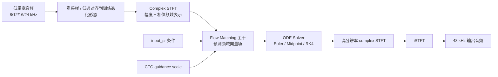
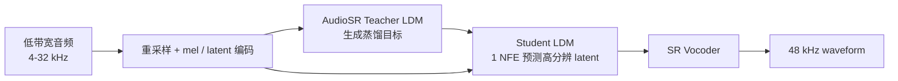
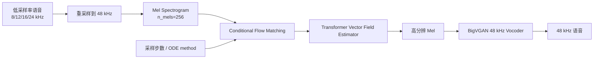
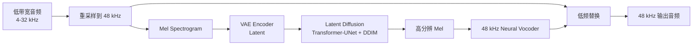
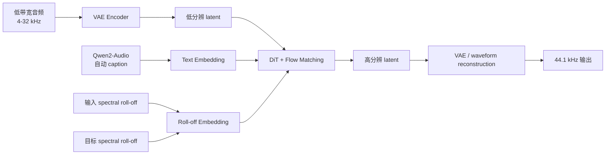
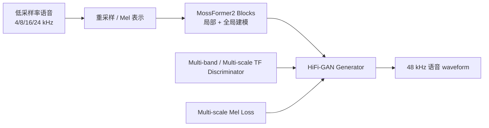

# 音频带宽扩展 / BWE SOTA Research

生成日期：2026-06-08  
检索范围：2021-2026，覆盖 audio bandwidth extension、audio super-resolution、speech super-resolution、audio restoration 中直接面向低采样率 / 低带宽音频恢复到 44.1 kHz 或 48 kHz 的方法。  
用户关心的 baseline：AudioSR。  
用户偏好：开源优先 / 模型可下载优先 / 工业落地优先。  

## 核验范围

本次核验了论文全文或项目材料、GitHub、Hugging Face、ModelScope、官方 demo / project page。重点候选包括 AudioSR、FlashSR、FLowHigh、SAGA-SR、UniverSR、HiFi-SR / MossFormer2_SR_48K、AudioLBM、NU-Wave2、VoiceFixer、AP-BWE。最终 Top 6 只保留与 BWE / audio SR 直接相关、且在 2021-2026 范围内有明确论文或工程证据的方法。

开源状态只按已核验的确定档位写，不使用模糊判断。其中 ModelScope 未找到可信官方镜像时，总览表统一写 `未找到`；详细说明放在单篇解析中。

## 排序规则

综合排序优先看三件事：是否直接做低带宽音频到高采样率恢复、是否相对 AudioSR 或强基线有明确提升、是否有官方代码 / 权重 / 可运行入口。用户明确偏好工业落地，所以纯论文指标强但未开源的方法不会排在可下载模型前面。

## 总览表

| 排名 | 名称 | 年份 | 任务相关性 | GitHub | Hugging Face | ModelScope | 是否超过指定 baseline / 强基线 | 结论 |
|---:|---|---:|---|---|---|---|---|---|
| 1 | UniverSR | 2026 | 泛音频 BWE / audio SR | ✅ 官方代码 | ✅ 官方模型 | 未找到 | 论文对比 AudioSR、FlashSR；8/12/16/24 kHz -> 48 kHz，主观 MOS 和多项高频指标领先 | 首选复现和落地路线，vocoder-free 省掉声码器工程坑 |
| 2 | FlashSR | 2025 | 泛音频 BWE / audio SR | ✅ 官方代码 | ✅ 官方模型 | 未找到 | 以 AudioSR 为 teacher，1 NFE，约 22 倍快；多任务客观指标接近或超过 AudioSR | 最适合把 AudioSR 做成可服务化低延迟系统 |
| 3 | FLowHigh | 2025 | 语音 BWE / audio SR | ✅ 官方代码 | 未找到官方模型 | 未找到 | 对比 AudioSR、NVSR、UDM+；VCTK 8/12/16/24 kHz -> 48 kHz 单步 flow matching 指标强 | 技术路线干净，但偏语音和外部 BigVGAN 依赖较重 |
| 4 | AudioSR | 2024 | 泛音频 BWE / audio SR | ✅ 官方代码 | ✅ 官方模型 | 未找到 | 指定 baseline；比 NVSR 在音乐 / 音效上强，speech 版在 24 kHz -> 48 kHz 强 | 必须保留的基准锚点，工程成熟但推理慢 |
| 5 | SAGA-SR | 2026 | 泛音频 BWE / audio SR | 未找到官方代码 | 未找到官方模型 | 未找到 | 论文对比 AudioSR、FlashSR，44.1 kHz 输出，声学 roll-off + 语义文本条件显著提升 | 论文技术价值很高，但未找到可复现入口，落地降权 |
| 6 | HiFi-SR / MossFormer2_SR_48K | 2025 | 语音 BWE / speech SR | ✅ 官方代码 | ✅ 官方模型 | 未找到 | 在 VCTK 4/8/16/24 kHz -> 48 kHz 上平均 LSD 0.82，优于 AudioSR-Speech / NVSR 等强基线 | 工业语音链路最稳的开源权重方案，但不是泛音频 |

## Top 方法深度解析

### [1] UniverSR

- 论文：[UniverSR: Unified and Versatile Audio Super-Resolution via Vocoder-Free Flow Matching](https://arxiv.org/abs/2510.00771)
- GitHub：[woongzip1/UniverSR](https://github.com/woongzip1/UniverSR)
- Hugging Face：[woongzip1/universr-audio](https://huggingface.co/woongzip1/universr-audio)，另有 speech-only 模型 `woongzip1/universr-speech`
- ModelScope：未找到可信官方 ModelScope 镜像
- 开源结论：代码+模型已开源。HF model card 明确给出 `UniverSR.from_pretrained("woongzip1/universr-audio")` 用法，并支持 `huggingface-cli download` 本地下载。
- baseline / 强基线判断：论文主表对比 AudioSR 和 FlashSR，覆盖 8/12/16/24 kHz 到 48 kHz。AudioSR 是用户指定 baseline，FlashSR 是 AudioSR 蒸馏后的强效率 baseline，比较是同任务强对比。

#### 技术方案

UniverSR 的核心问题是：传统 AudioSR / FlashSR 这类两阶段方案先生成高频 mel，再靠 vocoder 合成 waveform，声码器会引入上限和域外不稳定；UniverSR 改成在 complex STFT 域直接做 flow matching，最后用 iSTFT 回到波形，不再单独依赖 neural vocoder。

- 模型解决的问题：把 8/12/16/24 kHz 低带宽 speech/music/sound effect 恢复到 48 kHz。
- 输入：低采样率或 48 kHz 文件中实际带宽受限的音频，用户显式指定 `input_sr`。
- 输出：48 kHz waveform。
- 主干：complex STFT 域的 flow matching 生成器，带 ODE solver。
- 关键模块：STFT 表示、低带宽条件注入、complex 频域向量场预测、classifier-free guidance、iSTFT 重建。
- 关键设计：不用 vocoder，把高频生成和波形重建统一在频域轨迹里完成，减少“mel 预测不错但 vocoder 失真”的断层。
- 训练 / 推理策略：训练时将 48 kHz 音频按 8/12/16/24 kHz 分布退化，默认 8 kHz 占 70%；推理时可选 `euler / midpoint / rk4`，`ode_steps` 默认示例为 4，`guidance_scale` speech 推荐 1.0-1.5、music 推荐 1.5-2.0。

#### 信号流

#### 实验结果

论文使用 speech、music、sound effect 多域评测：speech 包括 VCTK，music 包括 FMA-small / URMP 等，sound effect 包括 ESC-50。目标采样率为 48 kHz，输入条件覆盖 8/12/16/24 kHz。论文表 1 对比 AudioSR 和 FlashSR，在多输入采样率下报告 LSD-HF 和 2f-model 指标，并给出 8 kHz -> 48 kHz 的 MOS 主观评测。论文结论是 Proposed 在多项 objective 指标上优于 AudioSR / FlashSR，MOS 也更高；HF model card 同时给出 general audio 与 speech-only 两个可下载模型。

#### 毒舌点评

这是本轮最值得先跑的方案。它不是继续给 AudioSR 换一个更快 sampler，而是把 vocoder 这层麻烦直接拿掉，工程链路更短。缺点也明显：论文年份新，工业稳定性需要自己压测，HF license 是 CC-BY-4.0，商业场景要再核法律边界。

#### 为什么值得看

如果你要做真实 BWE 服务，UniverSR 的价值在于“模型可下载 + API 简单 + 多域 + 不依赖额外 vocoder”。它比单纯论文 SOTA 更接近可复现起点。

### [2] FlashSR

- 论文：[FlashSR: One-step Versatile Audio Super-resolution via Diffusion Distillation](https://arxiv.org/abs/2501.10807)
- GitHub：[jakeoneijk/FlashSR_Inference](https://github.com/jakeoneijk/FlashSR_Inference)
- Hugging Face：[jakeoneijk/FlashSR_weights](https://huggingface.co/datasets/jakeoneijk/FlashSR_weights)
- ModelScope：未找到可信官方 ModelScope 镜像
- 开源结论：代码+模型已开源。论文和项目入口指向官方 inference 与权重；本地直接拉 README 时 GitHub raw 有 404 / 网络波动，但公开仓库与 HF 权重入口可检索到。
- baseline / 强基线判断：FlashSR 明确以 AudioSR 为 teacher LDM，比较 AudioSR 100 NFEs、AudioSR 8 NFEs、NVSR-ResUNet 等强基线。

#### 技术方案

FlashSR 解决 AudioSR 最大的工程痛点：AudioSR 默认 50 DDIM steps / 100 NFEs，论文报告在 A6000 上生成 5.12 秒音频约需 8.19 秒；FlashSR 通过 diffusion distillation 把采样压到 1 NFE，5.12 秒音频约 0.36 秒，约 22 倍快。

- 模型解决的问题：把任意 4-32 kHz 低带宽音频恢复到 48 kHz，同时避免 AudioSR 的慢推理。
- 输入：低采样率 waveform，经 AudioSR 式前处理得到低分辨 mel / latent。
- 输出：48 kHz waveform。
- 主干：Student LDM + SR Vocoder。
- 关键模块：AudioSR teacher、student LDM、distribution matching distillation、SR vocoder、multi-scale spectral / adversarial loss。
- 关键设计：保留 AudioSR 的多域能力，用蒸馏把高步数扩散变成单步生成，再用专门 SR vocoder 改善 waveform 合成。
- 训练 / 推理策略：训练数据包括 OpenSLR speech、MedleyDB、MUSDB18、MoisesDB、WavCaps 等；Student LDM 先从 AudioSR teacher 学，SR Vocoder 单独优化；推理时 1 NFE。

#### 信号流

#### 实验结果

论文在 VCTK speech、FMA-small music、ESC-50 sound effect 上评测，输入 cutoff 包括 4/8/12 kHz 等设置。客观指标报告 LSD / STFT-D，主观评测报告 MOS，并额外报告 real-time factor。关键证据是：FlashSR 在 1 NFE 下约 22 倍快于 AudioSR；论文称 speech SR 中除 12 kHz cutoff 的 STFT-D 外，FlashSR 在所有 metrics / cases 上超过 AudioSR 100 NFEs；music SR 全 cutoff setting 达到 SOTA；sound effect 在 4 kHz 和 12 kHz cutoff 下超过 AudioSR 100 NFEs。

#### 毒舌点评

FlashSR 的亮点不是“又一个 SR 模型”，而是把 AudioSR 从论文 demo 拉向服务化。它的问题是仍然继承 AudioSR 的 latent/vocoder 两段式复杂度，工程上比 UniverSR 多一层维护面；但如果你的现有 baseline 已经是 AudioSR，FlashSR 是最自然的提速路线。

#### 为什么值得看

用户点名 AudioSR，FlashSR 正是“AudioSR 之后怎么做快”的直接答案。要做在线或批量处理，22 倍推理速度提升比小数点后 LSD 提升更有业务价值。

### [3] FLowHigh

- 论文：[FLowHigh: Towards Efficient and High-Quality Audio Super-Resolution with Single-Step Flow Matching](https://arxiv.org/abs/2501.04926)
- GitHub：[jjunak-yun/FLowHigh_code](https://github.com/jjunak-yun/FLowHigh_code)
- Hugging Face：未找到官方 Hugging Face 模型
- ModelScope：未找到可信官方 ModelScope 镜像
- 开源结论：代码已开源，README 给出训练、推理命令和 Google Drive 预训练 checkpoint；未找到官方 HF / ModelScope 镜像。严格按平台核验档位写作时，HF 是未找到官方模型，但项目 README 的 Google Drive checkpoint 可作为工程补充。
- baseline / 强基线判断：论文对比 AudioSR、NVSR、UDM+、NU-Wave 系列等语音 SR 强基线，并强调单步采样。

#### 技术方案

FLowHigh 也是为了摆脱扩散多步采样，但路线不是 teacher-student distillation，而是直接用 conditional flow matching 学低带宽到高带宽的轨迹。它在 mel-spectrogram 层预测高分辨表示，再借助 48 kHz BigVGAN 还原 waveform。

- 模型解决的问题：语音 8/12/16/24 kHz 到 48 kHz 的快速 super-resolution。
- 输入：低采样率语音，重采样到 48 kHz 后提取 256-bin mel。
- 输出：48 kHz 语音 waveform。
- 主干：Transformer-based vector field estimator。
- 关键模块：conditional probability path、ODE solver、mel 频谱预测、BigVGAN 48 kHz vocoder。
- 关键设计：用 single-step flow matching 替代 diffusion 迭代采样，训练中学习从低分辨条件到高分辨 mel 的向量场。
- 训练 / 推理策略：VCTK 48 kHz，约 44 小时、108 个说话人；输入采样率包括 8/12/16/24 kHz；单 NVIDIA RTX A6000、batch size 128、400k steps；推理默认 `time_step=1`，可选 Euler / midpoint。

#### 信号流

#### 实验结果

论文在 VCTK 上评测 8/12/16/24 kHz -> 48 kHz，指标包括 LSD、LSD-LF、LSD-HF、ViSQOL、NFEs、RTF。论文结论是 FLowHigh 在 Table I 中对所有输入采样率取得最低 LSD 和最强高频 LSD-HF；在 24 kHz -> 48 kHz 时接近 ground-truth vocoder upper bound，LSD 差距约 0.04。效率方面，FLowHigh 用 1 NFE 就超过扩散模型 50/100 NFEs 的质量。

#### 毒舌点评

FLowHigh 是漂亮的研究方案，但不是我会第一个丢进生产的方案。它依赖 BigVGAN 路径和配置，README 推理命令很长，泛音频能力也没 AudioSR / UniverSR 那么直接。优点是训练和 checkpoint 交代得比很多新论文实在。

#### 为什么值得看

如果你关注“扩散之后 BWE 怎么做快”，FLowHigh 是比 FlashSR 更干净的 flow matching 思路；如果业务只做干净语音，它的性价比很高。

### [4] AudioSR

- 论文：[AudioSR: Versatile Audio Super-Resolution at Scale](https://arxiv.org/abs/2309.07314)
- GitHub：[haoheliu/versatile_audio_super_resolution](https://github.com/haoheliu/versatile_audio_super_resolution)
- Hugging Face：[haoheliu/audiosr_basic](https://huggingface.co/haoheliu/audiosr_basic)
- ModelScope：未找到可信官方 ModelScope 镜像
- 开源结论：代码+模型已开源。GitHub README 支持 `pip install audiosr==0.0.7`、命令行 `audiosr -i example/music.wav`，HF 模型卡为 Apache-2.0。
- baseline / 强基线判断：这是用户指定 baseline，也是 2024 之后大量 BWE 论文默认比较对象。它本身对比 NVSR，并在 speech / music / sound effect 上做 48 kHz SR。

#### 技术方案

AudioSR 的核心是把 audio SR 从语音专用扩展到泛音频：speech、music、sound effect 都能处理；输入采样率不固定，4-32 kHz 都能上采样到 48 kHz。它使用 latent diffusion 估计高分辨 mel，再用 HiFi-GAN vocoder 合成波形，并用低频替换保留原始低频内容。

- 模型解决的问题：任意音频类型、任意输入带宽到 48 kHz 的 super-resolution。
- 输入：4-32 kHz 低带宽音频。
- 输出：48 kHz waveform。
- 主干：latent diffusion model + Transformer-UNet。
- 关键模块：VAE latent、LDM、DDIM sampler、replacement-based post-processing、48 kHz neural vocoder。
- 关键设计：低频部分用原始输入替换，扩散模型主要补高频，减少生成模型篡改低频内容。
- 训练 / 推理策略：多域 48 kHz 数据训练，推理默认约 50 DDIM steps；提供 basic 和 speech 两种 checkpoint。

#### 信号流

#### 实验结果

论文 Table 1 在 VCTK speech、AudioStock music、ESC-50 sound effect 上做 48 kHz SR。VCTK 上 AudioSR-Speech 在 24 kHz -> 48 kHz 条件下 LSD 0.69，与 NVSR 0.70 接近并略优；music 上 AudioSR 在 3 个 cutoff 条件下 LSD 为 0.99 / 0.74 / 0.73，优于 NVSR-DNN 1.67 / 1.49 / 1.13 和 NVSR-ResUNet 1.70 / 1.34 / 0.95；ESC-50 上 AudioSR 为 1.74 / 1.57 / 1.35。论文也提醒 LSD 不总是等价于感知质量：ESC-50 4 kHz cutoff 时 NVSR-DNN LSD 2.84 低于 AudioSR 4.01，但主观质量不一定更好。

#### 毒舌点评

AudioSR 是必须读的 baseline，但不能迷信。它的泛化能力强，开源生态也成熟；短板是推理慢、对退化模式敏感。README 自己都提醒：如果输入是 MP3 cutoff 这种训练没见过的频谱洞，AudioSR 会翻车，需要先 low-pass filtering 做退化对齐。

#### 为什么值得看

它是这个方向的“工程基准线”。后续 FlashSR、SAGA-SR、UniverSR 基本都要和它说话；如果你没跑过 AudioSR，直接看新论文容易判断失真。

### [5] SAGA-SR

- 论文：[SAGA-SR: Semantically and Acoustically Guided Audio Super-Resolution](https://arxiv.org/abs/2509.24924)
- GitHub：未找到官方代码。官方项目页 JS bundle 只暴露作者主页和 arXiv 链接，未暴露 GitHub 链接。
- Hugging Face：未找到官方模型
- ModelScope：未找到可信官方 ModelScope 镜像
- 开源结论：未找到官方代码，未找到官方模型。论文摘要写有 sound examples and code for the model are available online，但本次核验官方项目页和搜索入口未找到实际代码 / 权重链接，因此不能按开源方案处理。
- baseline / 强基线判断：论文明确对比 AudioSR 和 FlashSR，使用 official implementations and checkpoints，因此实验对比对象合理。

#### 技术方案

SAGA-SR 的判断很简单：它抓住了 AudioSR / FlashSR 的一个关键弱点，生成高频并不等于生成“语义对齐”的高频。AudioSR 可能补出过强齿音，FlashSR 可能补不出细节谐波。SAGA-SR 用语义文本条件和 spectral roll-off 条件，让模型知道“该补什么声音”和“补到什么高频能量”。

- 模型解决的问题：speech / music / sound effect 的 4-32 kHz 到 44.1 kHz 泛音频 SR。
- 输入：低分辨音频、高分辨音频自动生成的文本 caption、输入 / 目标 spectral roll-off。
- 输出：44.1 kHz waveform。
- 主干：DiT backbone + flow matching objective。
- 关键模块：Qwen2-Audio caption 生成、text embedding、spectral roll-off embedding、cross-attention 条件注入、timestep 条件融合。
- 关键设计：文本条件负责语义合理性，roll-off 标量负责高频能量和可控性；目标 roll-off 可由用户调节，控制输出高频强弱。
- 训练 / 推理策略：约 3,800 小时音频，全部 resample 到 44.1 kHz，片段长度约 5.94 秒；STFT window 2048、hop 512，roll-off percentage 0.985；文本条件 10% dropout。

#### 信号流

#### 实验结果

论文在 VCTK speech、FMA / music、ESC-50 sound effect 等任务上评测，比较 AudioSR 和 FlashSR。客观指标包括 LSD、FD；主观指标为 1-5 分 MOS。论文 Table 1 称 SAGA-SR 在所有 test cases 上达到 SOTA，Table 2 中主观评分也最高。消融显示去掉 roll-off 会削弱频谱对齐，去掉 text embedding 会削弱 speech 语义和感知合理性。论文还明确观察到 AudioSR 输出容易出现过强齿音，FlashSR 容易缺少细节谐波。

#### 毒舌点评

技术上很聪明，开源上很尴尬。它解决的是 AudioSR / FlashSR 的真实问题，不是换 backbone 刷表；但没找到代码和权重，不能进复现优先队列。对研究判断有价值，对当前业务落地只能先观望。

#### 为什么值得看

SAGA-SR 给出一个很重要的方向：BWE 不该只预测频谱距离，而要让高频内容和语义一致。后续工业模型如果要减少“听起来像乱补高频”的问题，文本 / 音频语义条件值得借鉴。

### [6] HiFi-SR / MossFormer2_SR_48K

- 论文：[HiFi-SR: A Unified Generative Transformer-Convolutional Adversarial Network for High-Fidelity Speech Super-Resolution](https://arxiv.org/abs/2501.10045)
- GitHub：[modelscope/ClearerVoice-Studio](https://github.com/modelscope/ClearerVoice-Studio)
- Hugging Face：[alibabasglab/MossFormer2_SR_48K](https://huggingface.co/alibabasglab/MossFormer2_SR_48K)
- ModelScope：未找到可信官方 ModelScope 镜像
- 开源结论：代码+模型已开源。HF model card 明确写该权重由 ClearerVoice-Studio 提供，调用 `ClearVoice(task='speech_super_resolution', model_names=['MossFormer2_SR_48K'])` 会自动下载 Hugging Face 权重。
- baseline / 强基线判断：论文对比 Nu-wave、WSRGlow、NVSR、AudioSR 等 48 kHz speech SR baseline；但它是 speech-only，不是泛音频，任务相关性需降权。

#### 技术方案

HiFi-SR 面向高保真语音 SR，重点不是泛音频，而是在 speech 场景做统一端到端模型，避免 NVSR / AudioSR 分离模块带来的误差累积。模型将 MossFormer2 块和 HiFi-GAN generator 结合，通过对抗训练和多尺度 mel loss 直接生成高分辨语音。

- 模型解决的问题：低采样率 clean speech 到 48 kHz speech super-resolution。
- 输入：4/8/16/24 kHz 语音，训练时由 48 kHz 语音低通 / 降采样模拟。
- 输出：48 kHz 语音 waveform。
- 主干：MossFormer2 transformer-convolutional generator + reused HiFi-GAN generator。
- 关键模块：24 层 MossFormer2 block、multi-band / multi-scale time-frequency discriminator、multi-scale mel reconstruction loss。
- 关键设计：不把 mel 预测和 waveform 生成拆成两个独立模型，而是统一在 adversarial training 框架里优化。
- 训练 / 推理策略：VCTK 48 kHz 训练，100 个 speaker 训练、8 个 speaker 测试；另用 EXPRESSO 和 VocalSet 做 OOD 泛化；单 NVIDIA A800，batch size 16，500k steps。HF model card 提醒：当前 SR 模型面向 clean speech，noisy speech 推荐先跑 `MossFormer2_SE_48K` 再跑 SR。

#### 信号流

#### 实验结果

论文 Table 1 在 VCTK test set 上评测 4/8/16/24 kHz -> 48 kHz，指标为平均 LSD。HiFi-SR 平均 LSD 为 0.82，优于最接近的 NVSR 0.85；消融显示去掉 MBD 后平均 LSD 变为 0.83，去掉 multi-scale mel loss 后为 0.84。OOD 方面，EXPRESSO 和 VocalSet 上 HiFi-SR 均优于 NVSR；ABX 主观测试中，HiFi-SR 在四种输入采样率下偏好率均超过 52.50%。

#### 毒舌点评

这是语音业务最实际的兜底方案：权重可下载、ClearVoice API 清楚、限制也写得明白。它的问题同样明白：clean speech 专用，不要拿它去修音乐或复杂音效；noisy speech 还要先增强，这会增加链路延迟和误差。

#### 为什么值得看

如果你的 BWE 需求主要是语音通话、语音内容生产、语音修复，而不是音乐 / 音效泛音频，MossFormer2_SR_48K 比很多“泛音频 SOTA 论文”更值得先跑。

## 复现/落地优先级

1. UniverSR：首选。官方代码、HF 模型、`from_pretrained`、batch inference、local checkpoint 都给了；无 vocoder 依赖，适合先做端到端压测。
2. FlashSR：如果现有 baseline 是 AudioSR，优先做蒸馏提速对照；22 倍速度提升对服务化非常关键。
3. HiFi-SR / MossFormer2_SR_48K：语音业务优先跑。ClearerVoice-Studio 接口稳定，HF 权重可下载，但只建议 clean speech。
4. AudioSR：作为 baseline 必跑。它不是最快，但生态成熟，方便判断新模型是否真的超过 baseline。
5. FLowHigh：适合研究和语音专项复现；Google Drive checkpoint + BigVGAN 路径需要额外工程整理。
6. SAGA-SR：暂不建议业务复现。等官方代码 / 权重真实开放后再进入复现队列。

## 论文效果/技术价值优先级

1. SAGA-SR：语义 caption + spectral roll-off 条件是最有启发性的高频可控方向，虽然当前未开源。
2. UniverSR：vocoder-free flow matching 把模型链路从“mel 生成 + vocoder”改成直接频域生成，技术和工程价值都高。
3. FlashSR：把 AudioSR 蒸馏到单步，明确解决推理慢问题。
4. FLowHigh：single-step flow matching 对语音 SR 很干净，适合继续研究低 NFE 生成。
5. AudioSR：历史地位强，是泛音频 SR 的基准。
6. HiFi-SR：对 speech SR 很实用，但泛音频技术外推有限。

## 最终建议

如果目标是“音频带宽扩展 / BWE 的可落地系统”，建议先做三组实验：AudioSR baseline、UniverSR 主线、FlashSR 提速线。语音业务单独加 MossFormer2_SR_48K，尤其是 clean speech 场景。SAGA-SR 暂时作为研究方向跟踪，不要排进工程迭代，除非官方代码和模型补齐。

落地评测不要只看 LSD。AudioSR 和 SAGA-SR 论文都指出 LSD 与感知质量可能不一致；建议同时评估 LSD / LSD-HF、ViSQOL 或 DNSMOS、MOS / ABX 主观偏好、RTF、GPU 显存、长音频 chunk 边界稳定性，以及真实退化类型如 MP3 cutoff、电话带宽、重采样伪影、噪声叠加后的表现。
