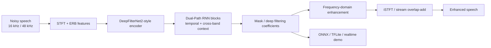
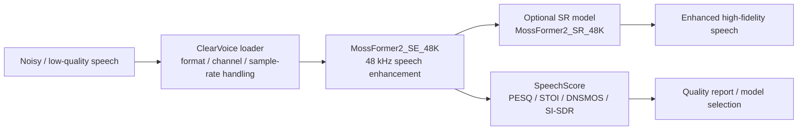
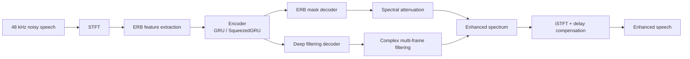
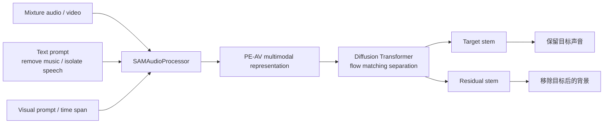
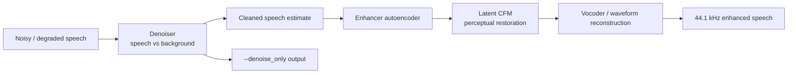
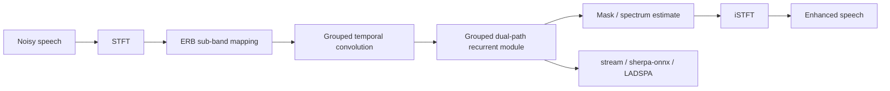
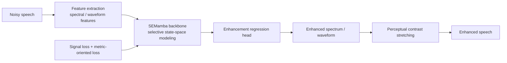
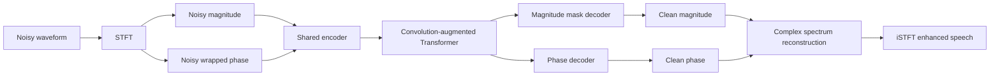
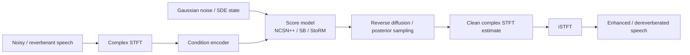
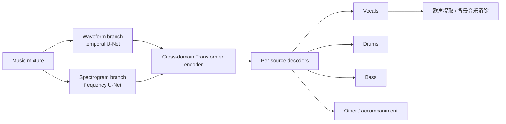

# 噪音抑制 / 杂音抑制 / 歌声降噪 SOTA Research

生成日期：2026-06-09  
检索范围：2022-2026，覆盖 speech enhancement、real-time noise suppression、speech denoising、dereverberation、general audio source separation、music / vocal source separation、singing voice cleanup。  
用户关心的 baseline：DeepFilter / DeepFilterNet / DeepFilterNet2。  
用户偏好：开源优先 / 模型可下载优先 / 可以处理背景音乐消除优先 / 歌声降噪优先 / 工业落地优先。  

## 核验范围

本次核验了论文页、GitHub、Hugging Face、ModelScope、官方 demo / project page。重点候选包括 DPDFNet、ClearerVoice-Studio / MossFormer2_SE_48K、DeepFilterNet2 / DeepFilterNet3、SAM Audio、Resemble Enhance、GTCRN、SEMamba、MP-SENet、SGMSE+、HTDemucs v4，并补充核验了 AudioSep、BS-RoFormer / Mel-Band RoFormer、UVR 生态、SpeechBrain / MetricGAN 系列作为参考。

排序只保留 2022-2026 范围内有明确论文、代码或模型证据的方法。VoiceFixer、RNNoise、DTLN、原始 DeepFilterNet 2021 版不进入 Top 10，只作为历史 baseline 参考。RoFormer 系列在歌声 / 伴奏分离实践中很强，但官方论文代码和社区权重链路分散，因此未排到有官方代码和官方权重的 Demucs / SAM Audio 前面。

## 排序规则

本报告按五个维度排序：任务直接相关性、是否官方开源代码、是否官方开源模型 / 权重 / Space、是否能替代或超过 DeepFilter 类 baseline、是否适合工业落地。实时麦克风降噪优先看低延迟、因果模型、ONNX / TFLite / 插件；歌声降噪和背景音乐消除优先看 vocal / accompaniment separation、open-domain source separation 和权重可得性。

## 总览表

| 排名 | 名称 | 年份 | 任务相关性 | GitHub | Hugging Face | ModelScope | 是否超过指定 baseline / 强基线 | 结论 |
|---:|---|---:|---|---|---|---|---|---|
| 1 | DPDFNet | 2025 | 直接噪声抑制 / DeepFilterNet2 增强 | ✅ 官方代码 | ✅ 官方模型 | 未找到 | 直接继承 DeepFilterNet2；论文报告优于多种 causal open-source SE 模型 | 当前最贴近 DeepFilter 替代升级的开源落地方案 |
| 2 | ClearerVoice-Studio / MossFormer2_SE_48K | 2024-2025 | 语音增强 / 语音分离 / 48 kHz 降噪 | ✅ 官方代码 | ✅ 官方模型 | ✅ 官方模型 | 未直接对比 DeepFilter；平台级强基线，FRCRN / MossFormer 系列有大规模使用证据 | 工业链路最完整，适合批处理和服务端语音清理 |
| 3 | DeepFilterNet2 / DeepFilterNet3 | 2022-2023 | 指定 baseline / 实时全带语音增强 | ✅ 官方代码 | 仅官方 Demo | 未找到 | 指定 baseline；DeepFilterNet2 RTF 0.04，DeepFilterNet demo RTF 0.19 | 必跑基线，仍是轻量实时降噪的工程锚点 |
| 4 | SAM Audio | 2025 | 通用音频分离 / 背景噪声和音乐移除 | ✅ 官方代码 | ✅ 官方模型 | 未找到 | 未直接对比 DeepFilter；论文覆盖 speech、music、sound separation 强基线 | 最值得跟踪的通用“任意声音分离”路线，但部署重 |
| 5 | Resemble Enhance | 2023 | 语音降噪 + 音质增强 + 带宽恢复 | ✅ 官方代码 | ✅ 官方模型/Space | 未找到 | 未直接对比 DeepFilter；生产向语音修复强工程基线 | 对低质量人声素材清理最实用，适合离线/准实时处理 |
| 6 | GTCRN | 2024 | 超轻量实时语音增强 | ✅ 官方代码 | 未找到官方模型 | 仅非官方复现 | VCTK-DEMAND PESQ 2.87，高于 DeepFilterNet 2.81；48.2K 参数、33.0 MMAC/s | 端侧和低算力设备优先看，质量上限不如大模型 |
| 7 | SEMamba | 2024 | Mamba 语音增强 / 通用 speech restoration | ✅ 官方代码 | ✅ 官方模型/Space | 未找到 | VCTK-DEMAND PESQ 3.56，PCS 后 3.75；DNS-2020 PESQ 3.66 | 论文效果强，适合研究和高质量离线降噪 |
| 8 | MP-SENet | 2023-2025 | 幅度+相位并行语音增强 | ✅ 官方代码 | 仅非官方复现 | 未找到 | VoiceBank+DEMAND PESQ 3.50；长版扩展到 denoise / dereverb / BWE | 相位建模路线强，代码自带 best checkpoint |
| 9 | SGMSE+ / StoRM | 2022-2025 | 扩散式语音增强 / 去混响 / 歌声混响修复 | ✅ 官方代码 | 仅非官方复现 | 未找到 | 与 discriminative SE 强基线互补；官方提供多数据集 checkpoints | 质量和研究价值高，实时工业部署降权 |
| 10 | HTDemucs v4 | 2022 | 音乐源分离 / vocal 与 accompaniment 分离 | ✅ 官方代码 | 仅非官方复现 | 未找到 | 音乐分离强基线；MUSDB extra data SDR 9.20 dB | 背景音乐消除和歌声分离必跑基线，非语音降噪模型 |

## Top 方法深度解析

### [1] DPDFNet

- 论文：[DPDFNet: Boosting DeepFilterNet2 via Dual-Path RNN](https://arxiv.org/abs/2512.16420)
- GitHub：[ceva-ip/DPDFNet](https://github.com/ceva-ip/DPDFNet)
- Hugging Face：[Ceva-IP/DPDFNet](https://huggingface.co/Ceva-IP/DPDFNet)，[Ceva-IP/DPDFNetDemo](https://huggingface.co/spaces/Ceva-IP/DPDFNetDemo)
- ModelScope：未找到可信官方 ModelScope 镜像
- 开源结论：代码+模型已开源。官方仓库提供 PyTorch checkpoint、ONNX、TFLite、实时 demo、Hugging Face 下载命令，license 为 Apache-2.0。
- baseline / 强基线判断：这是 DeepFilterNet2 的直接增强版，不是泛泛相邻任务。论文明确把 DeepFilterNet2 作为第一阶段预测模型，在 encoder 中加入 dual-path RNN blocks，并面向 causal open-source SE 模型做比较。

#### 技术方案

DPDFNet 解决的问题是：DeepFilterNet2 已经很适合实时降噪，但对长程时间依赖、跨频带噪声结构和低 SNR 长音频仍不够稳。DPDFNet 保留 DeepFilterNet2 的核心增强框架，在 encoder 中加入 DPRNN 式 dual-path 建模，让模型同时看局部帧序列和跨 band 结构。

- 输入：单通道 noisy speech，支持 16 kHz 和 48 kHz 模型。
- 输出：增强后的 speech waveform。
- 主干：DeepFilterNet2-style causal enhancement + dual-path RNN encoder。
- 关键模块：ERB 特征、complex STFT、dual-path temporal / cross-band modeling、attenuation control、ONNX / TFLite 流式推理。
- 关键设计：沿用 DeepFilter 的低延迟频域增强框架，只在最影响长程噪声建模的 encoder 处加强，而不是换成重型 Transformer。
- 训练 / 推理策略：官方提供 baseline、dpdfnet2、dpdfnet4、dpdfnet8、48 kHz high-resolution 版本；离线可用 ONNX / TFLite 批处理，实时可用 `real_time_demo.py` 麦克风流式增强。

#### 信号流

#### 实验结果

官方模型 profile 给出 16 kHz 模型：baseline 2.31M 参数、0.36 GMAC/s；dpdfnet2 2.49M 参数、1.35 GMAC/s；dpdfnet4 2.84M 参数、2.36 GMAC/s；dpdfnet8 3.54M 参数、4.37 GMAC/s。48 kHz high-resolution 版本包括 dpdfnet2_48khz_hr 2.58M 参数、2.42 GMAC/s，dpdfnet8_48khz_hr 3.63M 参数、7.17 GMAC/s。实时流式说明中首个增强输出在约 20 ms 窗口后返回，后续 block 约 10 ms 额外延迟。论文摘要还报告 DPDFNet-4 能在 Ceva-NeuPro-Nano NPN32 上实时运行，在 NPN64 上更快。

#### 毒舌点评

这是最像“DeepFilter 的下一代替换件”的项目。优点是代码、权重、ONNX、TFLite、实时 demo 都给了；缺点是论文时间很新，真实音乐背景和非语音素材下的稳定性还要自己压测。它不是歌声分离工具，不要拿它当 UVR。

#### 为什么值得看

用户指定 baseline 是 DeepFilter，DPDFNet 直接站在 DeepFilterNet2 上改，开源链路也比多数论文完整。要做实时麦克风降噪或嵌入式噪声抑制，它是本轮首选。

### [2] ClearerVoice-Studio / MossFormer2_SE_48K

- 论文 / 项目：[ClearerVoice-Studio: Bridging Advanced Speech Processing Research and Practical Deployment](https://arxiv.org/abs/2506.19398)，[MossFormer2](https://arxiv.org/abs/2312.11825)
- GitHub：[modelscope/ClearerVoice-Studio](https://github.com/modelscope/ClearerVoice-Studio)
- Hugging Face：[alibabasglab/MossFormer2_SE_48K](https://huggingface.co/alibabasglab/MossFormer2_SE_48K)
- ModelScope：[ClearerVoice-Studio](https://www.modelscope.cn/studios/iic/ClearerVoice-Studio)，官方仓库说明预训练模型可从 ModelScope 或 Hugging Face 下载
- 开源结论：代码+模型已开源。ClearerVoice-Studio 是阿里 / ModelScope 体系下的语音处理工具箱，包含 speech enhancement、speech separation、speech super-resolution、target speaker extraction、SpeechScore 评测。
- baseline / 强基线判断：未直接把 DeepFilter 作为核心对比对象，但它是更完整的平台级强基线。官方 README 明确列出 16 kHz / 48 kHz speech enhancement，并提供 FRCRN、MossFormer2、MossFormerGAN 等预训练模型。

#### 技术方案

ClearerVoice-Studio 的价值不是单个模型，而是把常见语音清理任务做成统一入口。对本任务最直接的是 `MossFormer2_SE_48K`：48 kHz 语音增强模型，用于去背景噪声并保留高保真人声。它还可以与 speech super-resolution 串联，先降噪再把低采样率语音提升到 48 kHz。

- 输入：单文件、目录或 `.scp` 列表中的 noisy speech，支持多种音频格式。
- 输出：增强后的 speech waveform。
- 主干：MossFormer2 / FRCRN / MossFormerGAN 等任务模型，通过 ClearVoice 统一调度。
- 关键模块：speech enhancement 模型、speech separation 模型、speech super-resolution 模型、SpeechScore 评测器。
- 关键设计：推理平台和训练平台都开源，模型从 Hugging Face 或 ModelScope 自动下载，适合批量处理和内部服务封装。
- 训练 / 推理策略：`ClearVoice(task='speech_enhancement', model_names=['MossFormer2_SE_48K'])` 初始化后可处理单个 wav、目录或 scp；高阶用户可用 Train 模块微调。

#### 信号流

#### 实验结果

官方 GitHub 写明 ClearerVoice-Studio 提供 SOTA 预训练模型，FRCRN speech denoiser 在 ModelScope 使用超过 3.0 million 次，MossFormer speech separator 在 ModelScope 使用超过 2.5 million 次。Hugging Face model card 写明 `MossFormer2_SE_48K` 是 ClearerVoice-Studio 的 48 kHz speech enhancement 权重，目标是通过移除背景噪声增强语音。工具箱还内置 SNR、PESQ、STOI、DNSMOS、SI-SDR 等评测入口。

#### 毒舌点评

这是“干活型”项目，不是只给一张论文图。缺点是平台比较大，依赖和目录结构比单模型复杂；实时麦克风端侧部署也不如 DPDFNet / GTCRN 直接。

#### 为什么值得看

你要的是稳定同步和可落地，不是只跑一个 demo。ClearerVoice 的代码、权重、ModelScope、Hugging Face、评测工具都在一套系统里，适合做公司内部语音清理流水线。

### [3] DeepFilterNet2 / DeepFilterNet3

- 论文：[DeepFilterNet2: Towards Real-Time Speech Enhancement on Embedded Devices for Full-Band Audio](https://arxiv.org/abs/2205.05474)，[DeepFilterNet: Perceptually Motivated Real-Time Speech Enhancement](https://arxiv.org/abs/2305.08227)
- GitHub：[Rikorose/DeepFilterNet](https://github.com/Rikorose/DeepFilterNet)
- Hugging Face：[hshr/DeepFilterNet2 Space](https://huggingface.co/spaces/hshr/DeepFilterNet2)，官方 README 指向该 demo；另有社区 OpenVINO / MLX 镜像
- ModelScope：未找到可信官方 ModelScope 镜像
- 开源结论：代码+模型已开源。官方仓库包含 pretrained model weights、Python 包、Rust / libDF、LADSPA 插件、预编译 `deep-filter` 二进制和训练代码。
- baseline / 强基线判断：这是用户指定 baseline。DeepFilterNet2 是 2022 年 full-band real-time speech enhancement 的强基线，DeepFilterNet 2023 demo 把感知动机和实时展示补齐。

#### 技术方案

DeepFilterNet 的核心是两阶段频域增强：先估计 ERB mask 做粗抑制，再预测 deep filtering coefficients 在 complex STFT 域做多帧滤波。它利用语音谐波结构和感知频带划分，把复杂度压到实时设备可接受范围。

- 输入：48 kHz noisy speech wav。
- 输出：增强后的 48 kHz speech。
- 主干：ERB mask encoder-decoder + deep filtering decoder。
- 关键模块：ERB 频带压缩、GroupedGRU / SqueezedGRU、multi-frame deep filtering、post-filter、STFT/iSTFT。
- 关键设计：把低频 speech 结构和高频感知建模拆开处理，用小模型达到实时效果。
- 训练 / 推理策略：默认 `deepFilter noisy.wav` 加载 DeepFilterNet2；也可 `python DeepFilterNet/df/enhance.py -m DeepFilterNet2 path/to/noisy.wav`；LADSPA 可接入 PipeWire 做实时 mic 降噪。

#### 信号流

#### 实验结果

DeepFilterNet2 摘要报告通过训练流程、数据增强和网络结构优化达到 SOTA speech enhancement 性能，同时把 notebook Core-i5 CPU 上的 real-time factor 降到 0.04。DeepFilterNet 2023 demo 摘要报告在单线程 notebook CPU 上 RTF 0.19，并公开 framework 与 pretrained weights。官方 README 写明 `models` 目录包含 pretrained models，`ladspa` 包含实时 mic noise reduction 插件。

#### 毒舌点评

DeepFilterNet 仍然很实用，但它已经不是“最强质量”的答案。它强在轻、稳、能实时；弱在复杂噪声、音乐背景、歌声伴奏泄漏上容易比专门分离模型吃亏。

#### 为什么值得看

所有后续替代方案都要拿它做基本盘。你评估新模型时至少要跑 DeepFilterNet2/3，否则很难判断新增复杂度是否值得。

### [4] SAM Audio

- 论文：[SAM Audio: Segment Anything in Audio](https://arxiv.org/abs/2512.18099)
- GitHub：[facebookresearch/sam-audio](https://github.com/facebookresearch/sam-audio)
- Hugging Face：[facebook/sam-audio collection](https://huggingface.co/collections/facebook/sam-audio)，示例使用 `facebook/sam-audio-large`
- ModelScope：未找到可信官方 ModelScope 镜像
- 开源结论：代码+模型已开源，但 checkpoint 需要在 Hugging Face 上申请访问并登录下载。官方仓库提供 inference code、example notebooks、text / visual / temporal prompt 用法。
- baseline / 强基线判断：未直接对比 DeepFilter。它解决的是更一般的 audio source separation，不是实时 speech enhancement；但对“背景音乐消除 / 任意噪声移除 / 歌声或乐器隔离”比传统 speech denoiser 更直接。

#### 技术方案

SAM Audio 把音频分离做成 promptable segmentation：用户给文字、视频视觉区域或时间段提示，模型输出 target stem 和 residual stem。它不是只识别 speech/noise 二分类，而是把“我要去掉哪种声音”作为条件输入。

- 输入：混合音频，外加 text prompt、visual prompt 或 temporal span prompt。
- 输出：target audio 与 residual audio。
- 主干：diffusion transformer + flow matching。
- 关键模块：PE-AV multimodal encoder、prompt processor、DiT separation backbone、span prediction、reranking candidates。
- 关键设计：同一模型覆盖 speech、music、general sound；输出 target 和 residual，天然适合“去掉背景音乐 / 保留人声”这类编辑任务。
- 训练 / 推理策略：官方示例使用 `SAMAudio.from_pretrained("facebook/sam-audio-large")` 和 `SAMAudioProcessor`；`predict_spans=True` 与 `reranking_candidates=8` 提升质量但增加延迟和显存。

#### 信号流

#### 实验结果

论文摘要报告 SAM Audio 覆盖 general sound、speech、music、musical instrument separation 等 benchmark，并显著超过 prior general-purpose 和 specialized systems。Meta blog 进一步说明 SAM Audio-Bench 覆盖 speech、music、general sound effects 以及 text、visual、span prompt 类型。官方 GitHub 给出 3.5k stars、Hugging Face checkpoint 入口、基础文本提示推理代码。

#### 毒舌点评

这不是你明天就塞进实时通话链路的模型：Python 3.11、CUDA、HF gated checkpoint、扩散生成式推理都会增加部署成本。但它代表了“噪声抑制”从固定模型走向可控分离的方向。

#### 为什么值得看

用户关心背景音乐消除和歌声降噪，单纯 speech denoiser 很多时候会把音乐、人声、混响混成一类。SAM Audio 的 promptable separation 更贴近真实编辑需求：指定要分离谁，而不是盲目降噪。

### [5] Resemble Enhance

- 论文 / 项目：[Resemble Enhance](https://github.com/resemble-ai/resemble-enhance)
- GitHub：[resemble-ai/resemble-enhance](https://github.com/resemble-ai/resemble-enhance)
- Hugging Face：[ResembleAI/resemble-enhance Space](https://huggingface.co/spaces/ResembleAI/resemble-enhance)
- ModelScope：未找到可信官方 ModelScope 镜像
- 开源结论：代码+模型已开源。官方项目支持 `pip install resemble-enhance --upgrade`、CLI 批处理、Gradio demo、本地训练；预训练模型由程序在推理时自动下载。
- baseline / 强基线判断：未直接对比 DeepFilter。它是面向真实语音素材修复的强工程 baseline，覆盖 denoise 和 enhance 两个阶段，比纯 noise suppression 更偏“人声可听感修复”。

#### 技术方案

Resemble Enhance 由 denoiser 和 enhancer 两个模块组成。denoiser 先把 speech 从 noisy audio 中分离出来；enhancer 再提升感知音质，修复失真并扩展带宽。训练数据为高质量 44.1 kHz speech。

- 输入：低质量或带噪 speech audio。
- 输出：denoise-only speech 或完整 enhance 后的人声。
- 主干：denoiser + latent conditional flow matching enhancer。
- 关键模块：speech denoiser、autoencoder、vocoder、latent CFM、CLI / Gradio interface。
- 关键设计：把“去噪”和“音质增强 / 带宽恢复”拆成两级，适合修 TTS、录音、播客、配音素材。
- 训练 / 推理策略：`resemble-enhance in_dir out_dir` 做完整增强；`resemble-enhance in_dir out_dir --denoise_only` 只做去噪；训练分 denoiser warmup、enhancer stage 1 autoencoder/vocoder、enhancer stage 2 latent CFM。

#### 信号流

#### 实验结果

官方 README 写明 Resemble Enhance 是 AI-powered speech denoising and enhancement，包含 denoiser 与 enhancer 两个模块，后者负责恢复失真和扩展带宽；两个模型在高质量 44.1 kHz speech data 上训练。项目提供 CLI、Gradio web demo 和完整训练命令。Replicate 页面显示该模型已有大量公开运行记录，说明工程使用门槛低。

#### 毒舌点评

它不像论文 SOTA 那样给满屏 benchmark 表，但更像生产工具。缺点是对音乐伴奏分离不是专门模型；当背景是强伴奏或合唱时，还是要先跑 Demucs / SAM Audio 这类分离模型。

#### 为什么值得看

如果你的输入是“人声已经在前面，但噪声、压缩、带宽损失让它难听”，Resemble Enhance 往往比只做 spectral mask 的降噪器更有用。

### [6] GTCRN

- 论文：[GTCRN: A Speech Enhancement Model Requiring Ultralow Computational Resources](https://ieeexplore.ieee.org/document/10448310)
- GitHub：[Xiaobin-Rong/gtcrn](https://github.com/Xiaobin-Rong/gtcrn)
- Hugging Face：未找到可信官方 Hugging Face 模型；存在非官方 demo / 部署镜像
- ModelScope：[AXERA-TECH/Lightweight-Speech-Denoising.axera](https://modelscope.cn/models/AXERA-TECH/Lightweight-Speech-Denoising.axera) 为非官方 NPU 优化模型，不是论文作者官方发布
- 开源结论：代码已开源，仓库含官方实现、Web quick inference、sherpa-onnx 支持、LADSPA 插件等生态入口；未找到官方 HF / ModelScope 权重仓库。
- baseline / 强基线判断：论文表格直接对比 DeepFilterNet、RNNoise、PercepNet、S-DCCRN 等轻量和中型模型。GTCRN 不是 DeepFilter 的结构改进，但在 VCTK-DEMAND 上以更低参数量取得更高 PESQ / SI-SNR，是低算力替代候选。

#### 技术方案

GTCRN 面向极低算力设备，核心是 Grouped Temporal Convolutional Recurrent Network。它先通过 ERB 子带压缩减少频域冗余，再用 grouped temporal convolution 和 grouped dual-path recurrent module 建模时间结构。

- 输入：单通道 noisy speech。
- 输出：enhanced speech。
- 主干：ERB sub-band front-end + grouped temporal convolution + grouped dual-path recurrent module。
- 关键模块：ERB 特征、GTConv、GRNN / dual-path recurrent module、streaming inference。
- 关键设计：用分组和子带压缩降低参数与 MAC，优先满足端侧实时性。
- 训练 / 推理策略：官方仓库提供训练、推理、stream 版本、sherpa-onnx 接入和 LADSPA 插件；2025 年还发布 H-GTCRN 双通道低 SNR 系统。

#### 信号流

#### 实验结果

官方 README 写明 GTCRN 只有 48.2K 参数和 33.0 MMAC/s。论文版本复杂度为 23.7K 参数、39.6 MMAC/s，仓库因纳入 ERB 模块后更新为 48.2K 参数和 33.0 MMAC/s。VCTK-DEMAND 表格中，Noisy PESQ 1.97、RNNoise 2.29、PercepNet 2.73、DeepFilterNet 2.81、S-DCCRN 2.84、GTCRN 2.87；SI-SNR 上 DeepFilterNet 16.63，GTCRN 18.83。DNS3 blind test 中 GTCRN DNSMOS-P.808 为 3.44，OVRL 为 2.70。

#### 毒舌点评

GTCRN 的卖点不是绝对音质第一，而是“很小还能用”。如果你要做服务器离线高质量修复，它不是最优；如果你要塞进低算力端侧、WebRTC 前处理或嵌入式设备，它很值得测。

#### 为什么值得看

工业落地里算力预算经常比论文指标更硬。GTCRN 给了一个极轻量路径，可作为 DeepFilterNet 的低资源替代或前置粗降噪模块。

### [7] SEMamba

- 论文：[An Investigation of Incorporating Mamba for Speech Enhancement](https://arxiv.org/abs/2405.06573)
- GitHub：[RoyChao19477/SEMamba](https://github.com/RoyChao19477/SEMamba)
- Hugging Face：[rc19477/Speech_Enhancement_Mamba Space](https://huggingface.co/spaces/rc19477/Speech_Enhancement_Mamba)
- ModelScope：未找到可信官方 ModelScope 镜像
- 开源结论：代码+Space 已开源。官方仓库说明这是 SEMamba paper 的官方实现，Accepted to IEEE SLT 2024。
- baseline / 强基线判断：未直接改 DeepFilter，但官方更新模型在 VCTK-Demand 上 PESQ 3.56，PCS 后 3.75；DNS-2020 上 PESQ 3.66，属于论文指标很强的语音增强路线。

#### 技术方案

SEMamba 的核心问题是：Transformer 在长序列语音增强中有效但计算代价高。Mamba 作为 selective state-space model，可以线性复杂度建模长程序列。SEMamba 把 Mamba 放进 speech enhancement 回归系统中，并比较 signal-level losses 与 metric-oriented losses。

- 输入：noisy speech。
- 输出：enhanced speech。
- 主干：Mamba-based speech enhancement regression model。
- 关键模块：Mamba block、spectral feature encoder、metric-oriented loss、perceptual contrast stretching。
- 关键设计：用 attention-free sequence model 捕获长程结构，减少 Transformer 的二次复杂度。
- 训练 / 推理策略：官方仓库支持 SEMamba 基础系统和 URGENT challenge 相关 universal SE 配置；challenge 场景覆盖 additive noise、reverberation、clipping、bandwidth limitations，并支持多采样率。

#### 信号流

#### 实验结果

arXiv 摘要报告 SEMamba 在 VoiceBank-DEMAND 数据集上 PESQ 3.55；结合 perceptual contrast stretching 后达到 PESQ 3.69。官方 README 更新的 `ckpts/vd.pth` 在 DNS-2020 上 PESQ 3.66、STOI 0.98；VCTK-Demand 上 PESQ 3.56、CSIG 4.73、CBAK 4.00、COVL 4.25、STOI 0.96；VCTK-Demand w/PCS 上 PESQ 3.75、COVL 4.37。官方仓库还说明 URGENT Challenge 2024 关注 universal、robust、diverse、generalizable speech enhancement，失真类型包括 additive noise、reverberation、clipping、bandwidth limitations。

#### 毒舌点评

SEMamba 是论文效果派，不是最省心的生产工具。优点是指标漂亮、模型路线新；缺点是开源工程没有 DPDFNet / ClearerVoice 那么闭环，端侧实时和多平台部署还要自己做。

#### 为什么值得看

Mamba 是 2024 之后音频增强的重要方向。你要追踪“Transformer 之后的语音增强主干”，SEMamba 是必须看的代表。

### [8] MP-SENet

- 论文：[MP-SENet: A Speech Enhancement Model with Parallel Denoising of Magnitude and Phase Spectra](https://arxiv.org/abs/2305.13686)，[Explicit Estimation of Magnitude and Phase Spectra in Parallel for High-Quality Speech Enhancement](https://arxiv.org/abs/2308.08926)
- GitHub：[yxlu-0102/MP-SENet](https://github.com/yxlu-0102/MP-SENet)
- Hugging Face：[JacobLinCool/MP-SENet Space](https://huggingface.co/spaces/JacobLinCool/MP-SENet) 为非官方 demo
- ModelScope：未找到可信官方 ModelScope 镜像
- 开源结论：代码+模型已开源。官方仓库提供训练、推理和 `best_ckpt` 预训练 checkpoint；HF 上找到的是非官方 Space。
- baseline / 强基线判断：未直接对比 DeepFilter。它在 VoiceBank+DEMAND 上 PESQ 3.50，并在长版工作中扩展到 speech denoising、dereverberation、bandwidth extension。

#### 技术方案

很多语音增强模型只估 magnitude mask，对 phase 处理很弱。MP-SENet 直接把 magnitude spectra 和 wrapped phase spectra 并行估计，避免 phase 被当成后处理残差。

- 输入：noisy magnitude spectrum + noisy phase spectrum。
- 输出：clean magnitude spectrum + clean wrapped phase spectrum + reconstructed waveform。
- 主干：encoder-decoder + convolution-augmented Transformer bridge。
- 关键模块：magnitude mask decoder、phase decoder、learnable sigmoid activation、parallel phase estimation、多层级 loss。
- 关键设计：幅度和相位并行恢复，loss 同时约束 magnitude、phase、complex spectrum 和 waveform。
- 训练 / 推理策略：VoiceBank+DEMAND 16 kHz 数据；训练保存到 `cp_mpsenet`；推理示例为 `python inference.py --checkpoint_file best_ckpt/g_best_vb --output_dir generated_files/MP-SENet_VB`。

#### 信号流

#### 实验结果

论文摘要报告 MP-SENet 在 VoiceBank+DEMAND 上 PESQ 3.50，并超过已有 advanced speech enhancement methods。官方 GitHub README 写明长版 MP-SENet 已扩展到 speech denoising、dereverberation 和 bandwidth extension，并提供 `best_ckpt` 预训练文件用于推理。

#### 毒舌点评

MP-SENet 很适合做高质量离线语音增强研究基线，但不是一键生产项目。官方仓库也明确指出代码里有一个小 bug，训练时建议把 `MultiHeadAttention` 的 `batch_first=True` 打开以降低显存。

#### 为什么值得看

相位估计经常被降噪系统忽略，但它直接影响金属音、毛刺和空间感。MP-SENet 是学习“幅度+相位一起修”的好模板。

### [9] SGMSE+ / StoRM

- 论文：[Speech Enhancement with Score-Based Generative Models in the Complex STFT Domain](https://www.isca-speech.org/archive/interspeech_2022/welker22_interspeech.html)，[Speech Enhancement and Dereverberation with Diffusion-Based Generative Models](https://arxiv.org/abs/2208.05830)
- GitHub：[sp-uhh/sgmse](https://github.com/sp-uhh/sgmse)
- Hugging Face：[sp-uhh/speech-enhancement-sgmse](https://huggingface.co/sp-uhh/speech-enhancement-sgmse) 与 SpeechBrain / 社区镜像可作为参考，官方 checkpoints 主要在 Google Drive 和 University of Hamburg 下载链接
- ModelScope：未找到可信官方 ModelScope 镜像
- 开源结论：代码+模型已开源。官方仓库提供 VoiceBank-DEMAND、WSJ0-CHiME3、WSJ0-REVERB、EARS-WHAM、EARS-Reverb、Singing-ReverbFX 等 checkpoints 下载命令。
- baseline / 强基线判断：未直接对比 DeepFilter。SGMSE+ 是生成式 speech enhancement / dereverberation 代表，和 discriminative mask 模型互补，适合高质量离线修复。

#### 技术方案

SGMSE+ 在 complex STFT 域训练 score-based generative model。推理时从 noisy 条件出发，用 SDE / reverse diffusion 采样 clean speech 的后验估计；StoRM 则进一步强调 stochastic regeneration，用扩散模型重建受损语音。

- 输入：noisy / reverberant speech。
- 输出：enhanced / dereverberated speech。
- 主干：score-based diffusion model / Schrödinger bridge / stochastic regeneration。
- 关键模块：complex STFT representation、NCSN++ backbone、SDE sampler、posterior sampling、PESQ-weighted objectives。
- 关键设计：不是简单估 mask，而是从生成模型角度对 clean speech posterior 建模，适合复杂失真和去混响。
- 训练 / 推理策略：官方提供 `enhancement.py --test_dir ... --enhanced_dir ... --ckpt ...`；不同 checkpoint 推荐不同 sampler 设置，例如 dereverberation checkpoint 推荐 `--N 50 --snr 0.33`。

#### 信号流

#### 实验结果

官方仓库列出 2022 Interspeech、2023 TASLP、2023 StoRM、2024 EARS、2025 generative SE objectives 等系列论文。预训练 checkpoints 覆盖 VoiceBank-DEMAND、WSJ0-CHiME3、WSJ0-REVERB、48 kHz EARS-WHAM、EARS-Reverb，以及 Singing-ReverbFX；Singing-ReverbFX 提供 SGMSE+ artificial RIR、SGMSE+ natural RIR、SB artificial RIR 等下载命令。

#### 毒舌点评

SGMSE+ 的质量路线值得研究，但实时部署不友好。扩散采样带来算力和延迟，商业系统要么接受离线批处理，要么做蒸馏 / 少步采样。

#### 为什么值得看

歌声降噪不只是加性噪声，常见问题还包括房间混响、伴奏泄漏、录音失真。SGMSE+ 官方提供 Singing-ReverbFX checkpoint，这一点对歌声修复很有价值。

### [10] HTDemucs v4

- 论文：[Hybrid Transformers for Music Source Separation](https://arxiv.org/abs/2211.08553)
- GitHub：[facebookresearch/demucs](https://github.com/facebookresearch/demucs)
- Hugging Face：[iBoostAI/Demucs-v4](https://huggingface.co/iBoostAI/Demucs-v4) 为社区镜像；官方模型通过 Demucs / TorchHub / AWS repository 获取
- ModelScope：未找到可信官方 ModelScope 镜像
- 开源结论：代码+模型已开源。官方 Demucs 仓库提供 HTDemucs v4、训练文档、预训练模型获取接口；HF 上主要是社区搬运或转换版本。
- baseline / 强基线判断：不对比 DeepFilter。它是 music source separation 强基线，直接适合 vocals / accompaniment / drums / bass / other 分离；对“背景音乐消除”和“歌声提取”比语音降噪模型更对口。

#### 技术方案

HTDemucs 是 Hybrid Demucs 的 Transformer 版，把 waveform U-Net 和 spectrogram U-Net 结合，再在瓶颈层加入 cross-domain Transformer encoder。它同时利用时域瞬态信息和频域谐波结构。

- 输入：音乐混合音频。
- 输出：vocals、drums、bass、other 等 stems。
- 主干：hybrid temporal / spectral bi-U-Net + cross-domain Transformer。
- 关键模块：waveform branch、spectrogram branch、self-attention、cross-attention、per-source fine-tuning。
- 关键设计：用跨域 Transformer 在时域和频域之间交换长程上下文，提升 vocal / accompaniment 分离质量。
- 训练 / 推理策略：默认 v4 模型为 `htdemucs`；fine-tuned 版本 `htdemucs_ft` 质量更高但速度更慢；生产中常与 UVR / RoFormer 系列做 ensemble。

#### 信号流

#### 实验结果

论文摘要报告 HTDemucs 在 MUSDB 上使用 800 首额外训练歌曲时，比同数据训练的 Hybrid Demucs 提升 0.45 dB SDR；使用 sparse attention、per-source fine-tuning 和 extra training data 后，在 MUSDB 上达到 9.20 dB SDR。DeepWiki 对官方仓库模型表的整理显示 `htdemucs` 是 v4 默认模型，面向 drums、bass、vocals、other 四 stem，约 9.0 dB SDR。

#### 毒舌点评

HTDemucs 不是降噪器，它是分轨器。拿它去处理键盘噪声、风噪、空调噪声不合适；但拿它先把伴奏和人声拆开，再对 vocal stem 跑 Resemble / DeepFilter / SGMSE，是歌声清理的正确链路。

#### 为什么值得看

用户明确要求背景音乐消除和歌声降噪优先。语音增强模型经常会误伤歌声或保留伴奏残留，HTDemucs 提供了“先分离、再降噪”的稳定基线。

## 复现/落地优先级

1. DPDFNet：最优先。DeepFilterNet2 直接升级，官方代码、HF 权重、ONNX、TFLite、实时 demo 都完整，适合实时麦克风和边缘设备。
2. ClearerVoice-Studio / MossFormer2_SE_48K：适合服务端批处理、素材清理、语音增强流水线。ModelScope 与 Hugging Face 双入口降低模型下载风险。
3. DeepFilterNet2 / DeepFilterNet3：作为 baseline 必跑。轻量、稳定、插件生态成熟，用来衡量其他模型是否真的值得替换。
4. Resemble Enhance：适合低质量人声素材的离线增强和批量修复，尤其是 denoise + bandwidth restoration 的组合。
5. GTCRN：适合极低算力端侧方案；质量目标不能设成最高，重点看功耗、延迟和 WER 影响。
6. HTDemucs v4：适合先做 vocal / accompaniment 分离，再进入歌声降噪链路。强伴奏场景不要直接上 speech denoiser。
7. SAM Audio：适合复杂声音编辑和可控分离原型，先用于离线工具或人工审核链路，不建议直接放实时服务。
8. SEMamba：适合高质量离线增强和研究复现；部署前需要补权重管理、推理封装和加速。
9. MP-SENet：适合做相位建模基线和离线增强实验；生产化要处理 checkpoint、采样率和训练 bug。
10. SGMSE+ / StoRM：适合高质量去混响、歌声混响修复和生成式增强研究；实时链路降权。

## 论文效果/技术价值优先级

1. SAM Audio：通用音频分离范式最强，text / visual / span prompt 把“去噪”升级为“可控分离”。
2. SEMamba：Mamba 在 speech enhancement 上的代表路线，PESQ 3.55 / PCS 后 3.69，技术趋势明确。
3. SGMSE+ / StoRM：生成式 speech restoration 代表，覆盖 denoise、dereverb、48 kHz、Singing-ReverbFX。
4. DPDFNet：DeepFilterNet2 的直接结构增强，兼顾论文创新和可部署性。
5. MP-SENet：幅度和相位并行估计，适合解决传统 mask 模型的相位短板。
6. HTDemucs v4：music source separation 强基线，背景音乐消除链路不可缺。
7. ClearerVoice-Studio：平台化价值高，单篇算法新颖性不如 SAM / SEMamba，但系统完整度强。
8. Resemble Enhance：工程价值大于论文指标展示，适合真实语音素材增强。
9. GTCRN：技术目标清晰，极低资源场景价值很高。
10. DeepFilterNet2 / DeepFilterNet3：技术已成熟，是比较锚点而不是最新 SOTA。

## 最终建议

如果目标是替换 DeepFilter 做实时噪声抑制，第一阶段直接复现 DPDFNet、DeepFilterNet3、GTCRN，并用同一批内部 noisy speech / low-SNR / 多语言 / 远场样本评估 PESQ、STOI、DNSMOS、WER 和 RTF。DPDFNet 是主候选，DeepFilterNet3 是 baseline，GTCRN 是低算力兜底。

如果目标是清理歌声或去背景音乐，不能只跑 speech denoiser。推荐链路是 `HTDemucs v4 或 SAM Audio 分离 vocal/residual -> Resemble Enhance 或 ClearerVoice 做人声增强 -> SGMSE+ 处理混响严重样本`。强伴奏样本先分离，弱噪声样本再直接语音增强。

如果目标是工业落地，优先顺序是 DPDFNet、ClearerVoice-Studio、Resemble Enhance、DeepFilterNet3、HTDemucs v4。SEMamba、MP-SENet、SGMSE+ 作为研究和高质量离线候选保留，不应在没有推理封装、速度压测和许可证检查前进入主链路。
