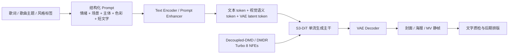
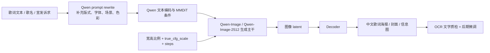
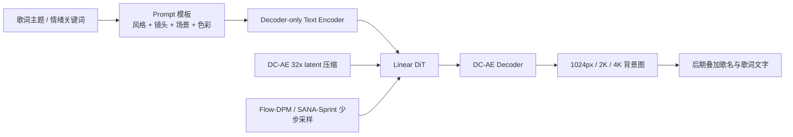
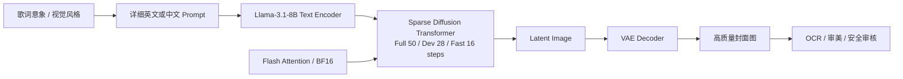
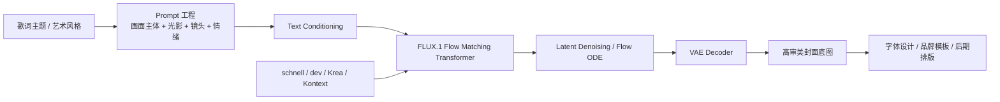
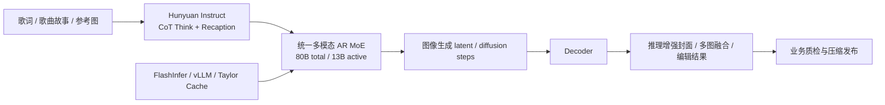
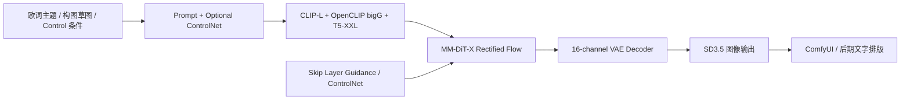
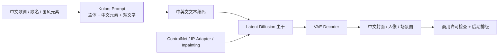
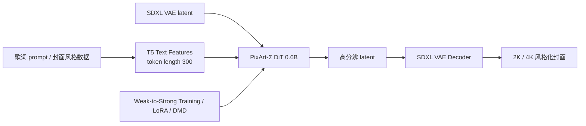
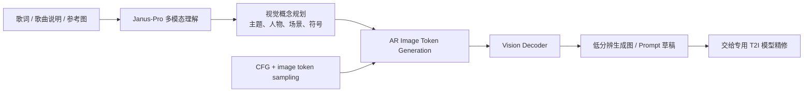

# Text2Image / 文生图 / 歌词生图 SOTA Research

生成日期：2026-06-10

检索范围：2022-2026，覆盖 text-to-image、image foundation model、Chinese/English text rendering、prompt following、fast diffusion/flow generation、unified multimodal image generation，以及歌词生图可落地链路。

用户关心的 baseline：Z-Image、Qwen-Image。

用户偏好：开源优先 / 模型可下载优先 / 模型效果和生成速度优先 / 工业落地优先。

## 核验范围

本次核验了论文、官方 GitHub、Hugging Face、ModelScope、官方 demo / blog / README、模型卡与可运行推理入口。核心候选包括 Z-Image、Qwen-Image、HunyuanImage-3.0、FLUX.1、HiDream-I1、SANA、Stable Diffusion 3.5、Kolors、PixArt-Σ、Janus-Pro，并把 Seedream 4.0、Imagen 4、Ideogram 3.0 作为闭源效果参考，不纳入开源落地 Top 10 排名。

歌词生图没有形成独立主流 benchmark。本报告按工业实际链路定义任务：`歌词 / 歌曲主题 / 情绪 / 场景意象 -> prompt 结构化与分镜 -> 封面 / 海报 / MV 静帧 / 宣传图生成 -> 文字排版与质检`。因此排序时重点看中文与英文复杂 prompt 理解、短文字渲染、人物与场景审美、推理速度、权重可下载、本地部署成本、许可与商用风险。完整歌词长文本不建议完全依赖生成模型直接渲染，生产链路应由模型生成背景与视觉主体，再用设计工具或 Canvas 后处理叠加歌词文字。

开源状态只按已核验的确定档位写。ModelScope 没有找到可信官方镜像时，总览表统一写 `未找到`，详细说明放在单篇解析中。

## 排序规则

综合排序优先看五件事：是否有官方代码和可下载权重、是否适合歌词生图的中文/英文文本渲染与 prompt following、生成质量与审美上限、推理速度和显存门槛、许可证与工业集成成本。Z-Image 和 Qwen-Image 是用户指定 baseline，因此同时作为比较锚点：Z-Image 更偏高效开源生成，Qwen-Image 更偏中文复杂文字与海报排版。

## 总览表

| 排名 | 名称 | 年份 | 任务相关性 | GitHub | Hugging Face | ModelScope | 是否超过指定 baseline / 强基线 | 结论 |
|---:|---|---:|---|---|---|---|---|---|
| 1 | Z-Image / Z-Image-Turbo | 2025-2026 | 文生图 / 快速生成 / 中英文文字 | ✅ 官方代码 | ✅ 官方模型/Space | ✅ 官方模型/Space | 指定 baseline；官方材料给出 6B、Turbo 8 NFEs、Artificial Analysis 开源榜第 1 | 首选高效开源基线，速度、显存、文字和质量平衡最好 |
| 2 | Qwen-Image / Qwen-Image-2512 | 2025 | 文生图 / 中文文字 / 海报信息图 | ✅ 官方代码 | ✅ 官方模型/Space | ✅ 官方模型 | 指定 baseline；官方材料强调复杂文字渲染，AI Arena 10,000+ blind rounds 开源领先 | 首选中文歌词海报和图文混排基线，速度不如 Z-Image |
| 3 | SANA / SANA-1.5 / SANA-Sprint | 2024-2026 | 高效文生图 / 低显存 / 快速服务化 | ✅ 官方代码 | ✅ 官方模型/Space | 未找到 | 对 FLUX-dev 有官方速度与质量表；SANA-1.5 1.6B 1024px 延迟 1.2s、GenEval 0.82 | 工业部署速度优先时非常强，适合批量封面和背景图生成 |
| 4 | HiDream-I1 | 2025 | 高质量文生图 / 快速变体 | ✅ 官方代码 | ✅ 官方模型/Space | 未找到 | 官方 README 表中 GenEval 0.83、DPG 85.89、HPSv2.1 33.82，超过 FLUX.1-dev / SD3 / Janus-Pro | 效果指标强、MIT 许可友好，但依赖 Llama-3.1 文本编码器 |
| 5 | FLUX.1 | 2024-2025 | 文生图强基线 / 生态成熟 | ✅ 官方代码 | ✅ 官方模型 | 未找到 | 强基线；开源权重生态成熟，但没有与 Z-Image/Qwen-Image 的官方同表数值 | 质量和生态很稳，商用许可和中文文字能力需要单独评估 |
| 6 | HunyuanImage-3.0 | 2025-2026 | 原生多模态文生图 / 复杂推理 / 图生图 | ✅ 官方代码 | ✅ 官方模型 | 未找到 | 官方材料称接近或超过领先闭源模型；80B total / 13B active，显存门槛高 | 论文技术价值很高，落地受 3×80GB 或 8×80GB 推荐配置限制 |
| 7 | Stable Diffusion 3.5 | 2024 | 文生图通用基线 / ControlNet / 生态 | ✅ 官方代码 | ✅ 官方模型 | 未找到 | 强基线；SD3 系列是 MM-DiT 与 rectified flow 代表，但文字渲染落后于 Qwen/Z | 生态兼容性好，适合已有 SD/ComfyUI 链路增量升级 |
| 8 | Kolors | 2024 | 中文/英文文生图 / 中文元素 / 文字渲染 | ✅ 官方代码 | ✅ 官方模型/Space | ✅ 官方模型 | 中文强基线；官方 human eval overall satisfaction 3.59、MPS 10.3 | 中文业务仍有价值，但模型年份和商用登记要求使其排在新模型后 |
| 9 | PixArt-Σ | 2024 | 轻量 DiT / 2K/4K 文生图 / 训练友好 | ✅ 官方代码 | ✅ 官方模型/Space | 未找到 | PixArt 系列强基线；0.6B、T5 token 300、2K checkpoint 可用 | 适合低成本训练和研究，不是当前最强歌词海报生成首选 |
| 10 | Janus-Pro | 2025 | 统一多模态理解 + 图像生成 | ✅ 官方代码 | ✅ 官方模型/Space | 未找到 | HiDream 官方对比中 Janus-Pro-7B GenEval 0.80、DPG 84.19；分辨率与审美落地弱于专用 T2I | 适合歌词理解和多模态中间层，不适合作为最终高质量生图主力 |

## Top 方法深度解析

### [1] Z-Image / Z-Image-Turbo

- 论文：[Z-Image: An Efficient Image Generation Foundation Model with Single-Stream Diffusion Transformer](https://arxiv.org/abs/2511.22699)
- GitHub：[Tongyi-MAI/Z-Image](https://github.com/Tongyi-MAI/Z-Image)
- Hugging Face：[Tongyi-MAI/Z-Image](https://huggingface.co/Tongyi-MAI/Z-Image)，[Tongyi-MAI/Z-Image-Turbo](https://huggingface.co/Tongyi-MAI/Z-Image-Turbo)，[Z-Image Space](https://huggingface.co/spaces/Tongyi-MAI/Z-Image)
- ModelScope：[Tongyi-MAI/Z-Image](https://www.modelscope.cn/models/Tongyi-MAI/Z-Image)，[Tongyi-MAI/Z-Image-Turbo](https://www.modelscope.cn/models/Tongyi-MAI/Z-Image-Turbo)
- 开源结论：代码+模型已开源。官方 README 给出 PyTorch native inference、Diffusers inference、HF checkpoint、HF Space、ModelScope checkpoint 和 ModelScope Space。
- baseline / 强基线判断：这是用户指定 baseline。官方材料显示 Z-Image 为 6B 参数，Z-Image-Turbo 使用 8 NFEs，在 H800 上达到 sub-second latency，并可在 16GB VRAM 消费级设备运行；官方榜单材料称 Z-Image-Turbo 在 Artificial Analysis Text-to-Image Leaderboard 总榜第 8、开源模型第 1。

#### 技术方案

Z-Image 的核心是用 Scalable Single-Stream DiT 把文本 token、视觉语义 token、图像 VAE token 拼成统一序列输入，减少双流结构的参数冗余。Z-Image-Turbo 再用 Decoupled-DMD 与 RL 后训练，把常规 50 步生成压到 8 次 DiT forward，并强化语义对齐、审美和结构稳定性。

- 输入：中文或英文 prompt，可加 negative prompt、分辨率、seed、step、guidance。
- 输出：512-2048 范围内多比例图像，Turbo 重点面向快速 1024px 生成。
- 主干：S3-DiT 单流扩散 Transformer + VAE。
- 关键模块：统一 token stream、prompt enhancer、Decoupled-DMD、DMDR、Diffusers pipeline、ModelScope AIGC 接入。
- 歌词生图适配：适合把歌词抽象成主题、时代、情绪、人物、舞台、色彩和短标题文字，优先生成封面、宣传海报、短句视觉字卡。

#### 信号流

#### 实验结果

官方 README 明确给出 6B 参数规模、Z-Image-Turbo 8 NFEs、H800 sub-second latency、16GB VRAM 设备可运行。官方榜单材料称 Z-Image-Turbo 在 Artificial Analysis 文生图榜单总榜第 8、开源模型第 1。Model Zoo 中 Z-Image 基础版默认 50 steps，Turbo 默认 8 DiT forwards，普通版用于高质量与微调，Turbo 用于快速生成。

#### 毒舌点评

Z-Image 是这轮最像“能直接拉起来做服务”的开源候选。6B 和 8 步 Turbo 的组合比 20B、80B 模型更现实。短板也清楚：榜单强不等于你的歌词风格强，歌词封面要跑自有 A/B 集，尤其要看中文短字、人物手部、复杂构图和品牌安全。

#### 为什么值得看

用户点名 Z-Image，它也是本轮最符合“效果 + 速度 + 开源 + 可下载 + 工业落地”的方案。先用 Z-Image-Turbo 做批量候选，再用 Z-Image 基础版或 Qwen-Image 做高质量补图，是成本和效果最平衡的链路。

### [2] Qwen-Image / Qwen-Image-2512

- 论文：[Qwen-Image Technical Report](https://arxiv.org/abs/2508.02324)
- GitHub：[QwenLM/Qwen-Image](https://github.com/QwenLM/Qwen-Image)
- Hugging Face：[Qwen/Qwen-Image](https://huggingface.co/Qwen/Qwen-Image)，[Qwen/Qwen-Image-2512](https://huggingface.co/Qwen/Qwen-Image-2512)，[Qwen-Image Space](https://huggingface.co/spaces/Qwen/Qwen-Image)
- ModelScope：[Qwen/Qwen-Image](https://modelscope.cn/models/Qwen/Qwen-Image)，[Qwen/Qwen-Image-2512](https://modelscope.cn/models/Qwen/Qwen-Image-2512)
- 开源结论：代码+模型已开源。官方 README 给出 HF、ModelScope、Space、Diffusers、ComfyUI、SGLang-Diffusion、vLLM-Omni、ModelScope AIGC Central 等入口。Qwen-Image-2.0 已作为产品发布，本报告按可下载权重优先，把 Qwen-Image-2512 作为开源落地版本。
- baseline / 强基线判断：这是用户指定 baseline。官方材料明确 Qwen-Image 是 20B MMDiT image foundation model，强项是复杂 text rendering 和中文文字；Qwen-Image-2512 官方材料称在 AI Arena 10,000+ blind rounds 中为最强开源图像模型。

#### 技术方案

Qwen-Image 的核心定位不是单纯“画得好”，而是“复杂文字和图文混排更稳”。它适合歌词海报、歌名封面、活动宣发、信息图和带中文短句的图片。Qwen-Image-2512 进一步提升人像真实感、自然纹理、图文混排与复杂排版，官方示例覆盖 PPT、工业信息图、12 宫格生活海报、中文时间轴等。

- 输入：中文/英文 prompt，推荐通过 Qwen prompt enhance 工具重写。
- 输出：多比例高分辨图像，官方示例尺寸包括 1328×1328、1664×928、928×1664 等。
- 主干：20B MMDiT image foundation model。
- 关键模块：复杂 prompt 编码、中文/英文文字渲染、Diffusers `QwenImagePipeline`、prompt rewrite、API server / Gradio demo。
- 歌词生图适配：最适合“歌名 + 一两句歌词 + 情绪视觉 + 中文排版”的封面和海报，尤其适合需要中文标题正确率的场景。

#### 信号流

#### 实验结果

官方 README 给出 Qwen-Image 为 20B MMDiT，并强调复杂文本渲染和中文能力。Qwen-Image-2512 官方材料描述相较 2025 年 8 月版本显著提升人物真实感、自然纹理和复杂文字渲染，并在 AI Arena 10,000+ blind rounds 中位列最强开源图像模型。官方还给出 Qwen-Image-Edit-2511、Layered、Lightning、vLLM-Omni 和 SGLang-Diffusion 支持，说明生态和部署链路较完整。

#### 毒舌点评

Qwen-Image 很适合歌词海报，但它不是最低成本方案。20B 规模、50 step 示例和 prompt rewrite 链路会让吞吐比 Z-Image-Turbo 吃亏。它的价值在“中文字别翻车”，不是在“每秒出图最多”。

#### 为什么值得看

歌词生图最容易翻车的点就是中文文字和语义排版。只要业务目标包含中文歌名、歌词短句、活动海报、榜单封面，Qwen-Image 必须进入候选池，并且应作为 Z-Image 的中文文字 A/B 对照。

### [3] SANA / SANA-1.5 / SANA-Sprint

- 论文：[Sana: Efficient High-Resolution Image Synthesis with Linear Diffusion Transformer](https://arxiv.org/abs/2410.10629)，[SANA 1.5](https://arxiv.org/abs/2501.18427)，[SANA-Sprint](https://arxiv.org/abs/2503.09641)
- GitHub：[NVlabs/Sana](https://github.com/NVlabs/Sana)
- Hugging Face：[Efficient-Large-Model/SANA1.5_1.6B_1024px_diffusers](https://huggingface.co/Efficient-Large-Model/SANA1.5_1.6B_1024px_diffusers)，[SANA collection](https://huggingface.co/collections/Efficient-Large-Model/sana)
- ModelScope：未找到可信官方 ModelScope 镜像
- 开源结论：代码+模型已开源。官方 README 给出训练、推理、Diffusers、SGLang、ComfyUI、4bit / 8bit、ControlNet、LoRA、SANA-Sprint、SANA-Video 等完整生态入口。
- baseline / 强基线判断：官方性能表直接以 FLUX-dev 为速度和质量对照。SANA-1.5 1.6B 在 1024px 上 GenEval 0.82、DPG 84.5，并保持 1.2s latency；SANA-Sprint 进一步主打一/少步生成。

#### 技术方案

SANA 的路线是把高分辨文生图做得更轻：用 linear attention 替代 vanilla attention，用 DC-AE 做 32× 图像压缩减少 latent token，再结合 decoder-only LLM 文本编码器和 Flow-DPM-Solver。SANA-1.5 增加训练时与推理时 scaling，SANA-Sprint 用 continuous-time consistency distillation 做一/少步生成。

- 输入：prompt、分辨率、step、guidance。
- 输出：1024px、2K、4K 图像，支持快速生成和低显存量化。
- 主干：Linear DiT + DC-AE + Flow matching / Flow-DPM solver。
- 关键模块：linear attention、DC-AE、decoder-only text encoder、4bit / 8bit 量化、SANA-Sprint sCM distillation。
- 歌词生图适配：适合高吞吐背景图、封面底图、MV 静帧批量候选，不适合作为中文文字最终排版唯一来源。

#### 信号流

#### 实验结果

官方 README 的 1024px performance 表显示：FLUX-dev latency 23.0s、params 12.0B；SANA-1.5 1.6B latency 1.2s、params 1.6B、speedup 23.3×、FID 5.70、CLIP 29.12、GenEval 0.82、DPG 84.5；SANA-1.5 4.8B latency 4.2s、GenEval 0.81、DPG 84.7。SANA-Sprint 官方材料给出 1024px 图像 H100 0.1s、RTX 4090 0.3s 的速度定位。

#### 毒舌点评

SANA 的价值不是“单张最好看”，而是“便宜、快、能训练、能部署”。如果业务是每天批量出几千张歌词背景图，它比很多大而慢的模型更靠谱。短板是中文复杂文字渲染不是它的核心卖点，别让它硬画整段歌词。

#### 为什么值得看

工业落地一定要算吞吐和显存。SANA 给了一个很现实的答案：用较小模型和工程优化拿到接近强模型的效果，并且训练、量化、ControlNet、LoRA 入口齐全。

### [4] HiDream-I1

- 论文：[HiDream-I1: A High-Efficient Image Generative Foundation Model with Sparse Diffusion Transformer](https://arxiv.org/abs/2505.22705)
- GitHub：[HiDream-ai/HiDream-I1](https://github.com/HiDream-ai/HiDream-I1)
- Hugging Face：[HiDream-ai/HiDream-I1-Full](https://huggingface.co/HiDream-ai/HiDream-I1-Full)，[HiDream-I1-Dev](https://huggingface.co/HiDream-ai/HiDream-I1-Dev)，[HiDream-I1-Fast](https://huggingface.co/HiDream-ai/HiDream-I1-Fast)，[HF Space](https://huggingface.co/spaces/HiDream-ai/HiDream-I1-Dev)
- ModelScope：未找到可信官方 ModelScope 镜像
- 开源结论：代码+模型已开源。官方 README 给出 Full / Dev / Fast 三个权重，Diffusers 用法、Gradio demo 和 MIT License。运行时会自动下载 `meta-llama/Llama-3.1-8B-Instruct`，需要接受 Llama 模型许可。
- baseline / 强基线判断：官方 README 的 benchmark 表显示 HiDream-I1 在 DPG-Bench、GenEval、HPSv2.1 上超过 FLUX.1-dev、SD3-Medium、Janus-Pro-7B、CogView4-6B 等强基线，但没有与 Z-Image/Qwen-Image 的官方同表数值。

#### 技术方案

HiDream-I1 是 17B 参数稀疏扩散 Transformer，提供 Full、Dev、Fast 三档推理策略。它把高质量生成和工程速度分层：Full 50 steps 追求质量，Dev 28 steps 平衡质量和速度，Fast 16 steps 面向快速生成。文本侧引入 Llama-3.1-8B-Instruct，增强复杂 prompt 理解。

- 输入：prompt、分辨率、guidance、step、model_type。
- 输出：1024px 级别图像。
- 主干：Sparse Diffusion Transformer。
- 关键模块：Llama-3.1 文本编码器、Full/Dev/Fast 蒸馏权重、Diffusers `HiDreamImagePipeline`、Flash Attention。
- 歌词生图适配：适合生成情绪浓、质感强的人物封面、写实场景和概念艺术；中文文字最终准确率仍需业务自测。

#### 信号流

#### 实验结果

官方 README 表显示：DPG-Bench Overall，HiDream-I1 为 85.89，高于 FLUX.1-dev 83.79、SD3-Medium 84.08、Janus-Pro-7B 84.19、CogView4-6B 85.13；GenEval Overall，HiDream-I1 为 0.83，高于 FLUX.1-dev 0.66、DALL-E 3 0.67、SD3-Medium 0.74、Janus-Pro-7B 0.80；HPSv2.1 averaged，HiDream-I1 为 33.82，高于 FLUX.1-dev 32.47、SD3 31.53、DALL-E 3 31.44。

#### 毒舌点评

HiDream-I1 的指标很好看，MIT 许可也舒服，但它并不是“零门槛”。Flash Attention、CUDA、Llama 权限、17B 规模都会增加部署复杂度。它适合做高质量候选，不适合一上来就承诺低成本大规模服务。

#### 为什么值得看

如果目标是“封面要好看，不能像模板图”，HiDream-I1 值得进入 Top 3 实测。它在 prompt following 和审美指标上很强，Fast/Dev/Full 三档也方便做成本分层。

### [5] FLUX.1

- 论文：FLUX.1 原始文生图模型未发布独立正式论文；官方技术材料见 [black-forest-labs/flux](https://github.com/black-forest-labs/flux)。相关论文：[FLUX.1 Kontext: Flow Matching for In-Context Image Generation and Editing in Latent Space](https://arxiv.org/abs/2506.15742)
- GitHub：[black-forest-labs/flux](https://github.com/black-forest-labs/flux)
- Hugging Face：[black-forest-labs/FLUX.1-schnell](https://huggingface.co/black-forest-labs/FLUX.1-schnell)，[FLUX.1-dev](https://huggingface.co/black-forest-labs/FLUX.1-dev)，[FLUX.1-Krea-dev](https://huggingface.co/black-forest-labs/FLUX.1-Krea-dev)
- ModelScope：未找到可信官方 ModelScope 镜像
- 开源结论：代码+模型已开源。官方 README 给出 open-weight model table，包含 FLUX.1 schnell、dev、Fill、Canny、Depth、Redux、Kontext、Krea 等。`schnell` 为 Apache-2.0，`dev` 系列为 FLUX.1-dev Non-Commercial License，商用需要单独 licensing。
- baseline / 强基线判断：FLUX.1 是 2024-2025 文生图强基线，SANA、HiDream 等官方材料都把 FLUX.1-dev 放进对比表。它没有与 Z-Image/Qwen-Image 的官方同表公开数值。

#### 技术方案

FLUX.1 是 flow matching 路线的高质量文生图基线，官方仓库提供最小推理代码和多类 open-weight 模型。它的优势在生态和视觉质量：ComfyUI、Diffusers、商用 API、Control / Fill / Kontext / Krea 变体都很成熟。缺点是中文文字不是最强项，且 dev 系列商用许可不如 Apache/MIT 简单。

- 输入：prompt、seed、width、height、model variant。
- 输出：高质量图像、填充、结构控制、图像编辑等。
- 主干：latent space flow matching。
- 关键模块：text encoder、VAE latent、flow matching transformer、open-weight model zoo、TensorRT / API support。
- 歌词生图适配：适合视觉审美强的封面底图、写实人物、概念艺术；中文歌词文字建议后期叠加。

#### 信号流

#### 实验结果

官方 README 给出 FLUX.1 open-weight model suite：`FLUX.1 [schnell]`、`FLUX.1 [dev]`、`FLUX.1 Krea [dev]`、Fill、Canny、Depth、Redux、Kontext 等。SANA 官方性能表把 FLUX-dev 作为 12B 参考基线，1024×1024 latency 23.0s、throughput 0.04 samples/s、FID 10.15、CLIP 27.47、GenEval 0.67、DPG 84.0。HiDream 官方表中 FLUX.1-dev DPG-Bench 83.79、GenEval 0.66、HPSv2.1 32.47。

#### 毒舌点评

FLUX.1 很强，但现在不是“无脑第一”。它的生态成熟、画质稳，但速度、许可和中文文字会被 Z-Image、Qwen-Image、SANA 分别挑战。做歌词生图时，FLUX 更适合作为审美基线，不是中文图文海报基线。

#### 为什么值得看

FLUX.1 的价值在于生态和稳定性。已有 ComfyUI / Diffusers / ControlNet 工作流时，它能快速接入生产；同时它也是评估新模型是否真的强的基本参照。

### [6] HunyuanImage-3.0

- 论文：[HunyuanImage 3.0 Technical Report](https://arxiv.org/pdf/2509.23951)
- GitHub：[Tencent-Hunyuan/HunyuanImage-3.0](https://github.com/Tencent-Hunyuan/HunyuanImage-3.0)
- Hugging Face：[tencent/HunyuanImage-3.0](https://huggingface.co/tencent/HunyuanImage-3.0)，[HunyuanImage-3.0-Instruct](https://huggingface.co/tencent/HunyuanImage-3.0-Instruct)，[HunyuanImage-3.0-Instruct-Distil](https://huggingface.co/tencent/HunyuanImage-3.0-Instruct-Distil)
- ModelScope：未找到可信官方 ModelScope 镜像
- 开源结论：代码+模型已开源。官方 README 给出 inference、HunyuanImage-3.0 checkpoint、Instruct checkpoint、Distil checkpoint、vLLM support、image-to-image generation。推荐显存门槛高：T2I 基础模型推荐 ≥3×80GB，Instruct 与 Distil 推荐 ≥8×80GB。
- baseline / 强基线判断：官方材料称其文生图和图生图能力达到与领先闭源模型相当或更优。它没有与 Z-Image/Qwen-Image 的官方同表公开数值，但在模型规模、统一多模态和推理增强上具有强技术价值。

#### 技术方案

HunyuanImage-3.0 不是传统 DiT 文生图模型，而是原生多模态自回归框架，统一理解和生成。它采用 64 experts、80B total、13B active 的 MoE 架构，用世界知识和推理能力理解用户意图，并提供 Instruct 版本做 prompt self-rewrite、CoT think、图生图、多图融合。Distil 版本推荐 8 步采样，但硬件门槛仍高。

- 输入：prompt，Instruct 模式还可输入 1-3 张参考图。
- 输出：文本生成图像、文本图像到图像、编辑、多图融合。
- 主干：原生多模态 autoregressive MoE + diffusion image generation head。
- 关键模块：64 experts MoE、CoT Think、recaption / think_recaption、FlashInfer MoE、vLLM 加速、Taylor Cache。
- 歌词生图适配：适合把歌词含义理解成复杂场景，并做带推理的视觉扩写；批量低成本部署不占优。

#### 信号流

#### 实验结果

官方 README 给出模型卡：HunyuanImage-3.0 为 80B total、13B active，T2I 推荐 ≥3×80GB；HunyuanImage-3.0-Instruct 和 Instruct-Distil 推荐 ≥8×80GB。官方评估采用 SSAE 和 GSB：SSAE 从 12 个类别提取 3500 个关键点；GSB 使用 1000 个文本 prompt 或 1000+ 编辑案例，并由 100+ 专业评估员执行。Distil 版本推荐 8 steps。

#### 毒舌点评

HunyuanImage-3.0 技术上很豪华，落地上很重。80B MoE 对研究报告很好看，对日常封面批量生成不友好。除非你有多卡 80GB 服务资源，否则它更适合做高端样张和复杂推理能力验证，而不是日常主力。

#### 为什么值得看

歌词生图不只是画图，有时需要理解歌曲故事、隐喻、人物关系和参考图。HunyuanImage-3.0 的统一多模态和 self-rewrite 对复杂创意任务很有价值，适合在“精品图”链路中作为高端候选。

### [7] Stable Diffusion 3.5

- 论文：[Scaling Rectified Flow Transformers for High-Resolution Image Synthesis](https://arxiv.org/abs/2403.03206)
- GitHub：[Stability-AI/sd3.5](https://github.com/Stability-AI/sd3.5)
- Hugging Face：[stable-diffusion-3.5-large](https://huggingface.co/stabilityai/stable-diffusion-3.5-large)，[stable-diffusion-3.5-large-turbo](https://huggingface.co/stabilityai/stable-diffusion-3.5-large-turbo)，[stable-diffusion-3.5-medium](https://huggingface.co/stabilityai/stable-diffusion-3.5-medium)
- ModelScope：未找到可信官方 ModelScope 镜像
- 开源结论：代码+模型已开源。官方 GitHub 是 inference-only tiny reference implementation，权重需要从 Hugging Face 下载到 `models` 目录。官方还提供 SD3.5 Large ControlNets。
- baseline / 强基线判断：SD3/SD3.5 是 MM-DiT 与 rectified flow 代表基线。它没有与 Z-Image/Qwen-Image 的官方同表公开数值，中文文字和海报排版不如 Qwen-Image 定位明确。

#### 技术方案

SD3.5 延续 Stable Diffusion 生态，把 CLIP-L、OpenCLIP bigG、T5-XXL 三路文本编码与 MM-DiT-X 主干结合，VAE 使用 16-channel 设计。官方仓库更像参考实现，面向合作伙伴和社区工具集成；真正落地通常走 ComfyUI、Diffusers 或内部推理服务。

- 输入：prompt 或 prompt 文件、width、height、steps、controlnet condition。
- 输出：图像或 ControlNet 条件生成图像。
- 主干：MM-DiT-X + rectified flow。
- 关键模块：CLIP-L、OpenCLIP bigG、T5-XXL、16-channel VAE、Skip Layer Guidance、ControlNet。
- 歌词生图适配：适合已有 SD 生态迁移，ControlNet 能固定构图和姿态；中文文字渲染需要后处理。

#### 信号流

#### 实验结果

官方 README 给出 SD3.5 Large、Large Turbo、Medium 三档权重下载入口，并给出 ControlNet blur/canny/depth 权重下载。HiDream 官方对比表中 SD3-Medium 为 DPG-Bench 84.08、GenEval 0.74、HPSv2.1 31.53；该数值用于说明 SD3 系列强基线位置。SD3.5 官方仓库本身没有给出完整单独 benchmark 表，因此本报告把它排为成熟生态基线而非当前 Top 3。

#### 毒舌点评

SD3.5 的优势是生态，不是新鲜感。已有 SD/ComfyUI 工作流时它很实用；从零做歌词生图服务时，它的中文文字、许可和推理效率都不是最优解。

#### 为什么值得看

Stable Diffusion 生态仍是插件、ControlNet、LoRA、ComfyUI 的事实标准之一。需要可控姿态、边缘、深度、局部编辑时，SD3.5 仍有稳定工程价值。

### [8] Kolors

- 论文 / 技术报告：[Kolors: Effective Training of Diffusion Model for Photorealistic Text-to-Image Synthesis](https://github.com/Kwai-Kolors/Kolors/blob/master/imgs/Kolors_paper.pdf)
- GitHub：[Kwai-Kolors/Kolors](https://github.com/Kwai-Kolors/Kolors)
- Hugging Face：[Kwai-Kolors/Kolors](https://huggingface.co/Kwai-Kolors/Kolors)，[Kolors Space](https://huggingface.co/spaces/Kwai-Kolors/Kolors)
- ModelScope：[Kwai-Kolors/Kolors](https://modelscope.cn/models/Kwai-Kolors/Kolors)
- 开源结论：代码+模型已开源。官方 README 给出 HF、ModelScope、HF Space、Diffusers、ComfyUI、ControlNet、Inpainting、IP-Adapter、LoRA、Pose ControlNet。代码 Apache-2.0，模型商用需要按官方条款注册或申请许可。
- baseline / 强基线判断：Kolors 是中文/英文文生图强基线，尤其适合中文元素与中文文字；与 Z-Image/Qwen-Image 相比年份较早，速度和最新榜单位置落后。

#### 技术方案

Kolors 是快手大规模 latent diffusion 文生图模型，训练于 billions of text-image pairs，支持中英文输入和 256 token context。它重点优化视觉质量、复杂语义准确性和中英文 text rendering，并提供丰富控制插件。

- 输入：中英文 prompt，可配 ControlNet、IP-Adapter、Inpainting。
- 输出：中文元素、人物、场景、海报风格图像。
- 主干：latent diffusion + Chinese/English text encoder。
- 关键模块：256 token context、KolorsPrompts 评估集、ControlNet、Inpainting、IP-Adapter、Diffusers pipeline。
- 歌词生图适配：适合中文歌名、中文场景、国风/人像/中文元素封面；完整歌词仍建议后期排版。

#### 信号流

#### 实验结果

官方 README 写明 KolorsPrompts 包含 1000+ prompts、14 个类别、12 个评价维度，并结合 human assessment 和 machine assessment。Human assessment 中 Kolors overall satisfaction 3.59、visual appeal 3.99、text faithfulness 4.17；MPS 机器评估中 Kolors overall MPS 10.3。官方还称 2024-07-03 在 FlagEval Multimodal Text-to-Image Leaderboard 获第二名，并在中文和英文主观质量评估中领先。

#### 毒舌点评

Kolors 是中文友好老将，不是最新最强。它的价值在中文元素、ModelScope、控制插件和本土生态。短板是商用条款要处理，且和 Qwen-Image、Z-Image 这些新模型相比，默认优先级下降。

#### 为什么值得看

中文歌词业务不能只看英文榜单。Kolors 提供了中文 prompt、中文元素、ModelScope、ControlNet 和 IP-Adapter 的完整链路，适合作为本土中文模型对照组。

### [9] PixArt-Σ

- 论文：[PixArt-Σ: Weak-to-Strong Training of Diffusion Transformer for 4K Text-to-Image Generation](https://arxiv.org/abs/2403.04692)
- GitHub：[PixArt-alpha/PixArt-sigma](https://github.com/PixArt-alpha/PixArt-sigma)
- Hugging Face：[PixArt-alpha/PixArt-Sigma](https://huggingface.co/PixArt-alpha/PixArt-Sigma)，[PixArt-Sigma Space](https://huggingface.co/spaces/PixArt-alpha/PixArt-Sigma)，[PixArt-Sigma-XL-2-1024-MS](https://huggingface.co/PixArt-alpha/PixArt-Sigma-XL-2-1024-MS)
- ModelScope：未找到可信官方 ModelScope 镜像
- 开源结论：代码+模型已开源。官方 README 给出 training、inference、toy dataset、LoRA、DMD one-step sampler、Diffusers pipeline、256/512/1024/2K checkpoint。
- baseline / 强基线判断：PixArt-Σ 是轻量 DiT 和弱到强训练代表基线。它没有超过 Z-Image/Qwen-Image 的最新公开证据，但在训练友好、低参数和高分辨研究上仍有价值。

#### 技术方案

PixArt-Σ 延续 PixArt-α 的轻量 DiT 路线，把模型保持在 0.6B 级别，同时换用 SDXL VAE、300 token T5 文本长度，并支持 2K/4K 生成研究。其核心价值是训练和复现成本低，可作为内部风格模型微调起点。

- 输入：prompt、image_size、checkpoint、T5/SDXL-VAE 条件。
- 输出：256、512、1024、2K 级图像，项目目标覆盖 4K。
- 主干：0.6B Diffusion Transformer。
- 关键模块：T5 token length 300、SDXL VAE、weak-to-strong training、DMD one-step sampler、LoRA / DoRA。
- 歌词生图适配：适合低成本微调垂类封面风格，不适合作为现成最高质量模型。

#### 信号流

#### 实验结果

官方 README 给出关键工程数值：PixArt-Σ 为 0.6B 参数，T5 token length 300，使用 SDXL VAE，支持 2K/4K；模型 zoo 包括 256、512、1024、2K checkpoints；DMD one-step sampler 训练和 demo 代码已发布；Diffusers 从 2024-04-24 起支持 PixArt-Σ。与 PixArt-α 对比，PixArt-α 为 T5 token length 120、SD1.5 VAE、无 2K/4K 支持。

#### 毒舌点评

PixArt-Σ 现在不是最强生成器，但它很适合研究和二次训练。要做歌词封面私有风格微调，它比很多巨型模型更可控；要追求开箱即用的顶级图像质量，它排不到前面。

#### 为什么值得看

它是“小模型高分辨 DiT”的清晰范例。预算有限但想训练私有封面风格时，PixArt-Σ 比直接微调 20B/80B 模型现实得多。

### [10] Janus-Pro

- 论文：[Janus-Pro: Unified Multimodal Understanding and Generation with Data and Model Scaling](https://github.com/deepseek-ai/Janus/blob/main/janus_pro_tech_report.pdf)
- GitHub：[deepseek-ai/Janus](https://github.com/deepseek-ai/Janus)
- Hugging Face：[deepseek-ai/Janus-Pro-7B](https://huggingface.co/deepseek-ai/Janus-Pro-7B)，[Janus-Pro-1B](https://huggingface.co/deepseek-ai/Janus-Pro-1B)，[Janus-Pro-7B Space](https://huggingface.co/spaces/deepseek-ai/Janus-Pro-7B)
- ModelScope：未找到可信官方 ModelScope 镜像
- 开源结论：代码+模型已开源。官方 README 给出 Janus-Pro-1B、Janus-Pro-7B、HF Space、本地 Gradio、text-to-image generation 与 multimodal understanding 示例。代码 MIT，模型使用 DeepSeek Model License。
- baseline / 强基线判断：Janus-Pro 是统一多模态理解和生成模型，不是专用文生图质量最强路线。HiDream 官方对比表中 Janus-Pro-7B GenEval 0.80、DPG-Bench 84.19，低于 HiDream-I1 的 0.83 和 85.89。

#### 技术方案

Janus-Pro 的核心是把多模态理解和视觉生成统一到同一个自回归模型里，同时解耦 visual encoding pathways，缓解理解和生成共用视觉编码器的冲突。它对歌词生图的最大价值不是最终画质，而是“理解歌词、生成视觉计划、再输出图像”的统一框架。

- 输入：纯文本 prompt 或图文 prompt。
- 输出：多模态理解文本回答，或 384px 级图像生成样本。
- 主干：MultiModalityCausalLM + visual generation tokenizer/decoder。
- 关键模块：VLChatProcessor、decoupled visual encoding、autoregressive image token generation、CFG。
- 歌词生图适配：适合先做歌词理解、场景抽取、prompt 规划，再交给 Z-Image/Qwen-Image/HiDream 生成最终图。

#### 信号流

#### 实验结果

官方 README 写明 Janus-Pro 于 2025-01-27 发布，扩展训练数据并扩大模型规模，提升多模态理解和 text-to-image instruction-following 稳定性。模型下载表给出 Janus-Pro-1B 和 Janus-Pro-7B，sequence length 4096。官方生成示例默认 `image_token_num_per_image=576`、`img_size=384`、`patch_size=16`。HiDream 官方对比表中 Janus-Pro-7B 的 DPG-Bench Overall 为 84.19，GenEval Overall 为 0.80。

#### 毒舌点评

Janus-Pro 别当最终出图主力。384px 级生成和统一 AR 路线，在海报级质感上吃亏。它更像“歌词理解 + prompt 规划 + 草图生成”的中间层，而不是替代 Qwen-Image/Z-Image 的最终渲染器。

#### 为什么值得看

歌词生图的难点之一是理解隐喻、叙事和情绪。Janus-Pro 在“把歌词变成视觉计划”上有价值，尤其适合和专用文生图模型组合。

## 复现/落地优先级

1. Z-Image / Z-Image-Turbo：首选开源落地路线。HF、ModelScope、Space、Diffusers、16GB VRAM 和 8 NFEs Turbo 都对工业部署友好。
2. Qwen-Image / Qwen-Image-2512：中文歌词海报首选。中文文字、图文混排、信息图能力强，但吞吐成本高于 Z-Image-Turbo。
3. SANA / SANA-1.5 / SANA-Sprint：批量生成和低显存优先时首选。适合背景图和封面候选批量生产，文字后期叠加。
4. HiDream-I1：高质量候选优先。Full/Dev/Fast 三档清晰，MIT 许可友好，部署要处理 Llama 权限和 Flash Attention。
5. FLUX.1：已有 ComfyUI / Diffusers / BFL 生态时优先。`schnell` Apache-2.0 友好，`dev` 商用需单独许可。
6. Kolors：中文本土链路备用。ModelScope 和中文元素友好，商用登记条款需纳入法务流程。
7. Stable Diffusion 3.5：已有 SD 生态升级路线。ControlNet、ComfyUI、LoRA 生态强，中文文字不是首选。
8. PixArt-Σ：内部小模型训练与私有风格微调优先。开箱效果不如 Top 5。
9. HunyuanImage-3.0：高端多卡精品图和复杂推理验证优先。硬件门槛高，日常批量服务降权。
10. Janus-Pro：歌词理解和 prompt 规划优先，不建议作为最终主力出图模型。

## 论文效果/技术价值优先级

1. HunyuanImage-3.0：原生多模态 AR + 80B MoE + reasoning/recaption，是技术路线最激进的候选。
2. Z-Image：单流 S3-DiT + Decoupled-DMD + DMDR，把质量和 8 步速度结合得最实用。
3. Qwen-Image：20B MMDiT 与复杂中文文字渲染能力，对歌词海报任务非常关键。
4. SANA：linear attention、DC-AE 32× latent 压缩、SANA-Sprint 少步生成，工程效率价值很高。
5. HiDream-I1：Sparse Diffusion Transformer 和强 benchmark 表现，质量/速度分层清晰。
6. FLUX.1：flow matching 高质量开源权重生态，是大量后续模型的强参照。
7. Stable Diffusion 3.5：MM-DiT / rectified flow 与成熟生态结合，技术稳定但不是最新领先。
8. PixArt-Σ：0.6B 轻量 DiT 和 weak-to-strong 训练，对低成本训练有研究价值。
9. Janus-Pro：统一理解与生成的 AR 路线对“歌词理解到视觉计划”有启发。
10. Kolors：中文文生图和本土生态价值明确，但技术新鲜度落后于 2025-2026 候选。

## 最终建议

面向真实歌词生图业务，不建议押单一模型。推荐建立三段式链路：先用 LLM 或 Janus-Pro 做歌词结构化，把歌词抽成主题、情绪、人物、场景、符号、色彩、镜头和短标题；再用 Z-Image-Turbo 批量出候选，Qwen-Image-2512 处理中文文字和海报排版，HiDream-I1 或 FLUX.1 做高审美补图；最后用 OCR、审美评分、安全审核和后期排版完成发布图。

第一阶段 POC 建议只跑 4 个模型：Z-Image-Turbo、Qwen-Image-2512、SANA-1.5、HiDream-I1-Dev。评价集用 100 首中文歌和 50 首英文歌，每首生成 4 张封面和 2 张海报，人工维度包括歌词相关性、中文文字正确率、人物/手部质量、审美、速度、显存、商用风险。只要需要在图片中出现中文歌名或歌词短句，Qwen-Image 必须参与 A/B；只要需要高吞吐，Z-Image-Turbo 和 SANA 必须参与 A/B。

生产优先路线：`Z-Image-Turbo 批量候选 -> Qwen-Image-2512 中文图文精修 -> HiDream-I1 高质量补图 -> 后期文字叠加与 OCR 质检`。HunyuanImage-3.0 只建议用于精品样张和复杂多图融合，不建议作为每日批量生成主力。闭源 Seedream 4.0、Imagen 4、Ideogram 3.0 可作为产品效果上限参考，但不满足本次“开源优先 / 模型可下载优先”的核心要求。
