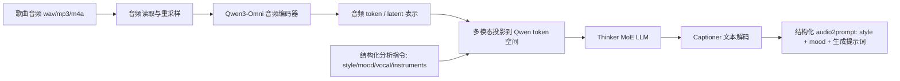
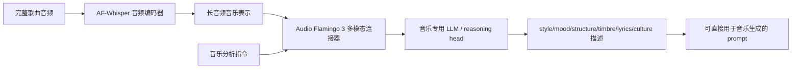
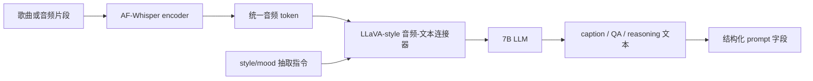
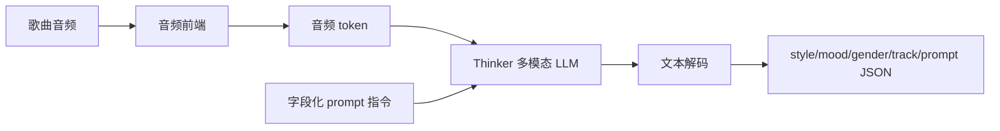
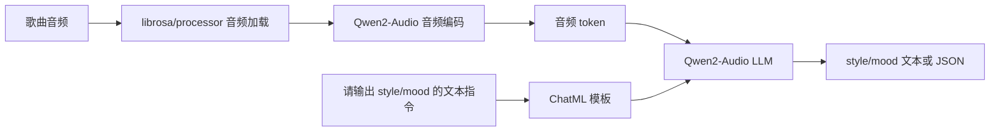
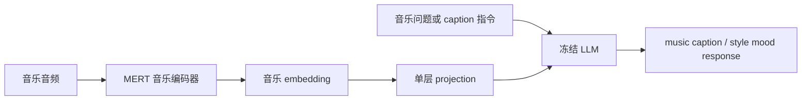
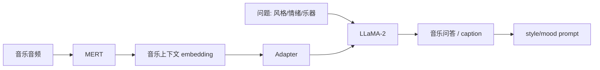
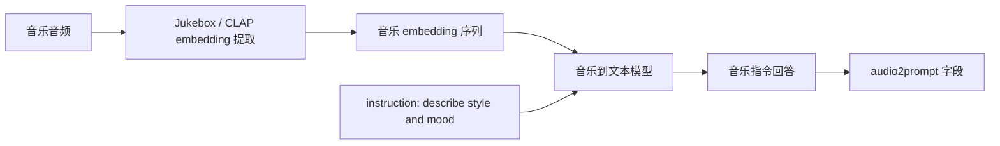
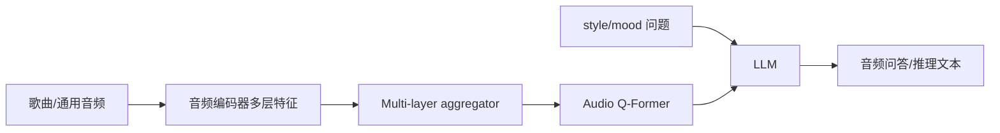
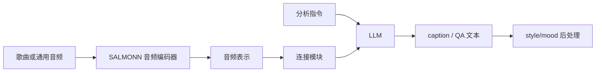

# Audio2Prompt / 歌曲 Style 与 Mood 抽取 SOTA Research

生成日期：2026-06-11

检索范围：2022-2026 年公开论文、官方 GitHub、Hugging Face、ModelScope、项目主页；任务限定为“输入歌曲/音乐音频，输出可用于音乐生成或检索的 style、mood、genre、instrument、vocal、tempo、scene 等文本 prompt 信息”。

用户关心的 baseline：Qwen2-Audio、Qwen2.5-Omni、LP-MusicCaps。

用户偏好：开源优先、模型可下载优先、工业落地优先。

## 核验范围

本次检索按三类方法核验：

1. 直接可用于 audio2prompt 的音乐/音频大模型：Qwen3-Omni Captioner、Music Flamingo、Audio Flamingo 3、Qwen2.5-Omni、Qwen2-Audio、MusiLingo、MU-LLaMA、LLark。
2. 相邻但可作为 style/mood 抽取底座的通用音频 LLM：Audio Flamingo 2、GAMA、SALMONN、Pengi。
3. 数据集或训练基线：LP-MusicCaps、MusicCaps、MusicInstruct、MusicQA。这类只作为 baseline 或训练资源，不按“可直接部署模型”处理。

核验平台：

- GitHub：是否有官方代码、推理入口、训练入口。
- Hugging Face：是否有官方模型权重、Space、模型卡。
- ModelScope：是否有可信官方镜像，特别考虑国内下载稳定性。
- 论文/项目页：是否说明结构、数据、benchmark、baseline 和许可证。

## 排序规则

排序优先级如下：

1. 输入是否直接支持歌曲/音乐音频，而不是只支持 speech 或环境声。
2. 输出是否适合生成结构化 style/mood prompt，而不是只做标签分类或检索。
3. 是否有官方代码和官方模型权重，能否本地推理。
4. 是否有音乐理解 benchmark 或 MusicCaps/LP-MusicCaps/LLark/MU-LLaMA/Qwen2-Audio/Qwen2.5-Omni 等强基线对比。
5. 工业落地成本：显存、推理复杂度、许可证、中文/英文 prompt 可控性。

结论先给：如果目标是“拿一首歌自动生成 Style / Mood / gender / track / lyrics-like 描述字段”，最优先尝试 `Qwen3-Omni-30B-A3B-Captioner`；如果只看音乐理解深度和英文音乐理论描述，优先看 `Music Flamingo`；如果要更稳定的工程落地和国内下载，`Qwen2.5-Omni-7B/3B` 是当前更现实的生产候选。

## 总览表

| 排名 | 名称 | 年份 | 任务相关性 | GitHub | Hugging Face | ModelScope | 是否超过指定 baseline / 强基线 | 结论 |
|---:|---|---:|---|---|---|---|---|---|
| 1 | Qwen3-Omni-30B-A3B-Captioner | 2025 | 直接相关 | ✅ 官方代码 | ✅ 官方模型 | ✅ 官方模型 | 明确强于 Qwen2.5-Omni 的一代升级；专门发布音频 captioner | 最优先落地，适合直接抽 style/mood |
| 2 | Music Flamingo | 2025 | 直接相关 | ✅ 官方代码 | ✅ 官方模型 | 未找到 | 音乐理解专用，目标强于 Qwen2-Audio/Qwen2.5-Omni 等通用音频模型 | 音乐语义最强候选，但许可证需确认 |
| 3 | Audio Flamingo 3 | 2025 | 高相关 | ✅ 官方代码 | ✅ 官方模型 | 未找到 | 官方称超过 GAMA、AF2、Qwen-Audio、Qwen2-Audio、Qwen2.5-Omni、SALMONN 等 | 通用音频强，音乐可用但非 style/mood 专用 |
| 4 | Qwen2.5-Omni-7B/3B | 2025 | 高相关 | ✅ 官方代码 | ✅ 官方模型 | ✅ 官方模型 | 明确超过 Qwen2-Audio；MusicCaps 指标超过 LP-MusicCaps | 工业落地最稳，国内下载友好 |
| 5 | Qwen2-Audio-7B-Instruct | 2024 | 高相关 | ✅ 官方代码 | ✅ 官方模型 | ✅ 官方模型 | 是 Qwen2.5-Omni 的上一代 baseline | 仍可用，但建议作为对照而非新系统主力 |
| 6 | MusiLingo | 2023 | 直接相关 | ✅ 官方代码入口 | 未找到官方模型 | 未找到 | 直接针对 music captioning / query response | 结构清晰，适合作为训练路线参考 |
| 7 | MU-LLaMA | 2023 | 直接相关 | ✅ 官方代码 | ✅ 官方模型入口 | 未找到 | 在 MusicQA 上超过 LTU 和 LLaMA Adapter | 可跑但依赖 LLaMA/MERT，工程复杂 |
| 8 | LLark | 2024 | 直接相关 | ✅ 官方代码 | 未找到官方模型 | 未找到 | ICML 2024 音乐指令跟随模型；无公开训练好权重 | 研究价值高，复现成本高 |
| 9 | GAMA | 2024 | 相邻任务/降权参考 | ✅ 官方代码 | 仅官方 Space/Demo | 未找到 | 通用音频推理强，非音乐专用 | 可做复杂音频问答基线，不是首选 audio2prompt |
| 10 | SALMONN | 2024 | 相邻任务/降权参考 | ✅ 官方代码 | ✅ 官方模型 | 未找到 | 通用听觉能力强，音乐不是主任务 | 适合作为泛音频兜底模型 |

## Baseline 核验

### Qwen2-Audio

Qwen2-Audio 是 2024 年 Qwen 系列大音频语言模型，官方提供 GitHub、Hugging Face 和 ModelScope。它支持两种交互模式：仅音频语音交互，以及“音频 + 文本指令”的 audio analysis。对本任务来说，它能直接接收歌曲音频并回答“这首歌是什么风格、情绪、乐器、节奏、男女声”等问题，但它不是音乐专用 captioner，输出稳定性依赖 prompt 约束。

### Qwen2.5-Omni

Qwen2.5-Omni 是 Qwen2-Audio 的全模态升级版，官方 GitHub 中明确给出音乐 benchmark：MusicCaps 上 Qwen2.5-Omni-3B/7B 的指标超过 LP-MusicCaps baseline；同时提供 HF 和 ModelScope 权重，且有 3B/7B/量化版本，更适合工业落地。

### LP-MusicCaps

LP-MusicCaps 是 2023 年提出的 LLM-based pseudo music caption 数据集/训练策略：用 LLM 从大规模 tag 数据生成伪音乐 caption，约 2.2M caption 和 0.5M audio clip。它是非常重要的训练数据 baseline，但不是一个可以直接部署的 audio2prompt 模型。因此本报告把它作为数据和指标基线，不把它排成“可落地模型第一梯队”。

## Top 方法深度解析

### [1] Qwen3-Omni-30B-A3B-Captioner

- 论文：Qwen3-Omni Technical Report，2025
- GitHub：https://github.com/QwenLM/Qwen3-Omni
- Hugging Face：https://huggingface.co/Qwen/Qwen3-Omni-30B-A3B-Captioner
- ModelScope：https://modelscope.cn/models/Qwen/Qwen3-Omni-30B-A3B-Captioner
- 开源结论：代码+模型已开源
- baseline / 强基线判断：Qwen3-Omni 是 Qwen2.5-Omni 后续升级，官方报告称在 36 个 audio/audio-visual benchmark 中 32 个达到开源 SOTA、22 个达到 overall SOTA；Captioner 是基于 Qwen3-Omni-30B-A3B 专门微调的详细音频 caption 模型。

#### 解决的问题

它解决的是“任意音频输入到低幻觉、细粒度文字描述”的问题。对歌曲 audio2prompt 来说，最关键的是它不只给 `pop/rock/happy/sad` 这种浅标签，而是可以通过 prompt 强制输出：

- `style`：genre、production style、arrangement、年代感。
- `mood`：情绪强度、氛围、使用场景。
- `vocal/gender`：是否有人声、男女声、演唱方式。
- `instrument/texture`：鼓、bass、synth、guitar、piano、pad、弦乐等。
- `tempo/energy`：速度、律动、动态范围。

#### 输入

输入是音频文件，也可混合文本指令。实际业务调用时建议输入完整歌曲或 30-60 秒代表性片段，并附加结构化指令：

```text
请分析这首歌，输出 JSON：
style, mood, vocal_gender, instruments, tempo_energy, track_type, prompt_for_music_generation。
```

#### 输出

输出是自然语言或 JSON 文本。它不直接输出 embedding，而是生成可读、可控、可后处理的文本 prompt。适合下游音乐生成、音乐检索、推荐标签、素材审核。

#### 主干

主干是 Qwen3-Omni 的 Thinker-Talker MoE 架构。本任务只需要音频理解与文字输出，主要用 Thinker 部分：音频编码器把 waveform 转成音频 token/特征，投影到统一多模态序列，再由 MoE LLM 解码成 caption。Captioner 是在通用 Omni 模型上针对音频 caption 做下游微调，因此比普通聊天模型更适合稳定输出细节描述。

#### 关键模块

- 音频前端：处理 speech/music/sound 的连续波形。
- 多模态投影层：把音频表示对齐到 LLM token 空间。
- Thinker MoE：负责跨模态理解和文本生成。
- Captioner 微调头/训练配方：强化细粒度、低幻觉音频描述。
- Transformers/vLLM/Docker 推理入口：官方提供本地推理路径，适合工程接入。

#### 信号流



#### 训练 / 推理策略

训练上，Qwen3-Omni 先做全模态预训练和多模态混合训练，再专门微调 Captioner。推理上，业务不需要 Talker 语音输出，只保留音频输入到文本输出路径，可用 HF Transformers 或 vLLM。显存压力大，30B-A3B 更适合 A100/H100 或多卡；如果只做批量离线标注，可以接受高延迟。

#### 实验结果

官方报告给出总体音频 benchmark 结论：36 个 audio/audio-visual benchmark 中 32 个开源 SOTA、22 个 overall SOTA。对本任务最关键的是官方明确发布 `Qwen3-Omni-30B-A3B-Captioner`，定位就是详细、低幻觉的任意音频 caption。

#### 毒舌点评

这是当前最像“直接拿来干活”的方案。缺点也明显：30B-A3B 不是小模型，成本不低；如果业务只需要五六个标签，它可能显得过重。但如果要从歌曲生成高质量 style/mood prompt，它比纯标签分类器靠谱得多。

#### 为什么值得看

它同时满足三个条件：官方代码、官方权重、国内 ModelScope 可下载。对工业系统来说，这比论文指标更重要。

### [2] Music Flamingo

- 论文：Music Flamingo: Scaling Music Understanding in Audio Language Models，2025
- GitHub：https://github.com/NVIDIA/audio-flamingo
- Hugging Face：NVIDIA 官方页面在仓库中给出模型入口
- ModelScope：未找到可信官方 ModelScope 镜像
- 开源结论：代码+模型已开源
- baseline / 强基线判断：官方定位为音乐专用 LALM，基于 Audio Flamingo 3 backbone，强调在 10+ 公共音乐理解和推理任务上建立新 benchmark。

#### 解决的问题

Music Flamingo 解决的是“通用音频 LLM 对音乐理解不够深”的问题。它不是只识别 `sound event`，而是针对歌曲和器乐音乐做 rich caption、music QA、harmony/structure/timbre/lyrics/cultural context 理解。

#### 输入

输入是歌曲或器乐音频，可配合问题指令。例如：

```text
Analyze this song and describe its style, mood, arrangement, vocals, instrumentation and suitable music-generation prompt.
```

#### 输出

输出是音乐理论感更强的英文文本描述，适合生成音乐 prompt、音乐检索 query、音乐审核标签。它对“风格 + 情绪 + 编曲 + 声学质感”的描述通常比普通 audio LLM 更细。

#### 主干

主干来自 Audio Flamingo 3：AF-Whisper 音频编码器负责把长音频转为可被 LLM 使用的音频表示，LLaVA/LLM 风格的多模态结构负责根据文本指令生成回答。Music Flamingo 在此基础上加入音乐专用训练、音乐 reasoning 数据和 RL/reward 训练，使模型更懂音乐结构和长歌上下文。

#### 关键模块

- AF-Whisper audio encoder：统一处理 sound/music/speech。
- 音频-文本连接器：把音频 token 接入 LLM。
- 音乐专用 instruction/caption 数据：强化 style、timbre、lyrics、harmony、structure。
- Chain-of-thought + reinforcement learning：强化多步音乐推理。
- 长音频上下文：覆盖完整歌曲而不是只看 10 秒片段。

#### 信号流



#### 训练 / 推理策略

训练重点不是 ASR，而是音乐 caption、QA、reasoning。官方描述包含 CoT 和 reinforcement learning with custom rewards。推理时推荐让模型输出固定 schema，否则英文自由描述会较长，需要后处理。

#### 实验结果

官方仓库称 Music Flamingo 在 10+ 公共音乐理解和推理任务上建立新 benchmark；Audio Flamingo 3 backbone 官方称超过 GAMA、Audio Flamingo、Audio Flamingo 2、Qwen-Audio、Qwen2-Audio、Qwen2.5-Omni、LTU、SALMONN、Gemini Flash v2、Gemini Pro v1.5 等强基线。

#### 毒舌点评

音乐理解深度很强，但工业落地要先查清 checkpoint 许可证和商用限制。它更像“音乐研究者喜欢的模型”，不是一定最省事的生产模型。

#### 为什么值得看

如果你的核心是“歌曲 prompt 质量”，Music Flamingo 是比通用音频模型更对口的路线。

### [3] Audio Flamingo 3

- 论文：Audio Flamingo 3: Advancing Audio Intelligence with Fully Open Large Audio Language Models，2025
- GitHub：https://github.com/NVIDIA/audio-flamingo
- Hugging Face：NVIDIA 官方模型入口
- ModelScope：未找到可信官方 ModelScope 镜像
- 开源结论：代码+模型已开源
- baseline / 强基线判断：官方称 AF3 超过 GAMA、Audio Flamingo、Audio Flamingo 2、Qwen-Audio、Qwen2-Audio、Qwen2.5-Omni、SALMONN 等模型。

#### 解决的问题

Audio Flamingo 3 解决的是通用音频理解模型的覆盖度问题：同一个模型处理 speech、sound、music，并支持较长音频输入。对歌曲 style/mood 抽取，它不是音乐专用模型，但底座很强。

#### 输入

音频输入最长可到分钟级，配合文本指令。用于本任务时，输入建议为完整歌曲或 verse/chorus 片段。

#### 输出

输出为文本回答，可要求生成 JSON 或 MusicGen/Suno/Udio 风格的 prompt 字段。

#### 主干

AF3 基于 7B language model 和 LLaVA 类架构，音频编码器为统一 AF-Whisper encoder，训练数据规模约 50M audio-text pairs。它把音频理解从单一 caption 扩展到分类、问答、推理和长音频理解。

#### 关键模块

- AF-Whisper encoder：面向 speech/sound/music 的统一音频表示。
- LLaVA-style connector：对齐音频特征和 LLM。
- 7B LLM：生成自然语言回答。
- 50M audio-text pairs：提升泛化。
- 长音频处理：支持更完整的歌曲结构判断。

#### 信号流



#### 训练 / 推理策略

训练为大规模 audio-text 指令学习。推理时建议用强 schema 约束输出，否则通用模型容易混入环境声描述，对歌曲 prompt 的字段一致性不如专用 Captioner。

#### 实验结果

官方仓库称 AF3 在多个 understanding 和 reasoning benchmark 上超过 GAMA、AF2、Qwen-Audio、Qwen2-Audio、Qwen2.5-Omni、LTU、SALMONN 等。

#### 毒舌点评

AF3 很强，但对“style/mood prompt”仍需要 prompt engineering 和后处理。它是强底座，不是开箱即用的业务字段抽取器。

#### 为什么值得看

如果你要同时处理歌曲、环境声、语音素材，并希望一个模型统一做 caption/QA/reasoning，AF3 比音乐单任务模型更通用。

### [4] Qwen2.5-Omni-7B/3B

- 论文：Qwen2.5-Omni Technical Report，2025
- GitHub：https://github.com/QwenLM/Qwen2.5-Omni
- Hugging Face：https://huggingface.co/Qwen/Qwen2.5-Omni-7B
- ModelScope：https://modelscope.cn/models/Qwen/Qwen2.5-Omni-7B
- 开源结论：代码+模型已开源
- baseline / 强基线判断：官方表格显示 MusicCaps 上 Qwen2.5-Omni-3B/7B 超过 LP-MusicCaps baseline，并且整体音频能力超过 Qwen2-Audio。

#### 解决的问题

它解决的是“一个端到端模型同时理解文本、图像、音频、视频，并输出文本/语音”的问题。对本任务来说，它的价值是成熟、稳定、下载路径完整，并且 3B/7B/量化版本适合工程部署。

#### 输入

歌曲音频 + 文本指令。支持本地文件、URL、混合多模态输入。

#### 输出

文本回答或语音回答。本任务只需要文本，可以让模型输出固定字段：

```json
{"style": "...", "mood": "...", "gender": "...", "track": "Song/Acc", "prompt": "..."}
```

#### 主干

Qwen2.5-Omni 使用 Thinker-Talker 架构。Thinker 负责多模态理解和文本生成；Talker 负责流式语音生成。本任务只用 Thinker。TMRoPE 用于对齐音视频时间信息，虽然歌曲 style/mood 不一定需要视频，但说明它对时序模态建模更完整。

#### 关键模块

- 音频编码器：提取音频语义。
- Thinker：融合音频 token 和文本指令。
- Talker：语音输出，本任务可关闭。
- TMRoPE：时间对齐位置编码。
- vLLM / Docker / ModelScope：工程部署路径完整。

#### 信号流



#### 训练 / 推理策略

训练覆盖多模态理解、音频理解、语音生成和指令跟随。推理上有 7B、3B、GPTQ-Int4、AWQ 版本；国内 ModelScope 下载可用，是生产接入优势。

#### 实验结果

官方 GitHub 表格显示：OmniBench 平均分 Qwen2.5-Omni-7B 为 56.13，高于 Gemini-1.5-Pro 的 42.91；MusicCaps 指标中 Qwen2.5-Omni-7B 高于 LP-MusicCaps baseline；MMAU 上 Qwen2.5-Omni-7B 平均 64.50，高于 Qwen2-Audio 的 49.20。

#### 毒舌点评

它不是音乐专精模型，但工程上最省心。很多业务场景下，“稳定可下载 + 推理脚本清楚 + 输出能控”比论文里多 2 分更有价值。

#### 为什么值得看

如果你要下周上线一个 audio2prompt 服务，而不是写论文，Qwen2.5-Omni 是最现实候选之一。

### [5] Qwen2-Audio-7B-Instruct

- 论文：Qwen2-Audio Technical Report，2024
- GitHub：https://github.com/QwenLM/Qwen2-Audio
- Hugging Face：https://huggingface.co/Qwen/Qwen2-Audio-7B-Instruct
- ModelScope：https://modelscope.cn/models/Qwen/Qwen2-Audio-7B-Instruct
- 开源结论：代码+模型已开源
- baseline / 强基线判断：这是用户指定 baseline，也是 Qwen2.5-Omni 的直接前代。

#### 解决的问题

Qwen2-Audio 把音频任务统一成 audio + text instruction 到 text response。它可以做 audio caption、audio QA、speech understanding，也可让它分析歌曲风格和情绪。

#### 输入

支持纯语音交互，也支持音频 + 文本指令分析。对歌曲任务建议使用 audio analysis 模式，而不是 voice chat 模式。

#### 输出

自由文本回答，可通过 prompt 约束成字段化 JSON。

#### 主干

音频编码器把 waveform 转为特征，特征经过适配层接入 Qwen LLM，LLM 根据聊天模板和文本指令生成回答。结构比 Qwen2.5-Omni 更简单，没有完整全模态 Thinker-Talker 设计。

#### 关键模块

- AutoProcessor / Qwen2AudioForConditionalGeneration。
- Audio analysis mode：音频与文本指令共同输入。
- ChatML template：控制问答上下文。
- BF16 8B 参数权重：适合单卡大显存推理。

#### 信号流



#### 训练 / 推理策略

训练目标覆盖多类音频理解任务。推理 API 在 HF model card 中非常清楚，本地代码短，适合快速 baseline。缺点是对音乐 prompt 的细腻程度不如后续 Qwen2.5-Omni/Qwen3-Omni。

#### 实验结果

HF model card 显示 Qwen2-Audio-7B-Instruct 为 Apache-2.0、8B BF16，并给出 audio analysis 推理代码。Qwen2.5-Omni 官方表格中多项音频任务超过它，因此它更适合作为 baseline。

#### 毒舌点评

还能用，但不建议新系统从它开始。除非你的显存或依赖环境刚好更适合 Qwen2-Audio。

#### 为什么值得看

它是一个清晰、可复现、可下载的强 baseline，适合验证数据和 prompt 后再迁移到 Qwen2.5/3。

### [6] MusiLingo

- 论文：MusiLingo: Bridging Music and Text with Pre-trained Language Models for Music Captioning and Query Response，2023
- GitHub：https://github.com/microsoft/muzic/tree/main/musilingo
- Hugging Face：未找到官方模型
- ModelScope：未找到可信官方 ModelScope 镜像
- 开源结论：仅代码已开源
- baseline / 强基线判断：它直接对标 music captioning 和 music query response，训练数据包含 MusicInstruct。

#### 解决的问题

MusiLingo 解决的是“音乐音频特征和冻结 LLM 文本空间如何对齐”的问题。它很适合分析 audio2prompt 的训练路线：把音乐编码器特征通过简单投影接入 LLM，再做 caption 和 instruction tuning。

#### 输入

音乐音频 + 查询问题。

#### 输出

音乐 caption 或 query response，例如风格、情绪、乐器、节奏、场景。

#### 主干

主干是冻结 MERT 音乐音频模型 + 单层 projection + 冻结 LLM。相比 Qwen/Flamingo 这类大一统模型，它更窄，但更贴近音乐 caption 任务。

#### 关键模块

- MERT：音乐音频表示。
- Single projection layer：把 MERT embedding 对齐到 LLM。
- Frozen LLM：生成 caption/QA。
- MusicInstruct：从 MusicCaps caption 构造开放式音乐问答数据。

#### 信号流



#### 训练 / 推理策略

训练分两步：先用大规模音乐 caption 数据对齐音乐表示和 LLM，再用 MusicInstruct 做 instruction tuning。它的结构对自研小模型很有参考价值。

#### 实验结果

论文摘要说明在 music caption generation 和 music-related QA 上有竞争力，并引入 MusicInstruct 提升开放式音乐问答。

#### 毒舌点评

思路干净，但官方可下载权重没有像 Qwen 那样完整，落地要自己补模型或训练。

#### 为什么值得看

如果你想自己训练一个轻量 audio2prompt 模型，MusiLingo 的结构比巨型 Omni 模型更容易借鉴。

### [7] MU-LLaMA

- 论文：Music Understanding LLaMA，2023
- GitHub：https://github.com/shansongliu/MU-LLaMA
- Hugging Face：官方 README 给出预训练权重下载入口
- ModelScope：未找到可信官方 ModelScope 镜像
- 开源结论：代码+模型已开源
- baseline / 强基线判断：官方结果在 MusicQA 上超过 LTU 和 LLaMA Adapter。

#### 解决的问题

MU-LLaMA 解决的是音乐问答和音乐 caption，用于生成 text-to-music 数据集。它是早期比较直接的“音乐音频 -> LLM 文本”的方案。

#### 输入

音乐音频 + question，例如 “Describe the music style and mood.”

#### 输出

音乐 caption 或 QA answer。

#### 主干

主干是 MERT + LLaMA/LLaMA-2 + adapter。MERT 提取音乐上下文，adapter 把音乐信息注入 LLaMA，LLaMA 负责自然语言生成。

#### 关键模块

- MERT：音乐编码器。
- Adapter：音乐上下文注入。
- LLaMA-2 7B：语言生成。
- MusicQA：由 MusicCaps、MagnaTagATune、MTG-Jamendo 构造的音乐 QA 数据。
- Gradio 和底层 inference.py：官方提供推理入口。

#### 信号流



#### 训练 / 推理策略

预训练使用 MusicCaps 相关 MusicQA 和 Alpaca instruction；微调使用 MTT 部分 MusicQA。官方 README 给出 `gradio_app.py` 和 `inference.py`。但 LLaMA 权重获取、MERT 路径和 checkpoint 组织比较麻烦。

#### 实验结果

官方表格：LTU 的 BLEU/METEOR/ROUGE-L/BERTScore 为 0.242/0.274/0.326/0.887，MU-LLaMA 为 0.306/0.385/0.466/0.901，明显更强。

#### 毒舌点评

能跑，但不像 Qwen 那样现代化。依赖链多，许可证和 LLaMA 权重也会让工程部署变麻烦。

#### 为什么值得看

它很适合作为“音乐专用小体系”的参考实现，尤其是 MERT + adapter + LLM 这条线。

### [8] LLark

- 论文：LLark: A Multimodal Instruction-Following Language Model for Music，ICML 2024
- GitHub：https://github.com/spotify-research/llark
- Hugging Face：未找到官方模型
- ModelScope：未找到可信官方 ModelScope 镜像
- 开源结论：仅代码已开源
- baseline / 强基线判断：音乐指令跟随模型，代码包含数据构建、预处理、训练、推理和评估；官方明确没有发布训练好模型。

#### 解决的问题

LLark 解决的是音乐指令跟随：让模型围绕音乐音频回答开放问题、生成描述、做音乐理解。它比普通 caption 模型更强调 instruction following。

#### 输入

音乐音频经过 Jukebox/CLAP embedding 预处理，再输入音乐到文本模型。

#### 输出

音乐描述、问答、标签解释。

#### 主干

LLark 使用音乐 embedding 作为多模态输入，接入 LLM 进行指令跟随。仓库包括 Jukebox embedding pipeline、CLAP embedding 工具、训练脚本和评估 notebook。

#### 关键模块

- Jukebox embedding：高层音乐特征。
- CLAP embedding：可选音乐/文本对齐特征。
- M2T training/inference pipeline：音乐到文本。
- Apache Beam/Dataflow 数据预处理：大规模数据处理。

#### 信号流



#### 训练 / 推理策略

官方仓库说明包含构建训练数据、预处理、训练和推理代码，但没有训练好的模型。预处理依赖 Docker 和 Google Cloud Dataflow，复现成本高。

#### 实验结果

ICML 2024 论文工作，官方仓库提供评估 notebook 和 demo 页面，但没有可直接下载权重。

#### 毒舌点评

研究完整度高，工程落地完整度低。没有权重，对业务来说就是“你得自己训练”。

#### 为什么值得看

如果你要做自己的音乐指令数据集和训练 pipeline，LLark 的数据工程比很多论文诚实。

### [9] GAMA

- 论文：GAMA: A Large Audio-Language Model with Advanced Audio Understanding and Complex Reasoning Abilities，EMNLP 2024
- GitHub：https://github.com/Sreyan88/GAMA
- Hugging Face：仅官方 Space/Demo
- ModelScope：未找到可信官方 ModelScope 镜像
- 开源结论：代码已开源，checkpoint 通过 Google Drive 提供；HF 主要是 Space/Demo
- baseline / 强基线判断：官方称在复杂音频推理、deductive reasoning、hallucination benchmark 上强于多种 LALM。

#### 解决的问题

GAMA 解决的是通用音频理解和复杂推理，不是音乐专用 caption。对歌曲 style/mood，它可以回答，但可能会把注意力放在 sound event 或推理问答，而不是音乐生成 prompt。

#### 输入

16kHz 音频 + instruction。

#### 输出

开放式问答或推理文本。

#### 主干

GAMA 把 LLM 与多种音频表示结合，包括 Audio Q-Former、多层 audio encoder aggregator，并用大规模 audio-language 数据微调，再用 CompA-R 做复杂推理 instruction tuning。

#### 关键模块

- Audio encoder 多层特征。
- Audio Q-Former。
- Multi-layer aggregator。
- LLM。
- CompA-R reasoning instruction 数据。
- Soft prompt 设计，但仓库说明当前代码不包含 soft-prompt 实现。

#### 信号流



#### 训练 / 推理策略

训练分多 stage；仓库给出 stage1-stage5 shell。推理需要手动下载 Google Drive checkpoint 并改代码路径。

#### 实验结果

官方 README 写明 GAMA 在复杂音频推理、人类标注的开放式音频问答、音频幻觉评测上表现强，并在多种音频理解任务上提升 1%-84%。

#### 毒舌点评

GAMA 强在“推理”，不是强在“音乐 prompt 字段稳定”。如果要做 style/mood，除非你已经在用它做通用音频 QA，否则不建议排第一梯队。

#### 为什么值得看

它适合作为复杂音频理解的对照模型，尤其用于检查模型是否会编造情绪和乐器。

### [10] SALMONN

- 论文：SALMONN: Towards Generic Hearing Abilities for Large Language Models，ICLR 2024
- GitHub：https://github.com/bytedance/SALMONN
- Hugging Face：官方 README 给出 SALMONN-7B、SALMONN-13B checkpoint / demo 入口
- ModelScope：未找到可信官方 ModelScope 镜像
- 开源结论：代码+模型已开源
- baseline / 强基线判断：通用 hearing LLM，覆盖 speech、audio、music，但不是音乐专用模型。

#### 解决的问题

SALMONN 解决的是让 LLM 获得通用听觉能力，包括语音、环境声和音乐。对 audio2prompt 来说，它能做兜底分析，但对歌曲 style/mood 的音乐细节不如专用模型。

#### 输入

音频 + 文本指令。

#### 输出

文本回答，包括 ASR、caption、audio QA 等。

#### 主干

SALMONN 系列通常由音频编码器提取声学特征，经过连接模块接入 LLM。后续家族包含 video-SALMONN、speech quality assessment、ELLSA 等分支。

#### 关键模块

- Audio encoder。
- Audio-text connector。
- LLM。
- 多阶段训练数据：AQA/SQA/storytelling 等。
- 推理和训练代码：官方逐步开放。

#### 信号流



#### 训练 / 推理策略

官方提供模型和推理代码，训练数据标注也逐步开放。用于歌曲 prompt 时，需要明确要求不要只写泛音频 caption，而要输出音乐字段。

#### 实验结果

SALMONN 是 ICLR 2024 工作，后续仓库持续扩展到 video-SALMONN、QualiSpeech、ELLSA 等，说明其作为通用音频 LLM 底座仍有研究价值。

#### 毒舌点评

它不是不好，而是不够对口。做歌曲 style/mood，优先级应低于 Qwen3-Omni Captioner、Music Flamingo、Qwen2.5-Omni。

#### 为什么值得看

适合作为老牌开源 audio LLM baseline，尤其用于评估新模型是否真的超过 2024 年通用听觉路线。

## 复现/落地优先级

1. Qwen2.5-Omni-7B/3B：最适合先做工程 POC。官方代码、HF、ModelScope、Docker、量化版本齐全，国内下载稳定，成本可控。
2. Qwen3-Omni-30B-A3B-Captioner：最适合做高质量离线标注或效果上限验证。缺点是显存和推理成本较高。
3. Music Flamingo：最适合追求音乐描述深度，但落地前必须检查 checkpoint 许可证和商用限制。
4. Qwen2-Audio-7B-Instruct：适合作为 baseline 验证 prompt schema，不建议作为最终模型。
5. MU-LLaMA：音乐专用、能跑，但依赖 LLaMA/MERT，环境较老。
6. SALMONN/GAMA：适合通用音频 QA 兜底，不适合作为歌曲 style/mood 第一选择。
7. LLark/MusiLingo：适合训练路线研究，不适合直接上线。

## 论文效果/技术价值优先级

1. Music Flamingo：音乐理解最对口，强调歌曲、器乐、和声、结构、音色、歌词文化上下文。
2. Qwen3-Omni Captioner：通用音频 caption 上限最高，开源完整度强。
3. Audio Flamingo 3：通用音频理解技术价值高，可作为跨 speech/sound/music 的统一底座。
4. Qwen2.5-Omni：工程价值高，技术上是 Thinker-Talker 全模态架构代表。
5. LLark：音乐指令跟随数据工程价值高。
6. MusiLingo：MERT + projection + LLM 的简洁路线适合自研轻量模型。
7. MU-LLaMA：早期音乐 LLM，可作为 MERT adapter baseline。
8. GAMA：复杂音频 reasoning 价值高。
9. SALMONN：通用 hearing LLM 经典基线。
10. Qwen2-Audio：作为 Qwen2.5/Qwen3 前代 baseline。

## 最终建议

如果你的目标是快速搭建一个“歌曲文件 -> style/mood prompt”的服务，建议按下面顺序推进：

1. 第一轮 POC：用 `Qwen2.5-Omni-7B` 或 `Qwen2.5-Omni-3B`，固定 JSON schema，批量测试你自己的歌曲样本。理由是下载、部署、显存和稳定性最平衡。
2. 效果上限测试：用 `Qwen3-Omni-30B-A3B-Captioner` 跑同一批样本，比较 style/mood 细节、幻觉率和字段完整度。若效果明显更好，可作为离线标注模型。
3. 音乐理解增强：用 `Music Flamingo` 跑英文 prompt 版本，重点看 harmony、structure、timbre、lyrics/culture 这些字段是否比 Qwen 系列更细。
4. 自研轻量模型：如果线上成本过高，可参考 `MusiLingo/MU-LLaMA/LLark`，用 MERT/CLAP/Jukebox embedding + LLM adapter 训练小模型，训练数据可从 LP-MusicCaps、MusicCaps、MusicInstruct、自有标注数据构建。

建议输出格式固定为：

```json
{
  "style": "genre + production + arrangement",
  "mood": "emotion + scene + energy",
  "vocal": "Female/Male/Instrumental + vocal style",
  "track": "Song/Acc",
  "instruments": ["drums", "bass", "synth", "guitar"],
  "tempo_energy": "slow/mid/upbeat + groove",
  "music_generation_prompt": "one-paragraph prompt for generation"
}
```

最终推荐：

- 生产优先：Qwen2.5-Omni-7B/3B。
- 质量优先：Qwen3-Omni-30B-A3B-Captioner。
- 音乐专业描述优先：Music Flamingo。
- 训练自研模型优先：MusiLingo + LP-MusicCaps/MusicInstruct 路线。

## 参考链接

- Qwen3-Omni GitHub：https://github.com/QwenLM/Qwen3-Omni
- Qwen3-Omni Captioner Hugging Face：https://huggingface.co/Qwen/Qwen3-Omni-30B-A3B-Captioner
- Qwen3-Omni Captioner ModelScope：https://modelscope.cn/models/Qwen/Qwen3-Omni-30B-A3B-Captioner
- Qwen2.5-Omni GitHub：https://github.com/QwenLM/Qwen2.5-Omni
- Qwen2.5-Omni Hugging Face：https://huggingface.co/Qwen/Qwen2.5-Omni-7B
- Qwen2.5-Omni ModelScope：https://modelscope.cn/models/Qwen/Qwen2.5-Omni-7B
- Qwen2-Audio GitHub：https://github.com/QwenLM/Qwen2-Audio
- Qwen2-Audio Hugging Face：https://huggingface.co/Qwen/Qwen2-Audio-7B-Instruct
- Qwen2-Audio ModelScope：https://modelscope.cn/models/Qwen/Qwen2-Audio-7B-Instruct
- Audio/Music Flamingo GitHub：https://github.com/NVIDIA/audio-flamingo
- Audio Flamingo 2 Hugging Face：https://huggingface.co/nvidia/audio-flamingo-2
- MusiLingo arXiv：https://arxiv.org/abs/2309.08730
- MusiLingo GitHub：https://github.com/microsoft/muzic/tree/main/musilingo
- MU-LLaMA GitHub：https://github.com/shansongliu/MU-LLaMA
- LLark GitHub：https://github.com/spotify-research/llark
- GAMA GitHub：https://github.com/Sreyan88/GAMA
- SALMONN GitHub：https://github.com/bytedance/SALMONN
- LP-MusicCaps arXiv：https://arxiv.org/abs/2307.16372
