# 多模态目标说话人/歌声提取 SOTA Research

生成日期：2026-07-02

检索范围：2021-2026 年音视频目标说话人提取（AV-TSE）、音视频语音/歌声分离、主动说话人检测辅助方案。重点面向本项目“先用 `bs_roformer` 得到人声 stem，再用视频主体脸/唇信息删除非主体人声，最后与伴奏合成回视频”的工程目标。

用户关心的 baseline：`ClearerVoice-Studio / AV_MossFormer2_TSE_16K`。这是上一轮检索中最适合首轮落地验证的方案：有官方代码、官方权重、统一推理接口、Hugging Face 模型页和 ModelScope 镜像。

## 核验范围

本轮核验了以下来源：

- 论文：arXiv HTML/PDF、IEEE/TASLP/ICASSP 论文信息、项目论文页。
- GitHub：官方仓库、README、训练/推理脚本说明、数据/权重链接、仓库可达性。
- Hugging Face：模型页、文件树、权重文件、Space/Demo。
- ModelScope：模型镜像、Studio/Demo、下载说明。
- 项目页/Demo：VisualVoice、Acappella-YNet、VoViT、TalkNet-ASD、ClearVoice Space。

注意：GitHub API 在部分查询中曾遇到匿名限流，因此本报告只对已检查到的官方仓库、README、论文正文、模型页和公开搜索结果负责。对未找到项，结论写作层级限定为“未找到官方代码/模型/可信官方 ModelScope 镜像”，不扩展成“社区完全没有实现”。

## 排序规则

排序同时考虑：

- 与本项目任务的直接相关性：是否能利用视频主体视觉线索提取目标人声。
- 是否有官方开源代码。
- 是否有官方开源模型、权重、Space 或 Demo。
- 是否有可复现训练/推理脚本和数据说明。
- 是否有明确 benchmark、baseline、指标和关键数值。
- 对本项目落地链路的工程成本：能否接 `master_t264_vocal.wav` 这类人声 stem 和视频画面。
- 许可证和工业落地风险。

## 总览表

| 排名 | 名称 | 年份 | 任务相关性 | GitHub | Hugging Face | ModelScope | 是否超过指定 baseline / 强基线 | 结论 |
|---:|---|---:|---|---|---|---|---|---|
| 1 | ClearerVoice-Studio / AV_MossFormer2_TSE_16K | 2025 | 直接相关 | ✅ 官方代码 | ✅ 官方模型/Space | ✅ 官方模型/Space | 本身是本项目推荐 baseline；工程落地最强 | 首轮最该跑，先验证它 |
| 2 | SEANet / Reverse Selective Auditory Attention | 2025 | 直接相关 | ✅ 官方代码 | 未找到官方模型 | 未找到 | VoxMix 上优于 AV-SepFormer、MuSE、AV-DPRNN | 论文效果强，代码有训练日志和模型链接 |
| 3 | AV-TFGridNet-ISAM | 2025 | 直接相关 | ✅ 官方代码入口 | ✅ 官方模型 | ✅ 官方模型/数据 | ClearerVoice 表中 VoxCeleb2/LRS2 3-mix 强于多数 AV-TSE | 技术价值高，建议作为第二批验证 |
| 4 | C²AV-TSE | 2025 | 直接相关 | 未找到官方代码 | 未找到官方模型 | 未找到 | 在多个 AV-TSE backbone 上做两阶段 fine-tuning，AV-SepFormer 达到 13.361 SI-SDR | 很适合后续微调思路，但不是第一轮可复现首选 |
| 5 | AV-MossFormer2 training configs | 2025 | 直接相关 | ✅ 官方代码入口 | ✅ 官方模型 | ✅ 官方模型/数据 | LRS2 3-mix SI-SDRi 16.2，工程上与 ClearVoice 最贴合 | baseline 背后的训练路线，后续微调优先 |
| 6 | AV-TFGridNet | 2023 | 直接相关 | ✅ 官方代码入口 | ✅ 官方模型 | ✅ 官方模型/数据 | ClearerVoice benchmark 中明显强于 AV-DPRNN/ConvTasNet | 强基线，适合对比 AV-MossFormer2 |
| 7 | AV-SepFormer | 2023 | 直接相关 | ✅ 官方代码 | 仅官方 checkpoint 链接 | 未找到 | ICASSP 2023 强基线；SEANet README 中 VoxMix 测试 12.08 SI-SDR | 研究价值高，工程封装比 ClearVoice 弱 |
| 8 | USEV / AV-DPRNN | 2022 | 直接相关 | ✅ 官方代码 | 未找到官方模型 | 未找到 | Universal 场景覆盖目标缺席/不重叠/重叠 | 上游基线，适合理解视觉 cue 设计 |
| 9 | MuSE | 2021 | 直接相关 | ✅ 官方代码 | ✅ 官方数据 | 未找到 | 早期 lip-conditioned TSE 代表；ClearVoice/AV-SepFormer 都引用 | 源头方法，落地优先级低于新版 |
| 10 | VisualVoice / Acappella-YNet / VoViT / ASD 系列 | 2021-2023 | 相邻任务/降权参考 | ✅ 官方代码 | 部分有模型/Colab/Space | 未找到 | 分别覆盖 AVSS、歌声分离、主动说话人检测 | 作为失败补救和辅助模块，不作为主线首选 |

## Top 方法深度解析

### [1] ClearerVoice-Studio / AV_MossFormer2_TSE_16K

- 论文：[ClearerVoice-Studio: Bridging Advanced Speech Processing Research and Practical Deployment](https://arxiv.org/abs/2506.19398)
- GitHub：[modelscope/ClearerVoice-Studio](https://github.com/modelscope/ClearerVoice-Studio)
- Hugging Face：[alibabasglab/AV_MossFormer2_TSE_16K](https://huggingface.co/alibabasglab/AV_MossFormer2_TSE_16K)，文件树含 `last_best_checkpoint.pt`、`last_best_checkpoint_old.pt`，模型页 license 为 Apache-2.0。
- ModelScope：[iic/ClearerVoice-Studio](https://modelscope.cn/models/iic/ClearerVoice-Studio)，同时有 [ModelScope Studio](https://modelscope.cn/studios/iic/ClearerVoice-Studio)。
- 开源结论：代码+模型已开源。
- baseline / 强基线判断：本项目首选 baseline。它不是单篇最激进的论文方法，但在“可直接验证、权重可下载、视频输入封装、ModelScope 镜像、训练脚本完整”上综合最强。
- 技术方案：ClearerVoice 是统一 speech processing toolkit，包含 speech enhancement、speech separation、speech super-resolution、multimodal target speaker extraction。AV-TSE 任务中提供 face-conditioned speaker extraction，`AV_MossFormer2_TSE_16K` 以同步脸/唇视频作为视觉条件，从多说话人视频里提取目标说话人声音。
- 关键模块：视频处理、脸部检测/裁剪、视觉前端、AV-MossFormer2 separator、音频重建、统一 I/O wrapper。
- 训练 / 推理策略：`clearvoice` 推理接口可直接用 `ClearVoice(task='target_speaker_extraction', model_names=['AV_MossFormer2_TSE_16K'])`；训练目录提供 VoxCeleb2/LRS2 lip-conditioned AV-TSE 配置。
- 实验结果：训练 README 给出 VoxCeleb2/LRS2 2-mix 和 3-mix benchmark。例如 LRS2 3-mix 上 AV-MossFormer2 达到 SI-SDRi 16.2 dB、SDRi 16.6 dB；VoxCeleb2 3-mix 上达到 SI-SDRi 15.5 dB、SDRi 16.0 dB。
- 毒舌点评：这不是“论文最炫”的方案，但它最像能今天就开始跑的工程方案。对当前项目，先跑它，比拿十篇 paper 互相吹指标更有意义。
- 为什么值得看：它能最小改动接入当前 `master_t264_vocal.wav + master_t264.mp4` 链路，失败了也能留下明确 baseline。

#### 信号流

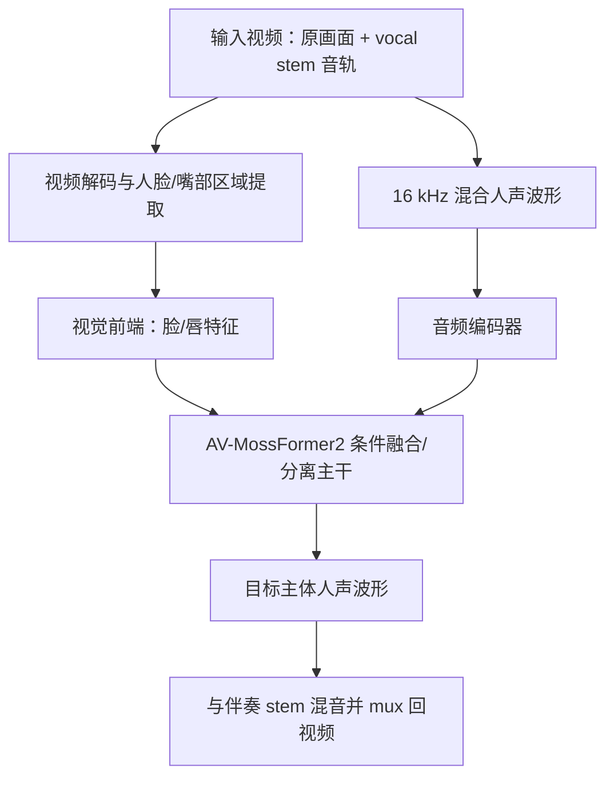

### [2] SEANet / Audio-Visual Target Speaker Extraction with Reverse Selective Auditory Attention

- 论文：[Audio-Visual Target Speaker Extraction with Reverse Selective Auditory Attention](https://arxiv.org/abs/2404.18501)
- GitHub：[TaoRuijie/SEANet](https://github.com/TaoRuijie/SEANet)
- Hugging Face：未找到官方模型。
- ModelScope：未找到可信官方 ModelScope 镜像。
- 开源结论：代码+模型已开源。README 写明提供 VoxMix 数据、四种架构（AV-DPRNN、MuSE、AV-SepFormer、SEANet）、训练模型和训练日志，权重与 lip features 通过 Google Drive 链接提供。
- baseline / 强基线判断：SEANet README 的 VoxMix 复现实验中，SEANet test SI-SDR 12.95、SDR 13.39，优于 AV-SepFormer 的 12.08/12.50、AV-DPRNN 的 11.12/11.56、MuSE 的 10.31/10.75。
- 技术方案：多数 AV-TSE 只做“extract target speech”，容易把干扰人声或噪声带出来。SEANet 加入 subtraction 思路：并行估计目标 speech 和 unwanted/noisy signal，再用 reverse attention 建模两者互斥关系，显式压制非目标声音。
- 关键模块：audio encoder、visual lip encoder、audio-visual fusion、pre-extractor、pre-suppressor、parallel speech and noise learning、reverse attention、audio decoder。
- 训练 / 推理策略：VoxMix 上 online 生成 mixtures；训练脚本支持 AV-DPRNN、MuSE、AV-SepFormer、SEANet；环境说明实验用 CUDA 12.1。
- 实验结果：论文声称在 LRS2、VoxCeleb2、LRS3、Grid、TCD-TIMIT 五个数据集、九类指标上达到 SOTA；README 给出开源代码复跑的 VoxMix 数字。
- 毒舌点评：这是少数真正对“非目标人声残留”正面下手的方法，和本项目“删除非视频主体的人声”高度对齐。短板是没有像 ClearVoice 那样封成视频输入一键推理。
- 为什么值得看：如果 ClearVoice 首轮跑出来仍有明显非主体人声，SEANet 的 subtraction/reverse attention 是最值得借鉴的下一步改进方向。

#### 信号流

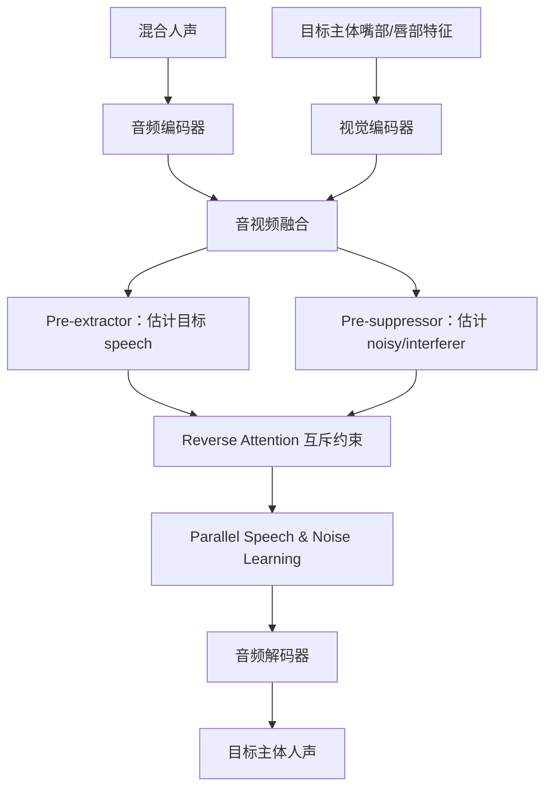

### [3] AV-TFGridNet-ISAM / Plug-and-Play Co-Occurring Face Attention

- 论文：[Plug-and-Play Co-Occurring Face Attention for Robust Audio-Visual Speaker Extraction](https://arxiv.org/abs/2505.20635)
- GitHub：官方代码入口在 ClearerVoice-Studio 的 `train/target_speaker_extraction/models/av_tfgridnetV3_isam` 与配置目录。
- Hugging Face：ClearerVoice 训练文档给出 `log_VoxCeleb2_lip_tfgridnet-isam_*` checkpoint 链接。
- ModelScope：可通过 ClearerVoice-Studio 镜像获取相关工程。
- 开源结论：代码+模型已开源。
- baseline / 强基线判断：ClearerVoice 训练 README 中，VoxCeleb2 3-mix 上 AV-TFGridNet-ISAM 达到 SI-SDRi 15.6、SDRi 15.9；VoxCeleb2 2-mix 上达到 14.5/14.8，高于 AV-TFGridNet 13.7/14.1。
- 技术方案：在 AV-TFGridNet 基础上处理真实视频中 face co-occurrence、目标脸缺失或多脸干扰问题，用 co-occurring face attention 强化目标视觉条件。
- 关键模块：STFT/complex feature encoder、TF-GridNet separator、visual/face embedding、ISAM/co-occurring face attention、mask/complex spectral reconstruction。
- 训练 / 推理策略：基于 VoxCeleb2/LRS2 lip-conditioned mixture 训练；ClearerVoice 提供配置和 checkpoint。
- 实验结果：在 VoxCeleb2 2-mix/3-mix 上强于 AV-TFGridNet 和 AV-DPRNN；对多脸场景更贴近真实应用。
- 毒舌点评：这条线比单纯“嘴动匹配”更像真实产品会遇到的问题：画面里不止一个脸，目标脸还可能断断续续。缺点是目前不如 ClearVoice 的 unified inference 入口直观。
- 为什么值得看：如果样例里出现多人同框、切镜、背景人脸，ISAM 是比普通 AV-TFGridNet 更稳的候选。

#### 信号流

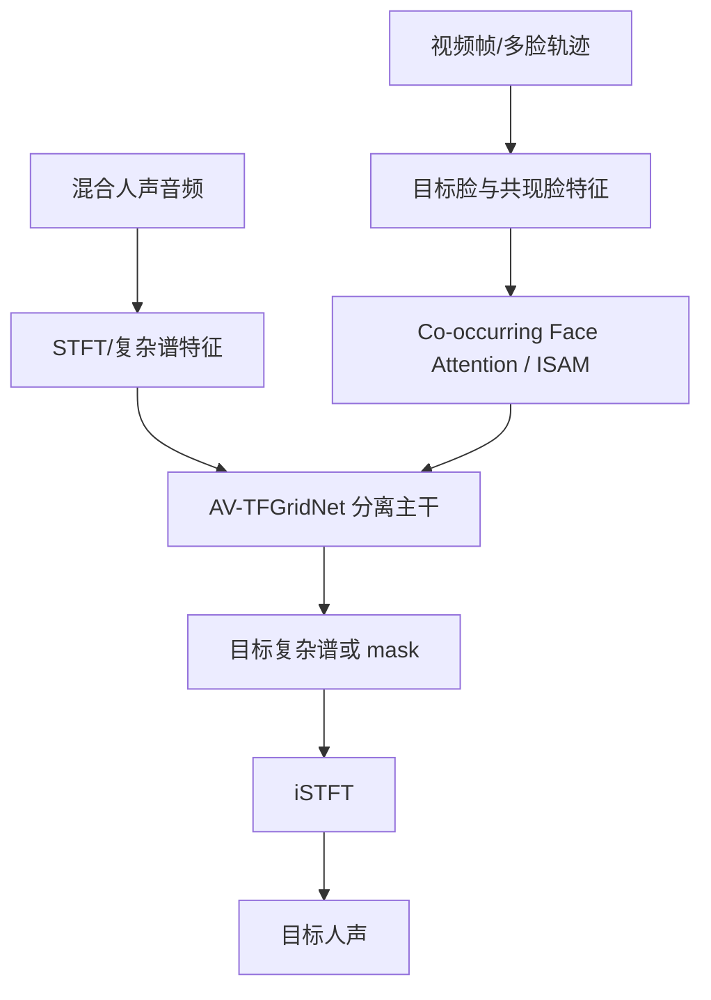

### [4] C²AV-TSE / Context and Confidence-aware AV-TSE

- 论文：[C²AV-TSE: Context and Confidence-aware Audio Visual Target Speaker Extraction](https://arxiv.org/abs/2504.00750)
- GitHub：未找到官方代码。
- Hugging Face：未找到官方模型。
- ModelScope：未找到可信官方 ModelScope 镜像。
- 开源结论：未找到官方代码；未找到官方模型。
- baseline / 强基线判断：论文把方法套在 TDSE、USEV、AV-SepFormer、ImagineNET 等多种 AV-TSE backbone 上，报告 AV-SepFormer + GF + CF 达到 13.361 SI-SDR；GF 将 AV-SepFormer 从 12.472 提升到 12.941，GF+CF 提升到 13.258。
- 技术方案：不是新 separator，而是 fine-tuning 策略：先做全局 fine-tuning 学 inter-/intra-modality context，再用 FCS 置信度模型找到低置信/难片段做 confidence-aware fine-tuning。
- 关键模块：预训练 AV-TSE backbone、global fine-tuning、fine-grained confidence score model、confidence-aware fine-tuning、hard segment mining。
- 训练 / 推理策略：先全局调优，再基于 FCS 模型筛选不可靠片段做局部强化；更像“把已有 AV-TSE 模型调到业务数据上”的方法。
- 实验结果：对弱 backbone 提升更大，例如 TDSE 最佳配置从 10.275 提升到 12.096，绝对提升 1.821 dB；USEV 从 10.785 提升到 11.706。
- 毒舌点评：这篇对落地很有价值，但它不是开箱即用。它告诉你“怎么把已有模型修到你的数据上”，不告诉你今天怎么一条命令跑完。
- 为什么值得看：如果 ClearVoice/SEANet 在 K 歌人声 stem 上域偏移明显，C²AV-TSE 的两阶段 fine-tuning 是最像正经解决方案的后续路线。

#### 信号流

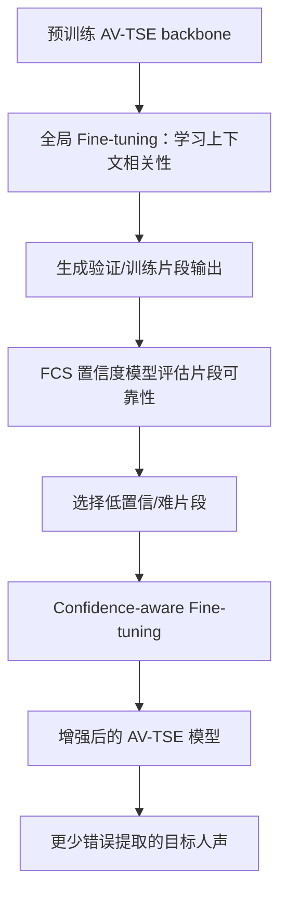

### [5] AV-MossFormer2 training configs in ClearerVoice

- 论文：[ClearerVoice-Studio](https://arxiv.org/abs/2506.19398)
- GitHub：[train/target_speaker_extraction](https://github.com/modelscope/ClearerVoice-Studio/tree/main/train/target_speaker_extraction)
- Hugging Face：训练 README 提供 `log_VoxCeleb2_lip_mossformer2_*`、`log_LRS2_lip_mossformer2_*` checkpoint 链接。
- ModelScope：[iic/ClearerVoice-Studio](https://modelscope.cn/models/iic/ClearerVoice-Studio)
- 开源结论：代码+模型已开源。
- baseline / 强基线判断：这是 `AV_MossFormer2_TSE_16K` 背后的训练路线。LRS2 2-mix 15.5/15.8，LRS2 3-mix 16.2/16.6，VoxCeleb2 2-mix 14.6/14.9。
- 技术方案：用 MossFormer2 的长上下文建模能力替代传统 DPRNN/ConvTasNet separator，并把 lip/face visual cue 注入到目标说话人提取主干。
- 关键模块：audio encoder、visual frontend、MossFormer2 blocks、cross-modal conditioning、decoder。
- 训练 / 推理策略：使用 LRS2/VoxCeleb2 mix 数据；ClearerVoice 提供 2-mix/3-mix 配置。
- 实验结果：在 LRS2 3-mix 上是表内最强之一；对多说话人干扰更有吸引力。
- 毒舌点评：它和第 1 名的区别是：第 1 名是“先跑起来”，这一项是“以后你要微调和换配置时真正要读的训练骨架”。
- 为什么值得看：项目后续如果要从推理验证走到业务数据微调，应优先复用这套配置。

#### 信号流

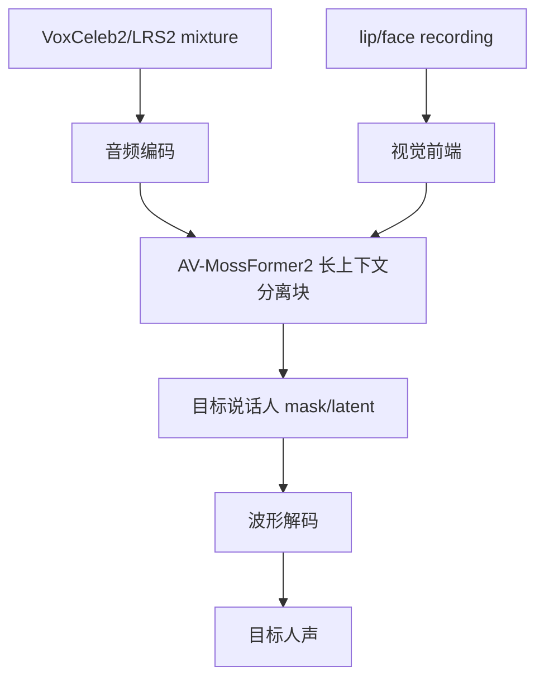

### [6] AV-TFGridNet

- 论文：[Scenario-Aware Audio-Visual TF-GridNet for Target Speech Extraction](https://arxiv.org/abs/2310.19644)
- GitHub：官方代码入口在 ClearerVoice-Studio 的 `models/av_tfgridnetV3` 与相关配置。
- Hugging Face：ClearerVoice 训练 README 提供 `log_VoxCeleb2_lip_tfgridnet_*`、`log_LRS2_lip_tfgridnet_*` checkpoint 链接。
- ModelScope：可通过 ClearerVoice-Studio 镜像获取。
- 开源结论：代码+模型已开源。
- baseline / 强基线判断：ClearerVoice 表中，LRS2 2-mix 达到 15.1/15.4，LRS2 3-mix 15.0/15.4；VoxCeleb2 3-mix 14.2/14.6。
- 技术方案：把音频目标说话人提取搬到 time-frequency grid 建模，利用 TF-GridNet 在时间和频率两个维度交替建模，再融合视觉条件。
- 关键模块：STFT encoder、TF-GridNet separator、visual embedding、scenario-aware fusion、STFT decoder。
- 训练 / 推理策略：在 LRS2/VoxCeleb2 lip-conditioned mixtures 上训练，输出目标语音。
- 实验结果：明显优于 AV-DPRNN、AV-ConvTasNet，接近 AV-MossFormer2。
- 毒舌点评：这是强基线，不是花架子。问题是你要先接受它主要是 speech benchmark，不是 K 歌 stem benchmark。
- 为什么值得看：如果 AV-MossFormer2 对音乐残留或歌唱泛化不好，AV-TFGridNet 是同框架下最自然的替代 baseline。

#### 信号流

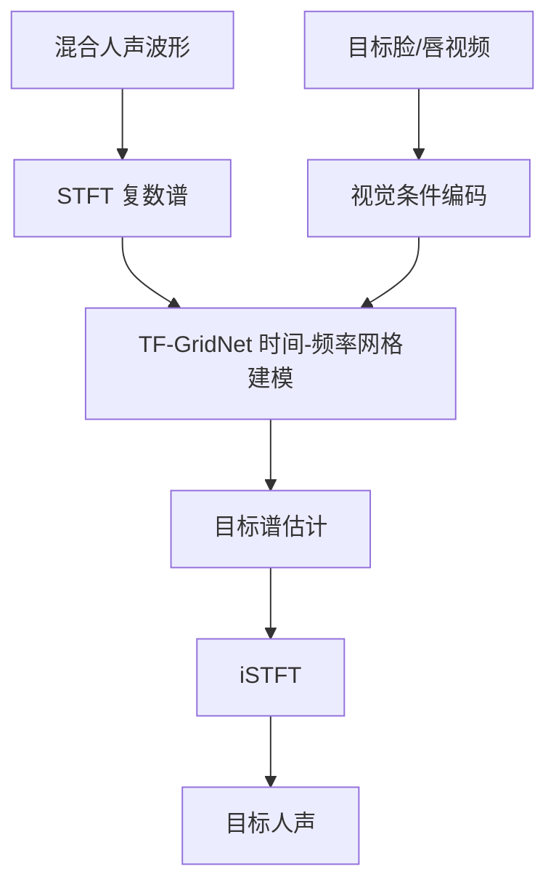

### [7] AV-SepFormer

- 论文：[AV-SepFormer: Cross-Attention SepFormer for Audio-Visual Target Speaker Extraction](https://arxiv.org/abs/2306.14170)
- GitHub：[lin9x/AV-SepFormer](https://github.com/lin9x/AV-SepFormer)
- Hugging Face：未找到官方模型；README 提供 Google Drive checkpoint。
- ModelScope：未找到可信官方 ModelScope 镜像。
- 开源结论：代码+模型已开源。
- baseline / 强基线判断：官方提供 checkpoint 和 demo；SEANet 开源 README 中 AV-SepFormer 在 VoxMix test SI-SDR 为 12.08，高于 MuSE 和 AV-DPRNN。
- 技术方案：把 SepFormer 的分离能力和视觉条件结合，用 cross-attention 让 lip embedding 引导目标说话人提取。
- 关键模块：audio encoder、visual frontend、cross-attention SepFormer separator、decoder。
- 训练 / 推理策略：VoxCeleb2 数据预处理沿用 MuSE；支持训练 AV-SepFormer、AV-ConvTasNet、MuSE。
- 实验结果：ICASSP 2023 强基线，后续 SEANet/C²AV-TSE 都把它作为重要比较对象。
- 毒舌点评：研究上很重要，代码也有，但工程化程度比 ClearVoice 差。拿来做第二个 baseline 可以，别把它当首个交付链路。
- 为什么值得看：它是很多 2024-2025 方法绕不开的强基线。

#### 信号流

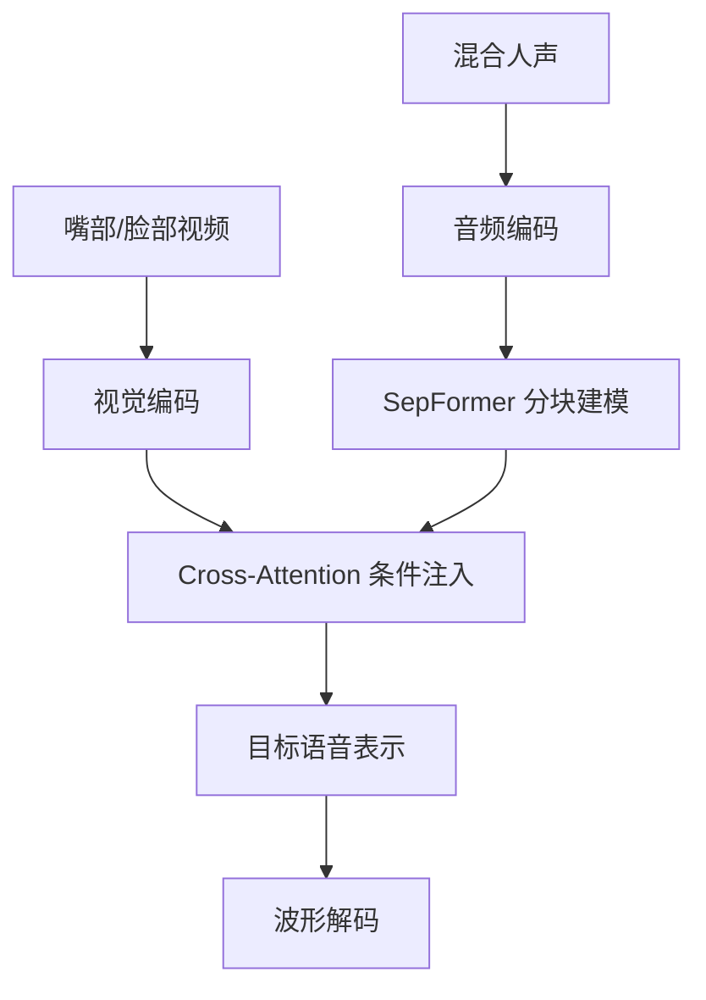

### [8] USEV / Universal Speaker Extraction With Visual Cue

- 论文：[USEV: Universal Speaker Extraction With Visual Cue](https://ieeexplore.ieee.org/document/9887809)
- GitHub：[zexupan/USEV](https://github.com/zexupan/USEV)
- Hugging Face：未找到官方模型。
- ModelScope：未找到可信官方 ModelScope 镜像。
- 开源结论：代码+模型已开源。README 写明提供 VoxCeleb2 预训练 USEV network、预训练和训练脚本。
- baseline / 强基线判断：覆盖 target absent、non-overlapped、partially overlapped、fully overlapped 等更通用场景，是 AV-DPRNN/visual cue 路线的重要基线。
- 技术方案：利用视觉 cue 做 universal speaker extraction，不只处理完全重叠说话，也处理目标缺席和部分重叠，避免模型在目标不存在时乱提取。
- 关键模块：visual cue encoder、speaker extraction network、overlap/target-present scenario handling、training data generation。
- 训练 / 推理策略：VoxCeleb2 预训练，再可在 IEMOCAP-mix 等数据上训练。
- 实验结果：后续 ClearerVoice 和 C²AV-TSE 都把 USEV/AV-DPRNN 类方法作为基础 baseline。
- 毒舌点评：它的价值不是最高分，而是任务定义更实际。真实视频里目标主体不一定全程说话，这一点对本项目很重要。
- 为什么值得看：如果你后续需要处理“画面主体沉默时不要抽出别人声音”，USEV 的 universal 设定值得借鉴。

#### 信号流

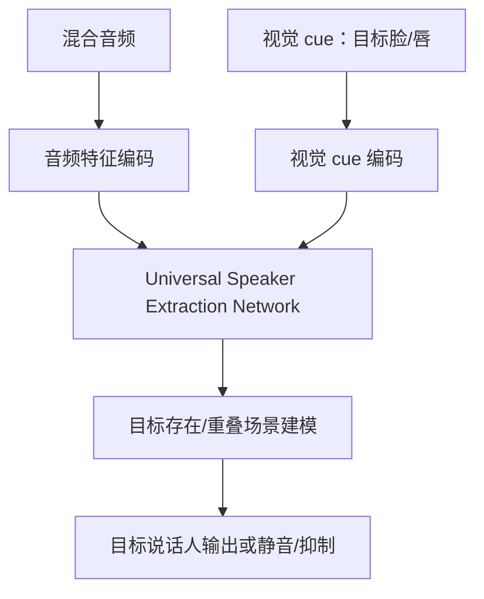

### [9] MuSE / Multi-modal Target Speaker Extraction with Visual Cues

- 论文：[MuSE: Multi-modal Target Speaker Extraction with Visual Cues](https://arxiv.org/abs/2010.07775)
- GitHub：[zexupan/MuSE](https://github.com/zexupan/MuSE)
- Hugging Face：[KUL-mix dataset](https://huggingface.co/datasets/alibabasglab/KUL-mix)；未找到官方模型页。
- ModelScope：未找到可信官方 ModelScope 镜像。
- 开源结论：仅代码已开源；README 提供 visual frontend 预训练权重，目标提取完整模型权重未在 README 中明确给出。
- baseline / 强基线判断：早期 lip-conditioned target speaker extraction 代表，被 AV-SepFormer、SEANet、ClearerVoice 训练链路引用。
- 技术方案：不用参考语音，而用目标说话人的视觉嘴部特征作为条件，从混合音频中提取目标人声。
- 关键模块：visual frontend、Conv-TasNet adapted extractor、audio encoder/decoder、lip-conditioned fusion。
- 训练 / 推理策略：VoxCeleb2 预处理脚本和训练脚本；后续新版工程指向 ClearerVoice-Studio。
- 实验结果：在 SEANet README 的 VoxMix 复跑中，MuSE test SI-SDR 为 10.31、SDR 10.75，落后 AV-SepFormer 和 SEANet。
- 毒舌点评：老方法，指标不占优，但它把“用嘴部视觉 cue 提取目标人声”这条路立起来了。读它是为了理解起点，不是为了直接上线。
- 为什么值得看：后续很多仓库的数据准备和视觉前端都沿用 MuSE 思路。

#### 信号流

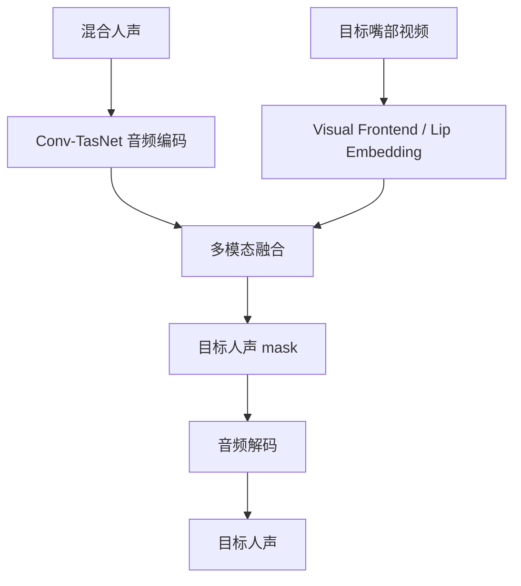

### [10] 相邻任务：VisualVoice / Acappella-YNet / VoViT / TalkNet-ASD / Light-ASD

- 论文与仓库：
  - [VisualVoice](https://github.com/facebookresearch/VisualVoice)：CVPR 2021，音视频语音分离，官方预训练模型和真实视频 demo。
  - [Acappella-YNet](https://github.com/JuanFMontesinos/Acappella-YNet)：BMVC 2021，音视频歌声分离，提供 demo/Colab 和训练说明。
  - [VoViT](https://github.com/JuanFMontesinos/VoViT)：ECCV 2022，低延迟 graph-based AV voice separation；README 说明当前只上传 speech separation 模型，可请求 singing voice separation 模型。
  - [TalkNet-ASD](https://github.com/TaoRuijie/TalkNet-ASD)、[Light-ASD](https://github.com/Junhua-Liao/Light-ASD)：主动说话人检测，提供预训练和 demo。
- Hugging Face：VisualVoice/Acappella/VoViT 未找到统一官方 HF 模型页；TalkNet 有第三方 demo/Space 线索但本报告不把它当官方模型。
- ModelScope：未找到可信官方 ModelScope 镜像。
- 开源结论：这些仓库多数为仅代码已开源或代码+外部权重链接；ASD 仓库有预训练模型，但它们不是分离模型。
- baseline / 强基线判断：它们不是本项目第一主线，但可补足两类能力：歌声域 AV separation 和视觉 VAD/ASD。
- 技术方案：VisualVoice/Acappella/VoViT 直接做 AV separation；TalkNet/Light-ASD 判断画面中谁在说话。
- 关键模块：AV separation 主干、mouth ROI/face tracking、active speaker classifier、时间窗后处理。
- 训练 / 推理策略：VisualVoice 需要 25fps、16kHz、face tracking/mouth ROI；Acappella-YNet 数据格式复杂；TalkNet/Light-ASD 可对原视频输出 active speaker boxes/segments。
- 实验结果：TalkNet README 给出 AVA test mAP 90.8、Columbia ASD 平均 F1 96.3；Light-ASD README 给出 AVA val mAP 94.06、TalkSet fine-tuned Columbia F1 95.5。
- 毒舌点评：别把 ASD 当分离模型。它只能告诉你谁在说话，不能把别人声音从 waveform 里抠掉。它的正确位置是第二轮辅助门控。
- 为什么值得看：如果 AV-TSE 在目标沉默段误提别人声音，ASD/VAD 是最实用的后处理证据。

#### 信号流

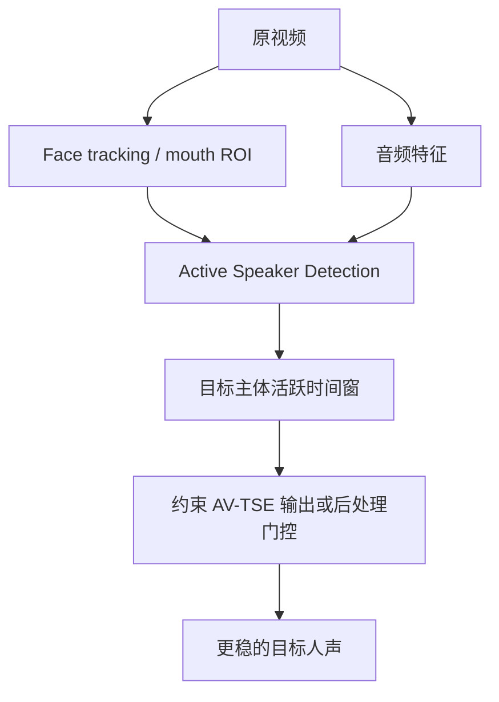

## 复现/落地优先级

1. **ClearerVoice / AV_MossFormer2_TSE_16K**：第一轮必跑。它最适合当前数据结构：`master_t264.mp4` 提供画面，`master_t264_vocal.wav` 提供人声 stem，先生成“原画面 + 人声 stem”的中间视频，再跑 AV-TSE。
2. **SEANet**：第二优先级。若 ClearVoice 有明显非目标残留，SEANet 的 subtraction/reverse attention 最贴近“删除非主体人声”的核心问题。
3. **AV-TFGridNet-ISAM / AV-TFGridNet / AV-MossFormer2 training configs**：第三优先级。适合在 ClearerVoice 框架内做同源替换和微调对比。
4. **C²AV-TSE**：第四优先级。没有官方开源时不适合马上跑，但非常适合指导后续业务数据 fine-tuning。
5. **TalkNet-ASD / Light-ASD**：辅助优先级。不要把它们当主分离模型；只在第二轮用于目标活跃时间窗、视觉 VAD 和错误片段定位。
6. **Acappella-YNet / VoViT**：歌声域专项候选。当前任务如果普通 AV-TSE 在歌唱场景明显失败，再考虑这条线。

## 论文效果/技术价值优先级

1. **SEANet**：对“非目标声音残留”问题建模最正面，技术目标和本项目最贴。
2. **C²AV-TSE**：对已有 AV-TSE 模型如何 fine-tune 到真实难样本给出可操作路线，后续适合业务域适配。
3. **AV-TFGridNet-ISAM**：面向多脸/共现脸和真实视觉干扰，适合更复杂视频。
4. **ClearerVoice / AV-MossFormer2**：工程和模型体系完整，是落地价值最高的系统论文。
5. **AV-SepFormer**：经典强基线，后续论文反复对比。
6. **USEV**：目标缺席和不同重叠关系的任务定义很重要。
7. **MuSE**：早期视觉 cue 目标提取源头。
8. **VisualVoice / Acappella / VoViT**：相邻任务技术价值高，但需要筛选是否适配本项目。

## 最终建议

本项目不要一上来堆多个模型和后处理。第一轮只做一个闭环：

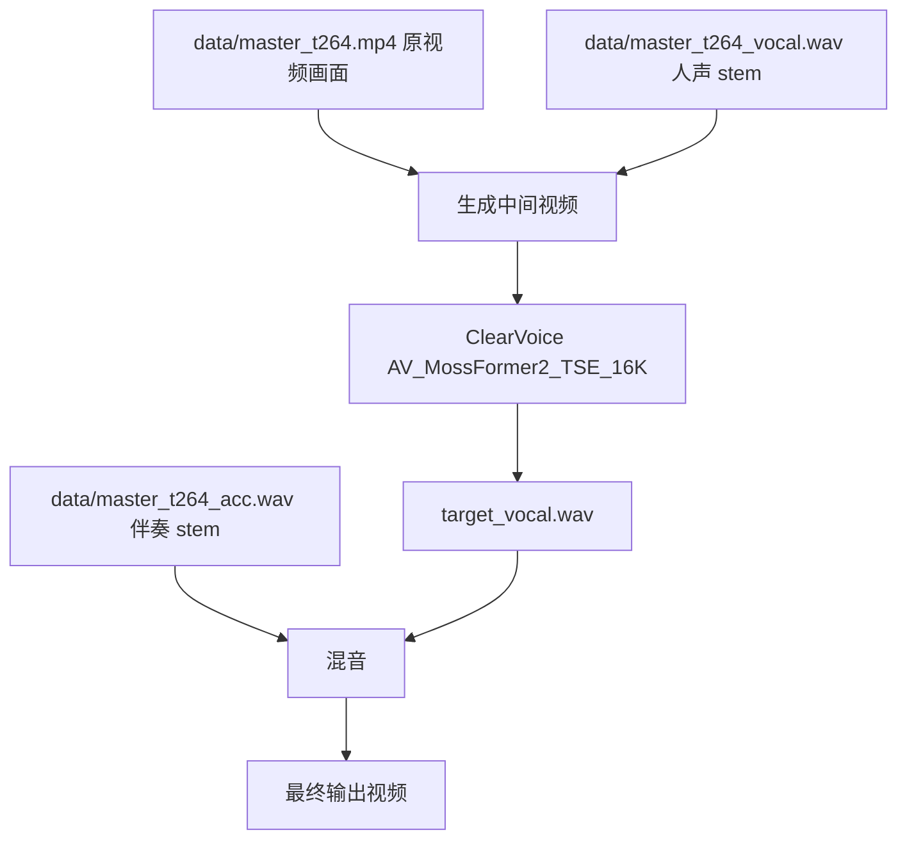

首轮只验证 `AV_MossFormer2_TSE_16K`：看它是否能在 `master_t264_vocal.wav` 中削弱非视频主体人声，同时保留画面主体演唱/说话段。若失败，再按单变量法进入第二轮：要么换 SEANet/AV-TFGridNet-ISAM，要么引入 TalkNet/Light-ASD 做视觉 VAD 门控。不要同时换模型、加 VAD、改混音和调参数，否则无法归因。

当前开源结论很明确：**最适合马上落地的是 ClearerVoice；最值得后续研究跟进的是 SEANet 和 C²AV-TSE；最适合处理多人同框复杂视觉的是 AV-TFGridNet-ISAM；ASD 系列只能做辅助，不能替代分离模型。**
