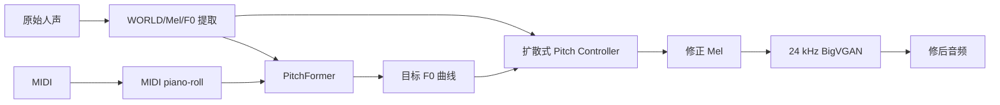
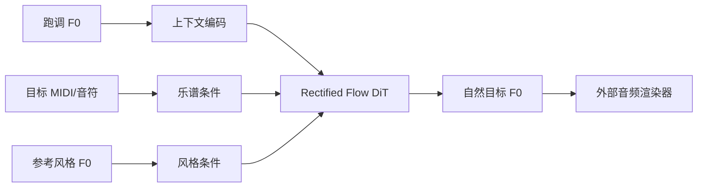
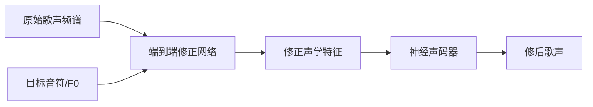
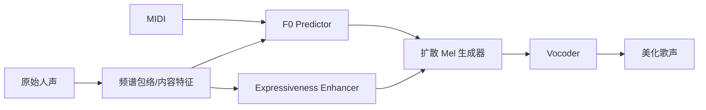
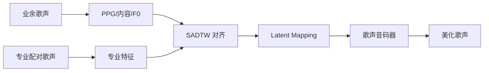
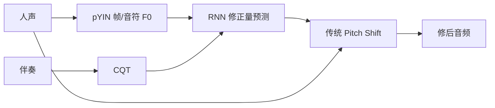
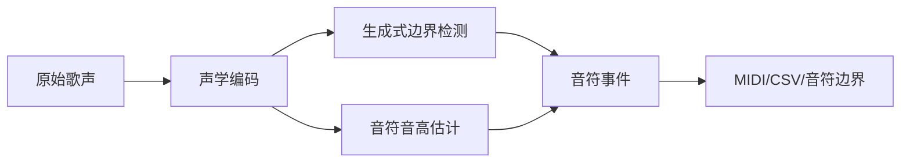
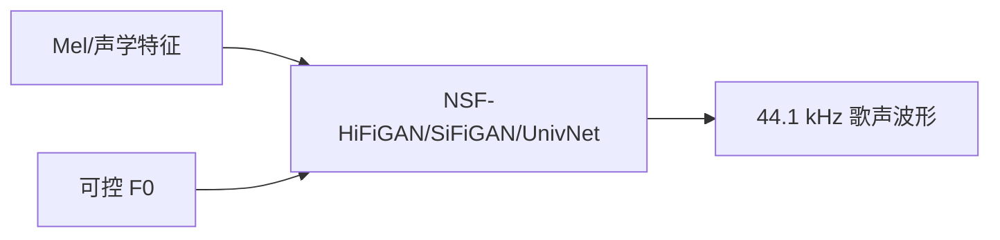
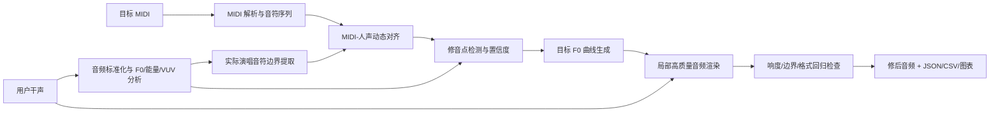

# MIDI 引导的自动人声修音 SOTA Research

## 研究参数

- 研究主题：MIDI 引导的自动人声修音（MIDI-guided Singing Voice Pitch Correction）
- 年份范围：2019-2026
- 输出数量：Top 10
- 已知 baseline：Deep Autotuner、NeuralSVB
- 偏好：开源优先、模型可下载优先、工业落地优先、单张 RTX 4090 24GB 可复现
- 研究日期：2026-08-03
- 目标工程：`AI Vocal Pitch Correction`

## 一句话结论

当前没有一个许可证清晰、输入就是“任意用户干声 + 未严格对齐 MIDI”、能自动检测修音点、局部自然修正、保持原音色和原节奏、并可直接用于生产的完整开源模型。最可落地的第一版不是押注单个端到端模型，而是采用“模型检测 + 显式对齐 + 可解释决策 + 可替换渲染后端”的混合流水线；其中 Diff-Pitcher 最值得作为模型对照组，RMVPE、GAME 和可控歌声音码器适合作为组件候选。

## 核验范围

本次检查了以下证据层级：

1. 论文全文：摘要、方法、实验、结论和限制。
2. 官方 GitHub：README、推理入口、训练入口、配置、checkpoint 说明、许可证、branches/tags、近期提交。
3. 官方协作区：可访问的 Issues、Pull Requests、forks，以及训练、checkpoint、raw input、dataset、inference、license 等关键词。
4. 模型与数据平台：Hugging Face 模型页、数据页、Space；ModelScope 站内搜索。
5. 项目 demo、GitHub Releases、Google Drive 模型链接和论文附带项目页。

受 GitHub 未登录 API 限流影响，部分无代码论文的 GitHub 全站搜索使用公开搜索结果和项目页交叉核验；这不影响“官方仓库未提供代码入口”的判断，但不能证明互联网上不存在任何非官方复现。

## 开源状态口径

- `代码+模型已开源`：官方同时提供可识别的实现和权重。
- `仅代码已开源`：官方代码存在，但完成目标任务所需的最终权重缺失。
- `仅 Demo 已开源`：只能试听或在线体验，没有可下载的官方实现和权重。
- `未找到官方代码/模型`：已检查论文、项目页、GitHub、Hugging Face、ModelScope，未找到官方入口。
- 代码许可证和模型许可证分别判断；仓库公开不等于允许商用。

## 排序规则

综合考虑：

1. 与“音频 + MIDI -> 自动检测修音点 -> 局部修正音频”的直接相关性。
2. 是否处理真实的人声时间偏差，而不是默认 MIDI 与音频逐帧对齐。
3. 是否保持原始歌手音色、歌词、节奏、音头、滑音、颤音和音尾。
4. 是否提供官方代码、模型、原始音频推理入口和清晰许可证。
5. 是否能在单张 RTX 4090 24GB 上复现或作为流水线组件运行。
6. 是否有客观指标、主观听测、消融和公开数据支撑。

## 总览表

| 排名 | 名称 | 年份 | 类型 | 任务相关性 | GitHub | Hugging Face | ModelScope | 开源结论 | 工程判断 |
|---:|---|---:|---|---|---|---|---|---|---|
| 1 | Diff-Pitcher | 2023 | 直接 APC | 高 | ✅ 官方代码 | ✅ 官方模型 | 未找到 | 代码+模型已开源，仓库无顶层许可证 | 最适合做模型对照组，不适合直接当生产主链路 |
| 2 | StylePitcher | 2025 | F0 曲线生成/APC | 高 | 未找到官方代码 | 未找到官方模型 | 未找到 | 仅官方 Demo | 技术价值最高之一，但当前无法直接复现 |
| 3 | KaraTuner | 2022 | 端到端 APC | 高 | 未找到官方代码 | 未找到官方模型 | 未找到 | 论文公开，代码模型未公开 | 设计参考价值高，落地价值低 |
| 4 | ConTuner / DiffBeautifier | 2024 | 歌声美化 | 高 | 未找到官方代码 | 未找到官方模型 | 未找到 | 仅官方 Demo | 同时改音准和表现力，容易越过本项目“只修明显错误”边界 |
| 5 | NeuralSVB | 2022 | 歌声美化 | 中高 | ✅ 官方代码 | 未找到官方最终模型 | 未找到 | 仅代码已开源 | 原始输入推理仍是 WIP，不能直接接任意音频 |
| 6 | Deep Autotuner | 2020 | 直接 APC | 中高 | ✅ 官方代码 | 未找到官方模型页 | 未找到 | 代码+checkpoint 已公开，仓库无许可证 | 适合研究修音决策，不适合直接复用生产代码 |
| 7 | SoulX-Singer / SVC | 2026 | SVS/SVC，相邻任务 | 中 | ✅ 官方代码 | ✅ 官方模型/Space | 未找到官方镜像 | 代码+模型已开源，Apache-2.0 | 可研究生成式重建，但并非局部保真修音器 |
| 8 | RMVPE | 2023 | F0 检测组件 | 组件级高 | ✅ 官方代码 | 未找到官方权重 | 未找到 | 仅代码已开源，Apache-2.0 | 适合作为主 F0 检测候选，需自行准备可信权重 |
| 9 | GAME | 2026 | 人声转 MIDI/边界组件 | 组件级高 | ✅ 官方代码 | 未找到专用官方模型页 | 未找到 | 代码+Release 模型已开源，MIT | 很适合辅助真实演唱音符边界检测和对齐 |
| 10 | SingingVocoders | 2023-2026 | F0 可控重合成组件 | 组件级高 | ✅ 官方代码 | 未找到官方模型页 | 未找到 | 代码+Release 权重已开源；权重偏非商用 | 适合高质量渲染实验，商用需重新训练或确认授权 |

## Top 方法深度解析

### 1. Diff-Pitcher

- 论文：Diff-Pitcher: Diffusion-Based Singing Voice Pitch Correction，WASPAA 2023
- 论文/项目：https://jhu-lcap.github.io/Diff-Pitcher/
- GitHub：https://github.com/haidog-yaqub/DiffPitcher
- Hugging Face：https://huggingface.co/Higobeatz/Diff-Pitcher
- ModelScope：未找到可信官方镜像
- 开源结论：官方代码、score-based/template-based 推理入口和模型仓库已公开；顶层仓库未提供明确许可证，商用风险未解决。

#### 技术方案

Diff-Pitcher 将任务拆成两个模型：

1. `PitchFormer` 根据 MIDI、源音高和声学包络预测自然的目标 F0。
2. 扩散式 pitch controller 根据目标 F0 和源声学表示生成修正后的 Mel，再用 24 kHz BigVGAN 输出波形。

#### 信号流

#### 关键核验

- 官方脚本提供 `score_based_apc.py` 和 `template_based_apc.py`。
- score-based 脚本把 MIDI piano-roll 按音频长度截取/缩放，没有针对抢拍、拖拍、漏唱和局部自由发挥的可靠动态对齐阶段。
- 官方实现输出链路固定在 24 kHz，与本项目 44.1 kHz 输入/输出目标不一致。
- 模型输入、预处理、BigVGAN 和 checkpoint 组织较复杂，但样例和输出文件齐全。
- 适合作为“端到端模型上限和音质对照”，不应直接承担本项目的对齐与修音点决策。

#### 毒舌点评

这是当前最像“能跑的开源自动修音模型”的项目，但它把最难的真实业务问题——人声和 MIDI 局部不对齐——基本绕过去了。拿论文样例跑通不难，拿真实用户抢拍、拖拍、漏唱的输入稳定工作才是硬仗。

### 2. StylePitcher

- 论文：StylePitcher: Generating Style-Following and Expressive Pitch Curves for Versatile Singing Tasks，2025
- 论文：https://arxiv.org/abs/2510.21685
- Demo：https://stylepitcher.github.io/
- GitHub：未找到官方代码
- Hugging Face：未找到官方模型
- ModelScope：未找到可信官方镜像
- 开源结论：论文和 Demo 公开，官方代码与模型未公开。

#### 技术方案

StylePitcher 不直接生成音频，而是使用 rectified flow + Diffusion Transformer 生成符合目标音符、同时保留歌手个性颤音、滑音和弯音风格的 F0 曲线。它把“音符中心正确”和“细节自然”显式分离，和现有需求报告中的 `center_correction_ratio`、`pitch_contour_keep/vibrato_scale` 思想高度一致。

#### 信号流

#### 实验与限制

- 使用 DAMP-VSEP 和 DAMP-VPB，训练数据约 1916 小时。
- 模型约 49M 参数，最长上下文约 20.48 秒。
- 论文报告其风格和音质优于 Diff-Pitcher，但严格音准对齐略低于更强约束的 baseline。
- 只负责 F0，不解决最终高保真波形修正。
- 无官方代码和权重，因此目前只能借鉴“目标 F0 生成”设计，不能直接纳入工程。

#### 毒舌点评

思路非常对题，开源状态非常不给力。它证明“把音高压成 MIDI 直线”不是高质量修音，但在代码发布前只能当设计参考，不能拿来排第一阶段工期。

### 3. KaraTuner

- 论文：KaraTuner: Towards End-to-End Natural Pitch Correction for Singing Voice in Karaoke，Interspeech 2022
- 论文：https://arxiv.org/abs/2110.09121
- GitHub：未找到官方代码
- Hugging Face：未找到官方模型
- ModelScope：未找到可信官方镜像
- 开源结论：论文公开，未找到官方代码和模型。

#### 技术方案

KaraTuner 采用端到端频谱映射：由源歌声、目标音高/乐谱条件生成修正频谱，再通过神经声码器还原音频。论文重点是减少传统 WORLD/PSOLA 修音造成的机器人感和音质损失。

#### 信号流

#### 工程判断

- 任务定义直接，但没有官方复现入口。
- 论文实验环境和数据构造可作为未来训练自有模型的参考。
- 不能作为第一阶段依赖，否则项目会立刻变成论文复刻和数据建设项目。

#### 毒舌点评

论文方向对，工程价值接近零。没有代码、没有模型、没有可直接迁移的数据链路，第一版押它等于主动给项目加半年不确定工期。

### 4. ConTuner / DiffBeautifier

- 论文：ConTuner: Singing Voice Beautifying with Pitch and Expressiveness Condition，2024
- 论文：https://arxiv.org/abs/2404.19187
- Demo：https://diff-forever.github.io/DiffBeautifier/
- GitHub：未找到官方代码
- Hugging Face：未找到官方模型
- ModelScope：未找到可信官方镜像
- 开源结论：论文与 Demo 公开，未找到官方代码和模型。

#### 技术方案

ConTuner 同时生成修正 F0 和增强后的表现力特征，再以扩散模型生成 Mel。其 F0 预测器使用 MIDI 与频谱包络，表现力增强器则试图把业余唱法映射到专业唱法。

#### 信号流

#### 工程判断

- 能力范围比本项目第一版更宽，除音准外还修改情绪、节奏和唱法。
- 如果第一版直接采用这类模型，很难满足“非修音区与原声一致”和“只修明显错误”的可解释验收标准。
- 无官方代码模型，当前只能作为二期“表现力美化”参考。

#### 毒舌点评

论文把“修音”和“重新表演”混在一起，Demo 可能悦耳，但对需要可控、可回滚、可解释的产品链路并不友好。

### 5. NeuralSVB

- 论文：Learning the Beauty in Songs: Neural Singing Voice Beautifier，ACL 2022
- 论文：https://aclanthology.org/2022.acl-long.549/
- GitHub：https://github.com/MoonInTheRiver/NeuralSVB
- Hugging Face：未找到官方最终模型
- ModelScope：未找到可信官方镜像
- 许可证：GPL-3.0
- 开源结论：官方代码、PopBuTFy 数据申请入口、声码器和 PPG 辅助模型公开；未找到可直接执行 NeuralSVB 任务的官方最终 checkpoint。

#### 技术方案

NeuralSVB 使用 Soft-DTW/SADTW 对齐业余与专业歌声，通过 pitch correction 和 latent mapping 同时修正音高与音色表现。训练依赖同一歌手、同一首歌的业余/专业配对数据 PopBuTFy。

#### 信号流

#### 关键核验

- README 的 raw input inference 明确标为 `WIP`。
- 官方推理入口主要针对预先打包的测试集，不是任意用户音频和 MIDI。
- Issues 中持续出现最终 checkpoint、数据和原始输入推理请求。
- PopBuTFy 需要申请，且配对数据构造成本高。

#### 毒舌点评

论文贡献不差，但仓库离“下载就跑”差得很远。把它写进生产方案当依赖属于把研究代码包装成产品能力。

### 6. Deep Autotuner

- 论文：Deep Autotuner: A Pitch Correcting Network for Singing Performances，ICASSP 2020
- 论文：https://arxiv.org/abs/2002.05511
- GitHub：https://github.com/sannawag/data_driven_pitch_corrector
- Hugging Face：未找到官方模型页
- ModelScope：未找到可信官方镜像
- 开源结论：代码和预训练 checkpoint 已在仓库公开；仓库未声明顶层许可证。

#### 技术方案

Deep Autotuner 使用音符级和帧级 pYIN 音高、伴奏 CQT 等特征，预测每个音符的去调量，并通过传统音高变换合成修后音频。它更偏“学习修多少”，不是完整的 MIDI 对齐与高保真生成模型。

#### 信号流

#### 工程判断

- 优点是可解释、代码包含 checkpoint、计算量低。
- 依赖 Sonic Visualizer/pYIN 预处理和特定数据布局，年代较早。
- 不直接使用本项目给定 MIDI，合成质量上限受传统 pitch shifter 限制。
- 无许可证，不能直接进入商业代码仓。

#### 毒舌点评

它最值得保留的是“模型学修正量，渲染器独立”的模块化思想，而不是具体代码。代码能跑不代表值得继承。

### 7. SoulX-Singer / SoulX-Singer-SVC

- 论文：SoulX-Singer: Towards High-Quality Zero-Shot Singing Voice Synthesis，2026
- 论文：https://arxiv.org/abs/2602.07803
- GitHub：https://github.com/Soul-AILab/SoulX-Singer
- Hugging Face：https://huggingface.co/Soul-AILab/SoulX-Singer
- Demo：https://huggingface.co/spaces/Soul-AILab/SoulX-Singer
- ModelScope：未找到 SoulX-Singer 官方模型镜像
- 许可证：Apache-2.0，README 明确代码和模型权重可使用
- 开源结论：代码、SVS/SVC 模型、评测集和 Space 已开源。

#### 技术方案

SoulX-Singer 是 42,000 小时数据训练的零样本歌声合成模型，支持 MIDI/F0 条件；SVC 版本接受原始歌声音频进行音色转换。两个核心模型权重分别约 2.8 GB。

#### 工程判断

- 优点是开源完整、许可证清晰、生成质量强、4090 有机会运行。
- SVS 路线需要歌词/音符等额外条件，会重新生成整段歌声，不保证与原始录音逐样本一致。
- SVC 路线设计目标是改变到目标歌手音色，不是保持原歌手音色做局部校音。
- README 仍建议人工修正歌词/音符对齐，说明强生成模型也没有自动解决本项目的真实对齐问题。

#### 毒舌点评

这是很强的相邻能力，但不是修音器。用它重唱一遍可能很好听，却可能把“原用户的唱法和声音”一起重做，产品目标会悄悄变质。

### 8. RMVPE

- 论文：RMVPE: A Robust Model for Vocal Pitch Estimation in Polyphonic Music，2023
- 论文：https://arxiv.org/abs/2306.15412
- GitHub：https://github.com/Dream-High/RMVPE
- Hugging Face：未找到作者官方权重；存在大量社区 RVC 权重或镜像，不能当官方模型
- ModelScope：未找到可信官方镜像
- 许可证：Apache-2.0
- 开源结论：官方训练、评测和推理代码已开源，官方仓库未附权重。

#### 信号流

#### 工程判断

- 对人声 F0 鲁棒，适合作为第一阶段主 F0 检测器。
- 本项目输入是干声，任务比论文的多音音乐简单，但喘气、辅音、假声、气声和低信噪比仍需验证。
- 由于官方仓库不带模型权重，第一阶段应允许 RMVPE、torchcrepe/pYIN 等多后端比较，不能把社区权重默认为可信生产依赖。

### 9. GAME

- 项目：GAME: Generative Adaptive MIDI Extractor，SOME 的后继项目，2026
- GitHub：https://github.com/openvpi/GAME
- 模型：官方 GitHub Releases/Discussions 提供
- Hugging Face：未找到专用官方模型页
- ModelScope：未找到可信官方镜像
- 许可证：MIT
- 开源结论：代码、训练、推理和官方 Release 模型已开源。

#### 信号流

#### 工程判断

- 直接把用户唱声转成“实际演唱 MIDI/音符边界”，可作为参考 MIDI 与真实演唱之间的桥梁。
- 支持已知边界条件下的自适应对齐，适合构建局部音符匹配候选。
- 官方测试环境是 Python 3.12、PyTorch 2.8、CUDA 12.9；与项目默认 Python 3.10.18、PyTorch 2.4、CUDA 12.4 不完全一致，必须单独做兼容性验证，不能直接合并依赖。
- GAME 不能替代最终对齐器：其输出仍需与目标 MIDI 做序列匹配、漏唱识别和置信度融合。

### 10. SingingVocoders

- 项目：https://github.com/openvpi/SingingVocoders
- GitHub Releases：https://github.com/openvpi/SingingVocoders/releases
- ModelScope：未找到可信官方镜像
- 代码许可证：MIT
- 预训练权重许可：README 标明 CC BY-NC-SA 4.0，偏非商用
- 开源结论：训练代码和预训练歌声音码器权重公开，但模型权重许可不适合直接进入商业产品。

#### 信号流

#### 工程判断

- 支持 44.1 kHz 歌声和 F0 控制，适合研究高质量重合成。
- 可通过自有数据微调，README 说明小数据约 2k steps 可进行初步适配。
- 直接使用现有预训练权重有许可风险；工业路线应准备自训练或购买/确认商业授权。

## 证据矩阵

| 来源 | 发现内容 | 能证明什么 | 不能证明什么 | 可信度/官方性 |
|---|---|---|---|---|
| 当前需求 PDF 与修前/修后样本 | 需要中心音高强修，同时保留音头、滑音、颤音、音尾和响度 | 产品目标不是硬量化到 MIDI 直线 | 单样本阈值能泛化到所有用户 | 用户提供的一手需求 |
| Diff-Pitcher 论文、仓库、HF | 有 score-based APC、模型和 demo | 开源神经修音模型确实可运行 | 能解决真实未对齐 MIDI | 官方 |
| Diff-Pitcher `score_based_apc.py` | MIDI 主要按音频时长读取/缩放 | 现有代码缺少业务级动态对齐 | 论文模型完全无对齐能力 | 官方源码，高可信 |
| NeuralSVB README/Issues | raw input inference 为 WIP，最终模型与数据持续被请求 | 不能直接接任意用户输入 | 社区没有任何补丁 | 官方仓库与协作区 |
| StylePitcher 全文与 Demo | 将音符准确性和歌手风格 F0 分开建模 | 目标 F0 生成应独立于音频渲染 | 当前可直接部署 | 官方论文/Demo |
| SoulX-Singer README/HF | 代码模型完整，Apache-2.0，支持 MIDI/F0/SVC | 强生成模型可作为未来重建候选 | 能局部无损地保持原声 | 官方 |
| RMVPE 仓库 | 训练/推理代码 Apache-2.0，但官方权重缺失 | 可作为可替换 F0 后端候选 | 社区流传权重可直接商用 | 官方仓库 |
| GAME 仓库/Releases | 可从真实歌声提取音符边界和 MIDI | 可辅助目标 MIDI 与真实演唱匹配 | 可以单独完成目标乐谱对齐 | 官方 |
| SingingVocoders README/Releases | 可控 F0 的 44.1 kHz 歌声音码器可训练/微调 | 神经重合成技术链可复现 | 现成权重适合商业落地 | 官方，许可证需谨慎 |
| GitHub/HF/ModelScope 搜索 | KaraTuner、ConTuner、StylePitcher 未找到官方代码模型 | 官方未提供可复现入口 | 全球不存在非官方复现 | 多平台交叉核验 |

## 复现/落地优先级

### S 级：第一阶段直接评估

1. **混合模块化流水线**：F0 检测、MIDI 动态对齐、修音点决策、目标 F0 生成、局部渲染分别实现。
2. **GAME**：验证真实演唱音符边界/实际 MIDI 提取，对齐前端价值高。
3. **RMVPE + 另一 F0 后端**：建立 F0 检测基线和置信度融合。
4. **Diff-Pitcher**：作为端到端模型音质和自然度对照，不直接做唯一主链路。

### A 级：第二阶段质量升级

1. 自训练或获得许可的 F0 可控 44.1 kHz 歌声音码器。
2. 参考 StylePitcher 设计轻量目标 F0 生成器，输入目标 MIDI、原始局部轮廓和歌手风格统计。
3. 对 Diff-Pitcher 做 44.1 kHz 和真实 MIDI 动态对齐改造验证。

### B 级：研究参考，不进入第一版关键路径

1. SoulX-Singer/SVC：研究生成式重建的音质上限。
2. NeuralSVB：研究配对数据和 SADTW，不直接复用主工程。
3. KaraTuner、ConTuner：只做架构参考，等待官方开源或自行复刻预算。

## 论文效果/技术价值优先级

1. **StylePitcher**：最符合“中心修准、细节保留”的目标 F0 建模思想。
2. **Diff-Pitcher**：直接 APC、代码和模型最完整，适合作为公开 baseline。
3. **KaraTuner**：端到端自然修音的重要参考。
4. **ConTuner**：将音准和表现力统一建模，但范围偏大。
5. **NeuralSVB**：配对数据、对齐和歌声美化体系完整。
6. **Deep Autotuner**：可解释修正量预测的经典 baseline。

## 推荐的项目技术路线

### 推荐方案：模块化混合流水线

不采用单个端到端模型一把梭，而是建立可替换模块：

#### 为什么推荐

- 对齐错误时可以拒绝修正，不会把声音拉到错误音符。
- 修音点、修正量和未处理原因可解释、可视化、可回滚。
- 第一版可用传统高质量渲染建立闭环，后续再替换为神经模型。
- 可同时接入 Diff-Pitcher、StylePitcher 类目标 F0 模型和不同声码器，不被单一论文代码锁死。
- 符合当前样本规则：明显重音强修、短音/过渡保护、非重音谨慎、低置信度不处理、响度保持。

## 方案选项与权衡

### 方案 A：规则/模型混合的模块化流水线（推荐）

- 检测：RMVPE/torchcrepe/pYIN 多后端对比。
- 边界：GAME 或自研 onset + VUV + F0 分段。
- 对齐：音符级 Viterbi/DTW，允许插入、删除、提前、延后和局部自由发挥。
- 决策：显式阈值 + 置信度，后续可训练分类器。
- 目标 F0：先用可解释残差保留公式，后续换 StylePitcher 类模型。
- 渲染：先建立传统/神经双后端评测，不直接锁死。
- 优点：最快形成完整闭环，风险可控，可逐步升级。
- 缺点：第一版需要工程整合，音质上限取决于渲染器。

### 方案 B：改造 Diff-Pitcher 为主链路

- 在 Diff-Pitcher 前增加真实 MIDI 对齐和修音点 mask。
- 将 24 kHz 后端替换或升级到 44.1 kHz。
- 优点：端到端模型基础较完整，较快获得神经修音样例。
- 缺点：许可证缺失、工程依赖老、局部原声保持弱，改造后仍需大量模块化工作。

### 方案 C：自研目标 F0 模型 + 自研歌声音码器

- 参考 StylePitcher 训练 F0 生成模型。
- 使用自有或可商用数据训练 44.1 kHz F0 可控声码器。
- 优点：长期质量和知识产权最可控。
- 缺点：数据、训练、听测和工程成本最高，不适合第一阶段直接启动。

## 最终建议

选择 **方案 A** 作为主线，方案 B 作为模型对照分支，方案 C 只在第一版闭环和数据体系稳定后启动。

第一阶段不应该训练大模型，而应先证明五件事：

1. 能否把未严格对齐的目标 MIDI 与真实演唱可靠匹配。
2. 能否稳定检测“应该修”和“绝对不能修”的片段。
3. 能否生成既命中目标音符又保留音头、滑音、颤音和音尾的 F0 曲线。
4. 能否只替换修音区，并保持时长、响度、采样率、声道和非修音区一致。
5. 能否在当前样本之外的多歌手、多音域、多节奏和多错误类型上保持有效。

## 下一步待用户确认的问题

第一版是否只修正音高，不主动改变用户的节奏、歌词、音色、气息和表现力；MIDI 仅作为目标音高与粗时间参考，真实演唱的提前/延后只用于对齐，不做时间拉伸纠正。
