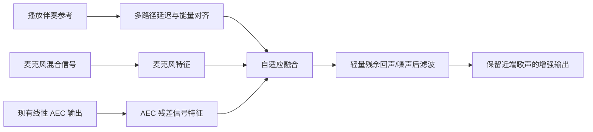
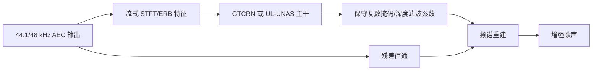

# 端侧 K 歌实时降噪与 AEC 残余伴奏抑制：SOTA 调研与解决方案

## 任务参数

- 调研日期：2026-08-03
- 检索年份：2022-2026
- 输出数量：Top 20
- 核心任务：手机端 K 歌流式降噪，同时抑制 AEC 未消除的伴奏残留，并优先保证歌声/语音不受损伤
- 模型限制：参数量 `<100M`；工程选型进一步优先 `<1M` 参数、可流式、可导出 ONNX/TFLite/Core ML 的路线
- 当前强基线：GTCRN、UL-UNAS、FastEnhancer、DPDFNet、DeepFilterNet3、DeepVQE、Align-ULCNet

## 一句话结论

**不要把这个任务当成普通单通道降噪。** K 歌 App 通常可以取得正在播放的伴奏参考信号，最稳妥路线是保留现有线性 AEC，将 `麦克风信号 + 伴奏参考 + AEC 输出` 送入轻量参考条件残余抑制网络，再串接一个保守全带降噪器；训练中显式加入纯净歌声恒等映射、双讲保护和动态残余目标，避免模型为了“更干净”把歌声泛音、气声和尾音一起切掉。

## 需求转译

| 用户需求 | 工程化定义 | 验收重点 |
|---|---|---|
| 常规噪声 | 稳态/非稳态噪声、设备底噪、风噪、房间混响 | BAK 提升、噪声衰减、无音乐噪声伪影 |
| AEC 残余伴奏 | 外放伴奏经设备非线性、房间响应、时变延迟后泄漏到麦克风 | ERLE/AECMOS、残余伴奏可辨识度、双讲人声保持 |
| 实时端侧 | 流式状态固定、有限 look-ahead、低内存、移动端可导出 | RTF、算法延迟、MACs、峰值内存、包体 |
| 歌声/语音不损伤 | 音高、谐波、齿音、气声、尾音、颤音和歌词可懂度保持 | F0/voicing、MR-STFT、SI-SDR、歌词 WER、主观 ABX |

## 当前数据审计

- 已发现 8 个可用音频文件，总时长 `576.486` 秒，约 `9.61` 分钟。
- 全部为单声道；采样率为 44.1 kHz 或 48 kHz。
- `data1/` 包含 5 个设备底噪/纯干声/外放吵闹案例；`data2/` 包含 3 个 AAC 录音。
- 详细机器可读清单见 `plan/00_测试数据清单.json`。

### 当前数据能证明什么

- 能用于检查模型是否可读入真实 44.1/48 kHz 手机录音。
- 能用于无参考主观试听、频谱观察、运行速度和异常稳定性测试。
- 能作为失败样例库，观察底噪、外放伴奏残留和不同设备增益差异。

### 当前数据不能证明什么

- 没有同步的播放伴奏参考，无法验证参考条件 AEC 残余抑制。
- 没有同内容干净近端歌声，无法计算真实 SI-SDR、SDR、STOI、F0 偏差和歌声损伤。
- 没有现有 AEC 输入/输出成对数据，无法定位损伤来自线性 AEC 还是神经后处理。
- 样本只有约 9.61 分钟，不能证明设备、歌手、歌曲、噪声和外放音量上的鲁棒性。

## 资料检索证据矩阵

| 来源 | 发现内容 | 能证明什么 | 不能证明什么 | 官方性/可信度 |
|---|---|---|---|---|
| [LMPAN 论文](https://arxiv.org/abs/2607.02062) | 0.48M 参数、126M MACs；多路径对齐、参考/麦克风融合、动态目标残余；40 款手机真实回声数据 | 参考条件轻量联合 AEC+NS 可实时；不过度消除有利于双讲和下游语音 | 未公开官方代码和权重；论文统一到 16 kHz | 论文作者官方，一手证据 |
| [Align-ULCNet 论文](https://arxiv.org/abs/2410.13620) | 0.69M 参数、0.10 GMAC；线性 AEC 后接对齐和 ULCNet | 低复杂度混合式 AEC 残余抑制可达到强 AECMOS | 未找到官方训练/推理代码；仍是 16 kHz 语音场景 | 论文作者官方，一手证据 |
| [Task Splitting 论文](https://arxiv.org/abs/2205.06931) | 将回声消除与噪声抑制拆成两个 DNN 任务，可改善双讲和近端单讲质量 | 两阶段结构比单个“全都做”的网络更容易保护近端人声 | 不是 K 歌数据，也没有直接移动端 SDK | 论文作者官方，一手证据 |
| [DeepVQE 论文](https://arxiv.org/abs/2306.03177) | 联合 AEC、NS、去混响；软延迟估计；报告实时推理 | 参考与麦克风的软对齐对时变延迟有效 | 官方未开源完整代码/权重；社区实现不等于论文原版 | Microsoft 论文官方，代码仅非官方复现 |
| [GTCRN 官方仓库](https://github.com/Xiaobin-Rong/gtcrn) | 48.2K 参数、33 MMAC/s；官方 checkpoint、流式代码、ONNX 与社区 LADSPA | 极轻量流式降噪非常适合作为端侧 baseline 和二阶段后滤波器 | 训练数据偏语音，默认 16 kHz，不处理伴奏参考 | 官方代码和权重 |
| [UL-UNAS 官方仓库](https://github.com/Xiaobin-Rong/ul-unas) | 35M MACs、零 look-ahead；官方 checkpoint 和流式 ONNX | 比 GTCRN 更强的超轻量零前视候选 | 默认仍是语音增强，未验证 K 歌伴奏泄漏 | 官方代码和权重 |
| [FastEnhancer 官方仓库](https://github.com/aask1357/fastenhancer) | Tiny 22K/60M MACs，Base 91K/262M MACs；官方 PyTorch/ONNX；含 48 kHz 训练 | 直接提供速度、Mac M1/M5 RTF 和全带训练方案，端侧工程价值高 | 不利用播放参考，不能单独解决强残余伴奏 | 官方代码和权重 |
| [DPDFNet 官方仓库](https://github.com/ceva-ip/DPDFNet) | 8/16/48 kHz、流式、ONNX/TFLite、Hugging Face 权重 | 当前开源项目中移动端交付链最完整，适合作为第一版 48 kHz baseline | 目标是普通降噪，不是参考条件 AEC 残余抑制 | 官方代码、模型和端侧格式 |
| [DeepFilterNet 官方仓库](https://github.com/Rikorose/DeepFilterNet) | 48 kHz、Rust 实时实现、深度滤波和官方模型 | 全带高频保留和实际实时部署经验成熟 | 不是专门为歌声和伴奏残余设计 | 官方代码和权重 |
| [Teaching SE Models to Sing](https://arxiv.org/abs/2607.11630) | 将 SE 迁移到歌声分离；LoRA 增加 6%-12% 参数并缓解遗忘 | 歌声域适配必须显式做；LoRA/混合训练可保护原有语音能力 | 采用 BSRNN/扩散模型，计算量远高于目标端侧模型 | 论文作者官方，一手证据 |
| [SingVERSE 论文](https://arxiv.org/abs/2509.20969) / [官方数据仓库](https://huggingface.co/datasets/yskim3271/SingVERSE) | 真实歌声增强 benchmark；揭示“质量变高但可懂度变差”的激进处理模式；歌声域训练可改善且不损伤语音 | 不能只看 DNSMOS；必须同时看歌词、可懂度和歌声保持 | 数据规模约 4 小时，不能单独承担训练 | 官方论文和数据集 |
| [H-GTCRN 官方仓库](https://github.com/Max1Wz/H-GTCRN) | 双麦低 SNR 轻量增强，已发布代码和 checkpoint | 如果业务可使用双麦，可进一步利用空间信息 | 双麦空间增强不等价于播放参考 AEC | 官方代码和权重 |
| [LiSenNet 官方仓库](https://github.com/hyyan2k/LiSenNet) | 36.8K 参数、106.1M MACs，轻量子带+双路径建模 | 证明极小模型仍可做频带与时间建模 | 官方仓库未提供预训练权重和移动端导出 | 官方代码，未找到官方模型 |
| [LaCo-SENet 官方仓库](https://github.com/yskim3271/LaCo-SENet) | 可配置 look-ahead，面向流式低延迟增强 | 可以按端侧延迟预算调节质量/延迟 | 当前仓库未发现官方 checkpoint；不是 AEC 模型 | 官方代码，模型缺失 |
| [HiFi-Stream 官方仓库](https://github.com/KVDmitrieva/source_sep_hifi) | 流式 GAN 增强，约 0.49M-0.56M 量级配置，官方训练/测试流程 | 可作为高保真轻量增强参考 | 仍以 16 kHz VCTK 为主，复杂度和歌声安全性需重测 | 官方代码和模型脚本 |
| [BSRNN 论文](https://arxiv.org/abs/2212.00406) / [官方代码](https://github.com/sungwon23/BSRNN) | 全带高保真 SE 和歌声/音乐分离都验证有效 | 频带分割对歌声高频与伴奏分离有价值 | 原模型计算量较高，不适合作为第一版手机实时主干 | 官方论文和代码 |
| [FRCRN 官方模型](https://modelscope.cn/models/iic/speech_frcrn_ans_cirm_16k) | ModelScope 提供实时语音降噪模型和推理入口 | 可作为普通 NS 对照 baseline | 官方说明麦克风中的音乐会被抑制，直接用于 K 歌存在明显歌声/音乐损伤风险 | 官方模型页 |
| [MossFormer2 SE 48K](https://github.com/modelscope/ClearerVoice-Studio) | 48 kHz 高质量增强和公开权重 | 可作为离线质量上界和教师模型 | 模型/运行内存明显偏大，不适合作为手机实时第一版 | 官方代码和权重 |
| [FullSubNet+](https://github.com/hit-thusz-RookieCJ/FullSubNet-plus) | 全带/子带融合的强语音增强 baseline | 可作为频带建模和损失设计参考 | 工程复杂度高于超轻量路线，歌声域需重训 | 官方代码；未找到官方 Hugging Face/ModelScope 模型 |
| [AnyEnhance](https://arxiv.org/abs/2501.15417) / [UniPASE](https://arxiv.org/abs/2604.14606) | 通用高保真生成式增强，强调语义和声学保真 | 可作为主观质量与歌声域能力的上界参考 | 生成式链路太重且存在幻觉风险，不满足第一版实时端侧约束 | 官方论文/项目，非落地主线 |

## Top 20 总览

| 排名 | 名称 | 年份 | 任务相关性 | GitHub | Hugging Face | ModelScope | 强基线判断 | 结论 |
|---:|---|---:|---|---|---|---|---|---|
| 1 | LMPAN | 2026 | AEC+NS 直接相关 | 未找到官方代码 | 未找到官方模型 | 未找到 | AECMOS 强于 DeepVQE-S/Align-ULCNet | 最接近目标，但需自行复现 |
| 2 | Align-ULCNet | 2024/2025 | AEC 残余直接相关 | 未找到官方代码 | 未找到官方模型 | 未找到 | 0.69M/0.10 GMAC 强轻量基线 | 结构值得复刻 |
| 3 | GTCRN | 2024 | 轻量 NS | ✅ 官方代码 | 社区 Space/ONNX | 未找到 | 极低参数与 MACs | 第一优先 baseline |
| 4 | FastEnhancer | 2026 | 流式全带 NS | ✅ 官方代码/模型 | 未找到官方模型 | 未找到 | 速度/质量权衡优于多种轻量模型 | 48 kHz 工程首选之一 |
| 5 | DPDFNet | 2025/2026 | 流式全带 NS | ✅ 官方代码 | ✅ 官方模型 | 未找到 | TFLite/ONNX/48 kHz 完整 | 最快形成端侧闭环 |
| 6 | UL-UNAS | 2026 | 零前视轻量 NS | ✅ 官方代码/模型 | 未找到官方模型 | 未找到 | 35M MACs、强于 GTCRN/LiSenNet | 16 kHz 超轻量首选 |
| 7 | DeepFilterNet3 | 2023 | 全带实时 NS | ✅ 官方代码/模型 | 未找到官方模型 | 未找到 | 48 kHz Rust 实时成熟 | 部署成熟度高 |
| 8 | Teaching SE Models to Sing | 2026 | 歌声域适配直接相关 | 未找到官方代码 | 未找到官方模型 | 未找到 | LoRA 保护原能力 | 决定训练策略 |
| 9 | SingVERSE | 2025 | 歌声增强评测直接相关 | ✅ 官方代码入口 | ✅ 官方数据 | 未找到 | 揭示质量/可懂度冲突 | 决定评测门禁 |
| 10 | DeepVQE | 2023 | AEC+NS+去混响 | 仅非官方复现 | 仅非官方模型 | 未找到 | AEC/DNS 强，但复杂 | 教师/结构参考 |
| 11 | H-GTCRN | 2025 | 双麦低 SNR | ✅ 官方代码/模型 | 未找到官方模型 | 未找到 | 轻量双通道增强 | 双麦设备候选 |
| 12 | LiSenNet | 2024 | 极轻量 NS | ✅ 官方代码 | 未找到官方模型 | 未找到 | 36.8K/106.1M MACs | 结构对照 |
| 13 | LaCo-SENet | 2026 | 可配延迟 NS | ✅ 官方代码 | 未找到官方模型 | 未找到 | 延迟/质量可调 | 延迟研究参考 |
| 14 | HiFi-Stream | 2025 | 高保真流式 NS | ✅ 官方代码入口 | 未找到官方模型 | 未找到 | 小模型 GAN 增强 | 质量候选，需防伪影 |
| 15 | Task Splitting | 2022 | AEC/NS 任务拆分 | 未找到官方代码 | 未找到官方模型 | 未找到 | 双讲保护优于单网络 | 决定总体架构 |
| 16 | BSRNN-SE | 2022/2023 | 全带高保真/歌声 | ✅ 官方代码 | 仅社区模型 | 未找到 | 高质量强基线 | 教师与离线上界 |
| 17 | FRCRN | 2022 | 普通实时 NS | ✅ 官方代码入口 | 未找到官方模型 | ✅ 官方模型 | 强普通 NS | K 歌音乐损伤风险高 |
| 18 | MossFormer2 SE 48K | 2023/2024 | 全带高质量 NS | ✅ 官方代码 | ✅ 官方模型 | ✅ 官方模型 | 高质量但较重 | 离线教师，不端侧直上 |
| 19 | FullSubNet+ | 2022 | 全带/子带融合 NS | ✅ 官方代码 | 未找到官方模型 | 未找到 | 经典强 SE 基线 | 结构参考，非首选部署 |
| 20 | AnyEnhance / UniPASE | 2025/2026 | 通用高保真增强 | ✅ 官方项目入口 | ✅ 官方模型/Space | 未找到 | 主观质量上界 | 太重且有幻觉风险 |

## Top 方法深度解析

### 1. LMPAN：最接近业务需求的论文路线

- 输入：麦克风频谱、线性 AEC 输出、远端/播放参考。
- 主干：多路径延迟/能量对齐、注意力融合、轻量后滤波。
- 训练：两阶段 SSL 一致性训练；动态目标保留受控残余，而不是把所有干扰硬清零。
- 规模：0.48M 参数、126M MACs；AEC Challenge 2023 的综合 MOS 达到 4.49。
- 价值：论文直接证明“强消除”不是唯一目标；在双讲下保留近端语音比单纯追求 ERLE 更重要。
- 缺陷：没有官方代码，16 kHz；需要把方法迁移到 44.1/48 kHz 歌声。

#### 信号流



### 2. GTCRN / UL-UNAS：最适合快速起跑的超轻量主干

- GTCRN 已提供训练权重、流式状态和 ONNX，48.2K 参数、33 MMAC/s。
- UL-UNAS 进一步做到约 35M MACs、零 look-ahead，并提供流式 ONNX。
- 价值：可以把它们的编码器/时序主干改造成参考条件残余抑制器，而不是从大模型开始缩减。
- 缺陷：原训练目标是普通语音增强；直接处理 K 歌会把伴奏和歌声谐波混在一起判断。

#### 信号流



### 3. FastEnhancer / DPDFNet / DeepFilterNet：48 kHz 端侧工程路线

- FastEnhancer：提供 Tiny/Base 到 Large 多档模型、官方 ONNX 和 48 kHz 配置，便于测速度/质量 Pareto。
- DPDFNet：官方直接提供 TFLite、ONNX、8/16/48 kHz 模型，是最快完成手机端实测的项目。
- DeepFilterNet：48 kHz Rust 实时链路成熟，深度滤波对全带细节更友好。
- 推荐：先用 DPDFNet/DeepFilterNet 跑通真实端侧基准；最终主干再根据歌声损伤和速度决定是否换 FastEnhancer。

### 4. SingVERSE + SE2SVS：防止“语音降噪模型把歌唱坏”

- SingVERSE 显示，部分模型虽然提高感知分数，却会明显降低内容可懂度；NSNet2 等出现过激进处理聚类。
- `Teaching Speech Enhancement Models to Sing` 显示，直接全量微调会遗忘原有语音增强能力；LoRA 或 speech+singing 混合训练更稳。
- 本项目应采用歌声域混合训练，同时保留至少 30%-50% 纯净语音/歌声恒等样本，禁止只在强噪数据上训练。

## 推荐解决方案

### 方案 A：两阶段参考条件轻量链路（推荐）

1. 保留现有线性 AEC，不替换成熟回声路径估计。
2. 第一阶段加入 `Reference-RES`：输入播放伴奏参考、麦克风和线性 AEC 输出，负责时延对齐、非线性回声与残余伴奏抑制。
3. 第二阶段加入保守 `Full-band NS`：只处理常规噪声和残余伪影，主干从 GTCRN、FastEnhancer、DPDFNet 或 DeepFilterNet 中选择。
4. 对纯净近端歌声设置 bypass/identity 约束；模型置信度低时减小抑制强度，而不是硬切频谱。

**优点：** 根因对应清晰；每阶段可单独验证；便于判断歌声损伤来自 AEC 还是 NS；模型总参数可轻松控制在 1M-5M 以内。

**缺点：** 需要拿到同步播放参考和线性 AEC 输出；训练数据构造比普通 NS 更复杂。

### 方案 B：单个联合 AEC+NS 网络

参考 LMPAN/DeepVQE，把对齐、AEC、NS、去混响放入一个模型。

**优点：** 理论上质量上限高，状态和部署入口统一。

**缺点：** 数据要求高，问题归因困难，更容易为了总损失牺牲双讲歌声；官方代码缺失，不适合第一版。

### 方案 C：纯单通道歌声/伴奏分离

使用 BSRNN、MossFormer2 或音乐分离模型直接从麦克风中抽取歌声。

**优点：** 不要求伴奏参考。

**缺点：** 实时性和稳定性差；同一首歌的歌声与伴奏高度相关，容易伤害人声；不应作为有播放参考时的主路线。

## 推荐的第一版模型规格

| 项目 | 首版目标 | 淘汰门槛 |
|---|---|---|
| 输入 | 44.1/48 kHz 单声道麦克风、同步伴奏参考、现有 AEC 输出 | 缺任一信号时明确降级为普通 NS |
| 帧长/帧移 | 20-32 ms / 10-16 ms | 总算法延迟 >50 ms |
| 参数量 | 优先 `<1M`，最多 `<5M` | `>=100M` 直接淘汰 |
| 计算量 | 优先 `<300M MAC/s`，首轮允许 `<500M MAC/s` | 目标手机 RTF `>=1` |
| 模型格式 | PyTorch 训练，ONNX 验证，TFLite/Core ML/NNAPI 最终部署 | 依赖手机端不支持算子且无替代 |
| 输出策略 | 复数掩码/深度滤波 + 输入残差直通 | 纯生成式重建作为第一版 |
| look-ahead | 0-16 ms | >32 ms 且无明显质量收益 |

## 训练数据设计

### 每条训练样本必须包含

```text
nearend_clean_singing     # 干净近端歌声/语音
playback_reference       # App 实际播放前的伴奏参考
microphone_mixture       # 扬声器、房间、设备非线性、环境噪声和近端歌声混合
linear_aec_output        # 当前线上 AEC 输出
target_output            # 允许保留受控残余、但不得伤害近端歌声的目标
metadata                 # 设备、音量、延迟、SNR、SER、歌手/歌曲和场景标签
```

### 数据来源优先级

1. 真实手机闭环录制：不同手机、扬声器音量、持机方式、房间和延迟抖动。
2. 使用干净歌声 stem + 伴奏 stem 做可控模拟，叠加真实测得的扬声器/房间/设备非线性响应。
3. AEC/DNS 公开数据用于普通语音和噪声补充，不能替代 K 歌歌声数据。
4. SingVERSE、MUSDB18-HQ、MoisesDB 等用于歌声域评测或适配时，必须遵守各自许可证。

## 损失函数与人声保护

```text
L = L_complex_spectrum
  + L_multi_resolution_STFT
  + L_SI_SDR
  + L_F0_and_voicing_preservation
  + L_clean_identity
  + L_echo_residual_control
  + L_optional_SSL_consistency
```

- `L_clean_identity`：输入已经干净或只有轻微噪声时，输出必须接近输入。
- `L_F0_and_voicing_preservation`：保护高音、颤音、气声和弱尾音，不让模型只优化普通说话声。
- `L_echo_residual_control`：目标不是无限 ERLE；按 SER 档位保留受控残余，避免双讲过度抑制。
- `L_optional_SSL_consistency`：只在训练期使用教师表征，不增加端侧推理成本。

## 评测与发布门禁

### AEC/残余伴奏

- AECMOS：双讲 echo/degradation MOS、远端单讲 echo MOS。
- ERLE：只在远端单讲统计，不能拿它掩盖双讲人声损伤。
- SER 改善：按输入 SER 档位分层。
- 伴奏可辨识度：音乐指纹/旋律相关性只作为辅助，最终必须人工试听。

### 歌声保护

- 干净歌声输入时的 SI-SDR/SDR 变化。
- F0 RMSE、voicing recall、音高轮廓相关性。
- 多分辨率频谱距离和高频能量保持。
- 歌词 ASR WER/CER、说话人/歌手 embedding 相似度。
- 主观 ABX：重点听齿音、气声、颤音、高音、尾音和混响尾部。

### 实时性

- 目标手机大核/小核分别测试 RTF、P50/P95 单帧耗时、峰值内存、温升和连续 10 分钟稳定性。
- 输入顺序固定；单模型常驻推理线程，音频 I/O 与特征准备可并行但不得打乱状态。
- 首版至少覆盖 44.1 kHz 与 48 kHz，不允许只在 16 kHz PC 数据上宣称端侧可用。

## 最小验证闭环

### 阶段 0：补齐可评测数据

- 从现有 App 导出三路同步信号：播放伴奏参考、麦克风原始输入、线性 AEC 输出。
- 至少增加 20 条可控近端干净歌声，并生成不同 SNR/SER/外放音量的闭环混合。
- 当前 `data*` 样本保留为真实失败集，不用于宣称客观提升。

### 阶段 1：普通 NS baseline

- 固定数据，分别跑 GTCRN、DPDFNet 48 kHz、DeepFilterNet3。
- 只比较人声损伤、普通噪声收益和真实 RTF，不改训练参数。
- 选出当前最好 baseline 后锁定。

### 阶段 2：Reference-RES baseline

- 固定第二阶段 NS，只新增参考条件对齐和残余伴奏掩码。
- 第一版使用 GTCRN/UL-UNAS 级别的小主干，不直接复现 DeepVQE 大模型。
- 验证 AECMOS、SER、歌声保持和时变延迟鲁棒性。

### 阶段 3：歌声域适配

- 固定模型结构，只改变训练数据为 speech+singing 混合，并增加 identity/F0 损失。
- 若全量微调导致普通语音退化，改用 LoRA/adapter 或交替训练，不同时改结构。

### 阶段 4：端侧部署

- 固定 checkpoint，依次比较 ONNX、TFLite/Core ML/NNAPI；一次只换一个推理后端。
- 校验流式状态、逐块输出一致性、连续运行、内存和延迟。

## 复现/落地优先级

1. **DPDFNet 48 kHz**：端侧格式最齐，最快建立真实手机速度和听感 baseline。
2. **GTCRN / UL-UNAS**：超轻量且流式代码清楚，适合改造成 Reference-RES 主干。
3. **DeepFilterNet3**：48 kHz 与 Rust 部署成熟，适合作为全带质量 baseline。
4. **FastEnhancer**：官方 48 kHz 与 ONNX 完整，适合第二轮速度/质量替换实验。
5. **LMPAN / Align-ULCNet 结构复刻**：解决残余伴奏的核心，但必须自行实现和做歌声域迁移。

## 论文效果/技术价值优先级

1. **LMPAN**：任务最直接，动态目标与多路径对齐对业务最有启发。
2. **SingVERSE + Teaching SE Models to Sing**：直接回答“为什么语音增强模型会伤歌声、如何适配”。
3. **DeepVQE / Task Splitting**：决定 AEC、NS 和双讲保护的架构边界。
4. **FastEnhancer / UL-UNAS**：代表 2026 轻量流式 SE 的速度/质量前沿。
5. **BSRNN / AnyEnhance / UniPASE**：作为高保真和歌声能力上界，不直接端侧部署。

## 最终建议

- **主路线：方案 A，两阶段参考条件轻量链路。**
- **首个可运行 baseline：DPDFNet 48 kHz 或 DeepFilterNet3 做普通 NS；GTCRN/UL-UNAS 改造为 Reference-RES。**
- **首个训练重点：不是加大模型，而是补齐同步伴奏参考、AEC 输出和干净近端歌声。**
- **首个质量门禁：纯净歌声输入不得出现可感知变化；双讲时不允许以更高 ERLE 换取歌词、音高和尾音损伤。**
- **不推荐：直接用 FRCRN/NSNet2 类普通语音降噪模型强抑制音乐；直接上 BSRNN/MossFormer2/生成式大模型做手机实时。**

## 本轮单变量与修改前后差异

- 本轮单变量：只确定总体架构路线，不同时确定最终网络宽度、损失权重和端侧后端。
- 修改前：需求只有“降噪、去残余伴奏、实时、模型小于 100M、不能伤人声”，缺少可执行信号流和验收门禁。
- 修改后：明确为“线性 AEC + 参考条件残余抑制 + 保守全带 NS”，并定义数据格式、模型预算、训练损失、分阶段 baseline 和端侧验收。
- 回滚方式：如果业务无法提供播放伴奏参考，则回退为普通全带 NS，并明确接受“无法可靠区分歌声与同曲伴奏”的能力上限，不伪装成完整 AEC 残余解决方案。

## 鲁棒性验证状态

**鲁棒性验证不足。** 当前只完成资料、代码入口和 8 条真实音频的媒体属性审计；尚未获得同步参考/干净目标，也尚未运行候选模型，因此不能声称质量、端侧速度或跨设备鲁棒性已经通过。
